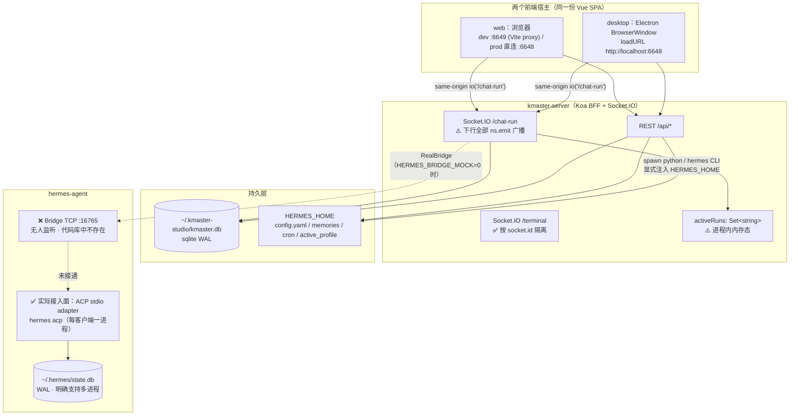

# desktop 版与 web 版并发共用同一 hermes-agent 后端 —— 架构可行性分析

> 结论摘要：**拓扑 A（共用同一 server 实例）可行，且是壳的官方设计路径**；拓扑 B（两个 server 实例）技术上能起但有真实数据损坏面，不推荐。
> ⚠️ 但「同一个 hermes-agent 后端」这个前提**当前在代码上不成立** —— `:16765` 桥接链路既未实现也未运行，server 实测处于 mock 模式。

分析基准：仓库工作树 `d:/Users/towyq/Documents/Projects/kmaster-studio`，hermes-agent 只读快照 `C:\Users\towyq\AppData\Local\hermes\hermes-agent`。

---

## 1. 连接拓扑（实测）



关键：`server` 实测 `bridge_mock: true`，图中虚线链路当前**完全未启用**。

---

## 2. 关键发现（逐条附文件路径与行号）

### 前端 ↔ server

**F1. 前端到 server 是同源相对连接，两个宿主天然汇聚到同一 origin**
`packages/client/src/api/hermes/chat.ts:8` — `socket = io('/chat-run', {...})` 用**相对命名空间**，连接目标恒为「当前页面的 origin」。
- desktop：`packages/desktop/src/main/server-process.ts:154-156` `get url() { return \`http://${SERVER_HOST}:${this.port}\` }`，`SERVER_HOST='localhost'`（`:24`），主进程 `loadURL(handle.url)`（`main/index.ts:317`）→ origin = `localhost:6648`
- web dev：`packages/client/vite.config.ts:15-17` proxy `/api` 与 `/socket.io`（`ws: true`）→ `http://localhost:6648`
- web prod：`packages/server/src/index.ts:38-39` `koaStatic(client/dist)`，SPA 由 server 自己托管 → 同源

**F2. desktop 壳显式支持「复用已在运行的外部 server」——拓扑 A 是官方设计路径，不是 hack**
`packages/desktop/src/main/server-process.ts:206-213`：
```ts
this.emit('probing', `正在检测本机 server（${this.url}）…`);
if (await this.probeHealth(PROBE_TIMEOUT_MS)) {
  // AC6：外部已有健康 server，纯 loadURL，不拉进程、退出时也不 kill
  this.spawnedByMe = false;
  this.emit('reusing', '检测到已在运行的 server，直接复用');
  return { port: this.port, url: this.url, spawnedByMe: false };
}
```
退出侧对称：`:344-350` `if (!child || !owned) { ... this.emit('stopped', '复用的外部 server 保持运行'); return; }`。
`ServerStatusPhase` 里 `'reusing'` 是一等状态（`:37-44`），前端 `desktop-bridge.ts:13-20` 同步了该枚举。

**F3. server 实际 bind `0.0.0.0` 而非 `127.0.0.1`，且 CORS 全开、无鉴权**
`packages/server/src/index.ts:64` — `httpServer.listen(PORT, () => {...})` **省略 host 参数**，Node 默认监听 `::`/`0.0.0.0`。
实测 `netstat -ano` → `TCP 0.0.0.0:6648 LISTENING 34328`（进程 `node.exe packages/server/dist/index.js`）。
同文件 `:65` 的启动日志却打印 `listening on http://127.0.0.1:${PORT}` —— **文案与实际行为不符**。
`:42` `new Server(httpServer, { cors: { origin: '*' } })`。
→ 局域网任意机器可直连，web 版跨机可用；但这也意味着**零鉴权暴露**。

**F4. `/chat-run` 下行是全命名空间广播，不是点对点**
`packages/server/src/run-chat.ts` 全部下行走 `ns.emit(...)`：`:102` run.started、`:116-183` 各类 delta/tool/approval/subagent/compression、`:204` run.completed。
文件头注释第 4-5 行自承设计意图：
> 抽出可复用的 executeRun(ns, req)，下行一律 ns.emit 广播（自动出队的 run 无发起 socket；**本地单用户工具，前端按 session_id 分发，无泄漏面**）

→ 拓扑 A 下 desktop 与 web **都会收到彼此的全部事件**，靠前端按 `session_id` 过滤。不同会话互不干扰；**同一会话则天然镜像**（两端实时看到同一条流，可视为特性）。

**F5. 会话忙判定是进程内内存态 —— 跨 server 实例完全失效**
`packages/server/src/run-chat.ts:20` — `const activeRuns = new Set<string>();`，注释明确「仅当前进程内有效」。
同 session 并发由 F17 队列串行化：`:297-313` `if (activeRuns.has(session_id)) { ... store.enqueue(...) }`。
→ 单 server 内：同 session 自动排队，**并发安全**。跨 server：**该保护完全失效**。

**F6. 终端命名空间按 socket 隔离（与 chat 相反）**
`packages/server/src/terminal-ns.ts:38-39` `const ownerBySession = new Map<string, string>()`（term_id → owner socket id），注释「供 onData / onExit 精准投递（**避免全命名空间广播**）」；`:159 emitToOwner`、`:152 killByOwner(socket.id)`。
→ 拓扑 A 下两端终端互不串台。

### 持久层

**F7. kmaster 自身 DB 两实例默认抢同一文件，且队列位号分配非事务**
`packages/server/src/db.ts:14-17` — `KMASTER_HOME ?? ~/.kmaster-studio` + `kmaster.db`；`:186` `db.pragma('journal_mode = WAL')`。
WAL 支持多进程「多读单写」，better-sqlite3 默认 5s busy timeout，基本读写可用。
但 `:326-338` `enqueue()` 是 `SELECT MAX(position)` → `INSERT` 的**非事务 read-modify-write**，`:349-359` `moveQueueItemToFront()` 同理。
→ 拓扑 B 下两实例同时入队会产生 position 冲突/乱序。

**F8. profile 是全局单值，不按客户端隔离**
`packages/server/src/hermes-proxy.ts:1401-1433` `useProfile()` → `runHermesCli(['profile','use',target])` 写 `<root>/active_profile`；`:263-278` `resolveActiveHermesHome()` 全进程共享，带进程内 memo（`:232`）。
`run-chat.ts:35` `hasActiveRuns()` 供路由层做「有 run 在跑则拒绝切换」。
→ 拓扑 A：一端切 profile **全局影响另一端**，且另一端的 memo 不会失效。拓扑 B：两 server 抢写同一 `active_profile`。

### hermes-agent 侧

**F9. `:16765` 上没有任何东西在监听，且 hermes-agent 代码库里根本不存在这个 TCP bridge**
- `netstat -ano` 无 16765
- `grep -rn "16765" --include=*.py hermes-agent/` 唯一命中 `node_modules/got/readme.md`（无关文本）
- kmaster 自己的文档承认它是**外部**组件：`docs/design/TECHNICAL-SOLUTION-M5.md:603` —
  > `RealBridge` 是连到**外部** Python bridge（`HERMES_AGENT_BRIDGE_ENDPOINT`，默认 `tcp://127.0.0.1:16765`）的 TCP 客户端，且**每次 `chat()` 现连现用**，构造时并不建连。

→ 这是一个**规划中但未实现/未部署**的组件。

**F10. 当前 server 实测处于 mock 模式，根本没连 hermes-agent**
`curl http://localhost:6648/api/health` →
```json
{"ok":true,"service":"kmaster-server","port":6648,"bridge_mock":true,
 "hermes_home":"C:\\Users\\towyq\\AppData\\Local\\hermes",
 "python_ok":true,"hermes_cli_ok":true,"db_kind":"sqlite","terminal_available":true}
```
`packages/server/src/bridge.ts:402-405` — `const mock = (process.env.HERMES_BRIDGE_MOCK ?? '1') !== '0'` → **默认 mock**。
MockBridge（`:99-291`）完全在进程内合成事件，零外部依赖。

**F11. hermes-agent 的真实接入面是 ACP stdio，不是 TCP daemon**
`acp_adapter/entry.py:4` —「stdout is reserved for ACP JSON-RPC transport」
`acp_adapter/entry.py:119` —「Run Hermes Agent as an ACP **stdio** server.」
→ 每个客户端 spawn 一个独立进程，**天然一对一**，不是多路复用的共享后端。「多个客户端并发连同一个 hermes 后端」在 ACP 模型下的等价物是「多个 adapter 进程共享 state.db」。

**F12. hermes 会话状态 = 每进程内存表 + 共享磁盘 SessionDB**
`acp_adapter/session.py:203` — `self._sessions: Dict[str, SessionState] = {}`（**每进程独立**）
`acp_adapter/session.py:3` —「Sessions are persisted to the shared SessionDB (`~/.hermes/state.db`)」
`acp_adapter/session.py:415-419` — `SessionDB(db_path=hermes_home / "state.db")`
→ 「按 session id 索引的全局会话表」**在磁盘层面存在**，但内存态每进程一份。

**F13. hermes 侧对同一 session 的跨进程并发写**无保护**，且持久化语义是破坏性全量替换**
`acp_adapter/session.py:422-427` `_persist()` docstring：
> Creates the session record if it doesn't exist, **then replaces all stored messages with the current in-memory history.**

`acp_adapter/session.py:465-471` 注释进一步说明 `replace_messages()` 的破坏性：
> Calling `replace_messages()` here would then be a redundant double-write that **DELETEs exactly those archived rows**（and, after a compression-driven ...）

代码在**单进程内**小心规避了这个双写，但**跨进程无任何锁**。
→ 两个进程驱动同一 session id 会**互相覆盖对方的历史**。

**F14. 但 hermes `state.db` 本身是明确为多进程设计的**
`hermes_state.py:10` —「WAL mode for concurrent readers + one writer (gateway multi-platform)」
`hermes_state.py:461` —「per process (prevents repair loops and **serialises concurrent** web_server / ...)」
`hermes_state.py:1029` —「(gateway, web_server per-request SessionDB()), a concurrent ...」
→ 多进程共享 state.db 是**受支持的**，前提是**各自操作不同 session id**。

### 代码级缺陷（与拓扑无关，但影响任何并发）

**F15. `RealBridge` 的 `this.sock` 会被并发 chat 相互覆盖 —— 中断/审批会发错会话**
`packages/server/src/bridge.ts:296` `private sock?: net.Socket;`
`:310-311` 每次 chat 都新建连接并覆盖单例字段：
```ts
const sock = await this.connect();
this.sock = sock;
```
而 `:334-342` 的 `interrupt / steer / getSessionTitle / respondApproval / respondClarify / respondPlan` 全部走 `:399` 的 `private send(obj) { this.sock?.write(...) }`。
→ 两个会话并发跑时，`this.sock` 指向**最后一个建连的会话**，对前一个会话的中断/审批/澄清会被发到错误的 socket 上。
**这在单 server 内就已经是缺陷**，一旦真接上 hermes 且允许多会话并行就会暴露。

**F16. desktop 有单实例锁，但不阻止额外 web 客户端**
`packages/desktop/src/main/index.ts:392-394` — `app.requestSingleInstanceLock()`，第二次启动只聚焦已有窗口。
→ 最多一个 desktop 壳；web 客户端数量不受限。

---

## 3. 拓扑判定

### 拓扑 A：desktop 与 web 共用**同一个** server 实例 —— ✅ **可行，推荐**

web 前端指向 desktop 已起的 `:6648`（或反之：先起独立 server，desktop 启动时自动复用）。

**可行依据**
| 依据 | 出处 |
|---|---|
| 壳原生支持复用外部 server，退出时不 kill | F2（`server-process.ts:206-213, 344-350`）|
| 前端同源相对连接，两宿主天然指向同一 origin | F1（`chat.ts:8`）|
| server 已 bind `0.0.0.0`，跨机 web 直接可达 | F3（`index.ts:64` + netstat）|
| 同一 session 的并发输入被 F17 队列自动串行化 | F5（`run-chat.ts:20, 297-313`）|
| 终端按 socket 隔离，两端互不串台 | F6（`terminal-ns.ts:38-39, 152, 159`）|
| 只有一个进程碰 `kmaster.db` 与 `HERMES_HOME`，无跨进程竞态 | F7 / F8 反面 |

**固有约束（非缺陷，是设计取舍）**
- 事件全广播：两端都收到全部 `/chat-run` 事件，靠前端按 `session_id` 过滤（F4）。同会话即实时镜像。
- 全局单 profile：一端切换会影响另一端（F8）。
- 零鉴权 + `0.0.0.0` + `cors:'*'`：局域网任意人可用（F3）。
- 设置（`default_mode`/`default_model`/`theme`/`locale`）是全局单值，两端共享。

### 拓扑 B：两个独立 server 实例，各自连同一个 hermes-agent —— ⚠️ **能起，但不推荐**

**必须先解决的硬冲突**
1. 端口：第二实例必须改 `PORT`（`index.ts:24` 支持 env）
2. `KMASTER_HOME`：不改则两实例抢同一 `kmaster.db`（F7），队列 position 竞态
3. `active_profile`：两实例抢写同一文件，且各自有独立 memo 缓存（F8）

**即使全部隔离，仍存在的问题**
- `activeRuns` 不共享（F5）→ 同一 session id 可被两个 server **真并发**驱动，F17 队列保护完全失效
- 若 `KMASTER_HOME` 隔离，则两端**看不到彼此的会话列表**，「共用后端」的意义大幅削弱
- 若真接上 hermes：F13 的破坏性全量替换 + 跨进程无锁 → 同 session 历史互相覆盖
- F15 的 `this.sock` 覆盖缺陷在两个进程里各自独立发作

**判定：技术上能跑起来，但收益低于拓扑 A，风险显著更高。仅在「两端严格使用不同 session id 且 `KMASTER_HOME` 隔离」时才勉强安全。**

---

## 4. 最终结论

**能否并发同时使用？**

- **拓扑 A 下：能。** 这是壳明确支持的路径（F2），前端连接模型天然契合（F1），同会话并发被队列串行化（F5），终端隔离（F6）。可以现在就用。

- **但「同一个 hermes-agent 后端」这个前提当前不成立。** `:16765` 无人监听、hermes-agent 代码库里不存在该 TCP bridge（F9）、server 实测 `bridge_mock: true`（F10）。所以现在能并发的是**两个前端共用同一个 mock server**，不是「并发驱动同一个 hermes-agent」。

- **真接通 hermes 之后，并发能力取决于那个尚不存在的 bridge 进程如何实现。** 从 kmaster 客户端侧可以**反推出对它的硬性要求**：`RealBridge.chat()`（`bridge.ts:310`）每次 chat 都新建 TCP 连接，`contextEstimate()`（`bridge.ts:352`）也各开一条并在 2s 后 destroy —— 即**单个 server 内多会话并行就已经要求 bridge 支持多并发连接**。所以「支持并发」不是拓扑 A/B 带来的新增要求，而是 bridge 的基线要求。

**明确标注「未能从代码确认」的点：**
1. 外部 Python bridge（`:16765`）的并发模型 —— 单连接还是多客户端、session 是否按连接绑定、同 session 双连接写入是否有保护。**该进程不在 hermes-agent 仓库内，也未在运行，无法从代码确认。**
2. 该 bridge 与 ACP adapter（F11）是什么关系 —— 是 ACP stdio 的 TCP 包装器，还是直接调 `run_agent.AIAgent` 的独立实现。**未能从代码确认。**
3. hermes 侧是否存在跨进程的 session 级文件锁（`state.db` 之外）。已确认 `state.db` 走 WAL 且为多进程设计（F14），但 `_persist` 的全量替换（F13）在跨进程场景下无保护 —— **是否有更上层的锁未能确认。**

---

## 5. 推荐部署方式

**采用拓扑 A**，两种等价起法：

**方式 1（推荐）：先起独立 server，desktop 自动复用**
```bash
# 终端 1：独立 server
cd packages/server && PORT=6648 node dist/index.js
# 终端 2：desktop 壳（探活命中 → reusing，退出时不 kill server）
npm run desktop
# 浏览器：直接开 http://<host>:6648
```
优点：server 生命周期与 desktop 解耦，关掉壳不影响 web 端。

**方式 2：desktop 先起，web 蹭它的 server**
```bash
npm run desktop           # 壳 spawn 内置 server
# 浏览器：http://localhost:6648（prod）或 http://localhost:6649（dev，Vite proxy）
```
缺点：退出 desktop 会 kill 掉 server（`stopServer():352-382`），web 端断线。

---

## 6. 风险清单

| # | 风险 | 触发条件 | 依据 | 严重度 |
|---|---|---|---|---|
| R1 | 零鉴权暴露到局域网 | 拓扑 A/B，任何时候 | F3（`index.ts:64` bind 0.0.0.0 + `:42` cors `*`）| **高** |
| R2 | 同一会话两端事件镜像，用户误以为「消息发重了」 | 拓扑 A + 两端开同一 session | F4（`run-chat.ts` 全 `ns.emit`）| 中 |
| R3 | 一端切 profile 静默影响另一端 | 拓扑 A，任一端改 profile | F8（`hermes-proxy.ts:1401-1433`）| 中 |
| R4 | 方式 2 下关 desktop 导致 web 端断线 | 拓扑 A 方式 2 | `server-process.ts:352-382` | 中 |
| R5 | 队列 position 竞态、会话列表错乱 | **拓扑 B** 且未隔离 `KMASTER_HOME` | F7（`db.ts:326-338, 349-359`）| **高** |
| R6 | 同 session 被两 server 真并发驱动 | **拓扑 B** | F5（`run-chat.ts:20`）| **高** |
| R7 | hermes 会话历史被互相覆盖 | **拓扑 B** + 真实 bridge 接通 | F13（`session.py:422-427, 465-471`）| **高** |
| R8 | 中断/审批发到错误会话 | 任意拓扑 + 真实 bridge + 多会话并行 | F15（`bridge.ts:296, 310-311, 399`）| **高** |
| R9 | web 端触发的终端 pty 跑在 server 宿主机上 | 拓扑 A/B + web 端开终端 | F6（`terminal-ns.ts`）| 中（安全语义）|
| R10 | 启动日志误导排障（写 127.0.0.1 实为 0.0.0.0） | 任何时候 | F3（`index.ts:65`）| 低 |

---

## 7. 最小改动建议

**若只做拓扑 A（推荐路径），P0 只有一条：**

**M1（P0）修正 bind 与日志，把暴露面变成显式选择** — `packages/server/src/index.ts:64-66`
```ts
const HOST = process.env.HOST ?? '::1';   // 默认回到真正的本机回环
httpServer.listen(PORT, HOST, () => {
  console.log(`[kmaster-server] listening on http://${HOST}:${PORT} (bridge mock=${process.env.HERMES_BRIDGE_MOCK ?? '1'})`);
});
```
需要跨机 web 访问时显式 `HOST=0.0.0.0`。同时把 `:42` 的 `cors:{origin:'*'}` 收敛为可配白名单。
（消解 R1 + R10；这条改动本身也让「web 版跨机使用」从隐式副作用变成明确开关。）

**M2（P1）修复 `RealBridge` 的 socket 覆盖** — `packages/server/src/bridge.ts:296, 310-311, 399`
把单例 `this.sock` 改为 `private socks = new Map<string, net.Socket>()`，按 `sessionId` 存取；`send()` 增加 `sessionId` 参数定向投递；chat 结束时清理。
（消解 R8。**与拓扑无关，是接通真实 bridge 前的必修项。**）

**M3（P2）会话级「独占/镜像」提示** — 前端侧
`/chat-run` 已广播 `run.started`（`run-chat.ts:102`）。前端可据此在「另一宿主正在该会话跑 run」时显示只读镜像态提示，零后端改动。
（缓解 R2。）

**若坚持拓扑 B，额外必须做：**

**M4（P0）** 强制隔离 `KMASTER_HOME` + `PORT`，并在启动时检测同 `KMASTER_HOME` 的另一实例（`kmaster.db` 旁放 pid lock），命中则拒绝启动。（消解 R5）

**M5（P0）** `activeRuns` 从进程内 `Set` 提升为 `kmaster.db` 中带 TTL 的行级锁，跨实例共享忙判定。（消解 R6）

**M6（P0，需 hermes 侧配合）** bridge/ACP 层引入 session 级跨进程锁，或改为「按 client id 分配独立 session 命名空间」。（消解 R7）

> M4–M6 的总工作量显著超过直接采用拓扑 A —— 这也是判定「拓扑 B 不推荐」的核心理由。
