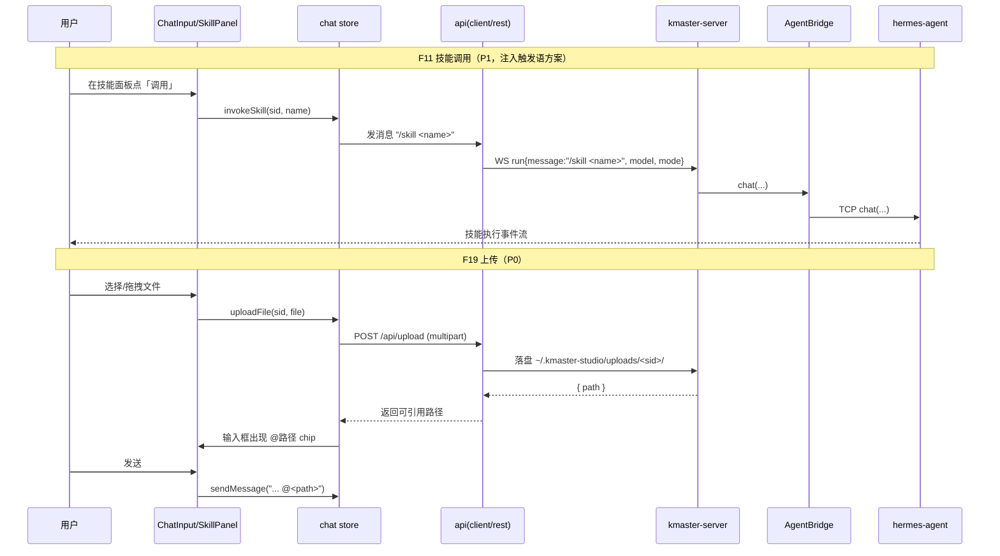

# 需求文档 · M3（F8 / F9 / F11 / F12 / F19）

> 里程碑：M1（F1-F3 聊天闭环）、M2（F4/F5/F6/F7/F10 卡片/会话/Artifact）已完成并验证。M3 在既有三栏 WorkBuddy 式主界面上补齐「管理面」：模式、模型、技能、MCP、上传。
> 关联：TECHNICAL-SOLUTION-M3.md（架构师产出）、TEST-PLAN-M3.md、REQUIREMENT-M2.md。
> 范围说明：本文件**仅描述 M3 增量变更**，不重写 M1/M2 既有功能。所有 UI 对齐 WorkBuddy 桌面端；凡与 WorkBuddy 不一致之处均标 **「待用户审核」**。

## 0. M3 增量范围一览

| 功能 | 编号 | 一句话说明 | 优先级 | M1/M2 现状 |
|------|------|-----------|--------|-----------|
| 模式切换 | F8 | 切换 hermes-agent 运行模式（Craft/Plan/Ask 等） | P0 | `StartRunRequest` 已有 `instructions?`，尚无 mode 概念 |
| 模型选择 | F9 | 选择本次/会话 LLM 模型 | P0 | `StartRunRequest` 已有 `model?` 字段，但前端无选择 UI、无枚举来源 |
| 技能浏览与调用 | F11 | 浏览 ~175 个技能并触发调用 | P0（浏览）/ P1（调用） | 无 |
| MCP 连接器管理 | F12 | 列出/添加/移除/测试 MCP server | P1 | 无 |
| 文件上传 | F19 | 向会话上传文件供 agent 读取 | P0（基础）/ P1（增强） | 无；`sendMessage` 仅纯文本 |

> 参考约束（来自 README / research）：UI 几乎等同 WorkBuddy；所有写 hermes 数据的操作只经 CLI（`hermes config set` 等）或 `~/.hermes` 用户目录，不改源码；视图零网络调用（views → stores → api → server）。

---

## 1. 总体布局变更（对齐 WorkBuddy 底部输入区 + 侧栏管理面板）

M3 不改 M2 的三栏骨架（`SessionList` 260px / `ChatPanel` 1fr / `ArtifactPanel` 340px），仅：

1. **`ChatInput` 底部输入区**新增一条「工具条」，**对齐 WorkBuddy 底部输入区**（模式 + 模型 + 连接器 + @文件 + 队列 + 停止）。布局示意：

```
┌──────────────────────────────────────────────────────────────┐
│ [模式 ▾] [模型 ▾]  [⚡技能]  [📎@文件]   [📥队列 P2]      [⏹停止] │  ← 新增工具条（对齐 WorkBuddy 底部输入区）
│ ┌──────────────────────────────────────────────────────────┐ │
│ │  textarea …（Enter 发送 / Shift+Enter 换行 / 运行中=引导）  │ │
│ └──────────────────────────────────────────────────────────┘ │
│  UsageBar（token/费用）                                        │
└──────────────────────────────────────────────────────────────┘
```

2. **技能 / MCP 管理面板**：以「右侧抽屉（Drawer）」承载，对齐 WorkBuddy 的「技能面板 / MCP 连接器管理」。**已决议：Drawer（见 R-M3-3）**，由底部工具条按钮打开。

> 注：以上底部工具条与 WorkBuddy 同款区域对齐；若最终采用与 WorkBuddy 不同的排布（例如把技能/MCP 放进左侧导航），须先经用户审核。

---

## 2. 功能需求

### 2.1 F8 模式切换

**用户故事**：作为用户，我希望在底部一键切换 agent 的运行模式（如 Craft / Plan / Ask），使 agent 在该模式下执行（例如 Plan 模式先出计划再执行、Ask 模式遇关键操作先问我），从而控制自治程度。

**功能要点**
- FR8.1 底部工具条提供「模式」下拉，列出可选模式；选中后作用于**当前会话后续所有 run**。
- FR8.2 模式选择需持久化到会话（`sessions` 表新增 `mode` 列），切换会话/刷新后恢复。
- FR8.3 每次 `run` 上行时携带当前模式（**已决议：扩展 `StartRunRequest.mode` 字段透传**，非 instructions 注入 → 见 R-M3-1）。
- FR8.4 Mock 模式下，下拉可选且回显当前模式即可（真实 gating 由 RealBridge 接 hermes-agent）。

**交互 / UI 草图（对齐 WorkBuddy）**
- 位置：底部输入区左起第一项 `[模式 ▾]`，**对齐 WorkBuddy 的底部模式选择区**。
- 行为：点击展开模式列表（Craft / Plan / Ask …），选中后按钮显示当前模式名。
- ✅ **已决议（R-M3-1）**：UI 用 WorkBuddy 标签 **Craft / Plan / Ask**，按自主度映射到 hermes ACP 编辑审批 mode 令牌：**Craft→`dont_ask`、Plan→`accept_edits`、Ask→`default`**（依据 `acp_adapter/server.py:624` 权威语义：`default`=Ask before edits / `accept_edits`=Auto-allow workspace & /tmp / `dont_ask`=Auto-allow this session）。以 `mode` 字段透传。

**优先级**：P0（选择 + 持久化 + 透传）。

---

### 2.2 F9 模型选择

**用户故事**：作为用户，我希望为本次会话挑选 LLM 模型（如不同厂商/规格），并随时切换，从而匹配任务与成本。

**功能要点**
- FR9.1 底部工具条提供「模型」下拉，**选项来自后端动态枚举**（非前端写死清单）。
- FR9.2 模型列表数据来源：hermes-agent 的 provider inventory（`hermes_cli.inventory.build_models_payload`；ACP `SessionModelState` 亦由此构建）。需新增枚举端点（REST `GET /api/models` 或 WS 下行 `models.list`）→ 见 R-M3-2。
- FR9.3 选中后：① 持久化到会话（`sessions` 表新增 `model` 列）；② 经既有 `StartRunRequest.model` 字段随 `run` 透传；亦可在运行中经 `AIAgent.switch_model(...)`（run_agent.py:820）实时切换（P1）。
- FR9.4 显示当前模型名；加载中/失败有空态与错误提示。

**交互 / UI 草图（对齐 WorkBuddy）**
- 位置：底部输入区 `[模型 ▾]`，**对齐 WorkBuddy 的模型下拉**。
- 行为：展开显示「厂商 / 模型」二级或分组列表（含当前模型高亮）；可选搜索（P1）。
- 数据来源明确为**后端动态枚举**（已探真：model 列表由 provider 鉴权态决定，无法前端静态写死）。

**优先级**：P0（选择 + 持久化 + 随 run 透传）；P1（运行中 `switch_model` 热切换、模型搜索）。

---

### 2.3 F11 技能浏览与调用

**用户故事**：作为用户，我希望浏览 hermes-agent 内置的约 175 个技能（按类目、可搜索），并能在会话中快速调用某个技能，从而复用既有能力。

**功能要点**
- FR11.1 提供「技能面板」列出全部技能，每条含 `name` + `description` + `category` + 启用状态；支持按名称/类目搜索（P0 浏览）。
- FR11.2 技能数据来源：后端动态枚举。探真结论：`hermes_cli.banner.get_available_skills()` 可枚举；gateway 已暴露 `{"skills": ...}` RPC（tui_gateway/server.py:18293）；文件系统层面技能按类目目录组织（`skills/<category>/*.md`，含 frontmatter description）。枚举端点建议 `GET /api/skills`（→ 见 R-M3-4）。
- FR11.3 调用方式（P1）：在面板点「调用」→ 向当前会话**注入 `/skill <name>` 触发语**（等价于一条用户消息，由 agent 解析）。**已决议：注入触发语，零协议改动**（R-M3-5）。
- FR11.4 「刷新技能」按钮触发 `Bridge.reloadSkills()`（P1）。

**交互 / UI 草图（对齐 WorkBuddy）**
- 入口：底部工具条 `[⚡技能]` 按钮，打开**技能面板**，**对齐 WorkBuddy 的技能页/技能面板**。
- 面板布局：左侧类目树 / 右侧技能卡片列表（名称 + 描述 + 状态徽标），顶部搜索框。
- ⚠️ **待用户审核**：WorkBuddy 技能含「技能市场」（云端），kmaster 不搬云端专属功能（见 CHANGE-OBJECTIVE 非目标）；本 M3 仅覆盖本地技能浏览/调用，市场部分明确不做。

**优先级**：P0（浏览 + 搜索 + 数据枚举）；P1（调用触发、reload）。

---

### 2.4 F12 MCP 连接器管理

**用户故事**：作为用户，我希望查看已配置的 MCP server、添加新连接器、移除或测试连接，从而扩展 agent 可用工具。

**功能要点**
- FR12.1 提供「MCP 管理面板」列出所有 MCP server，数据来自 hermes-agent 的 `config.yaml` 的 `mcp_servers` 段（后端读取；cli.py:10970 有 config 监听与自动 reload）。
- FR12.2 支持：查看列表与状态、添加（写入 `mcp_servers`）、移除、测试连通性、触发 reload（`tools.mcp_tool` 管理；cli.py:11272 `_reload_mcp`）。
- FR12.3 ⚠️ **写操作约束（关键，已决议）**：kmaster 不得改 hermes 源码。添加/移除**直接读写 `~/.hermes/config.yaml` 的 `mcp_servers`**（经 js-yaml），写入后由 hermes config watcher 自动 reload；**不经 CLI 子进程或 bridge 转发**（run_agent 无 `mcp_add`）。详见 R-M3-6。
- FR12.4 `acp_adapter` 可按会话注册 MCP，M3 先不做按会话隔离（P2）。

**交互 / UI 草图（对齐 WorkBuddy）**
- 入口：底部工具条 `[连接器]`（或设置入口），打开 **MCP 连接器管理面板**，**对齐 WorkBuddy 的 MCP 连接器管理**。
- 面板布局：列表（名称 + 状态点 + 工具数）+「添加连接器」表单（名称/命令/参数/环境变量）+ 行内「测试 / 移除 / reload」。
- ✅ **已决议（R-M3-3）**：技能面板与 MCP 面板均以 **Naive UI `NDrawer`** 承载（对齐 WorkBuddy 抽屉式管理面板），由底部工具条按钮打开；不新增独立路由。

**优先级**：P1（列表 + 添加/移除/测试/reload，受写约束）。

---

### 2.5 F19 文件上传 / @引用

**用户故事**：作为用户，我希望在输入框附加本地文件（拖拽或选择），让 agent 能读取并处理该文件（如分析日志、改图、读文档）。

**功能要点**
- FR19.1 底部工具条 `[📎@文件]` 支持选择/拖拽文件；上传后生成「附件 chip」显示在输入框上方，随消息以 `@路径` 形式引用。
- FR19.2 上传落盘：文件写入 `~/.kmaster-studio/uploads/<session_id>/`（kmaster 自有数据目录，符合「agent 状态在 ~/.hermes、studio 状态在 ~/.kmaster-studio」划分）。
- FR19.3 agent 读取：消息内含文件路径引用，hermes-agent 从磁盘读取（agent 读文件走路径，不依赖特殊端点）。
- FR19.4 ⚠️ **机制（已决议）**：探真确认 `AIAgent.chat` 不接受 `attachments`，后端新增 **`POST /api/upload`（JSON base64 → 落盘 `~/.kmaster-studio/uploads/<sid>/` → 返回绝对路径）**；发送时把 `@<abs path>` 拼进消息文本（**@路径文本注入**），agent 从磁盘读取。无需 bridge 文件通道。详见 R-M3-7。
- FR19.5 多文件、大文件进度、类型校验（P1）；消息气泡内 `@文件` 芯片可点击预览（P1，对齐 WorkBuddy `@文件` 引用）。

**交互 / UI 草图（对齐 WorkBuddy）**
- 入口：底部输入区 `[📎@文件]`，**对齐 WorkBuddy 的 @文件/@引用**。
- 行为：点选或拖拽 → 输入框上方出现附件 chip（文件名 + 移除 ×）→ 发送时把 `@<绝对路径>` 追加进消息文本。
- 该区域与 WorkBuddy 同款一致，无偏离。

**优先级**：P0（选择/拖拽 + 上传落盘 + `@路径` 引用 + 随消息发送）；P1（多文件/进度/类型校验、消息内芯片预览）。

---

## 3. 非功能需求（继承 M2 纪律）

- NFR1 视图零直接网络调用：组件 → store → api → server；上传走 `api/client` 的 REST 封装，枚举类走 store action。
- NFR2 新增 WS 下行事件须进入 `chat.ts` 的 `WS_EVENTS` 全局注册表，按 `session_id` 分发（枚举类若走 REST 则不必进 WS）。
- NFR3 Mock 模式下（默认）F8/F9 选择可回显；F11/F12 列表在无真实后端时可用一份静态快照（见 R-M3-8）演示 UI。
- NFR4 `db` 的 sqlite 与内存实现对同一张表语义一致（新增 `mode`/`model` 列需在两实现同步）。
- NFR5 所有写 hermes 配置的操作（mode 注入、MCP 增删）遵守只读约束，只经 CLI/bridge，不碰 hermes 源码。

---

## 4. 服务端改动拆解（模块级）

| 模块 | 文件 | M3 改动点 | 对应功能 |
|------|------|-----------|----------|
| 协议 | `server/src/protocol.ts` | `StartRunRequest` 增 `mode?`；可选新增下行 `models.list`/`skills.list`/`mcp.updated`（若走 WS）；类型增 `Mode`/`ModelInfo`/`Skill`/`McpServer` | F8/F9/F11/F12 |
| Bridge | `server/src/bridge.ts` | `ChatOptions` 增 `mode?`；`RealBridge.chat` 的 TCP JSON 写入（line ~118）补 `mode` 字段；`MockBridge` 回显 mode；新增 `listSkills()`/`reloadSkills()`/`listMcp()`/`addMcp()`/`removeMcp()`/`testMcp()`（P1，写路径受 R-M3-6 约束） | F8/F9/F11/F12 |
| 编排 | `server/src/run-chat.ts` | `run` 处理中读取并持久化 `mode`/`model`；新增 `skill.invoke` 上行处理（P1）；上传为 REST 不在此 | F8/F9/F11 |
| 持久层 | `server/src/db.ts` | `SessionRow` 增 `mode?`/`model?` 列；两实现（sqlite + 内存）同步；可选 `uploads` 元数据表（P2） | F8/F9/F19 |
| 路由 | `server/src/routes/sessions.ts` | 新增 `GET /api/models`、`GET /api/skills`、`GET /api/mcp`、`POST /api/mcp`（add/test/reload）、`POST /api/upload`；`GET/POST /api/sessions/:id` 回写 mode/model | F9/F11/F12/F19 |

> 枚举类（models/skills/mcp 列表）**已决议走 REST GET**（Management 面非流式，见 R-M3-2 / R-M3-4）；`skill.invoke` 采用注入 `/skill <name>` 触发语（零协议改动），上传走 `POST /api/upload`（REST）。

---

## 5. 前端改动拆解（模块级）

| 模块 | 文件 | M3 改动点 | 对应功能 |
|------|------|-----------|----------|
| 类型 | `client/src/types/chat.ts` | 增 `Mode`、`ModelInfo`、`Skill`、`McpServer`、`UploadRef` 类型 | 全部 |
| Store | `client/src/stores/chat.ts` | 增 `selectedMode`/`selectedModel`（按会话）、`models`/`skills`/`mcpServers` 列表、`uploads`；action：`setMode`/`setModel`/`loadModels`/`loadSkills`/`loadMcp`/`invokeSkill`/`uploadFile`；`WS_EVENTS` 按需补 `models.list` 等 | 全部 |
| API | `client/src/api/hermes/chat.ts` | 增 `setMode`/`setModel`（emit 或随 run 透传）、`invokeSkill`；在 `api/client.ts` 增 REST 封装 `getModels`/`getSkills`/`getMcp`/`postMcp`/`uploadFile` | 全部 |
| 输入区 | `client/src/components/chat/ChatInput.vue` | 新增底部工具条：`ModeSelect` / `ModelSelect` / `SkillTrigger` / `FileAttach` / 队列(P2) / 停止；附件 chip 区 | F8/F9/F11/F19 |
| 技能 | `client/src/components/chat/SkillPanel.vue`（新增） | 类目树 + 卡片列表 + 搜索 + 调用/刷新 | F11 |
| MCP | `client/src/components/chat/McpManager.vue`（新增） | 列表 + 添加表单 + 测试/移除/reload | F12 |
| 消息 | `client/src/components/chat/MessageItem.vue` | 渲染 `@文件` 芯片（P1） | F19 |
| 布局 | `client/src/views/ChatView.vue` | 接入技能/MCP 面板承载（Drawer 或路由） | F11/F12 |

---

## 6. 待确认问题（R 列表 — M3 已全部决议）

> 以下 R 项已由主理人决策 + 架构师探真后**决议**，结论同步写入 `TECHNICAL-SOLUTION-M3.md`。

- **R-M3-1（F8 模式映射，已决议）**：采用 WorkBuddy 三态标签 **Craft / Plan / Ask**；按「自主度」顺序映射到 hermes ACP 编辑审批 mode 令牌（依据 `acp_adapter/server.py:624` 权威语义）：
  - **Craft → `dont_ask`**（最自主：自动接受文件编辑并直接落地）
  - **Plan → `accept_edits`**（中等：自动接受工作区/tmp 编辑，敏感路径仍询问）
  - **Ask → `default`**（最保守：每次编辑/关键操作前都请求批准）
  - 机制：以 `mode` 字段透传（非 `instructions` 注入）；作用域 = **全局默认（`settings` 表）+ 每会话覆盖（`sessions.mode`）**，新会话继承全局默认。
- **R-M3-2（F9 模型枚举通道，已决议）**：走 **REST `GET /api/models`**（管理面非流式，符合 NFR2）；server 经 python 子进程包装 `build_models_payload`，失败回退静态快照。枚举带 provider/auth 态（来自 hermes 数据）。
- **R-M3-3（F11/F12 承载方式，已决议）**：技能面板与 MCP 面板均以 **Naive UI `NDrawer`** 承载（对齐 WorkBuddy 抽屉式管理面板），由底部工具条按钮打开；不新增独立路由。
- **R-M3-4（F11 技能枚举端点，已决议）**：新增 **`GET /api/skills`**；server 包装 `hermes_cli.banner.get_available_skills()`（类目→名称），并经 `tools.skills_tool._find_all_skills` 补全 `description`；失败回退静态快照。
- **R-M3-5（F11 调用方式，已决议）**：面板「调用」= **注入 `/skill <name>` 触发语**（等价于一条用户消息，由 agent 解析），零协议改动；P1 才考虑专用 WS 事件。
- **R-M3-6（F12 写路径约束，已决议）**：kmaster **直接读写 `~/.hermes/config.yaml` 的 `mcp_servers`**（经 `js-yaml`），写入后由 hermes `_check_config_mcp_changes`（`cli.py:10970`，5s 轮询）自动 reload；**不经 bridge 转发**（run_agent 无 `mcp_add` 方法），不修改 hermes 源码。
- **R-M3-7（F19 上传机制，已决议）**：探真结论——**`AIAgent.chat(self, message, stream_callback)` 不接受 `attachments` 参数**（`run_agent.py:6861`，`__init__` 亦无）。故采用 **`@路径` 文本注入**：新增 **`POST /api/upload`**（JSON base64 → 落盘 `~/.kmaster-studio/uploads/<sid>/` → 返回绝对路径），发送时把 `@<abs path>` 拼进消息文本；agent 从磁盘读取。
- **R-M3-8（Mock 演示数据，已决议）**：提供内置静态快照（models / skills / mcp），无真实 hermes 时保证 UI 可演示（NFR3）。
- **R-M3-9（数据持久边界，已决议）**：**全局默认（`settings` 表）+ 每会话覆盖（`sessions.mode`/`sessions.model`）**；新建会话从 `settings` 继承 `default_mode`/`default_model`。

---

## 7. 验收基线（M3）

- AC1 `npm run test -w packages/client` 通过（新增 mode/model/skills/mcp/upload 的 store reducer 与 api）。
- AC2 `vue-tsc` + `vite build`（client）与 `tsc --noEmit`（server）零错误。
- AC3 `scripts/smoke-chat.mjs` 单轮对话内能携带 `mode`/`model` 字段；`GET /api/models`、`GET /api/skills` 返回非空（Mock 快照亦可）。
- AC4 浏览器联调：底部工具条出现 模式/模型/技能/@文件；选模型后发送，server 收到的 `run` 含 `model`；点技能面板能浏览 ~175 技能；MCP 面板列出 `config.yaml` 中的 server；@文件 上传后消息含 `@路径`。
- AC5 真实 Bridge（`HERMES_BRIDGE_MOCK=0`）下，`model`/`mode` 经 TCP 转发至 Python bridge；MCP 增删经 CLI/bridge 生效（手动验收，非 CI）。

---

## 8. 文件清单（M3 变更，供架构师建任务树）

- 改：`server/src/protocol.ts`、`server/src/bridge.ts`、`server/src/run-chat.ts`、`server/src/db.ts`、`server/src/routes/sessions.ts`
- 改：`client/src/types/chat.ts`、`client/src/stores/chat.ts`、`client/src/api/hermes/chat.ts`（及 `api/client.ts`）
- 改：`client/src/components/chat/ChatInput.vue`、`client/src/components/chat/MessageItem.vue`、`client/src/views/ChatView.vue`
- 增：`client/src/components/chat/SkillPanel.vue`、`client/src/components/chat/McpManager.vue`
- 改/增：`scripts/smoke-chat.mjs`、Mock 静态快照
- 文档：`docs/design/{REQUIREMENT,TECHNICAL-SOLUTION,TEST-PLAN}-M3.md`

---

## 附：M3 数据流草图（技能调用 + 上传）


