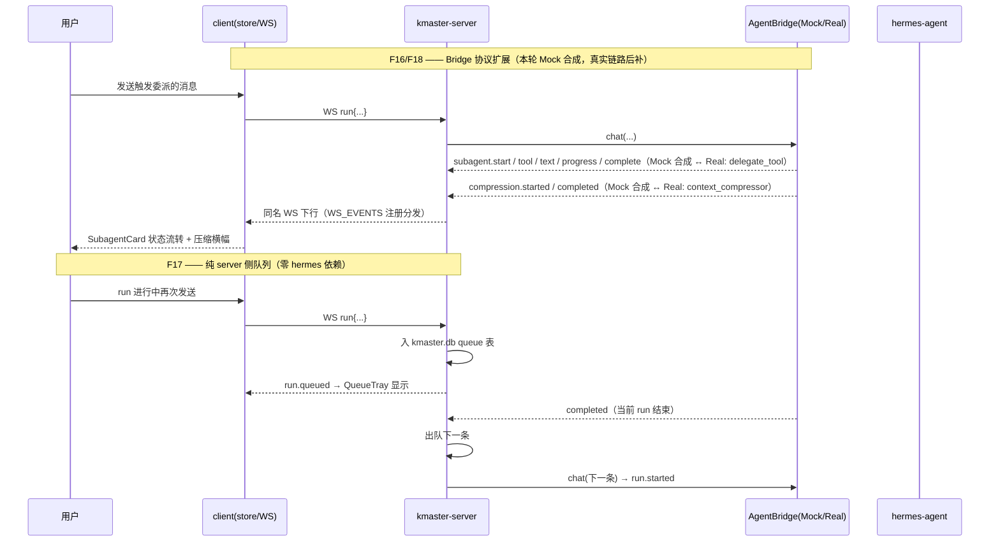

# 需求文档 · M4（F13 / F15 / F16 / F17 / F18 / F22）

> 里程碑：M1（聊天闭环）、M2（卡片/会话/Artifact）、M3（模式/模型/技能/MCP/上传）已完成。M4 补齐「运行时增强面」：记忆、自动化、子代理、队列、压缩、用量。
> 关联：REQUIREMENT-M3.md、TECHNICAL-SOLUTION-M3.md（现有后端结构与 hermes-proxy 范式）、`docs/reference/02-kmaster-studio设计方案.md` §F13/F15/F16/F17/F18/F22。
> 范围说明：本文件**仅描述 M4 相对 M3 的增量变更**，不重写既有功能。

## 0. 已拍板决策（约束全文，不再作为开放问题）

| 编号 | 决策 | 对 M4 的约束 |
|------|------|-------------|
| q-0 | 本轮**一次性实现全部 6 个功能**；F16/F18 强依赖的 `subagent.*` / `compression.*` 事件当前 Bridge 协议**完全没有** | 先扩展 Bridge 协议（protocol.ts + bridge.ts + run-chat.ts）+ Mock 下**合成样例事件**，保证 UI 可渲染；真实 hermes 实时链路后续补齐 |
| q-1 | F13 记忆做**完整 CRUD**（新增/编辑/删除） | 写回必须带**文件锁 + 备份**；存储格式须适配 hermes 实际版本（studio 内唯一直写 hermes 数据的例外） |
| q-2 | 新功能走**独立路由页**（整页渲染），而非右侧预览 Tab | 新增路由：`/memory`、`/jobs`、`/usage`、`/queue`；顶部/侧边导航新增入口；F16 子代理卡片与 F18 UsageBar 仍留在聊天页内 |

## 1. M4 增量范围一览

| 功能 | 编号 | 一句话说明 | 优先级 | M3 现状 |
|------|------|-----------|--------|---------|
| 记忆管理 | F13 | 查看/新增/编辑/删除 hermes 记忆条目 | P0（读）/ P0（CRUD） | 无；`~/.hermes/memories` 目录已探真存在（**非**设计文档写的 `memory`） |
| 自动化任务 | F15 | cron 定时任务列表/CRUD/手动触发/运行历史 | P0 | 无；`hermes cron` CLI 与 `~/.hermes/cron` 目录已探真存在 |
| 子代理 | F16 | 会话内展示子代理委派的目标/进度/产出 | P0（协议+Mock 渲染）/ P1（真实链路） | 无；Bridge 协议无 `subagent.*` 事件（⚠️ 需先扩协议） |
| 消息队列 | F17 | run 进行中追加的消息入队，完成后自动出队 | P0 | `run.queued` 下行事件已在 protocol.ts 声明但无实现；零 hermes 依赖 |
| 上下文压缩/占用 | F18 | 压缩事件提示 + token 占用/上限估算 UsageBar | P0（协议+Mock）/ P1（真实估算） | UsageBar.vue 已存在（仅累计 token/费用）；无 `compression.*` 事件、无 contextEstimate |
| 用量统计 | F22 | 按天/模型/会话聚合 token 与费用 | P0 | `usage.updated` 事件 Bridge **已在转发**（protocol.ts + run-chat.ts），但未持久化、无聚合页 |

## 2. 产品目标（M4 一句话）

把 kmaster-studio 从「可聊可管」升级为「可长期运营」：用户能管理 Agent 的**记忆与定时任务**，看清**子代理并行执行与上下文健康度**，并通过**队列与用量账本**掌控多轮长会话的节奏与成本。

三个正交子目标：
1. **数据资产可管**：记忆（F13）与自动化任务（F15）在独立页面完成完整生命周期管理，不碰 hermes 源码。
2. **运行态可观测**：子代理（F16）、压缩（F18）、用量（F22）的事件流可视化，Mock 与真实链路同一套 UI。
3. **交互不阻塞**：run 进行中消息不丢，进队列（F17）可编辑/重排，完成后自动续发。

## 3. 用户故事

| 编号 | 功能 | 用户故事 |
|------|------|---------|
| US13a | F13 | 作为用户，我想在 `/memory` 页查看 Agent 记住了什么（按分组浏览/搜索），以便理解它的行为依据。 |
| US13b | F13 | 作为用户，我想新增/编辑/删除某条记忆（如过期偏好），且不担心写坏 hermes 数据（有备份可回滚）。 |
| US15a | F15 | 作为用户，我想在 `/jobs` 页创建定时任务（如每天 9 点生成日报），并能手动触发一次验证效果。 |
| US15b | F15 | 作为用户，我想查看任务运行历史与产物会话，失败时能看到原因。 |
| US16 | F16 | 作为用户，当 Agent 委派子代理并行干活时，我想在聊天流里看到每个子代理的目标、实时进度与产出，而不是黑盒等待。 |
| US17 | F17 | 作为用户，在 Agent 忙碌时我想继续输入后续指令——它们进入队列托盘，我可编辑/重排/删除，当前 run 结束后自动逐条发送。 |
| US18a | F18 | 作为用户，我想在输入区看到当前会话 token 占用/上限进度条，接近上限时得到提醒。 |
| US18b | F18 | 作为用户，当自动压缩发生时，我想看到明确提示（开始/完成/释放了多少上下文）。 |
| US22 | F22 | 作为用户，我想在 `/usage` 页按天/模型/会话查看 token 与费用趋势，评估使用成本。 |

## 4. 需求池（P0 / P1 / P2）

> 「依赖/风险」列同时标注实现落点，供架构师直接建任务树。

### P0（Must）

| ID | 功能 | 需求 | 依赖 / 风险 / 落点 |
|----|------|------|-------------------|
| FR13.1 | F13 | `GET /api/memory`：server 读 `~/.hermes/memories` 分组列出条目（id/分组/内容/更新时间） | ⚠️ 目录名已探真为 `memories`（非设计文档的 `memory`）；**存储格式版本相关，实现期须实测**（文件/sqlite/json），优先 `hermes memory` CLI，退化为读目录。复用 `hermes-proxy.ts` 范式 |
| FR13.2 | F13 | `POST/PUT/DELETE /api/memory(/:id)`：完整 CRUD，写回带**文件锁 + 写前备份**（`~/.kmaster-studio/backups/memory/`） | q-1 决策；studio 唯一直写 hermes 数据例外；并发写用锁文件互斥 |
| FR13.3 | F13 | `/memory` 独立路由页：分组列表 + 搜索 + 条目编辑弹窗 + 删除确认 | q-2；新增 `MemoryView.vue` + router 注册 + 导航入口 |
| FR15.1 | F15 | `GET/POST/PATCH/DELETE /api/jobs`：任务 CRUD，一律经 `hermes cron` CLI（避免配置格式漂移） | CLI 已探真存在；⚠️ cron 配置字段格式待实测（见 R-M4-2） |
| FR15.2 | F15 | `POST /api/jobs/:id/run` 手动触发一次；`GET /api/cron-history` 运行历史 | 读 `~/.hermes/cron` 执行记录；历史格式待实测 |
| FR15.3 | F15 | `/jobs` 独立路由页：任务列表（名称/schedule/状态/下次运行）+ 新建表单 + 手动触发 + 历史面板 | 新增 `JobsView.vue` |
| FR16.1 | F16 | **Bridge 协议扩展**：`BridgeEvent` 与 `ServerToClientEvents` 新增 `subagent.start/tool/text/progress/complete`、`delegation.updated`（字段对齐设计方案 §F16 与 hermes-studio 实测事件集） | ⚠️ 当前协议完全没有；改 `protocol.ts` + `bridge.ts` + `run-chat.ts` 三处；前端 `WS_EVENTS` 注册表同步（NFR2） |
| FR16.2 | F16 | MockBridge 在样例 run 中**合成 subagent 事件序列**（start→tool→text→progress→complete，≥2 个并行子代理），驱动 UI 完整渲染 | q-0；样例事件字段须与真实 hermes（delegate_tool / async_delegation）发射的字段名对齐，防止真实链路接入时 UI 返工（见 R-M4-3） |
| FR16.3 | F16 | 聊天流内 `SubagentCard`：每个子代理一张卡（目标/状态/进度/流式产出折叠区），多子代理并列 | 新增 `components/chat/SubagentCard.vue`，`MessageItem/MessageList` 挂接 |
| FR17.1 | F17 | run 进行中收到 `run` 上行 → server 入 kmaster.db 队列表 → 下行 `run.queued`；`run.completed/failed` 后自动出队下一条走 F1 | 纯 server 侧，零 hermes 依赖；`db.ts` 新增 `queue` 表（sqlite + 内存两实现同步，NFR4）；`run-chat.ts` 编排出队 |
| FR17.2 | F17 | 队列托盘 UI（聊天页输入区上方）：列表 + 删除 + 立即发送；`GET/DELETE /api/queue` | `QueueTray.vue`；M3 PRD 中队列按钮占位（P2）在此兑现 |
| FR18.1 | F18 | **Bridge 协议扩展**：新增 `compression.started/completed` 下行事件；MockBridge 在长会话样例中合成压缩事件 | 与 FR16.1 同批改协议三件套；真实 hermes 由 `context_compressor` 发射（发射点/字段待实测，见 R-M4-4） |
| FR18.2 | F18 | UsageBar 增强：显示「已用 token / 上下文上限」进度条 + 压缩事件提示条（开始/完成 toast + 内嵌横幅） | 改既有 `UsageBar.vue`；上限来源 FR18.3 |
| FR18.3 | F18 | 新增 Bridge 方法 `contextEstimate` → `GET /api/sessions/:id/context-length`（结果缓存，run 完成后失效重取） | 新 Bridge 方法（Mock 返回估算值）；缓存避免每次渲染都跑估算 |
| FR22.1 | F22 | `usage.updated` 事件落库：kmaster.db 新增 `usage` 表（session_id/model/input/output/cost/ts），run-chat.ts 转译时同步写入 | 事件已在转发，仅增持久化；⚠️ 当前事件 payload 无 `model` 字段，需在 run-chat 写入时从会话状态补齐 |
| FR22.2 | F22 | `GET /api/usage/stats?group=day|model|session`：聚合查询 | sqlite `GROUP BY`；内存实现同语义 |
| FR22.3 | F22 | `/usage` 独立路由页：汇总卡（总 token/总费用）+ 按天趋势 + 按模型/会话明细表 | 新增 `UsageView.vue`；图表用轻量方案（CSS 柱状/Naive UI 进度条，不引入图表库，见 R-M4-6） |
| FR-NAV | 全局 | 顶部/侧边新增导航（聊天 / 记忆 / 自动化 / 用量 / 队列），router 注册 `/memory` `/jobs` `/usage` `/queue`；`/queue` 页为队列托盘的整页视图（与聊天页托盘同数据源） | q-2；改 `router/index.ts` + `App.vue`（或新增 `AppNav.vue`） |

### P1（Should）

| ID | 功能 | 需求 | 依赖 / 风险 |
|----|------|------|------------|
| FR16.4 | F16 | 真实链路：RealBridge 透传 hermes `delegate_tool` / `async_delegation` 事件；后台任务完成通知（`backgroundPoll` 轮询 + `completeBackgroundNotification` 确认，at-least-once） | 依赖真实 hermes 联调；q-0 明确本轮可后置 |
| FR17.3 | F17 | 队列条目**编辑与拖拽重排** | 托盘基础(FR17.2)之上 |
| FR18.4 | F18 | 需用户决策的压缩：`compression.respond` 上行 + 决策卡片 | 真实 hermes 才有此场景；Mock 可合成演示 |
| FR15.4 | F15 | cron 产物会话出现在 F7 会话导入列表（打通「任务→会话」跳转） | 依赖 M2 会话导入机制 |
| FR13.4 | F13 | 记忆备份列表与一键回滚 | FR13.2 备份机制之上 |

### P2（Nice to have）

| ID | 功能 | 需求 |
|----|------|------|
| FR22.4 | F22 | 用量数据导出 CSV |
| FR16.5 | F16 | 子代理产出一键存为 Artifact（接 F10） |
| FR15.5 | F15 | 任务模板（日报/周报预置 prompt） |

## 5. UI 设计稿（文字 + 结构）

### 5.1 全局导航（q-2 落地）

```
┌────────────────────────────────────────────────────────┐
│ kmaster-studio   [💬聊天] [🧠记忆] [⏰自动化] [📊用量] [📥队列] │ ← 新增顶部导航条（当前页高亮）
├────────────────────────────────────────────────────────┤
│                    <router-view 整页渲染>                 │
└────────────────────────────────────────────────────────┘
```
- `/`（聊天，既有三栏）、`/memory`、`/jobs`、`/usage`、`/queue` 均为整页路由；管理页不保留三栏骨架。
- M3 的技能/MCP/设置 Drawer 不变（仍由聊天页底部工具条打开）。

### 5.2 各路由页核心组件

| 路由 | 视图 | 核心组件与布局 |
|------|------|---------------|
| `/memory` | `MemoryView.vue` | 左：分组列表；右：条目卡片列表（内容摘要 + 更新时间 + 编辑/删除按钮）；顶部：搜索框 + 「新增记忆」按钮；编辑用 NModal 表单；删除二次确认并提示「已自动备份」 |
| `/jobs` | `JobsView.vue` | 上：任务表格（名称 / cron 表达式 / prompt 摘要 / 启停状态 / 下次运行 / 操作[触发·编辑·删除]）+「新建任务」；下：运行历史时间线（状态徽标 + 耗时 + 产物会话链接 P1） |
| `/usage` | `UsageView.vue` | 顶部三张汇总卡（总 input/output token、总费用、活跃会话数）；中部按天柱状趋势；底部 Tab 切换「按模型 / 按会话」明细表 |
| `/queue` | `QueueView.vue` | 队列条目整页列表（消息文本 + 目标会话 + 入队时间 + 删除/立即发送/重排 P1）；空态引导文案 |

### 5.3 聊天页内嵌增量（F16 / F17 / F18）

```
聊天消息流：
  │ …assistant 消息…
  │ ┌─ SubagentCard ──────────────┐ ┌─ SubagentCard ──────────────┐   ← F16：并行子代理各一卡
  │ │ 🤖 子代理A · 目标一句话       │ │ 🤖 子代理B · 目标一句话       │
  │ │ 状态: 运行中 ▓▓▓░░ 60%       │ │ 状态: 已完成 ✓               │
  │ │ ▸ 展开流式产出/工具调用       │ │ ▸ 展开产出                   │
  │ └─────────────────────────────┘ └─────────────────────────────┘
  │ ⚠ 压缩横幅：「上下文已自动压缩，释放 …」                          ← F18：compression.* 提示
底部输入区：
  │ [QueueTray ▾ 队列(2)]  ← F17：运行中入队后出现，可展开操作
  │ ┌ textarea ┐
  │ UsageBar：[tokens 12.4k / 200k ▓▓░░░░ 6%] · $0.031                ← F18：占用/上限进度条（增强既有组件）
```

## 6. 待确认问题 / 风险（R 列表）

| 编号 | 问题 | 影响 | 建议探真方式 |
|------|------|------|-------------|
| R-M4-1 | **memory 存储格式未定**：`~/.hermes/memories` 已确认存在，但内部是散文件、json 还是 sqlite 随 hermes 版本而异 | F13 读写实现选型 | 实现期实测：优先 `hermes memory` CLI 子命令；无 CLI 则 `ls -R ~/.hermes/memories` + 抽样读判型；格式判断逻辑收敛在 hermes-proxy 单模块 |
| R-M4-2 | **cron 配置/历史格式未定**：CLI 存在，但 `hermes cron add/list` 的参数面与 `~/.hermes/cron` 记录 schema 待实测 | F15 CRUD 字段映射、历史解析 | `hermes cron --help` + 手工建一条任务观察落盘 |
| R-M4-3 | **subagent 事件真实字段未知**：真实 hermes 经 delegate_tool/async_delegation 发射，发射点与字段名未实测 | F16 协议字段定义；错了会导致真实链路接入时 UI 返工 | 读 hermes-agent 源码 delegate_tool/async_delegation 事件发射处，Mock 合成事件**照抄真实字段名** |
| R-M4-4 | **compression 事件发射点/字段未知**：context_compressor 的 started/completed payload（释放 token 数？是否需用户决策？）待实测 | F18 提示内容与 FR18.4 决策卡设计 | 同上，读 context_compressor 源码；Mock 先按设计方案字段合成 |
| R-M4-5 | **队列并发与持久化语义**：同会话多条排队顺序保证；server 重启后队列是否续发（建议：持久化保留、重启后不自动续发，用户手动触发） | F17 编排逻辑 | 主理人确认「重启后行为」即可，无需探真 |
| R-M4-6 | **/usage 图表方案**：是否引入图表库（echarts 等）或纯 CSS/Naive UI 轻量渲染 | 依赖体积 vs 表现力 | 建议 M4 先轻量（零新依赖），P2 再评估图表库 |
| R-M4-7 | **contextEstimate 精度**：Mock 下按字符数估算，真实 hermes 的估算入口（tokenizer 或 ACP 字段）待实测 | F18 进度条准确性 | 真实链路联调时校准；UI 标注「估算值」 |

## 7. 非功能需求（继承 M2/M3 纪律，增量）

- NFR1 视图零直接网络调用：新四个 View 一律 views → stores → api → server。
- NFR2 新增 WS 下行事件（`subagent.*` / `delegation.updated` / `compression.*` / `run.queued` 实装）全部进 `chat.ts` 的 `WS_EVENTS` 注册表，按 `session_id` 分发。
- NFR3 Mock 模式全功能可演示：memory/jobs 提供静态快照或本地沙箱目录；subagent/compression 合成事件；queue/usage 天然无依赖。
- NFR4 `db.ts` 新增 `queue`/`usage` 表在 sqlite 与内存两实现语义一致。
- NFR5 写 hermes 数据仅限：F13 memories（锁+备份例外）与 F15 经 CLI；其余零直写，不改 hermes 源码。

## 8. 验收基线（M4，供 QA 复用 scripts/qa-verify-m3.mjs 单脚本模式扩展为 qa-verify-m4.mjs）

| # | 功能 | 可验证条目 |
|---|------|-----------|
| AC1 | 构建 | `vue-tsc` + `vite build`（client）与 `tsc --noEmit`（server）零错误；client 单测通过（新增 queue/usage/memory store 用例） |
| AC2 | F13 | `GET /api/memory` 返回条目列表；POST 新增 → GET 可见；PUT 编辑生效；DELETE 后条目消失且 `backups/memory/` 出现备份文件 |
| AC3 | F15 | `POST /api/jobs` 建任务 → `GET /api/jobs` 可见；`POST /api/jobs/:id/run` 返回成功；`GET /api/cron-history` 出现记录（Mock 沙箱亦可） |
| AC4 | F16 | Mock 下发起触发语（如含「委派」样例）→ WS 依次收到 `subagent.start/…/complete`；聊天页出现 ≥2 张 SubagentCard 且状态流转到完成 |
| AC5 | F17 | run 进行中连发 2 条消息 → 收到 2 次 `run.queued`；`GET /api/queue` 长度=2；run 完成后自动出队第 1 条并触发新 `run.started`；DELETE 可移除排队项 |
| AC6 | F18 | Mock 长会话触发 `compression.started/completed` 事件且 UI 出现横幅；`GET /api/sessions/:id/context-length` 返回 `{used, limit}`；UsageBar 显示占用比 |
| AC7 | F22 | 完成 2 轮对话后 `GET /api/usage/stats?group=day` 返回非空聚合；`/usage` 页汇总卡与明细表数值与 DB 一致 |
| AC8 | 导航 | `/memory` `/jobs` `/usage` `/queue` 四路由直达渲染无报错；导航高亮正确；刷新后路由保持 |

## 9. 文件清单（M4 变更，供架构师建任务树）

- 改：`server/src/protocol.ts`（BridgeEvent + ServerToClientEvents 增 subagent.*/delegation.updated/compression.*；类型增 MemoryEntry/CronJob/QueueItem/UsageStat/ContextEstimate）
- 改：`server/src/bridge.ts`（Mock 合成 subagent/compression 事件；新增 `contextEstimate`；Real 侧透传占位）
- 改：`server/src/run-chat.ts`（新事件转译；队列入队/出队编排；usage 落库）
- 改：`server/src/db.ts`（`queue`/`usage` 表 ×2 实现）
- 改：`server/src/hermes-proxy.ts`（memory 读写+锁+备份；cron CLI 包装）
- 改：`server/src/routes/sessions.ts` 或新增 `routes/{memory,jobs,queue,usage}.ts`（REST：/api/memory、/api/jobs、/api/cron-history、/api/queue、/api/usage/stats、/api/sessions/:id/context-length）
- 改：`client/src/router/index.ts`、`App.vue`（导航 + 4 路由）
- 增：`client/src/views/{MemoryView,JobsView,UsageView,QueueView}.vue`
- 增：`client/src/components/chat/{SubagentCard,QueueTray}.vue`
- 改：`client/src/components/chat/{UsageBar,MessageList,ChatInput}.vue`
- 改：`client/src/types/chat.ts`、`stores/chat.ts`、`api/client.ts`、`api/hermes/chat.ts`（WS_EVENTS 注册 + REST 封装）
- 增：`scripts/qa-verify-m4.mjs`
- 文档：`docs/design/{REQUIREMENT,TECHNICAL-SOLUTION,TEST-PLAN}-M4.md`

## 附：M4 事件流增量草图（F16/F18 协议扩展 + F17 队列）


