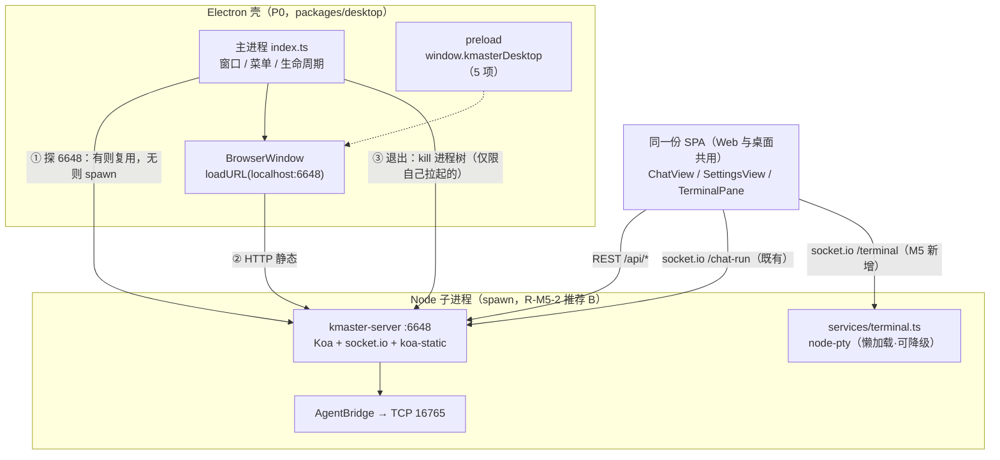
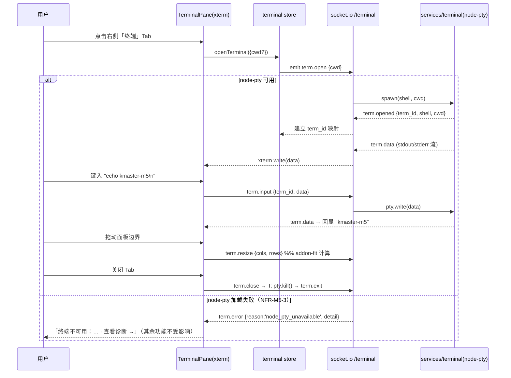

# 需求文档 · M5（F20 内置终端 / F21 设置页 / Electron 桌面壳 + 打包分发）

> 里程碑现状：M1（聊天闭环）、M2（卡片/会话/Artifact）、M3（模式/模型/技能/MCP/上传）、M4（记忆/自动化/子代理/队列/压缩/用量）均已完成。M5 是**最后一个里程碑**：桌面化。
> 关联：`docs/research/TASK-UNDERSTANDING-kmaster-studio.md`（F20/F21 定义，行 44–45）、`docs/research/CHANGE-OBJECTIVE-kmaster-studio.md`（M5 范围行 15、R1–R4 行 28–32）、`docs/reference/02-kmaster-studio设计方案.md`（§F20 行 249 / §F21 行 253 / M5 行 291）、`docs/reference/03-hermes-studio前端深度分析.md`（Electron 薄壳路线行 70）、`docs/design/TECHNICAL-SOLUTION-M3.md`（`/api/settings`、MCP、skills 已有端点）、`docs/design/TECHNICAL-SOLUTION-M4.md`（架构纪律与验收模式）。
> **范围说明：本文件仅描述 M5 相对 M1–M4 的增量变更**，不重写既有功能。
> 环境约定（沿用，不变更）：server=**6648**、client dev=**6649**（Vite proxy → `http://localhost:6648`）、Bridge TCP=**16765**；localhost（→::1）绕过 TUN 代理；构建带 `KMASTER_NO_EMPTY_DIST=1`。

---

## 0. 编写期已核实的现状（作为需求边界的事实依据）

> 以下均为本轮**读代码实测**，非推断。架构师可直接引用，无需重复核对。

| # | 事实 | 对 M5 的约束 |
|---|------|-------------|
| E1 | server 已有 REST：`/api/health`、`/api/models`、`/api/skills`、`/api/mcp`(GET/POST/DELETE)、`/api/upload`、`/api/settings`(GET/PUT)、`/api/sessions/*`、`/api/memory/*`、`/api/jobs/*`、`/api/cron-history`、`/api/cron-status`、`/api/queue/*`、`/api/usage/stats`、`/api/sessions/:id/context-length` | **F21 一律复用，禁止新建重复端点**；仅允许**扩展** `/api/settings` 的字段面与新增 profile/诊断两组端点 |
| E2 | `Settings` 类型当前**仅两字段**：`default_mode`、`default_model`（`protocol.ts:138`）；`hermes-proxy.getSettings/setSettings`（L1018/L1025）落在 kmaster.db `settings` 表 | F21 需**扩展** `Settings`（主题/语言/provider/profile/终端偏好），并区分「kmaster 自有设置」与「hermes config 设置」两类存储 |
| E3 | 客户端已有 `SettingsDrawer.vue`（NDrawer，仅全局默认 mode/model，73 行） | F21 需决策「升级整页 vs 扩展抽屉」→ 见 §5.1 建议与 FR21.1 |
| E4 | 路由为 **hash 模式**，现有 5 条：`/`、`/memory`、`/jobs`、`/usage`、`/queue`；`AppNav.vue` 顶部导航 5 项 + 主题切换按钮 | 新增 `/settings` 整页路由与导航项即可，成本极低，且**延续 M4 q-2「管理功能走独立整页路由」纪律** |
| E5 | server `index.ts` 已用 `koa-static` 托管 `packages/client/dist`（同源单端口 6648） | **Electron 壳只需 `loadURL('http://localhost:6648')`**，无需在壳内另起静态服务 |
| E6 | `sessions` 表与 `protocol.ts` **无 `workspace` / `cwd` 字段**（grep 零命中） | F20 终端 cwd **无法**对齐「会话工作区」→ 首版 cwd 用默认目录（可配置），会话级工作区绑定降为 P1（需先补 `sessions.workspace` 列） |
| E7 | hermes-studio 终端实测实现：server 用 `ws` 裸 WebSocketServer + `node-pty`（**lazy `require('node-pty')`，加载失败仅 warn 并禁用终端功能**，不影响进程）；client 用 `@xterm/xterm` + `@xterm/addon-fit` + `@xterm/addon-web-links`；Windows shell = `powershell.exe`，Unix 取 `$SHELL` → `/bin/zsh` → `/bin/bash` | kmaster 已有 socket.io → 建议 F20 走 **socket.io 新命名空间 `/terminal`**（零新增传输层依赖），而非再引 `ws`；shell 探测与「node-pty 加载失败优雅降级」两点**直接照抄** |
| E8 | hermes-studio 桌面壳实测：`packages/desktop`（main 1231 行 / preload 176 行 / webui-server 594 行）；**主进程 spawn 独立 Node 子进程跑 server**（`webui-server.ts`，端口探活后再 loadURL），preload 经 `contextBridge.exposeInMainWorld('hermesDesktop', {...})` 暴露最小对象（`isDesktop`/`platform`/`windowKind`/`getToken`/`ensureAuth`/`windowControl`/`notifyCompletion`…）；打包 electron-builder + electron-updater（generic provider） | 印证 **R-M5-2 推荐「外启 server 子进程」**；preload 对象命名对齐为 `kmasterDesktop` |
| E9 | hermes-studio `electron-builder.yml` 对 node-pty 有专门处理：按平台裁剪 `prebuilds/`、Linux 需 `npm rebuild node-pty` 用 `build/Release/pty.node` | **F20 + 打包是耦合风险点**（原生模块 ABI/跨平台），是 R-M5-1/R-M5-4 建议「打包降 P1」的核心理由 |
| E10 | 依赖现状：client 无 xterm 系；server 无 node-pty；无 `packages/desktop` | M5 是 M1–M4 中**首次引入原生模块与新 workspace 包**的里程碑 |

---

## 1. M5 增量范围一览

| 功能 | 编号 | 一句话说明 | 优先级 | 现状 |
|------|------|-----------|--------|------|
| 内置终端 | F20 | 右侧预览面板内嵌 xterm 终端，node-pty 起本机 shell，输入输出实时回显 | **P0** | 无；纯 studio 能力，**零 hermes 依赖** |
| 设置页 | F21 | 整页 `/settings`，管理 hermes config（Provider/Model/主题/Profile）+ 诊断 | **P0** | 部分；`/api/settings` 与 `SettingsDrawer` 已有但字段面极窄（仅 mode/model） |
| Electron 薄壳 | — | 轻壳重服务：主进程拉起/连接 6648 server，加载同一套 SPA | **P0**（须有可运行壳） | 无；无 `packages/desktop` |
| 打包分发 | — | electron-builder 产出本机平台可分发产物 | **P1** | 无 |
| 自动更新 | — | electron-updater 增量更新通道 | **P2** | 无（建议不做，见 R-M5-4） |

---

## 2. 产品目标

### 2.1 M5 一句话目标

**把 kmaster-studio 从「浏览器里的 Agent 控制台」变成「桌面上的 Agent 工作台」：用户不必再开终端窗口与手改配置文件，一个应用内即可完成「聊天 + 看产物 + 敲命令 + 调配置」的完整闭环，并可双击图标启动。**

### 2.2 与 M1–M4 的关系

| 关系 | 说明 |
|------|------|
| **不改既有功能面** | M1–M4 的聊天/卡片/会话/Artifact/模式/模型/技能/MCP/上传/记忆/自动化/子代理/队列/压缩/用量**全部保持原样**，M5 零回归是硬约束（AC7） |
| **补最后两块功能拼图** | F20/F21 是 F1–F22 全集中仅剩的两项，M5 完成即功能全集收口 |
| **换宿主而非换架构** | Electron 仅是**新增一层宿主**：同一 SPA、同一 Koa server、同一 Bridge。Web 访问方式（浏览器开 6648/6649）在 M5 后**继续等价可用**，不被桌面壳取代 |
| **首次触碰构建/分发面** | 前四个里程碑只产源码，M5 首次产「可交付制品」，因此新增打包/原生模块两类风险（见 §7） |

### 2.3 三个正交子目标

1. **本地掌控力**：不离开 studio 即可执行 shell 命令、查看 Agent 产物落盘情况（F20）。
2. **配置可视化**：hermes 的 Provider/Model/Profile 与 studio 自身偏好集中在一处可读可写，替代手改 `config.yaml`（F21）。
3. **桌面可交付**：以桌面应用形态启动与使用，Web 能力零裁剪（Electron 薄壳）。

---

## 3. 用户故事

| 编号 | 角色 | 用户故事 |
|------|------|---------|
| **US20a** | 终端用户 | 作为用户，我想在右侧面板打开一个终端 Tab，敲 `ls` / `git status` 就能看到 Agent 刚改了哪些文件，而不用切到系统终端再 `cd` 一遍。 |
| **US20b** | 终端用户 | 作为用户，我想让终端的输入输出**实时回显**（含颜色、光标、Ctrl+C 中断），体感等同真实终端。 |
| **US20c** | 终端用户 | 作为用户，我想在面板尺寸变化时终端自动重排（fit），不出现文字截断或错行。 |
| **US20d** | 终端用户 | 作为用户，当我的机器上 node-pty 装不上时，我希望**终端 Tab 显示明确的不可用提示**，而不是整个 studio 打不开。 |
| **US21a** | 设置用户 | 作为用户，我想在一个设置页里看到并切换当前 Provider / 默认模型 / 默认模式，改完立即对新会话生效，不用手改 `~/.hermes/config.yaml`。 |
| **US21b** | 设置用户 | 作为用户，我想在设置页填/换 API Key，且**填过的 Key 不被明文回显**（只显示「已配置」与后四位）。 |
| **US21c** | 设置用户 | 作为用户，我想在设置页统一切换主题（暗/亮）与语言，并记住我的选择。 |
| **US21d** | 设置用户 | 作为用户，我想在设置页看到「诊断」信息（server 版本/端口、Bridge 是否 Mock、hermes home 路径、python/hermes CLI 是否可用），出问题时能自查。 |
| **US21e** | 设置用户 | 作为用户，我想在设置页里就能进技能/MCP 管理，而不用回到聊天页从底部工具条找入口。 |
| **US-D1** | 桌面端用户 | 作为用户，我想双击一个图标就启动 kmaster-studio，它自己把后端拉起来，我直接看到聊天界面，不用先开命令行 `npm run dev`。 |
| **US-D2** | 桌面端用户 | 作为用户，我想关闭窗口时后台服务被干净收尾（不残留孤儿进程、不占着 6648 端口）。 |
| **US-D3** | 桌面端用户 | 作为用户，我想在桌面端里聊天/终端/设置**和网页版完全一致**，不需要重新学一套。 |
| **US-D4** | 桌面端用户 | 作为用户，当 6648 端口已被我自己起的 dev server 占用时，我希望壳能识别并复用它，而不是报错退出。 |

---

## 4. 需求池（P0 / P1 / P2）

> 「复用/落点」列显式标注**复用 M3/M4 已有后端**的项，供架构师直接建任务树；标 ♻️ 者禁止新建重复实现。

### 4.1 P0（Must have）

#### F20 内置终端

| ID | 需求 | 复用 / 落点 / 风险 |
|----|------|-------------------|
| FR20.1 | server 新增终端会话服务：`node-pty` 起本机 shell（win32→`powershell.exe`；其他→`$SHELL`→`/bin/zsh`→`/bin/bash`），支持 spawn / write / resize / kill 四类操作 | 新增 `server/src/services/terminal.ts`；shell 探测逻辑照抄 E7；新增依赖 `node-pty` |
| FR20.2 | **node-pty 懒加载 + 优雅降级**：`require('node-pty')` 失败仅告警并置 `terminalAvailable=false`，server 与其余全部功能不受影响 | E7 实测范式；⚠️ 这是 NFR-M5-3 的实现点，必须在 AC 中单独验 |
| FR20.3 | 传输通道：**socket.io 新命名空间 `/terminal`**（上行 `term.open/term.input/term.resize/term.close`；下行 `term.opened/term.data/term.exit/term.error`），不引入第二套 WS 栈 | ♻️ 复用现有 socket.io 实例（`index.ts` 已建 `new Server(httpServer)`）；与 `/chat-run` 并列，事件按 `term_id` 分发 |
| FR20.4 | 前端 `TerminalPane.vue`：`@xterm/xterm` + `addon-fit`（尺寸自适应）+ `addon-web-links`（URL 可点），暗/亮主题跟随 `styles/theme.ts` | 新增组件 + 3 个 client 依赖；主题令牌 ♻️ 复用既有 `--km-*` CSS 变量 |
| FR20.5 | 嵌入位置：右侧 `ArtifactPanel` 新增「终端」Tab（可停靠面板形态，对齐 WorkBuddy devtools-terminal 与 hermes-studio `DrawerPanel > TerminalPanel`） | ♻️ 改造既有 `ArtifactPanel.vue`，不新建路由；见 §5.2 |
| FR20.6 | 终端 cwd：默认取 server 启动 cwd，**可经设置页配置默认工作目录**；面板顶部显示当前 cwd | ⚠️ E6：`sessions` 无 workspace 字段，**会话级 cwd 绑定不在 P0**；默认目录读 `Settings.terminal_cwd`（F21 提供） |
| FR20.7 | 生命周期：面板关闭 / socket 断开 / server 退出时 kill pty，无孤儿进程；同一时刻至少支持 1 个终端会话 | 多终端 Tab 并存降 P1（FR20.8） |

#### F21 设置页

| ID | 需求 | 复用 / 落点 / 风险 |
|----|------|-------------------|
| FR21.1 | 新增 `/settings` **整页路由** + `views/SettingsView.vue`；`AppNav` 增「⚙️ 设置」入口。既有 `SettingsDrawer.vue` **保留为快捷设置**（仅 mode/model）并增「更多设置 →」跳转整页 | ♻️ 复用 M4 的 router/AppNav 骨架（E4）；延续 q-2 纪律；**零删除既有组件 = 零回归**；见 §5.1 决策建议 |
| FR21.2 | 设置页分组：①通用（主题/语言/默认工作目录）②Agent 默认（默认模式/默认模型）③Provider & Model ④Profile ⑤技能 ⑥MCP ⑦诊断 | 见 §5.1 布局 |
| FR21.3 | 「Agent 默认」分组直接 ♻️ 复用 `GET/PUT /api/settings` 与 `chat store` 既有 `loadGlobalSettings/setGlobalSettings` | ♻️ M3 端点，零后端改动 |
| FR21.4 | 「Provider & Model」分组 ♻️ 复用 `GET /api/models`（M3，含 provider 分组与静态快照回退）展示可用模型；新增 `GET/PUT /api/config/providers` 用于**读取 provider 列表与写入 API Key** | ♻️ 枚举端点复用；写 Key 走 `hermes config set` CLI 子进程（沿用 M4 `runHermesCli` 范式，**不用 js-yaml 直写**以免丢注释） |
| FR21.5 | **API Key 只写不回显**：读接口仅返回 `{ provider, configured: boolean, masked: '****abcd' }`，绝不返回明文 | 安全硬约束（NFR-M5-5） |
| FR21.6 | 「技能」「MCP」两个分组 ♻️ **直接内嵌复用 M3 既有 `SkillPanel.vue` / `McpManager.vue` 组件**（从 Drawer 内容抽为可复用块），后端沿用 `GET /api/skills`、`GET/POST/DELETE /api/mcp` | ♻️ **禁止**新建技能/MCP 端点或组件；聊天页 Drawer 入口保留不动 |
| FR21.7 | 「通用」分组：主题（暗/亮，♻️ 复用 `styles/theme.ts` 的 `useTheme`）、语言（占位，简中单语言即可）、终端默认工作目录（供 FR20.6） | `Settings` 类型扩展（见 FR21.9） |
| FR21.8 | 「诊断」分组：`GET /api/health` ♻️ 复用 + 扩展返回 `{ version, port, bridge_mock, hermes_home, python_ok, hermes_cli_ok, terminal_available, node_pty_error? }`；页面一键「复制诊断信息」 | ♻️ 扩展既有 `/api/health`，不新建 |
| FR21.9 | `Settings` 类型扩展：`{ default_mode, default_model, theme?, locale?, terminal_cwd?, active_profile? }`，server/client **双端同步**；持久化仍走 kmaster.db `settings` 表 | ♻️ 复用 `hermes-proxy.getSettings/setSettings` + `db` settings 表（E2），只加字段 |
| FR21.10 | 「Profile」分组（**只读版 P0**）：列出可用 hermes profile 与当前激活项；切换/新建降 P1 | ⚠️ profile 目录结构需实现期实测（R-M5-5）；P0 只保证「看得见」，不保证「切得动」 |

#### Electron 薄壳

| ID | 需求 | 复用 / 落点 / 风险 |
|----|------|-------------------|
| FR-D1 | 新增 workspace 包 `packages/desktop`（TypeScript，`main` + `preload` 两目录），纳入根 `workspaces` | 对齐 hermes-studio 目录形态（E8） |
| FR-D2 | **轻壳重服务**：主进程 **spawn 独立 Node 子进程**运行 `packages/server/dist/index.js`（非在主进程内 `import` Koa），端口探活成功后 `loadURL('http://localhost:6648')` | R-M5-2 推荐项；关键理由见 §6；⚠️ 若拍板改为内嵌，需额外做 electron-rebuild（better-sqlite3 + node-pty 双原生模块） |
| FR-D3 | **端口复用探测**：启动前先探 6648；已有健康 server（`GET /api/health` 200）则**直接复用不重复拉起**（US-D4）；无则拉起子进程 | 复用 ♻️ `/api/health` |
| FR-D4 | preload 经 `contextBridge.exposeInMainWorld('kmasterDesktop', {...})` 暴露**最小桥接对象**：`{ isDesktop: true, platform, version, windowControl(action), onServerStatus(cb) }`（对齐 hermesDesktop 风格但只保留必需项） | E8；⚠️ **`contextIsolation: true` + `nodeIntegration: false` 是硬约束** |
| FR-D5 | 前端新增 `utils/desktop-bridge.ts` 环境探测（`window.kmasterDesktop?.isDesktop`），**Web 下所有桌面能力自动降级为 no-op**，同一 SPA 双宿主运行 | 对齐 hermes-studio `utils/desktop-bridge.ts`（参考文档行 70） |
| FR-D6 | 生命周期：窗口全部关闭 → 若 server 子进程由本壳拉起则 **kill 进程树**（含 Bridge 子进程）；复用的外部 server 不动（US-D2） | ⚠️ Windows 需 `taskkill /T` 级联杀；孤儿进程是最易踩坑处 |
| FR-D7 | 启动体验：server 就绪前显示「正在启动服务…」加载态，超时（建议 30s）显示错误页 + 重试按钮 + 日志路径 | 避免白屏 |
| FR-D8 | 极简窗口规格：1440×900 默认、最小 1024×720、记忆窗口尺寸/位置；系统原生标题栏（**首版不做自定义标题栏**） | 见 §5.3 |
| FR-D9 | 开发脚本：根 `package.json` 增 `dev:desktop`（起 server + 起壳）与 `build:desktop`；README 记录（配套阶段） | 对齐既有 `dev`/`build` 脚本风格 |

### 4.2 P1（Should have）

| ID | 功能 | 需求 | 依赖 / 说明 |
|----|------|------|------------|
| FR-P1.1 | 打包分发 | electron-builder 产出**本机平台**产物（Windows：`nsis` 安装包或 `portable`；先只做 win 单平台） | R-M5-1/R-M5-4 推荐降级项；⚠️ node-pty/better-sqlite3 需按 E9 方式裁剪 prebuilds |
| FR-P1.2 | 打包分发 | 打包产物内含 client `dist` 与 server `dist`，首次启动可脱离源码目录运行 | 依赖 FR-P1.1 |
| FR20.8 | F20 | **多终端 Tab**并存（新建/关闭/切换），每个独立 pty | FR20.7 之上 |
| FR20.9 | F20 | 终端会话级 cwd：绑定当前会话工作区 | ⚠️ 需先补 `sessions.workspace` 列（E6），属数据模型变更 |
| FR20.10 | F20 | 终端内容搜索 / 复制粘贴增强 / 字号调节 | `@xterm/addon-search`，再加依赖 |
| FR21.11 | F21 | Profile **切换 / 新建 / 重启**（P0 只读之上） | 依赖 R-M5-5 实测结果 |
| FR21.12 | F21 | Provider OAuth 登录流（Anthropic/Codex 等） | hermes-studio 有 `/api/hermes/auth/*` 可参考，工作量大 |
| FR-D10 | 桌面 | 系统托盘：图标 + 菜单（显示主窗口 / 重启服务 / 退出）+ 关闭窗口最小化到托盘 | 见 §5.3；非必需但体验加分 |
| FR-D11 | 桌面 | 应用菜单：文件（新建会话/退出）、编辑（复制/粘贴，**macOS 必需否则快捷键失效**）、视图（重载/开发者工具/缩放）、帮助（关于/日志目录） | 见 §5.3 |
| FR-D12 | 桌面 | 桌面通知：run 完成时系统通知（对齐 hermes-studio `notifyCompletion`） | 依赖 FR-D4 桥接对象扩展 |

### 4.3 P2（Nice to have）

| ID | 需求 |
|----|------|
| FR-P2.1 | electron-updater 自动更新（需发布服务器 + 签名证书，见 R-M5-4 建议不做） |
| FR-P2.2 | 跨平台打包（mac dmg / linux AppImage）与代码签名公证 |
| FR-P2.3 | 独立会话窗口（对齐 hermes-studio `/desktop-chat/:sessionId` 多窗口） |
| FR-P2.4 | 自定义标题栏 / 无边框窗口（`titleBarStyle: hidden` + 前端窗口控件） |
| FR-P2.5 | 终端主题自定义与配色方案预设 |
| FR-P2.6 | 全局快捷键唤起（`globalShortcut`） |

---

## 5. UI 设计稿

### 5.1 F21 设置页 —— 与 M3 `SettingsDrawer` 的关系【给出建议】

**建议：升级为整页 `SettingsView` + 保留抽屉做快捷设置（方案 C，折中）。**

| 方案 | 做法 | 优点 | 缺点 | 结论 |
|------|------|------|------|------|
| A 扩展抽屉 | 继续在 `SettingsDrawer` 内堆 7 个分组 | 改动最小 | 380px 宽容不下 Provider 表格/技能卡片/MCP 编辑器；与 M4「管理功能走整页」纪律冲突 | ❌ |
| B 整页替代 | 新建 `/settings` 并**删除**抽屉 | 结构最干净 | 删除既有组件 = 引入回归风险；聊天页丢失「改个默认模型」的两秒路径 | ⚠️ |
| **C 整页 + 抽屉降级为快捷入口** | 新建 `/settings` 整页承载全部 7 组；`SettingsDrawer` **保留原有 mode/model 两项**，底部加「更多设置 →」跳 `/settings` | 兼顾深度与效率；**零删除 = 零回归**；与 M4 q-2 纪律一致；技能/MCP 抽屉入口也保持不变 | 多维护一个轻组件（73 行，成本可忽略） | ✅ **推荐** |

**整页布局（左侧分组导航 + 右侧内容区，对齐 WorkBuddy 设置窗口范式）：**

```
┌─ AppNav: [💬聊天][🧠记忆][⏰自动化][📊用量][📥队列][⚙️设置]←新增 ─────────────┐
├──────────────┬──────────────────────────────────────────────────────────┤
│ 通用          │  【Provider & Model】                                     │
│ Agent 默认    │  ┌────────────────────────────────────────────────────┐  │
│ ▸Provider&Model│  │ Provider     状态        API Key                    │  │
│ Profile      │  │ anthropic    ● 已配置    ****cd12   [更换] [清除]     │  │
│ 技能          │  │ openai       ○ 未配置    [输入 Key…]      [保存]     │  │
│ MCP          │  │ deepseek     ● 已配置    ****9f04   [更换] [清除]     │  │
│ 诊断          │  └────────────────────────────────────────────────────┘  │
│              │  默认模型  [ claude-sonnet-4 ▾ ]   ← ♻️ GET /api/models   │
│              │  ⚠️ Key 仅写入不回显，保存后经 hermes config set 生效       │
└──────────────┴──────────────────────────────────────────────────────────┘
```

各分组内容：

| 分组 | 内容 | 数据来源 |
|------|------|---------|
| 通用 | 主题（暗/亮 Switch）、语言（简中，占位）、终端默认工作目录（输入 + 选择） | ♻️ `useTheme` + `GET/PUT /api/settings`（扩展字段） |
| Agent 默认 | 默认模式（Craft/Plan/Ask 单选卡，含 desc）、默认模型（下拉） | ♻️ `GET/PUT /api/settings`（M3，零改动） |
| Provider & Model | 见上图表格 + 默认模型下拉 | ♻️ `GET /api/models`（M3）+ 新增 `GET/PUT /api/config/providers` |
| Profile | 只读列表：名称 / 是否激活 / 路径（P0）；切换按钮置灰标「P1」 | 新增 `GET /api/profiles`（待 R-M5-5 实测） |
| 技能 | **内嵌 `SkillPanel` 组件块**（类目树 + 卡片 + 搜索 + 刷新） | ♻️ M3 组件 + `GET /api/skills` |
| MCP | **内嵌 `McpManager` 组件块**（列表 + 添加 + 移除） | ♻️ M3 组件 + `GET/POST/DELETE /api/mcp` |
| 诊断 | 只读键值表 + 「复制诊断信息」按钮 + 「打开日志目录」（桌面端可用） | ♻️ `GET /api/health`（扩展返回） |

### 5.2 F20 终端面板 —— 嵌入位置【给出建议】

**建议：作为右侧 `ArtifactPanel` 的可停靠 Tab**（对齐 WorkBuddy devtools-terminal；hermes-studio 亦是 `DrawerPanel > TerminalPanel` 同构），**不新增顶层路由**。理由：终端的价值在于「一边看 Agent 产物一边验证」，与 Artifact 预览天然同屏；做成整页反而割裂上下文。

```
┌ NavRail ┬──────── 消息流 ─────────┬──── 右侧预览面板（既有，可收起） ────┐
│ 会话列表 │  用户气泡 / Agent 正文   │ [产物] [文件] [Diff] [终端]←新增 Tab │
│         │  思考块 / 工具卡片       │ ┌──────────────────────────────┐  │
│         │  权限卡 / 澄清卡         │ │ cwd: D:\...\kmaster-studio  ⟳✕│  │ ← 顶部条：cwd + 重启 + 关闭
│         │  子代理卡 / 压缩横幅     │ ├──────────────────────────────┤  │
│         │                        │ │ PS D:\...> git status        │  │
│         ├────────────────────────┤ │ On branch main               │  │ ← xterm 画布
│         │ [模式▾][模型▾][技能][@] │ │ nothing to commit            │  │   （fit 自适应 + 主题跟随）
│         │ 输入框        [队列][⏹] │ │ PS D:\...> █                 │  │
│         │ UsageBar               │ └──────────────────────────────┘  │
└─────────┴────────────────────────┴────────────────────────────────────┘
```

- **Tab 位**：在既有 Artifact/文件/Diff 之后追加「终端」，点击后**惰性创建** pty（不打开不占资源）。
- **顶部条**：`cwd 路径`（可点击复制）+ `⟳ 重启会话` + `✕ 关闭`（kill pty）。
- **降级态（FR20.2/US20d）**：node-pty 不可用时，Tab 仍在，内容区显示「终端不可用：node-pty 加载失败（原因）· 查看诊断 →」，链接跳 `/settings` 诊断分组。
- **面板收起**时终端保持后台存活（不 kill），再次展开续显（scrollback 由 xterm 维护）。

### 5.3 Electron 壳 —— 极简规格

| 项 | 首版规格（P0） | 后续（P1/P2） |
|----|---------------|--------------|
| **窗口** | 单主窗口；默认 1440×900，最小 1024×720；居中；记忆尺寸与位置（`~/.kmaster-studio/window-state.json`）；**系统原生标题栏**（title = `kmaster-studio`） | 自定义标题栏（P2）、多窗口独立会话（P2） |
| **加载** | `loadURL('http://localhost:6648')`；就绪前显示内置 loading HTML（「正在启动 kmaster 服务…」+ 进度点）；30s 超时 → 错误页（错误摘要 + 重试 + 打开日志目录） | 启动画面美化 |
| **安全** | `contextIsolation: true`、`nodeIntegration: false`、`sandbox: true`（若 preload 允许）；`setWindowOpenHandler` 外链走系统浏览器；仅允许加载 `localhost:6648` 源 | CSP 加固 |
| **preload 桥** | `window.kmasterDesktop = { isDesktop:true, platform, version, windowControl(a), onServerStatus(cb) }` —— **只暴露这 5 项** | `notifyCompletion` / `openLogDir` / `selectDirectory`（P1） |
| **托盘** | 首版**不做**（P1 FR-D10） | 图标 + 菜单（显示主窗口 / 重启服务 / 退出）+ 关闭到托盘 |
| **菜单** | 首版用**默认菜单**（保证 macOS 复制粘贴快捷键可用）；生产可 `Menu.setApplicationMenu(null)` 前需先确认 macOS 兼容 | 自定义四组菜单（P1 FR-D11） |
| **服务进程** | spawn `node packages/server/dist/index.js`，env 注入 `PORT=6648`；stdout/stderr 落 `~/.kmaster-studio/logs/server-<date>.log`；退出时 kill 进程树 | 服务健康看板、崩溃自动重启 |
| **图标** | 占位 PNG/ICO 各一份即可 | 正式设计稿 |

---

## 6. 待确认问题（R-M5-1 ~ R-M5-5）★ 需主理人转用户拍板

> 前四项对应 `CHANGE-OBJECTIVE-kmaster-studio.md` §5 的 R1–R4 在 M5 语境下的具体化；R-M5-5 为本轮读码新发现的开放项。**每项均给出推荐选项与理由，用户只需确认或否决。**

### R-M5-1 · MVP 范围：首版是否含 Electron 打包？

| 选项 | 内容 | 评估 |
|------|------|------|
| A | 仅 Web + F20 终端 + F21 设置（完全不做壳） | ❌ 与主理人已定「M5 须有可运行桌面壳」冲突 |
| **B** | **F20 + F21 + 可运行 Electron 开发壳（`npm run dev:desktop` 能起壳并正常聊天）；打包分发（installer）降 P1** | ✅ **推荐** |
| C | F20 + F21 + 壳 + 完整打包安装包（全 P0） | 风险高：node-pty/better-sqlite3 双原生模块打包 + 图标/签名/体积，易拖长交付 |

**推荐 B 的理由**：
1. **风险隔离**：桌面壳的核心价值（进程编排 + 同一 SPA 双宿主）在 B 已 100% 验证；打包只是「把已验证的东西装箱」，其风险（E9 的 prebuilds 裁剪、ABI、体积、签名）与功能正确性**正交**，混在一起会让「壳能不能用」的判断被打包报错淹没。
2. **可验收**：B 的验收面清晰（AC5：壳内能完成一轮完整聊天 + 开终端 + 改设置），不依赖安装包制作能力。
3. **不阻断**：FR-P1.1/P1.2 已在 P1 排好，M5 若时间充裕可直接顺延做掉，不需要改 PRD。

---

### R-M5-2 · 后端对接模式：Electron 主进程内嵌 Koa server，还是外启 server 由壳加载？

| 选项 | 内容 | 评估 |
|------|------|------|
| A | 主进程内 `import` 并直接运行 Koa server（单进程） | 进程少、启动略快；但见下方风险 |
| **B** | **主进程 spawn 独立 Node 子进程跑 `server/dist/index.js`，探活后 loadURL** | ✅ **推荐** |

**推荐 B 的理由（四条，按权重排序）**：
1. **原生模块 ABI 规避（决定性）**：server 依赖 `better-sqlite3`（已有）+ `node-pty`（M5 新增）两个原生模块。跑在 Electron 主进程里必须按 Electron 的 V8/Node ABI 重编译（`electron-rebuild`），且每次 Electron 升级都要重来；跑在**独立 Node 进程**里可直接用官方 Node ABI 的 prebuild，**这个坑直接消失**。
2. **与既定路线一致**：`hermes-studio/packages/desktop/src/main/webui-server.ts`（594 行，实测 E8）正是 spawn 模式——参考文档行 70 所述「轻壳重服务」的真实含义就是**服务不进主进程**。照抄成熟路线，风险最低。
3. **Web 优先不被破坏**：server 保持「一个普通 Node 服务」的身份，`npm run dev` 起 Web、壳里 spawn 起桌面，**同一份代码零分叉**；否则 server 会长出「Electron 专属」的分支代码，违背 M5「换宿主不换架构」的定位（§2.2）。
4. **故障隔离与可复用**：server 崩溃不拖垮窗口，可单独重启；且天然支持 FR-D3「6648 已有 server 就复用」（US-D4：用户自己 `npm run dev` 开着时，壳直接接上）。

**代价（可控）**：多一个进程、需做进程树清理（FR-D6，Windows 用 `taskkill /T`）与端口协商（FR-D3）。

---

### R-M5-3 · UI 对齐深度：终端/设置与 WorkBuddy / hermes-studio 的对齐程度？

| 选项 | 内容 | 评估 |
|------|------|------|
| **A** | **仅布局/交互范式对齐**：终端=右侧可停靠 Tab（WorkBuddy devtools-terminal 范式）、设置=整页分组导航（WorkBuddy 设置窗口范式）；不做像素级复刻 | ✅ **推荐** |
| B | 额外对齐 hermes-studio 的超出项（独立 `/terminal` 整页、ProfilesView 全生命周期、语音/宠物/漫画主题等） | 超出 F1–F22 功能全集，属「云端/趣味专属」，`CHANGE-OBJECTIVE` §4 明确列为非目标 |
| C | 像素级复刻 WorkBuddy | 成本极高，且 M1–M4 从未按此标准执行，M5 单独拔高会造成风格断裂 |

**推荐 A 的理由**：
1. **延续既定纪律**：`TASK-UNDERSTANDING` §1 需求 1 与 `PROJECT-OVERVIEW` §3 的结论就是「仅对齐布局与交互范式」，M1–M4 全部按此执行，M5 保持一致才不产生「同一产品两套标准」。
2. **审核成本可控**：`TASK-UNDERSTANDING` §4 要求每里程碑提交「与 WorkBuddy 的差异清单」供用户审核——A 的差异面小且可枚举（见 §8 AC8），B/C 会让差异清单爆炸。
3. **B 的内容已在 P1/P2**：Profile 全生命周期（FR21.11）、多终端（FR20.8）等已排期，不是砍掉而是排后。

---

### R-M5-4 · 是否首版含自动更新 / 打包分发？

| 选项 | 内容 | 评估 |
|------|------|------|
| **A** | **首版不做自动更新；打包分发降 P1，且仅本机平台（Windows）的 nsis/portable 单产物** | ✅ **推荐** |
| B | 打包 P0 + 自动更新 P1 | 打包 P0 的风险见 R-M5-1 |
| C | 打包 + 自动更新全做（对齐 hermes-studio electron-updater + generic provider） | 需要**发布服务器 + 版本清单 + 代码签名证书**三项外部基建，均不在本项目掌控内 |

**推荐 A 的理由**：
1. **缺少前置基建**：hermes-studio 的 `electron-builder.yml` 用 `provider: generic` + 固定下载域名（实测 E8）。kmaster-studio 是**本地个人工具**，没有分发域名、没有签名证书，自动更新装上就是死代码。
2. **定位匹配**：本地工具的更新方式是 `git pull && npm run build`，或替换 portable 目录，成本已足够低。
3. **属于交付/配套阶段**：DDD 七阶段中「打包分发」天然落在「配套 → 交付」，而非「实现」；M5 的实现面应聚焦 F20/F21/壳三项功能。
4. **保留升级路径**：FR-P2.1 已占位，若后续真要做分发（如给他人使用），可单开一个 M6「分发」小里程碑，不影响 M5 收口。

---

### R-M5-5 · （本轮新发现）hermes Profile 的目录结构与切换机制未实测

| 项 | 说明 |
|----|------|
| **问题** | FR21.10「Profile 只读列表」需要知道：多 profile 在 `resolveHermesHome()`（M4 已确认 Windows 为 `%LOCALAPPDATA%/hermes`）下如何组织？是否有 `profiles/` 子目录？激活 profile 记录在哪？`hermes` CLI 是否有 profile 子命令？ |
| **影响** | 决定 FR21.10 是 P0 可达（读得到）还是要一并降 P1；也影响 Bridge 的多 profile 端口分配（`HERMES_AGENT_BRIDGE_WORKER_PORT_BASE`，见 02 号文档 §六风险 3） |
| **建议探真方式** | 实现期（架构师 T0 探真）跑 `hermes profile --help` / `hermes --help \| grep -i profile`，并 `ls %LOCALAPPDATA%/hermes`；**若无 profile 机制，FR21.10 直接降级为「显示单一默认 profile + 路径」** |
| **默认兜底** | 无需用户拍板，按上述兜底执行即可；此处列出仅为透明化风险 |

---

## 7. 非功能需求（继承 M2/M3/M4 纪律 + M5 增量）

| 编号 | 要求 |
|------|------|
| NFR-M5-1 | **视图零直接网络调用**：`SettingsView` / `TerminalPane` 一律 views → stores → api → server（沿用 M1–M4 纪律）。终端 socket 连接封装在 `api/terminal.ts`，组件只调 store |
| NFR-M5-2 | **零回归**：M1–M4 全部既有功能与既有测试（`chat/memory/jobs/usage` store 单测、`qa-verify-m3/m4.mjs`）在 M5 后**必须继续全绿**；不删除既有组件（含 `SettingsDrawer`） |
| NFR-M5-3 | **原生模块优雅降级**：`node-pty` 加载失败时 server 正常启动、除终端外全部功能可用、UI 有明确提示（FR20.2 / US20d）。这是 Mock 可演示纪律（NFR3）在 M5 的延续 |
| NFR-M5-4 | **Web / 桌面双宿主等价**：同一 SPA 在浏览器与壳内**功能面一致**；桌面专属能力（窗口控制等）经 `desktop-bridge` 探测，Web 下 no-op 且不报错 |
| NFR-M5-5 | **凭据安全**：API Key 只写不回显（FR21.5）；诊断信息复制时自动脱敏；壳内 `contextIsolation:true` + `nodeIntegration:false`（FR-D4） |
| NFR-M5-6 | **端口与环境约定不变**：server 6648 / client dev 6649 / bridge 16765；壳与 Vite proxy 一律用 `localhost`（→::1）绕 TUN 代理；构建脚本保留 `KMASTER_NO_EMPTY_DIST=1` 兼容 |
| NFR-M5-7 | **无孤儿进程**：壳退出后 `tasklist \| findstr node` 不残留由本壳拉起的 server/bridge 进程（FR-D6） |
| NFR-M5-8 | **新增依赖收敛**：server 仅 `node-pty`；client 仅 `@xterm/xterm` + `@xterm/addon-fit` + `@xterm/addon-web-links`；desktop 包仅 `electron` + `electron-builder`(dev)。**不引入 `ws`**（复用 socket.io）、**不引入 electron-updater**（R-M5-4） |

---

## 8. 验收基线（AC1–AC9）

> 沿用 M3/M4 的单脚本验收模式，建议扩展为 `scripts/qa-verify-m5.mjs`；桌面壳部分（AC5）为**人工验收**并留截图。

| # | 范围 | 可验证条目 |
|---|------|-----------|
| **AC1** | 构建与类型 | `vue-tsc --noEmit` + `vite build`（client，带 `KMASTER_NO_EMPTY_DIST=1`）、`tsc --noEmit`（server）、`tsc -p`（desktop）三处零错误；client 既有单测全绿 |
| **AC2** | F20 终端可启动 | 打开右侧「终端」Tab → socket `/terminal` 连接成功 → 收到 `term.opened{term_id, shell, cwd}`；面板显示 shell 提示符 |
| **AC3** | F20 输入输出回显 | 输入 `echo kmaster-m5` + 回车 → 500ms 内 `term.data` 回显包含 `kmaster-m5`；`resize` 后 `stty size` / 窗口重排正确；`Ctrl+C` 可中断长命令；关闭 Tab 后 pty 进程消失（无孤儿） |
| **AC4** | F20 降级 | 人为使 `node-pty` 不可用（重命名模块目录）→ server 仍正常启动、`/api/health` 返回 `terminal_available:false` 且带 `node_pty_error`；聊天/记忆/自动化/用量全部可用；终端 Tab 显示不可用提示不白屏 |
| **AC5** | Electron 壳 | `npm run dev:desktop` → 窗口打开 → loading 后加载 6648 → **在壳内完成一轮完整聊天**（发消息 → 流式回显 → run.completed）；壳内可开终端并回显；壳内可进 `/settings` 并保存设置；关闭窗口后 `~/.kmaster-studio/logs/` 有 server 日志且**无残留 node 进程**（NFR-M5-7） |
| **AC6** | Electron 端口复用 | 先手动 `npm run dev:server` 占用 6648，再起壳 → 壳**不重复拉起** server，直接加载并可正常聊天；此时关闭壳，外部 server **仍存活**（不被误杀） |
| **AC7** | F21 设置读写生效 | `/settings` 六个分组均渲染无报错；改「默认模式/默认模型」→ `PUT /api/settings` 200 → **新建会话继承新默认值**（`GET /api/sessions/:id` 返回新 mode/model）；改主题即时生效并刷新后保持；写入 API Key 后 `GET` 返回 `configured:true` 且**不含明文**；「诊断」显示 port/bridge_mock/hermes_home/terminal_available 且「复制诊断信息」可用 |
| **AC8** | F21 复用性（防重复造轮子） | 代码审查确认：设置页的技能/MCP/模型/默认值分别复用 `SkillPanel`/`McpManager`/`GET /api/models`/`GET /api/settings`，**server 端未新增技能、MCP、模型枚举类端点**；`git diff` 中新增 REST 仅限 `/api/config/providers`、`/api/profiles` 与 `/api/health` 字段扩展 |
| **AC9** | 零回归 + 差异清单 | `qa-verify-m3.mjs`、`qa-verify-m4.mjs` 全绿；`/`、`/memory`、`/jobs`、`/usage`、`/queue` 五条既有路由直达渲染正常；产出**「M5 与 WorkBuddy 的差异清单」**（终端/设置/桌面壳三项各列取舍点）供用户审核（`TASK-UNDERSTANDING` §4 要求） |

---

## 9. 文件清单（M5 变更预估，供架构师建任务树）

### Server（`packages/server`）

- 增：`src/services/terminal.ts`（node-pty 懒加载 + shell 探测 + pty 生命周期 + 降级标记）
- 增：`src/terminal-ns.ts`（socket.io `/terminal` 命名空间编排；或并入 `index.ts`，由架构师定）
- 改：`src/protocol.ts`（`Settings` 扩展字段；新增 `TerminalOpenRequest`/`TerminalEvent`/`ProviderInfo`/`ProfileInfo`/`HealthInfo` 类型）
- 改：`src/routes/sessions.ts`（`/api/health` 返回扩展）
- 增：`src/routes/config.ts`（`GET/PUT /api/config/providers`、`GET /api/profiles`）
- 改：`src/hermes-proxy.ts`（provider 读取 + `hermes config set` 写 Key，复用 M4 `runHermesCli`；profile 列举）
- 改：`package.json`（+`node-pty`）

### Client（`packages/client`）

- 增：`src/components/preview/TerminalPane.vue`（xterm + fit + web-links）
- 改：`src/components/chat/ArtifactPanel.vue`（新增「终端」Tab，惰性挂载）
- 增：`src/api/terminal.ts`（`/terminal` socket 封装）
- 增：`src/stores/terminal.ts`（term 会话状态 / 可用性 / 数据流）
- 增：`src/views/SettingsView.vue`（七分组整页）
- 改：`src/components/chat/SettingsDrawer.vue`（保留 mode/model + 「更多设置 →」）
- 改：`src/router/index.ts`（+`/settings` 懒加载）、`src/components/AppNav.vue`（+「⚙️设置」项）
- 改：`src/types/chat.ts`（`Settings` 扩展 + 终端/provider/profile/health 类型，与 server 双端同步）
- 改：`src/api/client.ts`（`getProviders`/`putProvider`/`getProfiles`/`getHealth`）
- 增：`src/utils/desktop-bridge.ts`（`isDesktop()` 探测 + 能力降级）
- 改：`package.json`（+`@xterm/xterm`、`@xterm/addon-fit`、`@xterm/addon-web-links`）

### Desktop（`packages/desktop`，新增 workspace 包）

- 增：`src/main/index.ts`（窗口 / 生命周期 / 菜单 / 窗口状态持久化）
- 增：`src/main/server-process.ts`（端口探活 → spawn/复用 → 日志落盘 → 进程树清理）
- 增：`src/preload/index.ts`（`contextBridge.exposeInMainWorld('kmasterDesktop', …)`，5 项）
- 增：`src/main/loading.html`（启动/错误占位页）
- 增：`package.json`、`tsconfig.json`；P1 增 `electron-builder.yml`、`build/icon.*`

### 其他

- 改：根 `package.json`（`workspaces` +`packages/desktop`；scripts +`dev:desktop`/`build:desktop`）
- 增：`scripts/qa-verify-m5.mjs`
- 文档：`docs/design/{REQUIREMENT,TECHNICAL-SOLUTION,TEST-PLAN}-M5.md` + 「M5 与 WorkBuddy 差异清单」

---

## 附：M5 进程拓扑与终端事件流




