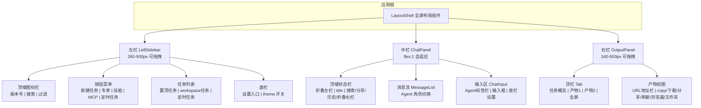
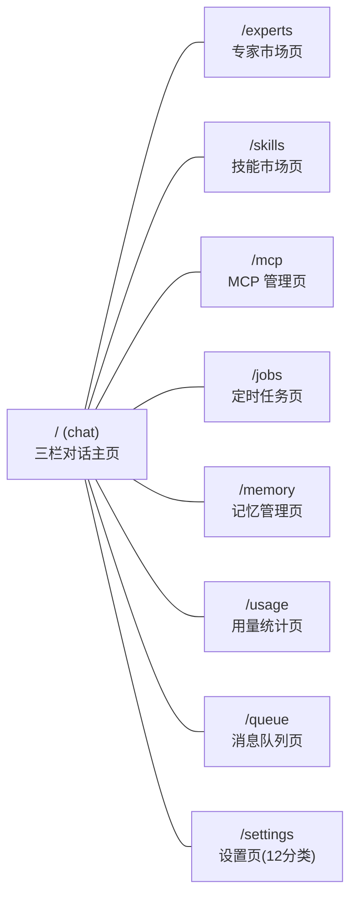

# kmaster-studio UI 重设计 — 完整 PRD

> **版本**：v1.0  
> **作者**：许清楚（产品经理）  
> **日期**：2025-07  
> **语言**：简体中文  
> **技术栈约束**：Vue 3 + Naive UI 2.41 + SCSS（CSS 变量双主题），不引入新 UI 框架  
> **组件策略**：现有 31 个 .vue 组件尽量复用/改造

---

## 1. 产品目标

**将 kmaster-studio 从「功能完备但布局分散」的 MVP 态，升级为「全屏沉浸式 Agent 工作站」——以对话交互为绝对核心，左栏全局导航 + 中栏对话 + 右栏产物预览，专家/技能/MCP 从抽屉升级为完整页面，设置页重构为 12 分类结构化管理。**

---

## 2. 用户故事

| 编号 | 故事 | 优先级 |
|------|------|--------|
| US1 | 作为开发者，我打开 kmaster-studio 后默认看到满屏的对话界面（含左栏），无需手动调整窗口大小 | P0 |
| US2 | 作为开发者，我能在左栏快速切换 workspace 下的任务对话、查看定时任务状态、一键新建各类实体 | P0 |
| US3 | 作为开发者，我能在输入区看到当前所有活跃的 Agent 角色标签及其状态，并随时切换/关闭 | P0 |
| US4 | 作为开发者，我能在右栏查看任务产物（文件/服务/应用），支持 URL 导航、复制、下载、刷新 | P0 |
| US5 | 作为开发者，点击左栏「专家/技能/MCP」按钮后，在独立整页中浏览卡片式内容（搜索、分类、排序），点击卡片在右栏查看详情 | P1 |
| US6 | 作为开发者，我能在设置页通过 12 分类导航快速定位配置项，底部看到连接状态和版本信息 | P1 |
| US7 | 作为开发者，我能通过输入区底栏快速切换 workspace、执行模式、Agent 角色、模型，并实时查看上下文用量 | P1 |

---

## 3. 布局架构图

### 3.1 应用级拓扑



### 3.2 页面路由拓扑



> **说明**：路由从当前扁平 7 条扩展为 9 条。所有非聊天页均保留左栏导航，形成「左栏 + 右侧内容」双栏布局。

---

## 4. 需求池

### 4.1 P0 — 核心布局与对话体验（必须实现）

| 编号 | 需求 | 验收标准 | 涉及组件 |
|------|------|----------|----------|
| **P0-01** | 创建 `LayoutShell.vue` 全屏布局组件，替代当前 `App.vue` 中的 `AppNav + router-view` 结构 | 聊天页默认全屏撑满、三栏完整；非聊天页左侧保留 LeftSidebar + 右侧内容区 | **新建** LayoutShell.vue；**修改** App.vue |
| **P0-02** | 重设计 `LeftSidebar.vue`：顶端图标栏（版本号、搜索、过滤）+ 中间按钮��单（新建任务、专家、技能、MCP、定时任务）+ 三类任务列表（置顶/workspace/定时）+ 底栏（设置 + theme 开关） | 左栏宽度默认 260px，可拖拽 180-500px；搜索支持任务标题模糊匹配；过滤支持按 workspace/状态筛选；三类列表各自折叠展开 | **新建** LeftSidebar.vue；**改造** SessionList.vue 核心逻辑迁入 |
| **P0-03** | 重设计 `ChatHeader.vue`：左侧折叠左栏图标 + 任务 title；右侧搜索图标、分享图标、提问历史图标、右栏折叠图标 | 点击折叠图标面板动画收起/展开；title 实时同步当前会话标题；搜索图标点击弹出搜索输入 | **新建** ChatHeader.vue（从 ChatPanel.vue 拆出） |
| **P0-04** | 重设计 `ChatInput.vue` 三区结构：(A) 顶端 Agent 角色标签平铺栏——显示各 Agent 名称+状态图标+关闭按钮，超出显示「更多」下拉；(B) 中间输入框——右顶角「+」按钮展开附加面板（技能/MCP/Agent/文件）；(C) 底栏设置——workspace 选择、执行模式、Agent 角色、上下文用量环图、增强提示词、模型选择、麦克风、发送按钮 | Agent 标签状态图标覆盖 ≥10 种（init/thinking/busy/idle/error/writing/coding/reading/searching/researching/designing）；「+」面板可添加技能/MCP/Agent/文件到当前输入上下文；发送按钮长按弹出 /interrupt、/steer、/queue 三选项 | **改造** ChatInput.vue（大幅重构） |
| **P0-05** | 重设计 `OutputPanel.vue` 右栏：(A) 顶栏标签目录图标 + 平铺标签 + 全屏图标，默认展示「任务概览」标签；(B) 主体产物展示窗口——URL 地址栏（可编辑）+ copy/下载/分享/刷新/浏览器/文件夹图标 + 内容展示 + 滚动条 | 标签支持关闭（除任务概览外）；URL 地址栏可编辑回车刷新；点击产物在右栏新标签打开；全屏按钮让右栏全屏 | **改造** ArtifactPanel.vue → OutputPanel.vue |
| **P0-06** | 移除现有顶部 `AppNav.vue` 导航条，所有导航入口迁入左栏 | 路由仍然 9 条 (/, /experts, /skills, /mcp, /jobs, /memory, /usage, /queue, /settings)；AppNav 组件标记 deprecated 保留不删 | **修改** App.vue, router/index.ts；**废弃** AppNav.vue |

### 4.2 P1 — 重要功能页面（应该实现）

| 编号 | 需求 | 验收标准 | 涉及组件 |
|------|------|----------|----------|
| **P1-01** | 新建 `/experts`（专家市场页）、`/skills`（技能市场页）、`/mcp`（MCP 管理页）三个完整页面——卡片式展示（搜索、精选、分类、排序），点击卡片在右栏展示详情 | 卡片含图标、title、摘要、keywords、使用/安装动作按钮；排序支持最新/最热/综合；分类按市场/类型筛选；详情含增删改查 | **新建** ExpertsView.vue, SkillsView.vue, McpView.vue；**改造** SkillPanel.vue/McpManager.vue 逻辑提取复用 |
| **P1-02** | 重构 `/settings` 设置页为 12 分类左栏导航（系统设置、账号设置、Agent 角色管理、skill 管理、MCP 管理、tools 管理、plugins 管理、channel 管理、记忆管理、模型管理、定时任务管理、监控）+ 右栏设置主体 | 左栏导航高亮当前分类；底栏显示账户登录状态+bridge 连接灯+版本号+theme 状态+返回对话链接；右栏统一风格（顶行标签导航 + 卡片化信息） | **改造** SettingsView.vue（大幅重构） |
| **P1-03** | 任务对话列表分组：置顶任务（手动 pin）+ 当前 workspace 任务（按 workspace 路径分组）+ 定时任务（cron 生成的任务对话） | 置顶任务始终在顶部显示 📌 图标；workspace 分组折叠时显示任务计数 badge；定时任务显示下次执行时间 | **改造** LeftSidebar.vue 内嵌 |
| **P1-04** | 输入区「+」集成面板——可搜索并添加技能、MCP server、Agent 专家角色、附件文件到当前输入上下文 | 面板以 popover 浮层展示；选中项以 chip 形式显示在输入框上方；支持移除已选 chip | **改造** ChatInput.vue |
| **P1-05** | 右栏「任务概览」标签：展示任务计划进程（PlanCard 组件复用）+ 任务产物 list（当前全部 artifact 列表） | 计划步骤显示完成/进行中/待处理状态；产物列表点击切换右栏标签预览 | **改造** OutputPanel.vue |
| **P1-06** | 模型上下文用量环图：输入区底栏靠左显示环形比例图标，悬停显示 used/max tokens | 环形图用 SVG 纯 CSS 实现（不引入 ECharts）；颜色随用量变化（<50% 蓝, 50-80% 黄, >80% 红） | **改造** ChatInput.vue；可能新建 ContextRing.vue |
| **P1-07** | 增强提示词图标（sparkling 星状）：点击后自动优化当前输入框中的提示词 | 调用后端 prompt enhance 端点；优化中显示加载动画；完成后替换输入框内容 | **改造** ChatInput.vue |

### 4.3 P2 — 体验优化（可以实现）

| 编号 | 需求 | 验收标准 | 涉及组件 |
|------|------|----------|----------|
| **P2-01** | 发送按钮长按菜单：/interrupt input（中断当前输入）、/steer input（引导当前运行）、/queue input（默认——排队输入） | 长按 500ms 弹出选项菜单；选中后按钮图标/颜色变化反映当前模式 | **改造** ChatInput.vue |
| **P2-02** | 中栏对话区 Agent 角色切换：点击消息流中的 Agent 角色标签，过滤显示该 Agent 的消息 | 角色标签可点击；选中后高亮并过滤消息列表；再次点击取消过滤 | **改造** MessageList.vue |
| **P2-03** | 任务分享：中栏顶栏分享图标点击生成分享链接（带过期时间） | 点击弹出 popover 含复制链接按钮 + 过期时间选择（1h/24h/7d/永久） | **新建** ShareDialog.vue |
| **P2-04** | 任务提问历史：中栏顶栏历史图标点击展示当前任务的历史提问列表 | 列表含时间戳和提问摘要；点击可定位到对应消息位置 | **改造** ChatHeader.vue |
| **P2-05** | 右栏产物窗口滚动条自定义样式（细条 + hover 高亮） | CSS-only 实现；暗色主题深灰条，亮色主题浅灰条 | **改造** OutputPanel.vue |
| **P2-06** | 动画过渡：左栏/右栏折叠、标签切换、面板展开收起 | 使用 CSS transition，时长 200-300ms，ease-out | 跨组件 CSS |

---

## 5. UI 设计稿说明（组件树 + 交互细节）

### 5.1 应用根 LayoutShell

```
┌──────────────────────────────────────────────────────────────┐
│ LayoutShell (全屏 flex row)                                   │
│ ┌──────────┬──────────────────────────┬────────────────────┐ │
│ │LeftSidebar│     <router-view>       │   OutputPanel      │ │
│ │          │  (chat → 三栏子布局)      │  (仅 chat 路由显示) │ │
│ │          │  (experts → 左栏+内容)    │                    │ │
│ │          │  (settings → 左栏+内容)   │                    │ │
│ └──────────┴──────────────────────────┴────────────────────┘ │
└──────────────────────────────────────────────────────────────┘
```

**关键规则**：
- LayoutShell 始终渲染 LeftSidebar，右侧 `<router-view>` 承载各页面
- 仅 `/` (chat) 路由下渲染三栏（ChatPanel + OutputPanel），由 ChatView 内部管理
- 非聊天路由（/experts, /skills, /mcp, /settings 等）使用 LeftSidebar + 内容区的双栏布局

### 5.2 左栏 LeftSidebar 组件树

```
LeftSidebar.vue
├── .km-sidebar-top           // 顶端图标栏
│   ├── 版本号标签 "kmaster-studio v1.x"
│   ├── 🔍 搜索图标 (NButton icon)
│   └── 🔽 过滤图标 (NButton icon, 点击展开 NPopover 过滤面板)
│
├── .km-sidebar-menu          // 按钮菜单
│   ├── [➕ 新建任务] NButton primary block
│   ├── [🤖 专家] NButton secondary block  → router /experts
│   ├── [🧩 技能] NButton secondary block  → router /skills
│   ├── [🔌 MCP] NButton secondary block   → router /mcp
│   └── [⏰ 定时任务] NButton secondary block → router /jobs
│
├── .km-sidebar-lists         // 任务列表区（overflow-y:auto）
│   ├── .km-list-group "📌 置顶任务"
│   │   └── SessionItem(v-for pinned) [点击切换, 右键菜单复用现有逻辑]
│   ├── .km-list-group "📁 workspace名称"
│   │   └── SessionItem(v-for workspace sessions)
│   └── .km-list-group "⏰ 定时任务"
│       └── SessionItem(v-for cron sessions, 显示下次执行时间)
│
└── .km-sidebar-bottom        // 底栏设置
    ├── [⚙️ 设置] NButton text  → router /settings
    └── [🌙/☀️] theme 开关 NButton icon
```

**交互细节**：
- 搜索图标点击：展开输入框（或聚焦现有搜索框），支持任务标题模糊匹配
- 过滤图标点击：弹出 NPopover，含 workspace 多选 + 状态多选（active/idle/archived）
- 列表分组：折叠/展开用 NCollapse 或自定义动画，标题右侧显示 count badge
- 右键菜单：复用 SessionList.vue 现有逻辑（重命名/导出/绑定工作区/删除）

### 5.3 中栏 ChatPanel 组件树

```
ChatView.vue（三栏容器，仅 / 路由）
├── ChatHeader.vue
│   ├── 左侧：折叠左栏图标 NButton + 任务 title
│   └── 右侧：🔍搜索 | 📤分享 | 📜提问历史 | 折叠右栏图标
│
├── MessageList.vue（复用，微调：增加 Agent 角色标签可点击过滤）
│
└── ChatInput.vue（大幅重构）
    ├── .km-input-tags      // Agent 角色标签平铺栏
    │   ├── AgentTag(v-for active agents)
    │   │   ├── 状态图标（⏳/💭/✏️/🔍/…）
    │   │   ├── Agent 名称
    │   │   └── × 关闭图标
    │   └── [更多▾] 下拉按钮（标签超出时显示）
    │
    ├── .km-input-body       // 输入框主体
    │   ├── .km-input-chips  // 已添加的上下文 chip（技能/MCP/Agent/文件）
    │   ├── textarea
    │   └── [+] 按钮（右上角浮层触发）
    │       └── NPopover 面板
    │           ├── 技能搜索选择
    │           ├── MCP server 选择
    │           ├── Agent 专家选择
    │           └── 文件选择（复用现有 input[type=file]）
    │
    └── .km-input-footer     // 底栏设置
        ├── 左侧
        │   ├── workspace 选择 NButton/NSelect
        │   ├── 执行模式 NSelect（ask/plan/craft + edit-on/allowed-all）
        │   └── Agent 角色 NSelect（default/专家/专家团…）
        └── 右侧
            ├── 上下文用量环图 SVG
            ├── ✨ 增强提示词 NButton icon
            ├── 模型 NSelect
            ├── 🎤 麦克风 NButton icon
            └── 发送按钮（长按弹出模式菜单）
```

**Agent 状态图标映射**：
| 状态 | 图标 | 颜色 |
|------|------|------|
| init | ○ | gray |
| closing | ◐ | gray |
| sending-msg | ↗ | blue-400 |
| thinking | 💭 | purple-400 |
| busy | ⏳ | yellow-400 |
| idle | ◉ | green-400 |
| waiting-approval | 🔐 | orange-400 |
| error | ✕ | red-400 |
| writing | ✏️ | blue-400 |
| coding | ⌨️ | cyan-400 |
| reading | 📖 | teal-400 |
| searching | 🔍 | indigo-400 |
| researching | 🔬 | violet-400 |
| designing | 🎨 | pink-400 |

### 5.4 右栏 OutputPanel 组件树

```
OutputPanel.vue（仅 / 路由显示）
├── .km-output-tabs          // 顶栏标签
│   ├─�� 📋 标签目录图标（点击展开已打开标签列表 NPopover）
│   ├── Tab "任务概览" (固定，不可关闭)
│   ├── Tab "产物名1" [×]
│   ├── Tab "产物名2" [×]
│   └── ⛶ 全屏图标（切换 OutputPanel 全屏模式）
│
└── .km-output-body          // 主体（v-show 切换）
    ├── 任务概览面板（默认标签）
    │   ├── PlanCard（复用现有组件）
    │   └── 产物列表（现有 ArtifactPanel 列表逻辑）
    │
    └── 产物预览面板（按需渲染）
        ├── .km-output-toolbar    // URL 地址栏
        │   ├── URL input（可编辑，回车刷新）
        │   ├── 📋 copy 图标
        │   ├── 📥 下载图标
        │   ├── 📤 分享图标
        │   ├── 🔄 刷新图标
        │   ├── 🌐 浏览器图标（外部打开）
        │   └── 📂 文件夹图标（打开所在文件夹）
        └── .km-output-content   // 内容区
            ├── iframe（HTML/SVG 预览）
            ├── AgentMarkdown（代码/markdown）
            ├── img（图片）
            ├── pre（文本）
            └── 自定义滚动条
```

**交互细节**：
- 标签切换使用 v-show 保持 iframe 状态不丢失
- URL 地址栏：可编辑 → 回车触发内容重载（调用已有 API）
- 标签关闭：点 × 关闭；点击「任务概览」标签的 × 无效
- 全屏模式：OutputPanel 覆盖整个窗口，其他面板隐藏，再次点击恢复

### 5.5 专家/技能/MCP 页面组件树

```
ExpertsView.vue | SkillsView.vue | McpView.vue（共享相同模板结构）

┌─ LeftSidebar ─┬──────────────────────────────────────┐
│              │  页面主体（flex:1）                     │
│  (始终显示)   │ ┌──────────────────────────────────┐ │
│              │ │ 顶栏：搜索框 + 精选/全部/分类 Tab │ │
│              │ │        + 排序（最新/最热/综合）    │ │
│              │ ├──────────────────────────────────┤ │
│              │ │ 卡片网格（CSS Grid 自适应列数）   │ │
│              │ │ ┌────────┐ ┌────────┐ ┌────────┐ │ │
│              │ │ │ icon   │ │ icon   │ │ icon   │ │ │
│              │ │ │ title  │ │ title  │ │ title  │ │ │
│              │ │ │ 摘要   │ │ 摘要   │ │ 摘要   │ │ │
│              │ │ │keywords│ │keywords│ │keywords│ │ │
│              │ │ │[安装]  │ │[使用]  │ │[召唤]  │ │ │
│              │ │ └────────┘ └────────┘ └────────┘ │ │
│              │ └──────────────────────────────────┘ │
│              │                                      │
│              │ 点击卡片 → 右侧详情（可在同页右栏或  │
│              │   展开 NDrawer 展示，含增删改查）     │
└──────────────┴──────────────────────────────────────┘
```

### 5.6 设置页面组件树

```
SettingsView.vue（双栏布局）

┌─ LeftSidebar ─┬──────────────────────────────────────┐
│              │  设置主体（flex:1, overflow-y:auto）   │
│  (始终显示)   │ ┌──────────────────────────────────┐ │
│              │ │ 设置分类 Title + 标签导航          │ │
│              │ ├──────────────────────────────────┤ │
│              │ │                                  │ │
│              │ │  卡片化设置内容区                  │ │
│              │ │  （复用现有 GeneralSection,       │ │
│              │ │   ProviderSection, ProfileSection │ │
│              │ │   DiagnosticsSection 等）         │ │
│              │ │                                  │ │
│              │ │  新增 Section：                   │ │
│              │ │  - AgentRoleSection              │ │
│              │ │  - ToolsSection                  │ │
│              │ │  - PluginsSection                │ │
│              │ │  - ChannelSection                │ │
│              │ │  - ModelManageSection            │ │
│              │ │  - MonitorSection                │ │
│              │ │                                  │ │
│              │ └──────────────────────────────────┘ │
│              │                                      │
│  ┌─────────┐│                                      │
│  │设置导航  ││                                      │
│  │12 分类   ││                                      │
│  │         ││                                      │
│  │         ││                                      │
│  │         ││                                      │
│  ├─────────┤│                                      │
│  │底栏状态  ││                                      │
│  │- 账户   ││                                      │
│  │- bridge ││                                      │
│  │- 版本   ││                                      │
│  │- 返回   ││                                      │
│  └─────────┘│                                      │
└──────────────┴──────────────────────────────────────┘
```

**设置页左栏导航 12 分类**：
1. 🎛️ 系统设置（主题/语言/终端默认目录）
2. 👤 账号设置（账户信息/登录登出）
3. 🤖 Agent 角色管理
4. 🧩 Skill 管理
5. 🔌 MCP 管理
6. 🔧 Tools 管理
7. 🧰 Plugins 管理
8. 📡 Channel 管理
9. 🧠 记忆管理
10. 🧪 模型管理
11. ⏰ 定时任务管理
12. 📊 监控

**底栏 4 行状态**：
- 第1行：账户登录状态 + 用户名
- 第2行：bridge 连接状态灯（绿/黄/红）+ 提示文字
- 第3行：kmaster-studio 版本号 + theme 状态图标
- 第4行：[← 返回任务对话] 链接 → router /

---

## 6. 路由与页面变更

### 6.1 路由对比

| 现有路由 | 变更 | 说明 |
|----------|------|------|
| `/` (chat) | **保留** | 三栏对话主页，核心不变 |
| `/memory` | **保留** | 记忆管理页 |
| `/jobs` | **保留** | 自动化/定时任务页 |
| `/usage` | **保留** | 用量统计页 |
| `/queue` | **保留** | 消息队列页 |
| `/settings` | **保留，大幅改造** | 由 7 分组扩展为 12 分类 |
| `/:pathMatch(.*)*` | **保留** | 通配回落 |

| 新增路由 | 说明 |
|----------|------|
| `/experts` | 专家市场页（卡片式浏览） |
| `/skills` | 技能市场页（从抽屉升级为整页） |
| `/mcp` | MCP 管理页（从抽屉升级为整页） |

### 6.2 组件变更清单

| 组件 | 状态 | 说明 |
|------|------|------|
| `AppNav.vue` | **废弃**（保留文件不删） | 导航迁入 LeftSidebar |
| `App.vue` | **修改** | AppNav 替换为 LayoutShell |
| `ChatView.vue` | **修改** | 拆出 ChatHeader，ChatInput 重构 |
| `SessionList.vue` | **保留逻辑，界面迁入 LeftSidebar** | 核心逻辑（搜索/右键菜单/拖拽/导出）在 LeftSidebar 中复用 |
| `ChatPanel.vue` | **修改** | 拆出 ChatHeader 部分 |
| `ChatInput.vue` | **大幅重构** | 三区结构（Agent标签/输入/底栏） |
| `ArtifactPanel.vue` | **重构 → OutputPanel.vue** | 标签式产物管理 |
| `MessageList.vue` | **微调** | 增加 Agent 角色可点击过滤 |
| `MessageItem.vue` | **保留** | 无需修改 |
| `AgentMarkdown.vue` | **保留** | 无需修改 |
| `ThoughtBlock.vue` | **保留** | 无需修改 |
| `ToolCallCard.vue` | **保留** | 无需修改 |
| `ApprovalCard.vue` | **保留** | 无需修改 |
| `ClarifyCard.vue` | **保留** | 无需修改 |
| `PlanCard.vue` | **保留** | 含在 OutputPanel 任务概览中 |
| `SubagentCard.vue` | **保留** | 无需修改 |
| `UsageBar.vue` | **保留** | 无需修改 |
| `SkillPanel.vue` | **逻辑提取复用** | 抽屉形态保留；卡片列表逻辑提取为 composable 供 SkillsView 复用 |
| `McpManager.vue` | **逻辑提取复用** | 抽屉形态保留；管理逻辑提取为 composable 供 McpView 复用 |
| `SettingsDrawer.vue` | **保留** | 聊天页快捷设置入口保留 |
| `SettingsView.vue` | **大幅重构** | 12 分类 + 左栏导航 |
| `GeneralSection.vue` | **保留** | 系统设置分组 |
| `ProviderSection.vue` | **保留** | Provider 配置分组 |
| `ProfileSection.vue` | **保留** | Profile 分组 |
| `DiagnosticsSection.vue` | **保留** | 诊断分组 |
| `FileTreePane.vue` | **保留** | 文件树面板 |
| `TerminalPane.vue` | **保留** | 终端面板 |
| `MemoryView.vue` | **保留** | 记忆页 |
| `JobsView.vue` | **保留** | 自动化页 |
| `UsageView.vue` | **保留** | 用量页 |
| `QueueView.vue` | **保留** | 队列页 |

### 6.3 新建组件

| 组件 | 说明 |
|------|------|
| `LayoutShell.vue` | 应用根布局：LeftSidebar + router-view |
| `LeftSidebar.vue` | 左栏完整组件（融合 SessionList 逻辑） |
| `ChatHeader.vue` | 中栏顶部状态栏 |
| `OutputPanel.vue` | 右栏标签式产物面板（替代 ArtifactPanel） |
| `ContextRing.vue` | 上下文用量环图 SVG 组件 |
| `ShareDialog.vue` | 任务分享弹窗 |
| `ExpertsView.vue` | 专家市场整页 |
| `SkillsView.vue` | 技能市场整页 |
| `McpView.vue` | MCP 管理整页 |
| `AgentRoleSection.vue` | 设置页 Agent 角色管理分组 |
| `ToolsSection.vue` | 设置页 Tools 管理分组 |
| `ModelManageSection.vue` | 设置页模型管理分组 |
| `MonitorSection.vue` | 设置页监控分组 |

---

## 7. 待确认问题

| 编号 | 问题 | 候选方案 | 建议 |
|------|------|----------|------|
| Q1 | **非聊天页是否仍然保留 LeftSidebar？** 如果保留，页面内容区会变窄；如果不保留，用户需返回聊天页才能切换任务/导航 | A. 全部页面保留 LeftSidebar（统一导航体验，但内容区窄）<br>B. 仅聊天页显示 LeftSidebar（非聊天页用顶栏或面包屑导航） | **建议 B**：非聊天页用各自内部的导航（如设置页自带左栏分类导航），保持内容区宽裕 |
| Q2 | **右栏 OutputPanel 的「全屏模式」是仅覆盖中栏+右栏，还是覆盖整个窗口（含 LeftSidebar）？** | A. 覆盖中栏+右栏（LeftSidebar 保留）<br>B. 覆盖全窗口（产品预览更沉浸） | **建议 A**：保留 LeftSidebar 便于用户随时切换任务 |
| Q3 | **Agent 角色标签数据来源？** 当前代码中没有显式的「Agent 团队角色状态」数据模型，这些状态（thinking/busy/writing…）需要后端支持 | A. 前端从现有 Bridge 事件推断 Agent 状态<br>B. 后端新增 Agent status 端点<br>C. 先用静态 mock 数据实现 UI，后续对接 | **建议 C→B**：先用 mock 验证 UI 交互，确认设计后再补后端 |
| Q4 | **现有 SessionList.vue 的核心逻辑（搜索/右键菜单/拖拽/导出/重命名）是提取为 composable 还是直接在 LeftSidebar 中内联？** | A. 提取 `useSessionList` composable（更干净、可复用）<br>B. 直接在 LeftSidebar.vue 中重写（更快、不引入抽象层） | **建议 A**：提取 composable 可同时被 SkillsView/McpView 等需要列表的页面复用 |

---

## 附录 A：与现有 PRD 的关系

- 本 PRD 是 **kmaster-studio UI 重设计**的独立完整规格，覆盖 M1-M5 累积的 UI 债务
- 与 `docs/design/KMASTER-VS-WORKBUDDY-FINAL.md` 的差距分析一致（约 3-5% 桌面特性差距在 P2 中覆盖）
- 与 `docs/reference/02-kmaster-studio设计方案.md` 的架构约束一致（技术栈/路由/状态管理不变）
- 本 PRD **不涉及**后端 API 变更、Bridge 协议变更、数据库 schema 变更

## 附录 B：实施建议

1. **Phase 1 (P0)**：LayoutShell + LeftSidebar + ChatHeader + ChatInput 重构 + OutputPanel，预计最大工作量在 ChatInput 三区结构
2. **Phase 2 (P1)**：Expert/Skill/MCP 整页 + Settings 重构 + 输入增强，可并行开发
3. **Phase 3 (P2)**：动画/长按菜单/分享/历史等体验细节
