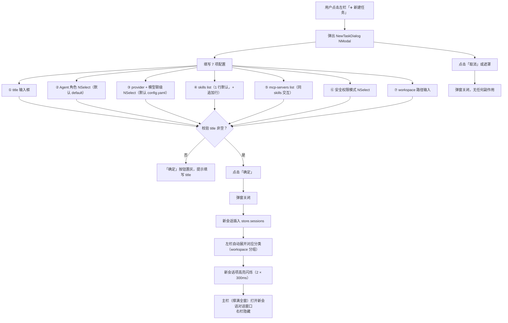
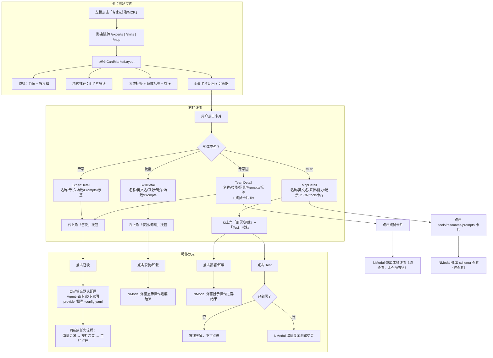

# kmaster-studio UI V2 — 增量 PRD

> **版本**：v2.0
> **作者**：许清楚（产品经理）
> **日期**：2025-08
> **语言**：简体中文
> **上游依赖**：[V1 PRD](./REQUIREMENT-ui-redesign.md) · [V1 技术方案](./TECHNICAL-SOLUTION-ui-redesign.md)
> **V1 基线**：commit `1218e64`，LayoutShell 三栏全屏布局已交付
> **增量范围**：在 V1 三栏骨架之上迭代交互细节，不改变布局架构

---

## 1. 产品目标

**在 V1「全屏沉浸式 Agent 工作站」骨架之上，补齐新建任务弹窗、卡片市场交互、右栏详情展示、设置页覆盖式导航、右栏避让等核心交互闭环，让三栏布局从"能看"变为"好用"。**

---

## 2. 增量用户故事

| 编号 | 故事 | 覆盖需求 | 优先级 |
|------|------|----------|--------|
| US1 | 作为开发者，我点击左栏"新建任务"后弹出配置对话框，设置 title/Agent/provider/模型/skills/MCP/安全模式/workspace，确定后新会话自动出现在左栏并高亮、主栏打开对话窗口 | 需求 1 | P0 |
| US2 | 作为开发者，我点击左栏任一历史会话，右边主窗口立即切换到此会话的对话界面，**右栏默认不显示**，保持对话区域最大化 | 需求 2、7 | P0 |
| US3 | 作为开发者，我点击左栏「专家/技能/MCP」菜单后，看到完整的卡片市场页面（顶栏搜索 + 精选推荐 + 分类标签 + 4×5 卡片网格 + 分页），卡片包含图标/名称/简介/标签/操作按钮 | 需求 3 | P0 |
| US4 | 作为开��者，我点击市场卡片后，右栏打开该实体的详情页（专家/专家团/技能/MCP 各有专属详情布局），右上角操作按钮触发相应动作（召唤/安装卸载/部署卸载+测试） | 需求 4 | P0 |
| US5 | 作为开发者，我点击设置按钮，设置页导航栏**覆盖**首页左栏（而非跳转独立页面），右边展示设置详情，**默认打开监控页面** | 需求 5 | P1 |
| US6 | 作为开发者，左栏底栏仅显示 dark/light mode 图标（月亮/太阳），点击即可切换主题，简洁明了 | 需求 6 | P1 |
| US7 | 作为开发者，当右栏（详情/产物）打开时，中间主体栏自动缩窄让出空间，**不被右栏遮挡覆盖** | 需求 7 | P0 |

---

## 3. 需求池

### 3.1 P0 — 核心交互闭环（必须实现）

| 编号 | 需求 | 验收标准 | 涉及组件 |
|------|------|----------|----------|
| **P0-01** | **新建任务弹窗**：左栏"新建任务/对话"按钮 → 弹出 NModal 对话框，含 7 个配置项：① title 文本输入；② Agent 角色 NSelect（默认 "default"）；③ provider + 模型联级 NSelect（默认读取 `${HERMES_HOME}/config.yaml`）；④ skills 列表（默认 1 个 NSelect，右侧 "+" 按钮逐个追加行，每行可删除）；⑤ mcp-servers 列表（交互同 skills）；⑥ Agent 安全权限模式 NSelect；⑦ 任务 workspace 路径输入。点击"确定"→ 弹窗关闭 → 新会话插入左栏对应分类并高亮 → 主栏（撑满全窗）打开该会话对话窗口 | 1. 7 项配置齐全、校验非空 title 才能确定；2. skills/mcp 列表支持动态增删行，至少 1 行；3. 确定后左栏自动展开对应分类、新会话高亮闪烁；4. provider/模型默认值来自 config.yaml | **新建** NewTaskDialog.vue；**改造** LeftSidebar.vue（新建按钮绑定弹窗 + 列表刷新 + 高亮逻辑） |
| **P0-02** | **会话切换 + 右栏默认隐藏**：左栏点击任一任务会话 → 主窗口切换至此会话对话界面 → **右栏（OutputPanel）默认不显示** → 仅在用户主动打开产物/详情时才出现 | 1. 点击会话项立即切换，无闪烁；2. 初始状态右栏宽度为 0（display:none 或 width:0）；3. 当用户点击卡片详情或任务产生产物时，右栏动画展开 | **改造** ChatView.vue（右栏默认隐藏逻辑）；**改造** LeftSidebar.vue（点击 emit 会话切换） |
| **P0-03** | **右栏避让**：右栏显示时，中间主体栏**自动缩小** width，不能被右栏覆盖。即 LayoutShell 三栏始终是 flex 并排，不出现右栏浮层遮挡中栏内容 | 1. 三栏 flex 布局，右栏出现时中栏 flex:1 自动缩减；2. 中栏最小宽度 ≥ 400px；3. 拖拽分割线调整左右比例 | **改造** LayoutShell.vue 或 ChatView.vue（确保三栏 flex 而非 absolute overlay） |
| **P0-04** | **卡片市场 — 共用布局模板**：专家/技能/MCP 三页面共用卡片市场布局：① 顶栏——靠左页面 Title（专家市场/技能市场/MCP 管理），靠右搜索框（NInput + 搜索图标）；② 精选推荐模块——标题栏 "精选推荐" + 卡片横滚 list（默认 5 个）；③ 分类卡片模块——第一行大类标签导航栏（靠左大类标签，靠右排序下拉：综合默认/最热/最新）；第二行领域分类标签平铺（第一位始终"推荐"，用户选过的标签移到第二位，按使用频度排序，超出显示"更多"下拉）；④ 选中标签高亮显示；⑤ 卡片网格——默认 4 行 × 5 列（20 个/页），分页器（每页 20/50/100 可选） | 1. 搜索支持名称/简介模糊匹配，300ms 防抖；2. 精选推荐卡片横滚带左右箭头；3. 大类标签切换时重置领域标签为"推荐"；4. 领域标签"更多"下拉显示所有被截断标签；5. 排序切换时保留当前大类/领域筛选；6. 分页切换时滚动到网格顶部 | **新建** CardMarketLayout.vue（共用布局组件）；**改造** ExpertsView.vue、SkillsView.vue、McpView.vue（使用共用布局） |
| **P0-05** | **卡片组件**：每个卡片展示：① 图标（32×32 居中）；② 名称（单行截断）；③ 简介（2 行截断）；④ 关键词/分类标签 chip list（最多 3 个）；⑤ 左上角操作按钮——专家="召唤"（primary outlined）、技能="安装/卸载"（状态切换）、MCP="部署/卸载"（状态切换） | 1. 卡片 hover 上浮阴影效果；2. 操作按钮点击触发对应动作（安装/卸载弹窗确认）；3. 卡片整体可点击打开详情（需求 P0-06） | **新建** EntityCard.vue（共用卡片组件，props 区分实体类型） |
| **P0-06** | **详情页 — 右栏打开**：点击市场卡片 → 右栏打开详情（而非 V1 的 NDrawer）。四种实体详情布局：<br>**专家详情**：名称 + 专长描述 + 应用场景 + 使用样例 Prompts + 分类标签 + **右上角"召唤"按钮**（点击 = 打开默认配置的新任务会话，会话对象为该专家）<br>**专家团详情**：名称 + 技能描述 + 应用场景 + 样例 Prompts + 分类标签 + **右上角"召唤"按钮**（同上，会话对象为专家团）+ 专家成员卡片 list（可点击弹窗查看纯详情，无召唤按钮）<br>**技能详情**：名��� + 英文名 + 来源（市场/本地/URL）+ 简介 + 应用场景 + 样例 Prompts + 标签 + **右上角"安装/卸载"按钮**（点击弹窗显示操作结果）<br>**MCP 详情**：名称 + 英文名 + 来源 + tools/resources/prompts 能力简��� + 应用场景 + 样例 Prompts + 部署 JSON 示例 + 标签 + tools/resources/prompts 卡片 list（可点击弹窗查看 schema，纯查看）+ **右上角"部署/卸载"+"test"按钮**（未部署时 test 灰掉，点击弹窗显示结果） | 1. 详情在右栏以 NScrollbar 包裹，支持长内容滚动；2. 右上角按钮 sticky 不随滚动消失；3. "召唤"按钮自动填充默认配置（Agent=该专家、provider/模型=config.yaml 默认值）并创建新会话；4. 技能安装/卸载、MCP 部署/卸载/test 调用已有 composable；5. 专家成员卡片弹窗为纯查看模式（NModal + 只读卡片） | **改造** OutputPanel.vue（新增详情视图模式）；**新建** ExpertDetail.vue、TeamDetail.vue、SkillDetail.vue、McpDetail.vue（四种详情子组件） |

### 3.2 P1 — 重要体验增强（应该实现）

| 编号 | 需求 | 验收标准 | 涉及组件 |
|------|------|----------|----------|
| **P1-01** | **设置页覆盖式导航**：点击左栏设置按钮 → 设置页导航栏（12 分类）**覆盖**首页左栏（替换 LeftSidebar 内容区，宽度一致）→ 右边为设置详情主体 → **默认激活"监控"分类**（12 分类中最后一个） | 1. 覆盖动画 200ms ease-out；2. 覆盖后原左栏任务列表不可见；3. 点击底栏"返回对话"或再次点击设置按钮恢复左栏；4. 监控页面默认显示（非系统设置） | **改造** SettingsView.vue（覆盖模式 + 默认监控）；**改造** LeftSidebar.vue（覆盖切换逻辑） |
| **P1-02** | **左栏底栏简化**：左栏底栏设置按钮栏靠右**仅显示** dark/light mode 图标按钮——🌙 表示当前 dark mode（点击切换到 light），☀️ 表示当前 light mode（点击切换到 dark）。不保留额外的开关图标或文字 | 1. 图标随当前主题切换；2. 点击即时切换无延迟；3. 与 V1 已有的 theme toggle 逻辑共用（Pinia store） | **改造** LeftSidebar.vue（精简底栏，移除多余图标） |
| **P1-03** | **新会话高亮动画**：新建任务确定后，左栏自动展开对应分类 → 新会话项以背景色高亮闪烁（2 次，每次 300ms）→ 主栏打开该会话窗口 | 1. 高亮动画纯 CSS（keyframes background-color pulse）；2. 闪烁结束后恢复正常样式；3. 同时仅一个会话处于高亮态 | **改造** LeftSidebar.vue（新增 `highlightedSessionId` ref + CSS animation） |

---

## 4. 交互流程图

### 4.1 新建任务弹窗流程



### 4.2 卡片市场 → 详情 → 召唤 流程



---

## 5. 接口/数据模型变更

> V2 不引入后端 API 变更，所有新增数据结构均需**前端 mock**。

### 5.1 新增 Mock 数据

#### 专家/专家团/技能/MCP 卡片数据

```typescript
// types/market.ts（新建）

// 卡片基类
interface CardItem {
  id: string;
  name: string;
  icon?: string;          // icon URL 或 Naive UI icon name
  description: string;     // 简介（2 行截断）
  tags: string[];          // 分类标签 / 关键词
  category: string;        // 大类标签（如 "编程开发"、"设计创意"）
  domain: string;          // 领域分类（如 "Python"、"前端"）
  featured: boolean;       // 是否精选推荐
}

// 专家
interface Expert extends CardItem {
  expertise: string;       // 专长描述
  scenarios: string[];     // 应用场景
  samplePrompts: string[]; // 使用样例 Prompts
}

// 专家团
interface ExpertTeam extends CardItem {
  skillDesc: string;       // 技能描述
  scenarios: string[];
  samplePrompts: string[];
  members: Expert[];       // 成员列表（纯查看，不含召唤按钮）
}

// 技能
interface Skill extends CardItem {
  englishName: string;
  source: 'marketplace' | 'local' | 'url';  // 来源
  scenarios: string[];
  samplePrompts: string[];
  installed: boolean;      // 安装状态
}

// MCP Server
interface McpServer extends CardItem {
  englishName: string;
  source: string;
  capabilities: {          // 能力简介
    tools: string[];
    resources: string[];
    prompts: string[];
  };
  scenarios: string[];
  samplePrompts: string[];
  deployJson: string;      // 部署 JSON 示例
  deployed: boolean;       // 部署状态
  toolSchemas?: ToolSchema[];
  resourceSchemas?: ResourceSchema[];
  promptSchemas?: PromptSchema[];
}
```

#### 新建任务对话框数据

```typescript
// types/newTask.ts（新建）

interface NewTaskConfig {
  title: string;
  agentRole: string;       // 默认 "default"
  provider: string;        // 从 config.yaml 读取
  model: string;           // 从 config.yaml 读取
  skills: string[];        // skill IDs，默认 1 个空位
  mcpServers: string[];   // MCP server IDs，默认 1 个空位
  securityMode: 'normal' | 'restricted' | 'sandbox';
  workspace: string;       // 任务工作目录
}
```

#### Mock 数据规模

| 实体 | mock 数量 | 说明 |
|------|-----------|------|
| 专家 | 30 条 | 覆盖 5+ 大类、10+ 领域 |
| 专家团 | 10 条 | 每团 3-5 个成员 |
| 技能 | 30 条 | 市场/本地/URL 三种来源各 10 条 |
| MCP | 20 条 | 含 tools/resources/prompts 各维度 |

### 5.2 现有 Store 变更（增量）

| Store | 变更 | 说明 |
|-------|------|------|
| `chat store` | 新增 `highlightedSessionId: Ref<string \| null>` | 新建任务后高亮会话 ID |
| `chat store` | 新增 `rightPanelMode: 'hidden' \| 'output' \| 'detail'` | 右栏模式：隐藏/产物/详情 |
| `chat store` | 新增 `detailEntity: Ref<{type, id} \| null>` | 当前右栏详情实体引用 |
| — | **不改动** V1 已有的 pinnedSessions / agentStates / togglePin 等 | V1 字段全保留 |

---

## 6. 与 V1 的关键差异对照

| 维度 | V1 设计 | V2 设计 | 影响 |
|------|---------|---------|------|
| **新建任务** | 无弹窗，直接创建默认会话 | NModal 7 项配置弹窗 | 新增组件 + LeftSidebar 联动 |
| **右栏默认态** | 始终渲染（340-500px） | 默认隐藏，按需展开 | ChatView 右栏逻辑改动 |
| **右栏避让** | 未明确约束 | 强制 flex 并排，不覆盖中栏 | LayoutShell/ChatView CSS 确认 |
| **卡片详情** | NDrawer 抽屉弹出 | 右栏内嵌展示 | OutputPanel 需新增 detail 视图 |
| **设置页** | 独立路由页面，保留 LeftSidebar | 覆盖 LeftSidebar，默认监控 | SettingsView + LeftSidebar 联调 |
| **底栏** | 设置按钮 + theme 开关图标 | **仅** theme 图标（月亮/太阳） | LeftSidebar 精简 |
| **卡片网格** | 未规定行列数 | 4 行 × 5 列 + 分页 20/50/100 | 共用 CardMarketLayout |
| **领域标签** | 无 | "推荐"首位，用户选择移第二位，频度排序 | 新增标签选择逻辑 |

---

## 7. 待确认问题

| 编号 | 问题 | 候选方案 | 建议 |
|------|------|----------|------|
| Q1 | **设置页覆盖左栏后，"返回对话"的入口在哪里？** V1 中设置页左栏底部有"[← 返回任务对话]"链接，但 V2 中左栏被覆盖，需要新的返回方式 | A. 设置页右栏顶部固定一个"← 返回"按钮<br>B. 再次点击左栏设置按钮即返回（toggle 模式）<br>C. 保留覆盖式左栏底部的返回链接 | **建��� B**：最简单，与用户预期一致——点击同一个按钮进入/退出设置 |
| Q2 | **新建任务弹窗中 provider/模型默认值从 `${HERMES_HOME}/config.yaml` 读取——前端能否直接访问这个文件？** config.yaml 位于服务端文件系统，前端可能需要通过 Bridge API 获取 | A. 前端通过现有 Bridge 端点获取配置（需确认端点是否存在）<br>B. 前端 hardcode 默认值 + Setting 页配置优先<br>C. 前端 mock 模拟 config.yaml 结构 | **建议 B→A**：先用 store 中的已有 provider/model 配置（SettingsView 已读取），确保 UI 可跑；后续确认 Bridge 端点后切为实时读取 |
| Q3 | **领域分类标签"按使用频度排序"——使用频度数据从哪里来？** 需要前端持久化用户的标签点击行为 | A. localStorage 存储标签点击次数<br>B. Pinia store 内存计数（刷新丢失）<br>C. 后端用户偏好 API | **建议 A**：前端 localStorage 简单可靠，不需要后端改动；后续可升级到后端持久化 |

---

## 附录 A：组件变更汇总

### A.1 新建文件

| # | 文件路径 | 说明 |
|---|----------|------|
| 1 | `packages/client/src/components/dialog/NewTaskDialog.vue` | 新建任务 7 项配置弹窗 |
| 2 | `packages/client/src/components/market/CardMarketLayout.vue` | 卡片市场共用布局（搜索+精选+分类+网格+分页） |
| 3 | `packages/client/src/components/market/EntityCard.vue` | 共用卡片组件（图标/名称/简介/标签/操作按钮） |
| 4 | `packages/client/src/components/market/ExpertDetail.vue` | 专家详情子组件 |
| 5 | `packages/client/src/components/market/TeamDetail.vue` | 专家团详情子组件 |
| 6 | `packages/client/src/components/market/SkillDetail.vue` | 技能详情子组件 |
| 7 | `packages/client/src/components/market/McpDetail.vue` | MCP 详情子组件 |
| 8 | `packages/client/src/types/market.ts` | 卡片市场类型定义 + mock 数据 |
| 9 | `packages/client/src/types/newTask.ts` | 新建任务配置类型定义 |

### A.2 改造文件

| # | 文件路径 | 改造内容 |
|---|----------|----------|
| 10 | `components/layout/LeftSidebar.vue` | 新建按钮绑定弹窗；列表高亮逻辑；底栏精简（仅 theme 图标）；设置覆盖切换 |
| 11 | `views/ChatView.vue` | 右栏默认隐藏；右栏避让（flex 而非 overlay）；集成详情视图 |
| 12 | `views/ExpertsView.vue` | 改用 CardMarketLayout + EntityCard；卡片点击打开右栏详情 |
| 13 | `views/SkillsView.vue` | 同上 |
| 14 | `views/McpView.vue` | 同上 |
| 15 | `views/SettingsView.vue` | 覆盖模式 + 默认激活监控分类 |
| 16 | `components/chat/OutputPanel.vue` | 新增 detail 视图模式（切换产物/详情）；右栏避让 |
| 17 | `stores/chat.ts` | 新增 highlightedSessionId / rightPanelMode / detailEntity 字段 |

### A.3 保留不动

LayoutShell.vue、ChatHeader.vue、ChatPanel.vue、ChatInput.vue、MessageList.vue、MessageItem.vue、ContextRing.vue、ShareDialog.vue 及所有 V1 保留组件。

---

## 附录 B：实施建议

1. **P0 建议实施顺序**：P0-01（新建弹窗）→ P0-02（会话切换+右栏隐藏）→ P0-03（右栏避让）→ P0-04+P0-05（卡片市场）→ P0-06（详情页），该顺序按依赖关系排列
2. **P1 可并行**：P1-01（设置覆盖）和 P1-02（底栏精简）互不依赖，可与 P0 并行
3. **最大风险点**：P0-06 详情页涉及 OutputPanel 模式切换（产物/详情），需仔细设计状态机避免冲突
