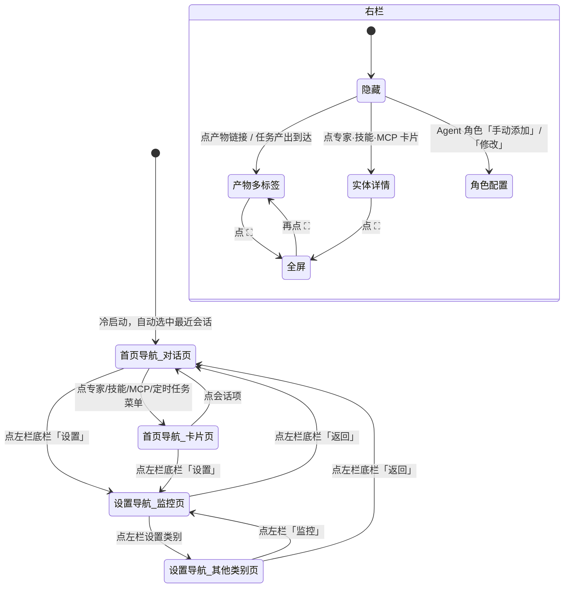

# kmaster-studio UI V3 优化 — 产品需求文档（简单 PRD）

> 版本：V3.0 · 文档类型：简单 PRD · 语言：简体中文
> 作者：许清楚（产品经理）
> 基线：UI V1（commit `1218e64`）+ UI V2（commit `5b417ec`）
> 原则：**增量开发 / 最小变更**，不重写已有可用结构

---

## 一、项目信息

| 项 | 内容 |
| --- | --- |
| Language | 简体中文（`zh-CN` 为默认，保留 `en` locale） |
| Programming Language | Vue 3 + TypeScript + Naive UI 2.41 + SCSS（**沿用现状，不引入新框架**） |
| Project Name | `kmaster_studio_ui_v3` |
| 主题体系 | 全部走 `--km-*` 双主题 CSS 变量（`src/styles/theme.ts`），禁止硬编码色值 |
| 交付范围 | `packages/client/src` 前端；后端接口缺口以 mock + 待确认问题形式标注 |

### 原始需求复述

用户希望把 kmaster-studio 从"能用"推进到"结构统一、信息分层清晰"：
1. **三栏框架统一化** —— 左/中/右三栏等高撑满窗口，左右栏定宽可拖拽，主体自适应；每栏都有自己的 title 栏。
2. **左栏双导航态** —— 首页导航（默认）与设置导航可切换，设置入口下沉到左栏底栏，与主题切换同行。
3. **设置从"单页锚点滚动"改为"一类一页"** —— 左栏选类别，主体渲染该类别的独立详情页。
4. **重点设置详情页深化** —— 系统设置（日志）、账号、Agent 角色管理、Skills 管理、MCP 管理、模型管理、定时任务，各自补齐可落地的完整交互。

---

## 二、产品目标

| # | 目标 | 衡量方式 |
| --- | --- | --- |
| G1 | **建立统一的三栏空间契约**：任意路由下左/中/右三栏结构、高度、title 栏位置、宽度调整行为完全一致 | 8 个主体页面（对话/专家/技能/MCP/定时任务/设置×N）截图对比，title 栏高度与按钮位序 100% 一致；窗口 1280→1920 缩放无横向滚动条 |
| G2 | **把"设置"从功能堆场变成可导航的产品区**：设置入口下沉左栏底栏，左栏切换为设置导航，一类一页 | 从对话页进入任一设置类别 ≤ 2 次点击；12 个类别各有独立主体页，无锚点滚动 |
| G3 | **让管理类页面具备真实闭环能力**：模型/Agent 角色/Skills/MCP/定时任务从"占位与只读"升级为增删改查 + 结果反馈 | 5 个管理页各自跑通"新增 → 校验 → 反馈 → 列表刷新"完整链路，无"开发中"占位 |
| G4 | **统一详情的承载位置**：所有实体详情（专家/技能/MCP/角色配置/产物/任务产物）一律在右栏打开，弹窗只承载瞬时决策 | 详情类交互 100% 落在右栏；弹窗数量收敛到 6 类（新建会话/成员详情/安装结果/schema/测试结果/错误告警） |
| G5 | **保持可运维的可观测性**：日志、连接状态、账户状态在固定位置常驻可见 | 设置导航底部 3 行状态栏常驻；日志支持过滤 + 搜索 + 外部打开 |

---

## 三、用户故事

### 角色 A：普通用户（日常使用 Agent 完成任务）

| ID | 用户故事 |
| --- | --- |
| US-01 | 作为普通用户，我希望**三栏高度撑满窗口且不出现横向滚动条**，这样我在不同尺寸显示器上都能获得一致的可视面积。 |
| US-02 | 作为普通用户，我希望**左栏和右栏可以拖拽调宽并被记住**，这样我能按当前任务把空间分配给最需要的一栏。 |
| US-03 | 作为普通用户，我希望**每个主体页面顶部都有 title 栏，左侧固定是"左栏显隐 + 页面标题"、右侧固定是"内容搜索 + 右栏显隐"**，这样我不用重新学习每个页面。 |
| US-04 | 作为普通用户，我希望**在对话页的 title 栏能直接分享对话、查看提问历史**，这样我不必进入菜单深处。 |
| US-05 | 作为普通用户，我希望**点击会话中的产物链接时，右栏以新标签打开该产物并激活**，这样我可以在多个产物之间来回切换而不丢上下文。 |
| US-06 | 作为普通用户，我希望**打开应用时自动选中最近一次会话并高亮**，这样我能立刻接着上次的工作继续。 |
| US-07 | 作为普通用户，我希望**用搜索图标搜会话、用过滤图标按类别/时间/Agent 角色过滤会话**，这样在会话很多时也能快速定位。 |
| US-08 | 作为普通用户，我希望**左栏底部一眼就能切换 dark/light 模式（月亮/太阳图标）**，这样切换主题不需要进设置。 |
| US-09 | 作为普通用户，我希望**点击专家/技能/MCP 卡片时右栏打开详情，而不是跳转新页面**，这样我不会丢失当前浏览位置。 |
| US-10 | 作为普通用户，我希望**右栏可以一键全屏放大**，这样我能专注阅读长产物或复杂 schema。 |

### 角色 B：管理员 / 高级用户（配置与运维）

| ID | 用户故事 |
| --- | --- |
| US-11 | 作为管理员，我希望**点击左栏底栏"设置"后左栏整体切换为设置导航（默认选中"监控"并高亮）**，这样我进入配置心智时界面也随之切换。 |
| US-12 | 作为管理员，我希望**设置导航底部常驻三行状态栏（登录账户+指示灯、bridge 连接+指示灯、版本号+主题图标）**，这样系统健康状况随时可见。 |
| US-13 | 作为管理员，我希望**每个设置类别是一个独立主体详情页而不是长滚动页**，这样我改一项配置时不会误触其他配置。 |
| US-14 | 作为管理员，我希望**在系统设置里查看日志列表，并按时间/会话/日志种类/日志级别过滤、搜索、点击条目弹窗查看全文、可在外部应用打开**，这样我能自助排障。 |
| US-15 | 作为管理员，我希望**在 Agent 角色管理页看到已添加角色的卡片列表，右上角可直接删除/修改**，这样常用操作零层级。 |
| US-16 | 作为管理员，我希望**通过"+"下拉选择"手动添加"或"从市场添加"来新增 Agent 角色**，手动添加在右栏打开配置页、从市场添加在右栏打开专家卡片列表，这样两种来源路径都清晰。 |
| US-17 | 作为管理员，我希望**只有添加/使用过的 Agent 角色才出现在会话配置下拉框里**，这样新建会话时选项不会被整个市场淹没。 |
| US-18 | 作为管理员，我希望**通过"新增模型"弹窗选择已知 provider（字段预填且锁定，点小锁可解锁改）或自定义 provider**，这样常见 provider 零输入、特殊 provider 也能配。 |
| US-19 | 作为管理员，我希望**在新增模型弹窗里点 test 立即验证连通性并弹窗看结果**，这样我不用保存后才发现 key 错了。 |
| US-20 | 作为管理员，我希望**已配置模型列表按 provider 折叠、展开后看到模型名/标签/使用量/是否默认**，这样列表在 provider 多时依然可读。 |
| US-21 | 作为管理员，我希望**能为"默认模型/简单处理模型/视觉理解模型/生图模型/fall-back 模型"分别指定默认值，且下拉选项按能力标签过滤**，这样新建会话时自动用对的模型。 |
| US-22 | 作为管理员，我希望**Skills / MCP 管理设置页与市场页结构一致，只是首屏模块换成"已安装"**，这样我复用同一套浏览心智。 |
| US-23 | 作为管理员，我希望**定时任务页默认按名称排序、默认选中第一项并高亮，运行历史只显示选中任务的记录，历史产物点击后在右栏打开**，这样我能聚焦排查单个任务。 |
| US-24 | 作为管理员，我希望**账号设置里能改账号名称/账号信息并重置密码**，这样基本账户维护无需外部工具。 |

---

## 四、需求池

> 优先级定义：**P0 = 必须有（本轮必交付）**；**P1 = 应该有（本轮尽量交付）**；**P2 = 可以有（可顺延）**
> 状态标注：`复用` = 已有实现可直接用；`改造` = 在已有文件上增量修改；`新增` = 需要新建文件

### P0 —— 框架 + 导航 + 核心详情页

| 编号 | 描述 | 验收标准 | 所属模块 | 状态 |
| --- | --- | --- | --- | --- |
| **R-01** | 三栏等高撑满窗口：左栏（定宽可拖拽）+ 主体（flex 自适应）+ 右栏（定宽可拖拽），整体 `height:100vh` 无外层滚动 | ① 窗口从 1280×720 拉伸到 1920×1080，三栏顶边与底边始终对齐，页面无横向滚动条；② 左栏宽度可在 180–500px 拖拽；③ 右栏宽度可在 320–800px 拖拽；④ 拖拽时不触发文字选中 | M1 布局框架 · `LayoutShell.vue` | 改造（左栏拖拽已有，右栏拖拽需新增） |
| **R-02** | 左右栏宽度与显隐状态持久化到 localStorage | 调整左栏至 320px → 刷新页面 → 左栏仍为 320px；隐藏右栏 → 刷新 → 右栏仍隐藏 | M1 布局框架 | 新增 |
| **R-03** | 左栏"首页导航"态：顶部 title 栏 = 靠左 kmaster 版本号 + 靠右【会话搜索图标】【会话过滤图标】 | ① 版本号文本与 `package.json` version 一致；② 点搜索图标展开输入框并自动聚焦；③ 点过滤图标弹出过滤面板 | M2 左栏 · `LeftSidebar.vue` | 改造（结构已有，过滤面板为占位需实现） |
| **R-04** | 左栏"首页导航"态：底部切换栏 = 靠左【设置】按钮 + 靠右【dark/light 切换图标（🌙/☀️）】，同一行 | ① 底栏只有这两个元素，分列两端；② 点主题图标即时切换主题且图标随之变化；③ **"设置"从上方菜单按钮列表中移除** | M2 左栏 | 改造 |
| **R-05** | 左栏"设置导航"态：顶部 title 栏文案"设置"；底部切换栏为【返回】；底栏上方为三行状态栏（登录账户+指示灯 / bridge 连接+指示灯 / kmaster-studio 版本号 + 主题图标） | ① 点【设置】→ 左栏整体切换为设置导航（不是覆盖层）；② 点【返回】→ 回到首页导航态并恢复此前选中的会话；③ 三行状态栏常驻在底栏正上方；④ 指示灯绿=正常/灰=断开 | M2 左栏 | 新增（状态栏文案可复用 `SettingsView.vue` 的 `set-side-footer`） |
| **R-06** | 进入设置导航后：**默认选中"监控"类别并 highlight**，主体栏渲染"监控"详情页 | ① 首次点【设置】主体即为监控页；② 选中项有明确 highlight（背景 + 文字色 + 加粗）；③ 切换类别时 highlight 跟随 | M2 左栏 + M5 设置 | 改造 |
| **R-07** | 设置详情页拆分：**每个设置类别一个独立主体页**，取消当前"12 分类单页锚点滚动"结构 | ① 切换类别时主体内容整体替换，无滚动跳转动画；② 12 个类别各自独立可访问；③ 直接访问 `/settings/{category}` 能正确渲染对应页 | M5 设置 · `SettingsView.vue` | 改造（拆为路由子页 / 动态组件） |
| **R-08** | 统一主体 title 栏组件：靠左【左栏显隐图标】+【页面 Title】；靠右【内容搜索框】+【右栏显隐图标】 | ① 8 个主体页面（对话/专家/技能/MCP/定时任务/设置各详情页）title 栏高度、内边距、按钮位序完全一致；② 左栏显隐按钮可正确折叠/展开左栏；③ 右栏显隐按钮可正确折叠/展开右栏；④ 搜索框输入即过滤当前页内容（防抖 300ms） | M3 主体 title 栏 · `PageHeader.vue` | 新增（从 `ChatHeader.vue` 抽象；ChatHeader 逻辑可复用） |
| **R-09** | 对话交互页 title 栏在通用结构基础上，右侧额外增加【对话分享】【对话提问历史】两个图标按钮 | ① 两按钮位于内容搜索框与右栏显隐按钮之间；② 点分享打开 `ShareDialog`；③ 点历史弹出最近 20 条用户提问，点击可滚动定位 | M3 · `ChatView.vue` | 复用（`ChatHeader.vue` 已实现，迁移到 PageHeader 插槽） |
| **R-10** | 右栏统一容器：顶部 title 栏 + 【全屏缩放】图标按钮；默认隐藏；支持 5 种内容态（会话产物多标签 / 专家·专家团详情 / 技能详情 / MCP 详情 / 定时任务详情） | ① 右栏默认 `hidden`；② title 栏常驻并显示当前内容态名称；③ 点全屏图标右栏覆盖整个窗口，再点还原；④ 5 种内容态可正确切换渲染 | M4 右栏 · `OutputPanel.vue` | 改造（mode 机制与 4 个 Detail 组件已有，需补 title 栏 + 全屏 + 任务详情态） |
| **R-11** | 会话产物多标签：点击会话中的产物链接 → 右栏打开/激活对应产物详情标签页 | ① 首次点击新建标签并激活；② 再次点击同一产物只激活不重复建标签；③ 非"任务概览"标签可关闭；④ 关闭当前标签后自动激活相邻标签 | M4 右栏 | 复用（`OutputPanel.vue` 已实现 tabs） |
| **R-12** | 左栏菜单项/会话项点击后**同时 highlight 并在主体栏打开对应页面**；应用启动默认选中最近一次会话项 | ① 选中项持续 highlight（非闪烁），切换后旧项取消；② 冷启动后主体自动加载最近一次会话；③ 无任何会话时显示空态且不报错 | M2 左栏 | 改造（`highlightedSessionId` 为一次性闪烁动画，需补持久选中态） |
| **R-13** | 弹窗体系收敛为 6 类：新建会话 / 专家团成员专家详情 / skill 安装·卸载结果 / MCP 成员 schema 详情 / MCP 安装·卸载·测试结果 / 出错·告警 | ① 6 类弹窗均可触发并正确关闭；② 弹窗宽度自适应内容（最大 92vw）；③ 详情类交互不再使用弹窗承载（改右栏） | M11 弹窗 | 改造（`NewTaskDialog.vue` 复用，其余需新增/整理） |
| **R-14** | Agent 角色管理详情页：顶栏靠左"Agent 角色配置"、靠右【+】下拉（"手动添加"/"从市场添加"）；主体为已添加角色卡片列表（名称/图标/简介/专长&技能/关键词标签/右上角删除+修改按钮） | ① 点【+】展开两项下拉；② "手动添加"→ 右栏打开 Agent 角色配置详情页且各项为默认配置；③ "从市场添加"→ 右栏打开专家卡片列表页，卡片"召唤"按钮变为"添加/删除"，点卡片弹窗显示专家详情；④ 卡片右上角删除 → 二次确认后从存储移除；⑤ 卡片右上角修改 → 右栏打开该角色配置页 | M7 Agent 角色 · `AgentRoleSection.vue` | 改造（当前为 MOCK 内联编辑，需重做交互） |
| **R-15** | Agent 角色配置项完整化：名称、简介、角色配置 `Agent.md`、附加技能 list、mcp-server 配置、手动标签、样例 Prompts | ① 7 类配置项均可编辑并保存；② `Agent.md` 使用多行文本编辑区；③ 附加技能/mcp-server 通过多选选择器绑定；④ 保存后卡片列表即时反映变更 | M7 Agent 角色 | 新增 · `AgentRoleDetail.vue` |
| **R-16** | 只有添加/使用过的 Agent 角色才在**会话配置下拉框**中显示 | ① 未添加的市场专家不出现在新建会话的角色下拉；② 新添加角色后下拉即时可选；③ 删除角色后下拉即时移除（已用该角色的历史会话不受影响） | M7 + M11 · `NewTaskDialog.vue` | 改造 |
| **R-17** | 定时任务详情页：任务列表默认按名称排序，名称可点击；默认选中第一项，选中行 highlight；运行历史只显示选中任务的记录 | ① 首次进入自动选中第一项；② 点任意任务名 → 该行 highlight 且历史区即时切换；③ 历史区标题体现当前任务名；④ 无任务时显示空态 | M9 定时任务 · `JobsView.vue` | 改造（当前历史用按钮组过滤，需改为行选中联动） |
| **R-18** | 定时任务运行历史的**产物可点击，点击后在右栏打开** | ① 历史条目的产物路径为可点击元素（hover 有指针与下划线）；② 点击后右栏切到"定时任务产物"标签并加载内容；③ 加载失败显示错误提示而非空白 | M9 + M4 | 改造 |

### P1 —— 模型管理 / 日志 / Skills·MCP 管理改造

| 编号 | 描述 | 验收标准 | 所属模块 | 状态 |
| --- | --- | --- | --- | --- |
| **R-19** | 模型管理页"新增模型"栏：靠左标题"新增模型"、靠右【+】，点击打开"新增模型窗口" | ① 【+】点击即弹出弹窗；② 弹窗含 Title 栏、内容区、底部【确定】【test】按钮 | M6 模型管理 · `ModelManageSection.vue` | 改造 |
| **R-20** | 新增模型弹窗 — Provider 选择：下拉含"已知 providers 列表 + 自定义"。选已知 provider 时 name/url/API-method/models 自动预填且**锁定（小锁图标）**，点小锁解锁可改；选"自定义"时全部字段必填 | ① 选已知 provider 后 4 个字段自动填充且为 disabled 态并显示 🔒；② 点 🔒 后字段变可编辑且图标变 🔓；③ 选"自定义"时提交空字段会阻止并高亮提示 | M6 模型管理 | 新增 · `AddModelDialog.vue` |
| **R-21** | 新增模型弹窗 — 字段集：provider name、provider url、provider API-method 下拉（**OpenAI chat completion compatible（默认）** / OpenAI Response compatible / Anthropic chat completion compatible / Anthropic Response compatible）、provider API-key（默认空）、provider models list | ① API-method 下拉恰好 4 个选项且默认选中第一项；② API-key 输入框为密码态可切换明文；③ models list 支持"自动获取"与"手动逐项添加"两种方式 | M6 模型管理 | 新增 |
| **R-22** | 新增模型弹窗 — 单个 model 配置项：model name、model-aliase、model settings（文本理解 / 视觉理解 / 视频理解 / 音频理解 / 生图 / 生视频 / 生音频 / 结构化输出 / 上下文长度） | ① 8 项能力为开关（布尔），上下文长度为数字输入；② 手动添加的 model 立即出现在弹窗内 models list；③ 可删除已添加 model | M6 模型管理 | 新增 |
| **R-23** | 新增模型弹窗 — 【确定】保存、【test】连通性测试，**测试结果以弹窗展示** | ① 【确定】校验通过后写入配置并关闭弹窗，列表刷新；② 【test】发起真实探测，成功/失败均弹窗展示（含耗时与错误详情）；③ 测试期间按钮 loading 且不可重复点击 | M6 模型管理 + M11 弹窗 | 新增 |
| **R-24** | 已配置模型列表：含 Title 栏"已配置模型列表"；**以 provider 为类别分类展示，默认只展示 provider 列表，点击 provider name 展开显示 models info list（模型名 / 模型标签 / 使用量 / 是否默认）** | ① 默认全部 provider 折叠；② 点 provider name 展开/收起；③ 展开后每行显示 4 类信息；④ "是否默认"用明确徽标标识 | M6 模型管理 | 改造（当前为全量平铺，需改折叠） |
| **R-25** | 默认模型列表：下拉选择 **默认模型 / 简单处理模型 / 视觉理解模型 / 生图模型 / fall-back 模型** 五项，**不同用途的下拉选项按能力标签过滤**；该配置作为会话配置的默认值 | ① 5 个用途各有独立下拉；② "视觉理解模型"下拉只列出勾选了"视觉理解"能力的模型；③ 设置后新建会话默认带入对应模型 | M6 模型管理 | 新增 |
| **R-26** | 系统设置详情页：主题、语言、workspace、**日志**四个区块 | ① 主题/语言/workspace 三项可修改并即时生效；② 日志区块含"日志位置设置"+"日志列表" | M5 设置 · `GeneralSection.vue` | 改造 |
| **R-27** | 日志列表：支持**过滤（时间 / 会话 / 日志种类：hermes-agent、bridge、kmaster-studio server、定时任务；日志类别：info / warning / error）**、搜索、点击条目弹窗查看全文 | ① 三类过滤条件可组合使用；② 搜索关键字高亮命中行；③ 点条目弹窗显示完整日志内容（可复制）；④ 过滤后列表条数正确 | M10 日志 | 新增 · `LogSection.vue` + `LogDetailDialog.vue` |
| **R-28** | 账号设置详情页：账号名称、账号信息（可修改）、密码重置 | ① 账号名称与信息可编辑并保存成功提示；② 密码重置有独立流程（旧密码 → 新密码 → 确认）；③ 校验失败有明确字段级提示 | M5 设置 · `ProfileSection.vue` | 改造（当前为"开发中"占位） |
| **R-29** | Skills 管理设置详情页：与 skills 分类卡片列表页结构一致，**仅第一个"精选推荐"模块替换为"已安装 skills"模块**（Title「已经安装的 skills」+ 搜索框 + 分类标签平铺选择 + **两行 5 列**卡片分页展示）；第二个"分类卡片列表"模块保持不变 | ① 首屏模块标题为「已经安装的 skills」；② 该模块内搜索/标签过滤只作用于已安装项；③ 每页 10 张卡片（2 行 × 5 列），超出分页；④ 第二模块与 `/skills` 页面渲染一致 | M8 Skills·MCP · `CardMarketLayout.vue` | 改造（`CardMarketLayout` 增加 `installed` 具名插槽/模式） |
| **R-30** | MCP 管理设置详情页：同 R-29，首屏模块替换为「已经安装的 mcp-servers」（搜索框 + 分类标签平铺 + 两行 5 列分页） | 验收标准同 R-29，实体替换为 mcp-server | M8 Skills·MCP | 改造 |
| **R-31** | 左栏会话过滤面板实现：按**类别 / 时间 / Agent 角色**过滤 | ① 三类过滤条件可组合；② 过滤结果即时反映到会话列表；③ 有"清空过滤"入口；④ 过滤生效时过滤图标呈激活态 | M2 左栏 | 改造（当前为「开发中」占位） |

### P2 —— 增强项

| 编号 | 描述 | 验收标准 | 所属模块 | 状态 |
| --- | --- | --- | --- | --- |
| **R-32** | 日志"在外部应用打开"：调用桌面端能力用系统默认程序打开日志文件 / 所在目录 | ① 桌面端点击后系统文件管理器或默认编辑器打开对应文件；② Web 环境该按钮置灰并 tooltip 说明 | M10 日志 · `utils/desktop-bridge.ts` | 改造 |
| **R-33** | 日志位置设置：可自定义日志根目录并校验可写 | ① 可选择目录；② 非法/不可写路径给出错误提示；③ 保存后新日志写入新目录 | M10 日志 | 新增 |
| **R-34** | 模型 models list "自动获取"：填入 provider url + API-key 后一键拉取可用 model 列表 | ① 点击后 loading，成功则填充列表；② 失败给出可读错误；③ 拉取结果可勾选后批量加入 | M6 模型管理 | 新增 |
| **R-35** | 模型"使用量"数据接入：已配置模型列表展示真实累计 token 用量 | ① 数值来自 `/api/usage/stats`；② 无数据时显示 `—` 而非 0 | M6 模型管理 | 改造 |
| **R-36** | 右栏内容态之间保留独立滚动位置与标签状态 | 在产物标签滚到中部 → 切到专家详情 → 切回产物标签，滚动位置保持 | M4 右栏 | 新增 |
| **R-37** | 三栏布局键盘快捷键：切换左栏、切换右栏、聚焦搜索、右栏全屏 | 4 个快捷键均生效，且在输入框聚焦时不误触发 | M1 + M3 · `useKeyboard.ts` | 改造 |
| **R-38** | 设置类别支持 URL 直达与浏览器前进/后退 | 访问 `/settings/model` 直接渲染模型管理页；浏览器后退回到上一个设置类别 | M5 设置 · `router/index.ts` | 改造 |

---

## 五、UI 设计稿

### 5.1 整体三栏框架

```
┌──────────────────────────────────────────────────────────────────────────────────┐
│ ← 左栏 (定宽 260px，可拖 180–500) →│← 主体 (flex:1 自适应) →│← 右栏 (定宽 420px, 320–800) →│
├────────────────────────────┬─┬─────────────────────────────┬─┬────────────────────┤
│ [左栏 Title 栏]            │ │ [主体 Page Title 栏]        │ │ [右栏 Title 栏]     │
│                            │▓│                             │▓│                    │
│                            │拖│                             │拖│                    │
│        左栏内容区           │拽│        主体内容区            │拽│     右栏内容区      │
│        (可滚动)             │柄│        (可滚动)              │柄│     (可滚动)        │
│                            │ │                             │ │                    │
├────────────────────────────┤ │                             │ │                    │
│ [左栏 底部切换栏]           │ │                             │ │                    │
└────────────────────────────┴─┴─────────────────────────────┴─┴────────────────────┘
                        height: 100vh，三栏顶/底严格对齐，无外层滚动
```

### 5.2 左栏 — 首页导航态（默认）

```
┌────────────────────────────────┐
│ kmaster v1.0        🔍   🔽    │  ← Title 栏：左=版本号  右=搜索/过滤图标
├────────────────────────────────┤
│ [ 搜索会话…              ✕ ]   │  ← 点🔍展开，自动聚焦（默认收起）
├────────────────────────────────┤
│  ➕ 新建任务                    │  ← 主操作按钮
│  🤖 专家                        │
│  🧩 技能                        │  ← 菜单区（⚠ 已移除"⚙️ 设置"）
│  🔌 MCP                         │
│  ⏰ 定时任务                     │
├────────────────────────────────┤
│ 📌 置顶任务                     │
│  ▸ 竞品调研报告          ⋯      │
│ 📁 workspace-a           (3)   │
│  ▸ 重构登录模块          ⋯      │
│  ▸ 修 CI 流水线   ◀ 选中高亮    │  ← 持久 highlight（非闪烁）
│  ▸ 生成周报              ⋯      │
│ 📁 workspace-b           (1)   │
│ ⏰ 定时任务                     │
│  ◉ 每日晨报                    │
├────────────────────────────────┤
│ ⚙️ 设置                   ☀️    │  ← 底部切换栏：左=设置  右=主题图标
└────────────────────────────────┘
```

### 5.3 左栏 — 设置导航态

```
┌────────────────────────────────┐
│ 设置                            │  ← Title 栏
├────────────────────────────────┤
│  📊 监控          ◀ 默认选中高亮 │
│  🎛️ 系统设置                    │
│  👤 账号设置                    │
│  🤖 Agent 角色管理              │
│  🧩 Skill 管理                  │
│  🔌 MCP 管理                    │
│  🔧 Tools 管理                  │
│  🧰 Plugins 管理                │
│  📡 Channel 管理                │
│  🧠 记忆管理                    │
│  🧪 模型管理                    │
│  ⏰ 定时任务管理                 │
│                                │
├────────────────────────────────┤
│ ● 账户：alice@example.com      │  ┐
│ ● Bridge：已连接                │  ├ 三行状态栏（●绿=正常 / ●灰=断开）
│ kmaster-studio v1.0      ☀️    │  ┘
├────────────────────────────────┤
│ ← 返回                          │  ← 底部切换栏
└────────────────────────────────┘
```

### 5.4 主体 Page Title 栏

**通用形态（专家 / 技能 / MCP / 定时任务 / 设置详情页）**

```
┌────────────────────────────────────────────────────────────────────────┐
│ ☰  专家市场                            [ 🔍 搜索…      ]           ⧉   │
└────────────────────────────────────────────────────────────────────────┘
  ↑    ↑                                        ↑                    ↑
左栏显隐 页面 Title                          内容搜索框           右栏显隐
```

**对话交互页（额外 2 个图标按钮）**

```
┌────────────────────────────────────────────────────────────────────────┐
│ ☰  重构登录模块  [规划] [gpt-4o]     [ 🔍 搜索… ]   ↗   🕘        ⧉   │
└────────────────────────────────────────────────────────────────────────┘
                                                     ↑    ↑
                                                  对话分享 提问历史
```

### 5.5 右栏

```
┌────────────────────────────────────────┐
│ 产物  /  专家详情  /  技能详情 …    ⛶  │  ← Title 栏 + 全屏缩放按钮
├────────────────────────────────────────┤
│ [任务概览] [report.md ✕] [chart.svg ✕] │  ← 内容态=产物时的多标签
├────────────────────────────────────────┤
│                                        │
│              内容渲染区                 │
│   (产物预览 / ExpertDetail /            │
│    TeamDetail / SkillDetail /           │
│    McpDetail / 定时任务详情)             │
│                                        │
└────────────────────────────────────────┘
默认 hidden（width:0）；点主体 title 栏 ⧉ 或点产物链接/卡片时展开
```

### 5.6 设置 — Agent 角色管理详情页

```
┌────────────────────────────────────────────────────────────────────────┐
│ ☰  Agent 角色管理                     [ 🔍 搜索… ]                ⧉   │
├────────────────────────────────────────────────────────────────────────┤
│ Agent 角色配置                                                    ＋ ▾ │
│                                                        ┌─────────────┐ │
│                                                        │ 手动添加     │ │
│                                                        │ 从市场添加   │ │
│                                                        └─────────────┘ │
├────────────────────────────────────────────────────────────────────────┤
│ ┌───────────────────────┐ ┌───────────────────────┐ ┌────────────────┐ │
│ │ 🤖 前端专家    ✎  🗑  │ │ 🧪 测试专家    ✎  🗑  │ │ 📝 文档专家 ✎🗑│ │
│ │ 精通 Vue/React 工程化 │ │ 用例设计与自动化测试   │ │ 技术写作与整理 │ │
│ │ 专长：组件架构/性能    │ │ 专长：E2E/单测        │ │ 专长：API 文档 │ │
│ │ [Vue][前端][构建]     │ │ [测试][质量]          │ │ [文档][Wiki]  │ │
│ └───────────────────────┘ └───────────────────────┘ └────────────────┘ │
└────────────────────────────────────────────────────────────────────────┘
                     ✎ → 右栏打开角色配置页 ； 🗑 → 二次确认后删除
```

**右栏 — Agent 角色配置详情页**

```
┌────────────────────────────────────────┐
│ Agent 角色配置                      ⛶  │
├────────────────────────────────────────┤
│ 名称       [ 前端专家              ]   │
│ 简介       [ 精通 Vue/React 工程化 ]   │
│ 角色配置   ┌──────────────────────┐   │
│ Agent.md   │ # Role               │   │
│            │ 你是一名资深前端…      │   │
│            └──────────────────────┘   │
│ 附加技能   [ ✔ code-review  ✔ lint ] │
│ mcp-server [ ✔ filesystem  ▾       ] │
│ 手动标签   [Vue ✕][前端 ✕]  + 添加    │
│ 样例Prompt ┌──────────────────────┐   │
│            │ 1. 帮我重构这个组件    │   │
│            └──────────────────────┘   │
├────────────────────────────────────────┤
│                    [ 取消 ]  [ 保存 ]  │
└────────────────────────────────────────┘
```

### 5.7 设置 — 模型管理详情页

```
┌────────────────────────────────────────────────────────────────────────┐
│ ☰  模型管理                           [ 🔍 搜索… ]                ⧉   │
├────────────────────────────────────────────────────────────────────────┤
│ 新增模型                                                            ＋ │  ← 点＋弹窗
├────────────────────────────────────────────────────────────────────────┤
│ 默认模型列表                                                            │
│   默认模型        [ gpt-4o                    ▾ ]                      │
│   简单处理模型     [ gpt-4o-mini               ▾ ]                      │
│   视觉理解模型     [ gpt-4o (仅列视觉能力模型)   ▾ ]                      │
│   生图模型        [ dall-e-3                  ▾ ]                      │
│   fall-back 模型  [ claude-3-5-sonnet         ▾ ]                      │
├────────────────────────────────────────────────────────────────────────┤
│ 已配置模型列表                                                          │
│  ▸ OpenAI                                                    ✅ 已认证 │  ← 默认折叠
│  ▾ Anthropic                                                 ✅ 已认证 │
│      ┌──────────────────────────────────────────────────────────────┐  │
│      │ claude-3-5-sonnet  [文本][视觉][结构化]   1.2M tok   ⭐默认   │  │
│      │ claude-3-haiku     [文本]                 340K tok            │  │
│      └──────────────────────────────────────────────────────────────┘  │
│  ▸ 自定义-本地 Ollama                                        ⚪ 未认证 │
└────────────────────────────────────────────────────────────────────────┘
```

**弹窗 — 新增模型窗口**

```
┌──────────────────────── 新增模型 ────────────────────────┐
│ Providers name   [ OpenAI                          ▾ ]  │ ← 已知列表 + 自定义
│ provider name    [ OpenAI                     ] 🔒      │ ← 已知时锁定，点🔒解锁
│ provider url     [ https://api.openai.com/v1  ] 🔒      │
│ API-method       [ OpenAI chat completion compatible ▾] │ ← 默认第一项
│                    · OpenAI chat completion compatible  │
│                    · OpenAI Response compatible         │
│                    · Anthropic chat completion compat.  │
│                    · Anthropic Response compatible      │
│ API-key          [ ••••••••••••••          ] 👁         │ ← 默认空
├─────────────────────────────────────────────────────────┤
│ models list                    [ 自动获取 ]  [ 手动添加 ]│
│ ┌─────────────────────────────────────────────────────┐ │
│ │ model name    [ gpt-4o                    ]         │ │
│ │ model-aliase  [ 主力模型                   ]         │ │
│ │ model settings                                      │ │
│ │   文本理解 ●  视觉理解 ●  视频理解 ○  音频理解 ○     │ │
│ │   生图 ○  生视频 ○  生音频 ○  结构化输出 ●          │ │
│ │   上下文长度 [ 128000 ]                        🗑    │ │
│ └─────────────────────────────────────────────────────┘ │
├─────────────────────────────────────────────────────────┤
│                              [ test ]     [ 确定 ]      │ ← test 结果弹窗展示
└─────────────────────────────────────────────────────────┘
```

### 5.8 设置 — Skills 管理详情页（MCP 管理同构）

```
┌────────────────────────────────────────────────────────────────────────┐
│ ☰  Skill 管理                         [ 🔍 搜索… ]                ⧉   │
├────────────────────────────────────────────────────────────────────────┤
│ 【模块一】已经安装的 skills              [ 🔍 搜索已安装…        ]      │ ← 替换原"精选推荐"
│  [全部] [开发] [写作] [数据] [运维] [其他]                             │ ← 分类标签平铺
│  ┌────┐ ┌────┐ ┌────┐ ┌────┐ ┌────┐                                   │
│  │卡1 │ │卡2 │ │卡3 │ │卡4 │ │卡5 │   ← 第 1 行                       │
│  └────┘ └────┘ └────┘ └────┘ └────┘                                   │
│  ┌────┐ ┌────┐ ┌────┐ ┌────┐ ┌────┐                                   │
│  │卡6 │ │卡7 │ │卡8 │ │卡9 │ │卡10│   ← 第 2 行                       │
│  └────┘ └────┘ └────┘ └────┘ └────┘                                   │
│                        ‹ 1 2 3 ›                        ← 分页          │
├────────────────────────────────────────────────────────────────────────┤
│ 【模块二】分类卡片 list（与 /skills 页面完全一致，不做改动）             │
│  [全部][开发][写作]…            排序 [综合 ▾]                          │
│  ┌────┐┌────┐┌────┐┌────┐┌────┐                                       │
│  └────┘└────┘└────┘└────┘└────┘  …                                    │
└────────────────────────────────────────────────────────────────────────┘
```

### 5.9 设置 — 系统设置（日志区块）

```
┌────────────────────────────────────────────────────────────────────────┐
│ ☰  系统设置                           [ 🔍 搜索… ]                ⧉   │
├────────────────────────────────────────────────────────────────────────┤
│ 主题       ( ) 亮色   (•) 暗色   ( ) 跟随系统                          │
│ 语言       [ 简体中文                       ▾ ]                        │
│ workspace  [ D:/Projects/kmaster-studio     ] [ 选择… ]                │
├────────────────────────────────────────────────────────────────────────┤
│ 日志                                                                    │
│  日志位置  [ C:/Users/x/.kmaster/logs       ] [选择…] [在外部应用打开]  │
│  过滤：时间[ 近7天 ▾] 会话[ 全部 ▾] 种类[ 全部 ▾] 级别[ 全部 ▾]  🔍[  ]│
│         种类：hermes-agent / bridge / kmaster-studio server / 定时任务  │
│         级别：info / warning / error                                    │
│  ┌────────────────────────────────────────────────────────────────────┐│
│  │ 时间              种类            级别    摘要                      ││
│  │ 03-25 10:21:04   hermes-agent    error   Tool call timeout …   ›   ││ ← 点行→弹窗全文
│  │ 03-25 10:20:58   bridge          info    Connected to ws://…   ›   ││
│  │ 03-25 10:19:12   定时任务         warning Scheduler not running ›   ││
│  └────────────────────────────────────────────────────────────────────┘│
└────────────────────────────────────────────────────────────────────────┘
```

### 5.10 定时任务详情页

```
┌────────────────────────────────────────────────────────────────────────┐
│ ☰  定时任务                           [ 🔍 搜索… ]                ⧉   │
├────────────────────────────────────────────────────────────────────────┤
│ 自动化任务（按名称排序）                                        ＋ 新建 │
│ ┌────────────────────────────────────────────────────────────────────┐ │
│ │ 名称▲        调度        启用  下次运行         上次状态   操作     │ │
│ ├────────────────────────────────────────────────────────────────────┤ │
│ │▌每日晨报     0 9 * * *   [●]  03-26 09:00     ok        触发编辑删除│ │← 默认选中+行highlight
│ │ 周报汇总     0 18 * * 5  [●]  03-28 18:00     ok        触发编辑删除│ │
│ │ 日志巡检     every 2h    [○]  —               error     触发编辑删除│ │
│ └────────────────────────────────────────────────────────────────────┘ │
├────────────────────────────────────────────────────────────────────────┤
│ 运行历史 — 每日晨报                          ← 只显示选中任务的历史     │
│  ● 03-25 09:00  ok     模式 auto                                       │
│    今日 AI 要闻共 12 条，已按重要度排序…                                │
│    产物：cron/2026-03-25-morning.md   ← 可点击，点击在右栏打开          │
│  ● 03-24 09:00  ok     模式 auto                                       │
│    产物：cron/2026-03-24-morning.md                                    │
└────────────────────────────────────────────────────────────────────────┘
```

### 5.11 弹窗体系（6 类）

```
① 新建会话              ② 专家团成员专家详情      ③ skill 安装/卸载结果
┌──────────────┐        ┌──────────────┐        ┌──────────────┐
│ 新建会话      │        │ 🤖 前端专家   │        │ ✅ 安装成功   │
│ 角色 [ ▾ ]   │        │ 简介/专长/标签 │        │ code-review  │
│ 模型 [ ▾ ]   │        │ 样例 Prompts  │        │ v1.2.0       │
│ 工作区[    ] │        │              │        │ 耗时 1.4s    │
│ [取消][创建] │        │      [关闭]   │        │      [知道了] │
└──────────────┘        └──────────────┘        └──────────────┘

④ mcp-server schema     ⑤ mcp 安装/卸载/测试结果  ⑥ 出错 / 告警
┌──────────────┐        ┌──────────────┐        ┌──────────────┐
│ tool: read   │        │ 🔌 连接测试   │        │ ⚠ 调度器未运行│
│ inputSchema  │        │ ✅ 3 tools    │        │ 详情…        │
│ { … }        │        │ 耗时 220ms   │        │ [忽略][处理] │
│      [关闭]   │        │      [知道了] │        └──────────────┘
└──────────────┘        └──────────────┘
```

### 5.12 导航状态流转（Mermaid）



---

## 六、复用 / 改造 / 新增清单

### 6.1 直接复用（不动或仅样式微调）

| 文件 | 复用点 |
| --- | --- |
| `components/market/EntityCard.vue` | 卡片渲染，Skills/MCP 已安装模块直接复用 |
| `components/market/ExpertDetail.vue` / `TeamDetail.vue` / `SkillDetail.vue` / `McpDetail.vue` | 右栏 4 种实体详情态 |
| `components/dialog/NewTaskDialog.vue` | 弹窗①新建会话（仅需接 R-16 角色下拉过滤） |
| `components/chat/ShareDialog.vue` | 对话分享（R-09） |
| `components/chat/ChatPanel.vue` / `MessageList.vue` / `ChatInput.vue` | 对话主体内容区 |
| `stores/chat.ts` 的 `rightPanelMode` / `detailEntity` / `openDetail` / `showOutput` / `closeDetail` | 右栏状态机 |
| `stores/jobs.ts` | 定时任务 CRUD + 历史 + 调度器状态 |
| `composables/useDomainTags.ts` / `useSessionList.ts` / `useSkillList.ts` / `useMcpList.ts` | 标签排序、会话列表、技能/MCP 列表 |
| `styles/theme.ts` | `--km-*` 双主题变量（**所有新增样式必须走这里**） |
| 后端接口 | `/api/models`、`/api/skills`、`/api/mcp`、`/api/settings`、`/api/config/providers`、`/api/profiles`、`/api/jobs`、`/api/cron-history`、`/api/cron-status`、`/api/usage/stats`、`/api/health` |

### 6.2 增量改造（在已有文件上最小变更）

| 文件 | 改造内容 | 对应需求 |
| --- | --- | --- |
| `components/layout/LayoutShell.vue` | 右栏容器上提到 shell 层 + 右栏拖拽 + 宽度持久化 + 双导航态 provide | R-01 R-02 R-05 |
| `components/layout/LeftSidebar.vue` | 移除菜单区"设置"按钮；底栏改为「设置 ↔ 主题图标」；新增设置导航态；三行状态栏；持久选中高亮；过滤面板实现 | R-03 R-04 R-05 R-06 R-12 R-31 |
| `components/chat/ChatHeader.vue` | 抽象为通用 `PageHeader.vue`，对话页特有按钮走插槽 | R-08 R-09 |
| `components/chat/OutputPanel.vue` | 补右栏 title 栏 + 全屏按钮 + 定时任务产物内容态 | R-10 R-18 |
| `views/SettingsView.vue` | 12 分类单页锚点滚动 → 一类一页动态组件/子路由；移除内部左栏（并入 LeftSidebar 设置导航） | R-07 R-38 |
| `components/settings/AgentRoleSection.vue` | 顶栏 + 「+」下拉 + 卡片列表（含右上角删改）；去掉内联编辑 | R-14 |
| `components/settings/ModelManageSection.vue` | 新增模型栏 + 默认模型列表 + provider 折叠 | R-19 R-24 R-25 R-35 |
| `components/settings/GeneralSection.vue` | 补 workspace + 日志区块入口 | R-26 |
| `components/settings/ProfileSection.vue` | 账号名称/信息/密码重置 | R-28 |
| `components/market/CardMarketLayout.vue` | 首屏模块支持 `installed` 模式（Title + 独立搜索 + 标签平铺 + 2×5 分页） | R-29 R-30 |
| `views/SkillsView.vue` / `McpView.vue` | 复用改造后的 CardMarketLayout，派生设置版页面 | R-29 R-30 |
| `views/JobsView.vue` | 名称排序 + 行选中高亮 + 历史联动 + 产物可点击 | R-17 R-18 |
| `router/index.ts` | 设置子路由 `/settings/:category` | R-07 R-38 |
| `composables/useKeyboard.ts` | 三栏/全屏快捷键 | R-37 |
| `utils/desktop-bridge.ts` | 外部打开日志文件 | R-32 |

### 6.3 全新增

| 新文件（建议路径） | 用途 | 对应需求 |
| --- | --- | --- |
| `components/layout/PageHeader.vue` | 统一主体 title 栏 | R-08 R-09 |
| `components/layout/RightPanel.vue`（可选，或在 OutputPanel 内实现） | 右栏统一外壳 + title 栏 + 全屏 | R-10 |
| `components/settings/AgentRoleDetail.vue` | 右栏 Agent 角色配置详情页 | R-15 |
| `components/settings/LogSection.vue` | 日志列表 + 过滤 + 搜索 | R-27 R-33 |
| `components/dialog/LogDetailDialog.vue` | 日志全文弹窗 | R-27 |
| `components/dialog/AddModelDialog.vue` | 新增模型窗口 | R-20 R-21 R-22 R-23 |
| `components/dialog/ResultDialog.vue` | 通用结果弹窗（安装/卸载/测试/错误告警） | R-13 R-23 |
| `components/dialog/MemberDetailDialog.vue` | 专家团成员详情弹窗 | R-13 |
| `components/dialog/SchemaDialog.vue` | MCP schema 详情弹窗 | R-13 |
| `stores/agentRoles.ts` | Agent 角色存储（增删改查 + 会话下拉数据源） | R-14 R-15 R-16 |
| `stores/logs.ts` | 日志数据与过滤状态 | R-27 |
| `stores/layout.ts`（可选） | 三栏宽度/显隐/导航态持久化 | R-02 R-05 |

---

## 七、待确认问题

| # | 问题 | 影响需求 | 影响面 | 建议 |
| --- | --- | --- | --- | --- |
| **Q1** | **后端是否存在日志读取接口？** 当前 `packages/server/src/routes/` 下只有 `config / error / jobs / memory / queue / sessions / usage`，**没有 logs 路由**。日志来源是文件系统（hermes / bridge / server / cron 各自的日志文件）还是需要新建聚合接口？日志种类的 4 个分类分别对应哪些物理文件/目录？ | R-27 R-32 R-33 | **阻塞 P1**。无接口则日志页只能 mock | 建议新增 `GET /api/logs?type&level&from&to&session&q` + `GET /api/logs/:id`，若本轮来不及则日志页先做前端骨架 + mock 数据，接口后补 |
| **Q2** | **Agent 角色的存储结构与落盘位置？** 当前 `AgentRoleSection.vue` 用的是 `types/agent.ts` 里的 `MOCK_AGENTS`（纯内存）。角色配置含 `Agent.md` 全文、附加技能 list、mcp-server 配置——是写入 hermes 的 agents 目录（每角色一个 `.md`）、写入 server 的 SQLite，还是浏览器 localStorage？「删除直接从系统存储删除」具体删的是什么？ | R-14 R-15 R-16 | **阻塞 P0 中的 R-14/R-15** | 倾向落 hermes agents 目录（与 `Agent.md` 语义一致），需要新增 `GET/POST/PATCH/DELETE /api/agent-roles`。请架构师确认 |
| **Q3** | **"添加/使用过的 Agent 角色"如何判定？** 「添加」= 显式加入角色库；「使用过」= 曾在某会话中被选中。后者需要历史会话反查——是维护一张 `used_agents` 表，还是从 sessions 元数据聚合？两者在下拉里是否需要区分展示？ | R-16 | 影响 P0 交付完整度 | 建议 V3 先只支持"显式添加"，"使用过"自动加入角色库（首次选用时静默写入），避免额外查询 |
| **Q4** | **新增模型的"已知 providers 列表"来自哪里？** 是硬编码前端常量表（OpenAI / Anthropic / DeepSeek / 通义 / Ollama…），还是后端 `/api/config/providers` 返回？现有 `/api/config/providers` 的返回结构是否已包含 url / API-method / 预置 models？ | R-20 R-21 | **阻塞 P1 模型管理** | 建议前端维护一份 `PRESET_PROVIDERS` 常量表（易于扩展），API-key 与实际连通性走后端 |
| **Q5** | **模型 test 按钮的测试语义？** 是"仅校验 API-key 有效性"、"拉取 models 列表成功即算通过"，还是"真实发一次最小 chat completion 请求"？后端是否已有对应探测端点？超时阈值定多少？ | R-23 | 影响验收标准可执行性 | 建议：默认拉 models 列表（快、成本 0），超时 10s；提供"深度测试"选项发最小请求 |
| **Q6** | **账号体系是否已存在？** `SettingsView.vue` 账号设置目前是"开发中"占位，左栏状态栏要显示"登录账户信息及指示灯"。当前是否有登录态/用户表/密码存储？「密码重置」重置的是本地账户密码还是远端服务账号？ | R-05 R-12 R-28 | 影响 P0 的 R-05（指示灯数据源）与 P1 的 R-28 | 若无账号体系，R-05 状态栏先显示"本地模式/未登录"+灰灯，R-28 降级为 P2 |
| **Q7** | **bridge 连接状态的实时数据源？** 现有 `SettingsView.vue` 里 `bridgeConnected` 是写死的 `ref(false)` mock。是否有 `/api/health` 或 WebSocket 心跳可用来驱动指示灯？刷新频率？ | R-05 R-12 | 影响 P0 状态栏真实性 | `/api/health` 已存在，建议轮询 10s 或复用现有 socket 连接事件 |
| **Q8** | **定时任务运行历史产物如何在右栏渲染？** `cron-history` 返回的 `run.file` 是文件路径（如 `cron/2026-03-25.md`）。右栏需要文件内容——是否有 `GET /api/cron-history/:file/content` 之类接口？还是复用 sessions 的 artifact 读取？大文件（>1MB）如何处理？ | R-18 | 影响 P0 的 R-18 | 建议新增读取端点并对 >1MB 做截断 + "在外部应用打开"兜底 |

---

## 八、交付与验收总则

1. **零回归**：V1/V2 已跑通的功能（对话流、产物标签、卡片市场、会话 CRUD、定时任务 CRUD）在 V3 后必须全部保持可用。
2. **主题一致**：新增样式一律使用 `--km-*` 变量；在 dark / light 两种模式下逐页面走查，无对比度不足或色值穿帮。
3. **无占位文案**：P0 范围内不允许出现"开发中"占位；P1 范围内如受 Q1–Q8 阻塞，须以**可交互的 mock 数据 + 明确 TODO 注释**交付，不得留空白页。
4. **响应式底线**：最小支持 1280×720，此尺寸下三栏同时展开时主体内容区不小于 480px（否则右栏自动收起）。
5. **验收动线**：冷启动 → 自动进最近会话 → 切专家页点卡片看右栏详情 → 回对话点产物开标签 → 点设置进监控 → 逐个类别走查 → 模型管理新增一个 provider 并 test → Agent 角色手动加一个并保存 → 定时任务选第二项看历史并点开产物 → 返回首页导航。全程无报错、无白屏、无布局跳动。
