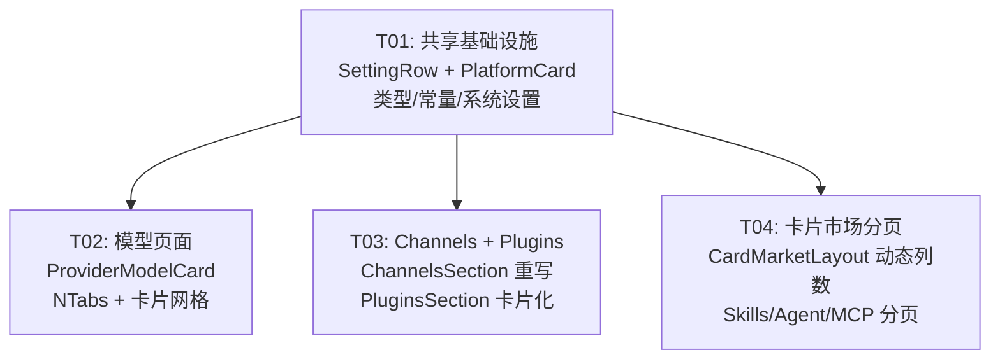

# 设置页完善 — 系统设计文档

> **版本**: v1.0  
> **日期**: 2025-07-09  
> **作者**: 高见远 (Bob, Architect)  
> **状态**: 设计完成，待实现

---

## 目录

1. [需求总览](#1-需求总览)
2. [需求一：模型页面对齐 hermes](#2-需求一模型页面对齐-hermes)
3. [需求二：技能/Agent/MCP/Plugins 卡片列表 + 分页](#3-需求二技能agentmcpplugins-卡片列表--分页)
4. [需求三：Channels 页面对齐 hermes](#4-需求三channels-页面对齐-hermes)
5. [修改文件清单](#5-修改文件清单)
6. [关键设计决策](#6-关键设计决策)
7. [有序任务列表](#7-有序任务列表)
8. [Shared Knowledge](#8-shared-knowledge)
9. [任务依赖图](#9-任务依赖图)

---

## 1. 需求总览

三个增量需求，均基于 kmaster-studio 现有设置页组件与 hermes-studio 参考实现：

| # | 需求 | kmaster 现状 | hermes 参考 |
|---|------|------------|------------|
| 1 | 模型页面 | `ModelManageSection.vue`（608 行，三 tab + 行式供应商列表） | `ModelsView.vue` + `ProvidersPanel.vue` + `ProviderCard.vue`（卡片网格） |
| 2 | 技能/Agent/MCP/Plugins 页 | 部分已有卡片布局，部分为表格，分页未按列数/行数配置化 | N/A（kmaster 自有市场布局 `CardMarketLayout.vue`） |
| 3 | Channels 页 | `ChannelsSection.vue`（581 行，自定义 CRUD 模式） | `PlatformSettings.vue` + `PlatformCard.vue` + `SettingRow.vue`（per-platform 卡片） |

---

## 2. 需求一：模型页面对齐 hermes

### 2.1 现状分析

**kmaster `ModelManageSection.vue`**：
- 三个子标签（供应商 / 模型与默认槽位 / 用量），使用自定义 `<button>` 实现
- 供应商列表为行式 flex 布局（`.mms-provider`），每行展示：名称 + 标签 + URL + API 方法 + 模型数 + 预览 + 操作按钮
- 模型列表使用 `<table>` 展示，含默认槽位选择器
- 用量使用 `<table>` 展示

**hermes `ModelsView.vue` + `ProvidersPanel.vue` + `ProviderCard.vue`**：
- 五个标签（general / auxiliary / combination / stt / tts），使用 `NTabs`
- 供应商使用 CSS Grid 卡片布局：`grid-template-columns: repeat(auto-fill, minmax(min(100%, 420px), 1fr))`
- 每张卡片展示：名称 + 徽章（默认/内置/自定义） + provider key + base URL + 模型标签云 + 默认模型下拉 + 操作按钮行
- 支持别名管理弹窗、可见性管理弹窗、模型刷新/恢复

### 2.2 差异分析与对齐策略

| 维度 | kmaster | hermes | 对齐方案 |
|------|---------|--------|---------|
| 标签组件 | 自定义 button | naive-ui NTabs | 改用 NTabs（视觉一致性） |
| 供应商布局 | 行式 flex | 响应式 Grid 卡片 | 新增 `ProviderModelCard.vue`，使用 Grid |
| 模型预览 | 逗号分隔文本 | 交互式标签云（可点击改别名） | 采用标签云（但 kmaster 无别名需求，简化） |
| 模型可见性 | 无 | NCheckboxGroup 弹窗 | 保留 kmaster 的"全部模型表格"方案，不需要可见性管理 |
| 模型刷新 | 无 | refresh/restore 按钮 | kmaster 已有连通性重测，保留现有逻辑 |
| 默认模型 | 5 槽位选择器 | 每 provider 一个默认模型下拉 | 保留 kmaster 的 5 槽位方案（不与 hermes 对齐） |
| 用量标签 | ✅ 已有 | ❌ 无 | 保留 kmaster 独有的用量标签 |

### 2.3 对齐后的设计

- **标签**：从自定义 button → NTabs (`type="line"`)
- **供应商卡片**：新增 `ProviderModelCard.vue`，grid 布局，每卡片展示：
  - 头部：名称 + provider 类型标签 + Key 状态标签 + 连通性标签
  - 信息行：Base URL / API 方法 / 模型数量
  - 模型标签云：最多展示 20 个模型标签（可点击查看详情）
  - 操作栏：重测 / 编辑 / 删除
- **保留**：模型与默认槽位 tab、用量 tab 不变
- **保留**：`AddModelDialog` / `ResultDialog` 弹窗机制不变

---

## 3. 需求二：技能/Agent/MCP/Plugins 卡片列表 + 分页

### 3.1 现状分析

| 组件 | 当前 UI | 是否卡片 | 分页 |
|------|--------|---------|------|
| `SkillManageSection.vue` | CardMarketLayout + EntityCard/InstalledCard | ✅ 卡片 | 已有 installed 分页（10/页），市场分页（20/页） |
| `AgentRoleSection.vue` | 自定义 `ars-grid` 卡片 | ✅ 卡片 | ❌ 无分页 |
| `McpManageSection.vue` | NTabs + 自定义 `mcm-grid` 卡片 | ✅ 卡片 | ❌ 无分页 |
| `PluginsSection.vue` | NTable 表格 | ❌ 表格 | ❌ 无分页 |

### 3.2 核心改造

**四个页面的统一目标**：
- UI 风格统一为卡片 list
- 三个模块：精选推荐 / installed / 市场可选
- 卡片超过配置列数时启用分页
- 每模块行数从系统设置读取

**分页公式**：
```
每页卡片数 = 列数 × 行数
```
- 列数：`localStorage['km_grid_cols']`，默认 5（已在 `GeneralSection.vue` 中配置）
- 行数：从系统设置分别读取
  - 精选推荐行数：默认 1 行
  - installed 行数：默认 1 行
  - 市场可选行数：默认 4 行

### 3.3 逐组件改造方案

#### 3.3.1 SkillManageSection（最小改动）

已使用 `CardMarketLayout`，改动量最小：
- 透传列数配置给 `CardMarketLayout`
- `CardMarketLayout` 内部读取 `km_grid_cols` 并应用为 `grid-template-columns`

#### 3.3.2 AgentRoleSection

当前使用自定义 `ars-grid`（`repeat(auto-fill, minmax(260px, 1fr))`）：
- **改造**：使用统一的 `CardMarketLayout` 包裹卡片
- 角色列表作为"已安装"模块传入
- 市场候选池通过 `ExpertPickerPanel` 获取
- 分页按 `列数 × installed行数` 计算

#### 3.3.3 McpManageSection

当前使用 NTabs（已部署 / 候选池）：
- **改造**：使用统一的 `CardMarketLayout`
- 已部署作为"已安装"模块
- 候选池作为"市场可选"模块
- 分页按配置计算

#### 3.3.4 PluginsSection

当前是 NTable，需要**完全重写**：
- **改造**：使用统一的 `CardMarketLayout` + 卡片布局
- 新增 `PluginCard.vue` 组件
- 已启用的插件作为"已安装"模块
- 其余作为"市场可选"模块（或全部在 installed 中，按状态分标签）
- 或者简化为：单列表 + 分页（因为插件来自磁盘扫描，无"市场"概念）

> **设计决策**：Plugins 来自磁盘扫描（`GET /api/plugins`），无"精选推荐"和"市场可选"概念。改为卡片 list + 单模块 + 分页。与其他三页（有真实市场数据）不同。

### 3.4 CardMarketLayout 改造

`CardMarketLayout.vue` 当前硬编码 `grid-template-columns: repeat(5, 1fr)`：

**改造点**：
1. 新增 prop：`gridCols: number`（默认 5）
2. `.km-market-grid` 和 `.km-market-installed-grid` 使用 `:style` 动态列数
3. installed 分页大小从固定 `INTERACTION.installedPageSize` → 动态 `gridCols × installedRows`
4. 新增 prop：`installedRows: number`（默认 1）
5. 市场分页大小从父组件透传的 `pageSize` → 也支持 `gridCols × marketRows`
6. 新增 prop：`marketRows: number`（默认 4）

---

## 4. 需求三：Channels 页面对齐 hermes

### 4.1 现状分析

**kmaster `ChannelsSection.vue`**（581 行）：
- 动态 CRUD：可新增/删除任意渠道
- 渠道卡片：type 标签 + id + enabled 开关 + 凭据 tag + 编辑/删除按钮
- 凭据编辑：每项独立弹窗（🔒 只写不回显）
- API：`getPlatformConfig()` / `savePlatformConfig()`

**hermes `PlatformSettings.vue`**（595 行）：
- 固定 10 个平台列表：telegram / discord / slack / whatsapp / matrix / feishu / dingtalk / qqbot / weixin / wecom
- 每个平台使用 `PlatformCard.vue`（可折叠卡片，含图标 + 名称 + 配置状态徽章）
- 每个平台内通过 `SettingRow.vue`（label/hint + control）排列凭据和开关
- 统一的保存/清除凭据按钮

### 4.2 差异分析与对齐策略

| 维度 | kmaster | hermes | 对齐方案 |
|------|---------|--------|---------|
| 平台列表 | 动态 CRUD | 固定 10 个 | 改为固定 10 平台列表（与 hermes 一致） |
| 卡片组件 | 自定义行式卡片 | PlatformCard 可折叠 | 新增 `PlatformCard.vue` + `SettingRow.vue` |
| 凭据管理 | 每项独立弹窗 | 内联输入 + 统一保存 | 改为内联输入（与 hermes 一致） |
| 微信登录 | ❌ 无 | 二维码扫码登录 | 保留 hermes 的微信 QR 登录流程 |
| API | `savePlatformConfig` | `saveSection` + `saveCredentials` | 保留 kmaster 现有 API |

### 4.3 对齐后的设计

- **平台列表**：固定 10 个平台（与 hermes 一致），不再支持动态增删
- **每个平台卡片**：`PlatformCard.vue`
  - 头部：平台图标（SVG inline）+ 名称 + 已配置/未配置徽章 + 展开/收起箭头
  - 主体（展开后）：凭据输入行 + 配置开关行 + 保存/清除按钮
- **行组件**：`SettingRow.vue`（label + hint + slot for control）
- **微信特殊处理**：QR 扫码登录按钮 + 状态提示
- **API 保留**：`getPlatformConfig()` / `savePlatformConfig()`，适配新的数据结构

---

## 5. 修改文件清单

### 5.1 新增文件

| # | 路径 | 用途 |
|---|------|------|
| 1 | `packages/client/src/components/settings/SettingRow.vue` | 通用 label/hint + slot 行组件（hermes 移植） |
| 2 | `packages/client/src/components/settings/PlatformCard.vue` | 可折叠平台卡片（hermes 移植） |
| 3 | `packages/client/src/components/settings/ProviderModelCard.vue` | 模型供应商卡片（hermes ProviderCard 简化版） |
| 4 | `packages/client/src/components/settings/PluginCard.vue` | 插件卡片组件 |

### 5.2 修改文件

| # | 路径 | 改动说明 |
|---|------|---------|
| 5 | `packages/client/src/components/settings/ModelManageSection.vue` | Tab 改用 NTabs；供应商列表改用 ProviderModelCard 网格 |
| 6 | `packages/client/src/components/settings/ChannelsSection.vue` | 重写：固定 10 平台 → PlatformCard + SettingRow 布局 |
| 7 | `packages/client/src/components/settings/PluginsSection.vue` | 重写：NTable → 卡片 list + 分页 |
| 8 | `packages/client/src/components/settings/SkillManageSection.vue` | 透传 gridCols/marketRows 给 CardMarketLayout |
| 9 | `packages/client/src/components/settings/AgentRoleSection.vue` | 集成 CardMarketLayout（或统一分页逻辑） |
| 10 | `packages/client/src/components/settings/McpManageSection.vue` | 集成 CardMarketLayout（或统一分页逻辑） |
| 11 | `packages/client/src/components/market/CardMarketLayout.vue` | 动态列数 + 可配置行数分页 |
| 12 | `packages/client/src/components/settings/GeneralSection.vue` | 新增"市场行数配置"（精选行数 / installed 行数 / 市场行数） |
| 13 | `packages/client/src/types/settings.ts` | 新增 `MarketLayoutSettings` 类型 |
| 14 | `packages/client/src/constants/layout.ts` | 新增 `MARKET_DEFAULTS` 常量 + `km.v3.marketLayout` key |

---

## 6. 关键设计决策

### 6.1 卡片列数配置存储位置

**决策**：继续使用现有 `localStorage['km_grid_cols']`（已在 `GeneralSection.vue` 中读写，默认 5）。

**理由**：
- 已有实现，不需要新建 key
- `GeneralSection.vue` 已提供 3-8 范围的 `NInputNumber` 配置器
- 只需让 `CardMarketLayout.vue` 消费该值

### 6.2 行数配置存储位置

**决策**：新增 `localStorage['km.v3.marketLayout']`，JSON 结构：

```ts
interface MarketLayoutSettings {
  featuredRows: number;   // 精选推荐行数，默认 1
  installedRows: number;  // installed 行数，默认 1
  marketRows: number;     // 市场可选行数，默认 4
}
```

**理由**：
- 与 V3 的 `km.v3.*` 命名规范一致
- 三个值语义接近，放在一个 key 下便于原子读写
- `GeneralSection.vue` 中新增三个 `NInputNumber` 控件

### 6.3 分页组件选型

**决策**：统一使用 naive-ui `NPagination`。

**理由**：
- 已在 `CardMarketLayout.vue` 中使用
- 与项目组件库一致
- 支持 `page` / `pageSize` / `itemCount` 标准 API

### 6.4 平台列表处理

**决策**：kmaster Channels 页的平台列表改为与 hermes 完全一致的固定 10 平台列表，不再支持动态增删。

**理由**：
- 需求明确"UI 与数据要和 hermes-studio 的 settings 页面频道页面保持一致"
- hermes 的平台列表是代码写死的（每个平台凭据字段不同，动态无法覆盖）
- 如果未来需要自定义平台，可在此基础上的"自定义平台"卡片扩展

### 6.5 AgentRoleSection / McpManageSection 是否强制使用 CardMarketLayout

**决策**：不强制度用 CardMarketLayout，但复用其分页逻辑。

**理由**：
- `AgentRoleSection` 的自定义卡片布局更紧凑（含 source 标签、禁用开关等特殊 UI）
- `McpManageSection` 的 deployed/candidates 双 tab 结构与其他市场页面不同
- 提取一个 `useMarketPagination` composable 共享分页配置逻辑比强行统一布局更合理

### 6.6 Plugins 页的特殊处理

**决策**：Plugins 页从表格改为卡片 list，但只保留单模块（全部插件），不设"精选/installed/市场"三个模块。

**理由**：
- 插件来自磁盘扫描（没有市场概念）
- 可通过 kind 过滤标签（已有）和搜索替代多模块
- 如果未来扩展市场插件，再增加三模块结构

---

## 7. 有序任务列表

### T01: 共享基础设施

| 字段 | 内容 |
|------|------|
| **Task ID** | T01 |
| **Task Name** | 共享基础设施：SettingRow、PlatformCard、类型与常量 |
| **Source Files** | `components/settings/SettingRow.vue`（新增）<br>`components/settings/PlatformCard.vue`（新增）<br>`types/settings.ts`（修改：新增 `MarketLayoutSettings`）<br>`constants/layout.ts`（修改：新增 `MARKET_DEFAULTS` + `LS_KEYS.marketLayout` + `INTERACTION` 分页默认值）<br>`components/settings/GeneralSection.vue`（修改：新增三个行数配置控件） |
| **Dependencies** | 无 |
| **Priority** | P0 |

**工作内容**：
1. 从 hermes 移植 `SettingRow.vue`（label/hint + slot），适配 kmaster CSS 变量
2. 从 hermes 移植 `PlatformCard.vue`（可折叠卡片 + icon/name/badge），适配 kmaster CSS 变量
3. 在 `types/settings.ts` 新增 `MarketLayoutSettings` 接口
4. 在 `constants/layout.ts` 新增：
   - `LS_KEYS.marketLayout = 'km.v3.marketLayout'`
   - `MARKET_DEFAULTS = { featuredRows: 1, installedRows: 1, marketRows: 4, gridCols: 5 }`
   - `INTERACTION` 中增加 `defaultFeaturedRows` / `defaultInstalledRows` / `defaultMarketRows`
5. 在 `GeneralSection.vue` 新增三个 `NInputNumber`（精选行数 1-3、installed 行数 1-5、市场行数 1-10），持久化到 `km.v3.marketLayout`

---

### T02: 模型页面 — Provider 卡片网格

| 字段 | 内容 |
|------|------|
| **Task ID** | T02 |
| **Task Name** | 模型页面重构：NTabs + ProviderModelCard 卡片网格 |
| **Source Files** | `components/settings/ProviderModelCard.vue`（新增）<br>`components/settings/ModelManageSection.vue`（修改）<br>`stores/modelConfig.ts`（修改：按需添加卡片展示辅助 getter） |
| **Dependencies** | T01 |
| **Priority** | P0 |

**工作内容**：
1. 创建 `ProviderModelCard.vue`：
   - 参考 hermes `ProviderCard.vue` 布局，简化为 kmaster 所需字段
   - 头部：provider 名称 + 类型标签 + Key 状态标签 + 连通性标签
   - 信息行：Base URL / API 方法 / 模型数量
   - 模型标签云：最多 20 个标签，点击可高亮
   - 操作栏：重测（loading）/ 编辑 / 删除（Popconfirm）
   - 样式：kmaster CSS 变量，Grid item
2. 修改 `ModelManageSection.vue`：
   - 三标签从自定义 `<button>` 改为 `NTabs`（`type="line"`）
   - 供应商面板改用 CSS Grid：`grid-template-columns: repeat(auto-fill, minmax(340px, 1fr))`
   - 渲染 `ProviderModelCard` 替代原有的 `.mms-provider` 行式布局
   - 保留"模型与默认槽位"、"用量"两个 tab 不变
   - 保留 `AddModelDialog` / `ResultDialog` 弹窗机制

---

### T03: Channels + Plugins 页面重构

| 字段 | 内容 |
|------|------|
| **Task ID** | T03 |
| **Task Name** | Channels 页面对齐 hermes + Plugins 页面卡片化 |
| **Source Files** | `components/settings/ChannelsSection.vue`（修改：重写）<br>`components/settings/PluginsSection.vue`（修改：重写）<br>`components/settings/PluginCard.vue`（新增） |
| **Dependencies** | T01（依赖 SettingRow.vue、PlatformCard.vue） |
| **Priority** | P0 |

**工作内容**：

**ChannelsSection 重写**：
1. 平台列表改为固定 10 个（与 hermes `PlatformSettings.vue` 一致）：
   telegram / discord / slack / whatsapp / matrix / feishu / dingtalk / qqbot / weixin / wecom
2. 每个平台渲染 `PlatformCard`，内部通过 `SettingRow` 排列凭据输入和开关
3. 凭据字段、配置开关与 hermes 一致（各平台字段见 hermes `PlatformSettings.vue` 的 template）
4. 微信平台：保留 QR 扫码登录流程
5. 统一的保存/清除凭据按钮（per-platform）
6. API 适配：保留 `getPlatformConfig()` / `savePlatformConfig()`，适配新的数据结构
7. 移除旧的动态 CRUD 弹窗（新增渠道 / 编辑凭据弹窗）

**PluginsSection 重写**：
1. 创建 `PluginCard.vue`：图标 + 名称 + kind/status 标签 + 描述 + 环境要求标签 + 工具数
2. 用卡片网格 + 搜索 + kind 过滤替代 NTable
3. 分页：`列数 × 行数`（行数从系统设置读取，默认 4）
4. 保留现有的搜索、kind 过滤、加载/空/错误三态

---

### T04: 卡片市场统一分页

| 字段 | 内容 |
|------|------|
| **Task ID** | T04 |
| **Task Name** | CardMarketLayout 动态列数 + 可配置行数分页 |
| **Source Files** | `components/market/CardMarketLayout.vue`（修改）<br>`components/settings/SkillManageSection.vue`（修改）<br>`components/settings/AgentRoleSection.vue`（修改）<br>`components/settings/McpManageSection.vue`（修改） |
| **Dependencies** | T01（依赖类型与常量定义） |
| **Priority** | P1 |

**工作内容**：

**CardMarketLayout 改造**：
1. 新增 props：`gridCols?: number`（默认 5）、`installedRows?: number`（默认 1）、`marketRows?: number`（默认 4）
2. `.km-market-grid` 和 `.km-market-installed-grid` 的 `grid-template-columns` 从硬编码 `repeat(5, 1fr)` 改为动态 inline style
3. installed 分页大小：`gridCols × installedRows`
4. 市场分页大小透传给父组件的 `pageSize`
5. 从 `localStorage['km_grid_cols']` 和 `localStorage['km.v3.marketLayout']` 读取默认值

**SkillManageSection 适配**：
- 透传 `gridCols`、`installedRows`、`marketRows` 给 `CardMarketLayout`
- 已安装分页大小和外部分页大小按新公式计算

**AgentRoleSection 适配**：
- 添加分页支持：计算 `pageSize = gridCols × installedRows`
- 角色列表分页展示（当前无分页，角色多时页面过长）
- 或在角色数较少时保持不分页（仅超过阈值时启用）

**McpManageSection 适配**：
- 已部署和候选池分别计算分页大小
- 添加分页控件（NPagination）
- 候选池使用 `gridCols × marketRows`，已部署使用 `gridCols × installedRows`

---

## 8. Shared Knowledge

```
- 所有 CSS 变量遵循 kmaster 命名约定：--km-{category}（如 --km-space-md、--km-border、--km-panel）
- localStorage key 遵循 V3 命名：km.v3.*
- 卡片列数真源：localStorage['km_grid_cols']，默认 5，范围 3-8
- 卡片行数真源：localStorage['km.v3.marketLayout']，JSON { featuredRows, installedRows, marketRows }
- SettingRow.vue 是纯展示组件（label/hint + slot），不耦合任何业务逻辑
- PlatformCard.vue 是可折叠容器组件（header + expandable body slot），不耦合平台特定字段
- 所有 API 调用保持现有端点不变（getModels / putProvider / getPlatformConfig / savePlatformConfig 等）
- hermes 移植的组件需适配 kmaster CSS 变量体系（不使用 hermes 的 $bg-card / $border-color 等 SCSS 变量）
- 微信 QR 登录流程需完整保留（fetchWeixinQrCode → pollWeixinQrStatus → saveWeixinCredentials）
- 凭据类字段使用 type="password" + show-password-on="click"（🔒 只写不回显）
```

---

## 9. 任务依赖图



**依赖说明**：
- T02 依赖 T01：`ProviderModelCard` 内部可能复用 `SettingRow` 的 label/control 排版思路；`ModelManageSection` 使用 NTabs（naive-ui 已在项目中）
- T03 依赖 T01：`ChannelsSection` 直接使用 `SettingRow` + `PlatformCard`；`PluginsSection` 的 `PluginCard` 复用相同的卡片风格
- T04 依赖 T01：使用 `MarketLayoutSettings` 类型和 `MARKET_DEFAULTS` 常量；从 localStorage 读取配置

**并行策略**：T02、T03、T04 可并行开发（T01 完成后），三者修改的文件互不重叠。

---

## 附录 A：hermes 参考文件清单

| 文件 | 用途 |
|------|------|
| `hermes-studio/.../views/hermes/ModelsView.vue` | 模型页顶层（5 tab） |
| `hermes-studio/.../components/hermes/models/ProvidersPanel.vue` | 供应商网格容器 |
| `hermes-studio/.../components/hermes/models/ProviderCard.vue` | 供应商卡片（含别名/可见性/刷新） |
| `hermes-studio/.../components/hermes/settings/PlatformSettings.vue` | 平台设置页（10 平台） |
| `hermes-studio/.../components/hermes/settings/PlatformCard.vue` | 可折叠平台卡片 |
| `hermes-studio/.../components/hermes/settings/SettingRow.vue` | label/hint + control 行 |

## 附录 B：CSS 变量对照（hermes → kmaster）

| hermes SCSS 变量 | kmaster CSS 变量 |
|-------------------|-------------------|
| `$bg-card` | `var(--km-panel)` |
| `$border-color` | `var(--km-border)` |
| `$border-light` | `var(--km-border)` |
| `$text-primary` | `var(--km-text)` |
| `$text-secondary` | `var(--km-text)` + `opacity: 0.75` |
| `$text-muted` | `var(--km-text)` + `opacity: 0.5` |
| `$accent-primary` | `var(--km-accent)` |
| `$radius-md` / `$radius-sm` | `var(--km-radius-lg)` / `var(--km-radius-md)` / `var(--km-radius-sm)` |
| `$font-code` | `var(--km-mono, ui-monospace, monospace)` |
| `$success` / `$warning` | `var(--km-success)` / `var(--km-warning)` |
