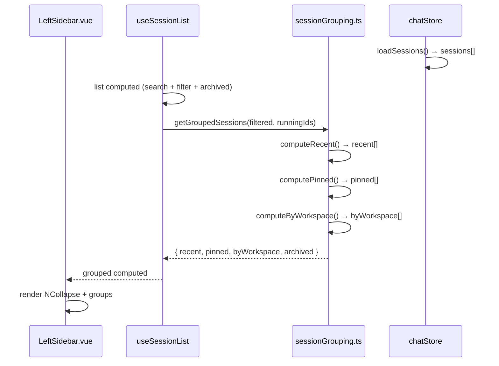
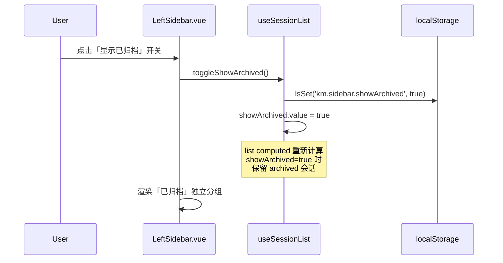
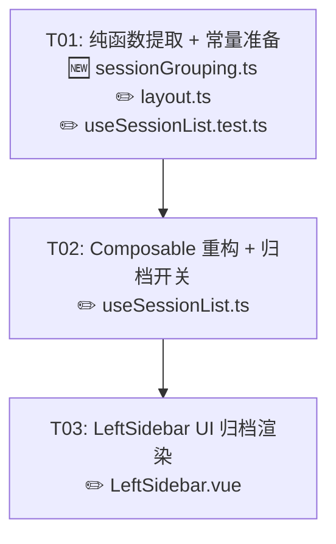

# T03 增量实现规格：会话列表域（SL-01 ~ SL-05）

| 项 | 值 |
|---|---|
| 文档类型 | IMPLEMENTATION SPEC（增量系统设计 + 任务分解） |
| 作者 | 高见远（Architect / software-architect） |
| 上游输入 | `TECHNICAL-SOLUTION-pages-data-alignment.md` T03 条目 |
| 基线代码 | `packages/client/src/composables/useSessionList.ts` 当前 HEAD |
| 状态 | 待工程师实现 |

---

## 1. 现状分析

### 1.1 当前分组逻辑全貌

分组逻辑的真源在 **`packages/client/src/composables/useSessionList.ts`**，分三段：

| 段 | 位置 | 用途 |
|---|---|---|
| `list` computed | L151-167 | 搜索+过滤后的可见列表（排 archived） |
| `runningIds` computed | L184-190 | running 态会话 ID 集合（真源 `chatStore.runState`） |
| `getGroupedSessions` computed | L250-257 | 三分组产物 `{ recent, pinned, byWorkspace }` |

三个核心算法函数是 `useSessionList()` 的**闭包私有方法**，外部不可导入：

| 函数 | 行号 | 逻辑 |
|---|---|---|
| `computeRecent(all, running, now)` | L198-213 | running ∪ 前 N 条 ∪ N 小时内 → 截断 |
| `computeByWorkspace(all)` | L221-240 | 按 workspace 末级目录分组 → 排序 |
| pinned 过滤 | L254 | 内联在 `getGroupedSessions` computed 中（`!!s.pinned`） |

### 1.2 与 hermes 参照的差异

| 维度 | hermes `session-category-groups.ts` | kmaster 当前 | 裁定 |
|---|---|---|---|
| 分组维度 | `source` / `pinned` / `category` 三维 | `recent` / `pinned` / `workspace` 三维 | D3：kmaster 不做 category |
| 分组算法形态 | 导出纯函数 `buildVisibleSessionCategoryGroups<T>()` | 闭包私有方法 | SL-01：应下沉为纯函数 |
| 置顶存储 | localStorage（`pinnedSessions` Set） | kmaster.db 侧车三态 | L1：保留 kmaster 方案 |
| 归档可见性 | 无开关（hermes 无归档概念） | 硬过滤 `!s.archived` | SL-04：需开关控制 |

### 1.3 现状问题清单

| # | 问题 | 严重度 | 对应需求 |
|---|---|---|---|
| **P1** | `computeRecent` / `computeByWorkspace` 是闭包私有函数，`useSessionList.test.ts` 必须**逐字复制一份**才能测试——实现改了测试不会同步报错 | 高 | SL-01 |
| **P2** | 归档会话**无法查看**：`list` computed 中 `!s.archived` 硬过滤，无任何 UI 开关让用户看到已归档会话 | 中 | SL-04 |
| **P3** | pinned 过滤逻辑内联在 computed 表达式（L254），不是独立函数，不可复用/不可单测 | 低 | SL-01 |

### 1.4 已正确的部分（无需改动）

| 条目 | 现状 | 判定 |
|---|---|---|
| **SL-02** | `togglePin()` 读 `s.pinned`（服务端字段），不读本地 `pinnedSessions` Set；`togglePin()` 是乐观更新+PATCH+失败回滚；`archived` 保持 `number` 0/1 | ✅ 已对齐 |
| **SL-03** | category 维度不存在；`workspaceKeyOf` 把 workspace 路径映射为分组 key；D3/D4 已落地 | ✅ 已降权 |
| **SL-05** | workspace 分组通过 `NCollapse` 渲染；`defaultExpanded` 仅含 RECENT + PINNED；折叠态持久化由 `useCollapseState` 驱动（默认收缩） | ✅ 已保留形态 |

---

## 2. 修改文件清单

标记：🆕 新建 ｜ ✏️ 修改 ｜ 👁 只读不改

| 相对路径 | 标记 | 改动要点 |
|---|---|---|
| `packages/client/src/utils/sessionGrouping.ts` | 🆕 | 纯函数模块：`computeRecent` / `computeByWorkspace` / `computePinned` / `getGroupedSessions` |
| `packages/client/src/composables/useSessionList.ts` | ✏️ | 删除闭包私有函数，改为 import 纯函数；新增 `showArchived` ref + localStorage 持久化 |
| `packages/client/src/components/layout/LeftSidebar.vue` | ✏️ | 新增「显示已归档」开关按钮 + 已归档会话区渲染 |
| `packages/client/src/constants/layout.ts` | ✏️ | `LS_KEYS` 新增 `showArchived: 'km.sidebar.showArchived'` |
| `packages/client/src/composables/useSessionList.test.ts` | ✏️ | 从 `utils/sessionGrouping` import 纯函数，删除本地副本；新增归档可见性测试 |
| `packages/client/src/stores/chat.ts` | 👁 | `togglePin` / `archiveSession` / `loadSessions` 已就绪，**零改动** |
| `packages/client/src/types/chat.ts` | 👁 | `Session` 类型已含 `pinned` / `archived` / `workspace`，**零改动** |
| `packages/server/src/routes/sessions.ts` | 👁 | `mergeSession` / `resolveTriStateFlag` / PATCH/PUT 已就绪，**零改动** |

---

## 3. 数据结构与接口变化

### 3.1 新增纯函数模块签名

```ts
// packages/client/src/utils/sessionGrouping.ts

import type { Session } from '../types/chat';
import type { WorkspaceGroup, GroupedSessions } from '../composables/useSessionList';

/**
 * Recent 并集算法：running ∪ 前 maxCount 条 ∪ withinHours 小时内活跃。
 * 纯函数：入参决定出参，零副作用。
 */
export function computeRecent(
  all: Session[],
  running: Set<string>,
  now?: number
): Session[];

/**
 * 工作区分组：按 workspace 末级目录名分组。
 * 组间字典序升序（未绑定组置末），组内 updated_at 倒序。
 */
export function computeByWorkspace(all: Session[]): WorkspaceGroup[];

/**
 * 置顶会话列表：过滤 pinned=true 且未归档，按 updated_at 倒序。
 */
export function computePinned(all: Session[]): Session[];

/**
 * 三分组聚合：一次调用产出 { recent, pinned, byWorkspace }。
 * 内部调用上述三个纯函数，排序顺序为置顶优先 + updated_at 倒序。
 */
export function getGroupedSessions(
  all: Session[],
  running: Set<string>,
  now?: number
): GroupedSessions;
```

### 3.2 `useSessionList` 新增导出

```ts
// 在 useSessionList() 返回值中新增：

/** 是否显示已归档会话。默认 false；状态持久化到 localStorage。 */
showArchived: Ref<boolean>;

/** 切换 showArchived 并落盘。 */
toggleShowArchived: () => void;
```

### 3.3 localStorage 新增 key

```ts
// packages/client/src/constants/layout.ts  LS_KEYS 中新增：
showArchived: 'km.sidebar.showArchived'
```

### 3.4 `GroupedSessions` 新增字段

```ts
export interface GroupedSessions {
  recent: Session[];
  pinned: Session[];
  byWorkspace: WorkspaceGroup[];
  /** SL-04 新增：已归档会话列表（showArchived=true 时有值） */
  archived: Session[];
}
```

### 3.5 API / 后端变更

**无。** 所有变更纯前端。后端 `routes/sessions.ts` 的 `mergeSession()` / `resolveTriStateFlag()` / PATCH 三态语义全部保留不动。

---

## 4. 调用流程

### 4.1 分组计算流程（SL-01 改造后）



### 4.2 归档开关流程（SL-04）



### 4.3 置顶切换流程（SL-02，无改动）

```
User click pin → onTogglePin(sid)
  → store.togglePin(sid) ← 乐观改 s.pinned + PATCH + 失败回滚上抛
  → LeftSidebar await + catch → toast(errText)
  → getGroupedSessions 自动重算（pinned 是响应式 computed 的依赖）
```

---

## 5. 任务列表

> 共 **3 个任务**，按依赖排序。T01 为基础设施，必须最先完成。

---

### T01 — 纯函数提取与常量准备 `P0`

**需求编号**：SL-01（主）、SL-02（辅：pinned 函数化）

**涉及文件**：

| 标记 | 文件 |
|---|---|
| 🆕 | `packages/client/src/utils/sessionGrouping.ts` |
| ✏️ | `packages/client/src/constants/layout.ts` |
| ✏️ | `packages/client/src/composables/useSessionList.test.ts` |

**依赖**：无

**改动要点**：

1. 新建 `utils/sessionGrouping.ts`：从 `useSessionList.ts` 提取 `computeRecent` / `computeByWorkspace`，新增 `computePinned` / `getGroupedSessions`，全部为纯函数（入参 `Session[]` + 配置，出参分组结果，零 ref/store 依赖）。
2. `constants/layout.ts`：`LS_KEYS` 新增 `showArchived: 'km.sidebar.showArchived'`（供 T02 使用）。
3. `useSessionList.test.ts`：删除本地复制的三个算法函数，改为从 `utils/sessionGrouping` import；新增 `computePinned` 测试（从原 Q8 段迁移）。

**验收标准**：

- [ ] `sessionGrouping.ts` 内**零** `ref` / `computed` / `store` / `useXxx()` 引用
- [ ] `getGroupedSessions(sessions, running)` 同一入参恒等出参
- [ ] `computeRecent` / `computeByWorkspace` 行为与改造前 `useSessionList.ts` 闭包版本**完全一致**
- [ ] `useSessionList.test.ts` 全部 27 条测试**全绿**（vitest run）
- [ ] 新文件通过 `tsc --noEmit` 类型检查

---

### T02 — Composable 重构 + 归档开关逻辑 `P0`

**需求编号**：SL-01（收尾）、SL-04（核心）

**涉及文件**：

| 标记 | 文件 |
|---|---|
| ✏️ | `packages/client/src/composables/useSessionList.ts` |

**依赖**：**T01**（需要 `sessionGrouping.ts` 纯函数 + `LS_KEYS.showArchived`）

**改动要点**：

1. 删除 `useSessionList()` 内的闭包私有函数 `computeRecent` / `computeByWorkspace`，改为 import `sessionGrouping.ts` 的纯函数。
2. `getGroupedSessions` computed 改为调用纯函数 `getGroupedSessions(filtered, runningIds.value)`。
3. 新增 `showArchived` ref：初始值从 `lsGet(LS_KEYS.showArchived, false)` 读取；`toggleShowArchived()` 切换并 `lsSet` 落盘。
4. `list` computed 改造：`showArchived.value === true` 时不过滤 `archived`；默认 `false` 时保持现有行为（排除 archived）。
5. 新增 `archivedSessions` computed：当 `showArchived === true` 时，从 `store.sessions` 中筛选 `s.archived === 1` 的会话（未经过滤/搜索），传给 `getGroupedSessions.archived`。
6. 在返回值中导出 `showArchived` / `toggleShowArchived`。

**验收标准**：

- [ ] `getGroupedSessions` 行为与改造前完全一致（默认 showArchived=false 时无回归）
- [ ] 开关切换到 `true`：已归档会话出现在 `grouped.archived` 数组中
- [ ] 开关切换回 `false`：已归档会话消失
- [ ] 刷新页面后开关状态保持（localStorage 持久化）
- [ ] 归档会话仍不出现在 `recent` / `pinned` / `byWorkspace` 中（SL-04 要求）
- [ ] `useSessionList.test.ts` 全部测试**全绿**

---

### T03 — LeftSidebar UI：归档分组渲染 `P1`

**需求编号**：SL-04（UI 部分）

**涉及文件**：

| 标记 | 文件 |
|---|---|
| ✏️ | `packages/client/src/components/layout/LeftSidebar.vue` |

**依赖**：**T02**（需要 `showArchived` / `toggleShowArchived` / `grouped.archived` 数据）

**改动要点**：

1. 在搜索/过滤按钮区或会话列表顶部新增「显示已归档」开关（Naive UI `NSwitch` + 标签文案）。
2. 在 workspace 分组之后（定时任务列表之前）新增「已归档」独立分组：仅 `showArchived && grouped.archived.length > 0` 时渲染。
3. 已归档会话行样式：降低透明度（`opacity: 0.55`）以区分活跃会话。
4. 已归档会话行的操作：保留「取消归档」（调用 `store.archiveSession(sid, false)`）和「删除」，不显示置顶按钮。
5. `defaultExpanded` 追加归档分组的 name（`SIDEBAR_GROUP.ARCHIVED`），或在 `SIDEBAR_GROUP` 常量中新增 `ARCHIVED: '__archived__'`。

**验收标准**：

- [ ] 默认不显示已归档会话（`showArchived` 默认 false）
- [ ] 点击开关后出现「已归档」分组，包含所有 `archived === 1` 的会话
- [ ] 已归档会话有视觉降权（低透明度/灰色调）
- [ ] 已归档会话可「取消归档」→ 回到活跃列表
- [ ] 刷新后开关状态 + 列表可见性与刷新前一致
- [ ] 不影响现有 recent / pinned / workspace 三组的渲染
- [ ] 不影响定时任务列表的渲染

---

## 6. 任务依赖图



---

## 7. 依赖包

**本次不新增任何三方依赖。** 全部改动基于仓库现有依赖完成。

```
# 前端 packages/client（现存）
- vue@^3.x               : 框架（ref / computed / watch）
- naive-ui@^2.x          : UI 组件（NSwitch / NCollapse / NCollapseItem / NScrollbar 均已可用）
- pinia@^2.x             : 状态管理（复用现有 chatStore）
- vitest                 : 单测运行器（复用现有）
```

---

## 8. 共享知识（横切约定）

### 8.1 分组非互斥（Q8，不可打破）

```
recent / pinned / byWorkspace 三段**非互斥**：同一会话可同时出现在多组。
渲染 key 必须写 `${groupKey}:${s.id}` 防冲突。
🚫 不得把三组改成互斥——Q8 列表项与单测 ⑧ 都是此语义的锁。
```

### 8.2 置顶三态（L1，不动）

```
真源 = session.pinned（服务端字段，boolean | undefined）
kmaster.db 侧车 → resolveTriStateFlag() → 前端
前端严禁引入 localStorage 存置顶状态
```

### 8.3 归档出参（不动）

```
Session.archived : number (0/1)，判据一律写 !s.archived
不要写成 s.archived === false（0 是 falsy 但 number 不是 boolean）
```

### 8.4 纯函数约束

```
sessionGrouping.ts 内：
✅ 允许 import：types/chat.ts、constants/sidebar.ts、utils/time.ts
🚫 禁止 import：任何 .vue 文件、stores/*、composables/*（除了类型）
🚫 禁止使用 ref / computed / watch / onMounted 等 Vue 响应式 API
```

### 8.5 localStorage key 规范

```
- 格式：'km.sidebar.<name>'
- 新增 key：'km.sidebar.showArchived'（boolean，默认 false）
- 读写统一走 constants/layout.ts 的 lsGet / lsSet 包装（静默处理隐私模式/配额超限）
```

### 8.6 颜色/视觉约定

```
- 已归档会话行：opacity: 0.55（复用 kmaster 现有的降权模式）
- 已归档分组标题：与现有 .km-list-group-title 一致，无需特殊样式
- 🚫 不做视觉改版（配色/圆角/间距沿用现状）
```

---

## 9. 开放项（Anything UNCLEAR）

| # | 事项 | 判定 | 阻塞级别 |
|---|---|---|---|
| **Q1** | `SidebarSessionItem.vue` 是否需要在本次接入 | 现 LeftSidebar.vue 的会话行是**内联渲染**（未使用 SidebarSessionItem.vue 组件）。本次不改这个架构——已归档行也用内联渲染，保持与置顶/工作区行一致。SidebarSessionItem.vue 的接入是独立重构任务。 | 无 |
| **Q2** | 归档分组是否需要搜索/过滤 | 本次不接入。归档列表就是全量 `store.sessions.filter(s => s.archived === 1)`，不经过 `list` computed 的搜索/过滤管线。理由：归档量通常不大，加搜索/过滤增加复杂度却无实际收益。 | 低 |
| **Q3** | 归档分组的折叠态是否需要单独持久化 | 采用 `useCollapseState` 的既有机制：新增 `SIDEBAR_COLLAPSE_KEYS.archived: 'group:archived'`，默认展开。用户手动折叠后自动落盘。 | 无 |

---

## 附录 A：需求覆盖率矩阵

| 需求编号 | 标题 | T01 | T02 | T03 | 状态 |
|---|---|---|---|---|---|
| SL-01 | 分组计算抽为纯函数 | ✅ | ✅ | — | T01+T02 完成 |
| SL-02 | 置顶读写口径 = kmaster 后端三态 | ✅ | — | — | 已就绪，T01 纯函数化是辅助 |
| SL-03 | 降权——category 暂不做 | — | — | — | 已就绪（D3/D4 已落地） |
| SL-04 | 归档会话列表行为对齐 | — | ✅ | ✅ | T02+T03 完成 |
| SL-05 | workspace 第 4 分组保留形态 | — | — | — | 已就绪（默认折叠已落地） |

## 附录 B：与主方案文档的关系

本文件是 `TECHNICAL-SOLUTION-pages-data-alignment.md` 的 **T03 增量细化**，两者关系：

- 主方案 §5 T03 条目指定了 5 个需求编号与大致文件路径
- 主方案 §2.2 写 `components/session/*.vue`——该目录**实际为空**，本文件以 `LeftSidebar.vue` 替代
- 主方案 §5 说 `stores/chat.ts` 不改——本文件确认 `chat.ts` **零改动**
- 本文件的所有决策（三态置顶、分组非互斥、category 降权）均遵从主方案的决策基线（§0.1~0.3）

**冲突裁决**：本文件为 T03 的**唯一执行真源**。若与主方案的 T03 条目描述不一致，以本文件为准（主方案写于代码调查之前）。
