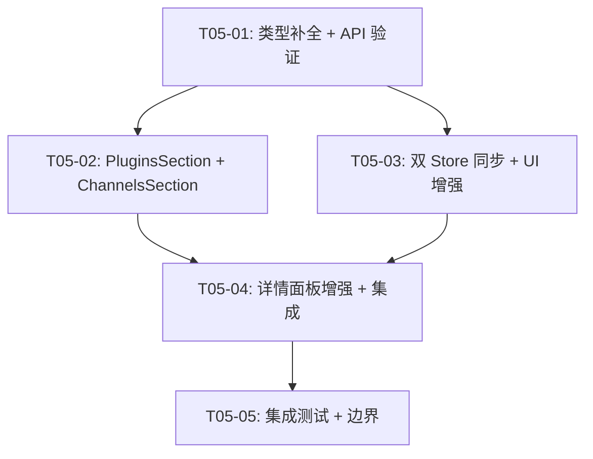
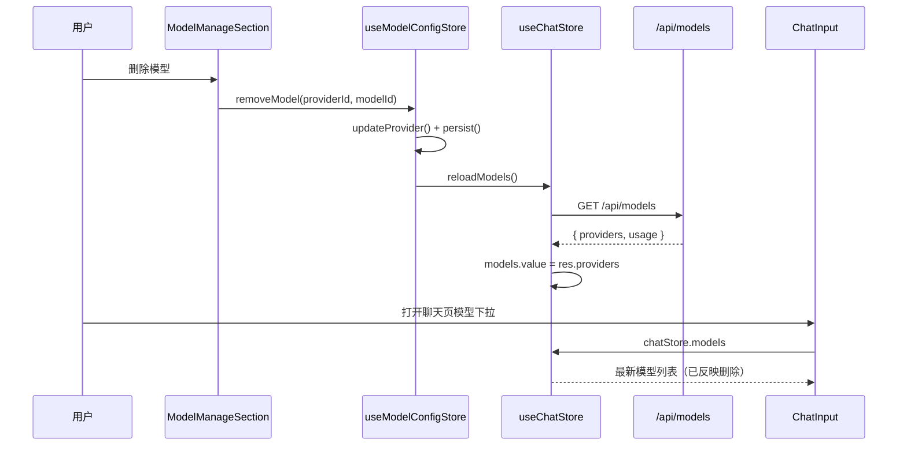
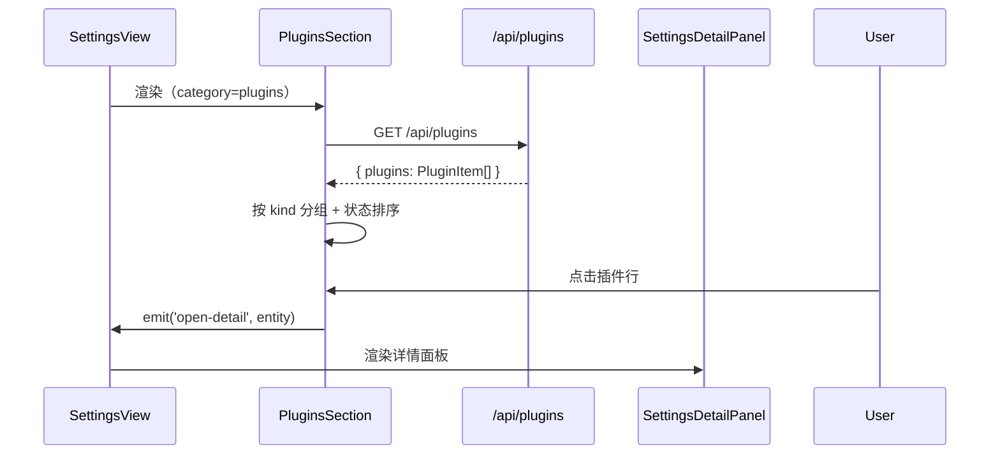
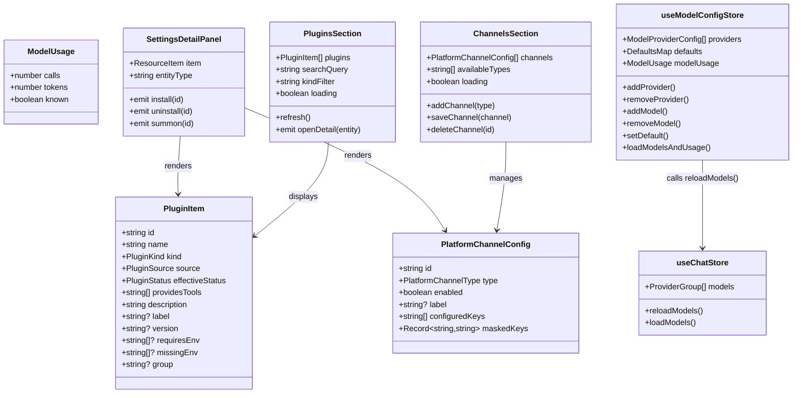

# T05 实现规格：设置页 Skills/MCP/Plugins/Channels + 模型双 Store

> **状态**: 增量设计（在 T01-T04 已完成基础上）
> **日期**: 2026-08
> **架构师**: Bob (software-architect-2)

---

## 1. 现状分析

### 1.1 当前设置页架构

`SettingsView.vue` 将 12 个设置类别映射到渲染组件：

| 类别 | 当前组件 | 实现状态 |
|------|---------|---------|
| `monitor` | `MonitorSection` | ✅ 完成 |
| `general` | `GeneralSection` | ✅ 完成 |
| `account` | `ProfileSection` | ✅ 完成 |
| `agent-role` | MarketLayout + NTabs | ✅ T03 完成 |
| `skills` | MarketLayout + NTabs | ✅ T03 完成（ST-05 D1 口径已落地） |
| `mcp` | MarketLayout + NTabs | ✅ T03 完成（ST-06 deployed 字段已对齐） |
| `tools` | `ToolsSection` | ⚠️ 静态桩数据 |
| `plugins` | `PlaceholderSection` | ❌ 需替换为真实页 |
| `channel` | `PlaceholderSection` | ❌ 需替换为真实页 |
| `memory` | `MemoryView` (embedded) | ✅ 完成 |
| `model` | `ModelManageSection` | ⚠️ 需双 Store 同步 + UI 对齐 |
| `jobs` | `JobsView` (embedded) | ✅ 完成 |

### 1.2 关键缺口

#### ST-05（Skills installed 数据逻辑）：**已完成** ✅

`SettingsView.vue` 的 `fetchAllSkillSettings()` 已实现 D1 口径：
- 一次请求 `GET /api/skills` 拿全 `installed + candidates`
- 候选区过滤已装项（按 name 小写比对）
- candidates 自身按 name 去重（COS/hermes 双来源）
- 分类维度用后端 `categories`

`useSkillList()` 组合层同样实现了上述口径。**不需要修改**。

#### ST-06（MCP deployed 字段口径对齐）：**已完成** ✅

后端 `routes/mcp.ts` → `mergeMcpLists()` 返回 `{ deployed, candidates }`。
前端 `fetchAllMcpSettings()` 使用 `getMcpList().deployed` 映射已部署列表。
`McpManageSection.vue` 直接使用 `getMcpList()` 双区数据。**不需要修改**。

#### ST-07（Plugins 页）：**后端已有，前端缺失** ❌

后端：
- `routes/plugins.ts` → `GET /api/plugins` 已注册
- `services/hermes/aggregate/plugins.ts` → `listAggregatePlugins()` 磁盘扫描完整实现
- 支持三态（enabled / disabled / needs_config）、双源（bundled / user）

前端：
- `api/client.ts` 已有 `getPlugins()` 函数
- `PlaceholderSection.vue` 仅显示「未纳入当前版本」
- 需要新建 `PluginsSection.vue`（只读列表，按 kind 分组 + 状态标签 + 搜索过滤）

#### ST-08（Channels 页）：**后端已有，前端缺失** ❌

后端：
- `routes/config.ts` → `GET/PUT /api/config/platform` 已注册
- 完整的渠道 CRUD（整表替换 + 增量凭据合并 + 掩码回显）

前端：
- `api/client.ts` 已有 `getPlatformConfig()` / `savePlatformConfig()` 函数
- `PlaceholderSection.vue` 仅显示占位
- 需要新建 `ChannelsSection.vue`（列表 + 新增/编辑/启用开关 + 凭据输入）

#### ST-09（四详情页统一双模块卡片布局）：**部分完成** ⚠️

`SettingsDetailPanel.vue` 已存在但功能基础（只显示图标/名称/描述/标签/安装卸载）。
需要增强为：双模块卡片（Provider 信息 + 资源详情），支持 expert/skill/mcp/plugin/channel 五种实体类型。

#### MD-01（双 Store 架构）：**核心缺口** ❌

当前模型数据流向：
```
useModelConfigStore (设置页)     useChatStore.models (聊天选择器)
        ↓                                ↓
   localStorage                 GET /api/models (轮询?)
        ↓                                ↓
   ModelManageSection           ChatInput 模型下拉
```

两者**完全不同步**：设置页改了模型后，聊天页的模型选择器不会更新。

hermes 模式（参考）：
```typescript
// useModelsStore — 设置页模型管理
async function setDefaultModel(modelId, provider) {
  await systemApi.updateDefaultModel(...)
  await useAppStore().reloadModels()  // ← 关键：写后同步
}
// useAppStore.modelGroups — 聊天选择器数据源
// 两者同源（GET /api/available-models），reloadModels() 做 TTL 缓存刷新
```

kmaster 需要：
1. `useChatStore` 新增 `reloadModels()` 方法（强制刷新 `models` 字段）
2. `useModelConfigStore` 的写操作（addProvider/removeProvider/addModel/removeModel/setDefault）后调用 `useChatStore().reloadModels()`
3. ChatInput 模型下拉改用 `useChatStore.models`（已在使用，见 `ProviderSection.vue` 的 `modelOptions`）

#### MD-02（模型 UI 对齐 hermes）：**部分完成** ⚠️

当前 `ModelManageSection.vue` 模型表格列：
- 模型名 / 供应商 / 能力 / 上下文 / 操作

hermes 模型列表（参考 `ModelSettings.vue` + `ProvidersPanel.vue`）：
- Provider 卡片 + 模型表格（名称 / 上下文长度 / 能力 / 可见性 / 操作）
- 模型可见性开关（ModelVisibility toggle）
- Provider 级别的 Key 管理（已由 `ProviderSection.vue` 覆盖）

缺失：模型可见性（ModelVisibility）——当前 kmaster 没有这个能力。
考虑：kmaster 后端 `GET /api/models` 返回的 `ProviderGroup` 没有 visibility 字段。
建议：本次不引入 visibility（后端改动大），仅优化现有 UI 展示。

#### MD-03（usage 独立 Tab）：**已完成** ✅

`ModelManageSection.vue` 已有「用量」子标签（`subTab === 'usage'`），数据来自 `store.loadModelsAndUsage()`。

### 1.3 文件级别依赖关系

```
SettingsView.vue
  ├─ SECTION_MAP[plugins]  → PluginsSection.vue    [新建]
  ├─ SECTION_MAP[channel]  → ChannelsSection.vue   [新建]
  ├─ SECTION_MAP[model]    → ModelManageSection.vue [修改]
  └─ SettingsDetailPanel.vue                        [修改]

ModelManageSection.vue
  └─ useModelConfigStore()                          [修改]
       └─ → useChatStore().reloadModels()           [新增]

ChatInput.vue / ChatView.vue
  └─ useChatStore.models                            [已有，只读]
  └─ useChatStore.reloadModels()                    [新增]
```

---

## 2. 修改文件清单

### 2.1 新建文件

| # | 路径 | 说明 |
|---|------|------|
| 1 | `packages/client/src/components/settings/PluginsSection.vue` | ST-07：Plugins 管理真实页 |
| 2 | `packages/client/src/components/settings/ChannelsSection.vue` | ST-08：Channels 管理真实页 |

### 2.2 修改文件

| # | 路径 | 改/增 | 说明 |
|---|------|-------|------|
| 3 | `packages/client/src/views/SettingsView.vue` | 修改 | 注册 PluginsSection / ChannelsSection + 从 MarketLayout 模式中移除 mcp（改为独立 section）+ 增强详情面板 |
| 4 | `packages/client/src/components/common/SettingsDetailPanel.vue` | 修改 | ST-09：双模块卡片布局 |
| 5 | `packages/client/src/stores/chat.ts` | 修改 | MD-01：新增 `reloadModels()` 方法 |
| 6 | `packages/client/src/stores/modelConfig.ts` | 修改 | MD-01：写操作后调用 `useChatStore().reloadModels()` |
| 7 | `packages/client/src/components/settings/ModelManageSection.vue` | 修改 | MD-02：UI 对齐（可见性列、Provider 卡片增强） |
| 8 | `packages/client/src/api/client.ts` | 修改 | 确认 `getPlugins()` / `getPlatformConfig()` 完整 |
| 9 | `packages/server/src/index.ts` | 不需修改 | 路由已注册 |

### 2.3 不涉及的约束文件

根据 D1/G4 约束，明确**不碰**：
- ❌ `packages/server/src/services/hermes/cos-cache.ts`
- ❌ `packages/server/src/routes/skillhub.ts`
- ❌ `packages/server/src/services/hermes/aggregate/skills.ts`
- ❌ `packages/server/src/services/hermes/aggregate/mcp.ts`

---

## 3. 数据流与接口设计

### 3.1 Plugins 数据流（ST-07）

```
PluginsSection.vue
  │
  ├─ onMounted → getPlugins() → PluginItem[]
  │
  └─ 展示：
       ├─ 顶部：搜索 + kind 过滤
       ├─ 列表/表格：name / kind / source / status / description
       └─ 空态：NEmpty「未发现任何插件」
```

**API 已存在**：`GET /api/plugins` → `{ plugins: PluginItem[] }`

`PluginItem` 类型（`packages/server/src/protocol.ts`）：
```typescript
interface PluginItem {
  id: string;           // "bundled:platforms/telegram"
  name: string;
  kind: PluginKind;     // 'platform' | 'backend' | 'model-provider' | 'standalone' | 'other'
  source: PluginSource; // 'bundled' | 'user'
  effectiveStatus: PluginStatus; // 'enabled' | 'disabled' | 'needs_config'
  providesTools: string[];
  description: string;
  label?: string;
  version?: string;
  requiresEnv?: string[];
  missingEnv?: string[];
  group?: string;
}
```

### 3.2 Channels 数据流（ST-08）

```
ChannelsSection.vue
  │
  ├─ onMounted → getPlatformConfig() → { channels, availableTypes }
  │
  ├─ 展示：
  │    ├─ 顶部：「新增渠道」按钮（下拉选择 availableTypes）
  │    ├─ 列表：type / id / label / enabled / configuredKeys / 操作
  │    └─ 空态：NEmpty「暂无已配置的渠道」
  │
  └─ 写操作 → savePlatformConfig(channels)
```

**API 已存在**：
- `GET /api/config/platform` → `{ channels: PlatformChannelConfig[], availableTypes: string[] }`
- `PUT /api/config/platform` → `{ ok, version, channels }`

### 3.3 双 Store 同步（MD-01）

```
设置页写操作
  │
  ├─ ModelManageSection
  │    ├─ addProvider / removeProvider / addModel / removeModel / setDefault
  │    └─ → useModelConfigStore
  │
  ├─ ProviderSection (GeneralSection 内)
  │    ├─ saveKey / clearKey
  │    └─ → PUT /api/config/providers → store.loadModels()
  │
  └─ 写后同步（新增）：
       useModelConfigStore.xxx()
         → this.persist()
         → useChatStore().reloadModels()  ← NEW
       
       ProviderSection.saveKey()
         → await store.loadModels()       ← existing
         → 不需要额外同步（store.loadModels 已更新 chat store）

聊天选择器
  │
  └─ ChatInput / ChatView
       └─ chatStore.models               ← 只读
       └─ chatStore.loadModels()         ← 首屏加载
       └─ chatStore.reloadModels()       ← NEW：强制刷新
```

### 3.4 详情面板增强（ST-09）

```
SettingsDetailPanel.vue (增强后)
  │
  ├─ Props:
  │    item: ResourceItem | null
  │    entityType: 'expert' | 'skill' | 'mcp' | 'plugin' | 'channel'
  │
  ├─ 双模块布局：
  │    ┌─────────────────────────┐
  │    │  ① 资源信息卡片         │
  │    │  icon / name / desc      │
  │    │  tags / category         │
  │    │  操作按钮               │
  │    ├─────────────────────────┤
  │    │  ② 详情/元数据卡片      │
  │    │  expert: specialties     │
  │    │  skill: 版本/来源        │
  │    │  mcp: command/transport   │
  │    │  plugin: kind/status/env  │
  │    │  channel: type/credentials│
  │    └─────────────────────────┘
  │
  └─ Emits: install / uninstall / summon / toggle
```

---

## 4. 有序任务列表

### T01：项目基础设施检查 + 类型补全

**Task ID**: T05-01
**优先级**: P0
**依赖**: 无

**涉及文件**：
- `packages/client/src/api/client.ts` — 确认 `getPlugins()` / `getPlatformConfig()` 完整（**只读验证**）
- `packages/client/src/types/chat.ts` — 补全 `PluginItem` / `PlatformChannelConfig` 等类型的客户端侧定义（**修改**）

**工作项**：
1. 在 `types/chat.ts` 中补充 `PluginItem`、`PlatformChannelConfig`、`PlatformChannelType`、`PlatformConfigResponse`、`PlatformConfigSaveResult` 类型（从 `packages/server/src/protocol.ts` 同步）
2. 验证 `api/client.ts` 中 `getPlugins()` 返回类型与后端一致
3. 验证 `api/client.ts` 中 `getPlatformConfig()` / `savePlatformConfig()` 签名与后端一致

**验收标准**：
- TypeScript 编译无类型错误
- `PluginItem` 类型包含 `id/name/kind/source/effectiveStatus/providesTools/description` 等后端实际返回字段

---

### T02：PluginsSection + ChannelsSection 新建

**Task ID**: T05-02
**优先级**: P1
**依赖**: T05-01

**涉及文件**：
- `packages/client/src/components/settings/PluginsSection.vue` — **新建**：插件只读列表
- `packages/client/src/components/settings/ChannelsSection.vue` — **新建**：渠道管理列表
- `packages/client/src/views/SettingsView.vue` — **修改**：注册新组件到 SECTION_MAP

**工作项**：

**PluginsSection**（~180 行）：
- 顶部工具栏：搜索框 + kind 过滤下拉（platform/backend/model-provider/standalone/other）
- 表格列：名称 / kind（NTag） / 来源（NTag） / 状态（三态标签） / 环境要求 / 工具数量
- 状态标签：enabled=绿色「已启用」、needs_config=黄色「需配置」、disabled=灰色「已禁用」
- 行点击：设置 `selectedItem` 并触发 `open-detail` emit
- 空态：NEmpty「未发现任何插件」
- 加载态：NSpin

**ChannelsSection**（~250 行）：
- 顶部工具栏：「新增渠道」按钮 + 刷新
- 新增渠道下拉：从 `availableTypes` 生成选项
- 列表卡片：type / id / label / enabled 开关 / configuredKeys 标签 / 编辑按钮 / 删除按钮
- 编辑弹窗（inline）：凭据字段输入（🔒 明文不回显，已在后端处理）
- 保存：整表 `PUT /api/config/platform`
- 空态：NEmpty「暂无已配置的渠道，点击上方按钮新增」

**SettingsView** 修改：
- `SECTION_MAP['plugins']` → `PluginsSection`（替换 PlaceholderSection）
- `SECTION_MAP['channel']` → `ChannelsSection`（替换 PlaceholderSection）
- 移除 `isPlaceholder` 逻辑中对 plugins/channel 的引用
- 新增 `SEARCHABLE_CATEGORIES` 中添加 `plugins` / `channel`
- 确认新 section 在 `sectionProps` 中正确接收 `search` prop

**验收标准**：
- `/settings/plugins` 显示真实插件列表（来自 `GET /api/plugins`）
- `/settings/channel` 显示渠道管理面板
- 搜索/过滤功能正常
- 渠道新增/编辑/删除可操作（`PUT /api/config/platform` 落盘）
- 输入验证：类型/ID 必填，重复 ID 拒绝

---

### T03：双 Store 模型同步 + ModelManageSection UI 增强

**Task ID**: T05-03
**优先级**: P0
**依赖**: T05-01

**涉及文件**：
- `packages/client/src/stores/chat.ts` — **修改**：新增 `reloadModels()` 方法
- `packages/client/src/stores/modelConfig.ts` — **修改**：写操作后触发 chat store 同步
- `packages/client/src/components/settings/ModelManageSection.vue` — **修改**：UI 增强（模型可见性列、Provider 卡片改进）
- `packages/client/src/components/settings/ProviderSection.vue` — **修改**：写 Key 后触发 chat store 同步

**工作项**：

**chat.ts store（~30 行新增）**：
```typescript
// 新增：强制刷新 models（供 modelConfig store 写后同步调用）
async function reloadModels(): Promise<void> {
  try {
    const res = await getModels()
    models.value = res.providers
    // 保持当前选中模型（如果仍然可用）
    if (modelBySession.value) {
      // 不变，仅更新候选列表
    }
  } catch {
    // 静默失败，保留现有数据
  }
}
```

**modelConfig.ts store（~15 行新增）**：
在以下方法末尾添加 `useChatStore().reloadModels()` 调用：
- `addProvider()` → `persist()` 之后
- `removeProvider()` → `persist()` 之后
- `addModel()` → `updateProvider()` 之后（updateProvider 内部已有 persist）
- `removeModel()` → `persist()` 之后
- `testConnectivity()` → `markTested()` 之后（models 列表可能因 Key 变化而不同）

**ProviderSection.vue（~5 行新增）**：
- `saveKey()` 成功后 → `await store.loadModels()` 已在，其内部 `fetchModels()` 已更新 `modelUsage`。额外添加 `useChatStore().reloadModels()`

**ModelManageSection.vue UI 增强（~60 行修改）**：
- 模型表格新增「可见性」列（P2 占位，因后端暂无 visibility 数据）
- Provider 卡片增加「模型预览行」（展示前 3 个模型名）
- 用量 tab 保持现有实现（已对齐 MD-03）
- `loadModelsAndUsage` 后额外调用 `useChatStore().reloadModels()`

**验收标准**：
- 在设置页新增/删除模型后，切换到聊天页，模型下拉列表已更新
- 在设置页新增/删除 Provider 后，聊天页模型下拉列表已更新
- Provider 卡片展示模型预览（前 3 个模型名）
- 不做重复请求：已有数据在 TTL 内重用

---

### T04：详情面板增强（ST-09）+ 设置页集成

**Task ID**: T05-04
**优先级**: P1
**依赖**: T05-02, T05-03

**涉及文件**：
- `packages/client/src/components/common/SettingsDetailPanel.vue` — **修改**：双模块卡片布局
- `packages/client/src/views/SettingsView.vue` — **修改**：扩展 `detailEntityType` 支持 plugin/channel

**工作项**：

**SettingsDetailPanel 增强（~80 行修改）**：
- 新增 `PluginItem` / `PlatformChannelConfig` 的详情渲染分支
- 双模块布局：
  - 上卡片：资源信息（icon/name/installed/description/tags）
  - 下卡片：元数据详情（根据实体类型动态渲染）
    - expert: specialties 列表 + 样例 prompts
    - skill: 版本/来源/分类
    - mcp: command/transport/tools 数量
    - plugin: kind/status/requiresEnv/providesTools
    - channel: type/credentials 状态/availableTypes
- 操作按钮区保持不变（entityType 驱动）
- 样式：上下卡片 gap 12px，上卡片带底部边框分隔

**SettingsView 集成修改**：
- `detailEntityType` computed 扩展：
  ```typescript
  const detailEntityType = computed<'expert' | 'skill' | 'mcp' | 'plugin' | 'channel'>(() => {
    switch (activeCategory.value) {
      case 'agent-role': return 'expert'
      case 'skills': return 'skill'
      case 'mcp': return 'mcp'
      case 'plugins': return 'plugin'
      case 'channel': return 'channel'
      default: return 'expert'
    }
  })
  ```
- `selectedItem` 来源从仅限 MarketLayout 扩展到 PluginsSection / ChannelsSection 的 emit
- `handleDetailInstall/handleDetailUninstall` 扩展支持 plugin/channel

**验收标准**：
- 点击 Skills/MCP/Plugins/Channels 列表中任意条目，右侧详情面板正确显示
- 双模块卡片布局：上卡显示资源信息，下卡显示元数据
- 五种实体类型（expert/skill/mcp/plugin/channel）的详情渲染正确
- 操作按钮（安装/卸载/召唤）按实体类型正确显示和响应

---

### T05：端到端集成测试 + 边界处理

**Task ID**: T05-05
**优先级**: P1
**依赖**: T05-04

**涉及文件**：
- `packages/client/src/components/settings/PluginsSection.vue` — 边界处理完善
- `packages/client/src/components/settings/ChannelsSection.vue` — 边界处理完善
- `packages/client/src/views/SettingsView.vue` — 错误态/空态/加载态验证

**工作项**：
1. Plugins 边界：
   - API 失败 → 错误提示 + 重试按钮
   - 空列表 → EmptyState「未发现任何插件」（不是白屏）
   - kind 过滤 + 搜索叠加无结果 → EmptyState「无匹配插件」
   - hermes 未连接 → 优雅降级（shows empty, no crash）

2. Channels 边界：
   - 新增渠道时重复 ID → toast 错误提示（后端 400）
   - 凭据字段空值处理
   - 整表替换原子性（后端 safeWriteConfig 已保证）

3. 双 Store 同步边界：
   - `useChatStore` 未初始化时 `reloadModels()` 安全调用（pinia store lazy init 已处理）
   - 连续快速写操作 → 最后一次 `reloadModels()` 的结果覆盖
   - API 不可用 → `reloadModels()` 静默失败，保留现有数据

4. 详情面板边界：
   - 切换类别 → 清空 `selectedItem`
   - 选中项被删除/卸载 → 清空 `selectedItem`（或切换为相邻项）
   - 同时选中详情 + 切换类别 → 正确释放旧面板

**验收标准**：
- 所有 API 错误场景有明确的错误提示
- 空列表不白屏，显示合适的空态
- 快速操作不会导致 UI 状态不一致
- 切换设置类别不会残留上一页的选中状态

---

## 5. 依赖包列表

无新增第三方依赖。所有功能使用现有依赖：
- `vue@^3.4` — Composition API
- `pinia@^2` — 状态管理
- `naive-ui` — UI 组件库（NButton / NInput / NSelect / NTag / NTable / NEmpty / NSpin / NPopconfirm / NSwitch / useMessage）
- `vue-router@^4` — 路由

---

## 6. 共享知识

```
- 所有 API 响应使用 { code, data, message } 或直接的 { installed, candidates } 格式
- 🔒 API Key/凭据只写不回显：写入后不显示明文，仅显示掩码
- 设置页详情面板宽度固定 320px，左侧内容区 flex: 1
- localStorage key 规范：km.v3.<domain>
- 组件 emit 命名规范：kebab-case（如 open-detail, card-click）
- 类型文件：客户端类型在 types/chat.ts，服务端类型在 protocol.ts，需双端同步
- 空态统一使用 NEmpty 组件，不使用自定义空态文案
- 加载态统一使用 NSpin
```

---

## 7. 任务依赖图



---

## 8. 调用序列图

### 8.1 模型双 Store 同步



### 8.2 Plugins 页加载



---

## 9. 类图（关键数据模型）


