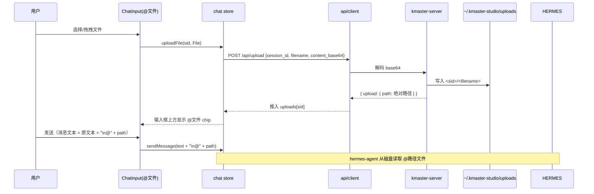
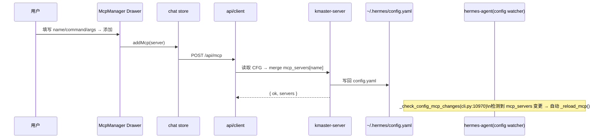

# 技术方案 · M3（F8 / F9 / F11 / F12 / F19）

> 继承 M1/M2 架构（Vue3 + Pinia + Naive UI + vue-router / Koa + Socket.IO `/chat-run`，monorepo `packages/client`、`packages/server`）。仅记录 M3 增量变更。视图零网络调用（views → stores → api → server）。
> 关联：REQUIREMENT-M3.md（产品经理输入，已含已决议项）、TEST-PLAN-M3.md。
> 探真依据：hermes-agent `run_agent.py`、`cli.py`、`hermes_cli/banner.py`、`hermes_cli/inventory.py`、`acp_adapter/server.py`。

---

## 0. 已决议关键决策（汇总，详细见各节与协议清单）

| 决策点 | 结论 |
|--------|------|
| F8 模式标签↔hermes 审批策略 | WorkBuddy **Craft / Plan / Ask** 按「自主度」顺序映射到 hermes mode 令牌 `dont_ask / accept_edits / default`（详见 §2.1 映射表）。以 `mode` 字段透传（非 instructions 注入）。 |
| F8 作用域 | **全局默认（`settings` 表）+ 每会话覆盖（`sessions.mode`）**；新会话继承全局默认。 |
| F9 模型枚举 | **REST `GET /api/models`**（管理面非流式）；server 经 python 子进程包装 `build_models_payload`，失败回退静态快照。 |
| F11 技能枚举 | **REST `GET /api/skills`**；server 包装 `get_available_skills()`（+ `tools.skills_tool._find_all_skills` 取 description），失败回退静态快照。调用方式 = 注入 `/skill <name>` 触发语（零协议改动）。 |
| F12 MCP | **直接读写 `~/.hermes/config.yaml` 的 `mcp_servers`**（经 `js-yaml`），写入后由 hermes `_check_config_mcp_changes` 文件监听自动 reload（`cli.py:10970`）。不经 bridge 转发（run_agent 无 `mcp_add`）。 |
| F19 上传 | 验证结论：**`AIAgent.chat(self, message, stream_callback)` 不接受 `attachments` 参数**（`run_agent.py:6861`，`__init__` 亦无）。故采用 **`@路径` 文本注入**：`POST /api/upload`（JSON base64 落盘 `~/.kmaster-studio/uploads/<sid>/`）→ 返回绝对路径 → 发送时把 `@<abs path>` 拼进消息文本。 |
| F11/F12 承载 | 技能面板 / MCP 面板均以 **Naive UI `NDrawer`** 承载，由底部工具条按钮打开（对齐 WorkBuddy 抽屉式管理面板）。 |
| Mock 演示 | 提供内置静态快照（models / skills / mcp）保证无真实 hermes 时 UI 可演示（NFR3）。 |
| 上传传输 | 采用 **JSON base64**（`POST /api/upload {session_id, filename, content_base64}`），复用现有 `bodyParser` JSON，避免引入 multipart 依赖。 |

---

## 1. 实现方案 + 框架选型（沿用现有，勿引入新框架）

- 前端框架：**Vue3 + Pinia + Naive UI + vue-router**，不引入新 UI/状态库。
- 后端框架：**Koa + `@koa/router` + Socket.IO `/chat-run`**，枚举类走 **REST**（非 WS），与 M2 的「流式事件走 WS、管理面走 REST」纪律一致。
- 后端枚举数据获取：通过 **`child_process.spawn` 调用 python 子进程**包装 hermes 的 `build_models_payload` / `get_available_skills`（hermes 为独立 Python 包，Node 侧无等价实现）；任一环节失败（无 python / 无 hermes）即回退到内置静态快照，保证 Mock 全链路可演示。
- MCP 写路径：**直接文件读写 `~/.hermes/config.yaml`** + `js-yaml` 解析，依赖 hermes 自带的 config watcher 自动 reload（不修改 hermes 源码、不触 bridge）。
- 上传落盘：Node `fs` 写入 `~/.kmaster-studio/uploads/<session_id>/`，返回绝对路径；消费侧以 `@<path>` 注入消息文本（hermes-agent 从磁盘读文件，符合「agent 读文件走路径」语义）。
- 新增依赖仅 `js-yaml`（server 侧，用于 config.yaml 解析），其余全部复用既有依赖。

---

## 2. 文件列表及相对路径

### Server（`packages/server`）

| 动作 | 文件 | 改动点 |
|------|------|--------|
| 改 | `src/protocol.ts` | `StartRunRequest` 增 `mode?`；`ChatOptions` 增 `mode?`；类型增 `Mode`、`ModelInfo`/`ProviderGroup`、`Skill`、`McpServer`、`UploadRef`、`Settings`、`MODE_TO_HERMES_APPROVAL` 常量、`CHAT_MODES` 标签表 |
| 改 | `src/bridge.ts` | `ChatOptions` 增 `mode?`；`RealBridge.chat` TCP 写入（`sock.write`）补 `mode` 字段；`MockBridge.chat` 回显 mode；新增 `getModels()`/`getSkills()`/`listMcp()`/`addMcp()`/`removeMcp()`/`getSettings()`/`setSettings()`（MCP 走 config 文件，枚举走 python 子进程） |
| 改 | `src/run-chat.ts` | `run` 处理读取并持久化 `mode`/`model`（每会话覆盖 + 全局默认兜底）；从 `req.mode/req.model` 解析有效值后传入 `bridge.chat`；`GET/PUT /api/settings` 在此或 routes 处理 |
| 改 | `src/db.ts` | `SessionRow` 增 `mode?`/`model?` 列（sqlite + 内存两实现同步，含 `ALTER TABLE` 容错）；新增 `settings` 表（`getSetting`/`setSetting`）；新增 `setSessionModeModel`；`getOrCreateSession` 新建会话时从 `settings` 继承 `default_mode`/`default_model` |
| 改 | `src/routes/sessions.ts` | 新增 `GET /api/models`、`GET /api/skills`、`GET /api/mcp`、`POST /api/mcp`（add）、`DELETE /api/mcp/:name`、`POST /api/upload`、`GET /api/settings`、`PUT /api/settings`；`PATCH /api/sessions/:id` 支持回写 `mode`/`model`；`GET /api/sessions/:id` 自然带回 `mode`/`model` |
| 增 | `src/hermes-proxy.ts` | 封装 python 子进程枚举（models/skills）与 config.yaml 读写（mcp/settings）；内置静态快照回退；`MODE_MAP`/`SKILL`/`MCP` 快照常量 |
| 改 | `package.json` | 新增依赖 `js-yaml`；devDependency `@types/js-yaml` |
| 改 | `src/index.ts` | 注册 `hermes-proxy` 预热（无强制）；其余不变 |

### Client（`packages/client`）

| 动作 | 文件 | 改动点 |
|------|------|--------|
| 改 | `src/types/chat.ts` | 增 `Mode`（`'craft'|'plan'|'ask'` 别名映射到 hermes 令牌）、`ModelInfo`/`ProviderGroup`、`Skill`、`McpServer`、`UploadRef`、`Settings`；常量 `CHAT_MODES`（标签+hermes 令牌映射，与 server 保持同步） |
| 改 | `src/stores/chat.ts` | 增 `globalSettings`、`modeBySession`/`modelBySession`、`models`/`skills`/`mcpServers`/`uploads`；action：`loadGlobalSettings`/`setGlobalSettings`/`setMode`/`setModel`/`loadModels`/`loadSkills`/`loadMcp`/`addMcp`/`removeMcp`/`uploadFile`/`invokeSkill`；`sendMessage` 携带 `mode`/`model` |
| 改 | `src/api/hermes/chat.ts` | `startRun` 增加 `mode?`/`model?` 透传；新增 `invokeSkill` 经 `sendMessage('/skill <name>')` |
| 改 | `src/api/client.ts` | 增 REST 封装 `getModels`/`getSkills`/`getMcp`/`postMcp`/`deleteMcp`/`uploadFile`/`getSettings`/`putSettings` |
| 改 | `src/components/chat/ChatInput.vue` | 新增底部工具条：`ModeSelect`(NSelect) / `ModelSelect`(NSelect,异步加载) / `SkillTrigger`(按钮→打开 SkillPanel Drawer) / `FileAttach`(按钮→文件选择/拖拽) / 全局设置齿轮；附件 chip 区（发送时拼 `@<path>`）；保留发送/引导 |
| 增 | `src/components/chat/SkillPanel.vue` | 类目树 + 卡片列表 + 搜索 + 调用/刷新（Drawer 内） |
| 增 | `src/components/chat/McpManager.vue` | 列表 + 添加表单 + 测试/移除/reload（Drawer 内） |
| 增 | `src/components/chat/SettingsDrawer.vue` | 全局默认 mode/model 设置（PUT /api/settings） |
| 改 | `src/components/chat/MessageItem.vue` | 渲染消息内 `@文件` 芯片（P1，可点击预览） |
| 改 | `src/views/ChatView.vue` | 挂载 `SkillPanel`/`McpManager`/`SettingsDrawer` 三个 Drawer（默认关闭） |
| 改 | `src/stores/chat.test.ts`（M2 已有） | 追加 mode/model/skills/mcp/upload 的 reducer 与 api 用例 |

> 说明：协议类型 `ServerToClientEvents` **无需新增 WS 事件**（枚举/上传/MCP 全走 REST，符合 NFR2「仅流式事件进 WS_EVENTS」）。`StartRunRequest` 仅新增 `mode?` 一个上行字段。

---

## 3. 数据结构和接口

### 3.1 类型定义（`protocol.ts` / `types/chat.ts`）

```ts
// —— F8 模式 ——
// 前端 UI 标签（WorkBuddy 三态），后端透传值为 hermes mode 令牌
export type ChatMode = 'craft' | 'plan' | 'ask';
// hermes ACP edit-approval mode 令牌（acp_adapter/server.py:624）
export type HermesMode = 'default' | 'accept_edits' | 'dont_ask';

// 共享映射（server/client 各维护一份，保持同步，见 §7）
export const CHAT_MODES: { ui: ChatMode; token: HermesMode; label: string; autonomy: 'low'|'mid'|'high'; desc: string }[] = [
  { ui: 'craft', token: 'dont_ask',    label: 'Craft', autonomy: 'high', desc: '最自主：自动接受文件编辑并直接落地，关键操作也不打断用户' },
  { ui: 'plan',  token: 'accept_edits',label: 'Plan',  autonomy: 'mid',  desc: '中等：自动接受工作区/tmp 编辑，敏感路径仍会询问' },
  { ui: 'ask',   token: 'default',     label: 'Ask',   autonomy: 'low',  desc: '最保守：每次文件编辑/关键操作前都向用户请求批准' },
];

// —— F9 模型 ——
export interface ModelInfo { id: string; name: string; provider: string; context?: number; pricing?: any; capabilities?: any; }
export interface ProviderGroup { provider: string; label: string; authenticated?: boolean; models: ModelInfo[]; }

// —— F11 技能 ——
export interface Skill { name: string; category: string; description?: string; enabled: boolean; }

// —— F12 MCP ——
export interface McpServer { name: string; command?: string; args?: string[]; env?: Record<string,string>; status?: 'connected'|'error'|'unknown'; tools?: number; }

// —— F19 上传 ——
export interface UploadRef { filename: string; path: string; size: number; created_at: number; }

// —— 全局设置 ——
export interface Settings { default_mode: HermesMode; default_model: string; }
```

### 3.2 `StartRunRequest` 变更（protocol.ts）

```ts
export interface StartRunRequest {
  session_id: string;
  message: string;
  profile?: string;
  model?: string;        // 既有，F9 复用
  mode?: HermesMode;     // 新增：F8，UI 选 Craft/Plan/Ask → 映射为 hermes 令牌透传
  instructions?: string;
}
```

### 3.3 Store 形状（chat.ts，增量）

```ts
// 状态
globalSettings: ref<Settings>({ default_mode: 'default', default_model: '' });
modeBySession:  ref<Record<string, HermesMode>>({});
modelBySession: ref<Record<string, string>>({});
models:    ref<ProviderGroup[]>([]);   // GET /api/models
skills:    ref<Skill[]>([]);          // GET /api/skills
mcpServers:ref<McpServer[]>([]);      // GET /api/mcp
uploads:   ref<Record<string, UploadRef[]>>({}); // 当前待发送附件（未随消息发出前）

// 关键 action
setMode(sid, token)            // 更新 modeBySession[sid]
setModel(sid, model)           // 更新 modelBySession[sid]
loadGlobalSettings()           // GET /api/settings → globalSettings
setGlobalSettings(mode, model) // PUT /api/settings
loadModels() / loadSkills() / loadMcp()
addMcp(server) / removeMcp(name)
uploadFile(sid, file)          // POST /api/upload → 推入 uploads[sid]
invokeSkill(sid, name)         // sendMessage(`/skill ${name}`)
sendMessage(text)              // 扩展：携带 mode=modeBySession[active], model=modelBySession[active]
```

### 3.4 REST / 协议契约

| 方法 & 路径 | 入参 | 返回 | 功能 |
|-------------|------|------|------|
| `GET /api/models` | — | `{ providers: ProviderGroup[] }` | F9 模型枚举（python `build_models_payload`，失败回退快照） |
| `GET /api/skills` | — | `{ skills: Skill[] }` | F11 技能枚举（python `get_available_skills`，失败回退快照） |
| `GET /api/mcp` | — | `{ servers: McpServer[] }` | F12 读 `~/.hermes/config.yaml`.mcp_servers |
| `POST /api/mcp` | `{ name, command, args?, env? }` | `{ ok: true, servers: McpServer[] }` | F12 写入 config.yaml（merge），触发 hermes reload |
| `DELETE /api/mcp/:name` | — | `{ ok: true }` | F12 从 config.yaml 移除 |
| `POST /api/upload` | `{ session_id, filename, content_base64 }` | `{ upload: UploadRef }` | F19 落盘 `~/.kmaster-studio/uploads/<sid>/` 返回绝对路径 |
| `GET /api/settings` | — | `{ settings: Settings }` | 读全局默认 mode/model |
| `PUT /api/settings` | `{ default_mode?, default_model? }` | `{ settings: Settings }` | 写全局默认 |
| `GET /api/sessions/:id` | — | `{ session }` | 现返回 `SessionRow`（含新增 `mode`/`model`） |
| `PATCH /api/sessions/:id` | `{ title?, mode?, model? }` | `{ ok: true }` | 现支持回写 `mode`/`model`（每会话覆盖） |

> F19 之所以用 JSON base64 而非 multipart：复用现有 `@koa/bodyparser`（JSON），零新增 multipart 依赖。

### 3.5 Mermaid · 模块关系

```mermaid
graph TD
  UI[ChatInput 工具条] -->|选模式/模型| S[chat store]
  UI -->|点技能/连接器| D[SkillPanel / McpManager Drawer]
  S -->|emit run{mode,model}| WS[(WS /chat-run)]
  S -->|REST GET| API[api/client]
  API --> SRV[kmaster-server REST]
  D --> API
  WS --> RUN[run-chat]
  RUN --> BR[Bridge]
  BR -->|TCP chat{mode,model}| HERMES[hermes-agent]
  SRV -->|python 子进程| HERMES
  SRV -->|读写| CFG[~/.hermes/config.yaml]
  SRV -->|fs 落盘| UP[~/.kmaster-studio/uploads]
```

---

## 4. 程序调用流程（时序图）

### 4.1 F8/F9 选模式/模型 → 存全局默认 → 发起 run 带 model

```mermaid
sequenceDiagram
  participant U as 用户
  participant I as ChatInput 工具条
  participant S as chat store
  participant A as api/client
  participant SRV as kmaster-server
  participant DB as db

  U->>I: 选择模型(下拉)
  I->>S: setModel(sid, model)
  U->>I: 选择模式(Craft/Plan/Ask)
  I->>S: setMode(sid, token)   %% token ∈ default/accept_edits/dont_ask
  Note over S: modeBySession[sid]=token; modelBySession[sid]=model

  U->>I: 「设为全局默认」(齿轮→SettingsDrawer)
  I->>S: setGlobalSettings(token, model)
  S->>A: PUT /api/settings
  A->>SRV: 写入 settings 表
  SRV->>DB: setSetting(default_mode/default_model)

  U->>I: 输入消息并发送
  I->>S: sendMessage(text)
  S->>A: emit run{session_id, message, model, mode}
  A->>SRV: WS run
  SRV->>DB: setSessionModeModel(sid, mode, model)  %% 每会话覆盖持久化
  SRV->>BR: bridge.chat({message, model, mode})
  BR->>HERMES: TCP chat{..., model, mode}
```

### 4.2 F19 上传 → 落盘 → @引用 → run



### 4.3 F12 MCP 添加（写 config.yaml → hermes 自动 reload）



---

## 5. 有序任务列表（按实现顺序，标注依赖）

> 依赖关系：`T1→T2` 表示 T1 完成后 T2 可开始。工程师按编号顺序执行。

- **T1 协议与类型底座**（server `protocol.ts` + client `types/chat.ts`）
  - 增 `Mode`/`HermesMode`/`CHAT_MODES`/`ModelInfo`/`ProviderGroup`/`Skill`/`McpServer`/`UploadRef`/`Settings`；`StartRunRequest.mode?`。
  - 无依赖。→ 解锁 T2/T3/T4。
- **T2 持久层扩展**（`server/src/db.ts`）
  - `SessionRow` 增 `mode`/`model` 列（sqlite `ALTER TABLE` 容错 + 内存实现）；新增 `settings` 表与 `getSetting`/`setSetting`；`setSessionModeModel`；`getOrCreateSession` 新建时继承 `default_mode`/`default_model`。
  - 依赖 T1（类型）。→ 解锁 T3/T5。
- **T3 Bridge 透传**（`server/src/bridge.ts`）
  - `ChatOptions.mode?`；`RealBridge.chat` 的 `sock.write` 补 `mode`；`MockBridge.chat` 回显 mode（不改动行为）。枚举/MCP 方法暂留 T6。
  - 依赖 T1。→ 解锁 T4。
- **T4 编排与 run 持久化**（`server/src/run-chat.ts`）
  - `run` 解析 `req.mode`/`req.model`，与 `sessions` 行/全局默认求有效值后传入 `bridge.chat` 并 `setSessionModeModel` 持久化。
  - 依赖 T2/T3。
- **T5 枚举代理模块**（`server/src/hermes-proxy.ts`，新增）
  - `getModels()`（python `build_models_payload`，回退快照）、`getSkills()`（python `get_available_skills` + `_find_all_skills` description，回退快照）、`listMcp()`/`addMcp()`/`removeMcp()`（读写 config.yaml，需 `js-yaml`）、`getSettings()`/`setSettings()`。
  - 依赖 T1/T2。→ 解锁 T6。
- **T6 REST 路由**（`server/src/routes/sessions.ts` + `index.ts`）
  - `GET /api/models`、`GET /api/skills`、`GET/POST/DELETE /api/mcp`、`POST /api/upload`（base64 落盘）、`GET/PUT /api/settings`；`PATCH /api/sessions/:id` 回写 `mode`/`model`。
  - 依赖 T5。
- **T7 前端 API 封装**（`client/src/api/client.ts` + `hermes/chat.ts`）
  - `getModels`/`getSkills`/`getMcp`/`postMcp`/`deleteMcp`/`uploadFile`/`getSettings`/`putSettings`；`startRun` 增 `mode`/`model` 透传；`invokeSkill` 注入 `/skill <name>`。
  - 依赖 T1。→ 解锁 T8/T9。
- **T8 前端 Store 扩展**（`client/src/stores/chat.ts` + test）
  - `globalSettings`/`modeBySession`/`modelBySession`/`models`/`skills`/`mcpServers`/`uploads` 与对应 action；`sendMessage` 携带 mode/model；`openSession` 从 `SessionRow` 恢复 mode/model；`WS_EVENTS` 不变（无新增 WS 事件）。
  - 依赖 T7。
- **T9 底部工具条**（`client/src/components/chat/ChatInput.vue`）
  - 新增工具条：`ModeSelect`/`ModelSelect`(异步加载 models)/`SkillTrigger`/`FileAttach`/全局设置齿轮；附件 chip 区；发送时拼接 `@<path>`。
  - 依赖 T8。→ 解锁 T10/T11/T12。
- **T10 技能面板**（`client/src/components/chat/SkillPanel.vue`，新增 + `ChatView` 挂载）
  - 类目树 + 卡片 + 搜索 + 「调用」(invokeSkill) +「刷新」(loadSkills)。
  - 依赖 T8/T9。
- **T11 MCP 管理器**（`client/src/components/chat/McpManager.vue`，新增 + `ChatView` 挂载）
  - 列表 + 添加表单 + 移除/reload（调 T7 api）。
  - 依赖 T8/T9。
- **T12 全局设置抽屉**（`client/src/components/chat/SettingsDrawer.vue`，新增 + `ChatView` 挂载）
  - 设置全局默认 mode/model（PUT /api/settings）。
  - 依赖 T8/T9。
- **T13 消息内 @文件 芯片**（P1，`MessageItem.vue`）
  - 解析消息文本 `@<path>` 渲染可点击芯片。
  - 依赖 T9。
- **T14 测试与验收**
  - `chat.test.ts` 追加 reducer/api 用例；`smoke-chat.mjs` 断言 `run` 携带 `mode`/`model`；`vue-tsc`+`tsc --noEmit` 零错误；浏览器联调 + Mock 演示。
  - 依赖 T1–T13。

---

## 6. 依赖包列表（仅 M3 可能新增）

- **server**：`js-yaml`（运行时，解析/写入 `~/.hermes/config.yaml`）；`@types/js-yaml`（dev）。
- **client**：无新增依赖（Naive UI 已具备 `NDrawer`/`NSelect`/`NUpload` 等）。
- 说明：枚举数据经 python 子进程获取，无需 Node 侧新依赖；上传采用 JSON base64，无需 multipart 库。

---

## 7. 共享知识（跨文件约定）

1. **模式映射常量（双端同步）**：`CHAT_MODES` 在 `server/src/protocol.ts` 与 `client/src/types/chat.ts` 各维护一份，结构完全一致。语义唯一来源为该表，UI 只展示 `label`，网络/存储只使用 `token`（hermes 令牌）。映射按「自主度」对齐，不可逆：
   - Craft → `dont_ask`（最自主）
   - Plan → `accept_edits`（中等）
   - Ask → `default`（最保守，每次编辑都询问）
2. **枚举缓存策略**：`hermes-proxy` 对 models/skills 做 **5 分钟 TTL 内存缓存**，避免每次打开下拉都 spawn python；MCP 列表每次实时读 config.yaml（写后即时反映）。Mock/无 python 时一律回退 `hermes-proxy` 内置静态快照（与 NFR3 一致）。
3. **配置路径约定**：hermes 配置根 = `process.env.HERMES_HOME ?? path.join(os.homedir(), '.hermes')`（与 hermes `get_hermes_home()` 对齐），目标文件 `config.yaml`。kmaster 自有数据根 = `process.env.KMASTER_HOME ?? path.join(homedir, '.kmaster-studio')`，上传目录 `<root>/uploads/<session_id>/`。
4. **@引用约定**：上传文件以**绝对路径** ` @<abs path>` 形式追加到消息文本末尾（一行一个），hermes-agent 从磁盘读取；消息气泡中 `MessageItem` 解析 `@` 起止为芯片（P1）。
5. **全局默认继承**：新建会话时 `db.getOrCreateSession` 从 `settings` 表读取 `default_mode`/`default_model` 写入 `sessions` 行；`run` 时有效值优先级：`req` 显式覆盖 > `sessions` 行 > 全局默认。
6. **零新增 WS 事件**：枚举/上传/MCP/设置全部走 REST；仅 `StartRunRequest.mode?` 一个 WS 上行字段扩展（NFR2 不变）。

---

## 8. 待明确事项

1. **F19 真实消费验证**：已确认 `AIAgent.chat` 不支持 `attachments`，采用 `@路径` 注入。需真实 bridge（`HERMES_BRIDGE_MOCK=0`）联调确认 hermes-agent 能正确从 `@<abs path>` 读取文件（不同能力对 @引用的解析可能依赖具体工具）；若需更强语义（如多模态图片直传），留作后续增强。
2. **config.yaml 写入副作用**：js-yaml 写回会**丢失原文件注释与格式**；M3 接受此代价（仅改 `mcp_servers` 段）。若用户在意注释，后续可改用 `hermes config set` CLI 子进程写（R-M3-6 备选路径）。
3. **Python 子进程可用性**：`hermes-proxy` 假设运行环境 `python`/`python3` 可 import hermes 包；容器/CI 无 hermes 时自动回退快照，不影响 UI。真实枚举需在装好 hermes 的环境验收（AC5）。
4. **mode 真实生效链路**：`mode` 令牌已透传至 TCP `chat{mode}`，但 hermes bridge（`bridge_server.py`）是否将其应用到 ACP session mode 取决于 hermes 侧实现（不在本仓库修改范围）；M3 保证协议与持久化闭环，真实 gating 由 RealBridge 接 hermes 后在 AC5 手动验收。
5. **MCP 测试连通性（P1）**：`POST /api/mcp` 仅做配置写回；连通性测试（`tools.mcp_tool` 探测）建议 P1，M3 核心先保证「列出/添加/移除 + 自动 reload」。
6. **全局默认 UI 入口**：T12 提供独立设置抽屉；是否需在模式/模型下拉内嵌「设为默认」快捷项，留作 UI 打磨（不影响数据契约）。

---

## 9. 协议扩展清单

### 9.1 `protocol.ts` 上行事件（ClientToServerEvents）
- 不变（F8 的 mode 走既有 `run` 字段，不新增事件）。

### 9.2 `protocol.ts` 下行事件（ServerToClientEvents）
- 不变（枚举/上传/MCP/设置全走 REST，无新增 WS 下行）。

### 9.3 `StartRunRequest` 变更
```diff
 export interface StartRunRequest {
   session_id: string;
   message: string;
   profile?: string;
   model?: string;
+  mode?: HermesMode;   // F8：UI Craft/Plan/Ask → hermes 令牌 default/accept_edits/dont_ask
   instructions?: string;
 }
```

### 9.4 `Bridge.ChatOptions` 变更
```diff
 export interface ChatOptions {
   sessionId: string;
   message: string;
   model?: string;
+  mode?: HermesMode;
   profile?: string;
   instructions?: string;
   onEvent: (e: BridgeEvent) => void;
 }
```

### 9.5 新增类型（server + client 同步）
- `ChatMode` / `HermesMode` / `CHAT_MODES` / `ModelInfo` / `ProviderGroup` / `Skill` / `McpServer` / `UploadRef` / `Settings`（定义见 §3.1）。

### 9.6 新增 REST（见 §3.4 表）
- `GET /api/models`、`GET /api/skills`、`GET /api/mcp`、`POST /api/mcp`、`DELETE /api/mcp/:name`、`POST /api/upload`、`GET /api/settings`、`PUT /api/settings`；`PATCH /api/sessions/:id` 扩展 `mode`/`model`。

### 9.7 `SessionRow` / `Store` 变更（db.ts）
- `SessionRow` 增 `mode?: string | null`、`model?: string | null`。
- `Store` 增 `getSetting(key)`、`setSetting(key, value)`、`setSessionModeModel(id, mode?, model?)`；`getOrCreateSession` 新建时继承全局默认。
- 内存实现同步上述方法。

---

> 本方案严格沿用 M1/M2 架构与「视图零网络调用」纪律，未引入新框架；所有写 hermes 操作仅经 `~/.hermes/config.yaml` 文件（受 hermes config watcher 自动 reload），不修改 hermes 源码、不经 bridge 转发敏感写。可直接交工程师按 §5 任务顺序实现。
