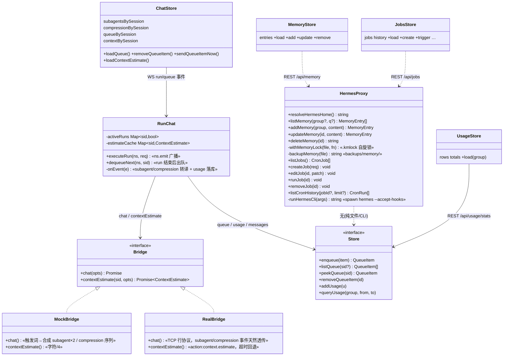
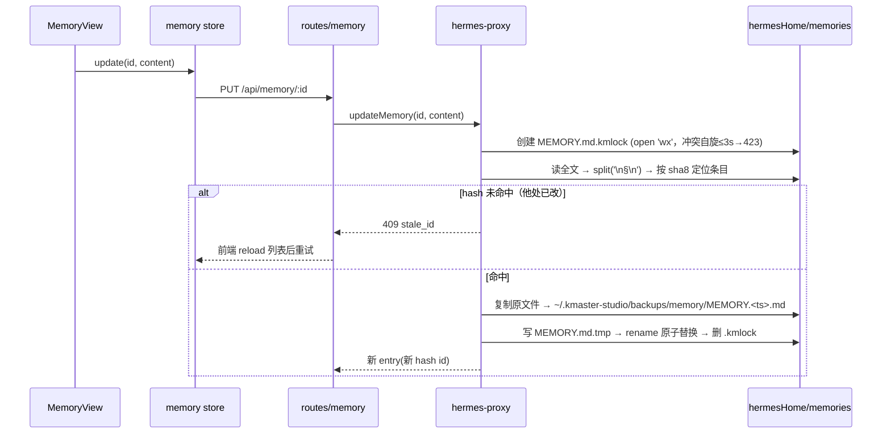
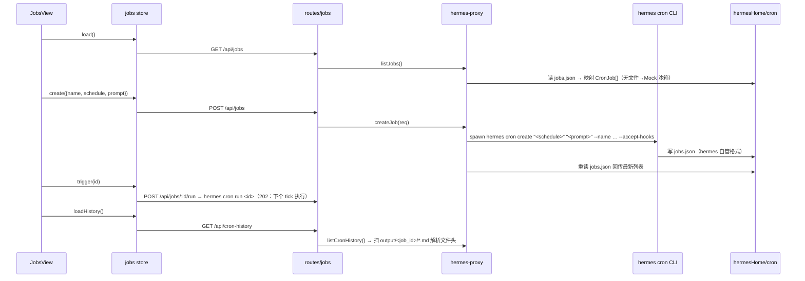
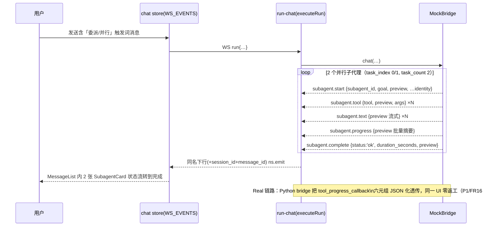
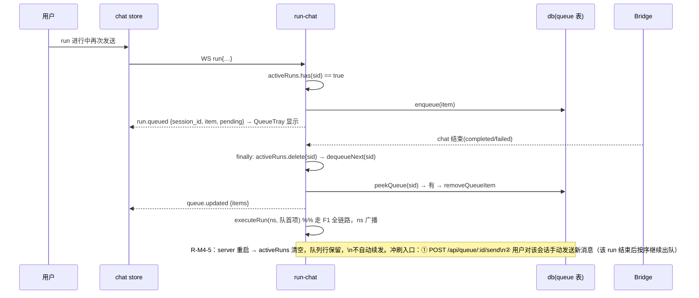
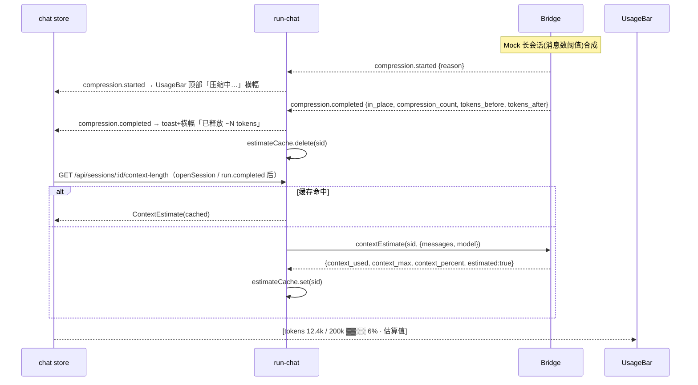
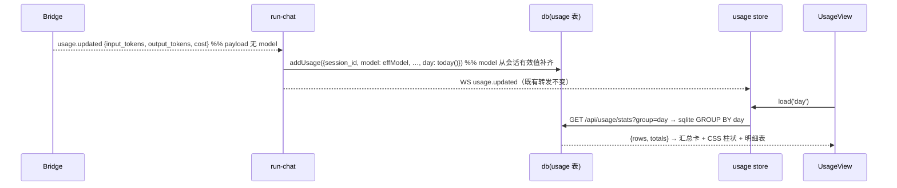
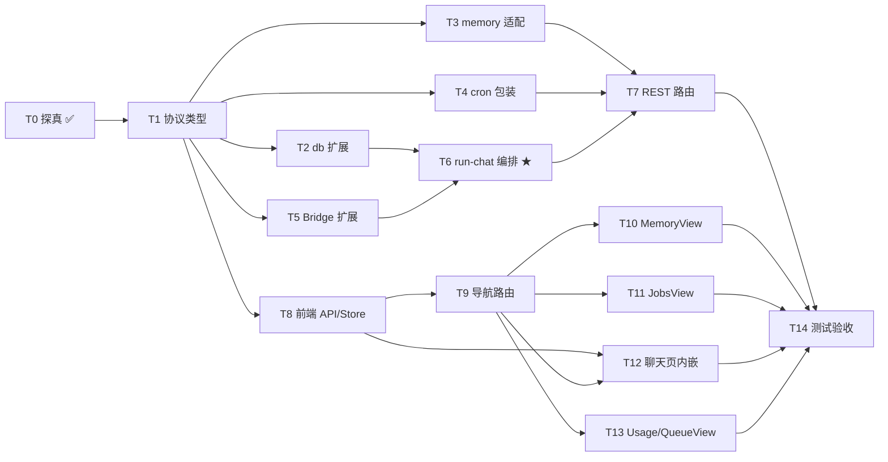

# 技术方案 · M4（F13 / F15 / F16 / F17 / F18 / F22）

> 继承 M1/M2/M3 架构（Vue3 + Pinia + Naive UI + vue-router / Koa + Socket.IO `/chat-run`，monorepo `packages/client`、`packages/server`）。仅记录 M4 相对 M3 的增量变更。视图零网络调用（views → stores → api → server）。
> 关联：REQUIREMENT-M4.md（PRD，已含 q-0/q-1/q-2 与 R-M4-5 拍板）、TECHNICAL-SOLUTION-M3.md（REST 扩展范式 / hermes-proxy 模式）。
> 探真依据（本轮实测，见 §0）：`hermes memory|cron` CLI、`%LOCALAPPDATA%/hermes/{memories,cron}` 落盘、hermes-agent 源码 `tools/delegate_tool.py`、`agent/conversation_compression.py`、`agent/context_breakdown.py`。

---

## 0. 设计期探真结果（R-M4-1 ~ R-M4-4 已闭合）

### 0.0 ⚠️ 前置发现：hermes home 实际位置 ≠ M3 代码假设

| 项 | 实测 |
|----|------|
| Windows 真实 hermes home | `%LOCALAPPDATA%/hermes`（`C:/Users/<u>/AppData/Local/hermes`，含 config.yaml / memories / cron / hermes-agent 源码） |
| `~/.hermes` | 仅有 `plugins/`、`scripts/`（非主数据目录） |
| M3 现状 | `hermes-proxy.ts` 用 `HERMES_HOME ?? ~/.hermes` → **在本机指向错误目录**（F12 MCP 读写 config.yaml 一直在读空目录） |

**M4 必须修正**：新增统一解析函数（收敛在 `hermes-proxy.ts`）：

```
resolveHermesHome(): HERMES_HOME 环境变量 → (win32 且存在) %LOCALAPPDATA%/hermes → ~/.hermes
```

M4 所有 hermes 数据访问（memories/cron/config.yaml）一律经此函数；顺带修复 F12。

### 0.1 R-M4-1 memory 存储格式（已闭合）

| 项 | 实测结论 |
|----|---------|
| CLI 面 | `hermes memory` 仅有 `setup/status/off/reset` 四个子命令，**无条目级 CRUD** → F13 必须直接文件读写 |
| 存储 | `<hermesHome>/memories/` 下 **两个 Markdown 文件**：`MEMORY.md`（agent 长期记忆）+ `USER.md`（用户画像/偏好），各带空的 `.lock` 哨兵文件（hermes 自身 portalocker 用） |
| 条目格式 | **纯文本段落，以独立一行 `§` 作为条目分隔符**（实测 MEMORY.md 8 行 5 条、USER.md 6 行 4 条）；无 id、无时间戳、无 JSON/sqlite |
| 外部 provider | honcho/mem0 等外部记忆插件与内置 MEMORY.md 并存，M4 仅管理内置双文件（外部 provider 超范围） |

→ 条目模型：`group ∈ {'memory','user'}`（对应两文件），`id = <group>:<sha1(content).slice(0,8)>`（内容寻址，写时按 hash 重定位，防 index 漂移），`updated_at` 取文件 mtime。

### 0.2 R-M4-2 cron 配置/历史 schema（已闭合）

| 项 | 实测结论 |
|----|---------|
| CLI 面 | `hermes cron {list, create(add), edit, pause, resume, run, remove(rm/delete), status, tick}`；`create` 参数：`schedule`（位置参数，支持 `'30m'` / `'every 2h'` / `'0 9 * * *'`）、`prompt`（位置参数）、`--name --deliver --repeat --skill --script --no-agent --workdir`；全局 `--accept-hooks`（非 TTY 免交互，server 调用必带） |
| 配置落盘 | `<hermesHome>/cron/jobs.json`，schema 完整（实测字段）：`{ jobs: [{ id, name, prompt, skills[], skill, model, provider, script, no_agent, context_from, schedule:{kind,expr,display}, schedule_display, repeat:{times,completed}, enabled, state, paused_at, paused_reason, created_at, next_run_at, last_run_at, last_status('ok'\|'error'), last_error, deliver, origin, workdir, ... }] }` |
| 运行历史 | `<hermesHome>/cron/output/<job_id>/<YYYY-MM-DD_HH-mm-ss>.md`，文件头固定格式：`# Cron Job: <name>` + `**Job ID:** / **Run Time:** / **Mode:** / **Status:**` + 正文产出 |
| `run` 语义 | 「Run a job on the next scheduler tick」→ 手动触发是**标记下个 tick 执行**（依赖 hermes 调度器在跑），REST 返回 202 语义 |

→ F15 读路径：**直接解析 jobs.json（只读）+ 扫描 output 目录**（比解析 `cron list` 的表格文本可靠）；写路径：**一律经 CLI**（create/edit/pause/resume/run/remove），避免 jobs.json 格式漂移与并发写冲突。

### 0.3 R-M4-3 subagent 真实事件字段（已闭合，Mock 照抄）

发射点：`tools/delegate_tool.py` `_build_child_progress_callback`（L871-L1003）→ 父 agent 的 `tool_progress_callback`。**真实事件名与字段**：

| 事件名（字符串） | 载荷（positional: tool_name, preview, args + identity kwargs） |
|------------------|------------------------------------------------------------|
| `subagent.start` | `preview`=goal 全文 + identity |
| `subagent.tool` | `tool_name`、`preview`（参数摘要）、`args` + identity |
| `subagent.text` | `preview`=子代理流式正文片段 + identity |
| `subagent.thinking` | `preview`=思考片段 + identity |
| `subagent.progress` | `preview`=批量工具摘要（每 5 个工具 flush 一次，`"🔀 <prefix>tool1, tool2, …"`）+ identity |
| `subagent.complete` | `preview`=最终摘要、`status`（缺省成功 / `'timeout'` / `'error'` / `'failed'`）、`duration_seconds` + identity |

**identity kwargs**（每个事件都带，L847-L869 `_identity_kwargs`）：`task_index, task_count, goal, subagent_id, parent_id?, depth?, model?, toolsets?, child_session_id?, tool_count`。

→ M4 `BridgeEvent` 的 subagent 分支**字段名逐字对齐上表**（含 `subagent.thinking`，PRD 未列但真实存在，一并入协议）；真实链路接入时 Python bridge 只需把 `tool_progress_callback` 收到的六元组原样 JSON 化透传，UI 零返工。`delegation.updated`（`tools/async_delegation.py` 后台委派清单）留 P1 占位类型。

### 0.4 R-M4-4 compression 真实事件 + contextEstimate 入口（已闭合）

| 项 | 实测结论（`agent/conversation_compression.py`） |
|----|-----------------------------------------------|
| 开始信号 | 无独立事件；gateway 侧以 `status_callback` 的 `kind="compacting"` 状态呈现（L45 注释）→ Bridge 归一化为 `compression.started` |
| 完成事件 | `agent.event_callback("session:compress", { platform, session_id, old_session_id, in_place, compression_count })`（L950-956）→ Bridge 归一化为 `compression.completed` |
| token 统计 | 完成后 `context_compressor.last_compression_rough_tokens`（压缩后粗估，L969-974）；压缩前值来源 `last_prompt_tokens` → `tokens_before/tokens_after` 为**可选字段**（真实链路尽力填充） |
| 用户决策压缩 | 未发现独立「需用户决策」事件（多次压缩仅告警文案 L936-942）→ FR18.4 决策卡降级为 P1 Mock 演示 |
| contextEstimate 真实入口 | `agent/context_breakdown.py::compute_session_context_breakdown()` 返回 `{ categories:[{id,label,tokens,color}], context_max, context_percent, context_used, estimated_total, model }`；估算算法 = **字符数/4**（`_chars_to_tokens`，L31-34） |

→ `ContextEstimate` 类型**镜像该返回结构**；Mock 用同一「字符/4」算法（与真实 hermes 同源，不引 tokenizer），UI 标注「估算值」。

---

## 1. 实现方案 + 框架选型

- 前后端框架、WS/REST 分工纪律**全部沿用 M3，零新增依赖**（`/usage` 图表用 CSS 柱状 + Naive UI 进度条，R-M4-6 采纳轻量方案；contextEstimate 用字符/4 估算，与真实 hermes 算法同源，不引 tokenizer；文件锁用 `fs.open('wx')` 原子创建自旋，不引 lockfile 库）。
- **F13**：直接文件读写 `<hermesHome>/memories/{MEMORY,USER}.md`（CLI 无条目 CRUD），`§` 分隔条目、内容寻址 id；写回三件套 = **自有锁文件（`.kmlock`）+ 写前备份（`~/.kmaster-studio/backups/memory/`）+ 临时文件原子替换**。不复用 hermes 的 `.lock`（其为 Python portalocker 语义，Node 侧无法安全共享）。
- **F15**：读 = 解析 `jobs.json` + 扫描 `output/`；写 = spawn `hermes cron <sub> --accept-hooks`（复用 hermes-proxy 子进程范式，命令换成 hermes CLI）。Mock/无 CLI 回退 `~/.kmaster-studio/mock/cron/` 沙箱（同 schema jobs.json，NFR3）。
- **F16/F18**：协议三件套（protocol.ts + bridge.ts + run-chat.ts）扩展，事件名与字段**逐字对齐 §0.3/§0.4 实测结果**；MockBridge 按触发词合成完整事件序列；RealBridge 侧 TCP 行协议天然透传（`onEvent` 直转），Python bridge 侧对接留 P1。
- **F17**：纯 server 侧。`db.ts` 增 `queue` 表（sqlite+内存双实现）；`run-chat.ts` 重构出可复用的 `executeRun()`，以 `activeRuns: Map<session_id>` 判忙 → 入队；完成后自动出队。**R-M4-5 语义**：队列持久化保留，server 重启后 `activeRuns` 天然清空且**不自动续发**；用户在 `/queue` 页或托盘点「立即发送」、或下次手动发送该会话消息时（该 run 完成后）按序冲刷。
- **F22**：`db.ts` 增 `usage` 表；`run-chat.ts` 在转译 `usage.updated` 时同步落库（model 字段从 `effModel`/会话行补齐，payload 本身无 model）；聚合走 sqlite `GROUP BY`（内存实现同语义归约）。
- **导航（q-2）**：`App.vue` 改挂 `<router-view>`（⚠️ 现状为直渲 ChatView、router 空转），新增 `AppNav.vue` 顶部导航条；`/memory` `/jobs` `/usage` `/queue` 四条整页路由。
- **事件广播面变更**：M1-M3 下行事件只 emit 给发起 socket；F17 自动出队的 run 无发起 socket → `executeRun()` 统一改为 **namespace 广播 `ns.emit`**（本地单用户工具，无多租户泄漏问题；前端本就按 `session_id` 分发）。

---

## 2. 文件列表及相对路径

### Server（`packages/server`）

| 动作 | 文件 | 改动点（细化到函数/类型） |
|------|------|--------------------------|
| 改 | `src/protocol.ts` | `BridgeEvent` 增 8 个分支（`subagent.start/tool/text/thinking/progress/complete`、`compression.started/completed`）；`ServerToClientEvents` 增同名下行 + `queue.updated` + `delegation.updated`(P1 占位)，`run.queued` 载荷扩为 `{session_id, item, pending}`；新类型 `SubagentIdentity`/`MemoryEntry`/`CronJob`/`CronRun`/`QueueItem`/`UsageStatRow`/`ContextEstimate` |
| 改 | `src/bridge.ts` | `Bridge` 接口增 `contextEstimate(sessionId, opts)`；`MockBridge.chat` 按触发词合成 subagent×2 / compression 事件序列（字段照抄 §0.3/§0.4）；`MockBridge.contextEstimate` 字符/4 估算；`RealBridge.contextEstimate` 发 `{action:'context.estimate'}` 占位（超时回退估算） |
| 改 | `src/run-chat.ts` | 抽出 `executeRun(ns, req)`（原 `run` handler 主体，socket.emit → ns.emit）；`activeRuns` 忙判定 + 入队 + `run.queued`；run 结束 `finally` 出队编排（`dequeueNext`）；`onEvent` 增 subagent.*/compression.* 转译分支；`usage.updated` 分支落库（补 model）；contextEstimate 缓存失效钩子 |
| 改 | `src/db.ts` | `Store` 增 `queue` 组（`enqueue/listQueue/peekQueue/removeQueueItem/clearQueue`）与 `usage` 组（`addUsage/queryUsage(group,from,to)`）；sqlite 建表 ×2 + 内存实现 ×2（NFR4 同语义） |
| 改 | `src/hermes-proxy.ts` | 新增 `resolveHermesHome()`（§0.0，既有 config.yaml 路径改用它）；memory 适配层：`listMemory/addMemory/updateMemory/deleteMemory`（`§` 解析、hash 定位、`.kmlock` 锁、备份、原子写）；cron 包装：`listJobs/createJob/editJob/pauseJob/resumeJob/runJob/removeJob/listCronHistory`（读 jobs.json + spawn CLI）；Mock 沙箱种子（memories/cron 各一份） |
| 增 | `src/routes/memory.ts` | `GET/POST /api/memory`、`PUT/DELETE /api/memory/:id` |
| 增 | `src/routes/jobs.ts` | `GET/POST /api/jobs`、`PATCH/DELETE /api/jobs/:id`、`POST /api/jobs/:id/run`、`GET /api/cron-history` |
| 增 | `src/routes/queue.ts` | `GET /api/queue`、`DELETE /api/queue/:id`、`POST /api/queue/:id/send` |
| 增 | `src/routes/usage.ts` | `GET /api/usage/stats` |
| 改 | `src/routes/sessions.ts` | 增 `GET /api/sessions/:id/context-length`（内存缓存，run 完成失效） |
| 改 | `src/index.ts` | 注册 4 个新 router |

### Client（`packages/client`）

| 动作 | 文件 | 改动点 |
|------|------|--------|
| 改 | `src/types/chat.ts` | 同步 server 新类型（`SubagentIdentity`/`SubagentState`/`MemoryEntry`/`CronJob`/`CronRun`/`QueueItem`/`UsageStatRow`/`ContextEstimate`/`CompressionNotice`） |
| 改 | `src/stores/chat.ts` | `WS_EVENTS` 增 9 项（subagent×6、compression×2、queue.updated；`run.queued` 已注册则扩载荷处理）；状态增 `subagentsBySession: Record<sid, Record<subagent_id, SubagentState>>`、`compressionBySession`、`queueBySession`、`contextBySession`；action：`loadQueue/removeQueueItem/sendQueueItemNow/loadContextEstimate`；dispatch 增各事件 reducer |
| 增 | `src/stores/memory.ts` | `entries/groups/loading` + `load/add/update/remove`（memory 页独立 store） |
| 增 | `src/stores/jobs.ts` | `jobs/history` + `load/create/edit/pause/resume/trigger/remove/loadHistory` |
| 增 | `src/stores/usage.ts` | `stats/totals/groupBy` + `load(group,from,to)` |
| 改 | `src/api/client.ts` | REST 封装：memory×4、jobs×7、queue×3、usage×1、contextLength×1 |
| 改 | `src/router/index.ts` | 增 `/memory` `/jobs` `/usage` `/queue` 四路由（懒加载） |
| 改 | `src/App.vue` | 改挂 `AppNav` + `<router-view>`（⚠️ 现状直渲 ChatView 未走 router，必须改造） |
| 增 | `src/components/AppNav.vue` | 顶部导航条（聊天/记忆/自动化/用量/队列 + 当前高亮 + 队列徽标数） |
| 增 | `src/views/MemoryView.vue` | 分组列表 + 搜索 + 条目卡 + NModal 编辑 + 删除确认（提示已备份） |
| 增 | `src/views/JobsView.vue` | 任务表格 + 新建/编辑表单（NModal）+ 触发/启停/删除 + 历史时间线 |
| 增 | `src/views/UsageView.vue` | 汇总卡×3 + CSS 按天柱状 + 按模型/会话 Tab 明细表 |
| 增 | `src/views/QueueView.vue` | 队列整页列表（删除/立即发送）+ 空态 |
| 增 | `src/components/chat/SubagentCard.vue` | 目标/状态/进度/流式产出折叠区；多卡并列 |
| 增 | `src/components/chat/QueueTray.vue` | 输入区上方托盘：列表 + 删除 + 立即发送 |
| 改 | `src/components/chat/UsageBar.vue` | 增「used/limit 进度条 + 百分比 + 估算值标注」；压缩横幅/toast |
| 改 | `src/components/chat/MessageList.vue` | 挂接 SubagentCard（按 run 内 subagent 分组渲染）与压缩横幅 |
| 改 | `src/components/chat/ChatInput.vue` | 挂接 QueueTray（`queueBySession` 非空时显示） |
| 改 | `src/stores/chat.test.ts` | 追加 subagent/queue/compression reducer 用例 |

### 其他

| 动作 | 文件 | 说明 |
|------|------|------|
| 增 | `scripts/qa-verify-m4.mjs` | AC1-AC8 单脚本验收（复用 qa-verify-m3 模式） |
| 增 | `packages/client/src/stores/{memory,usage}.test.ts` | 新 store 单测（AC1 要求） |

---

## 3. 数据结构和接口

### 3.1 新增类型（server `protocol.ts` / client `types/chat.ts` 双端同步）

```ts
// —— F16 子代理（字段名逐字对齐 delegate_tool.py 实测，§0.3）——
export interface SubagentIdentity {
  subagent_id: string;
  parent_id?: string;
  task_index?: number;   // 本批第几个
  task_count?: number;   // 本批总数
  goal?: string;         // 委派目标
  depth?: number;
  model?: string;
  toolsets?: string[];
  child_session_id?: string;  // 子代理自己的会话 id（UI 可跳转）
  tool_count?: number;
}
export type SubagentStatus = 'running' | 'ok' | 'failed' | 'error' | 'timeout';

// —— F13 记忆 ——
export interface MemoryEntry {
  id: string;                    // `${group}:${sha8(content)}` 内容寻址
  group: 'memory' | 'user';      // MEMORY.md / USER.md
  content: string;               // 单条正文（§ 分隔的一段）
  index: number;                 // 当前文件内序号（展示用，不作寻址）
  updated_at: number;            // 文件 mtime
}

// —— F15 自动化（映射 jobs.json 实测 schema，§0.2）——
export interface CronJob {
  id: string; name: string; prompt: string;
  schedule_expr: string;         // schedule.expr
  schedule_display: string;
  enabled: boolean; state: string;      // scheduled / paused …
  next_run_at?: string; last_run_at?: string;
  last_status?: 'ok' | 'error' | null; last_error?: string | null;
  deliver?: string; script?: string | null; no_agent?: boolean;
  workdir?: string | null; created_at?: string;
  repeat_completed?: number; repeat_times?: number | null;
}
export interface CronRun {       // output/<job_id>/<ts>.md 解析
  job_id: string; job_name: string; run_time: string;
  status: string; mode: string; excerpt: string; file: string;
}

// —— F17 队列 ——
export interface QueueItem {
  id: string; session_id: string; message: string;
  mode?: string | null; model?: string | null;
  position: number; created_at: number;
}

// —— F22 用量 ——
export interface UsageStatRow {  // 聚合行（key 依 group 而定：day/model/session_id）
  key: string; input_tokens: number; output_tokens: number;
  cost: number; runs: number;
}

// —— F18 上下文估算（镜像 context_breakdown.py 返回，§0.4）——
export interface ContextEstimate {
  context_used: number; context_max: number; context_percent: number;
  estimated_total?: number; model?: string;
  categories?: { id: string; label: string; tokens: number }[];
  estimated: true;               // UI 恒标注「估算值」
}
```

### 3.2 `BridgeEvent` 扩展（增量 diff）

```diff
 export type BridgeEvent =
   | { type: 'message.delta'; delta: string }
   | …（既有分支不变）
+  // F16 —— 字段名逐字对齐 delegate_tool.py（§0.3），真实链路零转换透传
+  | ({ type: 'subagent.start';    preview: string } & SubagentIdentity)
+  | ({ type: 'subagent.tool';     tool: string; preview?: string; args?: unknown } & SubagentIdentity)
+  | ({ type: 'subagent.text';     preview: string } & SubagentIdentity)
+  | ({ type: 'subagent.thinking'; preview: string } & SubagentIdentity)
+  | ({ type: 'subagent.progress'; preview: string } & SubagentIdentity)
+  | ({ type: 'subagent.complete'; preview?: string; status?: SubagentStatus;
+       duration_seconds?: number } & SubagentIdentity)
+  // F18 —— 对齐 conversation_compression.py session:compress（§0.4）
+  | { type: 'compression.started';   reason?: string }
+  | { type: 'compression.completed'; old_session_id?: string; in_place?: boolean;
+      compression_count?: number; tokens_before?: number; tokens_after?: number }
```

### 3.3 `ServerToClientEvents` 扩展（增量 diff）

```diff
+  'subagent.start':    (p: { session_id: string; message_id: string } & SubagentStartPayload) => void;
+  'subagent.tool':     (p: …同构，下行统一多带 session_id + message_id 锚点) => void;
+  'subagent.text' / 'subagent.thinking' / 'subagent.progress' / 'subagent.complete': 同上;
+  'compression.started':   (p: { session_id: string; reason?: string }) => void;
+  'compression.completed': (p: { session_id: string; in_place?: boolean; compression_count?: number;
+                                 tokens_before?: number; tokens_after?: number }) => void;
-  'run.queued': (p: { session_id: string }) => void;
+  'run.queued': (p: { session_id: string; item: QueueItem; pending: number }) => void;   // 实装
+  'queue.updated': (p: { session_id: string; items: QueueItem[] }) => void;              // 出队/删除后托盘同步
+  'delegation.updated': (p: { session_id: string; delegations: unknown[] }) => void;     // P1 占位（async_delegation）
```

### 3.4 `Bridge` 接口扩展

```diff
 export interface Bridge {
   chat(opts: ChatOptions): Promise<{ run_id: string; text: string }>;
   …
+  // F18：上下文占用估算。Mock=字符/4（与真实 hermes _chars_to_tokens 同源）；
+  // Real=发 {action:'context.estimate', sessionId}，2s 超时回退本地估算
+  contextEstimate(sessionId: string, opts: { messages: { role: string; content: string }[];
+    model?: string }): Promise<ContextEstimate>;
 }
```

### 3.5 db.ts 新表（sqlite DDL；内存实现同语义）

```sql
CREATE TABLE IF NOT EXISTS queue (
  id TEXT PRIMARY KEY, session_id TEXT NOT NULL, message TEXT NOT NULL,
  mode TEXT, model TEXT, position INTEGER NOT NULL, created_at INTEGER NOT NULL
);
CREATE INDEX IF NOT EXISTS idx_queue_session ON queue(session_id, position);

CREATE TABLE IF NOT EXISTS usage (
  id TEXT PRIMARY KEY, session_id TEXT NOT NULL, model TEXT NOT NULL DEFAULT '',
  input_tokens INTEGER NOT NULL DEFAULT 0, output_tokens INTEGER NOT NULL DEFAULT 0,
  cost REAL NOT NULL DEFAULT 0, ts INTEGER NOT NULL,
  day TEXT NOT NULL              -- 'YYYY-MM-DD'（本地时区，写入时算好，GROUP BY 直用）
);
CREATE INDEX IF NOT EXISTS idx_usage_day ON usage(day);
CREATE INDEX IF NOT EXISTS idx_usage_session ON usage(session_id);
```

`Store` 契约增量：

```ts
// F17 队列
enqueue(item: Omit<QueueItem,'position'>): QueueItem;   // position = max+1
listQueue(sessionId?: string): QueueItem[];             // 不传 = 全部（/queue 整页）
peekQueue(sessionId: string): QueueItem | undefined;    // position 最小者
removeQueueItem(id: string): void;
// F22 用量
addUsage(u: { session_id: string; model: string; input_tokens: number;
              output_tokens: number; cost?: number; ts?: number }): void;
queryUsage(group: 'day'|'model'|'session', from?: string, to?: string):
  { rows: UsageStatRow[]; totals: { input_tokens: number; output_tokens: number;
    cost: number; sessions: number } };
```

### 3.6 REST 契约（M4 新增全量）

| 方法 & 路径 | 入参 | 返回 | 功能 |
|-------------|------|------|------|
| `GET /api/memory` | `?group=&q=` | `{ entries: MemoryEntry[] }` | F13 列条目（server 端过滤） |
| `POST /api/memory` | `{ group, content }` | `{ entry }` | 新增（追加 `§` 段，锁+备份） |
| `PUT /api/memory/:id` | `{ content }` | `{ entry }` | 编辑（hash 定位；找不到→409 `stale_id`，前端重载） |
| `DELETE /api/memory/:id` | — | `{ ok, backup: string }` | 删除，返回备份文件路径 |
| `GET /api/jobs` | — | `{ jobs: CronJob[] }` | 解析 jobs.json |
| `POST /api/jobs` | `{ name, schedule, prompt, deliver?, workdir? }` | `{ ok, jobs }` | `hermes cron create` |
| `PATCH /api/jobs/:id` | `{ name?, schedule?, prompt?, enabled? }` | `{ ok, jobs }` | `cron edit` / `pause` / `resume`（enabled 变更映射 pause/resume） |
| `DELETE /api/jobs/:id` | — | `{ ok }` | `cron remove` |
| `POST /api/jobs/:id/run` | — | `{ ok, note }`(202 语义) | `cron run`（下个 tick 执行，note 说明语义） |
| `GET /api/cron-history` | `?job_id=&limit=` | `{ runs: CronRun[] }` | 扫描 output 目录，按时间倒序 |
| `GET /api/queue` | `?session_id=` | `{ items: QueueItem[] }` | F17 队列列表 |
| `DELETE /api/queue/:id` | — | `{ ok }` | 移除排队项（并广播 `queue.updated`） |
| `POST /api/queue/:id/send` | — | `{ ok }` | 立即发送：移到队首；会话空闲则即刻 `executeRun`（R-M4-5 手动冲刷入口） |
| `GET /api/usage/stats` | `?group=day\|model\|session&from=&to=` | `{ rows, totals }` | F22 聚合 |
| `GET /api/sessions/:id/context-length` | — | `ContextEstimate` | F18 估算（server 内存缓存；`run.completed/failed` 失效） |

错误码约定：`400` 参数缺失；`404` 目标不存在；`409 { error:'stale_id' }` memory 内容寻址失效；`423 { error:'locked' }` memory 锁竞争超时（3s×重试后）；`502 { error:'cli_failed', detail }` cron CLI 非零退出。

### 3.7 Mermaid 类图（M4 增量模块关系）



---

## 4. 程序调用流程

### 4.1 F13 记忆 CRUD（锁 + 备份 + 原子写）



### 4.2 F15 cron：读 jobs.json / 写经 CLI



### 4.3 F16 子代理事件流（Mock 合成 ↔ 真实透传同一协议）



### 4.4 F17 队列：入队/出队编排（含 R-M4-5 重启语义）



### 4.5 F18 压缩事件 + contextEstimate



### 4.6 F22 usage 落库 + 聚合



---

## 5. 有序任务列表（按实现顺序，标注依赖）

> T0 探真已由架构师完成（结论在 §0，工程师无需重复）。依赖：`T1→T2` 表示 T1 完成后 T2 可开始。

- **T0 探真（✅ 已完成）**：memory 双文件 `§` 分隔、cron jobs.json schema、subagent/compression 真实字段、contextEstimate 入口、hermes home 位置。产出即 §0，直接作为 T1/T3/T4/T5 的字段依据。
- **T1 协议与类型底座**（server `protocol.ts` + client `types/chat.ts`）
  - §3.1 全部新类型 + §3.2 BridgeEvent 8 分支 + §3.3 下行事件扩展（含 `run.queued` 载荷变更）。双端同步。
  - 无依赖。→ 解锁 T2/T3/T4/T5。
- **T2 持久层扩展**（`server/src/db.ts`）
  - `queue`/`usage` 两表 DDL + Store 契约 §3.5，sqlite 与内存**双实现同语义**（NFR4）。
  - 依赖 T1。→ 解锁 T6/T7。
- **T3 hermes home 修正 + memory 适配层**（`server/src/hermes-proxy.ts`）
  - `resolveHermesHome()`（§0.0，**既有 config.yaml 路径同步切换**，顺带修复 F12）；`listMemory/addMemory/updateMemory/deleteMemory`（`§` 解析、sha8 内容寻址、`.kmlock` 自旋锁、备份、tmp+rename 原子写）；Mock 沙箱 `~/.kmaster-studio/mock/memories/` 种子。
  - 依赖 T1。→ 解锁 T7。
- **T4 cron CLI 包装**（`server/src/hermes-proxy.ts`）
  - `runHermesCli(args)`（spawn `hermes … --accept-hooks`，8s 超时）；`listJobs`（解析 jobs.json→CronJob）；`create/edit/pause/resume/run/removeJob`；`listCronHistory`（扫 output 目录解析文件头）；Mock 沙箱 jobs.json。
  - 依赖 T1（与 T3 同文件，建议同一工程师顺序做）。→ 解锁 T7。
- **T5 Bridge 扩展**（`server/src/bridge.ts`）
  - 接口增 `contextEstimate`；MockBridge：触发词（消息含「委派」「并行」）→ 合成 §4.3 序列（2 个并行子代理，字段照抄 §0.3）；长会话（该会话第 ≥3 轮）→ 合成 compression 序列；`contextEstimate` 字符/4；RealBridge：`contextEstimate` 发 `{action:'context.estimate'}` 2s 超时回退本地估算，chat 事件流天然透传新分支（无代码改动点确认）。
  - 依赖 T1。→ 解锁 T6。
- **T6 run-chat 编排重构**（`server/src/run-chat.ts`）★ 本轮最关键任务
  - 抽 `executeRun(ns, req)`（socket.emit → **ns.emit**）；`activeRuns` 忙判定 → `enqueue` + `run.queued`；`finally` 中 `dequeueNext`（R-M4-5：仅运行期出队，启动时不冲刷）；`onEvent` 增 subagent.*/compression.* 转译（补 session_id/message_id）；usage.updated 落库（model=effModel 兜底会话行）；estimateCache 失效。
  - 依赖 T2/T5。→ 解锁 T7。
- **T7 REST 路由**（新增 `routes/{memory,jobs,queue,usage}.ts` + 改 `sessions.ts`、`index.ts`）
  - §3.6 契约全量 + 错误码；`/api/queue/:id/send` 调 run-chat 暴露的 `sendQueueItemNow`（需要 T6 导出编排入口）；`context-length` 带缓存。
  - 依赖 T3/T4/T6。
- **T8 前端 API + Store**（`api/client.ts` + `stores/chat.ts` + 新增 `stores/{memory,jobs,usage}.ts`）
  - REST 封装全量；`WS_EVENTS` 增 9 项 + reducer（subagent 状态机：start→running，complete→status；compression 横幅栈；queue 同步；contextBySession）；三个新独立 store。
  - 依赖 T1（可与 T6/T7 并行）。→ 解锁 T9-T13。
- **T9 导航与路由骨架**（`App.vue` 改造 + 新增 `AppNav.vue` + `router/index.ts`）
  - App.vue 改挂 `AppNav + <router-view>`（⚠️ 现状 router 空转必须打通）；4 条懒加载路由 + `/` ChatView；导航高亮 + 队列徽标（chat store `queueBySession` 总数）。
  - 依赖 T8。→ 解锁 T10-T13。
- **T10 MemoryView**（`views/MemoryView.vue`）
  - 分组列表（memory/user 两组）+ 搜索 + 条目卡 + NModal 新增/编辑 + 删除确认（提示备份路径）+ 409 stale 自动刷新重试。
  - 依赖 T9。
- **T11 JobsView**（`views/JobsView.vue`）
  - 任务表格（名称/表达式/prompt 摘要/启停/下次运行/操作）+ 新建/编辑 NModal + 触发（提示 202 语义）+ 历史时间线（状态徽标/耗时/摘要）。
  - 依赖 T9。
- **T12 聊天页内嵌增量**（`SubagentCard.vue` + `QueueTray.vue` 新增；`UsageBar/MessageList/ChatInput.vue` 改）
  - SubagentCard：目标/状态徽标/tool_count 进度/text 流式折叠区，多卡横向并列（按 subagent_id 分组）；QueueTray：列表+删除+立即发送；UsageBar：used/limit 进度条 +「估算值」标注 + 压缩横幅/toast。
  - 依赖 T8/T9。
- **T13 UsageView + QueueView**（`views/{UsageView,QueueView}.vue`）
  - UsageView：三汇总卡 + 按天 CSS 柱状 + 按模型/会话 Tab 表；QueueView：整页队列（与托盘同 `queueBySession` 数据源）+ 空态引导。
  - 依赖 T8/T9。
- **T14 测试与验收**（`scripts/qa-verify-m4.mjs` + store 单测）
  - AC1-AC8 全量：双端类型检查零错误；memory CRUD+备份文件断言；jobs CRUD（Mock 沙箱）；Mock 触发词 → subagent 事件序列断言；run 中连发 2 条 → run.queued×2 → 完成自动出队断言；compression 事件 + context-length 断言；2 轮对话 → usage 聚合非空；4 路由直达渲染。
  - 依赖 T1-T13。

**任务依赖图**：



---

## 6. 依赖包列表

- **无新增依赖**（server/client 均是）。锁用 `fs.open('wx')`；图表用 CSS/Naive UI；估算用字符/4；cron 经 CLI spawn；jobs.json/output 用原生 fs。

---

## 7. 共享知识（跨文件约定，工程师必读）

1. **hermes home 唯一入口**：一切 hermes 数据路径经 `resolveHermesHome()`（`HERMES_HOME` env → win32 `%LOCALAPPDATA%/hermes`（存在时）→ `~/.hermes`）。**禁止**再出现手写 `~/.hermes` 拼接（M3 遗留处一并替换）。
2. **WS_EVENTS 注册表分发**：9 个新下行事件全部进 `stores/chat.ts` 的 `WS_EVENTS` 数组，reducer 按 `session_id` 分发（NFR2）；subagent 事件再按 `subagent_id` 二级归组到 `subagentsBySession[sid][subagent_id]`。
3. **subagent 状态机**：`start→running`；`complete.status` 缺省视为 `'ok'`；`text/thinking` 追加到卡片折叠区（`text` 与 `thinking` 分区）；`tool_count` 直接取事件 identity（服务端已算好，前端不自增）。
4. **事件广播语义变更**：`executeRun` 内一律 `ns.emit`（不再 `socket.emit`）。本地单用户工具，前端按 session_id 过滤，无泄漏面。abort/steer/approval 等既有 handler 不动。
5. **db 双实现纪律**：queue/usage 的 sqlite 与内存实现**行为逐方法对齐**（含排序：queue 按 position ASC；usage 聚合按 key ASC），单测两实现同用例跑。
6. **memory 写三件套顺序**：`取锁(.kmlock, 'wx' 自旋≤3s) → 备份(backups/memory/<file>.<ts>.md, 保留最近 20 份) → tmp 写+rename → 释放锁`。锁文件带 PID+时间戳内容，>30s 视为陈旧可抢占。**绝不**碰 hermes 自己的 `.lock` 文件。
7. **memory id 内容寻址**：`<group>:<sha1(content)前8>`。任何写操作后 id 变化，前端以响应中的新 entry 覆盖本地；409 `stale_id` 统一处理为「刷新列表 + 提示重试」。
8. **cron 读写分离**：读=jobs.json/output 目录（只读，容错空目录）；写=CLI（带 `--accept-hooks`）。**禁止** Node 直写 jobs.json。CLI 失败统一 502 `cli_failed` 带 stderr。
9. **R-M4-5 队列语义**（唯一事实源）：入队条件=`activeRuns.has(sid)`；出队时机=**仅**当前进程内 run 结束的 `finally`；server 启动**不**扫队列；手动冲刷=`POST /api/queue/:id/send`（空闲即发）或该会话下一次手动 run 结束后的自然续发。
10. **usage.model 补齐**：`usage.updated` payload 无 model → 落库时用 `effModel`（req.model > sessions 行 > 全局默认，与 M3 有效值优先级一致）；空则存 `''`，聚合页显示「未知模型」。
11. **contextEstimate 缓存**：server 侧 `Map<sid, ContextEstimate>`，`run.completed/failed` 与 `compression.completed` 时失效；前端 `openSession` 与收到 `run.completed` 后各拉取一次；UI 恒显示「估算值」徽标（R-M4-7）。
12. **REST 契约与错误码**：见 §3.6 表；所有新路由响应体沿用 M1-M3 的裸对象风格（`{ entries }`/`{ jobs }`/…），不引入 `{code,data}` 包装。
13. **Mock 全功能可演示**（NFR3）：无 hermes 时 memory/cron 自动落到 `~/.kmaster-studio/mock/` 沙箱（首次访问播种示例数据）；subagent/compression 靠触发词/轮次合成；queue/usage 天然无依赖。

---

## 8. 待明确事项（设计期未完全闭合项 + 兜底）

| 编号 | 事项 | 现状 | 兜底策略 |
|------|------|------|---------|
| O-1（R-M4-2 残留） | `hermes cron edit` 的参数面未逐项实测（--help 仅确认子命令存在） | T4 实现时先跑 `hermes cron edit --help`；若不支持改 schedule/prompt | 降级为 remove+create 原子组合（id 会变，前端以 name 关联提示） |
| O-2（R-M4-2 残留） | `cron run` 依赖 hermes 调度器进程在跑（`cron status` 可查） | 触发后任务不执行的可能 | `POST /api/jobs/:id/run` 响应附 `cron status` 结果；未运行时 UI 提示「hermes 调度器未启动」 |
| O-3（R-M4-3 残留） | Python bridge 侧（bridge_server.py，非本仓库）尚未把 `tool_progress_callback` 接到 TCP 流 | FR16.4 P1 | 协议/UI 本轮已按真实字段定型；P1 仅需 Python 侧 10 行透传，Node/前端零改动 |
| O-4（R-M4-4 残留） | `compression.started` 真实映射自 gateway status `kind="compacting"`，RealBridge TCP 流中是否可见待联调 | FR18.4 决策卡也依赖真实链路 | Mock 已合成 started/completed 全序列；真实链路若无 started，UI 仅少「压缩中」过渡态，completed 提示不受影响 |
| O-5（R-M4-7） | contextEstimate 精度：Mock 与真实 hermes 同为字符/4 粗估，但真实 `context_max` 取决于 `context_compressor.context_length` | UI 恒标「估算值」 | Real 联调时优先用 `context.estimate` action 返回值；拿不到时 context_max 回退模型快照 context 字段（M3 MODELS_SNAPSHOT 已含） |
| O-6 | memory 外部 provider（mem0/honcho 等）激活时，MEMORY.md 是否仍为唯一事实源 | `hermes memory status` 可查 | M4 仅管理内置双文件；`/memory` 页顶部显示 provider 状态（读 `hermes memory status`，失败隐藏），外部条目管理超范围 |
| O-7 | `%LOCALAPPDATA%/hermes` 探测在 macOS/Linux 部署下的行为 | win32 分支仅在平台判定后启用 | 非 win32 直接走 `HERMES_HOME → ~/.hermes`，无回归风险 |

---

> 本方案零新增依赖、协议字段全部以 hermes-agent 源码实测为准（Mock=真实字段名，防 UI 返工），并顺带修复 M3 遗留的 hermes home 路径缺陷。工程师按 §5 任务顺序（T1→T14）实现，T3/T4 同文件建议同人连做，T8 可与 T6/T7 并行。
