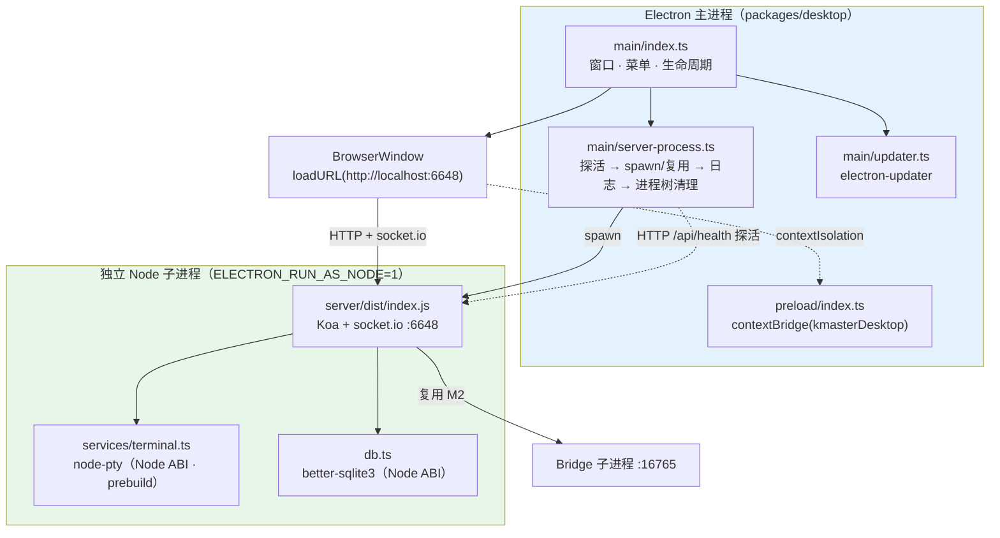
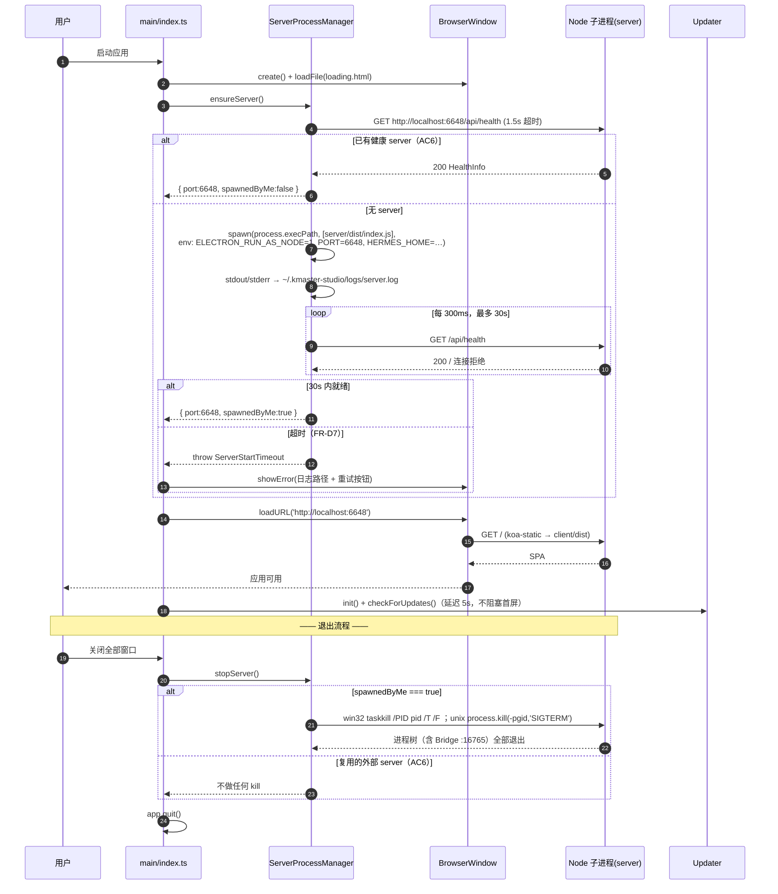
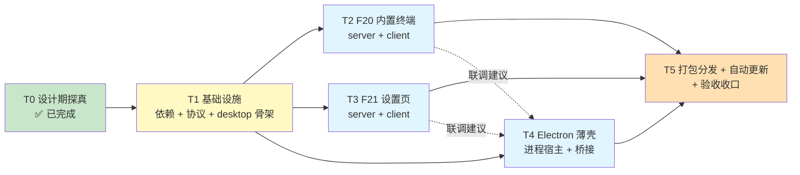

# 技术方案 · M5（F20 内置终端 / F21 设置页 / Electron 薄壳 + 打包分发）

> 继承 M1–M4 架构（Vue3 + Pinia + Naive UI + vue-router / Koa + Socket.IO `/chat-run` / monorepo `packages/client`、`packages/server`）。**本文只描述 M5 相对 M1–M4 的增量**，既有能力不复述。
> 纪律不变：视图零直接网络调用（views → stores → api → server）、零删除既有组件、Mock 可演示。
> 关联：`REQUIREMENT-M5.md`（PRD，含 R-M5-1~5）、`TECHNICAL-SOLUTION-M4.md`（`resolveHermesHome()` / `runHermesCli()` 范式）、`TECHNICAL-SOLUTION-M3.md`（REST 扩展范式）。
> 用户已拍板：**R-M5-1 全 P0** / **R-M5-2 外启独立 Node 子进程** / **R-M5-3 仅版式对齐** / **R-M5-4 含自动更新 + 三平台打包（P0）**。因此 PRD 中 `FR-P1.1/P1.2/FR-P2.1/FR-P2.2` **全部上提为 P0**，`NFR-M5-8` 的「不引入 electron-updater」条款**作废**（其余收敛约束仍生效）。

---

## 0. T0 结论（设计期探真，三项全部实测闭合）

> 本节即任务树中的 **T0**，已在设计期完成，实现期不再重复投入工时。三项探真均以「跑通/读源码」为准，不接受文档推断。

### 0.1 T0 结论速览

| 探真项 | 可行性 | 关键结论 | 风险 | 阻塞点 |
|--------|--------|---------|------|--------|
| **T0-1 hermes profile 机制** | ✅ **完全可行，且优于预期** → **FR21.10 由「只读」上提为「列表 + 切换」全量 P0** | 13 个子命令的完整 CLI（`list/use/create/delete/show/…`）；默认 profile = 根目录本身，命名 profile = `<root>/profiles/<name>/`，激活态 = `<root>/active_profile` 单行文本 | 🔴 **`active_profile` 不会自动改写子进程的 `HERMES_HOME`**（hermes 源码显式要求 spawner 自行传递，issue #18594）→ 只写文件会「切了但没切」且静默落回 default；🟡 `profiles/` 与 `active_profile` 均为**懒创建**，全新机器上不存在 | **无**（工程侧可自解，见 §0.2.1） |
| **T0-2 多平台打包（node-pty）** | ✅ 可行（Linux 需源码编译） | node-pty@1.1.0 的 `prebuilds/` **随 npm tarball 一起下发**（darwin-arm64/x64、win32-arm64/x64），`--ignore-scripts` 安装仍能加载；**无 linux prebuild** | Linux 必须 `npm rebuild node-pty`（需 python3 + make + g++）；三平台产物**无法单机产出**（mac 公证必须在 macOS、Linux 编译必须在 Linux） | **需要 CI matrix 或三台构建机**；缺失则降级为「本机 Windows 单平台先行」 |
| **T0-3 electron-updater 发布通道** | ⚠️ 代码可行，**上线被外部基础设施卡住** | generic provider 需自有 HTTPS 目录托管 `latest*.yml` + 安装包 + `.blockmap`；GitHub Releases 可零服务器起步 | macOS 自动更新**强制**要求签名 + 公证；Windows 会校验新旧包签名发布者一致 | **无 Apple Developer ID 证书、无 Windows 代码签名证书、无发布域名/对象存储** —— 三项均为采购/开通事项，工程侧无法自解 |

### 0.2 T0-1 · hermes profile 机制（对应 R-M5-5）

**实测依据**：`hermes profile --help` / `hermes profile list` 实跑 + 源码通读 `hermes_cli/profiles.py`（2225 行）、`hermes_constants.py`（`get_hermes_home` / `get_default_hermes_root`）。

| 项 | 实测结论 |
|----|---------|
| CLI 面（实跑输出） | `hermes profile {list,use,create,delete,describe,show,alias,rename,export,import,install,update,info}` —— 13 个子命令，功能远超预期 |
| profile 根锚点 | `get_default_hermes_root()`：win32 → `%LOCALAPPDATA%/hermes`；posix → `~/.hermes`。**与 M4 `resolveHermesHome()` 的解析结果一致** |
| 默认 profile | 就是根目录本身，名字固定 `default`，`is_default=true` |
| 命名 profile 目录 | `<root>/profiles/<name>/`（`_get_profiles_root()`），名字统一小写规范化（`normalize_profile_name`） |
| 激活态记录 | `<root>/active_profile`（`_get_active_profile_path()`），单行纯文本，粘性保存 |
| ⚠️ **懒创建** | 本机实跑 `hermes profile list` 只有 `◆default`，且 `<root>/profiles/` 与 `<root>/active_profile` **两者均不存在** —— 说明这两个路径在首次 `profile create` / `profile use` 时才生成。**读取实现必须容忍缺失** |
| 枚举 API | `list_profiles() -> List[ProfileInfo]`；`get_active_profile()` / `get_active_profile_name()` / `set_active_profile(name)` |
| `ProfileInfo` 字段 | `name, path, is_default, gateway_running, model, provider, has_env, skill_count, distribution_name, distribution_version, distribution_source, description, description_auto, alias_name, alias_path` |

#### ⚠️ 0.2.1 决定性发现：`active_profile` 不会自动改写子进程的 `HERMES_HOME`

`hermes_constants.get_hermes_home()` 的实现（已逐行核对）：

```
override → 环境变量 HERMES_HOME → 平台默认根目录
                                   ↑ 此处仅「读 active_profile 并打一次 stderr 警告」，
                                     **不会**据此改写返回值
```

源码注释原文（hermes-agent issue #18594）：*"Subprocess spawners are expected to propagate `HERMES_HOME` explicitly."*

**对 kmaster 的直接后果**：只写 `active_profile` 文件（即只跑 `hermes profile use x`）**不足以**让 kmaster 自己派生的子进程（Bridge :16765、`runPython`、`runHermesCli`）切到新 profile —— 它们会静默落回 default profile，仅在 stderr 打一行警告。**这是一个会造成「切了但没切」的静默数据错位陷阱。**

**因此 M5 必须在 `hermes-proxy.ts` 引入两级路径解析**（对 M4 的 `resolveHermesHome()` 做兼容性扩展，不改其语义）：

| 函数 | 返回 | 用途 |
|------|------|------|
| `resolveHermesRoot()` | `%LOCALAPPDATA%/hermes`（= 现 `resolveHermesHome()`） | profile 枚举锚点、读 `active_profile` |
| `resolveActiveHermesHome()` | `active === 'default' ? root : root/profiles/<active>` | **所有 hermes 子进程 spawn 时显式注入 `env.HERMES_HOME`** |

**对设计的影响（相对 PRD 的变更）**：

- PRD 的 `FR21.10` 原定「P0 只读、切换降 P1」。实测证明 profile 体系真实且切换路径清晰 → **FR21.10 在 M5 完整落地**：列表（读）+ 切换（写）**全部 P0**，`FR21.11` 的「切换」部分上提；「新建 / 删除 / import / export」仍留 P1。
- 读取路径**不走 Python**：`GET /api/profiles` 扫 `<root>/profiles/*` + 读 `<root>/active_profile`，两者缺失时**回落为「仅 default，且 default 为激活态」**，零子进程、毫秒级。
- 写入路径走 `runHermesCli(['profile','use',name])`（M4 范式），保证 hermes 自身副作用不被绕过。
- 切换成功后 server 必须：①失效 `resolveActiveHermesHome()` 与 `getModels()` 缓存；②**重启 Bridge 子进程**（否则运行中的 agent 仍在旧 profile）；③经 `/chat-run` 广播 `settings.updated`。因此 API 返回 `restart_required: true` 不是可选提示，而是**语义必需**。

### 0.3 T0-2 · 多平台打包与 node-pty 预编译（对应 FR-P1.1 / FR-P2.2）

**实测依据**：`npm i node-pty@1.1.0` 与 `npm i --ignore-scripts node-pty@1.1.0` 两次干净安装 + pty 冒烟脚本。

```
# 冒烟结果（win32-x64，普通安装 与 --ignore-scripts 安装 结果一致）
PTY_LOADED=true  pid=29708  echo_ok=true
RESIZE_OK=true
node_modules/node-pty/prebuilds/ -> darwin-arm64  darwin-x64  win32-arm64  win32-x64
node_modules/node-pty/build/     -> （空，未走 node-gyp）
```

| 结论 | 说明 |
|------|------|
| **prebuild 内置于 tarball** | 不同于 better-sqlite3（靠 install script 联网下载 prebuild），node-pty 的 `prebuilds/` 直接打在 npm 包里，`node-gyp-build` 在 `require` 时按 `<platform>-<arch>` 选择加载 |
| **`--ignore-scripts` 也能用** | 本机 `~/.npmrc` 存在 `allow-scripts=@volcengine/ark-cli` 白名单（导致 better-sqlite3 缺 `build/Release` 而回落 MemoryStore）；**node-pty 不受此限制**，无需改动全局 npm 策略 |
| **NAPI 稳定 ABI** | 同一份 prebuild 跨 Node 大版本可用，不随 Node 升级失效 |
| **无 Linux prebuild** | Linux 构建机必须执行 `npm rebuild node-pty`（依赖 python3 / make / g++） |
| **R-M5-2 的决定性收益** | 因为 server 跑在 **spawn 出来的独立 Node** 里（而非 Electron 主进程），node-pty 与 better-sqlite3 都按 **Node ABI** 加载 → **完全不需要 `electron-rebuild`**。若当初选择「主进程内嵌 Koa」，两个原生模块都要重编到 Electron ABI，工程量与失败率显著上升 |

**electron-builder 配置要点**（可直接照抄 `hermes-studio/packages/desktop/electron-builder.yml` 的成熟模式）：

```yaml
nodeGypRebuild: false
npmRebuild: false
asarUnpack: "**/*.node"
files:
  # 只保留当前目标平台的 prebuild，其余全部裁掉（体积从 ~12MB 降到 ~1MB）
  - "!**/node-pty/prebuilds/!(${platform}-${arch})/**"
  # Linux 无 prebuild，改为携带 npm rebuild 产出的 build/Release/pty.node
  - "!**/node-pty/build/**"
  - "**/node-pty/build/Release/pty.node"
```

**风险与阻塞**：三平台产物无法单机产出 —— macOS 公证必须在 macOS 执行，Linux 的 `npm rebuild` 必须在 Linux glibc 环境执行。**需 GitHub Actions matrix（`windows-latest` / `macos-latest` / `ubuntu-latest`）或三台构建机**。若暂无 CI，T5 按「Windows NSIS 单平台先出，mac/linux 由 CI 补齐」执行，此降级不影响 T1–T4 交付。

### 0.4 T0-3 · electron-updater 发布通道（对应 R-M5-4）

| 平台 | 自动更新可行性 | 硬性前提 |
|------|--------------|---------|
| **Windows** | ✅ 可行（NSIS 差分更新，`.blockmap`） | electron-updater 会校验「新包签名发布者 == 当前包签名发布者」；**未签名**时需 `verifyUpdateCodeSignature: false` 才能更新（不安全，仅限内测通道） |
| **macOS** | ⚠️ **强制**要求签名 + 公证 | 必须 Developer ID Application 证书 + `notarytool` 公证；未签名的 `.zip` **无法**通过 Squirrel.Mac 自动更新，无绕过手段 |
| **Linux** | ✅ 仅 AppImage | `.deb` / `.rpm` 走系统包管理器，electron-updater 不接管 |

**发布通道两选一**：

| 方案 | 服务器 | 需上传的清单 | 评价 |
|------|--------|------------|------|
| `provider: generic` | 自有 HTTPS 目录（如 `https://download.<domain>/kmaster/`） | `latest.yml`(win) / `latest-mac.yml` / `latest-linux.yml` + 安装包 + `.blockmap` | 可控、无速率限制；**需要域名 + 对象存储/CDN** |
| `provider: github` | 无（GitHub Releases） | electron-builder 自动上传，`GH_TOKEN` 授权 | 零基础设施起步；私有仓库需 token 分发，国内下载速度不稳 |

**阻塞点（明确升级给主理人）**：以下三项均为**外部采购/开通**，工程侧无法自解，是 R-M5-4「P0」落地的真实前置：

1. Apple Developer Program 会员 + Developer ID Application 证书 + App-Specific Password（公证用）—— 约 $99/年；
2. Windows 代码签名证书（OV/EV）或 Azure Trusted Signing 订阅；
3. 发布域名 + 对象存储（若选 generic），或 GitHub 仓库 Release 权限（若选 github）。

**工程侧的处置策略（写进 T5）**：代码与配置**全量实现**（`updater.ts`、`electron-builder.yml` 的 `publish` 段、三平台 target），发布通道**默认走 github provider**（零基础设施可跑通端到端）；证书未到位期间：
- Windows 内测通道置 `verifyUpdateCodeSignature: false`，并在设置页「关于」区显式标注「内测通道，未签名」；
- macOS 自动更新**功能挂起**，`checkForUpdates()` 直接返回 `{ available:false, reason:'unsigned-macos' }`，UI 提示「请前往官网手动下载新版本」；
- 由此保证「代码零返工，证书到位后仅改配置即开通」。

---

## 1. 实现方案与框架选型

### 1.1 三个正交子目标的技术难点与解法

| 子目标 | 核心难点 | 解法 | 选型理由 |
|--------|---------|------|---------|
| **F20 内置终端** | ①原生模块 `node-pty` 在部分环境不可用；②高频二进制流的传输与背压；③pty 生命周期与孤儿进程 | ①`await import('node-pty')` 懒加载 + try/catch 降级（沿用 M4 `db.ts` 的 better-sqlite3 降级范式）；②复用**既有 socket.io 实例**新开 `/terminal` 命名空间，事件按 `term_id` 分发；③`TerminalManager` 单例持有 `Map<term_id, PtySession>`，在 `socket.disconnect` / `process.exit` / `SIGINT` 三处统一 kill | 不引入 `ws` 第二套 WS 栈（NFR-M5-8）；socket.io 自带重连与二进制帧，前端已装 `socket.io-client` |
| **F21 设置页** | ①极易重复造轮子（技能/MCP/模型都已有实现）；②API Key 写入不能破坏 `config.yaml` 注释；③读接口不能泄露明文 | ①`SettingsView` 只做**布局容器**，六个分组内容全部内嵌复用既有组件与既有端点；②写 Key 走 `runHermesCli(['config','set',key,value])` 子进程（M4 范式），**禁止 js-yaml 直写**；③`ProviderInfo` DTO 层面就不含明文字段，只有 `configured` + `masked` | 复用优先（AC8 会代码审查）；新增 REST 严格限 3 处 |
| **Electron 薄壳 + 打包** | ①双原生模块的 ABI 问题；②端口复用与进程树清理；③三平台产物与自动更新 | ①**spawn 独立 Node 子进程**跑 `server/dist/index.js`（R-M5-2）→ 规避 electron-rebuild；②启动前先探 `/api/health`，命中则纯 `loadURL` 不拉进程，并用 `spawnedByMe` 标志决定退出时是否 kill；Windows 用 `taskkill /PID <pid> /T /F` 级联；③electron-builder + per-platform prebuild 裁剪 + electron-updater | 与 hermes-studio 已验证的形态一致，可复用其 `webui-server.ts` / `electron-builder.yml` 经验 |

### 1.2 框架与库选型

| 层 | 选型 | 版本 | 理由 / 替代方案否决理由 |
|----|------|------|----------------------|
| PTY | `node-pty` | `^1.1.0` | 事实标准（VS Code 同款）；prebuild 内置、NAPI 稳定 ABI（T0-2）。否决 `child_process.spawn` —— 无 TTY 无法跑交互式 shell |
| 终端渲染 | `@xterm/xterm` | `^6.0.0` | 事实标准；WebGL/Canvas 渲染、完整 VT 序列支持。否决自研 |
| 终端尺寸 | `@xterm/addon-fit` | `^0.11.0` | 官方 addon，配合 `ResizeObserver` 自适应 |
| 终端链接 | `@xterm/addon-web-links` | `^0.12.0` | 官方 addon，URL 可点（桌面壳内经 `shell.openExternal`） |
| 传输 | **复用现有 `socket.io`** | 不新增 | `index.ts` 已 `new Server(httpServer)`，新增 `io.of('/terminal')` 即可。**明令禁止**引入 `ws` |
| 桌面壳 | `electron` | `^42.3.0`（dev） | 与 hermes-studio 对齐（其已在 42.3.0 上验证 node-pty/better-sqlite3 打包）；43.2.0 虽已发布但不追新 |
| 打包 | `electron-builder` | `^26.15.3`（dev） | 三平台 target + prebuild 裁剪 + publish 一体化 |
| 自动更新 | `electron-updater` | `^6.8.9` | 与 electron-builder 同族，配置零胶水 |
| 桌面壳构建 | `tsc -p`（不引 bundler） | TS `~5.6` | 主进程/preload 代码量小（<600 行），无需 Vite/esbuild；与既有 server 的 `tsc` 构建方式一致 |

**架构模式**：延续 M1–M4 的 **BFF + 分层**（views → stores → api → server），桌面层为**旁路薄壳**（不参与业务分层，仅提供进程宿主 + 最小桥接）。

### 1.3 关键架构决策（决定性简化）



> **为什么这是决定性简化**：`node-pty` 与 `better-sqlite3` 全部运行在 Node ABI 下，直接吃官方 prebuild；Electron 主进程零原生依赖 → `nodeGypRebuild:false` + `npmRebuild:false` 即可打包，彻底绕开 electron-rebuild 这一最大失败源（T0-2）。

---

## 2. 文件清单

> 标记：**新** = 新增文件；**改** = 修改既有文件；♻️ = 显式复用点（禁止重造）；🚫 = 明令禁止事项。

### 2.1 Server（`packages/server`）

| 文件 | 状态 | 职责 |
|------|------|------|
| `src/services/terminal.ts` | **新** | `TerminalManager` 单例：node-pty 懒加载与降级标记、shell 探测、pty spawn/write/resize/kill、会话表 `Map<term_id, PtySession>`、进程退出兜底清理 |
| `src/terminal-ns.ts` | **新** | socket.io `/terminal` 命名空间编排：上下行事件转译、按 socket 归属回收 pty |
| `src/routes/config.ts` | **新** | `GET/PUT /api/config/providers`、`GET /api/profiles`、`PUT /api/profiles/active` |
| `src/index.ts` | **改** | 挂载 `configRouter`、调用 `registerTerminal(io)`；注册 `SIGINT/SIGTERM/exit` 统一清理钩子 |
| `src/protocol.ts` | **改** | `Settings` 扩展；新增 `TerminalOpenRequest`/`TerminalEvent`/`PtyInfo`/`ProviderInfo`/`ProfileInfo`/`HealthInfo` |
| `src/routes/sessions.ts` | **改** | 仅 `/api/health` 返回体扩展（♻️ 不新建端点）；`/api/settings` 的 GET/PUT 透传新增字段 |
| `src/hermes-proxy.ts` | **改** | 新增 `listProviders()` / `setProviderKey()` / `listProfiles()` / `useProfile()` / `probeHealth()`；**新增两级路径解析 `resolveHermesRoot()` + `resolveActiveHermesHome()`（§0.2.1）并让所有子进程 spawn 显式注入 `env.HERMES_HOME`**；♻️ 复用 `resolveHermesHome()`、`runHermesCli()`、`readConfig()` |
| `package.json` | **改** | `+ node-pty` |

🚫 **禁止**：新建技能 / MCP / 模型枚举类端点（`/api/skills`、`/api/mcp`、`/api/models` 已存在）；🚫 禁止用 `js-yaml` 直写 `config.yaml` 的 Key 字段（丢注释）。

### 2.2 Client（`packages/client`）

| 文件 | 状态 | 职责 |
|------|------|------|
| `src/components/preview/TerminalPane.vue` | **新** | xterm 实例挂载 / fit / web-links / 主题跟随 / 不可用降级提示 |
| `src/api/terminal.ts` | **新** | `/terminal` socket 封装（连接、事件收发、断线重连）—— 组件**不得**直接触碰 socket |
| `src/stores/terminal.ts` | **新** | Pinia：`available` / `terms` / `activeTermId` / `open/input/resize/close` |
| `src/views/SettingsView.vue` | **新** | 七分组整页布局容器（左侧锚点导航 + 右侧分组卡片） |
| `src/components/settings/GeneralSection.vue` | **新** | 通用：主题（♻️ `useTheme`）/ 语言占位 / 终端默认 cwd |
| `src/components/settings/ProviderSection.vue` | **新** | Provider & Model：♻️ `GET /api/models` 展示 + `GET/PUT /api/config/providers` 写 Key（只写不回显） |
| `src/components/settings/ProfileSection.vue` | **新** | Profile 列表 + 激活切换（T0-1 已闭合，完整落地） |
| `src/components/settings/DiagnosticsSection.vue` | **新** | 诊断：♻️ `GET /api/health` 扩展字段 + 一键复制（自动脱敏） |
| `src/utils/desktop-bridge.ts` | **新** | `isDesktop()` / `platform()` / `windowControl()` / `onServerStatus()`，Web 下全部 no-op |
| `src/components/chat/ArtifactPanel.vue` | **改** | 顶部由单标题改为 **Tab 栏（预览 / 终端）**；终端 Tab **惰性挂载**（`v-if` + `keep-alive`），未点开不创建 pty |
| `src/components/chat/SettingsDrawer.vue` | **改** | ♻️ **保留全部现有能力**（mode/model），底部加「更多设置 →」跳 `/settings`。🚫 禁止删除 |
| `src/router/index.ts` | **改** | `+ { path:'/settings', component: () => import('../views/SettingsView.vue') }`（懒加载，插在通配回落之前） |
| `src/components/AppNav.vue` | **改** | `NAV_ITEMS` 追加 `{ path:'/settings', label:'设置', icon:'⚙️' }`（放在 spacer 之后靠右，与主题按钮同区） |
| `src/types/chat.ts` | **改** | 与 server `protocol.ts` **双端同步**新增类型 |
| `src/api/client.ts` | **改** | `+ getProviders/putProvider/getProfiles/useProfile/getHealth` |
| `package.json` | **改** | `+ @xterm/xterm`、`@xterm/addon-fit`、`@xterm/addon-web-links` |

> 说明：`ArtifactPanel.vue` 当前是**无 Tab 的单面板**（`.km-artifact-head` 固定文案「预览 / Artifact」），M5 需将其头部改造为 Tab 栏；原有 artifact 列表 + 预览区 + `UsageBar` 整体收入「预览」Tab，行为不变（零回归）。

### 2.3 Desktop（`packages/desktop`，新增 workspace 包）

| 文件 | 状态 | 职责 |
|------|------|------|
| `package.json` | **新** | `main: dist/main/index.js`；deps `electron-updater`；devDeps `electron` / `electron-builder` / `typescript` / `@types/node` |
| `tsconfig.json` | **新** | `module: CommonJS`、`outDir: dist`（Electron 主进程用 CJS 最省心） |
| `src/main/index.ts` | **新** | 窗口创建（1440×900 / 最小 1024×720 / 状态持久化）、原生标题栏、菜单、`will-quit` 清理 |
| `src/main/server-process.ts` | **新** | `ensureServer()`：探活 6648 → 命中则复用（`spawnedByMe=false`）→ 未命中则 `spawn(process.execPath, [entry], { env:{ ELECTRON_RUN_AS_NODE:'1', PORT:'6648', ... } })`；日志落 `~/.kmaster-studio/logs/server.log`；`stopServer()` 进程树清理 |
| `src/main/window-state.ts` | **新** | 窗口尺寸/位置持久化（写 `userData/window-state.json`） |
| `src/main/updater.ts` | **新** | electron-updater 封装：检查 / 下载 / 安装；macOS 未签名时短路返回 |
| `src/main/loading.html` | **新** | 启动占位页（进度文案 / 30s 超时错误页 / 重试按钮 / 日志路径） |
| `src/preload/index.ts` | **新** | `contextBridge.exposeInMainWorld('kmasterDesktop', { isDesktop, platform, version, windowControl, onServerStatus })` |
| `electron-builder.yml` | **新** | 三平台 target + node-pty prebuild 裁剪 + `asarUnpack` + `publish` |
| `build/icon.ico` / `icon.icns` / `icon.png` | **新** | 应用图标（512×512 源图派生） |

**硬约束**：`webPreferences: { contextIsolation: true, nodeIntegration: false, sandbox: true, preload }`（NFR-M5-5）。

### 2.4 其他

| 文件 | 状态 | 职责 |
|------|------|------|
| 根 `package.json` | **改** | `workspaces` `+ packages/desktop`；scripts `+ dev:desktop` / `build:desktop` / `dist:win|mac|linux` |
| `scripts/qa-verify-m5.mjs` | **新** | AC1–AC9 自动化部分（AC5 桌面壳为人工验收留位） |
| `.github/workflows/release.yml` | **新** | 三平台 matrix 构建 + 上传（T0-2 阻塞项的工程侧解法） |
| `docs/design/M5-VS-WORKBUDDY-DIFF.md` | **新** | AC9 要求的「M5 与 WorkBuddy 差异清单」 |
| `README.md` | **改** | 桌面壳开发 / 打包 / 发布说明 |

---

## 3. 数据结构与接口

### 3.1 新增 REST 端点（严格 3 组，AC8 会审查）

| 方法 | 路径 | 请求体 | 响应 | 说明 |
|------|------|--------|------|------|
| `GET` | `/api/config/providers` | — | `{ providers: ProviderInfo[], current: string }` | 🔒 **只返回 `configured` + `masked`，绝不含明文 Key** |
| `PUT` | `/api/config/providers` | `{ provider: string, api_key: string }` | `{ ok: true, provider, configured: true, masked }` | 走 `runHermesCli(['config','set',<key_env>,<value>])`；`api_key` 为空串表示清除 |
| `GET` | `/api/profiles` | — | `{ profiles: ProfileInfo[], active: string, root: string }` | 扫 `<root>/profiles/*` + 读 `<root>/active_profile`；**两者缺失时回落为「仅 default 且激活」**（§0.2 懒创建），零子进程 |
| `PUT` | `/api/profiles/active` | `{ name: string }` | `{ ok: true, active: string, hermes_home: string, restart_required: true }` | 走 `runHermesCli(['profile','use',name])`；成功后**必须**失效 `resolveActiveHermesHome()` / models 缓存并重启 Bridge 子进程（§0.2.1） |

> `PUT /api/profiles/active` 与 `GET /api/profiles` 同属 **`/api/profiles` 这一组资源**，计为约定中的第 2 组新增；未突破「仅 3 组」的上限。

**♻️ 扩展（非新增）端点**：

| 端点 | 变更 |
|------|------|
| `GET /api/health` | 返回体由 `{ ok, service, ts }` 扩展为 `HealthInfo`（见 3.3） |
| `GET/PUT /api/settings` | 透传 `Settings` 的新增字段，持久化仍走 `kmaster.db` 的 `settings` 表 |

**♻️ 零改动直接复用**：`GET /api/models`、`GET /api/skills`、`GET/POST/DELETE /api/mcp`、`GET/PUT /api/settings`、`GET /api/sessions/*`。

### 3.2 `/terminal` socket.io 命名空间协议

**上行（client → server）**

| 事件 | Payload | 说明 |
|------|---------|------|
| `term.open` | `{ cols: number, rows: number, cwd?: string, shell?: string }` | `cwd` 缺省取 `Settings.terminal_cwd` → server 启动 cwd |
| `term.input` | `{ term_id: string, data: string }` | 键盘输入原样透传 |
| `term.resize` | `{ term_id: string, cols: number, rows: number }` | 由 `addon-fit` + `ResizeObserver` 驱动，客户端 100ms 节流 |
| `term.close` | `{ term_id: string }` | 主动关闭；服务端 `kill()` 并回 `term.exit` |

**下行（server → client）**

| 事件 | Payload | 说明 |
|------|---------|------|
| `term.opened` | `{ term_id, shell, cwd, pid, cols, rows }` | pty 创建成功 |
| `term.data` | `{ term_id, data: string }` | pty 输出；服务端 **8ms 微批合并**，降低高频小包开销 |
| `term.exit` | `{ term_id, exit_code: number, signal?: number }` | pty 退出（含主动 close） |
| `term.error` | `{ term_id?: string, code: TerminalErrorCode, message: string }` | `code ∈ 'pty_unavailable' \| 'spawn_failed' \| 'bad_cwd' \| 'limit_exceeded' \| 'not_found'` |

**连接期约定**

- 客户端 `io('/terminal')` 建连后，服务端立即推 `term.error{code:'pty_unavailable'}`（若 node-pty 加载失败），前端据此渲染降级提示而非白屏（AC4）。
- **归属清理**：每个 pty 记录 `owner_socket_id`；`socket.on('disconnect')` 时 kill 该 socket 名下全部 pty（FR20.7 / NFR-M5-7）。
- **并发上限**：M5 单终端为 P0，服务端硬上限 `MAX_TERMS = 8`（为 P1 的多 Tab 预留），超限回 `limit_exceeded`。

### 3.3 类图（新增数据结构与服务类）

```mermaid
classDiagram
  %% ==================== Server: 终端 ====================
  class TerminalManager {
    -Map~PtySession~ sessions
    -boolean available
    -string ptyError
    -any ptyModule
    +init() Promise~void~
    +isAvailable() boolean
    +getError() string
    +detectShell() string
    +resolveCwd(req) string
    +open(req, ownerSocketId) Promise~PtyInfo~
    +write(termId, data) void
    +resize(termId, cols, rows) void
    +kill(termId) void
    +killByOwner(socketId) void
    +killAll() void
  }
  class PtySession {
    +string term_id
    +string owner_socket_id
    +string shell
    +string cwd
    +number pid
    +number cols
    +number rows
    +number created_at
    +IPty pty
  }
  class PtyInfo {
    +string term_id
    +string shell
    +string cwd
    +number pid
    +number cols
    +number rows
  }
  class TerminalNamespace {
    -Namespace ns
    -TerminalManager mgr
    +register(io) void
    -onOpen(socket, req) void
    -onInput(socket, msg) void
    -onResize(socket, msg) void
    -onClose(socket, msg) void
    -onDisconnect(socket) void
  }

  %% ==================== Server: 配置 / Profile ====================
  class HermesProxy {
    +resolveHermesRoot() string
    +resolveActiveHermesHome() string
    +runHermesCli(args) Promise~CliResult~
    +readConfig() Promise~any~
    +getModels() Promise~ModelsPayload~
    +listProviders() Promise~ProviderList~
    +setProviderKey(provider, apiKey) Promise~ProviderInfo~
    +listProfiles() Promise~ProfileListResult~
    +useProfile(name) Promise~UseProfileResult~
    +probeHealth() Promise~HealthInfo~
    +invalidateCaches() void
  }
  class ProviderInfo {
    +string slug
    +string name
    +string key_env
    +boolean configured
    +string masked
    +boolean is_current
    +boolean authenticated
    +string auth_type
    +number total_models
    +string warning
  }
  class ProfileInfo {
    +string name
    +string path
    +boolean is_default
    +boolean is_active
    +string model
    +string provider
    +boolean has_env
    +number skill_count
    +string description
    +string distribution_name
    +string distribution_version
  }
  class HealthInfo {
    +boolean ok
    +string service
    +string version
    +number port
    +boolean bridge_mock
    +string hermes_home
    +boolean python_ok
    +boolean hermes_cli_ok
    +boolean terminal_available
    +string node_pty_error
    +number ts
  }
  class Settings {
    +HermesMode default_mode
    +string default_model
    +string theme
    +string locale
    +string terminal_cwd
    +string active_profile
  }
  class ConfigRouter {
    +GET_providers(ctx) Promise~void~
    +PUT_providers(ctx) Promise~void~
    +GET_profiles(ctx) Promise~void~
    +PUT_profiles_active(ctx) Promise~void~
  }

  %% ==================== Client ====================
  class TerminalStore {
    +boolean available
    +string unavailableReason
    +Map~TermState~ terms
    +string activeTermId
    +ensureConnected() Promise~void~
    +openTerm(cols, rows, cwd) Promise~string~
    +sendInput(termId, data) void
    +resize(termId, cols, rows) void
    +closeTerm(termId) void
    +onData(termId, cb) void
  }
  class TerminalApi {
    -Socket socket
    +connect() Socket
    +disconnect() void
    +emitOpen(req) void
    +emitInput(msg) void
    +emitResize(msg) void
    +emitClose(msg) void
    +on(event, cb) void
  }
  class TerminalPane {
    -Terminal xterm
    -FitAddon fit
    -ResizeObserver ro
    +onMounted() void
    +onUnmounted() void
    -applyTheme(isDark) void
  }
  class SettingsView {
    +string activeAnchor
    +scrollTo(anchor) void
  }
  class DesktopBridge {
    +isDesktop() boolean
    +platform() string
    +version() string
    +windowControl(action) void
    +onServerStatus(cb) Unsubscribe
  }

  %% ==================== Desktop ====================
  class ServerProcessManager {
    -ChildProcess child
    -boolean spawnedByMe
    -number port
    +ensureServer() Promise~ServerHandle~
    -probeHealth(timeoutMs) Promise~boolean~
    -spawnServer() Promise~void~
    -waitReady(timeoutMs) Promise~void~
    +stopServer() Promise~void~
    +logPath() string
  }
  class MainWindow {
    -BrowserWindow win
    +create() Promise~void~
    +showLoading() void
    +showError(msg) void
    +loadApp(url) void
  }
  class Updater {
    +init() void
    +checkForUpdates() Promise~UpdateStatus~
    -isSupportedPlatform() boolean
  }

  %% ==================== 关系 ====================
  TerminalManager "1" *-- "0..8" PtySession : 持有
  TerminalManager ..> PtyInfo : 返回
  TerminalNamespace --> TerminalManager : 委派
  TerminalNamespace ..> Settings : 读 terminal_cwd
  ConfigRouter --> HermesProxy : 委派
  HermesProxy ..> ProviderInfo : 产出
  HermesProxy ..> ProfileInfo : 产出
  HermesProxy ..> HealthInfo : 产出
  TerminalStore --> TerminalApi : 唯一网络出口
  TerminalPane --> TerminalStore : 只调 store
  SettingsView ..> DesktopBridge : 读 platform/version
  MainWindow --> ServerProcessManager : 启动前置
  MainWindow --> Updater : 就绪后触发
  ServerProcessManager ..> HealthInfo : 探活判据
```



### 3.4 关键类型定义（server `protocol.ts` ↔ client `types/chat.ts` 双端同步）

```ts
/** F21 / FR21.9：Settings 扩展（新增字段全部可选，向后兼容） */
export interface Settings {
  default_mode: HermesMode;
  default_model?: string;
  theme?: 'dark' | 'light';        // 新增，与 styles/theme.ts 同源
  locale?: 'zh-CN';                // 新增，占位单语言
  terminal_cwd?: string;           // 新增，FR20.6 默认终端工作目录
  active_profile?: string;         // 新增，只读镜像，写入走 /api/profiles/active
}

/** F20：终端上下行 */
export interface TerminalOpenRequest { cols: number; rows: number; cwd?: string; shell?: string }
export type TerminalErrorCode =
  | 'pty_unavailable' | 'spawn_failed' | 'bad_cwd' | 'limit_exceeded' | 'not_found';
export type TerminalEvent =
  | { type: 'opened'; term_id: string; shell: string; cwd: string; pid: number; cols: number; rows: number }
  | { type: 'data';   term_id: string; data: string }
  | { type: 'exit';   term_id: string; exit_code: number; signal?: number }
  | { type: 'error';  term_id?: string; code: TerminalErrorCode; message: string };
```

**Provider Key 写入映射**（复用 M3 `build_models_payload` 已返回的 `key_env`）：
`ProviderInfo.key_env`（如 `ANTHROPIC_API_KEY`）→ `hermes config set ANTHROPIC_API_KEY <value>` → 落 `<hermesHome>/.env`。
**脱敏规则**：`masked = value.length <= 8 ? '****' : '****' + value.slice(-4)`；`configured = key_env 在 .env 中存在且非空`。

---

## 4. 程序调用流程

### 4.1 Electron 壳启动（含端口复用与失败兜底）—— FR-D2 / FR-D3 / FR-D6 / FR-D7



#### ⚠️ 4.1.0 勘误（T3 实现期裁定）：「重启 Bridge 子进程」在本仓库不存在

§0.2.1 步骤 ② 措辞为「重建 Bridge 连接 / 重启 Bridge 子进程」，但核对 `packages/server/src/bridge.ts` 后确认：**kmaster-server 从不 spawn Bridge 子进程**。

- `MockBridge`（`HERMES_BRIDGE_MOCK !== '0'`，默认）完全跑在进程内；
- `RealBridge` 是连到**外部** Python bridge（`HERMES_AGENT_BRIDGE_ENDPOINT`，默认 `tcp://127.0.0.1:16765`）的 TCP 客户端，且**每次 `chat()` 现连现用**，构造时并不建连。

因此 §0.2.1 ② 在本架构下的等价落地是 `run-chat.ts` 的 `restartBridge()`：**丢弃旧实例、重建客户端**，使下一次 run 按新 `hermesChildEnv()` 重新建连。外部 bridge 进程本身仍需用户自行重启 —— 这正是 `PUT /api/profiles/active` 返回 `restart_required: true` 的语义所在（诚实告知，不假装已完成）。

**两个已知隐患（先于 M5 存在，不阻塞 M5，记录待办）**：
1. `RealBridge.chat()` 在 `completed` 后**未 `sock.destroy()`**，长期运行会累积半开 socket（`contextEstimate()` 则有正确的 destroy，可作参照修法）。
2. `RealBridge` 默认端点写死 `tcp://127.0.0.1:16765`。本机 NekoBox 为 TUN 模式会拦截 `127.0.0.1` 裸 TCP，real-bridge 模式在此环境下会连不通。改 `localhost` 会解析到 `::1`，需先确认 Python bridge 的实际 bind 地址再动，**不可盲改**。

#### ⚠️ 4.1.1 勘误（T4 实现期裁定）：壳**不得**自行计算 `HERMES_HOME`

上图 spawn 那一步写的 `env: … HERMES_HOME=…` 是设计期简写，**实现以 §7 为准：`HERMES_HOME` 的解析权唯一归 server 的 `hermes-proxy.ts`，Electron 壳只透传 `process.env`。**

原因：`resolveHermesRoot()`（`hermes-proxy.ts`）内部即 `resolveHermesHome()`，其第一优先级就是读 `process.env.HERMES_HOME`，**该环境变量在 server 眼里的语义是「根」而非「激活目录」**。壳若把 `resolveActiveHermesHome()` 的结果（`root/profiles/<name>`）注入子进程，会触发双层嵌套塌方：

```
resolveHermesRoot()      → root/profiles/work            ← 被当成根
readActiveProfileName()  → 读 root/profiles/work/active_profile → 不存在 → 'default'
listProfiles()           → 扫 root/profiles/work/profiles/ → 空 → 「只有 default」
PUT /api/profiles/active → active_profile 写进 root/profiles/work/ ← 写歪，下次读不到
```

后果是桌面壳内 F21 的 profile 功能**整体报废且静默无报错**——即 §0.2.1 所述「切了但没切」经由另一入口重现。

**约束**：
1. 壳的 spawn 只做 `{ ...process.env, ELECTRON_RUN_AS_NODE:'1', PORT:'6648', …extraEnv }`，🚫 不含自行计算的 `HERMES_HOME`。
2. `extraEnv` 若确需注入 `HERMES_HOME`，**只允许 root 级路径，绝不允许 profile 级**。
3. `server-process.ts` 的 spawn 处须保留反向注释说明本条，防止后人对照上图"修回去"。

### 4.2 F20 终端：打开 → 输入回显 → 尺寸变化 → 关闭

```mermaid
sequenceDiagram
  autonumber
  participant V as TerminalPane.vue
  participant S as stores/terminal.ts
  participant A as api/terminal.ts
  participant NS as /terminal 命名空间
  participant TM as TerminalManager
  participant P as node-pty

  V->>S: ensureConnected()
  S->>A: connect() → io('/terminal')
  A->>NS: connection
  alt node-pty 不可用（AC4）
    NS-->>A: term.error{ code:'pty_unavailable', message }
    A-->>S: available=false, unavailableReason
    S-->>V: 渲染「终端不可用」提示（不白屏，其余功能不受影响）
  else 可用
    V->>V: new Terminal() + FitAddon.fit() → 得 cols/rows
    V->>S: openTerm(cols, rows)
    S->>A: emit term.open{ cols, rows, cwd?: Settings.terminal_cwd }
    A->>NS: term.open
    NS->>TM: open(req, socket.id)
    TM->>TM: detectShell(): win32→powershell.exe ; unix→$SHELL→/bin/zsh→/bin/bash
    TM->>TM: resolveCwd(): req.cwd → Settings.terminal_cwd → process.cwd()
    TM->>P: pty.spawn(shell, [], { name:'xterm-color', cols, rows, cwd, env })
    P-->>TM: IPty(pid)
    TM-->>NS: PtyInfo
    NS-->>A: term.opened{ term_id, shell, cwd, pid }
    A-->>S: terms.set(term_id, …)
    S-->>V: 挂载完成，显示 shell 提示符

    P->>TM: onData(chunk)
    TM->>NS: 8ms 微批合并
    NS-->>A: term.data{ term_id, data }
    A-->>S: 分发
    S-->>V: xterm.write(data)

    V->>S: sendInput(term_id, 'echo kmaster-m5\r')
    S->>A: emit term.input
    A->>NS: term.input
    NS->>TM: write(term_id, data)
    TM->>P: pty.write(data)
    P->>TM: onData('kmaster-m5\r\n')
    TM-->>V: （同上回显链路，AC3 要求 500ms 内）

    V->>V: ResizeObserver 触发 → fit() → (cols,rows) 变化
    V->>S: resize(term_id, cols, rows)（100ms 节流）
    S->>A: emit term.resize
    A->>NS: term.resize
    NS->>TM: resize()
    TM->>P: pty.resize(cols, rows)
  end

  Note over V,P: —— 三种回收路径，任一触发都不留孤儿（NFR-M5-7）——
  alt 用户关闭终端 Tab
    V->>S: closeTerm(term_id)
    S->>A: emit term.close
    A->>NS: term.close
    NS->>TM: kill(term_id)
  else socket 断开 / 页面刷新
    NS->>TM: killByOwner(socket.id)
  else server 进程退出（SIGINT/SIGTERM/exit）
    NS->>TM: killAll()
  end
  TM->>P: pty.kill()
  P-->>TM: onExit(exitCode, signal)
  TM-->>NS: term.exit
  NS-->>V: 面板置空 + 提示「会话已结束」
```

### 4.3 F21 设置页：加载 → 写 API Key → 切换 Profile

```mermaid
sequenceDiagram
  autonumber
  participant U as 用户
  participant SV as SettingsView.vue
  participant CS as chat store（♻️ M3）
  participant API as api/client.ts
  participant R as routes sessions+config.ts
  participant HP as hermes-proxy.ts
  participant CLI as hermes CLI 子进程
  participant FS as hermesHome 文件系统

  U->>SV: 进入 #/settings
  par 六个分组并行拉取（全部复用既有端点）
    SV->>CS: loadGlobalSettings() ♻️ GET /api/settings
    SV->>CS: loadModels() ♻️ GET /api/models
    SV->>CS: loadSkills() ♻️ GET /api/skills
    SV->>CS: loadMcp() ♻️ GET /api/mcp
    SV->>API: getProviders() 🆕 GET /api/config/providers
    SV->>API: getProfiles() 🆕 GET /api/profiles
    SV->>API: getHealth() ♻️扩展 GET /api/health
  end
  API->>R: GET /api/config/providers
  R->>HP: listProviders()
  HP->>HP: ♻️ getModels() 取 providers[].key_env
  HP->>FS: 读 hermesHome/.env 判断各 key_env 是否已配置
  HP-->>R: ProviderInfo[]（configured + masked，🔒 无明文）
  R-->>SV: 渲染

  U->>SV: 在 Provider 分组填入 API Key 并保存
  SV->>API: putProvider({ provider, api_key })
  API->>R: PUT /api/config/providers
  R->>HP: setProviderKey(provider, key)
  HP->>CLI: ♻️ runHermesCli(['config','set', key_env, value])
  CLI->>FS: 写 hermesHome/.env（保留注释与其余键）
  CLI-->>HP: exit 0
  HP->>HP: invalidateCaches()（models 快照失效）
  HP-->>R: { configured:true, masked:'****abcd' }
  R-->>SV: 回填遮罩值（🔒 永不回显明文）

  U->>SV: 在 Profile 分组切换到 "work"
  SV->>API: useProfile('work')
  API->>R: PUT /api/profiles/active
  R->>HP: useProfile('work')
  HP->>CLI: ♻️ runHermesCli(['profile','use','work'])
  CLI->>FS: 写 root/active_profile（懒创建）
  CLI-->>HP: exit 0
  HP->>HP: invalidateCaches() ; resolveActiveHermesHome() → root/profiles/work
  HP->>HP: ⚠️ 重启 Bridge 子进程并注入 env.HERMES_HOME=root/profiles/work（§0.2.1）
  HP-->>R: { active:'work', hermes_home:'root/profiles/work', restart_required:true }
  R-->>SV: 提示「已切换到 work，Bridge 已重启」
```

---

## 5. 任务列表（有序 · T0 → T5）

> 分组原则：**按功能模块整链路切分**（server + client 同步交付一个可验收的功能面），避免「后端做完前端没得用」的半成品。T2/T3/T4 **只依赖 T1**，可三线并行。

| 任务 | 名称 | 优先级 | 依赖 | 源文件 | 完成判据 |
|------|------|--------|------|--------|---------|
| **T0** | 设计期探真（✅ 已完成） | P0 | — | 本文档 §0 | profile 机制 / node-pty 三平台 / electron-updater 通道 三项结论落文 |
| **T1** | M5 基础设施：依赖 + 双端协议 + desktop 包骨架 | P0 | T0 | 根 `package.json`；`packages/server/package.json`、`src/protocol.ts`；`packages/client/package.json`、`src/types/chat.ts`；**新** `packages/desktop/{package.json,tsconfig.json}` | `npm i` 通过；`node -e "require('node-pty')"` 加载成功；三处 `tsc --noEmit` 零错误；`npm -w packages/desktop run build` 产出空壳 dist |
| **T2** | F20 内置终端全链路（server + client） | P0 | T1 | **新** `server/src/services/terminal.ts`、`server/src/terminal-ns.ts`；**改** `server/src/index.ts`；**新** `client/src/api/terminal.ts`、`client/src/stores/terminal.ts`、`client/src/components/preview/TerminalPane.vue`；**改** `client/src/components/chat/ArtifactPanel.vue` | AC2 / AC3 / AC4 全过：能开终端、`echo` 500ms 内回显、resize 正确、关闭无孤儿、node-pty 屏蔽后 server 仍全功能 |
| **T3** | F21 设置页全链路（server + client） | P0 | T1 | **新** `server/src/routes/config.ts`；**改** `server/src/hermes-proxy.ts`（含 §0.2.1 两级 home 解析 + 子进程 `HERMES_HOME` 注入）、`server/src/routes/sessions.ts`；**新** `client/src/views/SettingsView.vue`、`client/src/components/settings/{General,Provider,Profile,Diagnostics}Section.vue`；**改** `client/src/router/index.ts`、`client/src/components/AppNav.vue`、`client/src/components/chat/SettingsDrawer.vue`、`client/src/api/client.ts` | AC7 / AC8 全过：七分组渲染无错、默认值被新会话继承、Key 只写不回显、Profile 可列可切**且切换后 `GET /api/health` 的 `hermes_home` 真的变了**、`git diff` 新增 REST 仅限约定 3 组 |
| **T4** | Electron 薄壳（进程宿主 + 桥接 + 生命周期） | P0 | T1（**建议 T2/T3 之后联调**） | **新** `desktop/src/main/{index,server-process,window-state,updater}.ts`、`desktop/src/main/loading.html`、`desktop/src/preload/index.ts`；**新** `client/src/utils/desktop-bridge.ts`；**改** 根 `package.json`（scripts） | AC5 / AC6 全过：壳内完成一轮完整聊天 + 开终端 + 存设置；外部 server 存在时不重复拉起且退出不误杀；退出后无残留 node 进程 |
| **T5** | 打包分发 + 自动更新 + 验收收口 | P0 | T2, T3, T4 | **新** `desktop/electron-builder.yml`、`desktop/build/icon.{ico,icns,png}`、`.github/workflows/release.yml`、`scripts/qa-verify-m5.mjs`、`docs/design/M5-VS-WORKBUDDY-DIFF.md`；**改** 根 `package.json`、`README.md` | Windows NSIS 产物可脱离源码目录运行且终端可用；CI matrix 产出 mac/linux 产物；`qa-verify-m5.mjs` 全绿 + `qa-verify-m3/m4.mjs` 零回归（AC1/AC9） |

### 5.1 任务依赖图



### 5.2 任务间的隐性耦合（交给工程师的提醒）

| 耦合点 | 涉及任务 | 处理方式 |
|--------|---------|---------|
| `Settings.terminal_cwd` | T2 消费 / T3 生产 | T1 统一在 `protocol.ts` 定型；T2 先按 `process.cwd()` 兜底，T3 完成后自动生效，**不构成阻塞依赖** |
| `HealthInfo.terminal_available` | T2 生产 / T3 消费（诊断分组） | 同上，T1 定型字段；T3 对缺字段做 `?? false` 容错 |
| `ArtifactPanel.vue` Tab 改造 | T2 独占修改 | T3 不碰该文件，避免冲突 |
| `client/src/api/client.ts` | T3 独占修改 | T2 的终端网络出口在**独立**的 `api/terminal.ts`，无交叉 |
| 根 `package.json` | T1（workspaces）/ T4（scripts）/ T5（dist scripts） | 三次修改互不重叠字段；T1 先落 `workspaces` |

---

## 6. 依赖包

### 6.1 新增依赖（严格收敛，NFR-M5-8 的收敛条款仍生效）

| 包 | 版本 | 位置 | 用途 |
|----|------|------|------|
| `node-pty` | `^1.1.0` | `packages/server` deps | 伪终端；prebuild 内置，`--ignore-scripts` 亦可加载（T0-2） |
| `@xterm/xterm` | `^6.0.0` | `packages/client` deps | 终端渲染 |
| `@xterm/addon-fit` | `^0.11.0` | `packages/client` deps | 尺寸自适应 |
| `@xterm/addon-web-links` | `^0.12.0` | `packages/client` deps | URL 可点 |
| `electron-updater` | `^6.8.9` | `packages/desktop` deps | 自动更新（R-M5-4 上提 P0） |
| `electron` | `^42.3.0` | `packages/desktop` devDeps | 桌面运行时（与 hermes-studio 已验证版本对齐） |
| `electron-builder` | `^26.15.3` | `packages/desktop` devDeps | 三平台打包 + 发布 |
| `typescript` | `~5.6.3` | `packages/desktop` devDeps | 主进程/preload 编译 |
| `@types/node` | `^24` | `packages/desktop` devDeps | 主进程类型 |

### 6.2 明令禁止引入

| 包 | 禁止原因 |
|----|---------|
| `ws` / `express-ws` | ♻️ 复用既有 socket.io 实例开命名空间即可（FR20.3） |
| `xterm`（旧未 scoped 包） | 已废弃，统一用 `@xterm/*` |
| `electron-rebuild` / `@electron/rebuild` | R-M5-2 的 spawn 独立 Node 架构下**不需要**；出现即说明架构被走偏 |
| `electron-store` / `conf` | 窗口状态用 `userData/window-state.json` 手写 20 行即可 |
| 任何新的 YAML 写库 | Key 写入一律走 `hermes config set` CLI（FR21.4） |

---

## 7. 共享知识（工程师必读约定）

| 主题 | 约定 |
|------|------|
| **端口** | server `6648` / client dev `6649` / Bridge `16765`，M5 不变（NFR-M5-6） |
| **主机名** | 壳的 `loadURL`、探活请求、Vite proxy **一律用 `localhost`**（解析到 `::1`）以绕开 TUN 代理；🚫 禁止写 `127.0.0.1` 或 `0.0.0.0` |
| **构建变量** | client 构建保留 `KMASTER_NO_EMPTY_DIST=1` |
| **分层纪律** | views → stores → api → server。`TerminalPane.vue` 🚫 不得 `import { io }`；socket 只允许出现在 `api/terminal.ts` |
| **hermes home（M5 变为两级）** | 枚举 profile / 读 `active_profile` 用 `resolveHermesRoot()`（= M4 的 `resolveHermesHome()`）；**所有 hermes 子进程 spawn 一律显式注入 `env.HERMES_HOME = resolveActiveHermesHome()`**。🚫 依赖 hermes 自己读 `active_profile` —— 它不会（§0.2.1，hermes-agent issue #18594），会静默落到 default profile |
| **hermes CLI 调用** | 一律经 `runHermesCli(args)`（M4 范式），🚫 不新写 spawn 逻辑；写配置一律 `config set` / `profile use`，🚫 不直写 YAML |
| **profile 懒创建** | `<root>/profiles/` 与 `<root>/active_profile` 在从未创建过命名 profile 的机器上**不存在**。读取实现必须 `existsSync` 容错并回落「仅 default」，🚫 不得抛 ENOENT |
| **原生模块降级** | 参照 `db.ts` 的 better-sqlite3 → MemoryStore 范式：`await import()` 包 try/catch，失败记录 `error.message` 到能力标志位，主流程继续 |
| **双宿主等价** | 同一份 SPA 同时跑在浏览器与壳内。桌面能力一律经 `desktop-bridge.ts` 探测；`window.kmasterDesktop` 不存在时**静默 no-op**，🚫 不报错、不隐藏通用功能（NFR-M5-4） |
| **凭据安全** | API Key 在 DTO 层就不存在明文字段；诊断复制时对 `hermes_home` 中的用户名做脱敏；壳内 `contextIsolation:true` + `nodeIntegration:false` + `sandbox:true` |
| **进程清理** | Windows：`taskkill /PID <pid> /T /F`；Unix：`spawn(..., { detached:true })` + `process.kill(-pgid, 'SIGTERM')`。仅清理 `spawnedByMe===true` 的进程 |
| **日志** | server 子进程 stdout/stderr → `~/.kmaster-studio/logs/server.log`（按天轮转，保留 7 天）；错误页展示该路径 |
| **零回归底线** | 🚫 不删除任何既有组件（含 `SettingsDrawer.vue`）；`qa-verify-m3.mjs` / `qa-verify-m4.mjs` 与既有 store 单测必须持续全绿（NFR-M5-2） |
| **新增 REST 上限** | 仅 `/api/config/providers`、`/api/profiles`（含 `/active`）两组新增 + `/api/health` 字段扩展。AC8 会 `git diff` 审查 |

---

## 8. 待确认事项

| # | 事项 | 影响 | 建议 / 默认取值 |
|---|------|------|---------------|
| **Q1** | **代码签名证书**：Apple Developer ID（$99/年）与 Windows 代码签名证书（OV/EV 或 Azure Trusted Signing）是否采购？ | 🔴 **阻塞 macOS 自动更新**（无绕过手段）；Windows 无证书需降级为不校验签名的内测通道 | 建议先采购 Windows 签名；macOS 自动更新在证书到位前功能挂起，改为「手动下载」提示 |
| **Q2** | **发布通道**：generic（自有域名 + 对象存储）还是 GitHub Releases？ | 🔴 决定 `electron-builder.yml` 的 `publish` 段与 CI 上传步骤 | 默认 **GitHub Releases**（零基础设施可跑通端到端），域名/CDN 到位后改 3 行配置切 generic |
| **Q3** | **CI 构建机**：是否可用 GitHub Actions（`windows-latest`/`macos-latest`/`ubuntu-latest`）matrix？ | 🟡 无 CI 则三平台产物无法产出（T0-2） | 无 CI 时 T5 降级为「Windows NSIS 单平台先出」，T1–T4 不受影响 |
| **Q4** | **既有隐患**：本机 `~/.npmrc` 的 `allow-scripts=@volcengine/ark-cli` 白名单导致 `better-sqlite3` 缺 `build/Release` → 当前 db 一直跑在 **MemoryStore 降级态**（重启丢数据） | 🟡 非 M5 引入，但会让 AC7「刷新后保持」等验收出现误判 | 建议在 T1 一并处置：将 `better-sqlite3` 加入白名单或提供 `npm rebuild better-sqlite3` 指引。**node-pty 不受此影响**（T0-2 已证） |
| **Q5** | **Electron 版本**：锁 `^42.3.0`（与 hermes-studio 对齐、已验证）还是追 `^43.2.0`？ | 🟢 低 | 默认 `^42.3.0`，M6 再评估升级 |
| **Q6** | **Profile 新建/删除** 是否要在 M5 补齐？（T0-1 证明切换已可完整落地，新建涉及目录初始化 + 分发下载） | 🟢 低 | 默认 **不做**，保持 P1；M5 交付「列表 + 切换」 |
| **Q7** | **终端并发上限** `MAX_TERMS = 8` 是否合适？（M5 P0 仅需 1 个，此为 P1 多 Tab 预留） | 🟢 低 | 默认 8，可经环境变量 `KMASTER_MAX_TERMS` 覆盖 |
| **Q8** | **`GET /api/profiles` 的实现方式**：直接扫目录（毫秒级、零子进程，但拿不到 `gateway_running`/`model` 等运行时字段）vs 调 Python `list_profiles()`（字段全，但每次 ~1s 子进程开销） | 🟢 低 | 默认**扫目录**；运行时字段留空由 UI 显示「—」，P1 再补 Python 通道 |
| **Q9** | **切换 profile 后是否自动重启 Bridge 子进程？**（§0.2.1 证明不重启则运行中的 agent 仍在旧 profile） | 🟡 中 | 默认**自动重启 Bridge**；若当前有 run 进行中则拒绝切换并提示「请先等待当前任务结束」，避免中途换 home 造成数据错位 |
| **Q10** | **自定义标题栏 / 托盘 / 应用菜单**（PRD 的 FR-D10/D11、FR-P2.4）在「全 P0」口径下是否也要做？ | 🟡 中 | 本方案理解「全 P0」指 **F20/F21/壳/打包分发** 四条主线，托盘与自定义标题栏仍属体验增强，**保持 P1**。若需上提请明示，将追加为 T4 的子项 |

---

> **文档状态**：T0 探真已闭合（3/3，含一项决定性反直觉发现 §0.2.1），架构设计与任务分解完成，共 **T0 + 5 个实现任务**。
> **开工判定**：T1–T4 无任何外部阻塞，可立即开工；T5 的「打包」部分待 Q3（CI）、「自动更新上线」部分待 Q1/Q2（证书 + 发布通道），但代码与配置可先行全量实现。
