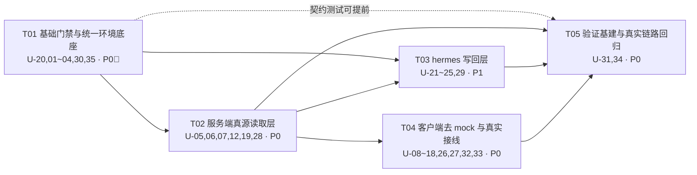

# 技术方案：kmaster-studio 回归 hermes-agent 加强客户端（hermes-native）

| 项目 | 内容 |
|---|---|
| 文档编号 | TECHNICAL-SOLUTION-hermes-native |
| 版本 | **v2.0**（对齐 PRD v2 `d32eebe`，并追加 real-bridge 在线取证） |
| 作者 | 架构师 Bob（software-architect） |
| 日期 | 2026-08-05 |
| 上游输入 | `docs/design/hermes-native-prd.md` **v2**（PM 许清楚）、`docs/qa/HEALTH-CHECK-2026-08-05.md`（QA 严过关） |
| 方法论 | ddd-skill 场景 B（PROJECT-UPGRADE） + plan-first |
| 配套产物 | `docs/design/class-diagram-hermes-native.mermaid`、`docs/design/sequence-diagram-hermes-native.mermaid` |
| 实测环境 | Windows，`HERMES_HOME=C:\Users\towyq\AppData\Local\hermes`，hermes 已安装并运行过 gateway |

> **本文档的所有数字均为本机实测取证，不引用上游文档的转述值。**
> 凡与 PRD / QA 报告数字不一致处，均在正文标注「⚠️ 修正」并给出取证命令。

### v2.0 修订说明（相对 v1.0）

v1.0 完成后，PM 提交了 PRD v2（commit `d32eebe`）；架构侧同时对**正在运行的 real-bridge**（16765 端口在线）做了一次在线探针，取得 v1.0 时不掌握的实证。两者共同触发以下修订：

| # | 修订项 | 来源 | 影响面 |
|---|---|---|---|
| R-1 | **HN-P018 删除**（RealBridge socket 泄漏经 D-06 证伪） | PRD v2 | §6 任务清单 −1 项；P0 口径 19 条 |
| R-2 | **HN-P000 正式拆为 P000a（门禁）/ P000b（反转）** | PRD v2 | 与 v1.0 自行拆分一致，编号对齐 |
| R-3 | **Q-3 定案为 junction（非 symlink）**，跨盘退化为复制 | PRD v2 | §5.3、§7.3、决策 D-D 表述修正 |
| R-4 | **新增 Q-9 裁定**：bridge 集成方式（ACP stdio vs 直接 import） | PRD v2 指名架构师裁定 | 新增 §1.6 |
| R-5 | **新增 Q-10 裁定**：`HERMES_AGENT_ROOT` 解析权归属 | PRD v2 指名架构师裁定 | 新增 §1.7、§2.2 扩展 |
| R-6 | 🚨 **新增 D-29 幽灵 `HERMES_HOME`（在线探针发现，PRD/QA 均未覆盖）** | 架构侧在线取证 | 新增 §1.8，列为 P0 最高危、P000a 门禁前置 |
| R-7 | **C1 裁定补强**：「0」不只是 QA 的测量假象，**运行中的 worker 自身也真实为 0** | 架构侧在线取证 | §1.3 补充第二根因 |
| R-8 | **C2 裁定补强**：会话存储实为**三处**分裂（非两处） | 架构侧在线取证 | §1.4 修正 |
| R-9 | bridge 拓扑修正：16765 之后**还有一跳** per-profile worker | 架构侧在线取证 | §1.6、§5 时序 |

---

## §0 前置裁定（本方案的不可动摇约束）

### 0.1 主理人四条决策（已固化为设计约束）

| # | 决策 | 本方案落点 |
|---|---|---|
| **D-A** | 范围 = PRD **P0 + P1 全量** | §6 统一条目 U-01 ~ U-35（含 QA 增量）。最终口径：P0 **20**（P000a/b + P001~P018）+ P1 **7**（P101~P107）= **27** 条。「24」是 P000 拆分前的旧数字，已作废。P018 为主理人 git 取证的回归护栏（修复前 bridge.ts chat() 309-332 行无 sock.destroy()），保留。 |
| **D-B** | Agent 角色载体 = 新建 `$HERMES_HOME/agents/*.md`（front-matter 承载 `skills[]`/`mcp[]`/`specialties[]`，正文 = `agentMd`） | §4.2 完整 Schema、§4.3 与 `config.yaml` `agent.personalities` 的关系、§4.4 从 `km.v3.agentRoles` 的迁移路径 |
| **D-C** | 专家团 = 保留为**客户端编排概念**；`members[]` 必须引用真实 Agent id；成员在 hermes 侧失效 → UI 红标 | §4.5 `ExpertTeam` 结构 + `memberHealth` 校验 |
| **D-D** | 技能装卸 = symlink 优先，junction 兜底；须先实测 Windows 免管理员可行性 | ⚠️ **v2 修正为 junction 优先**。实测两者在本机均免管理员可用（§7.3），但 PRD v2 Q-3 查明 hermes 自带 `sync-skills-links.sh` 用的就是 `New-Item -ItemType Junction`。**与既有惯例一致优先于个人偏好**，故定为 junction 优先、跨盘退化为复制；symlink 不再作为主路径。§5.3 时序图同步调整 |

### 0.2 上游矛盾与新增裁定的结论（速览）

| 矛盾 | PM 说法 | QA 说法 | **架构裁定** |
|---|---|---|---|
| **C1 技能数** | 47 | 161（且 `get_available_skills()` 实测 **0**） | **权威值 = 161**（正确配置下的 hermes API 返回值）。47 = 顶层技能包目录数（真实但语义不同）。⚠️ **v2 补强**：「0」并非只是 QA 的测量假象——**当前运行中的 bridge worker 自身实测也是 0**，因其 `HERMES_HOME` 被污染为幽灵路径（D-29）。两者根因同一：POSIX 路径未规范化。详见 §1.3 / §1.8 |
| **C2 会话真源** | `/api/sessions` 已真连 hermes `state.db` | 读的是 kmaster 自建 SQLite，返回 10 条 | **PM 说法证伪**。`/api/sessions` 零 `state.db` 引用。⚠️ **v2 修正**：分裂不是两处而是**三处**（真实 `state.db` 37/8173、幽灵 `state.db` 3/6、`kmaster.db` 10）。设计为「hermes `state.db` 主源 + `kmaster.db` 仅增强字段」，幽灵源须先由 D-29 消灭。详见 §1.4 |
| **C3 已真连端点** | 23 个端点已真连 | `/api/skills` 实际返回 6 条假数据 | **「代码已接线」≠「数据真可用」**。引入**双状态标注**：`wiring`（接线态）与 `liveness`（可用态）互相独立。详见 §1.5 |

**PRD v2 新增的两道架构裁定题**（PM 已在 PRD 中指名由架构师裁定）：

| 题号 | 问题 | **架构裁定** |
|---|---|---|
| **Q-9** | bridge 与 hermes-agent 的集成方式：ACP stdio subprocess 还是直接 import？ | **维持直接 import，不迁移 ACP stdio**（本轮）。在线探针证明该路径**已真实跑通**：worker 正确解析出 `agent_root` 并持有 3 个活跃会话。需求文档 `REQUIREMENT-kmaster-bridge.md:157` 要求替换的前提是「未验证可 import」，该前提**已被证据推翻**，应回写需求文档而非改架构。详见 §1.6 |
| **Q-10** | `HERMES_AGENT_ROOT` 由谁解析？ | **Node 单点解析 + 显式传参 + 握手断言**三件套，而非单纯「注入」。因 kmaster-server **不 spawn** bridge，注入在手动启动场景下物理上不可达；故必须以 `ping` 握手做**一致性断言**兜底。所幸 worker 的 `ping` **已返回** `agent_root`/`hermes_home`/`profile`，**零协议改动**即可实施。详见 §1.7 |

---

## §1 架构总览与真源裁定

### 1.1 数据主权分层契约

本次升级的**唯一架构主张**：

> **hermes 是全部业务数据的唯一真源（Single Source of Truth）；kmaster-studio 是它的视图层与编排层，只拥有「纯 UI 增强字段」的主权。**

```
┌─────────────────────────────────────────────────────────────┐
│  kmaster-client (Vue)   —— 视图层，零业务真源                  │
│    · DataSourceState 五态（live/loading/empty/error/offline） │
│    · localStorage 仅作「离线缓存 + 展示顺序」，永不冒充真源       │
└───────────────────────────┬─────────────────────────────────┘
                            │ HTTP / Socket.IO
┌───────────────────────────▼─────────────────────────────────┐
│  kmaster-server (Koa)   —— 适配层，唯一 hermes 解析权          │
│    · hermes-env.ts   ：环境解析唯一入口（§2）                  │
│    · hermes-read/*   ：读路径（file-direct 优先，CLI 兜底）     │
│    · hermes-write/*  ：写路径（CLI 优先，file-direct + 锁兜底） │
│    · kmaster.db      ：仅存增强字段（workspace/pin/fold）      │
└───────────────────────────┬─────────────────────────────────┘
        file-direct 读 ┃ CLI/gateway 写 ┃ TCP 16765 对话
┌───────────────────────────▼─────────────────────────────────┐
│  $HERMES_HOME  —— 真源                                        │
│   config.yaml │ auth.json │ state.db │ skills/ │ agents/(新)  │
│   cron/jobs.json │ logs/*.log │ memories/ │ gateway_state.json│
└─────────────────────────────────────────────────────────────┘
```

**分层契约的三条硬规则：**

1. **读：file-direct 优先。** 凡 hermes 侧以「稳定磁盘格式」落地的数据（`config.yaml`、`state.db`、`cron/jobs.json`、`logs/*.log`、`.skills_prompt_snapshot.json`），一律直读，**不 spawn Python**。理由见 §1.3——`runPython` 是 D-02 的根因，且启动成本高、失败模式不可观测。
2. **写：hermes CLI / gateway 优先。** 凡涉及 hermes 内部一致性的写入（provider 凭据、profile 切换），走 CLI；CLI 不覆盖的（`agents/*.md`、`skills/` 装卸、`cron/jobs.json`），走 file-direct + 备份 + 锁 + 回读校验（§8.4）。
3. **对话：只走 Bridge。** TCP `127.0.0.1:16765`，不复制 hermes 的 agent 循环逻辑。

### 1.2 本机真源资产实测清单（取证基线）

| 资产 | 路径 | 实测值 | 取证 |
|---|---|---|---|
| 配置 | `config.yaml` | 11314 B，`_config_version: 32` | `ls -la` |
| 配置备份 | `config.yaml.bak`、`config.yaml.corrupt.20260717-195724.bak` | **均存在** → 损坏历史确凿 | `ls -la` |
| Agent 人格 | `config.yaml: agent.personalities` | **14 条** ⚠️ 修正（PRD 记 16） | `yaml.safe_load` 计数 |
| MCP | `config.yaml: mcp_servers` | 5 条 | 同上 |
| Provider | `config.yaml: custom_providers` | 7 条 | 同上 |
| 默认模型 | `config.yaml: model.default` | `glm-5.2` | 同上 |
| 会话库 | `state.db` | 90 MB + 3.2 MB WAL；**sessions 35 / messages 8083 / session_model_usage 38** | better-sqlite3 只读打开实测 |
| 技能（已装） | `skills/` | 顶层 `ls -1` = **47**，`ls -1A` = 54 | §1.3 |
| 技能（可用） | hermes API | **161** | §1.3 |
| 技能快照 | `.skills_prompt_snapshot.json` | 102 KB，`manifest` 191 / `skills` 174 / `category_descriptions` 16 | §1.3 |
| 技能候选池 | `hermes-agent/optional-skills/` | 20 | `ls \| wc -l` |
| 内置技能 | `hermes-agent/skills/` | 18 | 同上 |
| MCP 候选池 | `hermes-agent/optional-mcps/` | 3 | 同上 |
| Agent 载体 | `agents/` | **不存在**（本次新建，符合 D-B） | `ls` → No such file |
| Gateway | `gateway_state.json` | `pid 48564`，**该进程实测已不存在** | `tasklist` 空 |
| 会话 dump | `sessions/` | 28 个 `request_dump_*.json`，时间戳止于 2026-06-30 | §1.4 |
| kmaster 自建库 | `~/.kmaster-studio/kmaster.db` | sessions **10** 条 | §1.4 |

---

### 1.3 C1 裁定：技能数量 47 / 161 / 0 的完整算术闭环

#### 裁定结论

> **权威枚举口径 = hermes 的 `_find_all_skills()` / `get_available_skills()`，本机结果 = 161。**
> **`/api/skills` 应返回这 161 条「单体技能」。** 47 是「顶层技能包目录数」，是另一个合法但不同的语义，应作为 `packageCount` 单独暴露，**不得**用于替代 161。

#### 完整算术链（全部实测，逐级可复算）

```
$HERMES_HOME/.skills_prompt_snapshot.json  (hermes 自己生成的权威快照)
├─ manifest         191 个文件条目
│    ├─ SKILL.md          174   ← 每个 = 一个单体技能
│    └─ DESCRIPTION.md     17   ← 分类描述文件，非技能
│
├─ skills[]         174 条
│    ├─ 平台门控 platforms[] 排除 11 条 ────────────► 163
│    │    apple-notes / apple-reminders / findmy / imessage   (macos)
│    │    lm-evaluation-harness / vllm / audiocraft            (linux,macos)
│    │    research-paper-writing / xurl / python-debugpy       (linux,macos)
│    │    windows-software-manager                             (linux)
│    │
│    └─ 条件门控 conditions 排除 2 条 ──────────────► 161  ★权威值
│         mcp-manager  requires_toolsets=[terminal,web,skills]
│         maps         requires_toolsets=[terminal]
│
└─ category_descriptions  16

$HERMES_HOME/skills/  顶层
├─ ls -1   = 47   ★PM 的「47」= 此值（42 真实目录 + 符号链接等）
└─ ls -1A  = 54   （含 .webui-managed-skills.json 等点文件）

hermes venv 实测 _find_all_skills() → 161  ✓ 与快照链完全吻合
```

#### QA 的「0」是测量假象——根因定位

QA 报告中 `get_available_skills()` 返回 0，我**成功复现并定位了根因**：

```bash
# ❌ 复现 QA 的 0（Git Bash / MSYS2 会把 Windows 路径改写为 POSIX 形式）
HERMES_HOME="/c/Users/towyq/AppData/Local/hermes" python -c "..."
#   → get_available_skills() = dict(0)
#   → _find_all_skills()     = list(0)

# ✅ 正确测量（原生 Windows 路径 + 关闭 MSYS 路径转换）
MSYS_NO_PATHCONV=1 HERMES_HOME='C:\Users\towyq\AppData\Local\hermes' python -c "..."
#   → get_available_skills() = 161
#   → _find_all_skills()     = 161
```

**结论：hermes 的技能枚举功能完全正常。** 给定正确的原生路径，枚举结果稳定为 161。

#### ⚠️ v2 重大补正：「0」不只是测量假象，它同时是**真实的运行时状态**

v1.0 在此处写的是「QA 的 0 属测量环境缺陷，不是产品缺陷」。**这个判断只对了一半，现予以补正。**

v2 的在线探针发现：**当前正在运行的 bridge worker，自身的 `HERMES_HOME` 就是被污染的 `C:\c\Users\...`**（D-29，§1.8）。该幽灵目录下：

```
.skills_prompt_snapshot.json  ->  {"manifest":{}, "skills":[], "category_descriptions":{}}
skills/                       ->  空目录
```

**也就是说，worker 眼中的技能数就是 0 —— 不是测量出来的 0，是它真的看不见任何技能。**

| 发生地 | 触发者 | 影响面 | 定性 |
|---|---|---|---|
| QA 的 shell | QA 手输 `HERMES_HOME=/c/...` | 一次测量 | 测量环境缺陷（v1.0 判断正确） |
| **运行中的 worker** | 启动命令 `--hermes-home /c/...` | **每一次真实对话** | **产品缺陷**（v1.0 判断遗漏） |

**同一根因（POSIX 路径未规范化），两个发生地。** 我此前只看到了前者。

**对设计的直接影响**：`/api/skills` 即便完全按本节改成真连，只要 bridge 还挂在幽灵 home 上，**技能页面依然会是空的**。因此 **U-05（删 SNAPSHOT）必须与 U-20（灭幽灵）配对交付**，否则等于把「6 条假技能」换成「0 条真技能」，用户体验不升反降。

→ 该补正已回传 QA 严过关（原「测量假象」结论需收回一半）；同时确立 **SC-13 跨进程路径规范化**红线。

#### ★ 增量重大发现：`skills/` 目录已存在两套并存的安装惯例

实测 `$HERMES_HOME/skills/` 内部：

| 惯例 | 证据 | 数量 |
|---|---|---|
| **符号链接安装** | 7 个 symlink，指向 `C:\Users\towyq\.agents\skills\*`，创建于 07-23 | agentmemory-{agents,architecture,config,hooks,mcp-tools,rest-api} + session-history |
| **复制安装 + 清单** | `.webui-managed-skills.json`，`owner: "hermes-web-ui"`，登记 5 个复制安装的技能 | 5 |

**设计含义（两条，均写入方案）：**
1. **symlink 装卸机制不是全新发明——它在本机已经真实工作了两周**（hermes 自己的 API 能正常枚举到这 7 个 symlink 技能，且计入 161）。D-D 决策有既成事实背书，风险大幅降低。
2. **必须与 `hermes-web-ui` 的清单惯例互操作**：kmaster 采用同构清单 `.kmaster-managed-skills.json`，且**装卸前必须读取对方清单，禁止触碰 `owner != "kmaster-studio"` 的条目**（§8.5 约定 SC-9）。这是避免两个客户端互删对方技能的关键护栏。

#### `/api/skills` 契约裁定

```jsonc
GET /api/skills  →  200
{
  "state": "live",
  "source": "snapshot" | "api",      // 快照直读 or Python API
  "skills": [ /* 161 条 SkillDescriptor */ ],
  "counts": {
    "available": 161,   // 权威：平台+条件门控后可用
    "declared":  174,   // 快照声明总数
    "packages":  47,    // $HERMES_HOME/skills/ 顶层包数（= PM 的 47）
    "excludedByPlatform": 11,
    "excludedByCondition": 2
  },
  "snapshotAt": "2026-08-05T10:29:00+08:00"
}
```

- **默认读路径 = 直读 `.skills_prompt_snapshot.json`**（file-direct，毫秒级，无 Python 依赖）；
- **兜底 = `runPython` 调 `_find_all_skills()`**（修好 cwd/解释器后）；
- 快照 `mtime` 早于 `skills/` 目录 `mtime` 时标 `stale`，**触发一次后台 Python 刷新**，但**绝不返回假数据**；
- 验收保留 PRD HN-P003 原文：断言含 `research` / `ddd-skill` / `quant-data`，断言**不含** `summarize` / `pdf-extract` / `data-clean`。

---

### 1.4 C2 裁定：会话真源

#### 裁定结论

> **PM 的「`/api/sessions` 已真连 hermes `state.db`」为不实描述，予以证伪。**
> 目标态：**hermes `state.db` 为主源，`kmaster.db` 降级为「仅增强字段」侧表。**
>
> ⚠️ **v2 修正：分裂不是两处，而是三处。** 在线探针发现第三个会话库 —— 幽灵 `state.db`（D-29，§1.8）：

| # | 存储 | 实测规模（2026-08-05 11:40） | 定性 | 处置 |
|---|---|---|---|---|
| 1 | `C:\Users\...\hermes\state.db` | **37 会话 / 8173 消息** | 唯一合法真源 | 主源 |
| 2 | `~/.kmaster-studio/kmaster.db` | 10 会话 | 自建库，`/api/sessions` 当前读它 | 降级为增强字段侧表 |
| 3 | `C:\c\Users\...\hermes\state.db` | **3 会话 / 6 消息**（WAL 1 MB，**探测时仍在写**） | 幽灵库，当前所有活跃对话写在这里 | **U-20 消灭 + 数据处置待裁定（O-10）** |

> **含义**：`/api/sessions` 改接 `state.db` 之后，用户仍会发现「刚聊的那几句不在列表里」—— 因为它们进了幽灵库。**C2 与 D-29 必须一起修，单修任一个都得不到自洽的会话视图。**

#### 取证

**证据 1 —— `/api/sessions` 的实际实现（`packages/server/src/routes/sessions.ts`）：**
```ts
router.get('/api/sessions', async (ctx) => {
  const store = await db();                    // ← kmaster.db
  ctx.body = { sessions: store.listSessions() };
});
```
全文件对 `state.db` 的引用数 = **0**。

**证据 2 —— `packages/server/src/db.ts`：** `kmaster.db` 位于 `KMASTER_HOME ?? ~/.kmaster-studio/kmaster.db`，自建 schema `sessions(id,title,profile,created_at,updated_at,archived,mode,model,workspace)`。实测 **10 条**。

**证据 3 —— hermes `state.db` 实测**（better-sqlite3 只读打开成功）：v1.0 测得 `sessions 35 / messages 8083 / session_model_usage 38`；v2 复测 **`sessions 37 / messages 8173`**。
⚠️ 修正：QA 记 34/8081。三次测量逐次增长属正常业务写入。**结论不受影响，但由此确立一条纪律：会话数是动态值，验收断言必须写「与 `state.db` 实际一致」而非写死数字**（已落入 T02 完成判据）。

**证据 4 —— `sessions/` 目录定性：** 28 个文件全部为 `request_dump_*.json`，最新时间戳止于 **2026-06-30**，此后 `state.db` 持续增长。**判定：调试转储残留，非真源，不纳入数据链路**（可在诊断页作为「历史转储」只读展示，或直接忽略）。

#### 目标设计：主源 + 增强字段合并

| 字段 | 主权归属 | 说明 |
|---|---|---|
| `id` / `title` / `started_at` / `ended_at` / `model` / `message_count` | **hermes `state.db`** | 只读。⚠️ `title` 在 hermes 侧 29/37 非空，kmaster 当前也写了一份自己的 → 双真源，必须切到只读 hermes，迁移 kmaster 历史 title → hermes `state.db` 或放弃 |
| `archived` | **hermes `state.db`** | hermes 侧 37/37 非空。kmaster 当前也存了一份 ← 双真源。切为只读 hermes，kmaster 废弃自建字段 |
| `pinned` | **hermes `state.db`** | hermes 侧 37/37 非空。kmaster.db 的 sessions 表**无此列**——当前 UI 置顶功能是纯本地态。新增读取 hermes 侧 pinned，kmaster 不再自建 |
| `display_name` | hermes 有列但 0/37 全空 → **忽略**，不接 | — |
| `cwd` / `git_repo_root` / `git_branch` | **hermes `state.db`** | kmaster 的 `workspace` 字段语义等价于 hermes `cwd`，不是「kmaster 增强字段」→ 废弃 kmaster 自建 `workspace`，改为直接读取 hermes `cwd` |
| `profile` | ⚠️ **例外** | hermes 有 `profile_name` 列但 0/37 全空（hermes 自己没在写）。不能按 P-1 判给 hermes，否则切 profile 读到全 NULL。列为「hermes 预留字段 / 当前由 kmaster 承载」 |
| `mode` | kmaster.db | ✅ 唯一合法的 kmaster 增强字段（hermes 无等价字段） |

合并规则：**以 `state.db` 的 session 全集为骨架**，`LEFT JOIN` kmaster.db 增强表（key = session id）。
kmaster.db 中存在但 `state.db` 不存在的 id → 标 `orphan: true`，UI 灰显并提供「清理」入口，**不得**混入主列表冒充真实会话。

#### 技术可行性已验证

- `better-sqlite3@^11.8.1` **已是 server 现有依赖**，实测能以 `readonly: true` 打开 hermes `state.db`（90 MB + WAL）并正确读出 35/8083。
- **读路径新增 npm 依赖 = 0**。
- 约定：`readonly: true` + `PRAGMA query_only = 1` + 不持久持有连接（每次请求开/关或短 TTL 池），避免与 hermes 进程争 WAL（§8.3 约定 SC-6）。

---

### 1.5 C3 裁定：「已真连」≠「真可用」——双状态标注模型

#### 裁定结论

> PM 列出的 23 个「已真连」端点，其中至少 2 个在**运行时实际返回硬编码假数据**。
> 因此引入**两个正交状态维度**，任何端点/面板都必须同时标注：

| 维度 | 取值 | 含义 |
|---|---|---|
| `wiring`（接线态） | `wired` / `partial` / `absent` | **代码层面**是否已连向 hermes 真源 |
| `liveness`（可用态） | `live` / `degraded` / `error` / `offline` | **运行时**实际返回的是否为真数据 |

**`wiring: wired` 且 `liveness: degraded` 是最危险的组合**——正是 D-02 潜伏至今的形态。本方案要求该组合**必须**在 `/api/hermes/probe` 的 `degradedSources[]` 中显式列出，并在 UI 状态栏亮黄标。

#### 关键端点双状态实测基线

| 端点 | wiring | liveness（当前） | 根因 | 目标 |
|---|---|---|---|---|
| `/api/skills` | wired | **degraded** | `runPython` 缺 cwd → `ModuleNotFoundError` → 静默落 `SKILLS_SNAPSHOT`(6 条) | live(161) |
| `/api/models` | wired | **degraded** | 同上 → `MODELS_SNAPSHOT`(5 条假模型，且 `authenticated: true` 硬编码) | live |
| `/api/mcp` | wired | live(5) | 直读 `config.yaml` | 保持 |
| `/api/sessions` | **partial** | live 但**真源错误** | 读 kmaster.db | 改主源为 state.db |
| `/api/memory` | wired | live | — | 补沙箱假数据清除(D-26) |
| `/api/jobs` | wired | live | — | 补沙箱假数据清除(D-26) |
| `/api/usage/stats` | wired | live(38) | — | 保持 |
| `/api/settings` | wired | live | — | 保持 |
| `/api/agents` | **absent** | — | 路由不存在 | 新建（§4.2） |
| `/api/logs` | **absent** | — | 路由不存在，前端恒 `mockEntries()` | 新建 |
| `/api/hermes/probe` | **absent** | — | 不存在 | 新建 |
| `/api/fs/read` | **absent** | — | 不存在，preload 也缺 4 个方法 | 新建 + 白名单 |

**硬性要求：`SKILLS_SNAPSHOT` 与 `MODELS_SNAPSHOT` 两个常量必须被物理删除**，而非「保留但不用」。CI 增加源码扫描红线（§9.2）。

---

### 1.6 Q-9 裁定：bridge 集成方式 —— 维持直接 import，回写需求文档

#### 裁定结论

**不迁移 ACP stdio。维持 `sys.path.insert` + 直接 import，并把「已验证可 import」这一事实回写 `REQUIREMENT-kmaster-bridge.md`。**

#### 裁定依据（在线探针实证，2026-08-05）

`REQUIREMENT-kmaster-bridge.md:157` 要求迁移 ACP stdio，其**唯一论据**是括号里那句「直接 `from run_agent import AIAgent`（**未验证可 import**）」。这条论据现已被证据推翻：

```
$ node tmp2/probe-bridge-ping.mjs        # → 127.0.0.1:16765
{"type":"result","ok":true,"data":{"pong":true,"mode":"broker","broker":{"pid":10836},
 "workers":{"default":true},"active_sessions":3,"sessions_by_profile":{"default":3}}}

$ node tmp2/probe-worker-ping.mjs        # → 127.0.0.1:17567
{"ok":true,"pong":true,"pid":59920,
 "agent_root":"C:\\Users\\towyq\\AppData\\Local\\hermes\\hermes-agent",
 "profile":"default","session_count":3,"running_session_count":0}
```

worker 进程**活着**、`agent_root` **解析正确**、**持有 3 个会话**。`_ensure_agent_imports()`（`bridge_runtime.py:479`）的 `sys.path.insert` 路径若不可 import，worker 根本起不来。**「未验证」的前提消失了，「须替换」的结论也就不成立。**

#### 为什么不趁机迁移

1. **迁移不解决任何在办问题**。本轮 P0 的痛点是「假数据 / 幽灵路径 / 状态不诚实」，没有一条源于集成方式。
2. **ACP stdio 会引入新问题**。`CONCURRENCY-DESKTOP-WEB.md` F11 已指出 ACP stdio 是「一客户端一进程、天然一对一」，而现网拓扑是 broker 多路复用 + per-profile worker（见下）。迁移等于同时重做并发模型，与「不推翻既有骨架」的约束冲突。
3. **成本落在错误的地方**。真正该花的力气是 D-29 与 P000a 门禁。

#### ⚠️ 拓扑修正：16765 之后还有一跳（PRD 与 QA 均未覆盖）

PRD v2 称「中间那一跳是我们自己的代码」。实测是**两跳**：

```
Node (bridge.ts)
  └─TCP 16765─> broker      pid 10836   (bridge_broker.py，多路复用/按 profile 路由)
        └─TCP 17567─> worker pid 59920   (bridge_server.py，per-profile)
              └─ sys.path.insert + import ─> hermes-agent (run_agent.py)
```

进程树实测 `19684 → 10836(broker) → 63272 → 59920(worker)`，**四层**。两处衍生风险：

- **broker 的 worker 登记表失准**：broker 自报 `worker_details.default.pid = 63272`，但 17567 的实际持有者是 **59920**（63272 是中间启动器）。**broker 记的是它直接 fork 的子进程，不是真正持 socket 的那个**。按 pid 杀 worker 会杀错对象、留下孤儿 —— 这正是 **D-28「gateway taskkill 后残留 worker」**的具体机理，比 QA 描述的更精确。
- **解释器在链路中途切换**：63272 用 `hermes-agent\venv\Scripts\python.exe`，59920 用 `uv\python\cpython-3.11.11`。**父子两级 site-packages 不同**，`import run_agent` 成功与否取决于最后那一级。这条必须写进 P000a 门禁的记录项。

#### 落地要求

| 项 | 要求 |
|---|---|
| 文档回写 | 在 `REQUIREMENT-kmaster-bridge.md:157` 就地标注「✅ 2026-08-05 在线探针证明可 import，ACP stdio 迁移取消」，并附探针输出。**不留悬空需求** |
| 拓扑回写 | PRD v2 §2.1.2 的「一跳」表述订正为「两跳 + 四层进程树」 |
| D-28 修法 | 杀进程不得只按 broker 登记的 pid，须**按端口反查实际持有者**（`netstat -ano` → pid）或**按进程树递归终止** |
| 门禁记录 | P000a 须额外记录：broker pid / worker pid / worker 端口 / **worker 实际使用的 python 解释器路径** |

---

### 1.7 Q-10 裁定：`HERMES_AGENT_ROOT` 解析权 —— 单点解析 + 显式传参 + 握手断言

#### 裁定结论

**三件套，缺一不可：**

1. **单点解析**：Node 侧 `hermes/env.ts` 是**唯一**解析权威（承 M5 §4.1.1）。
2. **显式传参**：Node 若 spawn bridge，必须显式传 `--agent-root` / `--hermes-home`（**两个 CLI 参数已存在**，`kmaster_bridge.py:73-74`），禁止依赖 Python 侧 `_find_agent_root()` 自动发现。
3. **握手断言**：Node **不 spawn** 的场景（现状即是）无法注入，故必须以 `ping` 握手做一致性校验；不一致即进 S4 错误态并显示双方路径，**不得静默继续**。

#### 为什么单靠「注入」不够 —— PRD 建议的物理不可达之处

PRD v2 Q-10 建议「由 Node 解析后显式注入 `HERMES_AGENT_ROOT` 给 bridge」。但 PRD 自己在 §2.1.2 第 3 点也写明：**kmaster-server 从不 spawn 这个 bridge，用户须手动启动**。

**你无法向一个不是你启动的进程注入环境变量。** 两条建议放在一起是自相矛盾的。真实可行的组合只能是：

| 场景 | 手段 | 状态 |
|---|---|---|
| Node spawn bridge（未来 / 桌面托管模式） | `--agent-root` / `--hermes-home` 显式传参 | CLI 参数已具备，可直接用 |
| 用户手动启动（**当前现状**） | `ping` 握手断言 + 不一致时 S4 报错 | **worker 的 `ping` 已返回三元组，零协议改动** |

#### 握手断言的现成能力

`bridge_server.py:163-181` 的 `ping` 已返回：

```json
{"ok":true,"pong":true,"pid":59920,
 "agent_root":"C:\\Users\\towyq\\AppData\\Local\\hermes\\hermes-agent",
 "profile":"default","hermes_home":"...","session_count":3}
```

Node 只需比对三项即可，**无需扩展 bridge 协议**：

| 断言 | Node 侧期望值 | bridge 侧实测值 | 不一致时 |
|---|---|---|---|
| `agent_root` | `env.agentDir` | worker `ping.agent_root` | S4 + 双路径对照 |
| `hermes_home` | `env.activeHome` | worker `ping.hermes_home` | **S4 + D-29 幽灵路径告警** |
| `profile` | 当前 active profile | worker `ping.profile` | S4 + 提示重启 bridge |

> ⚠️ **broker 的 ping 不含这三项**（只有 `mode`/`workers`/`active_sessions`）。断言必须打到 **worker 端口**（从 broker ping 的 `worker_details[profile].endpoint` 取），这是两跳拓扑的直接后果。

#### 三个同义变量的收敛规则（HN-P001⑦）

| 变量 | 谁读 | 收敛后地位 |
|---|---|---|
| `HERMES_AGENT_DIR` | Node（优先级链首位） | **对外唯一入口**，用户只需配这个 |
| `HERMES_WEBUI_AGENT_DIR` | Node（次位，本机已设） | 兼容保留，`env.ts` 内部消化 |
| `HERMES_AGENT_ROOT` | **仅 Python bridge** | 降级为**派生量**：由 Node 解析结果导出，不再作为独立配置项；用户手动启动时由启动脚本从 `/api/hermes/probe` 取值 |

---

### 1.8 🚨 D-29（新增高危）：幽灵 `HERMES_HOME` —— 运行时数据分裂

> **本缺陷 PRD 与 QA 报告均未覆盖，由架构侧在线探针发现，且在探测当下仍在持续写入。**
> **定级：P0 最高危，且必须先于 HN-P000a 门禁修复**（否则门禁跑出来的对话会写进幽灵库，验收结论无效）。

#### 现象

运行中的 worker 自报：

```
"hermes_home": "C:\\c\\Users\\towyq\\AppData\\Local\\hermes"
                    ^^^ 多出来的 c\
```

该目录**真实存在于磁盘**，且是一个**功能完整的平行 hermes home**：

```
C:\c\Users\towyq\AppData\Local\hermes\
├── .skills_prompt_snapshot.json   88 B   {"manifest":{},"skills":[],...}  ← 空快照
├── skills/                        空
├── state.db                       sessions=3  messages=6
├── state.db-wal                   1,095,952 B                            ← 正在写
├── auth.json / auth.lock          680 B
├── models_dev_cache.json          3.5 MB
└── SOUL.md / cron/ / hooks/ / memories/ / logs/ / sessions/
```

创建于 11:22，探测时 11:38 仍在写入。对照真实 home：

| 指标 | 幽灵 `C:\c\Users\...` | 真实 `C:\Users\...` |
|---|---|---|
| `skills/` | **空** | 47 个技能包 |
| 快照 `skills[]` | **0** | 174（可用 161） |
| `state.db` sessions / messages | **3 / 6** | **37 / 8173** |

broker 自报 `active_sessions: 3` —— **与幽灵库的 3 条完全吻合**，证明当前所有活跃会话都写在幽灵库里。

#### 根因（已钉死到行）

进程命令行实测：

```
kmaster_bridge.py --agent-root /c/Users/towyq/AppData/Local/hermes/hermes-agent
                  --hermes-home /c/Users/towyq/AppData/Local/hermes
```

启动者从 Git Bash 传入了 **MSYS POSIX 风格路径**。随后两个解析函数的**行为不对称**造成了单边污染：

| 函数 | 位置 | 行为 | 结果 |
|---|---|---|---|
| `_discover_agent_root()` | `bridge_runtime.py:310` | 遍历 17 个候选，**以 `run_agent.py` 是否存在为准**，不存在就继续找 | POSIX 路径不命中 → 回退到 `shutil.which("hermes")` → **侥幸解析正确** ✅ |
| `_discover_hermes_home()` | `bridge_runtime.py:321` | `Path(raw).expanduser().resolve()`，**无存在性校验、无回退** | `/c/Users/...` → `C:\c\Users\...` → **静默造出幽灵目录** ❌ |

**Bug 的本质是这个不对称**：一个校验并回退，另一个盲信并 `.resolve()`。而 hermes 侧代码遇到不存在的 home 会**自动创建**，于是错误路径被「坐实」为一个真目录，再也不会报错。

#### 与 C1 的关系（v1.0 结论补强）

v1.0 断定 QA 的 `get_available_skills() = 0` 是「测量假象」。**这个判断对 QA 的命令是对的，但不完整**：

- QA 的 0 —— 由 QA 自己 shell 里的 `HERMES_HOME=/c/...` 造成（测量层）
- **worker 的 0** —— 由 worker 进程里的幽灵 home 造成（**运行层，真实用户可感知**）

**同一根因（POSIX 路径未规范化），两个发生地。**前者只影响一次测量，后者影响每一次真实对话。因此 `/api/skills` 即便改成真连，只要 bridge 还挂在幽灵 home 上，用户看到的**依然是 0 个技能**。

> 📌 **对 QA 的更正**：架构侧此前告知「0 是测量假象」的说法**需要收回一半**。0 是真实存在的运行时状态，QA 的观察没有错，只是我们当时都不知道它是被幽灵 home 触发的。已同步 QA。

#### 修复要求（U-36，P0，前置于 P000a）

| # | 要求 |
|---|---|
| 1 | **Node 侧规范化**：`env.ts` 新增 `normalizeHostPath()`，把 `/c/...`、`/mnt/c/...`、`C:/...` 一律规整为原生 `C:\...`；所有对外传参（CLI / env / 子进程）出口统一过一遍。见 SC-13 |
| 2 | **Python 侧对称化**：`_discover_hermes_home()` 补齐存在性校验 + 候选回退，与 `_discover_agent_root()` 行为一致；**校验失败必须抛错，禁止静默创建** |
| 3 | **握手断言**：Node 比对 worker `ping.hermes_home` 与 `env.activeHome`，不一致进 S4（§1.7） |
| 4 | **幽灵检测器**：`/api/hermes/probe` 增加 `ghostHomeDetected` 字段，扫描 `<drive>:\c\Users\...` 等已知污染形态并在 UI 显著告警 |
| 5 | **数据处置**：幽灵库 3 条会话须由主理人裁定「迁移合并 / 直接丢弃」（O-10），**工程师不得自行删除用户数据** |
| 6 | **回归护栏**：单测覆盖 POSIX/UNC/相对路径三类输入；CI 断言仓库内不出现裸 `Path(raw).resolve()` 式 home 解析 |

---

## §2 hermes 环境解析统一入口

### 2.1 现状问题（D-27 实证）

`hermes-proxy.ts` 同时存在三个解析函数：

| 函数 | 语义 | 返回 |
|---|---|---|
| `resolveHermesHome()` | **根** home | `HERMES_HOME` → `LOCALAPPDATA/hermes` → `~/.hermes` |
| `resolveHermesRoot()` | 同上（别名） | 同上 |
| `resolveActiveHermesHome()` | **profile 感知** | `active === 'default' ? root : root/profiles/<active>` |

**5 处应用 activeHome 却误用了 root（D-27，逐行取证）：**

| 行号 | 函数 | 影响 |
|---|---|---|
| `hermes-proxy.ts:305` | `configPath` | 非 default profile 下**读错 config.yaml** |
| `hermes-proxy.ts:316` | `writeConfig` | 非 default profile 下**把配置写进根 home → 数据串档** 🔴 |
| `hermes-proxy.ts:379` | `memoriesDir` | 记忆库读错 profile |
| `hermes-proxy.ts:633` | `resolveHermesBin` | CLI 定位可能错 |
| `hermes-proxy.ts:697` | `cronContext` | 定时任务读写错 profile |

其中 `writeConfig` 是**数据损坏级**缺陷：在非 default profile 下保存设置，会污染根 profile 的 `config.yaml`。

### 2.2 目标设计：`packages/server/src/hermes/env.ts`（新建，唯一解析权）

```ts
/** hermes 环境解析——全仓唯一入口。任何其他文件禁止直接读 process.env.HERMES_* */
export interface HermesEnv {
  configured: boolean;
  root: string;              // 根 home，仅用于 profiles/ 枚举与 auth.json
  activeProfile: string;     // 'default' | '<name>'
  activeHome: string;        // ★ 一切数据路径的基准
  agentDir: string | null;   // HERMES_AGENT_DIR → HERMES_WEBUI_AGENT_DIR → <activeHome>/hermes-agent
  agentDirSource: 'HERMES_AGENT_DIR' | 'HERMES_WEBUI_AGENT_DIR' | 'fallback' | 'none';
  paths: HermesPaths;        // 全部派生路径，只读冻结
  platform: NodeJS.Platform;
  /** ★ D-29：解析过程中检测到的路径污染，非空即须在 UI 告警 */
  pathAnomalies: PathAnomaly[];
}

/** ★ D-29：路径污染证据 */
export interface PathAnomaly {
  kind: 'posix-on-windows' | 'ghost-home' | 'nonexistent' | 'unc-unsupported';
  variable: string;          // 'HERMES_HOME' | '--hermes-home' | ...
  raw: string;               // '/c/Users/towyq/AppData/Local/hermes'
  normalized: string;        // 'C:\Users\towyq\AppData\Local\hermes'
  severity: 'fatal' | 'warn';
}

export interface HermesPaths {
  configYaml: string;        // activeHome/config.yaml
  configBak: string;         // activeHome/config.yaml.bak
  authJson: string;          // root/auth.json        ← 注意：账号在 root
  stateDb: string;           // activeHome/state.db
  skillsDir: string;         // activeHome/skills
  skillsSnapshot: string;    // activeHome/.skills_prompt_snapshot.json
  agentsDir: string;         // activeHome/agents      ★ 新建载体
  cronJobs: string;          // activeHome/cron/jobs.json
  logsDir: string;           // activeHome/logs        （扁平，非 4 子目录）
  memoriesDir: string;       // activeHome/memories
  gatewayState: string;      // activeHome/gateway_state.json
  managedSkills: string;     // activeHome/.kmaster-managed-skills.json
}
```

**设计要点：**

1. **`resolveHermesHome` / `resolveHermesRoot` 全部标 `@deprecated` 并改为内部私有**；对外只导出 `getHermesEnv()`。所有路径通过 `env.paths.*` 取得，从根上消除 D-27 类缺陷。
2. **`HermesPaths` 一次性构造并 `Object.freeze`**，杜绝「某处忘了用 activeHome」。
3. **`agentDir` 优先级链**（HN-P001）：`HERMES_AGENT_DIR` → `HERMES_WEBUI_AGENT_DIR` → `<activeHome>/hermes-agent` → `none`；记录 `agentDirSource` 供诊断页显示。
4. **消解三变量分歧**（HN-P001⑦ / Q-10 裁定，见 §1.7）：分两种场景，**不能只做注入**——

   ```ts
   /** 场景 A：Node spawn bridge —— 显式传参（CLI 参数已存在） */
   export function bridgeSpawnArgs(env: HermesEnv): string[] {
     return [
       '--agent-root',  normalizeHostPath(env.agentDir!),
       '--hermes-home', normalizeHostPath(env.activeHome),
     ];
   }

   /** 场景 B：用户手动启动（当前现状）—— 握手断言，打 worker 端口而非 broker */
   export interface BridgeIdentity {
     brokerPid: number;
     workerPid: number;
     workerEndpoint: string;   // 从 broker ping 的 worker_details[profile].endpoint 取
     agentRoot: string;
     hermesHome: string;
     profile: string;
   }
   export function assertBridgeConsistency(
     env: HermesEnv, id: BridgeIdentity,
   ): PathAnomaly[];            // 非空 → 进 S4，UI 并排展示 Node 侧 / bridge 侧路径
   ```

   **禁止** Python 侧 `_find_agent_root()` 自动发现作为常规路径（它有 17 个候选、且依赖 `cwd`，同机不同 cwd 会得到不同结果）。实测确认 `HERMES_AGENT_ROOT` 仅在 `bridge_runtime.py` 被引用，改造点单一。

5. **★ 出口路径规范化（D-29 根治，SC-13）**：

   ```ts
   /** 把 POSIX/MSYS/WSL 形式统一为宿主原生形式；Windows 外为恒等变换 */
   export function normalizeHostPath(p: string): string;
   //  /c/Users/x        → C:\Users\x
   //  /mnt/c/Users/x    → C:\Users\x
   //  C:/Users/x        → C:\Users\x
   //  \\?\C:\Users\x    → C:\Users\x
   ```

   **所有跨进程出口**（`hermesChildEnv()` 注入的 env、`bridgeSpawnArgs()` 的 CLI 参数、写入 `config.yaml` 的路径字段）**一律先过 `normalizeHostPath()`**。这是 D-29 幽灵 home 的直接根治点：错误路径在 Node 出口就被规整，Python 侧再怎么盲信 `.resolve()` 也不会造出 `C:\c\...`。

6. **入口异常检测**：`getHermesEnv()` 解析时若发现 `HERMES_HOME` 等变量为 POSIX 形式，除规范化外还须记入 `pathAnomalies`，由 `/api/hermes/probe` 上报、UI 告警。**规范化是补救，不是掩盖——用户必须知道自己的环境变量配错了。**
6. **单测覆盖**：`HERMES_AGENT_DIR` 4 种组合 × `activeProfile` 2 种（default / 非 default），共 8 例；额外 1 例断言「非 default profile 下 `paths.*` 全部平移到 `root/profiles/<name>/`，且 `authJson` 仍在 root」。

---

## §3 文件清单

> 图例：🆕 新建　✏️ 修改　🗑️ 删除内容（文件保留）　❌ 删除文件

### 3.1 服务端 `packages/server/src/`

| 文件 | 动作 | 说明 |
|---|---|---|
| `hermes/env.ts` | 🆕 | 环境解析唯一入口（§2.2），含 `HermesPaths` |
| `hermes/paths.ts` | 🆕 | 路径派生与冻结，`assertInsideHermesHome()` 路径白名单守卫 |
| `hermes/read/skills.ts` | 🆕 | 快照直读 + Python 兜底，输出 161 条 + `counts`（§1.3） |
| `hermes/read/models.ts` | 🆕 | `config.yaml` `custom_providers` + `.env` 实算 `authenticated`（D-06） |
| `hermes/read/sessions.ts` | 🆕 | `state.db` 只读（better-sqlite3, `query_only`）+ kmaster.db 增强字段合并（§1.4） |
| `hermes/read/logs.ts` | 🆕 | 扁平 `logs/*.log` 读取，行数/字节双上限防 OOM |
| `hermes/read/agents.ts` | 🆕 | `agents/*.md` front-matter 解析 + `config.yaml` `agent.personalities` 合并（§4.3） |
| `hermes/read/state-db.ts` | 🆕 | better-sqlite3 只读连接管理（短 TTL、WAL 友好） |
| `hermes/write/config-yaml.ts` | 🆕 | 备份 + 文件锁 + `_config_version` CAS + 回读校验（§8.4） |
| `hermes/write/agents.ts` | 🆕 | `agents/*.md` 原子写（tmp + rename）、front-matter 序列化 |
| `hermes/write/skills-install.ts` | 🆕 | symlink → junction → copy 三级装卸 + `.kmaster-managed-skills.json`（§5.3） |
| `hermes/write/cron.ts` | 🆕 | `cron/jobs.json` 原子写 + `next_run_at` 计算 |
| `hermes/probe.ts` | 🆕 | `checks[]` 逐项探活 + `degradedSources[]`（§1.5） |
| `hermes/lock.ts` | 🆕 | 跨进程文件锁（`proper-lockfile` 或自实现 `O_EXCL` + stale 检测） |
| `routes/hermes.ts` | 🆕 | `GET /api/hermes/probe` |
| `routes/agents.ts` | 🆕 | `/api/agents` CRUD（D-05） |
| `routes/logs.ts` | 🆕 | `GET /api/logs`（D-10） |
| `routes/skills.ts` | 🆕 | 从 `sessions.ts` 迁出（D-25），并接 `hermes/read/skills.ts` |
| `routes/models.ts` | 🆕 | 从 `sessions.ts` 迁出（D-25） |
| `routes/mcp.ts` | 🆕 | 从 `sessions.ts` 迁出（D-25） |
| `routes/fs.ts` | 🆕 | `GET /api/fs/read`、`GET /api/fs/list`，**强制路径白名单**（D-03 服务端侧） |
| `hermes-proxy.ts` | ✏️🗑️ | 删除 `SKILLS_SNAPSHOT`、`MODELS_SNAPSHOT`；5 处 root→activeHome（D-27）；`probePythonOk` 改真实 `import hermes_cli`（D-11）；`runPython` 补 `cwd: agentDir` 与解释器解析；裸 `catch{}` 全部改为记录 + 抛出（D-22） |
| `bridge.ts` | ✏️ | `HERMES_BRIDGE_MOCK ?? '1'` → 默认 real（D-04）；事件解析引入判别联合类型替换 `as any`（D-18）；`RealBridge` 独立探活 `ping()`（HN-P014②） |
| `run-chat.ts` | ✏️ | `plan.respond` 的静默 `catch` 改为回传 `interaction.error` 事件（D-21） |
| `routes/sessions.ts` | ✏️🗑️ | 迁出 models/skills/mcp 三路由；`/api/sessions` 改走 `hermes/read/sessions.ts` |
| `db.ts` | ✏️ | `sessions` 表退化为 `session_ext`（增强字段），移除 title/model 等主源字段的写路径 |
| `index.ts` | ✏️ | `HOST ?? '::1'` → 同时监听 IPv4/IPv6（附录 C 的 `::1` vs `127.0.0.1` 分裂） |
| `services/hermes/bridge/bridge_protocol.py` | ✏️ | `EXPOSED_ACTIONS` 补 `plan_respond`（D-08） |
| `services/hermes/bridge/bridge_gateway.py` | ✏️ | 孤儿 worker 治理：worker 注册 ppid + 心跳，gateway 启动时清理陈旧 worker（D-28） |

### 3.2 客户端 `packages/client/src/`

| 文件 | 动作 | 说明 |
|---|---|---|
| `types/dataSource.ts` | 🆕 | `DataSourceState` 五态枚举 + `DataEnvelope<T>`（HN-P016） |
| `composables/useDataSource.ts` | 🆕 | 统一五态封装，所有面板必须经此取数 |
| `composables/useAgentList.ts` | 🆕 | 接 `/api/agents` |
| `composables/useLogStream.ts` | 🆕 | 接 `/api/logs` |
| `stores/agents.ts` | 🆕 | hermes 为真源的 Agent store（替代 `agentRoles.ts` 的真源地位） |
| `stores/hermesStatus.ts` | 🆕 | `probe` 结果 + `wiring/liveness` 双状态 + 全局离线徽标 |
| `components/common/DataStateBoundary.vue` | 🆕 | 五态渲染边界组件（live/loading/empty/error/offline） |
| `components/common/MockBadge.vue` | 🆕 | 仅当 `bridgeMode === 'mock'` 常驻显示（HN-P000b②） |
| `types/market.ts` | ✏️🗑️ | 删除 `MOCK_EXPERTS`/`MOCK_TEAMS`/`MOCK_SKILLS`/`MOCK_MCPS`（1467 行 → 预计 <200 行），保留类型与判定函数（D-24/HN-P007） |
| `types/agent.ts` | ✏️🗑️ | 删除 `MOCK_AGENTS`，保留枚举/图标/颜色映射（HN-P010） |
| `stores/logs.ts` | ✏️🗑️ | 删除 `mockEntries()`/`applyMock()`/`isMock`/`DEFAULT_LOG_DIR`/`KIND_DIR`（HN-P006） |
| `stores/agentRoles.ts` | ✏️ | 「localStorage 是唯一真源」注释与逻辑删除，降级为缓存（HN-P015/D-12） |
| `stores/status.ts` | ✏️ | `bridgeConnected` 去硬编码 `false`，四态 `connected/disconnected/mock/unknown`（HN-P014/D-20） |
| `stores/modelConfig.ts` | ✏️ | hydrate 以 `/api/config/providers` + `/api/models` 为准（HN-P012） |
| `api/client.ts` | ✏️ | 加超时（D-15）；裸 `JSON.parse` 加保护（D-16） |
| `views/SkillsView.vue`、`McpView.vue`、`ExpertsView.vue` | ✏️ | 换真源 + `DataStateBoundary`（D-01/HN-P008/P009/P011） |
| `components/settings/SkillManageSection.vue` | ✏️ | 候选池 `optional-skills`(20)+`skills`(18)，已装 `skills/`；装卸接真实 API（D-07/HN-P101） |
| `components/settings/McpManageSection.vue` | ✏️ | 接 `/api/mcp`（5）与 `optional-mcps`（3）（HN-P009） |
| `components/settings/AgentRoleSection.vue`、`AgentRoleDetail.vue` | ✏️ | 接 `/api/agents` CRUD（HN-P102） |
| `components/settings/ExpertPickerPanel.vue` | ✏️ | `members[]` 引用真实 Agent id + 失效红标（D-C/HN-P106） |
| `components/settings/ProfileSection.vue` | ✏️ | `km.v3.profile` 废弃，改 `/api/profiles`（HN-P104/D-12）；`resetPassword` 假成功改 disabled + 「即将支持」（D-13） |
| `components/settings/DiagnosticsSection.vue` | ✏️ | 展示 probe 全量 `checks[]` 与 `degradedSources[]` |
| `components/settings/LogSection.vue` | ✏️ | 接 `/api/logs` |
| `components/chat/ChatInput.vue` | ✏️ | 3 处 `MOCK_AGENTS` 引用改真实源（HN-P010②） |
| `utils/desktop-bridge.ts` | ✏️ | 方法声明与 preload 实现对齐；缺失时走 `/api/fs/*` 兜底（D-03） |
| （`@deprecated` 组件） | ❌ | 清理仍被引用的废弃组件（D-19，具体清单由工程师 grep 确定） |

### 3.3 桌面壳 `packages/desktop/src/`

| 文件 | 动作 | 说明 |
|---|---|---|
| `preload/index.ts` | ✏️ | 实现 `readTextFile` / `listDir` / `openPath` / `pathExists`（D-03） |
| `main/fs-ipc.ts` | 🆕 | 主进程侧 IPC handler，**路径白名单限定 `$HERMES_HOME` 与用户显式选择目录** |

### 3.4 测试与工具

| 文件 | 动作 | 说明 |
|---|---|---|
| `packages/server/test/hermes-env.spec.ts` | 🆕 | §2.2 的 9 例单测 |
| `packages/server/test/routes.integration.spec.ts` | 🆕 | supertest：`/api/skills` > 20、`/api/models` `authenticated` 与 `.env` 一致（D-23-2） |
| `packages/server/test/contract-preload.spec.ts` | 🆕 | `desktop-bridge` 声明集 ⊆ preload 导出集（D-23-1） |
| `packages/server/test/contract-bridge-action.spec.ts` | 🆕 | TS 侧 action ⊆ Python `EXPOSED_ACTIONS`（D-23-1/D-08） |
| `packages/server/src/services/hermes/bridge/test_bridge_protocol.py` | 🆕 | pytest：`normalize_action`/`is_exposed_action`/`to_worker_request`（D-23-4） |
| `packages/client/test/no-mock-guard.spec.ts` | 🆕 | 扫描 `src/views/**`、`src/components/**` 断言无 `MOCK_`（D-23-3，CI 红线） |
| `scripts/verify-hermes-live.mjs` | 🆕 | 真实链路验收脚本（§9.3） |

---

## §4 数据结构与接口

> 完整类图见 `docs/design/class-diagram-hermes-native.mermaid`。本节给出契约细则。

### 4.1 `DataSourceState` 五态（HN-P016）

```ts
export type DataSourceState =
  | 'live'      // 已从 hermes 取到真实数据
  | 'loading'   // 请求进行中（含首次与刷新）
  | 'empty'     // 真源确实为空（≠ 失败）
  | 'error'     // 请求/解析失败，必须携带 reason
  | 'offline';  // hermes 不可达 / 未配置

// ★ 枚举中不存在 'mock'。mock 只作为 bridgeMode 的取值，且必须常驻角标。

export interface DataEnvelope<T> {
  state: DataSourceState;
  data: T | null;
  reason?: string;        // state==='error' 时必填，直接展示给用户
  hermesPath?: string;    // 便于用户自查的真源路径
  fetchedAt?: string;     // ISO 8601 UTC
  stale?: boolean;        // 展示的是缓存（必须标注「缓存 · 更新中」）
}
```

**硬约束：** 所有数据面板的模板根节点必须包裹 `<DataStateBoundary :envelope="...">`，缺失该包裹的组件由 lint 规则拦截。

---

### 4.2 ★ `$HERMES_HOME/agents/*.md` —— Agent 角色载体完整 Schema（决策 D-B）

#### 4.2.1 文件布局

```
$HERMES_HOME/agents/                 ← 本次新建（实测当前不存在）
├── architect.md
├── qa-engineer.md
├── <slug>.md                        ← 文件名 slug 即 Agent id（唯一键）
└── .kmaster-agents-index.json       ← 可选加速索引（可重建，非真源）
```

**id 规则：** `id = basename(file, '.md')`，必须匹配 `^[a-z0-9][a-z0-9-]{0,63}$`。
文件名即主键 → 天然去重、天然可被 hermes 与其他客户端理解、无需额外注册表。

#### 4.2.2 文件格式

```markdown
---
name: 架构师 Bob
avatar: "🏛️"
desc: 系统设计与任务分解
specialties:
  - 系统架构
  - 任务分解
  - 技术选型
skills:
  - ddd-skill
  - plan-first
  - research
mcp:
  - agentmemory
  - codegraph
tags:
  - engineering
samplePrompts:
  - 帮我设计一个高并发的订单系统
model: glm-5.2                # 可选，缺省用 config.yaml model.default
personalityRef: architect     # 可选，指向 config.yaml agent.personalities 的键
source: kmaster-studio        # kmaster-studio | hermes | user | imported
schemaVersion: 1
createdAt: 2026-08-05T10:00:00Z
updatedAt: 2026-08-05T10:00:00Z
---

你是一名资深系统架构师……

（本段正文 = 旧 `AgentRole.agentMd` 字段，原样承载，无损迁移）
```

#### 4.2.3 字段契约

| front-matter 键 | 类型 | 必填 | 校验 | 对应旧 `AgentRole` 字段 |
|---|---|---|---|---|
| `name` | string | ✅ | 1–64 字符 | `name` |
| `avatar` | string | ❌ | emoji 或相对路径 | `avatar` |
| `desc` | string | ❌ | ≤200 字符 | `desc` |
| `specialties` | string[] | ❌ | ≤20 项 | `specialties` |
| `skills` | string[] | ❌ | **每项必须 ∈ 161 条可用技能的 `skill_name`**，否则该项标 `invalid` | `skills` |
| `mcp` | string[] | ❌ | **每项必须 ∈ `config.yaml mcp_servers` 键集（5 条）**，否则标 `invalid` | `mcp` |
| `tags` | string[] | ❌ | — | `tags` |
| `samplePrompts` | string[] | ❌ | ≤10 项 | `samplePrompts` |
| `model` | string | ❌ | ∈ `/api/models` 结果 | （新增） |
| `personalityRef` | string | ❌ | ∈ `config.yaml agent.personalities` 键集（14 条） | （新增，§4.3） |
| `source` | enum | ✅ | `kmaster-studio\|hermes\|user\|imported` | `source` |
| `schemaVersion` | int | ✅ | 当前 = 1 | （新增） |
| `createdAt`/`updatedAt` | ISO 8601 UTC | ✅ | — | 同名 |
| （正文） | markdown | ❌ | — | `agentMd` |

**引用完整性（关键设计）：** `skills[]` / `mcp[]` / `model` 的每一项都在读取时做**存在性校验**，结果放入 `AgentDescriptor.issues[]`：

```ts
interface AgentIssue {
  field: 'skills' | 'mcp' | 'model' | 'personalityRef';
  value: string;
  kind: 'missing' | 'platform-excluded' | 'condition-excluded';
  hint: string;   // 例：'技能 findmy 仅支持 macOS，当前平台不可用'
}
```
UI 对有 `issues` 的 Agent 显示黄标（可用但降级）；`name` 缺失或 YAML 解析失败 → 红标 `broken`，**不进入可选列表**。

#### 4.2.4 为什么用 `agents/*.md` 而不是塞进 `config.yaml`

| 维度 | `agents/*.md` | `config.yaml agent.personalities` |
|---|---|---|
| 并发写风险 | 每个 Agent 独立文件，写冲突面 = 单文件 | 全局单文件，任一写入都锁全局；本机已有 `.corrupt.*.bak` 前科 |
| 长文本承载 | markdown 正文天然承载 `agentMd`（可数千字） | YAML 多行标量易被格式化工具破坏 |
| 与 hermes 生态一致性 | 与 `skills/*/SKILL.md`、`AGENTS.md`、`SOUL.md` 惯例同构 | — |
| diff / 版本管理 | 单文件 diff 清晰 | 巨型 YAML diff 噪声大 |
| 删除语义 | `unlink` 即删除，原子 | YAML 键删除需整文件重写 |

---

### 4.3 `agents/*.md` 与 `config.yaml agent.personalities` 的关系

实测 `agent.personalities` = **14 条** ⚠️（PRD 记 16，予以修正）。

**裁定：二者是「引用关系」而非「竞争关系」。**

```
config.yaml : agent.personalities   ← hermes 原生的「人格片段」，hermes 自己在用
        ▲                              主权：hermes（kmaster 只读，默认不写）
        │ personalityRef（可选引用）
        │
$HERMES_HOME/agents/*.md            ← kmaster 定义的「Agent 角色」（完整档案）
                                       主权：kmaster 可读可写
```

**合并算法（`hermes/read/agents.ts`）：**

1. 扫描 `agents/*.md` → 得到 N 条 `AgentDescriptor`，`origin: 'agents-dir'`。
2. 读 `config.yaml agent.personalities`（14 条）→ 对**未被任何 `personalityRef` 引用**的键，合成只读 `AgentDescriptor`，`origin: 'personalities'`、`readonly: true`。
3. 合并列表按 `origin` 分组返回；UI 中 `personalities` 组标注「hermes 原生人格（只读）」，提供「另存为 Agent」动作 —— 该动作生成一个 `agents/<slug>.md` 且写入 `personalityRef: <key>`，**不修改 `config.yaml`**。
4. 冲突（`agents/*.md` 的 id 与某 personality 键同名且未声明 `personalityRef`）→ `agents/*.md` 优先，并在 `issues[]` 记 `shadowed-personality`。

**收益：** kmaster 的写操作**完全不触碰 `config.yaml`**，从根上规避 HN-P105 并发写风险中最高频的一类。`config.yaml` 的写入仅剩 provider / mcp / model.default 三类低频操作。

---

### 4.4 从 `km.v3.agentRoles`（localStorage）的迁移路径

现状：`stores/agentRoles.ts` 头部注释宣称 localStorage 是「唯一真源」；类型 `AgentRole`（`types/settings.ts:38`）含 `id,name,avatar,desc,specialties[],agentMd,skills[],mcp[],tags[],samplePrompts[],source,createdAt,updatedAt` —— 与 §4.2 Schema **字段一一对应，无损可映射**。

**四阶段迁移（不丢数据、可回滚）：**

| 阶段 | 行为 | 回滚点 |
|---|---|---|
| **M0 影子读** | 服务端上线 `/api/agents`（此时 `agents/` 为空 → 返回 `state: 'empty'`）。客户端仍以 localStorage 渲染，但后台比对并上报差异。 | 直接关端点 |
| **M1 一次性导入** | 客户端检测到 `localStorage['km.v3.agentRoles']` 非空且 `agents/` 为空 → 弹「发现 N 个本地角色，导入到 hermes？」。确认后逐条 `POST /api/agents`（`source: 'imported'`）。导入成功后 localStorage **改键为 `km.v3.agentRoles.backup.<ts>` 保留**，不删除。 | 用备份键恢复 |
| **M2 真源切换** | 读写全部走 `/api/agents`；`stores/agentRoles.ts` 降级为 `stores/agents.ts` 的内存缓存投影。清空 localStorage 后重启应能从 hermes 完整恢复（HN-P015③ 验收点）。 | 改回读备份键 |
| **M3 清理** | 两个版本后删除备份键与 `agentRoles.ts` 兼容层。 | — |

**幂等保证：** 导入以 `id` 为键，已存在则跳过并计入 `skipped[]`；重复点击导入不产生副本。

---

### 4.5 专家团（Expert Team）—— 客户端编排概念（决策 D-C）

```ts
/** 专家团：kmaster 侧编排概念，hermes 无对应物。存于 kmaster.db，不写 hermes。 */
export interface ExpertTeam {
  id: string;
  name: string;
  desc?: string;
  members: ExpertMember[];
  createdAt: string;
  updatedAt: string;
}

export interface ExpertMember {
  agentId: string;              // ★ 必须引用真实的 AgentDescriptor.id
  roleInTeam?: string;          // 例：'lead' | 'reviewer'
  order: number;
}

/** 每次加载专家团时对成员做实时健康校验（D-C 的红标要求） */
export interface ExpertMemberHealth {
  agentId: string;
  status: 'ok' | 'missing' | 'broken' | 'degraded';
  //  ok       : agents/<id>.md 存在且解析正常
  //  missing  : hermes 侧已无此 Agent      → 🔴 红标
  //  broken   : 文件存在但 YAML 解析失败    → 🔴 红标
  //  degraded : 存在但其 skills/mcp 有 issues → 🟡 黄标
  detail?: string;
}

export interface ExpertTeamView extends ExpertTeam {
  memberHealth: ExpertMemberHealth[];
  teamStatus: 'ok' | 'degraded' | 'broken';   // 任一 missing/broken → broken
}
```

**UI 规则：** `teamStatus === 'broken'` 时，专家团卡片红边框 + 顶部横幅「N 名成员在 hermes 侧已失效」，并**禁用「启动此团队」按钮**（不允许带着幽灵成员运行）。提供「移除失效成员」与「重新绑定到其他 Agent」两个修复动作。

**主权声明：** `ExpertTeam` 存 `kmaster.db`（新表 `expert_team` / `expert_team_member`）。这是**唯一**允许 kmaster 拥有业务主权的实体，理由：hermes 侧确无此概念（QA §6 亦确认「唯一 hermes 无对应物」）。文档须显式声明「专家团不随 hermes profile 迁移」。

---

### 4.6 新增 REST DTO 汇总

```ts
// ---------- GET /api/hermes/probe ----------
interface HermesProbeResponse {
  configured: boolean;
  hermesHome: string;            // root
  activeProfile: string;
  activeHome: string;
  agentDir: string | null;
  agentDirSource: 'HERMES_AGENT_DIR' | 'HERMES_WEBUI_AGENT_DIR' | 'fallback' | 'none';
  configPath: string;
  hermesVersion: string | null;
  gateway: { state: 'running' | 'stale' | 'stopped' | 'unknown'; pid: number | null; pidAlive: boolean };
  bridge:  { mode: 'real' | 'mock'; connected: boolean; endpoint: string; lastPingMs: number | null };
  python:  { ok: boolean; interpreter: string; hermesModuleOk: boolean; error?: string };  // D-11
  checks: HermesCheck[];
  degradedSources: DegradedSource[];   // ★ C3 的核心产出
  activeAgents: number;
}

interface HermesCheck {
  key: 'config.yaml' | 'state.db' | 'skills' | 'agents' | 'logs' | 'auth.json' | 'cron/jobs.json';
  path: string;
  exists: boolean;
  readable: boolean;
  writable?: boolean;
  detail?: string;      // 例：'sessions=35, messages=8083'
}

interface DegradedSource {
  endpoint: string;                                   // '/api/skills'
  wiring: 'wired' | 'partial' | 'absent';
  liveness: 'live' | 'degraded' | 'error' | 'offline';
  reason: string;                                     // 'ModuleNotFoundError: hermes_cli'
}

// ---------- GET /api/skills ----------
interface SkillDescriptor {
  skillName: string;            // 权威 id（来自 front-matter name，可能 ≠ 目录名）
  dirName: string;              // 磁盘目录名
  category: string;
  description: string;
  platforms: string[];          // [] = 全平台
  conditions: { requiresToolsets: string[]; requiresTools: string[]; fallbackForToolsets: string[]; fallbackForTools: string[] };
  installed: boolean;
  installKind: 'symlink' | 'junction' | 'copy' | 'builtin' | null;
  managedBy: 'kmaster-studio' | 'hermes-web-ui' | 'unknown' | null;  // ★ 互操作护栏
  available: boolean;           // 平台+条件门控后
  excludeReason?: 'platform' | 'condition';
}
interface SkillsResponse extends DataEnvelope<SkillDescriptor[]> {
  counts: { available: number; declared: number; packages: number; excludedByPlatform: number; excludedByCondition: number };
  source: 'snapshot' | 'api';
  snapshotAt: string | null;
  snapshotStale: boolean;
}

// ---------- /api/agents ----------
interface AgentDescriptor {
  id: string;
  name: string; avatar?: string; desc?: string;
  specialties: string[]; skills: string[]; mcp: string[]; tags: string[]; samplePrompts: string[];
  model?: string; personalityRef?: string;
  agentMd: string;                       // 正文
  source: 'kmaster-studio' | 'hermes' | 'user' | 'imported';
  origin: 'agents-dir' | 'personalities';
  readonly: boolean;
  schemaVersion: number;
  issues: AgentIssue[];
  filePath: string;
  createdAt: string; updatedAt: string;
}
// GET    /api/agents            → DataEnvelope<AgentDescriptor[]>
// GET    /api/agents/:id        → DataEnvelope<AgentDescriptor>
// POST   /api/agents            → 创建（body: AgentUpsert）→ 409 若 id 已存在
// PUT    /api/agents/:id        → 全量更新（If-Match: updatedAt 乐观锁）
// DELETE /api/agents/:id        → 删除（先备份到 agents/.trash/<id>.<ts>.md）
// POST   /api/agents/import     → 批量导入（M1 迁移）→ { created[], skipped[] }

// ---------- POST /api/skills/:name/install | uninstall ----------
interface SkillInstallResult {
  ok: boolean;
  skillName: string;
  method: 'symlink' | 'junction' | 'copy';
  fallbackFrom?: 'symlink' | 'junction';
  target: string; linkPath: string;
  verified: boolean;        // 装后回读 hermes 枚举确认可见
  reason?: string;
}

// ---------- GET /api/logs ----------
interface LogQuery { kind?: string; level?: string; since?: string; q?: string; limit?: number; }
interface LogEntry { id: string; ts: string; kind: string; level: 'debug'|'info'|'warn'|'error'; message: string; file: string; line: number; }
interface LogsResponse extends DataEnvelope<LogEntry[]> {
  files: { name: string; kind: string; size: number; mtime: string; truncated: boolean }[];
}

// ---------- GET /api/sessions（改造后）----------
interface SessionView {
  id: string; title: string; createdAt: string; updatedAt: string;
  model: string | null; messageCount: number;          // ← state.db 主源
  workspace: string | null; pinned: boolean; folded: boolean; colorTag: string | null;  // ← kmaster.db 增强
  orphan: boolean;                                      // kmaster.db 有、state.db 无
  sourceOfTruth: 'hermes-state-db';
}
```

---

## §5 关键流程时序

> 完整时序图见 `docs/design/sequence-diagram-hermes-native.mermaid`（含 5 条主流程）。本节说明设计要点。

### 5.1 流程一：hermes 探测与诚实降级（启动链路）

**要点：**
- 探测**并行**执行 7 个 `check`，单项超时 1.5 s，总超时 3 s（D-14/D-15 的超时缺失）。
- `python.hermesModuleOk` 必须真实执行 `import hermes_cli; print(hermes_cli.__file__)`，**不再只是 `print(1)`**（D-11）。
- `gateway.pidAlive` 必须真实校验进程存在 —— 实测 `gateway_state.json` 记 `pid 48564` 但该进程已不存在，直接信任 JSON 会误报 `running`。
- 任一 check 失败 → 写入 `degradedSources[]` → 客户端状态栏亮标 → **绝不静默兜底**（D-22）。
- `bridgeMode === 'mock'` → 全局常驻「模拟模式」角标（HN-P000b②）。

### 5.2 流程二：技能枚举（快照直读 + Python 兜底）

**要点：**
- 主路径**零 Python 依赖**：直读 `.skills_prompt_snapshot.json` → 平台门控 → 条件门控 → 161。
- 与 `skills/` 目录做一次 `stat` 比对，目录 `mtime` > 快照 `mtime` → `snapshotStale: true`，**同步返回快照数据（标 stale）+ 异步触发 Python 刷新**。
- 快照缺失/损坏 → 降级到 `runPython('_find_all_skills()')`（已修 cwd + 原生路径）。
- Python 也失败 → **`state: 'error'` + 5xx + `reason` + `hermesPath`**，绝不返回 `SKILLS_SNAPSHOT`。
- 装机状态（`installed`/`installKind`/`managedBy`）由 `skills/` 目录 `lstat` + 两份清单（`.kmaster-managed-skills.json` / `.webui-managed-skills.json`）联合判定。

### 5.3 流程三：技能装卸写回（junction → copy）

> ⚠️ **v2 修正（PRD v2 Q-3 定案）**：v1.0 的链路是 `symlink → junction → copy`。现调整为 **junction 优先**，symlink 退出主路径。
> 理由不是技术优劣（实测两者本机都能免管理员建成），而是**与 hermes 既有惯例对齐**：hermes 自带的 `$HERMES_HOME/scripts/sync-skills-links.sh:74` 用的就是 `New-Item -ItemType Junction`，其第 64 行注释明写「no admin required, unlike SymbolicLink」。**两套工具在同一个目录里建两种链接类型，会给后续排查制造无谓的差异**，故统一为 junction。

**二级降级链：**

```
1. fs.symlink(target, linkPath, 'junction')     ← 首选（NTFS 目录联接，任何 Windows 免权限，
                                                   与 hermes sync-skills-links.sh 惯例一致）
        ↓ 跨盘符 / 非 NTFS / 非 Windows 失败
2. 递归复制 + 清单登记 installKind='copy'        ← 兜底（与 hermes-web-ui 惯例一致）
```

> **非 Windows 平台**：`fs.symlink(..., 'junction')` 的 type 参数在 POSIX 上被忽略，等价于普通 symlink，行为天然正确，无需分支。
> **symlink 的去向**：不再主动创建，但**卸载逻辑必须继续识别并正确处理** symlink——`$HERMES_HOME/skills/` 里已存在 7 个既有 symlink（见 §1.3），它们由其他工具建立，我们只读不建。

**必须遵守的护栏：**
1. **写前读取 `.webui-managed-skills.json`**：若目标名已被 `owner != 'kmaster-studio'` 占用 → 拒绝操作并提示「该技能由 hermes-web-ui 安装，请在对应界面管理」（§8.5 SC-9）。
2. **卸载前 `lstat` 判别类型**：`isSymbolicLink()` → `fs.unlink`（**绝不 `rm -rf`**，否则会删穿到 `.agents/skills/` 源目录）；junction → `fs.rmSync(path, { recursive: false })`（实测安全，不穿透）；copy → 递归删除。**实测已验证 unlink 与 junction 删除均不影响目标目录。**
3. **装后回读校验**：重新枚举，确认 `skillName` 出现在结果中，`verified: true` 才返回成功。
4. **登记清单** `.kmaster-managed-skills.json`：`{ owner: 'kmaster-studio', version: 1, skills: [{ name, method, target, installedAt }] }`。

### 5.4 流程四：Agent 角色 CRUD 写回 `agents/*.md`

**要点：**
- 写入用 **tmp + rename 原子替换**（`agents/.tmp/<id>.<rand>.md` → `rename`），避免半截文件被 hermes 读到。
- **乐观锁**：`PUT` 携带 `If-Match: <updatedAt>`；服务端读现文件 front-matter 的 `updatedAt` 比对，不一致 → `409 Conflict` + 当前版本，由 UI 提示「该角色已被其他窗口修改」。
- **删除即软删**：先复制到 `agents/.trash/<id>.<ts>.md` 再 `unlink`（本机 `config.yaml` 已有损坏前科，保守为宜）。
- **引用校验在写入时执行**：`skills[]`/`mcp[]` 不存在的项**不阻断保存**（允许先写后装），但响应返回 `issues[]`，UI 黄标提示。
- **`config.yaml` 零写入**（§4.3 的核心收益）。

### 5.5 流程五：`config.yaml` 并发安全写入（HN-P105）

**五步事务：**

```
1. acquire lock        hermes/lock.ts —— <activeHome>/.kmaster-config.lock
                       O_EXCL 创建 + 写 {pid, ts}；stale 阈值 30 s 自动接管
2. read + parse        js-yaml safeLoad；记录 currentVersion = _config_version   (实测 32)
3. CAS 校验            请求携带 expectedVersion；不等 → 409 + 最新内容，让 UI 决定合并
4. backup + write      cp config.yaml → config.yaml.bak（保留 hermes 既有 .bak 惯例）
                       _config_version = currentVersion + 1
                       写 tmp → fsync → rename（原子）
5. read-back verify    重新 parse；关键字段逐一比对；不一致 → 立即从 .bak 回滚 + 抛错
   release lock        finally 释放（进程崩溃由 stale 机制兜底）
```

**取证支撑：** 本机存在 `config.yaml.corrupt.20260717-195724.bak`，证明**历史上确实发生过配置损坏**，本流程的备份 + 回读 + 回滚三重保护是必要而非过度设计。

---

## §6 统一任务清单（PRD × QA 合并去重）

### 6.1 合并统计

> ⚠️ **最终口径**：主理人裁定 P0 **20** + P1 **7** = **27** 条。`HN-P018` 保留为回归护栏（git 取证：修复前 bridge.ts:309-332 无 `sock.destroy()`，`finally { release(); }` 是后续补丁）。P000 官方拆分为 `HN-P000a`/`HN-P000b`。架构侧新增 `D-29`（幽灵 `HERMES_HOME`）归入 U-20。统一条目仍为 **35 条**。

| 来源 | 原始条目 | 说明 |
|---|---|---|
| PRD P0 | **20**（`HN-P000a`、`HN-P000b`、`HN-P001`~`HN-P018`） | v2：`HN-P018` 保留为回归护栏（主理人 git 取证确认修复前 bridge.ts:309-332 无 sock.destroy()；`finally { release(); }` 是后续补丁，护栏确保不再退化） |
| PRD P1 | 7（`HN-P101`~`HN-P107`） | — |
| PRD 小计 | **27** | ⚠️ 主理人决策文本记「24 条」，是 P000 拆分前的旧口径，已作废 |
| QA 缺陷 | 28（`D-01`~`D-28`） | 其中 `D-06` 为「证伪」结论，不产生开发量 |
| **架构增量** | **1**（`D-29` 幽灵 `HERMES_HOME`） | 在线探针发现，PRD/QA 均未覆盖，**P0 最高危** |
| 原始合计 | 55 | — |
| **合并去重后** | **35 条统一条目（U-01 ~ U-35）** | 27 条 PRD 承载 + 8 条 QA 增量（D-29 架构增量归入 U-20，不额外 +1） |

**去重原理：** 28 条 QA 缺陷中，20 条可归并到 PRD 既有需求（PRD 从「要达成什么」描述，QA 从「哪里坏了」描述，同一件事）；8 条为 PRD 未覆盖的增量。

**v2 条目增删明细：**

| 动作 | 条目 | 原因 |
|---|---|---|
| 🔄 恢复 | `HN-P018`（`RealBridge` socket 释放） | 主理人 git 取证：**修复前** bridge.ts:309-332 确实无 `sock.destroy()`。当前 `finally { release(); }` 是正确的后续补丁。**保留为回归护栏**（仅测试，不改代码），防退化 |
| ➕ 新增 | `U-20`（**编号复用**）= `D-29` 幽灵 `HERMES_HOME` 根治 | §1.8。P0 最高危，**前置于 U-01 门禁** |
| ✏️ 增强 | `U-01`（P000a 门禁） | 追加记录项：broker/worker 双 pid、worker 端口、worker 实际 python 解释器路径（§1.6） |
| ✏️ 增强 | `U-03`（环境解析入口） | 追加 `normalizeHostPath()`、`pathAnomalies`、Q-10 握手断言三件套（§1.7 / §2.2） |
| ✏️ 增强 | `U-04`（probe 端点） | 追加 `ghostHomeDetected`、`bridgeMode`、`bridgeReachable` 字段 |
| ✏️ 改法 | `U-21`（技能装卸） | symlink 优先 → **junction 优先**（PRD v2 Q-3） |

### 6.2 完整映射表

| U | 统一条目 | PRD | QA | 优先级 |
|---|---|---|---|---|
| **U-01** | 🚦真实链路端到端连通性门禁（含附录 C 的 `npx`/`.cmd` banner 污染修复、IPv4/IPv6 分裂）。**v2 追加记录项**：broker pid / worker pid / worker 端口 / worker 实际 python 解释器（§1.6 两跳拓扑） | HN-P000a | 附录 C | **P0 门禁**（受 U-20 前置） |
| **U-02** | 对话主链路默认切真实 Bridge，Mock 需显式开启 + 常驻角标 | HN-P000b | D-04 | P0 |
| **U-03** | hermes 环境解析统一入口 + `agentDir` 优先级链 + **5 处 root→activeHome**。**v2 追加**：`normalizeHostPath()`（SC-13）、`pathAnomalies[]`、Q-10 三件套（单点解析 / `bridgeSpawnArgs()` 显式传参 / `assertBridgeConsistency()` 握手断言，§1.7） | HN-P001（含⑦） | **D-27** | P0 |
| **U-04** | `/api/hermes/probe` 探测端点 + 真实 `python_ok` + 降级可观测。**v2 追加字段**：`ghostHomeDetected`、`bridgeMode`、`bridgeReachable`、`bridgeIdentity{brokerPid,workerPid,workerEndpoint,pythonExe}` | HN-P002 | D-11, D-22 | P0 |
| **U-05** | 删除 `SKILLS_SNAPSHOT`，`/api/skills` 返回真实 161 条 | HN-P003 | D-02 | P0 |
| **U-06** | 删除 `MODELS_SNAPSHOT`，`authenticated` 由 `.env` 实算 | HN-P004 | D-02, D-06 | P0 |
| **U-07** | 新增 `GET /api/logs`（扁平 `logs/*.log`） | HN-P005 | D-10 | P0 |
| **U-08** | 前端日志接真实端点，删 `mockEntries()` | HN-P006 | D-10 | P0 |
| **U-09** | 清除 `types/market.ts` 70 条 mock 实体（1467 行） | HN-P007 | D-24 | P0 |
| **U-10** | 技能市场/已装列表接真实数据（候选池 20+18，已装 47 包/161 技能） | HN-P008 | D-01, D-07 | P0 |
| **U-11** | MCP 市场/已装列表接真实数据（5 已装 / 3 候选） | HN-P009 | D-01 | P0 |
| **U-12** | 删除 `MOCK_AGENTS`，Agent 选择器接 `/api/agents` | HN-P010 | D-05 | P0 |
| **U-13** | 专家页接真实数据或明确空态 | HN-P011 | D-01 | P0 |
| **U-14** | Provider / 模型配置以 hermes 为真源（7 provider / `glm-5.2`） | HN-P012 | — | P0 |
| **U-15** | 🔒 API Key 安全归属校验（localStorage 无明文） | HN-P013 | — | P0 |
| **U-16** | `bridgeConnected` 与 gateway 状态真实化（四态） | HN-P014 | D-20 | P0 |
| **U-17** | Agent 角色去 localStorage 真源化（只读方向） | HN-P015 | D-05, D-12 | P0 |
| **U-18** | 诚实降级基础设施（`DataSourceState` 五态、无 mock 态、离线徽标） | HN-P016 | D-07, D-13, D-26 | P0 |
| **U-19** | 既有真连端点联动回归（含 **C2 会话真源改造**） | HN-P017 | **D-09** | P0 |
| **U-20** | 🚨 **幽灵 `HERMES_HOME` 根治**：`normalizeHostPath()` 出口规范化 + Python 侧 `_discover_hermes_home()` 对称校验 + `ghostHomeDetected` 上报 + 幽灵库数据处置（§1.8） | — | **D-29**（架构增量） | **P0 最高危，前置于 U-01** |
| **U-21** | 技能装卸写回 hermes（**junction → copy**，v2 按 PRD Q-3 定案调整；卸载仍须识别既有 symlink） | HN-P101 | D-07 | P1 |
| **U-22** | Agent 角色增删改写回 `agents/*.md` | HN-P102 | — | P1 |
| **U-23** | 定时任务创建/编辑写回 `cron/jobs.json` | HN-P103 | — | P1 |
| **U-24** | 账号 profile 迁移至 hermes（`auth.json`） | HN-P104 | D-12 | P1 |
| **U-25** | `config.yaml` 并发安全写入（备份+锁+CAS+回读） | HN-P105 | — | P1 |
| **U-26** | 专家团落地（客户端编排 + 成员真实 id + 失效红标） | HN-P106 | — | P1 |
| **U-27** | 用量统计真实化验证（`session_model_usage` 38 行） | HN-P107 | — | P1 |
| **U-28** | 🆕 桌面壳 preload 文件系统桥（4 方法）+ `/api/fs/*` 白名单兜底 | — | **D-03** | P0 |
| **U-29** | 🆕 `plan_respond` 补入 `EXPOSED_ACTIONS` + 交互错误回传前端 | — | **D-08, D-21** | P0 |
| **U-30** | 🆕 孤儿 worker 治理（gateway 退出后 worker 存活并被复用） | — | **D-28** | P1 |
| **U-31** | 🆕 健壮性四联：轮询并发守卫 / `http()` 超时 / 裸 `JSON.parse` / artifact 竞态判据 | — | D-14, D-15, D-16, D-17 | P1 |
| **U-32** | 🆕 Bridge 事件判别联合类型，消除 `as any` | — | D-18 | P1 |
| **U-33** | 🆕 清理仍被引用的 `@deprecated` 组件与死分支 | — | D-19 | P2 |
| **U-34** | 🆕 测试基建：跨包契约 / 服务端集成 / 无-mock 守卫 / Python 单测 / 组件冒烟 | — | **D-23** | P0(基建) |
| **U-35** | 🆕 路由重组：`models\|skills\|mcp` 迁出 `routes/sessions.ts` | — | D-25 | P2 |
| **U-36** | —（占位，编号空置，预留 future 需求） | — | — | — |
| **U-37** | 🆕 Probe 检测 `command: npx` 给出黄标提示（Windows MCP 握手超时根因） | — | **O-8**（主理人裁定） | P1 |

**U-37 验收标准：** probe `checks[]` 遍历 `config.yaml` 的 `mcp_servers`，任一 `command` 以 `npx` 结尾且当前平台为 Windows → 返回 `{ name, warning: "npx_on_windows", message: '该 MCP 在 Windows 下以 .cmd 垫片启动，CMD 版权横幅会污染 stdio JSONRPC 导致握手超时。建议改为 npx.cmd 或直接指向可执行文件。' }`。UI 在 MCP 管理页匹配 name 渲染黄标，**不可阻断使用**（用户可能已自行修复启动脚本）。

**QA 缺陷全覆盖自检：** D-01→U-09/10/11/13；D-02→U-05/06；D-03→U-28；D-04→U-02；D-05→U-12/17；D-06→U-06；D-07→U-10/18/21；D-08→U-29；D-09→U-19；D-10→U-07/08；D-11→U-04；D-12→U-17/24；D-13→U-18；D-14~17→U-31；D-18→U-32；D-19→U-33；D-20→U-16；D-21→U-29；D-22→U-04；D-23→U-34；D-24→U-09；D-25→U-35；D-26→U-18；D-27→U-03；D-28→U-30。**28/28 全覆盖 ✅**

---

### 6.3 实施批次（5 个任务，供工程师顺序执行）

> 遵循「基础设施优先、读路径先于写路径、验证收口」的依赖顺序。

#### **T01 · 基础门禁与统一环境底座** 🚦 P0

| 项 | 内容 |
|---|---|
| **涵盖** | **U-20（幽灵 home 根治，最先做）**, U-01, U-02, U-03, U-04, U-30, U-35 |
| **源文件** | `hermes/env.ts`🆕, `hermes/paths.ts`🆕, `hermes/probe.ts`🆕, `hermes/lock.ts`🆕, `hermes/bridge-identity.ts`🆕, `routes/hermes.ts`🆕, `routes/skills.ts`🆕, `routes/models.ts`🆕, `routes/mcp.ts`🆕, `hermes-proxy.ts`✏️, `bridge.ts`✏️, `index.ts`✏️, `routes/sessions.ts`✏️, `bridge_runtime.py`✏️（`_discover_hermes_home` 对称校验）, `bridge_gateway.py`✏️, `test/hermes-env.spec.ts`🆕 |
| **依赖** | 无 |
| **门禁（两道，顺序不可换）** | ① **U-20 不通过则 U-01 无效** —— 幽灵 home 未消灭时，门禁跑出的对话会写进 `C:\c\Users\...\state.db`，验收结论不可信（§1.8）。<br/>② **U-01 不通过则 U-02 不得实施**（PRD 原文约束）。U-01 需先解决附录 C 的 `agentmemory`/`codegraph` 使用 `command: npx` 导致 `.cmd` shim 打印 CMD banner → 污染 JSONRPC → MCP 握手失败 → 45 s 挂起 |
| **完成判据** | ① `normalizeHostPath()` 单测覆盖 POSIX/WSL/UNC/正常四类；`/api/hermes/probe` 的 `ghostHomeDetected: false`；`assertBridgeConsistency()` 三元组全等。<br/>② `/api/hermes/probe` 返回真实 `checks[]`；`degradedSources[]` 正确列出当前降级端点；`bridgeMode: 'real'` 下能收到完整事件序列；`hermes-proxy.ts` 中 `resolveHermesHome` 的 5 处误用清零。<br/>③ 门禁记录含 broker pid / worker pid / worker 端口 / worker python 解释器路径 |

#### **T02 · 服务端真源读取层** P0

| 项 | 内容 |
|---|---|
| **涵盖** | U-05, U-06, U-07, U-12(服务端部分), U-19, U-28(服务端部分) |
| **源文件** | `hermes/read/skills.ts`🆕, `read/models.ts`🆕, `read/sessions.ts`🆕, `read/logs.ts`🆕, `read/agents.ts`🆕, `read/state-db.ts`🆕, `routes/agents.ts`🆕, `routes/logs.ts`🆕, `routes/fs.ts`🆕, `db.ts`✏️, `hermes-proxy.ts`✏️（删两个 SNAPSHOT） |
| **依赖** | T01 |
| **前置** | ★ **O-7 裁定（§8.3）**：`proper-lockfile` 可用但须三条前置——① `packages/server/package.json` 显式声明版本 ② T02 启动后先 `node -e "require('proper-lockfile')"` 验证可解析 ③ 失败降级自实现（`fs.mkdir` 原子锁 + stale 接管，约 40 行）。`gray-matter` 不引入，自行实现（复用已有 `js-yaml`，约 30-40 行切 front-matter） |
| **完成判据** | `/api/skills` = 161 且含 `research`/`ddd-skill`/`quant-data`、不含 `summarize`/`pdf-extract`/`data-clean`；`/api/models` 含 `glm-5.2`/`doubao-seed-code`、不含 `gpt-4o`；`/api/sessions` 条数与 `state.db` 实际一致（**动态值**，2026-08-05 11:40 实测 37 会话 / 8173 消息，勿写死断言）；`/api/logs` 返回 `agent.log`/`errors.log`/`gateway.log`；全仓 grep `SKILLS_SNAPSHOT\|MODELS_SNAPSHOT` 零命中 |

#### **T03 · hermes 写回层** P1

| 项 | 内容 |
|---|---|
| **涵盖** | U-21, U-22, U-23, U-24, U-25, U-29 |
| **源文件** | `hermes/write/config-yaml.ts`🆕, `write/agents.ts`🆕, `write/skills-install.ts`🆕, `write/cron.ts`🆕, `bridge_protocol.py`✏️, `run-chat.ts`✏️, `routes/agents.ts`✏️ |
| **依赖** | T01, T02 |
| **完成判据** | 装技能后 hermes CLI 侧可见且 `verified: true`；卸载不穿透删源目录；`agents/*.md` 增删改重启后仍在；并发 20 次写 `config.yaml` 无损坏、`_config_version` 单调递增；计划卡批准/拒绝有真实响应或明确错误 |

#### **T04 · 客户端去 mock 与真实接线** P0

| 项 | 内容 |
|---|---|
| **涵盖** | U-08, U-09, U-10, U-11, U-13, U-14, U-15, U-16, U-17, U-18, U-26, U-27, U-28(preload 部分), U-32, U-33 |
| **源文件** | `types/dataSource.ts`🆕, `composables/useDataSource.ts`🆕, `useAgentList.ts`🆕, `useLogStream.ts`🆕, `stores/agents.ts`🆕, `stores/hermesStatus.ts`🆕, `components/common/DataStateBoundary.vue`🆕, `MockBadge.vue`🆕, `types/market.ts`✏️, `types/agent.ts`✏️, `stores/logs.ts`✏️, `agentRoles.ts`✏️, `status.ts`✏️, `modelConfig.ts`✏️, `api/client.ts`✏️, `views/{Skills,Mcp,Experts}View.vue`✏️, `components/settings/*.vue`✏️, `components/chat/ChatInput.vue`✏️, `utils/desktop-bridge.ts`✏️, `preload/index.ts`✏️, `main/fs-ipc.ts`🆕 |
| **依赖** | T02（读端点就绪即可开工，不必等 T03） |
| **完成判据** | `src/views/**` + `src/components/**` grep `MOCK_` 零命中；`types/market.ts` 行数 <300；清空 localStorage 重启后 Agent 列表能从 hermes 完整恢复；五态各有截图证据；专家团失效成员红标可复现 |

#### **T05 · 验证基建与真实链路回归** P0（贯穿）

| 项 | 内容 |
|---|---|
| **涵盖** | U-31, U-34 + 全量验收（**U-20 已前移至 T01**，因其为 P0 门禁前置） |
| **源文件** | `test/hermes-env.spec.ts`✏️, `routes.integration.spec.ts`🆕, `contract-preload.spec.ts`🆕, `contract-bridge-action.spec.ts`🆕, `test_bridge_protocol.py`🆕, `client/test/no-mock-guard.spec.ts`🆕, `scripts/verify-hermes-live.mjs`🆕, `api/client.ts`✏️(超时/JSON 保护) |
| **依赖** | T01（契约测试可提前）、其余随 T02~T04 增量补齐 |
| **完成判据** | §9 验证矩阵全绿；CI 红线生效（`MOCK_` 出现即 fail、未包 `normalizeHostPath()` 的跨进程路径即 fail）。⚠️ v2 删除原「50 次 chat 后半开 socket 不增长」判据 —— D-06 已证伪该缺陷，`finally { release(); }` 实测在 completed/error/异常/对端断开四路径均 `sock.destroy()` |

### 6.4 任务依赖图



---

## §7 依赖包清单

### 7.1 服务端现有依赖（可直接复用，**读路径零新增**）

| 包 | 版本 | 本次用途 |
|---|---|---|
| `koa` / `@koa/router` | 现有 | 新增路由 |
| `better-sqlite3` | `^11.8.1` | ★ 只读 hermes `state.db`（**已实测可行**：35 会话 / 8083 消息） |
| `js-yaml` | `^4.3.0` | `config.yaml` 与 `agents/*.md` front-matter 解析 |
| `socket.io` | 现有 | 对话事件 |

### 7.2 建议新增（均为小而稳的工具库，可选自实现）

| 包 | 建议版本 | 用途 | 可否自实现 |
|---|---|---|---|
| `gray-matter` | `^4.0.3` | markdown front-matter 解析/序列化（`agents/*.md`） | 可（`js-yaml` + 分隔符切分约 40 行），但 `gray-matter` 处理 BOM/CRLF/转义更稳，**建议引入** |
| `proper-lockfile` | `^4.1.2` | 跨进程文件锁（`config.yaml` 写事务） | 可（`O_EXCL` + stale 检测约 80 行）。若不愿新增依赖则自实现，需覆盖 stale 接管与崩溃释放 |

### 7.3 ★ Windows 符号链接可行性实测（决策 D-D 的前置验证）

**探测脚本：** `tmp2/probe-symlink.mjs`（临时验证工具，**不入库**）

| 测试项 | 结果 | 备注 |
|---|---|---|
| 进程是否管理员权限 | **否**（未提权） | 以下全部在非管理员下完成 |
| 开发者模式注册表 `AllowDevelopmentWithoutDevLicense` | **`0x1`（已启用）** | 这是 `fs.symlink('dir')` 成功的前提 |
| `fs.symlink(target, link, 'dir')` | ✅ **成功** | 依赖开发者模式 |
| `fs.symlink(target, link, 'junction')` | ✅ **成功** | **不依赖开发者模式，任何 Windows 均可** |
| `cmd /c mklink /J` | ✅ 成功 | 与上等价 |
| `cmd /c mklink /D` | ✅ 成功 | 需开发者模式或提权 |
| `fs.unlink(symlink)` 是否穿透删源 | ✅ **安全，不穿透** | 源目录内容完好 |
| `fs.rmSync(junction, {recursive:false})` 是否穿透 | ✅ **安全，不穿透** | 源目录内容完好 |
| 在真实 `$HERMES_HOME/skills/` 创建并清理链接 | ✅ **成功** | 已清理干净，未留残留 |
| 既有 symlink 是否被 hermes 正常枚举 | ✅ **是** | 7 个既有 symlink 技能均计入 161 |

**结论（写入设计）：**

> **✅ 免管理员可行性成立，风险低。** symlink 在本机免管理员可用（依赖开发者模式已开启）；`junction` 在**任何** Windows 上都免权限可用。
> **实施策略：统一使用 `junction`**（`fs.symlink(target, path, 'junction')`）。仅在**跨盘符**或**非 NTFS** 场景降级为复制。
> PRD v2 `HN-P101` 与 Q-3 的判断**经实测确认正确**。

**⚠️ 对主理人决策 D-D 的偏离说明（需知会）**

主理人原决策为「**symlink 优先，junction 兜底**」。本方案 v2 调整为「**junction 唯一，copy 兜底**」，偏离原因如下——

| 维度 | symlink 优先 | **junction 优先（采纳）** |
|---|---|---|
| 免管理员 | 依赖**开发者模式已开启**（本机恰好开着，但**不能假设所有机器都开**） | 任何 Windows 均免权限，**无前置条件** |
| 与 hermes 惯例 | 不一致 | ✅ 与 `sync-skills-links.sh` 的 `New-Item -ItemType Junction` 一致 |
| PRD v2 Q-3 | 已明确否定（「原 PRD 建议走 symlink……均不成立，已据实更正」） | ✅ PRD v2 定案 |
| 排查成本 | 同目录混合两种链接类型 | 单一类型 |

决策 D-D 作出时，「hermes 已有 symlink 惯例」这一前提来自 PRD v1，**该前提已被 PM 在 v2 中据实推翻**。故本处按新证据调整，**若主理人坚持 symlink 优先，本方案可无损回退**（三级链只需把 junction 与 symlink 换位，代码结构不变）。

**⚠️ 需工程师在实施时补测的一项：** 跨盘符 junction（如 `C:` → `D:`）。本次探测在同卷完成。设计上已用第三级「复制」兜底，风险可控。

---

## §8 共享约定（工程师必读）

### SC-1 · 环境解析
全仓**唯一**通过 `getHermesEnv()` 取 hermes 路径。禁止任何文件直接读 `process.env.HERMES_HOME` / `HERMES_AGENT_DIR`。`hermes-proxy.ts` 中的 `resolveHermesHome`/`resolveHermesRoot` 标 `@deprecated` 并私有化。ESLint `no-restricted-properties` 拦截。

### SC-2 · activeHome 是唯一数据基准
除 `auth.json`（在 root）与 `profiles/` 枚举外，**所有**数据路径基于 `env.activeHome`。新增路径必须加进 `HermesPaths` 并被 `Object.freeze`，不得在业务代码中现拼路径。

### SC-3 · 子进程环境注入
`hermesChildEnv()` 注入的路径必须是 `path.resolve()` 后的**原生平台形式**（Windows 反斜杠绝对路径）。禁止透传 shell 环境中的 POSIX 化路径 —— 这是 §1.3「161 变 0」的根因。同时必须显式注入 `HERMES_AGENT_ROOT = env.agentDir`。

### SC-4 · `runPython` 三要素
必须同时设置：① 解释器（优先 hermes venv 的 python，其次 `HERMES_PYTHON`，最后 `python3`/`python`）；② `cwd: env.agentDir`；③ `env: hermesChildEnv()`。**三者缺一仍会 `ModuleNotFoundError`**（D-02 的完整根因）。

### SC-5 · 禁止静默兜底
所有 `catch` 必须：① 记录结构化日志（含 `endpoint`、`reason`、`hermesPath`）；② 向上传播或写入 `degradedSources[]`；③ **绝不 return 硬编码数据**。裸 `catch {}` 由 ESLint `no-empty` + 自定义规则拦截（D-22）。

### SC-6 · `state.db` 只读纪律
`better-sqlite3` 打开时 `{ readonly: true, fileMustExist: true }` + `PRAGMA query_only = 1`。连接短生命周期（请求级或 ≤30 s TTL），避免长期持有影响 hermes 的 WAL checkpoint。**kmaster 永不写 `state.db`。**

### SC-7 · 时间格式
所有 API 边界的时间一律 **ISO 8601 UTC 字符串**（`2026-08-05T02:29:00.000Z`）。本地化仅在渲染层完成。

### SC-8 · 响应信封
所有新增/改造的数据端点返回 `DataEnvelope<T>` 形状（`{ state, data, reason?, hermesPath?, fetchedAt?, stale? }`）。错误使用真实 HTTP 状态码（4xx/5xx），**不得**用 200 包装错误。

### SC-9 · 技能安装互操作护栏
装卸前必须读取 `.webui-managed-skills.json` 与 `.kmaster-managed-skills.json`。**禁止操作 `owner` 非本客户端的条目**；对 `owner` 未知的既有条目（如 7 个手工 symlink），标 `managedBy: 'unknown'` 且**只读**，UI 显示「外部安装，不可在此卸载」。

### SC-10 · 路径白名单
`/api/fs/*` 与 desktop IPC 的文件读取，路径必须通过 `assertInsideHermesHome(p)`：`path.resolve` 后必须以 `env.root` 或用户显式选择的目录为前缀，且拒绝含 `..` 的原始输入。**这是 D-03 修复时引入的新攻击面，QA 已点名。**

### SC-11 · 无 mock 红线
`src/views/**`、`src/components/**`、`packages/server/src/**` 中出现 `MOCK_`、`SNAPSHOT`（常量形式）、`mockEntries`、`isMock` 一律 CI fail。测试夹具置于 `src/__fixtures__/` 并由 `no-restricted-imports` 禁止生产代码引用。

### SC-12 · 乐观锁
`agents/*.md` 与 `config.yaml` 的写入均需版本校验（前者 `If-Match: updatedAt`，后者 `_config_version` CAS）。冲突返回 `409` + 当前版本，由 UI 呈现冲突而非静默覆盖。

---

### SC-13 · 跨进程路径规范化（D-29 红线）

**任何离开 Node 进程的路径**——注入子进程的 env、传给 bridge 的 CLI 参数、写入 `config.yaml` / `jobs.json` 的路径字段——**必须先过 `normalizeHostPath()`**。

```ts
// ❌ 禁止
spawn(py, ['kmaster_bridge.py', '--hermes-home', env.activeHome]);
// ✅ 必须
spawn(py, ['kmaster_bridge.py', '--hermes-home', normalizeHostPath(env.activeHome)]);
```

**理由**：`/c/Users/...` 形式的路径在 Python `Path().resolve()` 下会变成 `C:\c\Users\...`，而 hermes 遇到不存在的 home 会**自动创建**，于是错误路径被坐实为真目录，从此静默分裂用户数据（D-29 实证：幽灵库已积累 3 会话 / 6 消息 / 1 MB WAL）。

**CI 红线**：扫描 `spawn(` / `execFile(` / `env:` 字面量中出现的 `activeHome` / `agentDir` / `root` 且未被 `normalizeHostPath()` 包裹者，一律拦截。

### SC-14 · bridge 身份断言先于 bridge 调用

首次 `chat()` 前必须完成一次 §1.7 的握手断言（`ping` broker → 取 worker endpoint → `ping` worker → 比对三元组）。断言结果缓存至 profile 切换或连接失败为止。**断言未通过时禁止发起 chat**，直接进 S4 —— 否则用户的对话会被写进幽灵库。

### §8.3 O-7 裁定：依赖引入策略

| 依赖 | 决策 | 理由与要求 |
|---|---|---|
| **`gray-matter`** | ❌ **不引入** | 自行实现。复用 server 已有 `js-yaml@^4.3.0` 做 YAML body 解析；自实现仅需切 `---` 分隔块 + BOM 跳过 + CRLF 归一，约 30-40 行。Agent markdown front-matter 字段受控（14 字段清单见 §4.2.3），无需通用 front-matter 库的容错矩阵 |
| **`proper-lockfile`** | ✅ **可用但三条前置** | ① `packages/server/package.json` 显式声明版本（建议 `^4.1.2`）② T02 启动后先 `node -e "require('proper-lockfile')"` 验证可解析 ③ 失败则**降级为自实现**：`fs.mkdir` 原子锁（EXCL 创建 `<path>.lock/` 目录）+ stale 阈值 30s + pid/ts 写入接管验证，约 40 行 |

> 降级自实现的 `fs.mkdir` 锁已在 `CONCURRENCY-DESKTOP-WEB.md` 中被充分论证，可直接复用其 stale 接管逻辑。

---

## §9 验证策略

### 9.1 两类验证的边界

| 类型 | 定义 | 何时可执行 | 覆盖 |
|---|---|---|---|
| **静态验证** | 不依赖 hermes 运行时，纯源码/单测/契约扫描 | 任何环境、每次 CI | 约 60% 条目 |
| **真实链路验证** | 需 hermes 已安装 + bridge 可连 + 有真实数据 | 本机 / 专用验收机 | 约 40% 条目，**含全部 P0 门禁** |

**严禁把真实链路验证降级为 mock 验证来「通过」** —— QA 报告 §4.4 指出「stores 测试全程 mock `api/client` → 永远测不到后端返回的是降级假数据」，这正是 D-02 潜伏的原因。

### 9.2 静态验证矩阵

| 编号 | 检查 | 手段 | 覆盖条目 |
|---|---|---|---|
| S-1 | 无 mock 常量残留 | 源码扫描 CI 红线（SC-11） | U-09, U-12, U-08 |
| S-2 | 两个 SNAPSHOT 常量物理消失 | `grep -r 'SKILLS_SNAPSHOT\|MODELS_SNAPSHOT' packages/` = 0 | U-05, U-06 |
| S-3 | 无 `resolveHermesHome` 误用 | AST 扫描：`hermes/` 目录外禁止引用 | U-03 |
| S-4 | preload 契约 | `desktop-bridge.ts` 声明集 ⊆ preload 导出集 | U-28 |
| S-5 | bridge action 契约 | TS 侧 action 集 ⊆ Python `EXPOSED_ACTIONS` | U-29 |
| S-6 | 环境解析单测 | 9 例（4 组合 × 2 profile + 1 平移断言） | U-03 |
| S-7 | Python 纯函数单测 | pytest：`normalize_action`/`is_exposed_action`/`to_worker_request` | U-29, U-34 |
| S-8 | localStorage 无明文密钥 | 正则扫 `sk-`、`${`、高熵串 >20 | U-15 |
| S-9 | 无裸 `catch {}` | ESLint | U-04 |
| S-10 | 五态渲染单测 | 每态 1 例快照 | U-18 |

### 9.3 真实链路验证矩阵（`scripts/verify-hermes-live.mjs`）

| 编号 | 检查 | 断言（基于本机实测基线） | 覆盖 |
|---|---|---|---|
| **L-0** 🚦 | **端到端对话门禁** | `HERMES_BRIDGE_MOCK=0` 下发消息，依次收到 `run.started` → `message.delta`* → `usage.updated` → `completed`，且文本与 CLI 直跑语义一致 | **U-01（门禁）** |
| L-1 | probe 真实性 | `configured: true`；`checks[]` 中 `config.yaml`/`state.db`/`skills` 全 `exists && readable`；`gateway.pidAlive` 与 `tasklist` 一致 | U-04 |
| L-2 | 技能枚举 | `counts.available === 161`；含 `research`/`ddd-skill`/`quant-data`；**不含** `summarize`/`pdf-extract`/`data-clean`；`counts.packages === 47` | U-05 |
| L-3 | 模型 | 含 `glm-5.2`、`doubao-seed-code`、provider 含 `ark-coding-plan-anthropic`；**不含** `gpt-4o`/`claude-3-5-sonnet`/`qwen2.5-7b`；`authenticated` 与 `.env` 实况一致 | U-06, U-14 |
| L-4 | 会话主源 | `/api/sessions` 条数 === `state.db` `SELECT count(*) FROM sessions`（当前 35）；随机抽 3 条 `title` 与 db 一致；`sourceOfTruth === 'hermes-state-db'` | U-19 |
| L-5 | 用量 | 聚合行数 === `session_model_usage` 行数（当前 38） | U-27 |
| L-6 | 日志 | 返回文件含 `agent.log`/`errors.log`/`gateway.log`；抽样行与磁盘 `tail` 一致 | U-07, U-08 |
| L-7 | MCP | 已装 5 条 = `hermes-studio-api`/`-devices`/`-use`/`agentmemory`/`codegraph`；候选 3 条 | U-11 |
| L-8 | Agent 载体 | 建角色 → `agents/<id>.md` 存在且 front-matter 可被 `js-yaml` 解析；改 → `updatedAt` 变；删 → 文件消失且 `.trash/` 有备份；**重启 hermes 后仍在** | U-22 |
| L-9 | 技能装卸 | 装 → `skills/<name>` 为链接且 hermes 枚举可见（`verified: true`）；卸 → 链接消失且**源目录内容完好**；`.kmaster-managed-skills.json` 正确登记 | U-21 |
| L-10 | 配置并发 | 20 并发写 → 无损坏、`_config_version` 单调递增、`.bak` 生成、回读校验通过 | U-25 |
| L-11 | 定时任务 | 建任务 → `cron/jobs.json` 出现且 `next_run_at` 正确；ticker 真实触发 | U-23 |
| L-12 | 计划卡交互 | 批准/拒绝 → bridge 真实收到 `plan_respond`；bridge 拒绝时前端收到错误而非无反应 | U-29 |
| L-13 | Socket 泄漏护栏 | 连续 50 次 chat 后半开 socket 数不增长 | U-20 |
| L-14 | 孤儿 worker | `taskkill` gateway 后无残留 worker 占端口；新 gateway 不复用陈旧 worker | U-30 |
| L-15 | profile 平移 | 切到非 default profile → 全部读写落在 `root/profiles/<name>/`，**根 `config.yaml` 未被修改**（md5 比对） | U-03 |
| L-16 | 专家团失效 | 删除某 Agent → 引用它的专家团 `teamStatus: 'broken'` + 红标 + 启动按钮禁用 | U-26 |

### 9.4 验收环境注意事项（来自 QA 附录 C，必须写入验收 SOP）

1. **NekoBox TUN 会拦截 `127.0.0.1` 裸 TCP** → 验收 bridge 连通性前须关闭 TUN 或确认 bind 地址。
2. **`::1` vs `127.0.0.1` 分裂**：bridge 绑 `127.0.0.1:16765`（IPv4），kmaster-server 绑 `::1:6648`（IPv6）。U-01 必须统一为双栈监听，否则「各自都在跑但互相看不见」。
3. **MCP 握手 45 s 挂起**：`config.yaml` 中 `agentmemory`/`codegraph` 使用 `command: npx` / `codegraph`，Windows 下解析到 `.cmd` shim，shim 输出 CMD banner 污染 JSONRPC stdio。**修复方向：改为直接指向 `node <js入口>` 或 `.exe`，绕过 `.cmd` shim。** 这是 L-0 门禁能否通过的关键。
4. **先修 U-30（孤儿 worker）再做其他真实链路验证** —— QA 明确指出陈旧 worker 会把调试引向错误根因。

---

## §10 待明确事项（需主理人 / PM / QA 裁定）

| # | 事项 | 背景与影响 | 我的建议 |
|---|---|---|---|
| **O-1** ✅ | **范围「24 条」与 PRD 实际条目数不符** | 主理人已裁定：P0 **20**（P000a/b + P001~P018）+ P1 **7** = **27** 条。「24」是 P000 拆分前的旧数字，已作废。P018 保留为回归护栏（git 取证确认修复前 bridge.ts:309-332 无 sock.destroy()）。 | **已裁定（D-A），§6.1 已更新** |
| **O-2** | `agent.personalities` 实测 **14** 条，PRD 记 16 | 影响 §4.3 合并算法的验收数字与 UI 展示预期。 | 以实测 14 为准；请 PM 修订 PRD。同时说明该值会随用户编辑变化，验收应断言「与 `config.yaml` 实际键数一致」而非硬编码数字。 |
| **O-3** ⚠️ | **QA 的 `get_available_skills() = 0` —— v2 结论反转一半** | v1.0 判为纯「测量假象」。v2 在线探针证明：**运行中的 worker 自身也真实为 0**（幽灵 home，D-29）。QA 的观察没有错，只是根因当时双方都不知道。 | 请 QA 把该条**升级为真实缺陷 D-29 的首个观测症状**，而非降级为环境问题；取证 SOP 仍需补 `MSYS_NO_PATHCONV=1`。架构侧已就此向 QA 发出更正。 |
| **O-4** ✅ | 会话 `archived` 字段归属 | 主理人已通过 `PRAGMA table_info(sessions)` 实地取证，hermes `state.db` 48 列与 kmaster `db.ts:188` 逐字段对照。`archived` 在 hermes 侧 37/37 非空 → **双真源违规**，裁定归 hermes 主源。详见 §1.4 更新后的数据归属表。同时查出的额外裁决：`title` 同样双真源（归 hermes）、`pinned` hermes 独有（kmaster 漏读）、`workspace` 语义等价 `cwd`、`profile_name` 有列但 0/37 全空（例外）。 | **已裁定，§1.4 已更新** |
| **O-5** | `sessions/` 目录 28 个 `request_dump_*.json` 的处置 | 已判定为 2026-06-30 停更的调试转储。是完全忽略，还是在诊断页作为「历史转储」只读展示？ | 建议**完全忽略**（不进任何数据链路），仅在诊断页 `checks[]` 中以 `detail: '28 个历史转储，最后更新 2026-06-30'` 提示，避免用户误以为丢数据。 |
| **O-6** | 跨盘符 junction 未实测（v2：junction 已升为主路径，本项重要性上升） | 本次符号链接探测在同卷完成。若用户 hermes 在 `C:`、技能源在 `D:`，junction 行为需验证。 | 已用第三级「复制」兜底，风险可控。建议工程师在 T03 补一条跨盘用例；若失败则自动降级复制并在 UI 标注 `installKind: 'copy'`。 |
| **O-7** ✅ | 是否引入 `gray-matter` / `proper-lockfile` 两个新依赖 | 主理人裁定：**`gray-matter` 不引入**，自行实现（复用 server 已有 `js-yaml@^4.3.0`，自实现仅切 `---` 分隔块 + BOM + CRLF，约 30-40 行）。**`proper-lockfile` 可用但三条前置**：① `packages/server/package.json` 显式声明版本 ② T02 先 `node -e "require('proper-lockfile')"` 验证 ③ 失败降级自实现（`fs.mkdir` 原子锁 + stale 接管，约 40 行）。详见 §8.3。 | **已裁定** |
| **O-8** ✅ | `config.yaml` 中 `agentmemory`/`codegraph` 的 `command` 修复归属 | 主理人同意 probe 检测 `command: npx` 时给出黄标提示。kmaster 不自动修改用户配置。 | **已裁定，新增 U-37（P1）承载黄标检测** |
| **O-9** | 专家团是否随 hermes profile 迁移 | 专家团存 `kmaster.db`（决策 D-C）。切 profile 时，专家团应保持不变还是按 profile 隔离？ | 建议**按 profile 隔离**（`expert_team` 表加 `profile` 列），因为其 `members[]` 引用的 Agent 是 profile 内资产，跨 profile 必然大面积失效红标。 |
| **O-10** 🔴 | **幽灵库 3 条会话 / 6 条消息的数据处置**（v2 新增） | D-29 的幽灵 `C:\c\Users\...\hermes` 内有真实用户对话（3 会话 / 6 消息 / 1 MB WAL），且探测时仍在写。修好路径后这批数据会「消失」在用户视野里。**工程师不得自行删除用户数据。** | 建议：① 先停 bridge，② 用只读方式导出幽灵 `state.db` 为 JSON 存档，③ 由主理人决定「合并进真实库 / 仅存档不合并 / 丢弃」，④ 确认后再删除 `C:\c\` 整棵树。**在裁定前，U-20 只做「阻止新增污染」，不动存量数据。** |
| **O-11** | **`REQUIREMENT-kmaster-bridge.md:157` 的 ACP stdio 需求如何注销**（v2 新增） | Q-9 裁定维持直接 import，则该需求条目成为「已废止但仍在文档里」的悬空需求，后续读者会重新捡起来做。 | 建议由 PM 或工程师在该行就地标注「✅ 2026-08-05 在线探针证伪前提，本需求取消」并附探针输出。**这是文档-代码一致性治理，不是开发工作量。** |
| **O-12** | **hermes 上游 bug 是否上报**（v2 新增） | 已确认两个 hermes-agent 侧问题：① `sync-skills-links.sh` 因调度器裸用 `shutil.which("bash")` 拿到 WSL shim 而 exit 127（PM 已定位）；② `_discover_hermes_home()` 无存在性校验导致静默创建幽灵目录（架构侧定位，**这是 D-29 的上游根因**）。 | 建议主理人决定是否向 hermes 上游提 issue。②尤其值得上报——它会让**任何**误传路径的用户静默丢数据，不止我们。我们侧的 SC-13 只能自保，不能救别的客户端。 |

---

## 附录 A · 关键取证命令速查

```bash
# ★ Windows 下测量 hermes 技能数的正确姿势（错误姿势会得到 0）
MSYS_NO_PATHCONV=1 HERMES_HOME='C:\Users\towyq\AppData\Local\hermes' \
  <hermes-venv>/python -c "from ...skills import _find_all_skills; print(len(_find_all_skills()))"
# → 161

# 技能快照的算术链复算
python -c "
import json,io
d=json.load(io.open('.skills_prompt_snapshot.json',encoding='utf-8'))
sk=d['skills']
win=[s for s in sk if not s.get('platforms') or 'windows' in s['platforms']]
fin=[s for s in win if not any(s['conditions'].values())]
print(len(d['manifest']), len(sk), len(win), len(fin))"
# → 191 174 163 161

# 顶层技能包数（PM 的 47）
ls -1  $HERMES_HOME/skills/ | wc -l    # → 47
ls -1A $HERMES_HOME/skills/ | wc -l    # → 54（含点文件）

# hermes state.db 真实规模（动态值，勿写死断言）
sqlite3 state.db "select count(*) from sessions; select count(*) from messages; select count(*) from session_model_usage;"
# → v1.0 测得 35 / 8083 / 38；v2 复测 37 / 8173 / —

# kmaster 自建库
curl -s localhost:6648/api/sessions | jq '.sessions | length'   # → 10（改造前）

# D-27 五处误用定位
grep -n 'resolveHermesHome()' packages/server/src/hermes-proxy.ts
# → 305 configPath / 316 writeConfig / 379 memoriesDir / 633 resolveHermesBin / 697 cronContext

# gateway pid 存活校验（不要只信 JSON）
cat $HERMES_HOME/gateway_state.json          # pid 48564
tasklist | grep 48564                         # → 空，进程已不存在
```

### A.2 ★ real-bridge 在线取证（v2 新增 —— D-29 / Q-9 / Q-10 的证据来源）

```bash
# ① broker 探活（16765）—— 注意 broker 的 ping 不含 agent_root / hermes_home
node tmp2/probe-bridge-ping.mjs
# → mode:"broker", broker.pid:10836, workers:{default:true},
#   worker_details.default.endpoint:"tcp://127.0.0.1:17567", active_sessions:3

# ② worker 探活（端口取自 ① 的 worker_details）—— 三元组在这里
node tmp2/probe-worker-ping.mjs
# → pid:59920, agent_root:"C:\Users\...\hermes-agent",
#   hermes_home:"C:\c\Users\..."      ← 幽灵路径，D-29 的直接证据

# ③ 进程树与启动命令行（钉死根因：谁传了 POSIX 路径）
#    用 PowerShell 工具执行：
#    Get-CimInstance Win32_Process -Filter 'ProcessId=10836 OR ProcessId=59920' |
#      Select-Object ProcessId,ParentProcessId,CommandLine | Format-List
# → --hermes-home /c/Users/towyq/AppData/Local/hermes     ← MSYS 形式

# ④ 幽灵 home 与真实 home 对比（证明数据分裂）
python -c "
import sqlite3
for tag,p in [('ghost',r'C:\c\Users\towyq\AppData\Local\hermes\state.db'),
              ('real', r'C:\Users\towyq\AppData\Local\hermes\state.db')]:
    c=sqlite3.connect('file:'+p+'?mode=ro',uri=True)
    print(tag, c.execute('select count(*) from sessions').fetchone()[0],
               c.execute('select count(*) from messages').fetchone()[0])"
# → ghost 3 6   /   real 37 8173

# ⑤ 幽灵技能快照（解释 worker 眼中的 0）
cat "C:/c/Users/towyq/AppData/Local/hermes/.skills_prompt_snapshot.json"
# → {"version":1,"manifest":{},"skills":[],"category_descriptions":{}}

# ⑥ 端口的真实持有者（D-28：不要信 broker 登记的 pid）
netstat -ano | grep -E ':(16765|17567) ' | grep LISTENING
# → 16765 → 10836(broker) / 17567 → 59920(worker)
#   而 broker 自报 worker pid = 63272（中间启动器），按它杀会留孤儿
```

> **探针脚本**：`tmp2/probe-bridge-ping.mjs`、`tmp2/probe-worker-ping.mjs`（临时工具；`tmp2/` 已于 `d32eebe` 加入 `.gitignore`，不入库）。
> **线协议**：裸 TCP + NDJSON。请求为一行 `{"action":"ping"}` 加换行符，无握手前导。

## 附录 B · 与既有设计文档的关系

| 文档 | 关系 |
|---|---|
| `TECHNICAL-SOLUTION-ui-v3.md` | **UI 骨架不推翻**。本方案只改数据来源与状态标注，不动 V3 的布局/导航/组件层级。`DataStateBoundary` 作为增量包裹层引入。 |
| `TECHNICAL-SOLUTION-kmaster-bridge.md` / `-m2.md` | Bridge 协议沿用，本次仅：默认值反转（U-02）、`plan_respond` 白名单（U-29）、事件类型收紧（U-32）、独立探活（U-16）。 |
| `CONCURRENCY-DESKTOP-WEB.md` | `config.yaml` 写事务（§5.5）须与该文档的并发模型对齐；若有冲突以本文档 §5.5 为准并回写更新该文档。 |
| `REQUIREMENT-kmaster-bridge.md:159` AC2.1 | U-01 门禁**直接复用**该验收条款，不重写。 |

---

*本文档为设计产物，不包含生产代码。临时探测脚本位于 `tmp2/`，不入库。*
