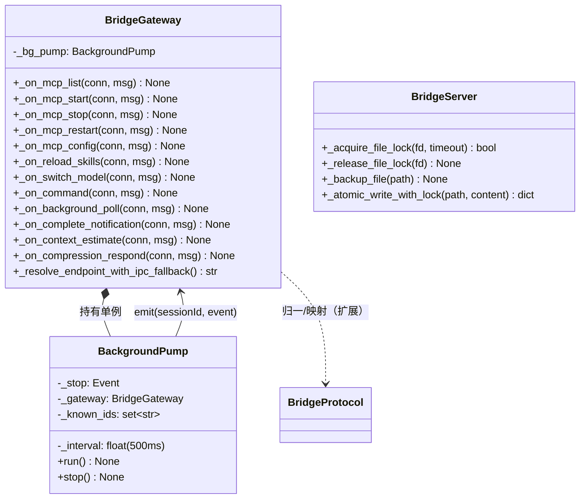
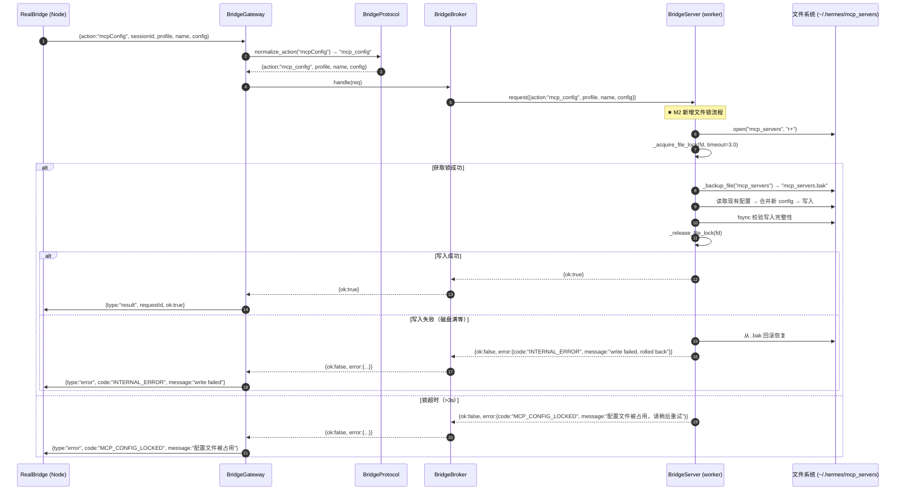
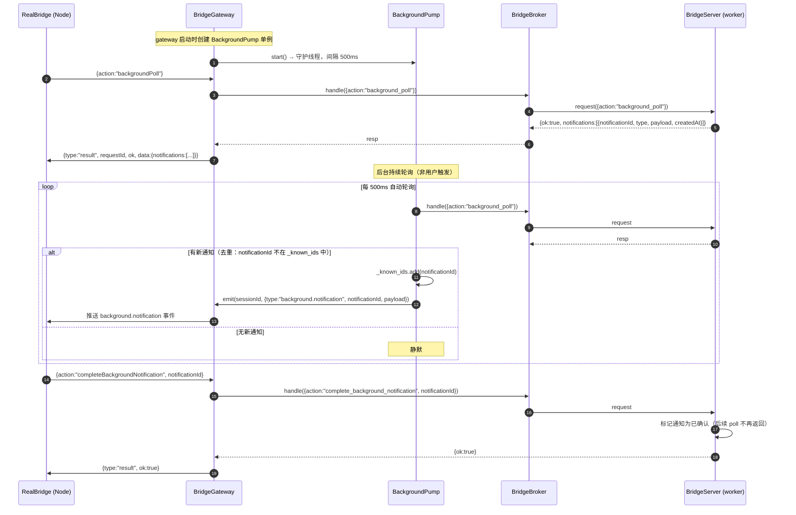
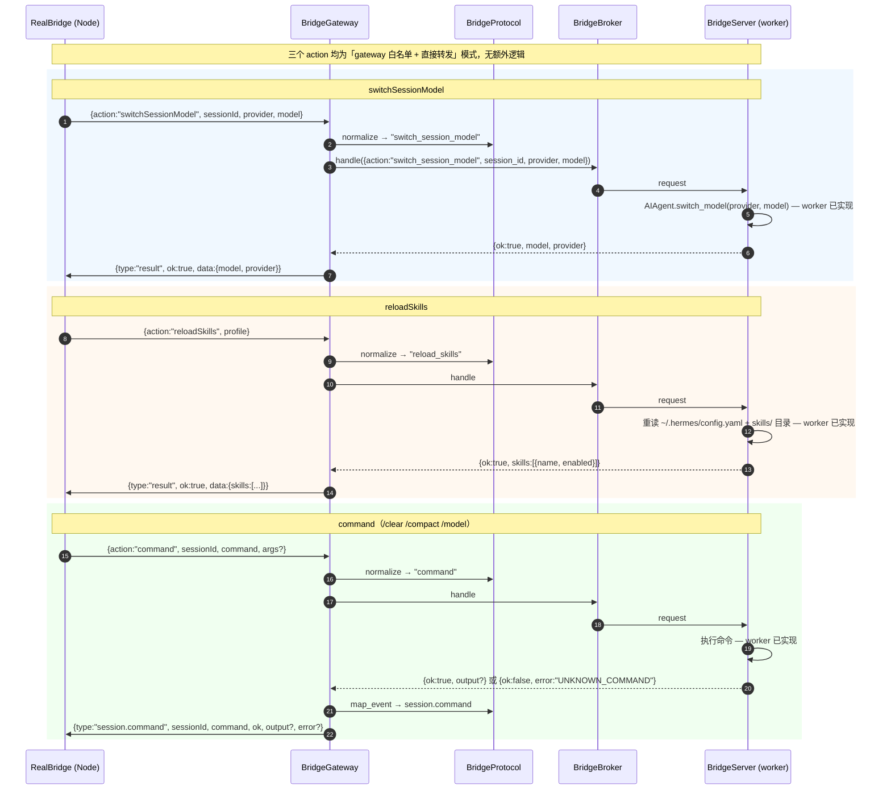
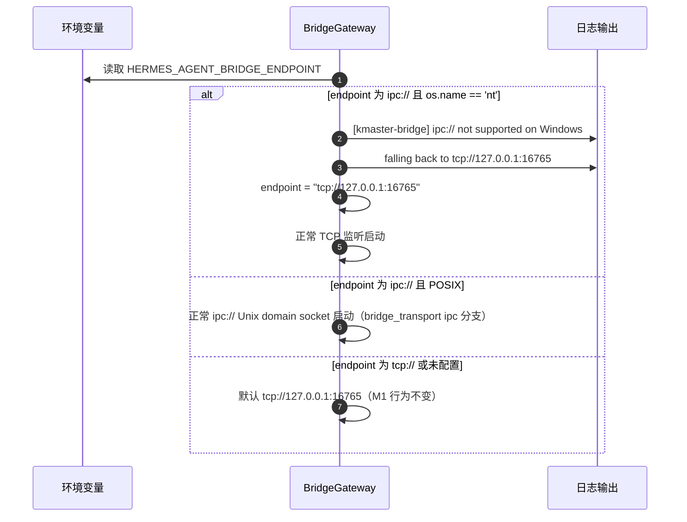
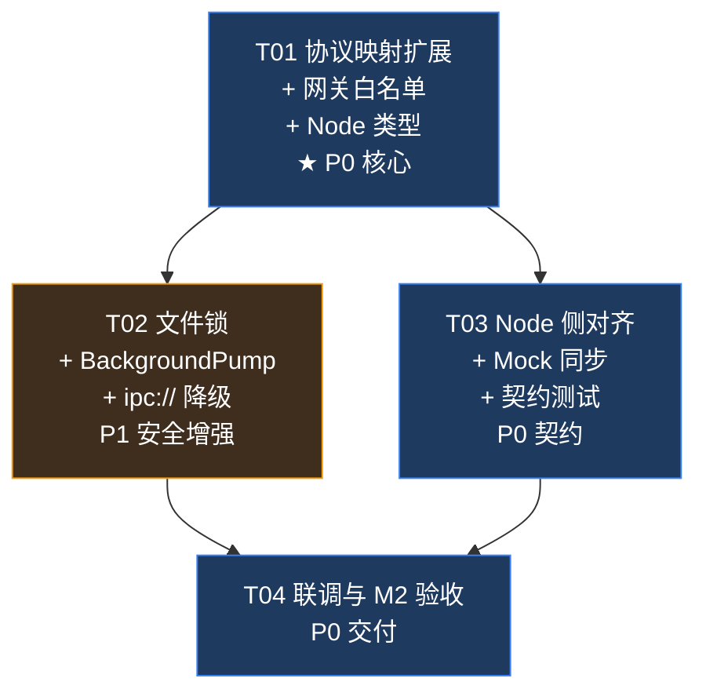

# 技术方案 · kmaster-bridge M2（增量架构设计 + 任务分解）

> **性质**：增量技术方案，仅描述 M2 里程碑对 M1 的新增/变更内容。M1 已交付的架构、文件、契约不重复。
> **上游输入**：`docs/design/REQUIREMENT-kmaster-bridge-m2.md`（M2 PRD，许清楚）+ `docs/design/TECHNICAL-SOLUTION-kmaster-bridge.md`（M1 技术方案，含 §8 扩展点预留）。
> **下游消费者**：Python / Node 工程师（按 §7 任务列表实现）。
> **语言**：简体中文 ｜ **架构师**：高见远
> **里程碑范围**：M1 顺延的 P1 项 — MCP 操作族 / reloadSkills / switchSessionModel / command / backgroundPoll+委派事件 / compressionRespond+contextEstimate / ipc:// 传输。LAN discovery 正式删除。

---

## 0. 关键结论前置（务必先读）

### ⚠️ 核心事实：M2 不是「从零实现」，而是「打通预留扩展点」

M1 技术方案 §8 明确标注了 8 个顺延项的扩展点预留方式——**worker 侧 `bridge_server.py` 所有 M2 action 分支代码已在 M1 完整保留**，gateway 侧仅需在 `ACTION_ALIASES` 中注册白名单即可生效。

| 维度 | M1 状态 | M2 变更量 |
|---|---|---|
| gateway `bridge_gateway.py` | `ACTION_ALIASES` 仅含 M1 13 个 action | **+~80 行**：新增 11 个 action 白名单 + `backgroundPoll` 事件泵逻辑 |
| protocol `bridge_protocol.py` | `EVENT_MAP` 含 14 条显式映射，压缩条目标注 ⏭ | **+~30 行**：新增 10 条事件显式映射 + 启用压缩条目 + 6 个错误码 |
| Node `protocol.ts` | 含 M1 24 种事件类型 | **+~10 行**：新增 10 个 `BridgeEvent` 类型成员 |
| worker `bridge_server.py` | **所有 M2 action 分支完整保留** | **+~15 行**：MCP 写入前加文件锁 + `.bak` 备份（仅安全增强） |
| 架构分层 | gateway / protocol / broker / worker 四层 | **不变** |
| 端口 | 16765 | **不变** |

**结论**：M2 的实际工作量集中在 gateway 和 protocol 两个文件的映射表扩展，以及 Node 侧类型声明。不涉及 broker/pool/runtime 重构。这是 M1 架构设计时有意为之的「预留扩展点」策略的兑现。

### ⚠️ 主理人已拍板决策

| 决策点 | 结论 |
|---|---|
| Q1 · LAN discovery | **正式删除**。`ipc://` 代码分支在 `bridge_transport.py` 保留但北向不开放配置 |
| Q2 · MCP action 粒度 | **5 action 方案**：`mcpList / mcpStart / mcpStop / mcpRestart / mcpConfig`。不拆 `mcpRemove`（`mcpConfig` 覆盖删除语义） |
| Q3 · 文件锁策略 | **bridge 侧加锁**：`fcntl.flock`（POSIX）/ `msvcrt.locking`（Windows），写入前 `.bak` 备份，**不依赖 hermes 自身锁机制** |

---

## 1. 实现方案与改动范围

### 1.1 总体策略

M2 的实现策略与 M1 一致：**零新增第三方依赖、不改架构分层、不改端口、不改进程模型**。所有改动集中在四个既有文件的映射表/白名单/类型声明扩展，外加 worker 侧一个文件锁安全增强。

```
┌─ 改动层 ───────────────────────────────────────────────────┐
│                                                             │
│  bridge_gateway.py  ←  +11 action 白名单 + backgroundPoll 泵 │
│  bridge_protocol.py ←  +10 事件映射 + 启用压缩 + 6 错误码   │
│  bridge_server.py   ←  文件锁工具函数（fcntl/msvcrt）+ .bak  │
│  protocol.ts        ←  +10 BridgeEvent 类型                 │
│                                                             │
│  ┌─ 不改动层 ───────────────────────────────────────────┐  │
│  │ bridge_broker.py / bridge_transport.py               │  │
│  │ bridge_pool.py / bridge_runtime.py / kmaster_bridge.py│  │
│  └──────────────────────────────────────────────────────┘  │
└─────────────────────────────────────────────────────────────┘
```

### 1.2 核心技术难点与对策

| # | 难点 | 对策 |
|---|---|---|
| D1 | **MCP 并发写冲突**：kmaster-bridge 与 hermes CLI / hermes-studio 可能同时写 `~/.hermes/mcp_servers` | bridge 侧写文件前获取排他文件锁（`fcntl.flock` / `msvcrt.locking`），超时 3s 返回 `MCP_CONFIG_LOCKED`；写入前自动创建 `.bak` 备份，写入失败时回滚（AC1.6） |
| D2 | **backgroundPoll 事件泵**：需额外线程轮询后台通知缓冲（与现有 RunPump 不同——RunPump 按 run 轮询，backgroundPoll 是全局轮询） | 新增 `BackgroundPump`：单例守护线程，以 500ms 固定间隔调 `broker.handle({action:"background_poll"})`，有通知时 `emit` 给对应 session 连接；无通知时静默。与 RunPump 完全解耦 |
| D3 | **ipc:// Windows 降级**：`bridge_transport.py` 已含 ipc 分支但北向未开放 | 在 gateway 启动阶段的 `resolve_endpoint()` 中检测平台 + 协议：`os.name == 'nt'` 且 `ipc://` → 日志降级提示 + 退回 `tcp://127.0.0.1:16765`；POSIX 正常走 ipc 分支 |
| D4 | **技能/MCP 格式漂移**：hermes 升级可能改变 `mcp_servers` / `config.yaml` / `skills/` 格式 | 与 M1 U4 同策：`mcpConfig` / `reloadSkills` 的 YAML/JSON 解析失败返回结构化 error（`MCP_CONFIG_INVALID` / `SKILLS_RELOAD_FAILED`），不崩溃；README 记录当前 hermes-agent 版本号 |

### 1.3 各需求实现映射

| 需求编号 | 名称 | 实现方式 | 改动文件 |
|---|---|---|---|
| BR-M2-01 | MCP 操作族（5 action） | gateway `ACTION_ALIASES` 加 5 条映射；worker 侧已有完整实现；`bridge_server.py` 加文件锁 | gateway, protocol, server |
| BR-M2-02 | reloadSkills | gateway `ACTION_ALIASES` 加 1 条映射；worker 侧已有实现 | gateway, protocol |
| BR-M2-03 | switchSessionModel | gateway `ACTION_ALIASES` 加 1 条映射；worker 侧已有实现 | gateway, protocol |
| BR-M2-04 | command | gateway `ACTION_ALIASES` 加 1 条映射 + `_on_command` 分发；worker 侧已有实现 | gateway, protocol |
| BR-M2-05 | backgroundPoll + completeBackgroundNotification | gateway `ACTION_ALIASES` 加 2 条 + `BackgroundPump` 守护线程 | gateway, protocol |
| BR-M2-06 | delegation/subagent 事件显式映射 | `EVENT_MAP` 加 6 条显式映射（从 `agent.event{raw}` 兜底中提取） | protocol |
| BR-M2-07 | compressionRespond + contextEstimate | `contextEstimate` 从 `UNSUPPORTED_ACTION` 移除拦截；`compressionRespond` 加白名单 + 启用压缩事件映射；worker 侧已有实现 | gateway, protocol |
| BR-M2-08 | ipc:// 传输支持 | gateway 启动阶段加平台检测 + 降级逻辑；`bridge_transport.py` ipc 分支保留不动 | gateway, transport |

---

## 2. 文件列表（仅改动文件）

根目录：`packages/server/src/services/hermes/bridge/`

| # | 目标路径 | 改动性质 | 改动量 | 说明 |
|---|---|---|---|---|
| P1 | `bridge/bridge_gateway.py` | **修改** | +~80 行 | (a) `ACTION_ALIASES` 扩展 11 条映射；(b) 新增 `_on_mcp_*` 5 个分发方法；(c) 新增 `_on_reload_skills` / `_on_switch_model` / `_on_command`；(d) 新增 `BackgroundPump` 类（~30 行）；(e) `_on_context_estimate` 解除 `UNSUPPORTED_ACTION` 拦截；(f) `resolve_endpoint()` 加 ipc:// Windows 降级检测 |
| P2 | `bridge/bridge_protocol.py` | **修改** | +~30 行 | (a) `ACTION_ALIASES` 补 11 条；(b) `EVENT_MAP` 补 10 条显式映射（subagent.* 6 条 + delegation.updated + mcp.status.changed + background.notification + compression.requested），启用已标注 ⏭ 的 `compression.started/completed/failed`；(c) `ERROR_CODES` 补 6 个新错误码 |
| P3 | `bridge/bridge_server.py` | **修改** | +~15 行 | (a) 新增 `_acquire_file_lock()` / `_release_file_lock()` 工具函数（fcntl/msvcrt 双平台）；(b) 新增 `_backup_file()` 工具函数；(c) `mcpConfig` / `reloadSkills` 写入路径调用锁+备份 |
| P4 | `packages/server/src/protocol.ts` | **修改** | +~10 行 | `BridgeEvent` 类型补 10 个新事件类型定义 |
| P5 | `bridge/bridge_transport.py` | **修改** | ~5 行（无实质改动） | ipc 代码分支已在 M1 保留，M2 无需改动；仅确认 Windows 降级逻辑在 gateway 侧实现即可 |

> **不改动文件**：`bridge_broker.py`（已有通用路由，新增 action 自动转发）、`bridge_pool.py`（worker 侧能力完备）、`bridge_runtime.py`、`kmaster_bridge.py`、`bridge.ts`（除 `protocol.ts` 类型定义外，Node `RealBridge` 的 `chat()` 事件处理器已是 `switch-case` 模式，新增事件类型自然落入 `default` → 只需确保不报错即可）。
>
> **不新建文件**：所有改动均在既有文件中完成。

---

## 3. 数据结构与接口（类图·增量）

> M1 类图主体不变。以下仅展示 M2 新增/变更的类成员与方法。



### 3.1 M2 新增 action 别名归一表

> 以下 11 条追加到 `ACTION_ALIASES`（M1 已有 13 条 + 2 UNSUPPORTED，M2 后共 26 条可用 + 1 UNSUPPORTED）。

| 规范名（PRD） | Node 实际发送 | worker snake_case | 优先级 | 备注 |
|---|---|---|---|---|
| `mcpList` | `mcpList` | `mcp_list` | P0 | worker 已实现 |
| `mcpStart` | `mcpStart` | `mcp_start` | P0 | worker 已实现 |
| `mcpStop` | `mcpStop` | `mcp_stop` | P0 | worker 已实现 |
| `mcpRestart` | `mcpRestart` | `mcp_restart` | P0 | worker 已实现 |
| `mcpConfig` | `mcpConfig` | `mcp_config` | P0 | worker 已实现；统一增/改/删 |
| `reloadSkills` | `reloadSkills` | `reload_skills` | P0 | worker 已实现 |
| `switchSessionModel` | `switchSessionModel` | `switch_session_model` | P0 | worker 已实现 |
| `command` | `command` | `command` | P0 | worker 已实现 |
| `backgroundPoll` | `backgroundPoll` | `background_poll` | P1 | 走 BackgroundPump，不经过 broker→worker 路由 |
| `completeBackgroundNotification` | `completeBackgroundNotification` | `complete_background_notification` | P1 | worker 已实现 |
| `compressionRespond` | `compressionRespond` | `compression_respond` | P1 | worker 已实现 |
| `contextEstimate` | `contextEstimate` / `context.estimate` | `context_estimate` | P1 | **从 UNSUPPORTED 解除拦截** |

### 3.2 M2 新增/升级下行事件映射表

> 以下条目追加到 `EVENT_MAP`。

| worker 事件（`event` 字段） | kmaster `type` | 关键字段变换 | 来源 |
|---|---|---|---|
| `mcp.status.changed` | `mcp.status.changed` | `server`, `status` | **新增** |
| `session.command` | `session.command` | `command`, `ok`, `output?`, `error?` | **启用**（M1 已定义但无上游） |
| `subagent.start` | `subagent.start` | `subagentId`, `task` | 从 `agent.event{raw}` 升级 |
| `subagent.tool` | `subagent.tool` | `subagentId`, `tool`, `args`, `result` | 从 `agent.event{raw}` 升级 |
| `subagent.text` | `subagent.text` | `subagentId`, `delta` | 从 `agent.event{raw}` 升级 |
| `subagent.progress` | `subagent.progress` | `subagentId`, `percent` | 从 `agent.event{raw}` 升级 |
| `subagent.complete` | `subagent.complete` | `subagentId`, `summary` | 从 `agent.event{raw}` 升级 |
| `delegation.updated` | `delegation.updated` | `delegationId`, `status`, `progress?` | 从 `agent.event{raw}` 升级 |
| `background.notification` | `background.notification` | `notificationId`, `payload` | **启用**（M1 已定义但无上游） |
| `bridge.compression.requested` | `compression.requested` | `compressionId`, `estimated_savings`, `preview?` | **新增** |
| `bridge.compression.started` | `compression.started` | `compressionId`, `before_tokens` | **启用**（M1 ⏭ → ✅） |
| `bridge.compression.completed` | `compression.completed` | `compressionId`, `after_tokens`, `saved_tokens` | **启用**（M1 ⏭ → ✅） |
| `bridge.compression.failed` | `error{code:"COMPRESSION_FAILED"}` | — | **启用**（M1 ⏭ → ✅） |

> **兜底不变**：以上未覆盖的未知事件仍走 `agent.event{raw}` 透传（NFR-M2-4）。

### 3.3 M2 新增错误码

| code | 触发条件 | 所属需求 |
|---|---|---|
| `MCP_CONFIG_INVALID` | `mcpConfig` 传入非法配置（JSON 格式错误、必填字段缺失） | BR-M2-01 |
| `MCP_CONFIG_LOCKED` | 配置文件被其他进程占用，文件锁获取超时（>3s） | BR-M2-01 |
| `MCP_SERVER_NOT_FOUND` | `mcpStart/mcpStop/mcpRestart` 目标服务器名不存在 | BR-M2-01 |
| `SKILLS_RELOAD_FAILED` | 技能重载失败（YAML 语法错误、技能目录结构异常） | BR-M2-02 |
| `MODEL_NOT_AVAILABLE` | `switchSessionModel` 目标 provider/model 不可用 | BR-M2-03 |
| `UNKNOWN_COMMAND` | `command` 传入未知命令名 | BR-M2-04 |

### 3.4 文件锁接口

```python
# bridge_server.py 新增工具函数

def _acquire_file_lock(fd: int, timeout: float = 3.0) -> bool:
    """获取排他文件锁。POSIX: fcntl.flock(LOCK_EX|LOCK_NB) 轮询;
       Windows: msvcrt.locking(LK_NBLCK) 轮询。
       返回 True=获取成功, False=超时。"""

def _release_file_lock(fd: int) -> None:
    """释放文件锁。POSIX: fcntl.flock(LOCK_UN);
       Windows: msvcrt.locking(LK_UNLCK)。"""

def _backup_file(path: str) -> str | None:
    """复制 path → path.bak，返回备份路径。失败返回 None 不阻塞主流程。"""

def _atomic_write_with_lock(path: str, content: str | bytes) -> dict:
    """原子写入流程：获取锁 → 备份 → 写入 → 校验 → 释放锁。
       任一步失败 → 回滚（从 .bak 恢复）→ 返回 error dict。
       成功返回 {"ok": True}。"""
```

---

## 4. 程序调用流程（时序图·增量）

> M1 主链路（chat / interrupt / approvalRespond）时序图不变。以下仅展示 M2 新增关键流程。

### 4.1 MCP 配置写入（含文件锁 + 备份）



### 4.2 backgroundPoll + BackgroundPump



### 4.3 switchSessionModel / reloadSkills / command（轻量转发）



### 4.4 ipc:// Windows 降级



---

## 5. 依赖包列表

**零新增依赖**。M2 延续 M1 策略：Python 仅用标准库（`fcntl` / `msvcrt` / `os` / `socket` / `threading` 均为标准库），Node 仅补类型声明。

| 依赖 | 来源 | 说明 |
|---|---|---|
| `fcntl` | Python 标准库 | POSIX 文件锁（Linux/macOS） |
| `msvcrt` | Python 标准库 | Windows 文件锁 |
| `os` / `shutil` | Python 标准库 | 文件备份与回滚 |
| `threading` | Python 标准库 | BackgroundPump 守护线程 |

---

## 6. 共享知识（跨文件约定·增量）

> M1 的 12 条共享知识全部保持。以下仅追加 M2 新增约定。

13. **文件锁纪律**：任何写 `~/.hermes/mcp_servers`、`~/.hermes/config.yaml`、`~/.hermes/skills/` 的操作，**必须**经 `_atomic_write_with_lock()` 统一入口，严禁各处手写 `open()` + `write()`。锁超时统一 3s。

14. **BackgroundPump 生命周期**：`BackgroundPump` 在 gateway `serve_forever()` 启动时创建、`stop()` 时设置 `_stop` Event 并 join。**禁止**在 broker/worker 侧启后台线程。

15. **subagent/delegation 事件不再走兜底**：`EVENT_MAP` 新增 6+1 条显式映射后，这些事件**不得**再以 `agent.event{raw}` 包裹透传（NFR-M2-4）。仅当 hermes 产生**全新未知**事件类型时，`agent.event{raw}` 兜底才触发。

16. **MCP action 命名规范**：5 个 MCP action 统一 `mcpList / mcpStart / mcpStop / mcpRestart / mcpConfig`——驼峰命名，首字母小写。Node 侧、gateway 别名表、worker snake_case 三方对齐。

17. **ipc:// 降级透明**：gateway 的 `_resolve_endpoint_with_ipc_fallback()` 是唯一检测入口。`bridge_transport.py` 的 ipc 分支**不感知**降级逻辑——它只处理 gateway 传入的已决议 endpoint。

---

## 7. 任务列表（按依赖顺序，共 4 条）

> ⚠️ 任务分解遵循硬约束：**不超过 5 个任务，每条至少 3 个相关文件，按功能模块分组**。

| ID | 任务 | 涉及文件 | 内容 | 依赖 | 优先级 |
|---|---|---|---|---|---|
| **T01** | **协议映射扩展 + 网关白名单** | P2 `bridge_protocol.py`（+30 行）、P1 `bridge_gateway.py`（+60 行）、P4 `protocol.ts`（+10 行） | **protocol 扩展**：`ACTION_ALIASES` 追加 11 条映射（mcpList/mcpStart/mcpStop/mcpRestart/mcpConfig/reloadSkills/switchSessionModel/command/backgroundPoll/completeBackgroundNotification/compressionRespond）；`EVENT_MAP` 追加 10 条显式映射 + 启用 3 条 ⏭ 压缩条目；`ERROR_CODES` 追加 6 个新错误码。**gateway 白名单**：`_dispatch()` 注册 11 个新 action 分发方法（其中 MCP 5 个 / reloadSkills / switchSessionModel / compressionRespond 均为直接转发 broker；command 加 `_on_command` 分发；backgroundPoll / completeBackgroundNotification 加 `_on_background_poll` / `_on_complete_notification`）；`contextEstimate` 从 `UNSUPPORTED_ACTION` 拦截中移除。**Node 类型**：`protocol.ts` 的 `BridgeEvent` 类型补 10 个新事件成员。覆盖 BR-M2-01~BR-M2-07 中除文件锁外的全部功能。 | — | P0 |
| **T02** | **文件锁 + 后台事件泵 + ipc:// 降级** | P1 `bridge_gateway.py`（+20 行）、P3 `bridge_server.py`（+15 行）、P5 `bridge_transport.py`（~5 行确认） | **文件锁**：`bridge_server.py` 新增 `_acquire_file_lock()` / `_release_file_lock()` / `_backup_file()` / `_atomic_write_with_lock()` 四个工具函数，实现 fcntl.flock（POSIX）/ msvcrt.locking（Windows）双平台文件锁 + 写入前 .bak 备份 + 失败回滚；在 `mcpConfig` / `reloadSkills` 的写入路径中调用。**BackgroundPump**：`bridge_gateway.py` 新增 `BackgroundPump` 类（~30 行），500ms 间隔轮询 worker 后台通知缓冲，去重后 emit 给对应 session 连接。**ipc:// 降级**：`bridge_gateway.py` 的 `_resolve_endpoint_with_ipc_fallback()` 检测 `os.name == 'nt'` 且 `ipc://` → 日志降级 + 退回 TCP；`bridge_transport.py` 的 ipc 分支确认保留不动。覆盖 BR-M2-01 AC1.6、BR-M2-05、BR-M2-08。 | T01 | P1 |
| **T03** | **Node 侧对齐 + Mock 同步** | P4 `protocol.ts`（继续）、`bridge.ts`（+~5 行）、`__tests__/`（新/更新）、MockBridge（若有独立文件则改） | **RealBridge**：确认 `chat()` 事件处理 switch-case 对新增 10 种事件类型无报错（至少 default 兜底）；若存在事件类型白名单校验则补 10 个新类型。**MockBridge**：补 `mcpList / mcpStart / ... / compressionRespond` 等新 action 的 mock 返回；补 `mcp.status.changed / subagent.* / delegation.updated / compression.requested / background.notification / session.command` 等新事件的 mock 发射（NFR-M2-5）。**契约测试**：更新事件序列快照，覆盖至少一次 subagent 事件链（start→tool→text→progress→complete）和一次 compression 事件对。覆盖 BR-M2-06/BR-M2-07 AC6.x/AC7.x、NFR-M2-5。 | T01, T02 | P0 |
| **T04** | **联调与 M2 验收** | P1~P5 全部改动文件、`README.md`、回归文件 | **手动验收**：(a) 5 个 MCP action 逐个调用验证——`mcpList` 返回清单、`mcpStart` 后工具可用、`mcpStop` 后工具消失、`mcpRestart` 功能等价、`mcpConfig` 增/改/删生效；(b) `reloadSkills` 后技能开关即时生效；(c) `switchSessionModel` 切换后上下文保留、下一轮 `usage.updated` 模型字段正确；(d) `/clear` 清空上下文、`/compact` 触发压缩事件对、`/model` 切换模型、未知命令不崩溃；(e) `backgroundPoll` at-least-once 语义验证；(f) `contextEstimate` 返回 used/limit/percent 且单调递增；(g) ipc:// Windows 降级日志验证；(h) MCP 并发写冲突模拟（两个进程同时写 → 一个返回 MCP_CONFIG_LOCKED）。**更新 README**：记录当前 hermes-agent 版本号、M2 新增 action 一览、文件锁机制说明、ipc:// 平台限制。**回归**：M1 全量验收基线不破（AB-1~AB-7）。 | T01, T02, T03 | P0 |

### 任务依赖图



### 建议实施批次

| 批次 | 任务 | 产出里程碑 |
|---|---|---|
| **B1 核心** | T01 → T02 | 全部 11 个新 action 可调用、10 种新事件显式映射生效、文件锁保护就绪、BackgroundPump 运行、ipc:// Windows 降级可用 |
| **B2 收口** | T03 → T04 | Node Mock/Real 对齐、契约测试更新、全量验收通过 |

---

## 8. 关键风险

| # | 风险 | 等级 | 缓解措施 | 对应需求 |
|---|---|---|---|---|
| R1 | **MCP 并发写冲突**：kmaster-bridge / hermes CLI / hermes-studio 同时写 `~/.hermes/mcp_servers` | 🔴 高 | T02 文件锁（fcntl/msvcrt + 3s 超时）+ .bak 备份 + 失败回滚。锁超时返回 `MCP_CONFIG_LOCKED` | BR-M2-01 AC1.6 |
| R2 | **技能/MCP 格式漂移**：hermes 版本升级导致 `mcp_servers` 配置格式或 `skills/` 目录结构变化 | 🟡 中 | 写入前校验 JSON/YAML 格式合法性，非法返回结构化 error 不崩溃。T04 在 README 记录当前 hermes-agent 版本号，升级时对照变更 | BR-M2-01 / BR-M2-02 |
| R3 | **模型切换上下文保留**：`AIAgent.switch_model()` 是 hermes 内部 API，可能在某些 provider 下不保留会话历史 | 🟡 中 | AC3.2 要求切换后验证上下文连续性（"我刚才说了什么"）。若实测发现特定 provider 不保留，可在 README 标注已知限制。与 M1 U4 同策——hermes API 耦合风险已识别，非 bridge 可控 | BR-M2-03 AC3.2 |
| R4 | **BackgroundPump 通知积压**：高频后台委派任务可能使 `_known_ids` 集合持续增长 | 🟢 低 | `_known_ids` 使用 `frozenset` 快照 + LRU 淘汰（上限 10000 条）；`completeBackgroundNotification` 确认后主动清理 | BR-M2-05 |
| R5 | **ipc:// 在 WSL/macOS 下的兼容性**：Unix domain socket 路径长度限制（~104 字符）可能导致绑定失败 | 🟢 低 | gateway 启动时捕获 `OSError`，降级日志 + 退回 TCP；Windows 直接退回，不尝试 | BR-M2-08 |

---

## 9. 待明确事项

| # | 问题 | 影响 | 建议 |
|---|---|---|---|
| **U1** | **`bridge_transport.py` 的 ipc 代码分支是否需要实际测试**？M1 已将其保留但标注「北向不开放配置」，M2 开放 ipc:// 后需确认 POSIX 路径下的 socket 创建/绑定/连接链路无 bug。 | 若 ipc 分支有 bit rot（M1 未测），可能导致 Linux/macOS 用户首次使用即失败 | 建议 T04 验收时在 Linux 或 macOS 环��中至少做一次 ipc:// 端到端对话（可复用 CI 中已有的 Linux runner） |
| **U2** | **`compressionRespond` 的 choice 枚举是否需要标准化**？PRD 中仅提到 `allow/deny`，但 hermes 侧可能有 `always` / `postpone` 等扩展值。 | 若 hermes 产生未知 choice 值，worker 可能抛异常 | 建议 gateway 转发 `compressionRespond` 时对 `choice` 做白名单校验（`allow` / `deny`），非白名单值返回 `BAD_REQUEST`；后续按需扩展白名单 |
| **U3** | **`backgroundPoll` 的 session 归属**？PRD 中 `backgroundPoll` 无 `sessionId` 参数，返回的通知如何关联到具体 session？ | 若通知不含 sessionId，gateway 无法定向投递（违反 M1 共享知识 3） | 需 PM/主理人确认：通知 payload 中是否自带 sessionId？若无，需 worker 侧补 sessionId 字段（改动 trivial，但需确认） |

---

## 10. 附：M2 交付后控制面全图（7 类 23 action + 34 事件）

```
kmaster-bridge 控制面 —— M2 交付后完整态

① 对话主链路      chat / getOutput / getResult / getSessionTitle / getHistory / statusIfLoaded / ping
② 运行控制        interrupt / steer
③ 交互控制        approvalRespond / clarifyRespond
④ 会话生命周期    destroy
⑤ 配置热切换  ★  switchSessionModel / reloadSkills / mcpList / mcpStart / mcpStop / mcpRestart / mcpConfig
⑥ 命令与后台  ★  command / backgroundPoll / completeBackgroundNotification
⑦ 压缩        ★  compressionRespond / contextEstimate

★ = M2 新增/启用
```

---

> **文档版本**：v1.0 ｜ **作者**：高见远（架构师）｜ **日期**：2025-07-03
> **下次更新**：待 U1~U3 确认后修订。
