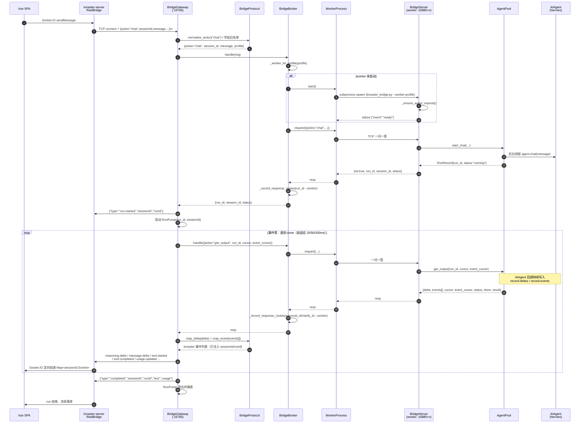
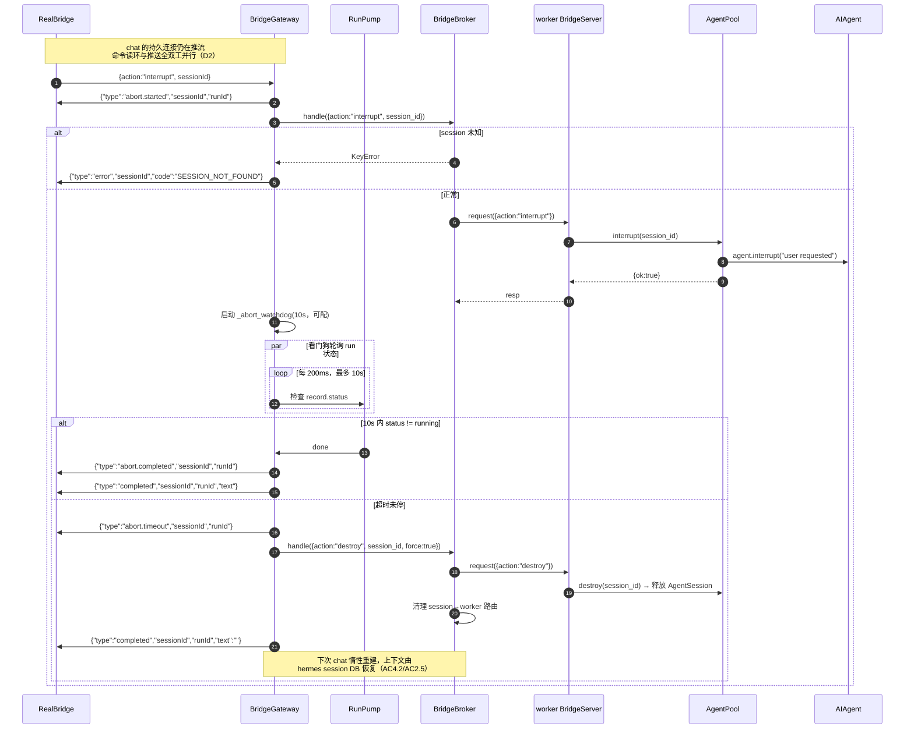
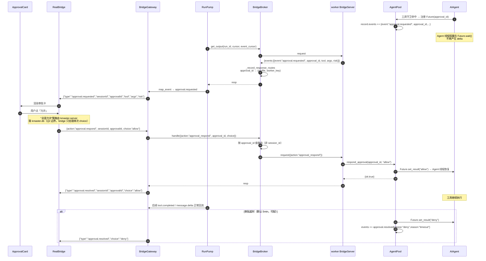
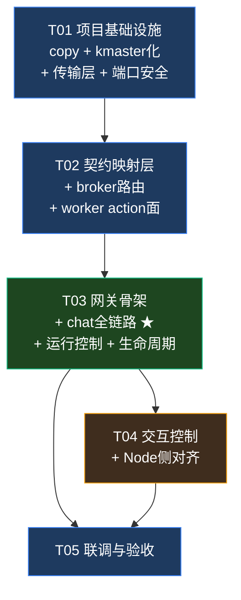

# 技术方案 · kmaster-bridge（系统架构设计 + 任务分解）

> **性质**：架构设计文档（SOP 第二阶段）。上游输入 = `docs/design/REQUIREMENT-kmaster-bridge.md`（PRD，许清楚）+ `docs/reference/02-kmaster-studio设计方案.md`。
> **下游消费者**：Python / Node 工程师（按 §7 任务列表实现）。
> **语言**：简体中文 ｜ **架构师**：高见远
> **里程碑范围（主理人 Q1–Q4 已拍板）**：P0（BR-01~05）+ P1 交互控制（BR-06/07）+ 会话生命周期（BR-08）。MCP 族 / reloadSkills / switchSessionModel / command / background / compression / contextEstimate / ipc:// / LAN discovery **顺延下一里程碑**，本设计仅预留扩展点。

---

## 0. 关键结论前置（务必先读）

调研参考实现后，发现两处与既有假设不符的**事实性偏差**，本方案据实修正，请工程师以本节为准：

### ⚠️ 修正 1：hermes-studio bridge 是「一问一答 + 游标拉取」，不是「持久连接 + 事件推送」

| | hermes-studio 参考实现（实测） | kmaster 现状（骨架 + `RealBridge`）| PRD §5.1 要求 |
|---|---|---|---|
| 连接模型 | **每请求一条 TCP 连接，响应后立即 close** | 持久连接，一条连接跑完整个 run | 持久连接 |
| chat 语义 | 立即返回 `{run_id, session_id, status:"running"}` | 阻塞至 `completed` | 阻塞至 `completed` |
| 事件获取 | Node 轮询 `get_output(run_id, cursor, event_cursor)` **拉取** | Python 主动 **推送** NDJSON | 推送（`Map<sessionId,Socket>` 定向投递） |

> 证据：`bridge_broker.py:408 _handle_connection()` 读一条请求 → 写一条响应 → `conn.close()`；`bridge_server.py:94` chat 直接 `return {run_id, session_id, status}`；`bridge_pool.py:1829 get_output()` 是游标式增量拉取。

**结论**：**不能整体照抄北向连接层**。参考实现的 broker/worker/pool **内核**（会话池、run 记录、事件缓冲、审批 future、worker 生命周期）价值极高，全部复用；但**北向边缘（Node ↔ Python）必须新写一层「网关 + 事件泵」，把拉模型转成推模型**，从而：Node 侧 `RealBridge`（已修 M2）**零改动**即可对接，PRD §5.1 的 `sessionId` 定向投递契约得以成立。这是本方案最核心的设计决策。

### ⚠️ 修正 2：worker 不是「subprocess spawn run_agent.py + ACP stdio」，而是「进程内 import AIAgent」

实测链路为：

```
broker ──subprocess spawn──> worker 进程（同一份 bridge 代码，--worker-profile 模式）
                               └── 进程内 from run_agent import AIAgent   ← 不是 ACP stdio
                                     └──（仅当 provider 为 ACP 型运行时）AIAgent 内部再 spawn ACP agent
```

> 证据：`bridge_transport.py:47-54` spawn 的是 `hermes_bridge.py --worker-profile`；`bridge_pool.py:248 from run_agent import AIAgent`、`:260 AIAgent(...)` 在 worker 进程内直接构造，`acp_command/acp_args` 只是**传给 AIAgent 的参数**（由 `_resolve_runtime()` 按模型决定），bridge 自身不实现 ACP。

**结论**：kmaster-bridge **无需实现 ACP 协议**，ACP 能力由 hermes `AIAgent` 内部继承。BR-02 的实现要点应改为「保证 `run_agent` 可 import + 正确构造 AIAgent + 接好 8 个回调」，而非「写 ACP stdio 客户端」。这大幅降低工作量与风险。

### ⚠️ 风险 1（高危）：参考实现会 `taskkill` 占用端口的进程

`bridge_transport.py:289 _kill_windows_endpoint_occupants()` 在绑定前会 **`taskkill /T /F`** 掉所有监听目标端口的进程。若 kmaster-bridge 端口被误配成 `18765`，**会直接杀掉同机运行的 hermes-studio bridge 及其全部子进程**。必须：默认端口硬编码 16765 + 该行为加开关（`KMASTER_BRIDGE_KILL_PORT_OCCUPANT`，默认 `0` 关闭）。详见 T01。

---

## 1. 实现方案与框架选型

### 1.1 目标架构

```
┌─ Node ───────────────────────────────────────────────┐
│  Vue SPA ──Socket.IO /chat-run──> kmaster-server      │
│                                     RealBridge        │
│                                   Map<sessionId,Sock> │
└──────────────────────┬────────────────────────────────┘
                       │ ① 持久 NDJSON 全双工（推）
                       │    tcp://127.0.0.1:16765
┌──────────────────────▼────────────────────────────────┐
│ kmaster-bridge 主进程（broker 模式）                    │
│  ┌────────────────────────────────────────────────┐   │
│  │ bridge_gateway.py  【新写】北向边缘             │   │
│  │  · ClientConn：持久连接 + NDJSON 分片重组       │   │
│  │  · 命令读取环（与事件推送全双工并发）            │   │
│  │  · RunPump：拉→推 事件泵（每 run 一线程）        │   │
│  └───────────────┬────────────────────────────────┘   │
│  ┌───────────────▼────────────────────────────────┐   │
│  │ bridge_protocol.py 【新写】契约映射层（Q1=B）    │   │
│  │  · action 别名归一（camelCase / 点号 / snake）  │   │
│  │  · hermes event → kmaster event 映射 + 兜底     │   │
│  │  · 强制注入 sessionId / runId                   │   │
│  └───────────────┬────────────────────────────────┘   │
│  ┌───────────────▼────────────────────────────────┐   │
│  │ bridge_broker.py   【copy 改造】路由库           │   │
│  │  · session/run/approval/clarify → worker 路由   │   │
│  │  · worker 池、空闲 GC、destroy_profile          │   │
│  └───────────────┬────────────────────────────────┘   │
│  ┌───────────────▼────────────────────────────────┐   │
│  │ bridge_transport.py【copy 改造】WorkerProcess    │   │
│  └───────────────┬────────────────────────────────┘   │
└──────────────────┼────────────────────────────────────┘
                   │ ② subprocess spawn + 一问一答 TCP
                   │    tcp://127.0.0.1:16880+hash%1000
┌──────────────────▼────────────────────────────────────┐
│ worker 进程（--worker-profile <p>），每 profile 一个     │
│  bridge_server.py 【copy 改造】worker 侧 action 分发    │
│  bridge_pool.py   【copy 保留】AgentPool/Session/Run    │
│                    · 事件缓冲 record.events/deltas      │
│                    · approval/clarify Future 挂起       │
│  bridge_runtime.py【copy 改造】agent 发现 / profile env │
└──────────────────┬────────────────────────────────────┘
                   │ ③ 进程内 import
                   ▼
            run_agent.AIAgent（hermes-agent）
                   └─（可选）ACP stdio → 外部 ACP agent
```

三段链路的**协议是三种，不要混淆**：① 持久推送 NDJSON（kmaster 自有协议，camelCase，强制 `sessionId`）；② 一问一答 NDJSON（沿用 hermes 原样，snake_case）；③ hermes 进程内 Python 调用。

### 1.2 核心技术难点与对策

| # | 难点 | 对策 |
|---|---|---|
| D1 | **拉模型 → 推模型** 阻抗失配（修正 1） | 新增 `RunPump`：每个活跃 run 一个守护线程，以自适应间隔（20/50/200ms 三档退避）调 `get_output(run_id, cursor, event_cursor)`，把 `delta` 与 `events[]` 映射成 kmaster 事件后写回该 session 的连接。游标由 pump 持有，天然不丢不重。 |
| D2 | **全双工**：chat 流式推送期间还要收 interrupt/approvalRespond | gateway 的连接读环与事件写出**彻底解耦**：读环独占一线程只做「读行 → 归一 → 分发」；写出走 `ClientConn.send()` 并用 `RLock` 串行化 `sendall`。run 不再阻塞连接。 |
| D3 | **NDJSON 分片重组**（AC5.5，现骨架与参考实现同缺陷） | 参考 `_read_json_request()` 用 `recv(65536)` 且**只取首行、丢弃余下缓冲**——>64KB 或粘包必错。新 `LineReader` 持久累积 `bytearray`，按 `\n` 切分并保留残片，单行上限 `MAX_LINE_BYTES=8MB` 超限报 `FRAME_TOO_LARGE`。 |
| D4 | **事件协议漂移**（Q1=B） | 所有 hermes 事件名/字段仅出现在 `bridge_protocol.py` 一处映射表；未命中 → `agent.event{raw}` 兜底透传（AC5.3）。hermes 升级只改这一个文件。 |
| D5 | **端口隔离**（NFR-1） | 北向 16765（默认硬编码）；worker 端口基址 `16880`（参考实现是 18780，必须错开）。禁用 taskkill 抢端口行为（风险 1）。 |
| D6 | **故障隔离与自愈**（AC3.3） | worker 崩溃 → `WorkerProcess.request()` 抛错 → broker 返回 `{ok:false}` → gateway 转 `error{code:"WORKER_UNAVAILABLE"}` + `completed` 收尾，仅影响该 session；下次 chat 时 `_worker_for_profile()` 惰性重建。 |
| D7 | **零密钥透传**（NFR-2/AC2.4） | gateway 白名单式构造 worker 请求：只允许 `sessionId/message/instructions/profile/model/attachments/options` 等字段过桥，其余一律丢弃；worker 侧 env 显式 `pop` 掉 token 类变量。 |

### 1.3 选型决策

| 决策点 | 选择 | 理由 |
|---|---|---|
| 北向连接模型 | **持久 NDJSON 推送**（新写 gateway） | Node `RealBridge` 已按此实现且已修 M2，零改动；PRD §5.1 强制要求；避免 Node 侧引入轮询定时器 |
| 事件获取 | **broker 内轮询 worker `get_output`** | 复用参考实现已验证的游标语义（at-least-once、断点续传）；本机回环轮询开销可忽略；不需要 worker 反向连接（少一层端口与重连逻辑） |
| worker 隔离粒度 | **按 profile（worker_key）** | 沿用参考实现；同 profile 多 session 共享 worker，AgentPool 内按 session_id 隔离；满足 AC3.2 |
| worker 进程管理 | **subprocess 直接 spawn**（Q4 已拍板） | 与 hermes-studio 一致；不引入 uv/venv 复杂度 |
| 并发模型 | **thread + 阻塞 socket** | 与参考实现一致；无需引入 asyncio 改写 1900 行 pool；线程数 = 连接数 + 活跃 run 数，量级可控 |
| Python 版本 | **≥3.10** | 参考实现大量使用 `str \| None` 联合类型语法与 `removeprefix` |
| 第三方依赖 | **零新增**（仅标准库） | 参考实现只用 stdlib；hermes-agent 作为**可 import 的宿主依赖**而非 pip 依赖 |

### 1.4 kmaster 化改造清单（copy 后必做）

| 项 | 参考实现 | kmaster 目标 |
|---|---|---|
| 北向端点默认值 | `tcp://127.0.0.1:18765` | **`tcp://127.0.0.1:16765`**（AC1.1/AC1.4） |
| worker 端口基址 | `HERMES_AGENT_BRIDGE_WORKER_PORT_BASE` 默认 `18780` | `KMASTER_BRIDGE_WORKER_PORT_BASE` 默认 **`16880`** |
| 日志前缀 | `[hermes-bridge] / [hermes-bridge-broker] / [hermes-bridge-worker:k]` | `[kmaster-bridge] / [kmaster-bridge-broker] / [kmaster-bridge-worker:k]`（AC1.5） |
| 进程入口 | `hermes_bridge.py`（含 274 行 monkey-patch 门面） | **`kmaster_bridge.py`，删除整个门面**（该门面是 hermes-web-ui 打包期热补丁机制，kmaster 直接拥有源码，无需要） |
| web-ui 耦合 | `HERMES_WEB_UI_*` 系列 env、`_bridge_platform()` 平台提示 | 剥离；`platform` 固定 `"kmaster"`（若 hermes 不识别则回退 `"cli"`，见 §9 U3） |
| 端口抢占 | 无条件 `taskkill` 占用者 | 默认**关闭**，`KMASTER_BRIDGE_KILL_PORT_OCCUPANT=1` 显式开启 |
| 帧读取 | `_read_json_request()` 一次性读首行 | 替换为 `LineReader` 持久重组（D3） |
| broker 服务化 | `BridgeBroker.serve_forever()` 自持监听 | **降级为路由库**，监听权移交 `bridge_gateway.py` |
| 超范围 action | `goal_evaluate/goal_pause/moa/*`、MCP 族等 | worker 侧保留代码但 gateway **不暴露**；北向命中返回 `UNKNOWN_ACTION` |

---

## 2. 文件列表

根目录：`packages/server/src/services/hermes/bridge/`

### 2.1 Python 侧

| # | 目标路径 | 来源 | 行数量级 | 说明 |
|---|---|---|---|---|
| P1 | `bridge/kmaster_bridge.py` | **新建**（参考 `hermes_bridge.py:254-274` 的 main） | ~120 | 唯一进程入口。`--worker-profile` 有值 → worker 模式（`BridgeServer`）；否则 → broker 模式（`BridgeGateway`）。**不含 monkey-patch 门面** |
| P2 | `bridge/bridge_gateway.py` | **新建**（kmaster 独有） | ~380 | 北向边缘：监听 16765、`ClientConn`、命令读环、`RunPump` 事件泵、abort 看门狗 |
| P3 | `bridge/bridge_protocol.py` | **新建**（kmaster 独有） | ~260 | action 别名表、字段白名单与 camel↔snake 转换、hermes→kmaster 事件映射表、错误码常量 |
| P4 | `bridge/bridge_broker.py` | copy `bridge_broker.py`(483) | ~420 | 去掉 `serve_forever/_handle_connection/_make_server_socket`，保留 `handle()` 路由与 worker 池、`_gc_idle_workers` |
| P5 | `bridge/bridge_transport.py` | copy `bridge_transport.py`(371) | ~400 | `WorkerProcess` + 端点解析 + `_make_listen_socket`；**新增 `LineReader`**；taskkill 加开关；worker 端口基址改 16880 |
| P6 | `bridge/bridge_server.py` | copy `bridge_server.py`(669) **覆盖现有 136 行骨架** | ~450 | worker 侧 action 分发。**现骨架的 `map_hermes_event` 逻辑上移至 P3，骨架文件整体废弃** |
| P7 | `bridge/bridge_pool.py` | copy `bridge_pool.py`(1914) | ~1900 | `AgentPool/AgentSession/RunRecord`。**尽量原样保留**，仅改日志前缀与 profile env 命名 |
| P8 | `bridge/bridge_runtime.py` | copy `bridge_runtime.py`(933) | ~900 | agent_root/hermes_home 发现、profile env、json 助手、信号处理、父进程看门狗 |
| P9 | `bridge/README.md` | **新建** | ~80 | 启动方式、env 一览、与 hermes-studio 共存说明、排障 |

> **删除**：现有 `bridge/bridge_server.py`（136 行骨架）被 P6 覆盖；其 chat 事件映射思路已并入 P3。

### 2.2 Node 侧

| # | 路径 | 动作 | 说明 |
|---|---|---|---|
| N1 | `packages/server/src/protocol.ts` | 修改 | 补 `BridgeEvent` 类型：`error` / `abort.started` / `abort.completed` / `abort.timeout` / `session.title.updated` / `session.command` / `agent.event` / `run.started` |
| N2 | `packages/server/src/bridge.ts` | 修改 | `RealBridge`：① 识别 `error` 事件并结束 run（当前只认 `completed` → 出错会永久悬挂）；② 新增 `destroy(sessionId)`；③ 连接加 `setKeepAlive`；④ `chat()` 的 `run_id` 改用 bridge 回传的 `run.started.runId`（当前是本地 `randomUUID()`，与 Python 侧对不上） |
| N3 | `packages/server/package.json` | 修改 | 新增 `"bridge:dev": "python src/services/hermes/bridge/kmaster_bridge.py"` |
| N4 | `packages/server/src/services/hermes/bridge/__tests__/` | 新建（可选） | 契约样本：一次完整 run 的事件序列快照，用于 AC5.1 自动化断言 |

---

## 3. 数据结构与接口（类图）

```mermaid
classDiagram
    class KMasterBridgeEntry {
        +main(argv: list) int
        -resolve_endpoint() str
        -is_worker_mode() bool
    }

    class BridgeGateway {
        -endpoint: str
        -broker: BridgeBroker
        -_conns: dict~str, ClientConn~
        -_session_conn: dict~str, ClientConn~
        -_pumps: dict~str, RunPump~
        -_stop: Event
        +serve_forever() None
        +_handle_conn(sock) None
        +_dispatch(conn, msg) None
        +_on_chat(conn, msg) None
        +_on_interrupt(conn, msg) None
        +_on_respond(conn, msg) None
        +emit(session_id: str, event: dict) None
        +_abort_watchdog(session_id, run_id) None
        +stop() None
    }

    class ClientConn {
        -sock: socket
        -reader: LineReader
        -_wlock: RLock
        +sessions: set~str~
        +read_lines() Iterator~dict~
        +send(obj: dict) None
        +close() None
    }

    class LineReader {
        -_buf: bytearray
        -MAX_LINE_BYTES: int
        +feed(chunk: bytes) list~bytes~
        +pending() int
    }

    class RunPump {
        -run_id: str
        -session_id: str
        -cursor: int
        -event_cursor: int
        -_interval: float
        -_stop: Event
        +run() None
        +stop() None
        -_poll_once() bool
    }

    class BridgeProtocol {
        <<module>>
        +ACTION_ALIASES: dict
        +EVENT_MAP: dict
        +CHAT_FIELD_WHITELIST: set
        +normalize_action(raw: str) str
        +to_worker_request(action: str, msg: dict) dict
        +map_event(raw: dict, session_id: str, run_id: str) dict
        +map_delta(text: str, session_id, run_id) dict
        +error(session_id, code, message, request_id) dict
    }

    class BridgeBroker {
        -endpoint: str
        -_workers: dict~str, WorkerProcess~
        -_session_profile: dict~str, str~
        -_session_worker_key: dict~str, str~
        -_run_worker_key: dict~str, str~
        -_approval_worker_key: dict~str, str~
        -_clarify_worker_key: dict~str, str~
        -_lock: RLock
        +handle(req: dict) dict
        -_forward(profile, req, worker_key) dict
        -_worker_for_profile(profile, key) WorkerProcess
        -_route_for_session(sid) tuple
        -_record_response_routes(profile, key, resp) None
        +_gc_idle_workers() None
        +stop() None
    }

    class WorkerProcess {
        +key: str
        +profile: str
        +endpoint: str
        +last_used_at: float
        +running: bool
        +pid: int
        +start() None
        +stop() None
        +request(req: dict, timeout: float) dict
        -_wait_ready() None
        -_pipe_stderr() None
    }

    class BridgeServer {
        -endpoint: str
        -pool: AgentPool
        +handle(req: dict) dict
        +serve_forever() None
    }

    class AgentPool {
        -_sessions: dict~str, AgentSession~
        -_runs: dict~str, RunRecord~
        -_approvals: dict~str, Future~
        -_clarifies: dict~str, Future~
        +get_or_create(sid, profile, model, provider) AgentSession
        +start_chat(sid, message, ...) RunRecord
        +get_output(run_id, cursor, event_cursor) dict
        +get_result(run_id) dict
        +interrupt(sid, message) dict
        +steer(sid, text) dict
        +respond_approval(approval_id, choice) dict
        +respond_clarify(clarify_id, response) dict
        +get_session_title(sid, profile) dict
        +get_history(sid) dict
        +destroy(sid) dict
        +destroy_all() dict
    }

    class AgentSession {
        +session_id: str
        +agent: AIAgent
        +history: list
        +config: dict
        +running: bool
        +last_used_at: float
    }

    class RunRecord {
        +run_id: str
        +session_id: str
        +status: str
        +deltas: list~str~
        +events: list~dict~
        +result: dict
        +error: str
    }

    class AIAgent {
        <<hermes-agent 外部依赖>>
        +chat(message, ...) str
        +interrupt(reason) None
        +switch_model(model, provider) None
        +stream_delta_callback
        +tool_start_callback
        +clarify_callback
    }

    KMasterBridgeEntry --> BridgeGateway : broker 模式
    KMasterBridgeEntry --> BridgeServer : worker 模式
    BridgeGateway *-- ClientConn : 持有连接表
    BridgeGateway *-- RunPump : 每 run 一个
    ClientConn *-- LineReader
    BridgeGateway ..> BridgeProtocol : 归一 / 映射
    RunPump ..> BridgeProtocol : 事件映射
    RunPump --> BridgeGateway : emit(sessionId, event)
    BridgeGateway --> BridgeBroker : 进程内 handle()
    BridgeBroker *-- WorkerProcess
    WorkerProcess ..> BridgeServer : subprocess + 一问一答 TCP
    BridgeServer *-- AgentPool
    AgentPool *-- AgentSession
    AgentPool *-- RunRecord
    AgentSession --> AIAgent : 进程内 import
```



### 3.1 北向协议（Node ↔ gateway，kmaster 自有，camelCase）

**上行**：`{ "action": string, "requestId"?: string, "sessionId"?: string, ...payload }\n`
**下行**：`{ "type": string, "sessionId": string, "runId"?: string, ...payload }\n`

`sessionId` 为**所有下行事件的强制字段**（AC5.1）。gateway 在 `emit()` 出口统一注入，禁止各处自行拼装。

#### action 别名归一表（本里程碑）

| 规范名（PRD） | 现 `RealBridge` 实际发送 | worker snake_case | 状态 |
|---|---|---|---|
| `chat` | `chat` | `chat` | ✅ |
| `interrupt` | `interrupt` | `interrupt` | ✅ |
| `steer` | `steer` | `steer` | ✅ |
| `getSessionTitle` | **`title`** | `get_session_title` | ✅ 别名 |
| `approvalRespond` | **`approval.respond`** | `approval_respond` | ✅ 别名 |
| `clarifyRespond` | **`clarify.respond`** | `clarify_respond` | ✅ 别名 |
| `destroy` | （无，N2 新增） | `destroy` | ✅ |
| `getHistory` / `getOutput` / `getResult` / `statusIfLoaded` / `ping` | — | 同名 snake | ✅ |
| `contextEstimate` | `context.estimate` | `context_estimate` | ⏭ 顺延，返回 `UNSUPPORTED_ACTION`，Node 已有 2s 超时本地回退 |
| `plan.respond` | `plan.respond` | **hermes 无对应** | ⚠️ 见 §9 U1 |
| MCP 族 / `reloadSkills` / `switchSessionModel` / `command` / `backgroundPoll` / `compressionRespond` | — | worker 侧已具备 | ⏭ 顺延，gateway 暂不暴露 |

> 别名表存在的意义：**本里程碑 Node 侧可零改动联调**（N2 的改动是健壮性增强，非阻塞项）。下一里程碑再统一迁移到 PRD 规范名，届时别名保留一个版本做兼容。

#### hermes → kmaster 事件映射表

| worker 事件（`event` 字段） | kmaster `type` | 字段变换 |
|---|---|---|
| `get_output.delta`（字符串增量，非事件） | `message.delta` | `{delta}` |
| `stream.delta` | `message.delta` | `{delta}` |
| `reasoning.delta` | `reasoning.delta` | `{delta}` |
| `thinking.delta` | `thinking.delta` | `{delta}` |
| `tool.started` | `tool.started` | `tool_call_id→toolCallId`, `tool`, `args` |
| `tool.completed`（`result.error` 为空） | `tool.completed` | `toolCallId`, `tool`, `result` |
| `tool.completed`（`result.error` 非空） | `tool.failed` | `toolCallId`, `tool`, `error` |
| `model.usage` | `usage.updated` | `input_tokens`/`output_tokens`/`cost`/`model` 原样 |
| `approval.requested` | `approval.requested` | `approval_id→approvalId`, `tool`, `args`, `risk` |
| `approval.resolved` | `approval.resolved` | `approvalId`, `choice` |
| `clarify.requested` | `clarify.requested` | `clarify_id→clarifyId`, `question`, `options` |
| `session.title.updated` | `session.title.updated` | `title` |
| `bridge.compression.requested` | `compression.started` | ⏭ 下里程碑启用 |
| `bridge.compression.completed` | `compression.completed` | ⏭ |
| `bridge.compression.failed` | `error{code:"COMPRESSION_FAILED"}` | ⏭ |
| `bridge.context.ready` / `turn.boundary` / `status` / `reasoning.available` / `moa.*` / 任何未知 | **`agent.event{raw}`** | 兜底透传（AC5.3） |

gateway 另行**合成**以下事件（hermes 侧无对应，属 kmaster 语义）：
`run.started`（chat 受理后立刻）、`completed`（run 终态）、`error`（异常/worker 不可用）、`abort.started` / `abort.completed` / `abort.timeout`。

#### 错误码表

| code | 触发条件 |
|---|---|
| `UNKNOWN_ACTION` | action 不在别名表内（AC5.2，连接不断开） |
| `UNSUPPORTED_ACTION` | action 合法但本里程碑未启用 |
| `SESSION_NOT_FOUND` | interrupt/steer/title/destroy 目标 session 不存在（AC4.5） |
| `AGENT_SPAWN_FAILED` | worker 启动失败 / `run_agent` 不可 import（AC2.3） |
| `WORKER_UNAVAILABLE` | worker 崩溃或请求超时（AC3.3） |
| `FRAME_TOO_LARGE` | 单行 > `MAX_LINE_BYTES` |
| `BAD_REQUEST` | JSON 解析失败或必填字段缺失 |
| `INTERNAL_ERROR` | 未归类异常兜底 |

### 3.2 南向协议（gateway ↔ worker）

沿用参考实现原样：一问一答，snake_case，`{"ok":true, ...}` / `{"ok":false,"error":...}`。**不做任何改造**，以最大化 `bridge_pool.py` 的可复用��。

---

## 4. 程序调用流程（时序图）

### 4.1 主链路：一次完整 chat



### 4.2 中断链路：interrupt（含超时强杀重建）



### 4.3 审批链路：approval.requested → approvalRespond（BR-06）



> `clarifyRespond`（BR-07）链路与本图**完全同构**，仅把 `approval_id/choice` 换成 `clarify_id/response`，路由表换成 `_clarify_worker_key`。

---

## 5. 依赖包列表

### Python 侧（`packages/server/src/services/hermes/bridge/`）

| 依赖 | 版本 | 性质 | 说明 |
|---|---|---|---|
| CPython | `>=3.10` | 运行时 | 需要 `X \| None` 语法、`str.removeprefix` |
| 标准库 | — | 内置 | `socket, subprocess, threading, queue, json, hashlib, tempfile, pathlib, urllib.parse, atexit, signal, uuid, time, os, sys, locale` |
| **hermes-agent** | 与本机 hermes CLI 同版本 | **宿主依赖（可 import，不 pip 安装）** | 必须能 `import run_agent`（`AIAgent`）。发现顺序：`--agent-root` → `HERMES_AGENT_ROOT` → 候选根目录扫描（找 `run_agent.py`）→ 当前解释器 `importlib.util.find_spec("run_agent")`。失败 → `AGENT_SPAWN_FAILED`（AC2.3） |

> **零新增 pip 依赖**。凭据/模型/工具集由 hermes 自解析 `~/.hermes/config.yaml`（NFR-2），bridge 不传密钥。
> ACP 无需实现（修正 2）：若 `_resolve_runtime()` 判定为 ACP 型 provider，`AIAgent` 内部自行 spawn，bridge 只透传 `acp_command/acp_args`。

### Node 侧

**零新增依赖**。沿用现有 `socket.io` / `koa` / `node:net`。

---

## 6. 共享知识（跨文件约定）

工程师实现前必须对齐以下 12 条，违反任何一条都会导致联调失败：

1. **NDJSON 帧**：一行一条 JSON，`\n` 结尾，UTF-8。`json.dumps(..., ensure_ascii=False)`。序列化统一走 `_json_line_bytes()`，禁止各处手写 `+"\n"`。
2. **分片重组**：北向连接**必须**用 `LineReader` 持久累积（`bytearray` + `\n` 切分 + 保留残片）。**禁止**沿用 `recv(65536)` 后只取首行的写法——参考实现 `_read_json_request()` 与现骨架都有此缺陷（AC5.5）。单行上限 8MB → `FRAME_TOO_LARGE`。
3. **`sessionId` 强制**：所有下行事件必须带非空 `sessionId`，且**只在 `BridgeGateway.emit()` 一处注入**（AC5.1）。任何绕过 `emit()` 直接 `sock.sendall` 的代码视为 bug。
4. **命名空间三分**：北向 camelCase（`sessionId`/`runId`/`approvalId`）；南向 snake_case（`session_id`/`run_id`/`approval_id`）；转换**只在 `bridge_protocol.py` 发生**。其他文件出现 camel↔snake 转换即为越界。
5. **零密钥透传**：`to_worker_request()` 用**字段白名单**构造请求（`sessionId/message/attachments/instructions/profile/model/options`），白名单外一律丢弃；worker env 显式 `pop` 掉 `*_API_KEY` / `*_AUTH_TOKEN`（NFR-2/AC2.4）。
6. **写出串行化**：`ClientConn.send()` 内 `RLock` 保护 `sendall`。RunPump 线程与命令读环线程会并发写同一 socket，无锁必然交错撕帧。
7. **游标单调**：`RunPump` 独占持有 `cursor`/`event_cursor`，每次用响应返回的新值覆盖。**禁止**多处并发对同一 run 调 `get_output`（会丢事件）。
8. **兜底不丢弃**：未映射的 hermes 事件 → `agent.event{raw}`；未知 action → `error{code:"UNKNOWN_ACTION"}` 且**连接保持**（AC5.2/5.3）。任何 `return None` 式静默丢弃都不允许。
9. **端口纪律**：北向默认 `16765`；worker 基址默认 `16880`。全库检索 `18765` / `18780` 必须零命中（AC1.4）。**默认关闭 taskkill 抢端口**（风险 1）。
10. **Mock/Real 形状一致**（NFR-7）：`MockBridge` 需补 `run.started`、`abort.*`、`session.title.updated`；`RealBridge` 需能处理 Mock 独有的 `plan.requested`/`artifact`（见 §9 U1）。前端不得出现 `if (mock)` 分支。
11. **run 终态唯一**：每个 run 有且仅有一个终态事件（`completed` 或 `error`+`completed`）。`RealBridge.chat()` 目前**只认 `completed`**，出错会永久悬挂——N2 必须让 `error` 也能收尾。
12. **进程清理**（NFR-5/AC3.5）：gateway 退出 → `broker.stop()` → 遍历 `WorkerProcess.stop()`（先 graceful `shutdown` → `terminate` → 3s 后 `kill`）；worker 侧 `_start_parent_process_watchdog` 监测父进程消失即自杀。`atexit` + `SIGINT/SIGTERM` 双保险。

### 配置项一览

| env | 默认 | 说明 |
|---|---|---|
| `HERMES_AGENT_BRIDGE_ENDPOINT` | `tcp://127.0.0.1:16765` | 北向端点（AC1.3） |
| `KMASTER_BRIDGE_WORKER_PORT_BASE` | `16880` | worker 端口基址 |
| `KMASTER_BRIDGE_KILL_PORT_OCCUPANT` | `0` | 是否 taskkill 端口占用者（高危，默认关） |
| `KMASTER_BRIDGE_POLL_MIN_MS` / `_MAX_MS` | `20` / `200` | 事件泵退避区间 |
| `KMASTER_BRIDGE_ABORT_TIMEOUT_MS` | `10000` | interrupt 超时（AC4.2） |
| `KMASTER_BRIDGE_APPROVAL_TIMEOUT_MS` | `300000` | 审批挂起超时（BR-06） |
| `KMASTER_BRIDGE_IDLE_TTL_MS` | `1800000` | worker 空闲回收（BR-08） |
| `KMASTER_BRIDGE_MAX_WORKERS` | `8` | worker 数上界（AC3.4） |
| `HERMES_AGENT_ROOT` / `HERMES_HOME` | 自动发现 | hermes-agent 源码根 / 配置根 |

---

## 7. 任务列表（按依赖顺序，共 5 条）

> ⚠️ 任务分解遵循硬约束：**不超过 5 个任务，每条至少 3 个相关文件，按功能模块分组**。
> 覆盖范围：P0（BR-01~05）+ P1 交互控制（BR-06/07）+ 会话生命周期（BR-08）。

| ID | 任务 | 涉及文件 | 内容 | 依赖 | 优先级 |
|---|---|---|---|---|---|
| **T01** | **项目基础设施：copy + kmaster 化 + 传输层 + 端口安全** | P1 `kmaster_bridge.py`（新）、P4 `bridge_broker.py`（copy 起手）、P5 `bridge_transport.py`（copy + LineReader）、P6 `bridge_server.py`（copy 覆盖旧骨架）、P7 `bridge_pool.py`（copy 最小改动）、P8 `bridge_runtime.py`（copy 最小改动）、P9 `README.md`（新）、删除现 136 行 `bridge_server.py` | **copy 5 模块**：从 `hermes-web-ui/.../python/` 拷贝 P4~P8；丢弃 `hermes_bridge.py` monkey-patch 门面，改写为精简 `kmaster_bridge.py`（argparse + broker/worker 双模式）。**kmaster 化**：全局日志前缀改 `[kmaster-bridge]` / `[kmaster-bridge-broker]` / `[kmaster-bridge-worker:k]`；端点默认 16765、worker 基址 16880；剥离 `HERMES_WEB_UI_*` 耦合；全文检索 `18765` / `18780` 零命中。**传输层**：P5 新增 `LineReader`（持久 `bytearray` + `\n` 切分 + 残片保留 + 8MB 上限）；`_kill_windows_endpoint_occupants` 加 `KMASTER_BRIDGE_KILL_PORT_OCCUPANT` 开关（默认关）。**README**：启动方式、env 一览、共存说明。覆盖 AC1.1~AC1.5、AC5.5、风险 1。 | — | P0 |
| **T02** | **契约映射层 + broker 路由 + worker action 面** | P3 `bridge_protocol.py`（新）、P4 `bridge_broker.py`（继续）、P6 `bridge_server.py`（继续）、P7 `bridge_pool.py`（继续）、P8 `bridge_runtime.py`（继续） | **协议层 P3**：`ACTION_ALIASES`（camelCase↔snake_case 归一，含 `title`→`get_session_title`、`approval.respond`→`approval_respond` 等 8 个别名）、`EVENT_MAP`（hermes→kmaster 14 条显式映射 + `agent.event{raw}` 兜底）、`CHAT_FIELD_WHITELIST`（仅 `sessionId/message/instructions/profile/model/attachments/options` 过桥）、`normalize_action()` / `to_worker_request()` / `map_event()` / `map_delta()` / `error()`、错误码常量表。**broker P4**：删除 `serve_forever/_handle_connection/_make_server_socket`，`BridgeBroker` 降级为进程内路由库；保留 `handle()` / `_forward()` / `_record_response_routes()` / `_gc_idle_workers()`；`MAX_WORKERS=8` + LRU 回收；action 白名单收敛到本里程碑范围。**worker P6**：覆盖旧骨架，保留 `chat/get_output/get_result/interrupt/steer/approval_respond/clarify_respond/get_session_title/get_history/destroy/destroy_all/status/ping` 分支。**pool P7 + runtime P8**：最小改动（日志前缀、profile env 命名、agent_root 发现链路），确认 `_ensure_agent_imports()` 失败 → `AGENT_SPAWN_FAILED`。覆盖 AC2.3/AC2.4/AC3.2/AC3.4/AC5.2/AC5.3。 | T01 | P0 |
| **T03** | **网关骨架 + chat 全链路 + 运行控制 + 生命周期** | P2 `bridge_gateway.py`（新，整体）、P3 `bridge_protocol.py`（补映射）、P4 `bridge_broker.py`（补 destroy 路由） | **gateway 核心 P2**——这是本里程碑最大单体文件（~380 行），需实现：(a) `serve_forever()` 监听 16765，每连接一线程 `_handle_conn`；(b) `ClientConn`：`LineReader` + `RLock` 写锁 + `sessions` 集合，`read_lines()` 迭代器；(c) 命令读环 → `normalize_action` → `_dispatch`（未知 action → `UNKNOWN_ACTION` 不断连）；(d) `emit(sessionId, event)` 统一注入 `sessionId`；(e) `_on_chat`：白名单构造 → broker.handle → 发 `run.started{runId}` → 启动 `RunPump`；(f) `RunPump`：游标轮询 `get_output`，`map_delta`+`map_event` 后 `emit`，自适应退避 20/50/200ms，`done` 后发 `completed{text,usage}` 并摘表；worker 崩溃 → `error{WORKER_UNAVAILABLE}` + `completed`；(g) `_on_interrupt`：立发 `abort.started` → broker interrupt → `_abort_watchdog(10s)` → `abort.completed` 或 `abort.timeout` + `destroy(force)` 强杀重建；(h) `_on_steer`：转发 + `result{ok}` 不打断 run；(i) `_on_getSessionTitle`（别名 `title`）：短线程异步 → `session.title.updated`；(j) `_on_destroy`：停 pump → broker destroy → 清理路由 → `result{ok}`；(k) session 不存在 → `SESSION_NOT_FOUND`；(l) 空闲 TTL(30min) worker 回收日志；(m) 进程退出清理全部 worker（`atexit` + 信号 + 父进程看门狗）。这是 AC2.1/AC2.2/AC3.1/AC3.3/AC4.1~4.5/AC5.1/BR-08 的关键交付任务。 | T02 | P0 |
| **T04** | **交互控制 + Node 侧对齐** | P2 `bridge_gateway.py`（补）、P3 `bridge_protocol.py`（补）、P4 `bridge_broker.py`（补）、N1 `protocol.ts`、N2 `bridge.ts`、N3 `package.json` | **交互控制**：gateway `_on_respond()` 按 `approval_id`/`clarify_id`（非 `sessionId`）路由转发；验证 pump 拉回的 `events[]` 中 `_record_response_routes` 正确登记 id→worker；映射 `approval.requested/resolved`、`clarify.requested/resolved`；审批超时(5min)由 worker 侧按 deny 兜底。**Node 侧 N1**：`protocol.ts` 补 `run.started` / `error` / `abort.*` / `session.title.updated` / `agent.event` 类型。**N2**：`bridge.ts` 让 `error` 事件也能结束 run（修永久悬挂）、`run_id` 改用 bridge 回传 `runId`、新增 `destroy(sessionId)`、`setKeepAlive(true)`；`MockBridge` 补 `run.started` / `abort.*` / `session.title.updated` 以对齐 Real 形状。**N3**：`package.json` 加 `"bridge:dev"` 脚本。覆盖 BR-06/BR-07 全验收项、AC5.4、NFR-7。 | T03 | P1 |
| **T05** | **联调与里程碑验收** | N4 `__tests__/`（新）、P9 `README.md`（更新）、回归文件 `packages/client/`、`packages/server/` | **契约快照测试** N4：一次完整 run 的事件序列（≥15 条事件），逐条断言含非空 `sessionId`，覆盖 reasoning.delta / message.delta / tool.started/completed / usage.updated / completed，用于 AC5.1 自动化回归。**手动验收** AB-1~AB-7：16765 独立启动 + 与 hermes-studio 18765 并行 → `HERMES_BRIDGE_MOCK=0` 端到端对话（思考+正文+工具+用量+标题）→ 两会话并发无串扰 → kill worker 自愈 → interrupt 3s 停止 / 超时强杀 → 事件全带 sessionId → 未知 action 不断连。**回归**：`npm run test -w packages/client` 通过 + server `tsc --noEmit` 零错误。README 更新完整 env 表与排障指南。 | T03, T04 | P0 |

### 任务依赖图



### 建议实施批次

| 批次 | 任务 | 产出里程碑 |
|---|---|---|
| **B1 地基** | T01 | 全部 7 个模块就位、16765 可 LISTEN、日志前缀正确、端口安全开关就绪 |
| **B2 核心** | T02 → T03 | 协议映射层可单测、broker 可路由、**`HERMES_BRIDGE_MOCK=0` 端到端跑通真实对话**（最高风险批次，全部 P0 核心功能） |
| **B3 收口** | T04 → T05 | Node 对齐、交互控制、契约断言、回归与里程碑验收 |

---

## 8. 顺延项的扩展点预留

本里程碑不实现，但需保证下一里程碑**不重构**即可接入：

| 顺延项 | 预留方式 |
|---|---|
| MCP 操作族（BR-11） | worker 侧 `bridge_server.py` 的 `mcp_*` 分支与 broker 的 `action.startswith("mcp_")` 转发**保留代码**，仅在 gateway 的 `ACTION_ALIASES` 中不注册；启用时只需加映射条目 |
| `reloadSkills`（BR-10）/ `switchSessionModel`（BR-09）/ `command`（BR-12） | 同上，worker 侧能力已具备，仅 gateway 未暴露 |
| 压缩（BR-14） | `EVENT_MAP` 中 `bridge.compression.*` 条目**已写好但标注 ⏭**，启用即生效；`compressionRespond` 走 broker 已有的 `_compression_worker_key` 路由 |
| `contextEstimate`（BR-14） | worker `context_estimate` 已存在；当前返回 `UNSUPPORTED_ACTION`，Node 侧已有 2s 超时本地回退，无感 |
| 后台委派（BR-13） | `subagent.*` / `delegation.updated` 暂由 `agent.event{raw}` 兜底透传，**不丢数据**；启���时把兜底改为显式映射 |
| `ipc://`（BR-15） | `bridge_transport` 的 `_make_listen_socket` / `_connect_bridge_socket` **已含 ipc 分支**（copy 自参考实现），保留不删，仅北向暂不开放配置 |
| LAN discovery（BR-18） | 按 Q4 已删除，不预留 |

---

## 9. 待明确事项

| # | 问题 | 影响 | 建议 |
|---|---|---|---|
| **U1** | **`plan.respond` / `plan.requested` / `artifact` 三个事件 hermes 侧无对应**。它们存在于 `MockBridge`、`protocol.ts` 与前端（F6 计划卡、F10 Artifact），但 PRD §5.3 事件表未收录，参考实现 worker 也不产生。 | 直接影响 NFR-7「Mock 与 Real 形状一致，前端零分支」。真实模式下计划卡/Artifact 永不出现，前端会出现 Mock 有、Real 无的能力落差。 | 需产品经理与主理人拍板三选一：(a) 认定为 Mock 专属演示能力，PRD 明确标注 Real 不支持，前端做能力探测；(b) 由 kmaster-server 侧从 `message.delta` 内容解析合成（同 Q2 的 Node 侧职责划分）；(c) 纳入下一里程碑，向 hermes 侧提需求。**建议 (a)，本里程碑 `plan.respond` 返回 `UNSUPPORTED_ACTION`。** |
| **U2** | **事件泵轮询间隔的体感延迟**。首 token 延迟额外增加 0~20ms（最小档），长静默期最坏 200ms。 | 影响流式打字机手感。 | 建议先按 20/50/200ms 三档实施，T05 联调时实测首 token 与 delta 间隔；若体感不佳，备选方案是 worker 侧增加「长轮询」（`get_output` 带 `wait_ms` 参数，有数据即返回），改动局限在 `bridge_pool.get_output` + pump，不动架构。**需工程师在 T03 完成后给出实测数据再定。** |
| **U3** | **`platform` 取值**。参考实现传 `_bridge_platform()`（hermes-studio 特定值）。kmaster 传 `"kmaster"` 是否会被 hermes `PLATFORM_HINTS` 识别未知，不识别可能导致系统提示词缺失或告警。 | 影响 Agent 行为一致性。 | T02 实现时先传 `"cli"`（已知安全值）跑通，再实验 `"kmaster"`；由工程师在 T02 用一次真实对话验证并回报。 |
| **U4** | **hermes-agent 版本锁定**。`bridge_pool.py` 构造 `AIAgent` 时传入 **25 个关键字参数** 与 8 个回调，与 hermes 内部 API 强耦合；hermes 升级极易 break。 | 长期维护风险（D4 只隔离了事件协议，未隔离构造 API）。 | 建议 T05 附带记录当前 hermes-agent 版本号到 `README.md`，并在 `_ensure_agent_imports()` 后加一次 `AIAgent.__init__` 签名自检，缺参时给出明确报错而非 `TypeError`。**是否纳入本里程碑请主理人定。** |
| **U5** | **bridge 进程由谁拉起**。当前 N3 只加了 `bridge:dev` 手动脚本。生产/Electron 壳下应由 kmaster-server 自动 spawn 并守护，还是独立进程手动启动？ | 影响交付形态与 AB-2 的可复现性。 | 本里程碑按**手动启动**交付（与 hermes-studio 一致）；自动守护建议列入下一里程碑，需主理人确认。 |

---

## 10. 附：与 PRD 需求的覆盖对照

| 需求 | 覆盖任务 | 状态 |
|---|---|---|
| BR-01 模块落地与端口隔离 | T01 | ✅ 本里程碑 |
| BR-02 真实 hermes-agent 接入 | T02, T03 | ✅ **修正为进程内 import，非 ACP stdio** |
| BR-03 broker/worker/pool 分层与自愈 | T02, T03 | ✅ |
| BR-04 interrupt / steer / title | T03 | ✅ |
| BR-05 协议契约固化 | T02, T03, T04, T05 | ✅ |
| BR-06 审批转发 | T04 | ✅ |
| BR-07 澄清应答 | T04 | ✅ |
| BR-08 会话生命周期 | T03 | ✅ |
| BR-09~14（模型切换/技能/MCP/命令/后台/压缩） | — | ⏭ 顺延，§8 已留扩展点 |
| BR-15 ipc:// | — | ⏭ 代码分支保留，不开放配置 |
| BR-16 worker 端口基址可配 | T01 | ✅ 顺带交付（`KMASTER_BRIDGE_WORKER_PORT_BASE`） |
| BR-17 结构化日志与健康探针 | T01（日志前缀）| 🔸 部分交付，完整结构化日志顺延 |
| BR-18 LAN discovery | — | ❌ 按 Q4 删除 |
