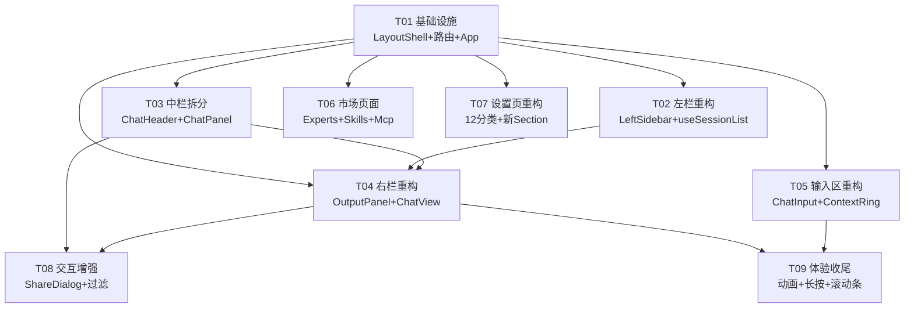

# kmaster-studio UI 重设计 — 技术方案

> **版本**：v1.0  
> **作者**：高见远（架构师）  
> **日期**：2025-08-04  
> **上游依赖**：[PRD](./REQUIREMENT-ui-redesign.md)  
> **技术栈约束**：Vue 3 + Naive UI 2.41 + SCSS（CSS 变量双主题），不引入新 UI 框架

---

## 1. 实现方案

### 1.1 核心挑战与决策

| 挑战 | 分析 | 决策 |
|------|------|------|
| **全局布局重构** | 当前 `AppNav + router-view` 是扁平结构，需升级为「LayoutShell 全屏 + 嵌套路由」，同时保持现有 7 条路由及 View 组件可工作 | 插入 `LayoutShell` 作为父路由组件，包裹 `<router-view>`；`AppNav` 废弃但不删除 |
| **SessionList 逻辑迁移** | SessionList.vue 含搜索/右键菜单/拖拽/导出/重命名约 200 行业务逻辑，直接内联到 LeftSidebar 会导致 600+ 行超大组件 | **提取 `useSessionList` composable**（已由主理人拍板），LeftSidebar 消费 composable |
| **ChatInput 三区结构** | 当前 ChatInput 是单行 textarea + 工具栏的简单结构，需重构为 Agent 标签栏 / 输入体 / 底栏三区，复杂度最高 | 原地重构 ChatInput.vue，拆分内部子区域为 `<template>` 区块 + 抽取 ContextRing 为独立组件 |
| **OutputPanel 替代 ArtifactPanel** | ArtifactPanel 当前是「预览/文件/终端」Tab 结构，需转为「任务概览 + 多产物标签」结构 | **新建 OutputPanel.vue**，复用 ArtifactPanel 中 AgentMarkdown/iframe 预览/FileTreePane/TerminalPane 的渲染逻辑，不删除 ArtifactPanel.vue |
| **Agent 状态数据** | 无后端 Agent status 端点 | 先用 mock 数据（`types/agent.ts` 静态字典），验证 UI 后补后端 |
| **设置页 12 分类** | 当前 SettingsView 是 7 分组平铺，改造成本高但架构清晰 | 保留现有 4 个 Section 组件不动，新增 5 个 Section，SettingsView 自身重构为 12 分类左栏导航 |

### 1.2 框架与模式

- **UI 框架**：Naive UI 2.41（不动，不引入新框架）
- **架构模式**：LayoutShell（容器组件） + 路由分发（嵌套路由） + Pinia 状态共享
- **样式方案**：SCSS scoped + CSS 变量双主题（`--km-*` 系列），不变更
- **状态管理**：Pinia 4 store 保留，chat store 新增 agent mock / session pin 字段
- **逻辑复用**：提取 `useSessionList`、`useSkillList`、`useMcpList` 三个 composable

---

## 2. 组件树

### 2.1 应用根拓扑

```
App.vue（仅 NConfigProvider 包裹）
└── LayoutShell.vue（全屏 flex row）
    ├── LeftSidebar.vue（始终渲染，260-500px 可拖拽）
    │   ├── km-sidebar-top       ← 版本号 / 搜索 / 过滤
    │   ├── km-sidebar-menu      ← 新建任务 / 专家 / 技能 / MCP / 定时任务
    │   ├── km-sidebar-lists     ← 置顶任务 / workspace 分组 / 定时任务
    │   └── km-sidebar-bottom    ← 设置 / theme 开关
    │
    └── <router-view>（flex:1）
        ├── /          → ChatView.vue（三栏子布局）
        │   ├── ChatHeader.vue
        │   ├── ChatPanel.vue（含 MessageList + ChatInput）
        │   └── OutputPanel.vue
        │
        ├── /experts   → ExpertsView.vue（卡片网格 + NDrawer 详情）
        ├── /skills    → SkillsView.vue（卡片网格 + NDrawer 详情）
        ├── /mcp       → McpView.vue（卡片网格 + NDrawer 详情）
        ├── /jobs      → JobsView.vue（保留不动）
        ├── /memory    → MemoryView.vue（保留不动）
        ├── /usage     → UsageView.vue（保留不动）
        ├── /queue     → QueueView.vue（保留不动）
        ├── /settings  → SettingsView.vue（双栏 12 分类重构）
        └── /*         → redirect /
```

### 2.2 ChatView 三栏子布局（仅 `/` 路由）

```
ChatView.vue（flex row）
├── ChatHeader.vue
│   ├── 左侧：折叠左栏图标 + 任务 title
│   └── 右侧：搜索 / 分享 / 提问历史 / 折叠右栏图标
├── ChatPanel.vue（flex:1）
│   ├── MessageList.vue（微调：Agent 标签可点击过滤）
│   └── ChatInput.vue（三区重构）
│       ├── Agent 标签平铺栏
│       ├── 输入主体（chip + textarea + [+] 面板）
│       └── 底栏（workspace / mode / agent / ContextRing / 模型 / 发送）
└── OutputPanel.vue（340-500px 可拖拽）
    ├── 标签栏（任务概览 + 动态产物标签 + 全屏）
    └── 内容区（任务概览 / 产物预览 / URL 工具栏）
```

---

## 3. 路由设计

### 3.1 嵌套路由结构

```typescript
// router/index.ts

const routes: RouteRecordRaw[] = [
  {
    path: '/',
    component: () => import('../components/layout/LayoutShell.vue'),  // 父路由
    children: [
      { path: '',           name: 'chat',     component: ChatView,                                                        meta: { title: '聊天' } },
      { path: 'experts',    name: 'experts',  component: () => import('../views/ExpertsView.vue'),   meta: { title: '专家市场' } },
      { path: 'skills',     name: 'skills',   component: () => import('../views/SkillsView.vue'),    meta: { title: '技能市场' } },
      { path: 'mcp',        name: 'mcp',      component: () => import('../views/McpView.vue'),       meta: { title: 'MCP 管理' } },
      { path: 'memory',     name: 'memory',   component: () => import('../views/MemoryView.vue'),    meta: { title: '记忆' } },
      { path: 'jobs',       name: 'jobs',     component: () => import('../views/JobsView.vue'),      meta: { title: '自动化' } },
      { path: 'usage',      name: 'usage',    component: () => import('../views/UsageView.vue'),     meta: { title: '用量' } },
      { path: 'queue',      name: 'queue',    component: () => import('../views/QueueView.vue'),     meta: { title: '队列' } },
      { path: 'settings',   name: 'settings', component: () => import('../views/SettingsView.vue'),  meta: { title: '设置' } },
      { path: ':pathMatch(.*)*', redirect: '/' },
    ],
  },
];
```

### 3.2 路由变更清单

| 操作 | 路径 | 组件 | 说明 |
|------|------|------|------|
| **新增父路由** | `/` | `LayoutShell.vue` | 所有页面父容器，提供 LeftSidebar |
| **重构** | `/` | `ChatView.vue` | 移除 SessionList，仅管理 ChatPanel+OutputPanel |
| **新增** | `/experts` | `ExpertsView.vue` | 懒加载 |
| **新增** | `/skills` | `SkillsView.vue` | 懒加载 |
| **新增** | `/mcp` | `McpView.vue` | 懒加载 |
| **保留** | `/memory`~`/settings` | 各 View | 路由路径不变，`settings` 内部重构 |
| **移除** | — | 扁平路由结构 | 迁移到嵌套路由，`ChatView` 不再为根组件 |

---

## 4. 数据流设计

### 4.1 Pinia Store 变更

#### chat store（改造）

| 变更 | 字段/方法 | 类型 | 说明 |
|------|-----------|------|------|
| **新增** | `pinnedSessions` | `Ref<Set<string>>` | 置顶 session id 集合 |
| **新增** | `agentStates` | `Ref<Record<string, AgentStatus>>` | Agent 角色状态（mock 数据源，后续切 API） |
| **新增** | `togglePin(sid)` | `() => void` | 切换会话置顶 |
| **新增** | `getGroupedSessions` | `ComputedRef<GroupedSessions>` | 按置顶/workspace/定时分组 |
| **保留** | 现有全部字段和方法 | — | 不删除、不改签名 |

#### 新建 agent store（可选，轻量）

| 字段 | 类型 | 说明 |
|------|------|------|
| `agents` | `AgentDef[]` | Agent 角色定义（名称/图标/描述） |
| `activeAgents` | `AgentStatus[]` | 当前活跃 Agent 状态列表（mock） |

### 4.2 Composable 提取

| Composable | 来源 | 提取内容 |
|------------|------|----------|
| `useSessionList` | `SessionList.vue` | `search`/`list`(computed)/`editingId`/`editTitle`/`startRename`/`commitRename`/`remove`/`doExport`/`exportingId`/`dragIdx`/`onDragStart`/`onDragOver`/`onDrop`/`onDragEnd`/`contextMenu`/`openMenu`/`closeMenu`/`onMenuAction`/`abbreviateWorkspace` |
| `useSkillList` | `SkillPanel.vue` | 技能列表搜索/过滤/排序/安装/卸载逻辑 |
| `useMcpList` | `McpManager.vue` | MCP 服务器列表增删改查逻辑 |

### 4.3 数据流向图

```
┌──────────────────────────────────────────────────────────────┐
│                    Pinia chat store                          │
│  sessions / messagesBySession / runState / agentStates / …  │
└──────┬───────────────┬───────────────┬──────────────────────┘
       │               │               │
       ▼               ▼               ▼
┌──────────────┐ ┌───────────┐ ┌──────────────┐
│ LeftSidebar  │ │ ChatPanel │ │ OutputPanel  │
│ (消费        │ │ (消费      │ │ (消费        │
│  sessions    │ │  messages │ │  artifacts   │
│  agentStates │ │  runState │ │  usage       │
│  via         │ │  agentSt. │ │              │
│  useSession  │ │           │ │              │
│  List)       │ │           │ │              │
└──────┬───────┘ └─────┬─────┘ └──────────────┘
       │               │
       │ 切换会话       │ 发送消息
       │               │
       ▼               ▼
  store.openSession  store.sendMessage
  (更新 activeSess-  (emit Socket.IO
   ionId)            → 更新 messages)
```

---

## 5. 文件列表

### 5.1 新建文件

| # | 文件路径 | 说明 |
|---|----------|------|
| 1 | `packages/client/src/components/layout/LayoutShell.vue` | 应用根布局：LeftSidebar + router-view |
| 2 | `packages/client/src/components/layout/LeftSidebar.vue` | 左栏：搜索/菜单/任务分组列表/底栏 |
| 3 | `packages/client/src/components/chat/ChatHeader.vue` | 中栏顶部状态栏（从 ChatPanel 拆出） |
| 4 | `packages/client/src/components/chat/OutputPanel.vue` | 右栏标签式产物面板（替代 ArtifactPanel） |
| 5 | `packages/client/src/components/chat/ContextRing.vue` | SVG 上下文用量环图 |
| 6 | `packages/client/src/components/chat/ShareDialog.vue` | 任务分享弹窗（链接+过期时间） |
| 7 | `packages/client/src/views/ExpertsView.vue` | 专家市场整页（卡片网格） |
| 8 | `packages/client/src/views/SkillsView.vue` | 技能市场整页（卡片网格） |
| 9 | `packages/client/src/views/McpView.vue` | MCP 管理整页（卡片网格） |
| 10 | `packages/client/src/components/settings/AgentRoleSection.vue` | 设置页 Agent 角色管理分组 |
| 11 | `packages/client/src/components/settings/ToolsSection.vue` | 设置页 Tools 管理分组 |
| 12 | `packages/client/src/components/settings/ModelManageSection.vue` | 设置页模型管理分组 |
| 13 | `packages/client/src/components/settings/MonitorSection.vue` | 设置页监控分组 |
| 14 | `packages/client/src/composables/useSessionList.ts` | SessionList 核心逻辑提取 |
| 15 | `packages/client/src/composables/useSkillList.ts` | 技能列表操作逻辑提取 |
| 16 | `packages/client/src/composables/useMcpList.ts` | MCP 列表操作逻辑提取 |
| 17 | `packages/client/src/types/agent.ts` | Agent 状态类型定义 + mock 数据 |

### 5.2 改造文件

| # | 文件路径 | 改造内容 |
|---|----------|----------|
| 18 | `packages/client/src/App.vue` | 移除 AppNav 导入，改为 LayoutShell 包裹；移除 `<div class="km-app">` 布局样式；保留 NConfigProvider / socket 初始化 / 全局键盘 |
| 19 | `packages/client/src/router/index.ts` | 插入 LayoutShell 父路由；新增 3 条子路由；ChatView 改为子路由组件 |
| 20 | `packages/client/src/views/ChatView.vue` | 移除 SessionList/SkillPanel/McpManager/SettingsDrawer 导入；移除 left sidebar toggle/resize；保留 ChatHeader+ChatPanel+OutputPanel 三栏；保留折叠按钮（通过 LayoutShell 通信） |
| 21 | `packages/client/src/components/chat/ChatPanel.vue` | 移除 `<header class="km-chat-head">` 区块（迁入 ChatHeader）；保留 MessageList + ChatInput |
| 22 | `packages/client/src/components/chat/ChatInput.vue` | 大幅重构为三区结构（Agent 标签栏 / 输入体 / 底栏）；新增 Agent 标签平铺、[+] 面板、ContextRing 集成、长按发送菜单 |
| 23 | `packages/client/src/components/chat/MessageList.vue` | 新增 Agent 角色标签可点击过滤功能 |
| 24 | `packages/client/src/views/SettingsView.vue` | 改为 12 分类左栏导航 + 底栏状态；新增 Section 渲染；保留现有 4 个 Section 组件 |
| 25 | `packages/client/src/stores/chat.ts` | 新增 `pinnedSessions`/`agentStates` 字段及 `togglePin`/`getGroupedSessions` 方法 |

### 5.3 废弃（保留不删）

| # | 文件路径 | 说明 |
|---|----------|------|
| 26 | `packages/client/src/components/AppNav.vue` | 导航迁入 LeftSidebar，标记 `@deprecated` |
| 27 | `packages/client/src/components/chat/SessionList.vue` | 逻辑迁入 useSessionList composable + LeftSidebar，标记 `@deprecated` |
| 28 | `packages/client/src/components/chat/ArtifactPanel.vue` | 被 OutputPanel.vue 替代，标记 `@deprecated` |

### 5.4 保留不动

MessageItem, AgentMarkdown, ThoughtBlock, ToolCallCard, ApprovalCard, ClarifyCard, PlanCard, SubagentCard, UsageBar, SettingsDrawer, GeneralSection, ProviderSection, ProfileSection, DiagnosticsSection, FileTreePane, TerminalPane, SkillPanel, McpManager, MemoryView, JobsView, UsageView, QueueView

---

## 6. 有序任务列表

### 任务总览

| ID | 名称 | 文件数 | 优先级 | 依赖 |
|----|------|--------|--------|------|
| T01 | 项目基础设施：LayoutShell + 路由 + App.vue | 4 | P0 | — |
| T02 | 左栏重构：LeftSidebar + useSessionList composable | 3 | P0 | T01 |
| T03 | 中栏拆分：ChatHeader + ChatPanel 去头 | 2 | P0 | T01 |
| T04 | 右栏重构：OutputPanel + ChatView 三栏集成 | 3 | P0 | T01,T02,T03 |
| T05 | 输入区重构：ChatInput 三区 + ContextRing + Agent Mock | 3 | P0 | T01 |
| T06 | 市场页面：ExpertsView + SkillsView + McpView + composable | 5 | P1 | T01 |
| T07 | 设置页重构：12 分类 + 新 Section 组件 | 6 | P1 | T01 |
| T08 | 交互增强：ShareDialog + ChatHeader 增强 + MessageList 过滤 | 3 | P1 | T03,T04 |
| T09 | 体验收尾：动画过渡 + 长按菜单 + 滚动条样式 | 3 | P2 | T04,T05 |

---

### T01 — 项目基础设施：LayoutShell + 路由 + App.vue

| 项 | 内容 |
|----|------|
| **目标** | 建立新布局骨架，所有路由统一走 LayoutShell 父路由 |
| **文件** | 新建 `components/layout/LayoutShell.vue`；修改 `App.vue`、`router/index.ts`；废弃 `components/AppNav.vue` |
| **关键实现** | LayoutShell 内部 `flex row`，LeftSidebar 固定左侧 + `<router-view>` 占剩余空间；App.vue 删 AppNav 导入，仅保留 NConfigProvider 链 + socket 初始化；路由改为嵌套结构，ChatView 变为子路由 |
| **验收** | 所有 9 条路由可正常访问；LeftSidebar 在所有页面可见；AppNav 不再渲染 |
| **注意事项** | App.vue 中的 `registerSocket()` / `loadQueue()` 逻辑不移除，仅换壳；全局键盘事件保持；注意 hash 路由模式下嵌套路由 path 写法 |

---

### T02 — 左栏重构：LeftSidebar + useSessionList composable

| 项 | 内容 |
|----|------|
| **目标** | 实现完整的 LeftSidebar（顶端图标栏 + 按钮菜单 + 分组任务列表 + 底栏），同时提取 useSessionList composable |
| **文件** | 新建 `components/layout/LeftSidebar.vue`、`composables/useSessionList.ts`；废弃 `components/chat/SessionList.vue`（标记 @deprecated） |
| **关键实现** | 从 SessionList.vue 提取 search/list/rename/export/drag/contextMenu 到 useSessionList；LeftSidebar 消费此 composable 并增加 UI 分区（搜索+过滤、按钮菜单、置顶/workspace/定时三组列表、底栏设置+theme）；左右拖拽调整宽度（复用 ChatView 现有 resize 逻辑，上提到 LayoutShell） |
| **验收** | 左栏可搜索过滤会话、右键菜单正常、拖拽排序正常、新建/切换会话正常；点击专家/技能/MCP/定时任务按钮跳转对应路由；theme 开关正常 |
| **注意事项** | SessionList.vue 的 `defineExpose({ focusSearch })` 需在 LeftSidebar 中保留；Workspace 分组逻辑依赖 store.sessions 的 workspace 字段；置顶状态暂存内存（后续可持久化） |

---

### T03 — 中栏拆分：ChatHeader + ChatPanel 去头

| 项 | 内容 |
|----|------|
| **目标** | 从 ChatPanel.vue 拆分出 ChatHeader.vue，增强顶栏功能 |
| **文件** | 新建 `components/chat/ChatHeader.vue`；修改 `components/chat/ChatPanel.vue` |
| **关键实现** | ChatHeader：左侧折叠左栏图标（emit 事件给 LayoutShell/ChatView）+ 当前任务 title；右侧搜索图标（弹出搜索输入）/ 分享图标（emit）/ 提问历史图标 / 折叠右栏图标（emit）；ChatPanel.vue 删除 `<header class="km-chat-head">` 整段及关联样式/逻辑，保留 MessageList + ChatInput |
| **验收** | 顶栏显示当前会话 title；折叠左栏/右栏按钮可触发面板收起（由父组件处理）；模式/模型 badge 显示正常；停止按钮在 running 时出现 |
| **注意事项** | 当前 ChatPanel 中的 `currentModeLabel`/`currentModelName`/theme toggle/stop button 全部迁入 ChatHeader；emit 事件接口设计要简洁 |

---

### T04 — 右栏重构：OutputPanel + ChatView 三栏集成

| 项 | 内容 |
|----|------|
| **目标** | 新建 OutputPanel.vue 替代 ArtifactPanel；ChatView 重组为 ChatHeader/ChatPanel/OutputPanel 三栏 |
| **文件** | 新建 `components/chat/OutputPanel.vue`；修改 `views/ChatView.vue`；废弃 `components/chat/ArtifactPanel.vue` |
| **关键实现** | OutputPanel 结构：(A) 顶栏标签 — 标签目录图标 + 任务概览（固定）+ 动态产物标签 + 全屏按钮；(B) 主体 — 任务概览面板（PlanCard + 产物列表）和产物预览面板（URL 地址栏 + copy/下载/分享/刷新/浏览器/文件夹 + iframe/AgentMarkdown/img/pre）用 v-show 切换；ChatView 移除 SessionList/SkillPanel/McpManager/SettingsDrawer，改为 ChatHeader+ChatPanel+OutputPanel 三栏 flex 布局；保留全屏模式（覆盖中+右栏）、拖拽调整右栏宽度、折叠按钮 |
| **验收** | 产物在右栏标签打开/关闭正常；URL 地址栏可编辑回车刷新；全屏按钮覆盖中栏+右栏；任务概览显示 PlanCard 和产物列表 |
| **注意事项** | ArtifactPanel 中的 FileTreePane/TerminalPane/KeepAlive 逻辑需保留但不迁入 OutputPanel v1（暂仅支持预览/任务概览）；v-show 而非 v-if 保持 iframe 状态；全屏时保留 LeftSidebar（已决策） |

---

### T05 — 输入区重构：ChatInput 三区 + ContextRing + Agent Mock

| 项 | 内容 |
|----|------|
| **目标** | 将 ChatInput 重构为「Agent 标签栏 + 输入体 + 底栏」三区结构，新建 ContextRing 组件，建立 Agent 状态 mock |
| **文件** | 修改 `components/chat/ChatInput.vue`；新建 `components/chat/ContextRing.vue`、`types/agent.ts` |
| **关键实现** | (A) Agent 标签栏 — 从 store.agentStates 读取活跃 Agent，平铺标签（名称+状态图标+关闭按钮），超出显示「更多▾」下拉；(B) 输入体 — 上下文 chip 行（技能/MCP/Agent/文件标签）+ textarea + [+] 按钮弹出 NPopover（搜索添加技能/MCP/Agent/文件）；(C) 底栏 — workspace 选择 / 执行模式 NSelect / Agent 角色 NSelect / ContextRing / ✨增强提示词 / 模型 NSelect / 🎤 / 发送按钮；ContextRing 纯 SVG CSS 实现环图，颜色随用量变化 |
| **验收** | Agent 标签正确显示 14 种状态图标和颜色；[+] 面板可搜索添加上下文 chip；输入框底栏各控件功能正常；ContextRing 颜色随 ctx_percent 变化 |
| **注意事项** | 保持现有 send/steer/edit/upload/workspace 逻辑不丢失；agent.ts 中 mock 数据覆盖 PRD 中 14 种状态；NPopover 面板搜索逻辑先做前端过滤 |

---

### T06 — 市场页面：ExpertsView + SkillsView + McpView + composable

| 项 | 内容 |
|----|------|
| **目标** | 创建三个卡片式浏览页面，提取技能和 MCP 操作逻辑为 composable |
| **文件** | 新建 `views/ExpertsView.vue`、`views/SkillsView.vue`、`views/McpView.vue`、`composables/useSkillList.ts`、`composables/useMcpList.ts` |
| **关键实现** | 三页面共享同一模板结构：顶栏（搜索框 + 精选/全部/分类 Tab + 排序下拉）+ CSS Grid 卡片网格（图标/title/摘要/keywords/操作按钮）+ 点击卡片展开 NDrawer 详情（增删改查）；useSkillList 从 SkillPanel.vue 提取技能列表加载/搜索/过滤/安装/卸载逻辑；useMcpList 从 McpManager.vue 提取 MCP 服务器增删改查逻辑 |
| **验收** | 三页面可正常浏览卡片；搜索过滤排序可用；点击卡片展示详情 Drawer；操作按钮可触发 store action |
| **注意事项** | SkillPanel.vue 和 McpManager.vue 原抽屉组件保留不动（聊天页仍使用）；composable 是提取公共逻辑，不修改原组件行为 |

---

### T07 — 设置页重构：12 分类 + 新 Section 组件

| 项 | 内容 |
|----|------|
| **目标** | 将 SettingsView 从 7 分组扩展为 12 分类左栏导航，新增 5 个 Section 组件，增加底栏状态 |
| **文件** | 修改 `views/SettingsView.vue`；新建 `components/settings/AgentRoleSection.vue`、`ToolsSection.vue`、`ModelManageSection.vue`、`MonitorSection.vue` |
| **关键实现** | 左栏：12 分类导航按钮（系统设置/账号设置/Agent角色/Skill管理/MCP管理/Tools管理/Plugins管理/Channel管理/记忆管理/模型管理/定时任务/监控）+ 底栏 4 行状态（账户登录/bridge灯/版本号+theme/返回对话）；右栏：保留 4 现有 Section + 新增 5 Section（AgentRole/Tools/Plugins→占位/Channel→占位/ModelManage/Monitor — 其中 Plugins/Channel 为占位 Section 显示「开发中」）；分类高亮滚动的 updateActive 逻辑保留 |
| **验收** | 12 分类导航可点击滚动到对应 Section；新增 Section 渲染占位内容（工具管理/模型管理/监控可用 mock 数据）；底栏显示 bridge 连接状态灯 |
| **注意事项** | 保留现有 SettingsDrawer.vue 不动；Skills 和 MCP 分类仍复用 SkillPanel/McpManager 抽屉；PluginsSection/ChannelSection 为占位，不在本轮创建单独文件 |

---

### T08 — 交互增强：ShareDialog + ChatHeader 增强 + MessageList 过滤

| 项 | 内容 |
|----|------|
| **目标** | 实现任务分享弹窗、ChatHeader 历史/分享/搜索交互、MessageList Agent 角色过滤 |
| **文件** | 新建 `components/chat/ShareDialog.vue`；修改 `components/chat/ChatHeader.vue`、`components/chat/MessageList.vue` |
| **关键实现** | ShareDialog：NModal 包裹，含分享链接（mock 生成）+ 过期时间选择（NSelect：1h/24h/7d/永久）+ 复制按钮���navigator.clipboard）；ChatHeader 历史图标：点击拉取当前会话消息摘要列表（computed 从 store.messagesBySession 派生），点击摘要 scrollIntoView；搜索图标：聚焦 LeftSidebar 搜索（通过 LayoutShell provide/inject）；MessageList：从 store.agentStates 获取当前 Agent，消息列表中 Agent 角色标签可点击过滤（computed 过滤） |
| **验收** | 分享弹窗可复制链接和选择过期时间；历史列表可点击定位消息；Agent 角色标签点击过滤消息列表 |
| **注意事项** | 分享链接为 mock（后续对接后端生成）；MessageList 过滤为纯前端 computed 过滤 |

---

### T09 — 体验收尾：动画过渡 + 长按菜单 + 滚动条样式

| 项 | 内容 |
|----|------|
| **目标** | 补齐 P2 体验细节：面板折叠动画、右栏滚动条、发送按钮长按菜单 |
| **文件** | 修改 `components/chat/ChatInput.vue`（长按菜单）、`components/chat/OutputPanel.vue`（滚动条）、全局样式补充 |
| **关键实现** | 面板折叠：LeftSidebar 和 OutputPanel 使用 CSS `transition: width 250ms ease-out`；发送按钮：`@mousedown` + `setTimeout(500ms)` 触发长按 → NPopover 弹出 /interrupt /steer /queue 三选项；OutputPanel 滚动条：`::-webkit-scrollbar` 自定义（细条 + hover 高亮，暗色/亮色双主题）；标签切换、面板展开收起均加 CSS transition |
| **验收** | 左栏/右栏折叠有流畅动画；长按发送按钮 500ms 弹出模式菜单；右栏滚动条自定义样式正常 |
| **注意事项** | 长按需处理 `mouseup` 取消定时器（正常点击 <500ms 仍发消息）；滚动条样式不破坏现有布局 |

---

## 7. 关键风险

| # | 风险 | 影响 | 概率 | 缓解措施 |
|---|------|------|------|----------|
| R1 | **ChatInput 三区重构导致现有 send/steer/edit/upload 逻辑回归** | ChatInput 是用户最高频操作入口，改动大、状态多 | 中 | 保留现有 `<script setup>` 中所有函数签名不变，仅重构 template/CSS；逐区增量替换，每区完成后验证 send 流程 |
| R2 | **LayoutShell 嵌套路由破坏现有页面布局** | 所有非聊天页（memory/jobs/usage/queue/settings）都经过 LayoutShell，高度计算可能出错 | 中 | LayoutShell 的 `height: 100%` 继承链要确保完整（html→body→#app→LayoutShell）；各子页面用 `height: 100%` 而非 `100vh` |
| R3 | **SessionList → useSessionList 提取遗漏状态** | SessionList 含约 15 个 ref/computed，遗漏一个会导致左栏功能缺失 | 低 | 逐行对比 SessionList.vue `<script>` 与 useSessionList.ts 的方法清单；左栏完成后跑一遍右键菜单/拖拽/导出/重命名全流程 |
| R4 | **ChatView 移除 SessionList 后 ChatPanel 宽度计算异常** | ChatView 当前的 flex 布局依赖 SessionList 的固定宽度做基准 | 低 | 新 ChatView 仅含 ChatHeader+ChatPanel+OutputPanel，ChatPanel `flex:1` 自适应，已在 PRD 中验证可行 |
| R5 | **12 分类设置页与现有 4 个 Section 组件的 props/slot 契约冲突** | 现有 Section 组件可能依赖 SettingsView 的 provide 或特定父组件上下文 | 低 | 审计 4 个 Section 组件的 props/inject 依赖；若有用 provide，在重构后的 SettingsView 中保持注入 |

---

## 8. 待明确

| # | 问题 | 上下文 |
|---|------|--------|
| Q1 | **Workspace 分组数据来源**：store.sessions 中的 workspace 字段，现有数据中是否已有 workspace 路径？分组时按完整路径还是按末级目录名？ | PRD P1-03：workspace 分组显示 |
| Q2 | **定时任务对话列表**：jobs/automation 页面的数据模型是否与 chat sessions 共用？还是需要新建 store 查询？ | PRD P1-03：定时任务分组 |
| Q3 | **PluginsSection / ChannelSection**：这两个 Section 是完全占位（"开发中"），还是需要在 T07 中创建基本骨架？ | PRD 6.3 未列出 PluginsSection / ChannelSection 为新建组件 |
| Q4 | **ChatHeader 搜索图标行为**：是弹出独立的搜索 popover 在当前页搜索消息，还是聚焦 LeftSidebar 搜索框？（PRD 两处描述有歧义：4.1 P0-03 说"弹出搜索输入"，4.3 P2-04 说"历史图标点击展示历史提问列表"） | PRD P0-03 vs P2-04 |
| Q5 | **OutputPanel 是否保留 FileTreePane/TerminalPane**：当前 ArtifactPanel 有"预览/文件/终端"三个 Tab，PRD OutputPanel 设计未显式提及文件/终端标签 | PRD 5.4：仅提及"任务概览"和"产物预览" |

---

## 附录 A：Mermaid 图索引

- 组件类图：见 `docs/design/class-diagram-ui-redesign.mermaid`
- 关键交互序列图：见 `docs/design/sequence-diagram-ui-redesign.mermaid`

## 附录 B：任务依赖图



> 注：T06/T07 仅依赖 T01，可与 T02-T05 并行开发；T08/T09 为串行后置任务。
