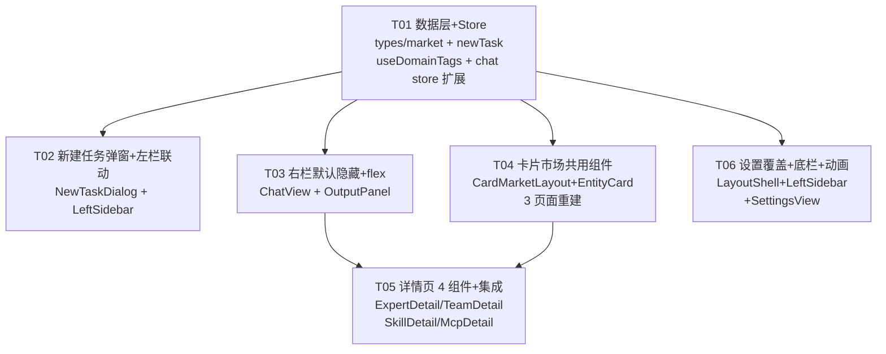

# kmaster-studio UI V2 — 技术方案

> **版本**：v2.0
> **作者**：高见远（架构师）
> **日期**：2025-08
> **语言**：简体中文
> **上游依赖**：[V2 PRD](./REQUIREMENT-ui-v2.md) · [V1 技术方案](./TECHNICAL-SOLUTION-ui-redesign.md)
> **V1 基线**：commit `1218e64`，LayoutShell 三栏全屏布局已交付
> **增量范围**：在 V1 三栏骨架之上迭代交互细节，不改变布局架构

---

## 1. 实现方案

### 1.1 5 大改动技术路线

| # | 改动 | 核心挑战 | 技术决策 |
|---|------|----------|----------|
| **A** | 新建任务弹窗 | 7 项配置表单 + 弹窗关闭后 session 创建 + 左栏高亮联动 | NModal + reactive 表单对象，emit 配置对象给 LeftSidebar 调用 `store.createSession` 变体 |
| **B** | 会话切换 + 右栏默认隐藏 | ChatView 三栏需感知"是否有产出/详情"才展开右栏 | `rightPanelMode` 三态（`hidden`/`output`/`detail`），`hidden` → `width:0; overflow:hidden`，产出到达 → `output` → CSS transition 展开 |
| **C** | 右栏避让 | V1 已用 flex row 布局，需确认不被压缩/覆盖 | ChatView body 已是 `display:flex`，OutputPanel 加 `flex-shrink:0` + 固定 `width`，ChatPanel `flex:1; min-width:400px` 即满足 |
| **D** | 卡片市场共用布局 | 三页面共享布局但实体类型不同（专家/技能/MCP），需在共用组件中通过 props/slots 区分 | CardMarketLayout 通过 slot + props 注入差异；EntityCard 通过 `entity.actionType` 控制按钮文字和回调 |
| **E** | 设置覆盖导航 + 底栏精简 | 设置页替换 LeftSidebar 而非路由跳转 | `settingsOverlay: Ref<boolean>` 在 LayoutShell 层管理，通过 provide 传给 LeftSidebar + SettingsView；SettingsView 在 overlay 模式隐藏自身左栏导航 |

### 1.2 关键设计模式

- **LayoutShell 新增 provide**：`settingsOverlay`（boolean），LeftSidebar 和 SettingsView 均 inject 此值来决定渲染模式
- **OutputPanel 模式机**：`mode: 'hidden' | 'output' | 'detail'` → 驱动右栏展开/关闭、内容区切换
- **EntityCard 小 props 大差异**：`entity: EntityDef` 联合类型，`actionType` 决定按钮文案（召唤/安装/卸载/部署/卸载+test），父组件监听 `@action` 事件
- **领域标签频度**：`useDomainTags()` composable 封装 localStorage 读写，CardMarketLayout 消费

---

## 2. 文件清单

### 2.1 新建文件

| # | 文件路径 | 说明 |
|---|----------|------|
| 1 | `packages/client/src/types/market.ts` | 卡片市场类型定义（CardItem / Expert / ExpertTeam / Skill / McpServer）+ MOCK 数据（30+30+10+20 条） |
| 2 | `packages/client/src/types/newTask.ts` | 新建任务配置类型（NewTaskConfig） |
| 3 | `packages/client/src/composables/useDomainTags.ts` | 领域标签 localStorage 频度排序逻辑 |
| 4 | `packages/client/src/components/dialog/NewTaskDialog.vue` | 新建任务 7 项配置 NModal 弹窗 |
| 5 | `packages/client/src/components/market/CardMarketLayout.vue` | 卡片市场共用布局（搜索+精选+分类标签+网格+分页） |
| 6 | `packages/client/src/components/market/EntityCard.vue` | 共用卡片组件（图标/名称/简介/标签/操作按钮） |
| 7 | `packages/client/src/components/market/ExpertDetail.vue` | 专家详情（名称+专长+场景+Prompts+标签+召唤） |
| 8 | `packages/client/src/components/market/TeamDetail.vue` | 专家团详情（同上 + 成员卡片 list + 召唤） |
| 9 | `packages/client/src/components/market/SkillDetail.vue` | 技能详情（名称英文+来源+简介+场景+Prompts+安装/卸载） |
| 10 | `packages/client/src/components/market/McpDetail.vue` | MCP 详情（名称英文+来源+能力+场景+JSON+部署/卸载+test） |

### 2.2 改造文件

| # | 文件路径 | 改造内容 |
|---|----------|----------|
| 11 | `packages/client/src/stores/chat.ts` | 新增 `highlightedSessionId`、`rightPanelMode`、`detailEntity`；`createSession` 支持传入配置参数 |
| 12 | `packages/client/src/components/layout/LayoutShell.vue` | 新增 `settingsOverlay` ref + provide；LeftSidebar 条件渲染（overlay 模式下隐藏） |
| 13 | `packages/client/src/components/layout/LeftSidebar.vue` | 新建按钮绑定 NewTaskDialog；高亮闪烁动画；底栏精简为仅 theme 图标；inject `settingsOverlay` 控制显隐 |
| 14 | `packages/client/src/views/ChatView.vue` | 右栏默认隐藏（rightPanelCollapsed 初始 true）；OutputPanel 仅在有产出/详情时展开；rightPanelMode 切换逻辑 |
| 15 | `packages/client/src/components/chat/OutputPanel.vue` | 新增 detail 视图模式；expanded 状态关联 rightPanelMode；集成 4 种详情子组件渲染 |
| 16 | `packages/client/src/views/ExpertsView.vue` | 重写：使用 CardMarketLayout + EntityCard；点击卡片 → store.detailEntity → rightPanelMode='detail' |
| 17 | `packages/client/src/views/SkillsView.vue` | 同上 |
| 18 | `packages/client/src/views/McpView.vue` | 同上 |
| 19 | `packages/client/src/views/SettingsView.vue` | 新增 overlay 模式（inject `settingsOverlay`）：overlay 时隐藏自身左栏 12 分类导航，仅渲染右栏主体；默认激活"监控"分类 |

### 2.3 保留不动

LayoutShell.vue（仅加 provide）、ChatHeader.vue、ChatPanel.vue、ChatInput.vue、MessageList.vue、MessageItem.vue、ContextRing.vue、ShareDialog.vue、SessionList.vue（标记 @deprecated）、ArtifactPanel.vue（标记 @deprecated）、AppNav.vue（标记 @deprecated）以及所有 V1 保留组件。

---

## 3. 组件树变更（V1 → V2）

### 3.1 LayoutShell 层变更

```
V1:                                    V2:
LayoutShell.vue                        LayoutShell.vue
├── LeftSidebar.vue                    ├── [settingsOverlay]
│   ├── km-sidebar-top                 │
│   ├── km-sidebar-menu                ├── LeftSidebar.vue  ← 当 settingsOverlay=true 时隐藏
│   ├── km-sidebar-lists               │   └── + NewTaskDialog(NModal, v-if)  ★ 新增
│   └── km-sidebar-bottom              │   └── 底栏：移除设置按钮文字，仅 NSwitch(🌙/☀️)
│       (NButton 设置 + NSwitch)       │
│                                      ├── SettingsView(overlay)  ★ overlay 模式
└── <router-view>                      │   └── 覆盖 LeftSidebar 位置（绝对定位）
    └── ...                            └── <router-view>
                                           └── ...
```

### 3.2 ChatView 层变更

```
V1:                                    V2:
ChatView.vue                           ChatView.vue
├── ChatHeader.vue                     ├── ChatHeader.vue
└── km-chatview-body (flex row)        └── km-chatview-body (flex row)
    ├── ChatPanel.vue (flex:1)             ├── ChatPanel.vue (flex:1, min-width:400px)
    └── OutputPanel.vue                    └── OutputPanel.vue (flex-shrink:0, width:0→420px)
        └── tabs: [任务概览, 产物...]          ├── 默认 hidden（width:0, overflow:hidden）
                                              ├── 产出到达 → mode='output' → width:420px
                                              └── 点击卡片 → mode='detail'
                                                  ├── ExpertDetail.vue  ★ 新增
                                                  ├── TeamDetail.vue    ★ 新增
                                                  ├── SkillDetail.vue   ★ 新增
                                                  └── McpDetail.vue     ★ 新增
```

### 3.3 市场页面变更（ExpertsView / SkillsView / McpView）

```
V1:                                    V2:
ExpertsView.vue（空壳卡片网格）         ExpertsView.vue
└── 无共用布局                              └── CardMarketLayout.vue  ★ 新建共用
    ├── 无搜索                                 ├── 顶栏：h2 Title + NInput 搜索
    ├── 无精选推荐                             ├── 精选推荐：横向 scroll 5 卡片
    ├── 无分类标签                             ├── 大类标签 NTabs + 排序 NSelect
    └── 无分页                                 ├── 领域标签 NTag 平铺（频度排序）
                                               ├── 卡片网格：CSS Grid 4×5
                                               └── 分页：NPagination(20/50/100)
                                            └── EntityCard.vue  ★ 新建
                                                └── props.entity.actionType 控制按钮

SkillsView.vue（同上）                   SkillsView.vue（同上）
McpView.vue（同上）                      McpView.vue（同上）
```

### 3.4 SettingsView 变更

```
V1:                                    V2:
SettingsView.vue                       SettingsView.vue
├── 左栏 12 分类导航                        ├── [overlay 模式] 隐藏左栏，仅渲染右栏主体
├── 右栏设置主体                            │   └── 右上角 "[← 返回对话]" 按钮
│   ├── GeneralSection                     │   └── 默认激活"监控"分类
│   ├── ...                                │
│   └── MonitorSection                     └── [正常模式] 保留 V1 双栏布局（不变）
└── 底栏 4 行状态
```

---

## 4. 数据结构与接口

### 4.1 新增类型定义

```typescript
// types/market.ts

type EntityType = 'expert' | 'expertTeam' | 'skill' | 'mcp';
type ActionType = 'summon' | 'install' | 'deploy';
type SortOrder = 'default' | 'hot' | 'newest';

interface CardItem {
  id: string;
  name: string;
  icon?: string;
  description: string;
  tags: string[];
  category: string;
  domain: string;
  featured: boolean;
}

interface Expert extends CardItem {
  entityType: 'expert';
  expertise: string;
  scenarios: string[];
  samplePrompts: string[];
  actionType: 'summon';
}

interface ExpertTeam extends CardItem {
  entityType: 'expertTeam';
  skillDesc: string;
  scenarios: string[];
  samplePrompts: string[];
  members: Expert[];
  actionType: 'summon';
}

interface SkillDef extends CardItem {
  entityType: 'skill';
  englishName: string;
  source: 'marketplace' | 'local' | 'url';
  scenarios: string[];
  samplePrompts: string[];
  installed: boolean;
  actionType: 'install';
}

interface McpServerDef extends CardItem {
  entityType: 'mcp';
  englishName: string;
  source: string;
  capabilities: { tools: string[]; resources: string[]; prompts: string[] };
  scenarios: string[];
  samplePrompts: string[];
  deployJson: string;
  deployed: boolean;
  actionType: 'deploy';
  toolSchemas?: ToolSchema[];
  resourceSchemas?: ResourceSchema[];
  promptSchemas?: PromptSchema[];
}

type EntityDef = Expert | ExpertTeam | SkillDef | McpServerDef;
```

```typescript
// types/newTask.ts

type SecurityMode = 'ask' | 'plan' | 'craft' | 'edit-on' | 'allowed-all';

interface NewTaskConfig {
  title: string;
  agentRole: string;
  provider: string;
  model: string;
  skills: string[];
  mcpServers: string[];
  securityMode: SecurityMode;
  workspace: string;
}
```

### 4.2 chat store 增量字段

```typescript
// stores/chat.ts 新增

const highlightedSessionId = ref<string | null>(null);
const rightPanelMode = ref<'hidden' | 'output' | 'detail'>('hidden');
const detailEntity = ref<{ type: EntityType; id: string } | null>(null);

function clearHighlight() {
  highlightedSessionId.value = null;
}

// createSession 签名扩展（可选 config）
async function createSessionWithConfig(config?: Partial<NewTaskConfig>): Promise<string> {
  // 1. 调用 POST /api/sessions（传 config 中的 workspace / model / mode）
  // 2. 将 config.agentRole 写入 modeBySession
  // 3. 设置 highlightedSessionId = session.id
  // 4. 2.5s 后 clearHighlight()
  // 返回 session.id
}

function openDetail(entity: { type: EntityType; id: string }) {
  detailEntity.value = entity;
  rightPanelMode.value = 'detail';
}

function closeDetail() {
  detailEntity.value = null;
  rightPanelMode.value = 'hidden';
}
```

### 4.3 classDiagram

见独立文件：`docs/design/class-diagram-ui-v2.mermaid`

---

## 5. 程序调用流程

### 5.1 新建任务弹窗 → 创建 session

```
sequenceDiagram
    participant User
    participant LSB as LeftSidebar
    participant NTD as NewTaskDialog
    participant Store as chatStore
    participant API as /api/sessions

    User->>LSB: 点击 "➕ 新建任务"
    LSB->>NTD: showNewTaskDialog = true
    NTD-->>User: 展示 NModal 7 项配置表单
    User->>NTD: 填写 title/agent/provider/model/...
    User->>NTD: 点击 "确定"
    NTD->>NTD: 校验 title 非空
    NTD->>LSB: emit('confirm', NewTaskConfig)
    LSB->>Store: createSessionWithConfig(config)
    Store->>API: POST /api/sessions { workspace, model, mode }
    API-->>Store: { session }
    Store->>Store: highlightedSessionId = session.id
    Store->>Store: openSession(session.id)
    Store->>Store: rightPanelMode = 'hidden'
    LSB->>LSB: 更新列表，高亮新会话项
    LSB->>NTD: showNewTaskDialog = false
    LSB->>LSB: router.push('/') 如果不在 /
    Note over Store: 2.5s 后 clearHighlight()
```

### 5.2 卡片市场 → 详情 → 右栏展开

```
sequenceDiagram
    participant User
    participant EV as ExpertsView
    participant CML as CardMarketLayout
    participant EC as EntityCard
    participant Store as chatStore
    participant OP as OutputPanel
    participant Detail as ExpertDetail

    User->>EV: 路由 /experts
    EV->>CML: 渲染 CardMarketLayout
    CML->>CML: 加载 MOCK_EXPERTS，渲染 4×5 网格
    User->>EC: 点击某张卡片
    EC->>CML: emit('select', entity)
    CML->>EV: emit('select', entity)
    EV->>Store: detailEntity = { type: 'expert', id: entity.id }
    EV->>Store: rightPanelMode = 'detail'
    Store-->>OP: rightPanelMode change → expanded=true, width transition
    OP->>OP: 判断 detailEntity.type，渲染 ExpertDetail
    OP->>Detail: props.entity = expert
    Detail-->>User: 展示专家详情
    User->>Detail: 点击 "召唤" 按钮
    Detail->>Store: createSessionWithConfig({ agentRole: expert.id, ...defaults })
    Store->>Store: highlightedSessionId + openSession
    Store->>Store: rightPanelMode = 'hidden'
    OP->>OP: 右栏收起
```

### 5.3 设置 toggle 覆盖

```
sequenceDiagram
    participant User
    participant LSB as LeftSidebar
    participant LS as LayoutShell
    participant SV as SettingsView

    User->>LSB: 点击设置按钮
    LSB->>LS: emit('toggleSettings')
    LS->>LS: settingsOverlay = true
    LS->>LSB: v-if 隐藏（settingsOverlay=true）
    LS->>SV: 渲染 SettingsView(overlay=true)
    SV->>SV: inject settingsOverlay=true → 隐藏自身左栏
    SV->>SV: 默认激活 "监控" tab
    SV-->>User: 设置页覆盖在 LeftSidebar 原位置

    User->>SV: 点击 "返回对话" 或再次点击设置
    SV->>LS: emit('closeSettings')
    LS->>LS: settingsOverlay = false
    LS->>LSB: 恢复渲染
    LS->>SV: 移除 overlay 模式
```

详细序列图见独立文件：`docs/design/sequence-diagram-ui-v2.mermaid`

---

## 6. 任何不明确之处

| # | 问题 | 我的假设 |
|---|------|----------|
| Q1 | **SettingsView overlay 模式下"返回对话"入口** | 团队已拍板 toggle 模式：再点设置按钮即返回。同时 SettingsView overlay 模式右上角增加 `[← 返回对话]` NButton 作为辅助入口 |
| Q2 | **provider/模型默认值来源** | 团队已拍板：先读 `store.globalSettings`，V2 不读 config.yaml 文件 |
| Q3 | **领域标签频度排序持久化** | 团队已拍板：`localStorage` 存储点击计数 |
| Q4 | **NewTaskDialog 中 skills/mcpServers NSelect 数据源** | 从 `store.skills` / `store.mcpServers` 读取（已在 V1 SettingsView 中加载），数据格式与 NSelect options 适配 |
| Q5 | **EntityCard 操作按钮回调** | 召唤 → 调用 `store.createSessionWithConfig`；安装/卸载 → NModal 弹窗（mock 操作结果）；部署/卸载/test → 同 NModal。V2 阶段均可 mock |
| Q6 | **CardMarketLayout 中"大类标签"数据源** | 从 mock 数据的 `category` 字段分组派生（如 "编程开发"、"设计创意"等），不做后端查询 |

---

## 7. 有序任务列表

### 任务总览

| ID | 名称 | 文件数 | 优先级 | 依赖 |
|----|------|--------|--------|------|
| T01 | 数据层 + Store 扩展 | 3 | P0 | — |
| T02 | 新建任务弹窗 + 左栏联动 | 3 | P0 | T01 |
| T03 | 右栏默认隐藏 + flex 避让 + 详情模式 | 2 | P0 | T01 |
| T04 | 卡片市场共用组件 + 三页面重建 | 5 | P0 | T01 |
| T05 | 详情页 4 组件 + OutputPanel 集成 | 5 | P0 | T01,T03,T04 |
| T06 | 设置覆盖导航 + 底栏精简 + 标签频度 + 高亮动画 | 4 | P1 | T01 |

---

### T01 — 数据层 + Store 扩展

| 项 | 内容 |
|----|------|
| **目标** | 创建 V2 所需的类型定义、mock 数据、composable，扩展 chat store 字段 |
| **文件** | **新建** `types/market.ts`（类型定义 + 90 条 MOCK 数据）、`types/newTask.ts`（NewTaskConfig）、`composables/useDomainTags.ts`（localStorage 频度排序）；**改造** `stores/chat.ts`（新增 4 字段 + 3 方法） |
| **关键实现** | (a) `market.ts`：定义 CardItem/Expert/ExpertTeam/SkillDef/McpServerDef 全量类型 + `EntityDef` 联合类型 + `MOCK_EXPERTS`(30)、`MOCK_EXPERT_TEAMS`(10)、`MOCK_SKILLS`(30)、`MOCK_MCP_SERVERS`(20) 四组 mock；(b) `newTask.ts`：NewTaskConfig 接口（7 字段）+ `SECURITY_MODE_OPTIONS` 常量；(c) `useDomainTags.ts`：`getDomainFreq()` / `recordDomainClick(tag)` / `sortedDomains(allTags)` 三个导出函数，底层 `localStorage` key `km-domain-freq`，JSON 存 `Record<string, number>`；(d) `chat.ts` 新增：`highlightedSessionId`、`rightPanelMode`、`detailEntity`、`settingsOverlay`(provide) + `clearHighlight()`、`openDetail()`、`closeDetail()`、`createSessionWithConfig()` |
| **验收** | 类型编译无报错；mock 数据能被 import 并使用；chat store 新字段可读写；useDomainTags localStorage 读写正确 |

---

### T02 — 新建任务弹窗 + 左栏联动

| 项 | 内容 |
|----|------|
| **目标** | 实现 NewTaskDialog 弹窗组件 + LeftSidebar "新建任务"按钮绑定弹窗 → 创建 session → 高亮新会话 |
| **文件** | **新建** `components/dialog/NewTaskDialog.vue`；**改造** `components/layout/LeftSidebar.vue`、`stores/chat.ts`（T01 中的 `createSessionWithConfig`） |
| **关键实现** | (a) NewTaskDialog：NModal 包裹，width 520px，dark 主题背景；表单 7 项：NInput(title)+NSelect(agent, 选项 default/各专家/专家团)+NSelect(provider)+NSelect(model, 联动 provider)+动态 skills list(NSelect 多选 + "+" 按钮逐行追加，每行可删除)+动态 mcpServers list(同 skills)+NSelect(securityMode)+NInput(workspace)；校验 title 非空 → emit('confirm', NewTaskConfig)；provider/model 默认值从 store.globalSettings 读取；(b) LeftSidebar：import NewTaskDialog，`showNewTaskDialog` ref 控制显示；`onConfirm(config)` → `store.createSessionWithConfig(config)` → 弹窗关闭 → 左栏自动展开对应 workspace 分组 → `highlightedSessionId` 驱动 CSS animation（2×300ms background-color pulse）；(c) `highlightedSessionId` 闪烁动画：纯 CSS `@keyframes km-highlight-pulse`，通过 `:class` 绑定 |
| **验收** | 点击新建 → 弹窗 7 项可用；title 为空时确定置灰；确定后弹窗关闭、左栏出现新会话并高亮闪烁、主栏打开对话、右栏隐藏 |
| **依赖** | T01（chat store 新方法） |

---

### T03 — 右栏默认隐藏 + flex 避让 + 详情模式

| 项 | 内容 |
|----|------|
| **目标** | ChatView 右栏默认隐藏；OutputPanel 仅在产出/详情时展开；三栏 flex 不被覆盖 |
| **文件** | **改造** `views/ChatView.vue`、`components/chat/OutputPanel.vue` |
| **关键实现** | (a) ChatView：`rightPanelMode` 初始 `'hidden'`；监听 `store.rightPanelMode` 变化 → 控制 OutputPanel 显隐；样式：`.km-chatview-body { display:flex }` 确保 ChatPanel `flex:1; min-width:400px` + OutputPanel `flex-shrink:0; width:0→420px; transition: width 250ms ease-out; overflow:hidden`；(b) OutputPanel：接收 `mode` prop（或 inject `rightPanelMode`）；`hidden` → width:0 且内部不渲染；`output` → 原有产物标签模式；`detail` → 渲染 4 种 detail 组件之一（通过 `store.detailEntity.type` 判断）；保留原有 NTabs/NTabPane/文件树/终端逻辑不动 |
| **验收** | 默认进入聊天页右栏不可见；发送消息有产物 → 右栏动画展开 420px；ChatPanel 自动缩窄不被覆盖；ChatPanel 最小宽度 ≥400px |
| **依赖** | T01（rightPanelMode 字段） |

---

### T04 — 卡片市场共用组件 + 三页面重建

| 项 | 内容 |
|----|------|
| **目标** | 新建 CardMarketLayout + EntityCard 共用组件，重写 ExpertsView / SkillsView / McpView 使用共用布局 |
| **文件** | **新建** `components/market/CardMarketLayout.vue`、`components/market/EntityCard.vue`；**改造** `views/ExpertsView.vue`、`views/SkillsView.vue`、`views/McpView.vue` |
| **关键实现** | (a) CardMarketLayout：props `{ title, entities, featured, categories, domains }` + emit `{ search, select, sort, page }`；结构：顶栏(h2+搜索 NInput 300ms 防抖) → 精选推荐区(h3+"精选推荐"+5 卡片横向 NScrollbar) → 大类标签行(NTabs/NTag 靠左 + 排序 NSelect 靠右) → 领域标签行(第一位"推荐"NTag，其余按 useDomainTags 排序，超出 NDropdown "...") → CSS Grid 4×5 卡片 → NPagination(20/50/100)；(b) EntityCard：props `entity: EntityDef` + emit `select, action`；NCard 包裹，左上角 NButton(根据 entity.actionType: 召唤/安装卸载/部署卸载)，hover 上浮阴影；(c) ExpertsView/SkillsView/McpView 统一改造：导入 CardMarketLayout + EntityCard，各页面从对应 MOCK 数据加载，卡片点击 → emit('select') → `store.openDetail({ type, id })` |
| **验收** | 三市场页面共用 CardMarketLayout 正常渲染；搜索防抖 300ms；领域标签点击排到第二位；分页切换滚动到顶部；卡片 hover 效果；操作按钮文案正确 |
| **依赖** | T01（mock 数据 + useDomainTags） |

---

### T05 — 详情页 4 组件 + OutputPanel 集成

| 项 | 内容 |
|----|------|
| **目标** | 创建 4 种详情子组件，在 OutputPanel detail 模式下按 `detailEntity.type` 动态渲染 |
| **文件** | **新建** `components/market/ExpertDetail.vue`、`components/market/TeamDetail.vue`、`components/market/SkillDetail.vue`、`components/market/McpDetail.vue`；**改造** `components/chat/OutputPanel.vue` |
| **关键实现** | (a) ExpertDetail：名称+专长描述+应用场景 list+样例 Prompts list+NTags 标签行+右上角"召唤"按钮(sticky)。召唤按钮 → `store.createSessionWithConfig({ agentRole: expert.id })`；(b) TeamDetail：同 ExpertDetail + 成员卡片 list(NCard 网格，点击 → NModal 展示成员纯详情，无召唤)；(c) SkillDetail：名称+英文名+来源 badge+简介+场景+Prompts+标签+右上角"安装/卸载"按钮（点击 → NModal 显示 mock 操作结果）；(d) McpDetail：名称+英文名+来源+tools/resources/prompts 能力简介+场景+Prompts+部署 JSON(代码块)+标签+tools/resources/prompts 卡片 list(点击 → NModal 查看 schema)+右上角"部署/卸载"+"test"按钮（未部署时 test disabled）；(e) OutputPanel：新增 `.km-output-detail` 区域，`v-if="store.rightPanelMode === 'detail'"` 渲染对应 detail 组件（通过 `<component :is>` 动态组件或 v-if 链）；NScrollbar 包裹详情内容 |
| **验收** | 点击市场卡片 → 右栏展开对应详情；4 种详情布局正确；召唤按钮创建新会话并关闭详情；安装/卸载/部署弹窗显示 mock 结果；成员/schema 弹窗为只读模式 |
| **依赖** | T01（detailEntity + openDetail）+ T03（OutputPanel detail 模式入口）+ T04（卡片点击 emit select） |

---

### T06 — 设置覆盖导航 + 底栏精简 + 标签频度 + 高亮动画

| 项 | 内容 |
|----|------|
| **目标** | 实现设置页覆盖左栏 toggle、底栏仅显示 theme 图标、领域标签 localStorage 频度、新会话高亮动画 |
| **文件** | **改造** `components/layout/LayoutShell.vue`、`components/layout/LeftSidebar.vue`、`views/SettingsView.vue` |
| **关键实现** | (a) LayoutShell：新增 `settingsOverlay: Ref<boolean>(false)` + provide。模板：当 `settingsOverlay=true` 时，LeftSidebar 隐藏 → SettingsView 以绝对定位覆盖 LeftSidebar 位置（width 同 leftWidth）；(b) LeftSidebar：inject `settingsOverlay`；当 `settingsOverlay=true` 时不渲染自身（或 `v-show="!settingsOverlay"`）；底栏 `.km-sidebar-bottom` 只保留 NSwitch 月亮/太阳图标，移除 NButton 设置文字(`⚙️ 设置`)；点击设置按钮 → `settingsOverlay = !settingsOverlay`（toggle）；新增 `highlightedSessionId` CSS class 绑定 `km-highlight-pulse` 动画（keyframes: 0%→50%→100% background-color 脉冲）；(c) SettingsView：inject `settingsOverlay`；overlay 模式 → 隐藏自身左栏 12 分类导航（`v-if="!settingsOverlay"`），仅渲染右栏主体+右上角"← 返回对话"按钮；`onMounted` 时默认 `activeCategory = 'monitor'`（仅 overlay 模式下首次加载）；(d) useDomainTags 在 CardMarketLayout 中集成（T04 已做）；(e) 高亮动画：纯 CSS `@keyframes km-highlight-pulse { 0%,100%{background:transparent} 50%{background:var(--km-accent-light)}}`，`.km-session-highlight { animation: km-highlight-pulse 300ms ease-in-out 2 }` |
| **验收** | 点击设置 → LeftSidebar 切换为设置页（覆盖动画 200ms ease-out）；再点设置或"返回对话" → 恢复左栏；底栏仅显示 theme 图标；新会话高亮闪烁 2 次；领域标签按频度排序且刷新后保持 |
| **依赖** | T01（chat store 新字段 + useDomainTags）+ T02（highlightedSessionId） |

---

## 8. 任务依赖图



> **并行策略**：T02/T03/T04/T06 均仅依赖 T01，T01 完成后可并行推进。T05 需要 T03（OutputPanel 模式入口）和 T04（卡片点击 emit select），是串行后置任务。

---

## 9. 关键风险

| # | 风险 | 影响 | 概率 | 缓解措施 |
|---|------|------|------|----------|
| **R1** | **OutputPanel 模式机（hidden/output/detail）状态冲突**：产物到达时用户正在查看详情，或详情打开时产物更新触发 mode 切换 | 右栏内容闪烁或状态丢失 | 中 | 定义清晰的优先级规则：用户手动打开 detail 时锁定模式，产物到达不覆盖；关闭 detail 后恢复检查是否有产物 → 决定 output/hidden；在 `closeDetail()` 中判断 `artifacts.length > 0` 决定后续模式 |
| **R2** | **SettingsView overlay 模式与 V1 双栏模式切换时 DOM 状态残留**：overlay 模式隐藏左栏、默认激活监控，切回正常模式时需要恢复用户之前的分类选择 | 设置页分类状态丢失，用户困惑 | 中 | overlay 模式下 `activeCategory` 独立于正常模式；进入 overlay → 设 `activeCategory = 'monitor'`；退出 overlay → 恢复进入前的 `activeCategory` 值（用 `savedCategory` 变量保存） |
| **R3** | **CardMarketLayout 大数据量下的渲染性能**：mock 数据 90 条（30 专家+10 团+30 技能+20 MCP），配合 4×5 网格 + 分页器切换时可能出现卡顿 | 滚动/分页卡顿 | 低 | 已内置分页（每页 20 条），单页仅渲染 20 张 EntityCard；搜索过滤为前端 computed；若仍有卡顿，后续加 `v-memo` 或虚拟滚动 |

---

## 10. Shared Knowledge（跨任务共享约定）

```
- 所有 MOCK 数据从 types/market.ts 导出，命名 MOCK_EXPERTS / MOCK_EXPERT_TEAMS / MOCK_SKILLS / MOCK_MCP_SERVERS
- Naive UI 组件直接 import { NButton, NModal, ... } from 'naive-ui'，不引入额外 UI 库
- CSS 动画统一使用 CSS transition，时长 200-300ms，ease-out
- SCSS scoped 样式，使用 var(--km-*) 系列 CSS 变量（V1 已定义双主题）
- provide/inject key 统一使用字符串常量：
  - 'leftSidebarCollapsed' → Ref<boolean>
  - 'rightPanelCollapsed' → Ref<boolean>
  - 'outputPanelFullscreen' → Ref<boolean>
  - 'settingsOverlay' → Ref<boolean>        (V2 新增)
- localStorage key 约定：
  - 'km-domain-freq' → Record<string, number>  (领域标签点击频度)
  - 'km-theme' → 'dark' | 'light'              (V1 已有)
- NewTaskDialog emit 事件：@confirm(config: NewTaskConfig) / @cancel
- EntityCard emit 事件：@select(entity: EntityDef) / @action(entity: EntityDef)
- CardMarketLayout props：entities(EntityDef[]) / title(string) / entityType(EntityType)
```

---

## 附录 A：Mermaid 图索引

- 组件类图：`docs/design/class-diagram-ui-v2.mermaid`
- 新建任务序列图：`docs/design/sequence-diagram-new-task.mermaid`
- 卡片市场→详情序列图：`docs/design/sequence-diagram-market-detail.mermaid`
- 设置覆盖序列图：`docs/design/sequence-diagram-settings-overlay.mermaid`
- 任务依赖图（见第 8 节）

---

## 附录 B：与 V1 技术方案的差异对照

| 维度 | V1 技术方案 | V2 技术方案 |
|------|------------|------------|
| **数据层** | `chat store` 新增 pinnedSessions/agentStates | 进一步新增 highlightedSessionId/rightPanelMode/detailEntity |
| **路由** | 新增 /experts /skills /mcp 3 条路由 | 路由不变，三页面内部重建 |
| **组件树** | LayoutShell → LeftSidebar + router-view | LayoutShell 新增 settingsOverlay provide，控制 SettingsView overlay |
| **右栏** | OutputPanel 始终渲染 | OutputPanel 默认 hidden，按 mode 展开 |
| **设置页** | 独立路由 12 分类双栏 | 新增 overlay 模式覆盖 LeftSidebar |
| **市场页** | 各页面独立空壳卡片网格 | 共用 CardMarketLayout + EntityCard |
