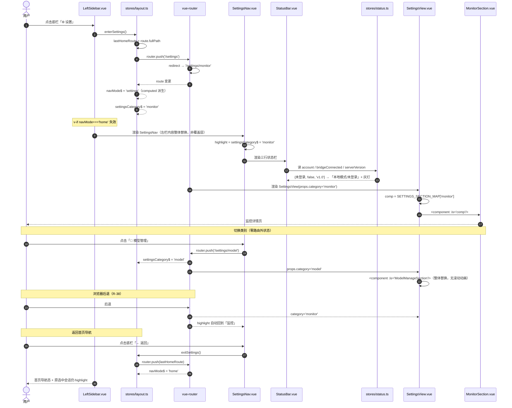
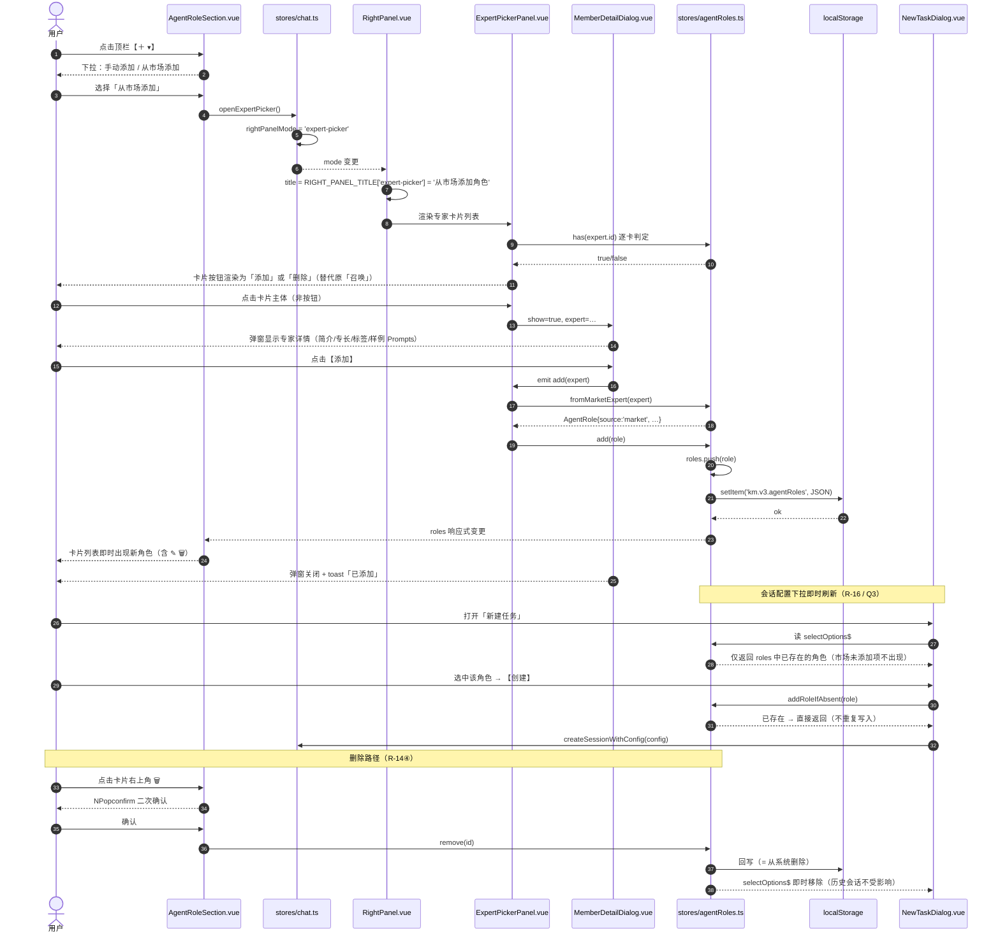
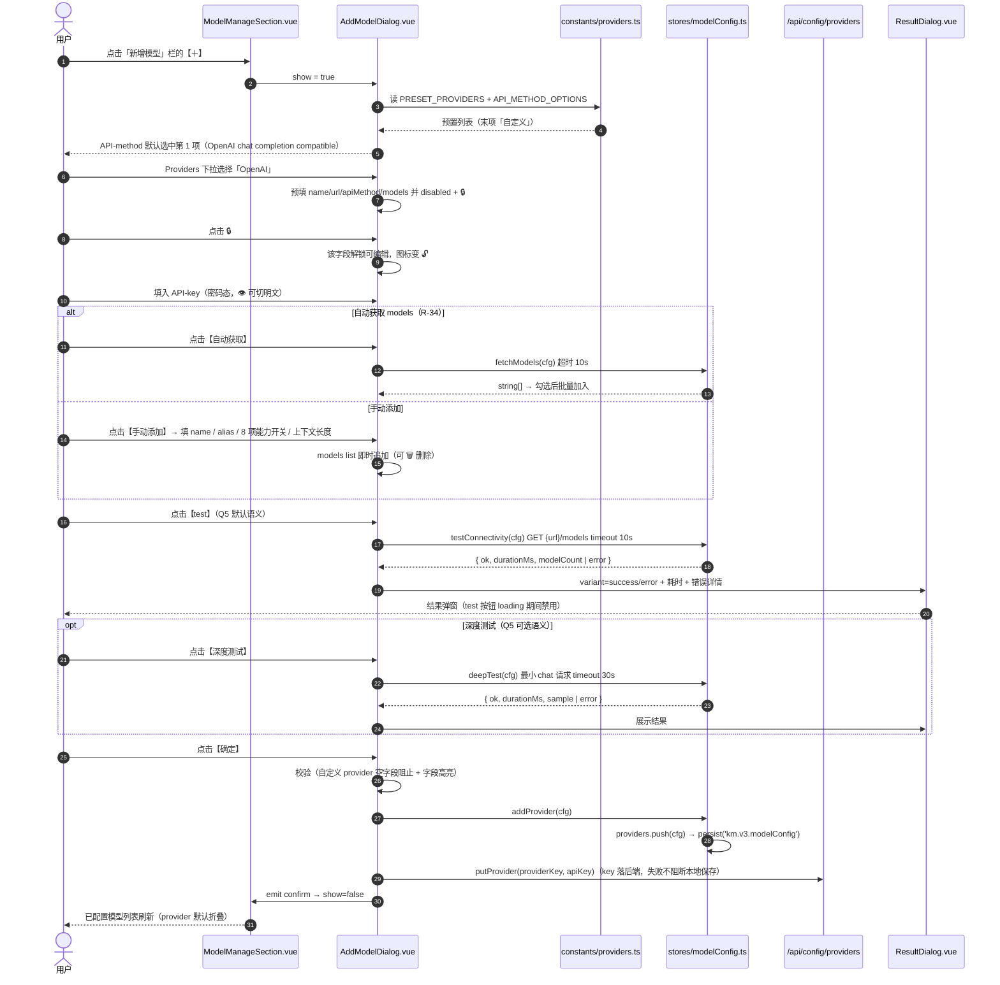
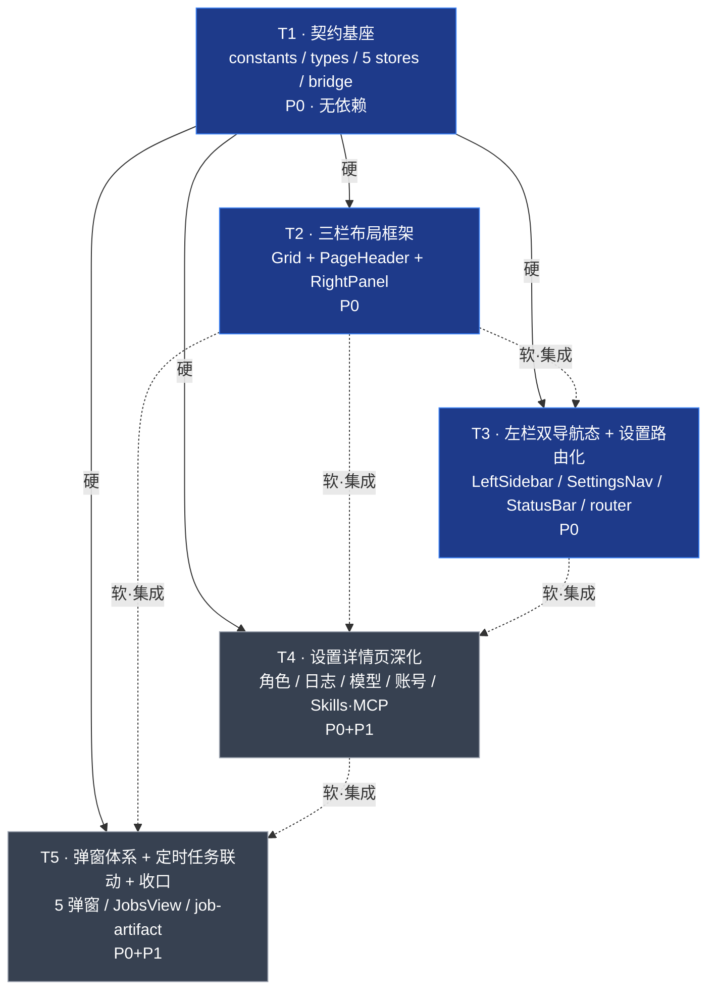

# kmaster-studio UI V3 — 系统架构设计 + 任务分解

> 版本：V3.0 · 文档类型：系统设计（Design Doc）· 语言：简体中文
> 作者：高见远（架构师）
> 输入：`docs/design/REQUIREMENT-ui-v3.md`（许清楚）+ 主理人 Q1–Q8 决策 + 现有 V1/V2 代码
> 基线：`packages/client/src`（Vue 3.5 + TS 5.7 + Naive UI 2.41 + Pinia 2.3 + vue-router 4.5 + Vite 5）
> 原则：**纯前端增量 / 最小变更 / 零新增后端路由 / 全部走 `--km-*` 双主题变量**

---

## 目录

| # | 章节 |
| --- | --- |
| 一 | 实现方案与框架选型 |
| 二 | 文件列表（新增 / 改造 / 复用） |
| 三 | 数据结构与接口（类图） |
| 四 | 程序调用流程（时序图） |
| 五 | 任务列表（T1–T5，含子项 / 依赖 / 验收） |
| 六 | 依赖包列表 |
| 七 | 共享知识（跨文件强约定） |
| 八 | 待明确事项 |

---

## 一、实现方案与框架选型

### 1.1 选型结论（不引入任何新框架）

| 维度 | 选型 | 理由 |
| --- | --- | --- |
| 框架 | Vue 3.5 `<script setup>` + TypeScript | 现状，零迁移成本 |
| 组件库 | Naive UI 2.41 | 现状；`NInput/NSelect/NModal/NPopover/NCollapse/NPagination/NSwitch/NTag/NScrollbar` 全覆盖本轮需求 |
| 状态 | Pinia 2.3（setup store 写法） | 现状；`chat/jobs/usage/memory/terminal` 均为 setup store，新 store 保持同构 |
| 路由 | vue-router 4.5 + `createWebHashHistory` | 现状；设置子路由天然满足 R-38（URL 直达 + 前进后退） |
| 样式 | scoped CSS + `--km-*` CSS 变量（`styles/variables.scss`） | 现状；**新增样式禁止硬编码色值** |
| 拖拽 resize | **原生 `mousedown/mousemove/mouseup`**，不引包 | 现有 `LayoutShell` 已有同款实现，抽成 `ResizeHandle.vue` 复用即可；引 `splitpanes`/`vue-draggable-resizable` 属于净负债 |
| 日志/产物文件读取 | **扩展 `utils/desktop-bridge.ts`**（Electron preload 契约） | Q1/Q8 决策：不新增后端路由；Web 环境静默降级为 mock + 空态 |

### 1.2 三栏布局方案 —— shell 层 CSS Grid（核心变更）

**现状问题**：V2 是 `LayoutShell(flex row)` → `LeftSidebar` + `main` → `ChatView(flex column)` → `ChatPanel + OutputPanel`。右栏**嵌在 ChatView 内部**，导致：
- 只有对话页有右栏，专家/技能/MCP/设置页无右栏 → 违反 G1 空间契约；
- 右栏宽度状态散落在 `OutputPanel` 内部 `ref(340)`，无法持久化；
- 三栏顶边不对齐（右栏顶边在 PageHeader 之下）。

**V3 方案**：**右栏上提到 shell 层**，`LayoutShell` 用 CSS Grid 铺 5 条列轨道。

```
┌─ .km-shell (display:grid; height:100vh; width:100vw; overflow:hidden) ─────────┐
│  grid-template-columns:                                                        │
│    var(--km-left-w)      ← 左栏轨道（折叠时 0px）                               │
│    var(--km-lh-w)        ← 左拖拽柄轨道（折叠时 0px）                            │
│    minmax(0, 1fr)        ← 主体轨道（永不溢出，天然无横向滚动条）                 │
│    var(--km-rh-w)        ← 右拖拽柄轨道（隐藏时 0px）                            │
│    var(--km-right-w)     ← 右栏轨道（隐藏时 0px）                                │
│  grid-template-rows: 100vh   ← 单行，三栏顶/底严格对齐（G1 硬保证）              │
└────────────────────────────────────────────────────────────────────────────────┘
```

关键点：

1. **为什么 Grid 而不是 Flex**：`minmax(0, 1fr)` 让主体轨道在任何情况下都不会被内容撑破（flex 需要额外 `min-width:0` 逐层下传，V2 已经出现过遗漏）；轨道宽度为 0 即天然折叠，无需 `v-if` 卸载组件（保住 R-36 的滚动位置/标签状态）。
2. **宽度以 CSS 自定义属性下发**：`LayoutShell` 上 `:style="layout.cssVars"`，`cssVars` 由 store 计算。组件内部**不感知**具体像素，只读 store 的布尔量。
3. **折叠 ≠ 卸载**：`leftCollapsed` / `rightCollapsed` 只把轨道宽度置 0 + 子元素 `overflow:hidden`，DOM 保留。R-36「右栏内容态之间保留独立滚动位置与标签状态」因此免费得到。
4. **右栏全屏（R-10③）**：`rightFullscreen=true` 时给 `.km-right` 加 `position:fixed; inset:0; z-index:100`（沿用 V2 `OutputPanel` 的 `km-output-fullscreen` 实现），Grid 轨道保持不变，退出全屏即还原。
5. **响应式底线（PRD §8.4）**：`LayoutShell` 挂 `ResizeObserver`，当 `shellWidth - leftW - rightW - handles < 480` 时调用 `layout.autoCollapseRight()`（只在右栏当前可见时触发一次，并记 `autoCollapsed=true`；窗口放大后自动恢复）。
6. **主体页面统一结构**：所有主体页（Chat/Experts/Skills/Mcp/Jobs/Settings-*）一律为
   `<PageHeader …/> + <div class="km-page-body">`，`PageHeader` 高度锁定 `48px`（与现 `ChatHeader` 一致，避免回归）。

**Grid 轨道与折叠映射表**

| 状态 | `--km-left-w` | `--km-lh-w` | main | `--km-rh-w` | `--km-right-w` |
| --- | --- | --- | --- | --- | --- |
| 默认 | `260px` | `4px` | `minmax(0,1fr)` | `0px` | `0px` |
| 左栏折叠 | `0px` | `0px` | `minmax(0,1fr)` | … | … |
| 右栏展开 | `260px` | `4px` | `minmax(0,1fr)` | `4px` | `420px` |
| 右栏全屏 | 不变 | 不变 | 不变 | 不变 | 不变（右栏 `position:fixed` 覆盖） |

### 1.3 拖拽 resize 实现约定

抽出 `components/layout/ResizeHandle.vue`（约 60 行，两处复用）：

```
props:  { side: 'left' | 'right', min: number, max: number, value: number }
emits:  { 'update:value': number, 'resize-start', 'resize-end' }
```

实现要点（**强约定，两侧一致**）：

| 项 | 约定 |
| --- | --- |
| 事件绑定 | `mousedown` 在句柄上；`mousemove`/`mouseup` 挂 `window`，`resize-end` 时移除 |
| 增量方向 | 左栏 `delta = e.clientX - startX`；右栏 `delta = startX - e.clientX` |
| 夹取 | `clamp(startWidth + delta, min, max)` |
| 防选中 | 拖拽期间给 `document.body` 加 `.km-resizing`（全局 `user-select:none; cursor:col-resize`）→ 满足 R-01④ |
| 命中区 | 视觉 `4px`，命中区用 `::before` 扩到 `10px`（`left:-3px; right:-3px`），提升可拖性但不占布局 |
| 高亮 | `:hover` / 拖拽中背景 `var(--km-accent)` |
| 落盘 | `resize-end` 时才写 localStorage（拖拽过程只更新 ref，避免高频写） |
| 边界 | 左栏 `180–500`，右栏 `320–800`（R-01②③） |

### 1.4 设置迁移方案 —— 从 `settingsOverlay` 覆盖模式 → 左栏设置导航态 + 子路由

**现状（V2）**：
- `LayoutShell` `provide('settingsOverlay', ref(false))`；
- `LeftSidebar` 菜单里有「⚙️ 设置」按钮，点击后 `settingsOverlay=true` 且 `router.push('/settings')`；
- `LeftSidebar` 整体 `v-show="!settingsOverlay"`（左栏消失）；
- `SettingsView` 内部自带一个 `.set-side` 左导航 + 12 个 `<section>` 单页锚点滚动 + `updateActive()` 滚动高亮。

**V3 目标**：左栏不消失，而是**切换内容**；主体一类一页。

**迁移四步**（务必按序执行，否则会出现左栏双份导航）：

| 步 | 动作 | 影响文件 |
| --- | --- | --- |
| ① | **删除 `settingsOverlay`**（`provide` / `inject` / `v-show` / `set-page-overlay` 样式 / `savedCategory` watch 全部移除） | `LayoutShell.vue` `LeftSidebar.vue` `SettingsView.vue` |
| ② | **路由子化**：`/settings` → `redirect: '/settings/monitor'`；新增 `/settings/:category` | `router/index.ts` |
| ③ | **`navMode` 派生自路由，不做独立可写状态**：`navMode = route.path.startsWith('/settings') ? 'settings' : 'home'` | `stores/layout.ts` |
| ④ | **`SettingsView` 降级为「类别派发器」**：删掉内部 `.set-side` / `goto()` / `onScroll()` / `updateActive()`，只保留 `<PageHeader>` + `<component :is="SETTINGS_SECTION_MAP[category]">` | `SettingsView.vue` |

**为什么 `navMode` 必须派生自路由**：R-38 要求 URL 直达 `/settings/model` 与浏览器前进/后退可用。若 `navMode` 是独立 ref，刷新/后退时会与 URL 失配（V2 的 `settingsOverlay` 就是这个 bug 的温床）。派生后 **URL 是唯一真源**，前进后退天然正确，零额外代码。

**「返回」如何回到原处（R-05②）**：`stores/layout.ts` 维护 `lastHomeRoute: string`（默认 `'/'`）。路由守卫里，离开非 settings 路由时记录 `from.fullPath`；`exitSettings()` 执行 `router.push(lastHomeRoute)`。会话高亮由 `chat.activeSessionId` 保持，无需额外恢复逻辑。

**12 个设置类别 → 组件映射**（`constants/layout.ts` 单一真源）：

| key | 标题 | 图标 | 渲染组件 | 状态 |
| --- | --- | --- | --- | --- |
| `monitor` | 监控 | 📊 | `MonitorSection.vue` | 复用（**默认类别**） |
| `general` | 系统设置 | 🎛️ | `GeneralSection.vue` | 改造（+workspace +日志） |
| `account` | 账号设置 | 👤 | `ProfileSection.vue` | 改造（本地 profile） |
| `agent-role` | Agent 角色管理 | 🤖 | `AgentRoleSection.vue` | 改造（重做） |
| `skills` | Skill 管理 | 🧩 | `SkillManageSection.vue` | 新增（薄封装） |
| `mcp` | MCP 管理 | 🔌 | `McpManageSection.vue` | 新增（薄封装） |
| `tools` | Tools 管理 | 🔧 | `ToolsSection.vue` | 复用 |
| `plugins` | Plugins 管理 | 🧰 | `PlaceholderSection`（内联） | 复用占位（P2 范围，允许占位） |
| `channel` | Channel 管理 | 📡 | `PlaceholderSection`（内联） | 复用占位（P2 范围，允许占位） |
| `memory` | 记忆管理 | 🧠 | `MemoryView.vue` | 复用（直接挂载，不再"前往"跳转） |
| `model` | 模型管理 | 🧪 | `ModelManageSection.vue` | 改造（重做） |
| `jobs` | 定时任务管理 | ⏰ | `JobsView.vue` | 复用（同组件同时服务 `/jobs` 与 `/settings/jobs`） |

> 注：`plugins` / `channel` 允许保留占位（PRD §8.3 只禁止 P0/P1 范围内出现占位，这两项不在需求池中）。

### 1.5 右栏内容态机（关键改造）

**现状**：`chat.rightPanelMode: 'hidden' | 'output' | 'detail'`，`detail` 内部再用 `isExpert/isExpertTeam/isSkill/isMcp` 做类型分支。

**V3**：把 `detail` **平铺细分**，并新增 3 个态。理由：右栏 title 栏要显示"当前内容态名称"（R-10②），扁平枚举可直接查表出标题，无需二次类型推断。

```ts
export type RightPanelMode =
  | 'hidden'         // 默认，轨道宽 0
  | 'output'         // 会话产物多标签（复用 V1 tabs）
  | 'expert'         // 专家详情
  | 'team'           // 专家团详情
  | 'skill'          // 技能详情
  | 'mcp'            // MCP 详情
  | 'job-artifact'   // 定时任务产物（Q8 新增）
  | 'agent-role'     // Agent 角色配置详情页（R-15 新增）
  | 'expert-picker'; // 从市场添加角色的专家卡片列表（R-14③ 新增）
```

**向后兼容**：`chat.openDetail(entity)` **签名不变**，内部用现有 4 个类型守卫把 `entity` 映射到 `expert|team|skill|mcp`。所有既有调用点（`ExpertsView`/`SkillsView`/`McpView`/`CardMarketLayout` 的 `@select`）**零改动**。

**`RightPanel.vue` 职责边界**（新增文件，避免 `OutputPanel` 继续膨胀）：

```
RightPanel.vue（外壳）
├── title 栏：RIGHT_PANEL_TITLE[mode] + ⛶ 全屏按钮 + ✕ 关闭
└── 内容槽（v-if mode 分派）
    ├── output        → OutputPanel.vue（瘦身：只留 tabs + 预览，删掉宽度/resize/fullscreen/自带 header）
    ├── expert|team|skill|mcp → ExpertDetail / TeamDetail / SkillDetail / McpDetail（原样复用）
    ├── job-artifact  → 内联渲染（AgentMarkdown / <pre>，>1MB 截断条 + 「外部打开」按钮）
    ├── agent-role    → AgentRoleDetail.vue
    └── expert-picker → ExpertPickerPanel.vue
```

`OutputPanel.vue` 的**删除清单**（必须删干净，否则出现双 header / 双 resize）：`rightWidth` `MIN_RIGHT` `MAX_RIGHT` `resizeState` `startResize` `onMouseMoveResize` `onMouseUpResize` `panelStyle` `km-output-resize-handle` `km-output-fullscreen`、以及 `km-output-tabs-bar` 里的 ⛶ 按钮（上移到 `RightPanel`）。

### 1.6 数据源分层（Q1–Q8 落地）

```
┌─ L1 后端只读（已有路由，不新增）─────────────────────────────────────────┐
│ /api/health（10s 轮询→bridge 灯+版本）  /api/models  /api/skills         │
│ /api/mcp  /api/settings  /api/config/providers（key 连通性）             │
│ /api/jobs  /api/cron-history  /api/cron-status  /api/usage/stats         │
└──────────────────────────────────────────────────────────────────────────┘
┌─ L2 localStorage（V3 新数据的唯一真源）─────────────────────────────────┐
│ km.v3.layout  km.v3.agentRoles  km.v3.modelConfig                        │
│ km.v3.profile  km.v3.logs  km.v3.settings                                │
└──────────────────────────────────────────────────────────────────────────┘
┌─ L3 desktop-bridge 文件兜底（Electron 有则真读，Web 则 null）───────────┐
│ readTextFile(path, maxBytes) → { content, truncated, size } | null       │
│ listDir(path)                → DirEntry[] | null                          │
│ openPath(path)               → boolean（外部应用打开）                    │
│ 无 bridge → 日志渲染 MOCK_LOGS + 空态提示；产物渲染错误态                 │
└──────────────────────────────────────────────────────────────────────────┘
```

**决策落点对照**

| 决策 | 落点 |
| --- | --- |
| Q1 日志 | `stores/logs.ts` 经 L3 读 4 类日志目录；无 bridge → `MOCK_LOG_ENTRIES` + 顶部「当前为演示数据」提示条。`LogSection.vue` UI 完整（过滤 4 维 + 搜索 + 行点击弹窗 + 外部打开） |
| Q2 角色存储 | `stores/agentRoles.ts`，`km.v3.agentRoles` 为唯一真源；「从系统删除」= `localStorage` 数组移除 + 立即回写 |
| Q3 使用判定 | 仅显式添加。`NewTaskDialog` 角色下拉 `options = agentRoles.selectOptions`；选中并确认创建时调 `agentRoles.addRoleIfAbsent(role)`（静默写入，不弹提示） |
| Q4 providers | `constants/providers.ts` 的 `PRESET_PROVIDERS`；key 连通性调既有 `putProvider()`（`/api/config/providers`） |
| Q5 test 语义 | `AddModelDialog` 【test】= `GET {url}/models` 超时 **10s**；【深度测试】= 最小 chat 请求 超时 **30s**。两者结果均走 `ResultDialog` |
| Q6 账号 | `stores/status.ts.account` 读 `km.v3.profile`；`bridgeConnected` 初值 `false`；`StatusBar` 显示「本地模式 / 未登录」+ 灰灯，**不报错不阻塞**。`ProfileSection` 改本地 profile，密码重置走确认弹窗（mock 成功） |
| Q7 bridge 状态 | `stores/status.ts` 在 `App.vue` `onMounted` 启动 `setInterval(10_000)` 调 `getHealth()`；成功→`bridgeConnected=true` + `version=health.version`；失败/超时→`false`（不抛错、不弹 toast） |
| Q8 定时任务产物 | `JobsView` 历史条目的 `run.file` 可点 → `chat.openJobArtifact(run)` → `RightPanel` 走 L3 `readTextFile(file, 1MB)`；`truncated=true` 时顶部显示截断条 + 「在外部应用打开」按钮；`null` 时显示错误态而非空白 |

### 1.7 风险与降级

| 风险 | 缓解 |
| --- | --- |
| 右栏上提后对话页产物自动展开逻辑丢失 | `ChatView` 的 `watch(artifactsBySession…)` → `store.showOutput()` **保留**，只是不再本地 `provide('rightPanelCollapsed')`，改由 `layout.rightCollapsed` 响应 `rightPanelMode !== 'hidden'` |
| `settingsOverlay` 残留 inject 导致运行时报错 | `inject` 均带默认值（现状即如此），删除后不会崩；但**必须全局搜索 `settingsOverlay` 清零**，作为 T3 验收项 |
| `desktop-bridge` 新增方法在旧版 Electron preload 中不存在 | 全部用 `typeof api.xxx === 'function'` 探测，缺失返回 `null`；与现有 `pickFolder` 写法一致 |
| localStorage 写入失败（隐私模式/超限） | 统一走 `constants/layout.ts` 的 `lsGet/lsSet` 包装，`try/catch` 静默失败并回落默认值（与 `useDomainTags` 一致） |
| Grid 改造引发 V1/V2 布局回归 | T2 完成后必须逐页截图对比（8 个主体页），列入验收动线 |

---

## 二、文件列表

> 全部路径相对 `packages/client/src/`（文档除外）。

### 2.1 新增（21 个）

| # | 路径 | 职责 | 关联需求 |
| --- | --- | --- | --- |
| N01 | `constants/layout.ts` | **跨文件契约单一真源**：`SETTINGS_CATEGORIES`、`RIGHT_PANEL_TITLE`、`LS_KEYS`、`LAYOUT_LIMITS`、`lsGet/lsSet` 包装 | 全局 |
| N02 | `constants/providers.ts` | `PRESET_PROVIDERS`、`API_METHOD_OPTIONS`（4 项）、`MODEL_CAPABILITIES`（8 项）、`DEFAULT_MODEL_SLOTS`（5 槽）+ 槽位能力过滤表 | R-20 R-21 R-22 R-25 |
| N03 | `types/settings.ts` | `AgentRole` `ModelProviderConfig` `ModelConfig` `LogEntry` `LocalProfile` `SettingsCategory` `LogKind` `LogLevel` | R-14 R-15 R-21 R-27 R-28 |
| N04 | `stores/layout.ts` | 三栏宽度/显隐/全屏/`navMode`(派生)/`settingsCategory`/`lastHomeRoute`/持久化/`autoCollapseRight` | R-01 R-02 R-05 R-37 |
| N05 | `stores/status.ts` | `/api/health` 10s 轮询 → `bridgeConnected` + `serverVersion`；本地 `account`（`km.v3.profile`） | R-05 R-12 R-28 |
| N06 | `stores/agentRoles.ts` | Agent 角色库 CRUD（localStorage 唯一真源）+ `addRoleIfAbsent` + `selectOptions` | R-14 R-15 R-16 |
| N07 | `stores/modelConfig.ts` | 前端模型配置：`providers[]` + `defaults{5 槽}` + `addProvider/removeModel/setDefault` + 能力过滤 `optionsForSlot` | R-19 R-21 R-22 R-24 R-25 |
| N08 | `stores/logs.ts` | 日志读取（bridge 4 目录）/ mock 兜底 / 4 维过滤 + 搜索 / `logDir` 设置 | R-27 R-32 R-33 |
| N09 | `components/layout/PageHeader.vue` | **统一主体 title 栏**：左（左栏显隐 + title + `#title-extra` 插槽）/ 右（搜索框 + `#actions` 插槽 + 右栏显隐） | R-08 R-09 |
| N10 | `components/layout/RightPanel.vue` | 右栏统一外壳：title 栏 + ⛶ 全屏 + ✕ 关闭 + 9 态内容分派 | R-10 R-11 R-18 |
| N11 | `components/layout/ResizeHandle.vue` | 通用拖拽句柄（左右复用），原生鼠标事件 | R-01 |
| N12 | `components/layout/SettingsNav.vue` | 左栏「设置导航态」：title「设置」+ 12 类别列表 + highlight + `StatusBar` + 底栏【返回】 | R-05 R-06 |
| N13 | `components/layout/StatusBar.vue` | 三行状态栏（账户+灯 / bridge+灯 / 版本号+主题图标） | R-05 R-12 |
| N14 | `components/settings/AgentRoleDetail.vue` | 右栏 Agent 角色配置详情页（7 类配置项 + 取消/保存） | R-15 |
| N15 | `components/settings/ExpertPickerPanel.vue` | 右栏「从市场添加」专家卡片列表（卡片按钮＝添加/删除，点卡片弹 `MemberDetailDialog`） | R-14③ |
| N16 | `components/settings/LogSection.vue` | 日志区块：位置设置 + 4 维过滤 + 搜索高亮 + 列表 + 行点击 | R-27 R-32 R-33 |
| N17 | `components/settings/SkillManageSection.vue` | 设置版 Skills 页（`CardMarketLayout` + `installed` 模式，二模块与 `/skills` 一致） | R-29 |
| N18 | `components/settings/McpManageSection.vue` | 设置版 MCP 页（同 N17 结构） | R-30 |
| N19 | `components/dialog/AddModelDialog.vue` | 新增模型窗口（provider 选择/锁定解锁/4 API-method/key 明暗文/models 增删/test/深度测试/确定） | R-19 R-20 R-21 R-22 R-23 R-34 |
| N20 | `components/dialog/ResultDialog.vue` | **通用结果弹窗**（安装/卸载/连通性测试/错误告警 4 合 1，靠 `variant` 区分） | R-13③⑤⑥ R-23 |
| N21 | `components/dialog/LogDetailDialog.vue` | 日志全文弹窗（可复制 + 外部打开） | R-27③ |
| N22 | `components/dialog/MemberDetailDialog.vue` | 专家团成员/市场专家详情弹窗 | R-13② R-14③ |
| N23 | `components/dialog/SchemaDialog.vue` | MCP tool inputSchema 详情弹窗 | R-13④ |

> N01–N23 共 23 项（N19–N23 为 5 个弹窗）。相较 PRD 6.3 的 12 个，增补了 `constants/*`（消灭魔法字符串）、`ResizeHandle/SettingsNav/StatusBar`（防止 `LeftSidebar` 膨胀到不可 review）、`stores/modelConfig.ts`（Q4 决策后模型配置必须前端持久化）、`ExpertPickerPanel`、两个设置版市场页。

### 2.2 改造（22 个）

| # | 路径 | 改造内容 | 关联需求 |
| --- | --- | --- | --- |
| M01 | `components/layout/LayoutShell.vue` | flex → **CSS Grid 5 轨道**；右栏上提；两个 `ResizeHandle`；删 `settingsOverlay` provide；接 `stores/layout`；挂 `ResizeObserver` | R-01 R-02 R-10 |
| M02 | `components/layout/LeftSidebar.vue` | 拆为壳：`v-if navMode==='home'` → 首页导航（原内容，**移除菜单里的「设置」按钮**、底栏改「设置 ↔ 主题图标」、持久选中高亮、过滤面板实现）；`v-else` → `<SettingsNav/>` | R-03 R-04 R-05 R-06 R-12 R-31 |
| M03 | `components/chat/ChatHeader.vue` | **瘦身**：不再是完整 header，改为对话页专属的 `#title-extra`（mode/model badge）+ `#actions`（分享 📤 / 历史 📜 / 停止）内容块，由 `ChatView` 塞进 `PageHeader` 插槽；删自带的左右栏折叠按钮与主题按钮 | R-08 R-09 |
| M04 | `components/chat/OutputPanel.vue` | 删宽度/resize/fullscreen/自带 header（见 §1.5 删除清单）；只保留 tabs + 产物预览；由 `RightPanel` 承载 | R-10 R-11 |
| M05 | `views/ChatView.vue` | 用 `<PageHeader>`；删除本地 `rightPanelCollapsed` `provide`；`OutputPanel` 从模板移除（改由 shell 层 `RightPanel` 渲染）；保留产物自动展开 watch | R-08 R-09 R-10 |
| M06 | `views/SettingsView.vue` | 删 `.set-side` / 锚点滚动 / `settingsOverlay`；改为 `PageHeader + <component :is>` 类别派发器 | R-07 R-38 |
| M07 | `views/ExpertsView.vue` | 顶部接 `PageHeader`（title「专家市场」，搜索透传给 `CardMarketLayout`） | R-08 |
| M08 | `views/SkillsView.vue` | 同 M07（title「技能市场」） | R-08 |
| M09 | `views/McpView.vue` | 同 M07（title「MCP 管理」） | R-08 |
| M10 | `views/JobsView.vue` | 接 `PageHeader`；任务表按 `name` 排序；默认选中首项 + 行 highlight；历史区只显示选中任务且标题带任务名；`run.file` 可点 → 右栏 | R-08 R-17 R-18 |
| M11 | `views/MemoryView.vue` | 接 `PageHeader`（同时供 `/settings/memory` 内嵌，`PageHeader` 通过 `embedded` prop 关闭） | R-08 |
| M12 | `components/market/CardMarketLayout.vue` | 新增 `installed` 模式：`props.installedItems` + `props.installedTitle` + 首屏模块替换（独立搜索框 + 标签平铺 + **2 行 ×5 列** + 分页 pageSize=10）；第二模块保持不变 | R-29 R-30 |
| M13 | `components/market/EntityCard.vue` | 新增 `actionLabel` / `actionType` props（`召唤` → `添加`/`删除`），`@action` 事件外抛 | R-14③ |
| M14 | `components/settings/AgentRoleSection.vue` | **重做**：顶栏「Agent 角色配置」+【＋▾】下拉（手动添加/从市场添加）；卡片列表（名称/图标/简介/专长&技能/标签 + 右上角 ✎🗑）；数据源 `stores/agentRoles`；删内联编辑 | R-14 |
| M15 | `components/settings/ModelManageSection.vue` | **重做**：三区块 = 新增模型栏（＋→`AddModelDialog`）/ 默认模型列表（5 槽能力过滤下拉）/ 已配置模型列表（provider 折叠，展开显示 名称·标签·使用量·默认徽标） | R-19 R-24 R-25 R-35 |
| M16 | `components/settings/GeneralSection.vue` | 补 workspace（`pickFolder()` + 文本兜底）+ 内嵌 `<LogSection/>` | R-26 |
| M17 | `components/settings/ProfileSection.vue` | 账号名称 / 账号信息（可编辑保存到 `km.v3.profile`）/ 密码重置（旧→新→确认，字段级校验，确认弹窗 mock 成功） | R-28 |
| M18 | `components/dialog/NewTaskDialog.vue` | 角色下拉数据源改 `agentRoles.selectOptions`（替换 `AGENT_ROLE_OPTIONS` 常量）；确认创建时 `addRoleIfAbsent`；模型默认值取 `modelConfig.defaults.default` | R-16 Q3 |
| M19 | `router/index.ts` | `/settings` → `redirect /settings/monitor`；新增 `settings/:category`（`props:true`）；`afterEach` 记录 `lastHomeRoute` | R-07 R-38 |
| M20 | `composables/useKeyboard.ts` | 新增 4 个快捷键：`Ctrl+B` 左栏、`Ctrl+\` 右栏、`Ctrl+F` 内容搜索、`F11`/`Ctrl+Shift+F` 右栏全屏；沿用输入框聚焦不触发的守卫 | R-37 |
| M21 | `composables/useSessionList.ts` | 新增 `filters: { category, timeRange, agentRole }` + `clearFilters()` + `filterActive` computed，作用于 `getGroupedSessions` | R-31 |
| M22 | `utils/desktop-bridge.ts` | 新增 `readTextFile` / `listDir` / `openPath` / `pathExists`（全部 `typeof` 探测 + Web 返回 `null`/`false`） | R-18 R-27 R-32 |
| M23 | `types/chat.ts` | `RightPanelMode` 联合类型扩展（9 态）+ `JobArtifactRef` | R-10 R-18 |
| M24 | `stores/chat.ts` | `rightPanelMode` 换新联合类型；`openDetail` 内部按类型守卫映射到 `expert/team/skill/mcp`；新增 `openJobArtifact(run)` / `openAgentRole(roleId?)` / `openExpertPicker()` | R-10 R-14 R-18 |
| M25 | `App.vue` | `onMounted` 启动 `status.startPolling()`，`onUnmounted` 停止 | R-05 R-12 |

### 2.3 直接复用（不改动）

`components/market/{ExpertDetail,TeamDetail,SkillDetail,McpDetail}.vue`、`components/chat/{ChatPanel,MessageList,MessageItem,ChatInput,AgentMarkdown,PlanCard,UsageBar,ShareDialog}.vue`、`components/settings/{MonitorSection,ToolsSection,DiagnosticsSection,ProviderSection}.vue`、`components/preview/*`、`composables/{useDomainTags,useI18n,useSkillList,useMcpList}.ts`、`stores/{jobs,usage,memory,terminal}.ts`、`api/client.ts`、`styles/{theme.ts,variables.scss}`、`locales/*`。

> ⚠️ `components/chat/{SkillPanel,McpManager,SettingsDrawer}.vue` 在 V3 设置改造后不再从 `SettingsView` 调用。**本轮不删除**（`/chat` 内仍可能引用），仅解除 `SettingsView` 的引用，避免误伤。

---

## 三、数据结构与接口（类图）

### 3.1 类型层 + Store 层

```mermaid
classDiagram
    direction LR

    class AgentRole {
        +string id
        +string name
        +string avatar
        +string desc
        +string[] specialties
        +string agentMd
        +string[] skills
        +string[] mcp
        +string[] tags
        +string[] samplePrompts
        +RoleSource source
        +number createdAt
        +number updatedAt
    }

    class RoleSource {
        <<enumeration>>
        manual
        market
    }

    class ModelProviderConfig {
        +string id
        +string providerKey
        +string name
        +string url
        +ApiMethod apiMethod
        +string apiKey
        +ModelConfig[] models
        +boolean verified
        +number lastTestedAt
    }

    class ModelConfig {
        +string id
        +string name
        +string alias
        +ModelCapability[] capabilities
        +number contextLength
    }

    class ApiMethod {
        <<enumeration>>
        openai-chat
        openai-response
        anthropic-chat
        anthropic-response
    }

    class ModelCapability {
        <<enumeration>>
        text
        vision
        video
        audio
        image-gen
        video-gen
        audio-gen
        structured
    }

    class DefaultModelSlot {
        <<enumeration>>
        default
        simple
        vision
        image
        fallback
    }

    class PresetProvider {
        +string key
        +string name
        +string url
        +ApiMethod apiMethod
        +ModelConfig[] models
    }

    class LogEntry {
        +string id
        +number ts
        +LogKind kind
        +LogLevel level
        +string summary
        +string content
        +string file
        +string sessionId
    }

    class LogKind {
        <<enumeration>>
        hermes-agent
        bridge
        kmaster-server
        cron
    }

    class LogLevel {
        <<enumeration>>
        info
        warning
        error
    }

    class LogFilter {
        +TimeRange time
        +string sessionId
        +LogKind kind
        +LogLevel level
        +string q
    }

    class LocalProfile {
        +string name
        +string email
        +string bio
        +number updatedAt
    }

    class CronRun {
        +string job_id
        +string job_name
        +string run_time
        +string status
        +string mode
        +string excerpt
        +string file
    }

    class RightPanelMode {
        <<enumeration>>
        hidden
        output
        expert
        team
        skill
        mcp
        job-artifact
        agent-role
        expert-picker
    }

    class LayoutStore {
        +number leftWidth
        +number rightWidth
        +boolean leftCollapsed
        +boolean rightCollapsed
        +boolean rightFullscreen
        +string lastHomeRoute
        +NavMode navMode$
        +string settingsCategory$
        +CssVars cssVars$
        +toggleLeft() void
        +toggleRight() void
        +toggleFullscreen() void
        +setLeftWidth(w) void
        +setRightWidth(w) void
        +enterSettings() void
        +exitSettings() void
        +autoCollapseRight(shellW) void
        +persist() void
        +hydrate() void
    }

    class NavMode {
        <<enumeration>>
        home
        settings
    }

    class StatusStore {
        +boolean bridgeConnected
        +string serverVersion
        +LocalProfile account
        +boolean loggedIn$
        +startPolling() void
        +stopPolling() void
        +refreshHealth() Promise
        +saveAccount(p) void
        +resetPassword(o, n) Promise
    }

    class AgentRolesStore {
        +AgentRole[] roles
        +SelectOption[] selectOptions$
        +hydrate() void
        +persist() void
        +add(role) AgentRole
        +addRoleIfAbsent(role) AgentRole
        +update(id, patch) void
        +remove(id) void
        +getById(id) AgentRole
        +fromMarketExpert(e) AgentRole
        +has(id) boolean
    }

    class ModelConfigStore {
        +ModelProviderConfig[] providers
        +DefaultsMap defaults
        +hydrate() void
        +persist() void
        +addProvider(cfg) void
        +removeProvider(id) void
        +addModel(pid, m) void
        +removeModel(pid, mid) void
        +setDefault(slot, mid) void
        +optionsForSlot(slot) SelectOption[]
        +fetchModels(cfg) Promise
        +testConnectivity(cfg) Promise
        +deepTest(cfg) Promise
        +usageOf(modelId) number
    }

    class LogsStore {
        +LogEntry[] entries
        +LogFilter filter
        +string logDir
        +boolean loading
        +boolean isMock
        +LogEntry[] filtered$
        +load() Promise
        +setLogDir(p) Promise
        +openExternal(e) Promise
        +resetFilter() void
    }

    class ChatStore {
        +RightPanelMode rightPanelMode
        +EntityDef detailEntity
        +CronRun jobArtifact
        +string editingRoleId
        +openDetail(entity) void
        +openJobArtifact(run) void
        +openAgentRole(roleId) void
        +openExpertPicker() void
        +showOutput() void
        +closeDetail() void
    }

    class DesktopBridge {
        <<module>>
        +isDesktop() boolean
        +pickFolder() Promise
        +readTextFile(path, maxBytes) Promise
        +listDir(path) Promise
        +openPath(path) Promise
        +pathExists(path) Promise
    }

    AgentRole --> RoleSource : source
    ModelProviderConfig "1" *-- "n" ModelConfig : models
    ModelProviderConfig --> ApiMethod : apiMethod
    ModelConfig --> ModelCapability : capabilities
    PresetProvider --> ApiMethod : apiMethod
    PresetProvider "1" o-- "n" ModelConfig : 预置
    LogEntry --> LogKind : kind
    LogEntry --> LogLevel : level
    LogFilter --> LogKind : kind
    LogFilter --> LogLevel : level

    LayoutStore --> NavMode : navMode(派生自 route)
    AgentRolesStore "1" o-- "n" AgentRole : localStorage 唯一真源
    ModelConfigStore "1" o-- "n" ModelProviderConfig : localStorage 唯一真源
    ModelConfigStore --> DefaultModelSlot : defaults
    ModelConfigStore ..> PresetProvider : 读取预置
    LogsStore "1" o-- "n" LogEntry
    LogsStore --> LogFilter : filter
    LogsStore ..> DesktopBridge : readTextFile / listDir / openPath
    StatusStore --> LocalProfile : account
    ChatStore --> RightPanelMode : rightPanelMode
    ChatStore ..> CronRun : jobArtifact
    ChatStore ..> AgentRolesStore : editingRoleId
```



### 3.2 组件契约层（props / emits / slots）

```mermaid
classDiagram
    direction TB

    class PageHeader {
        <<component>>
        +string title
        +boolean hideLeft
        +boolean hideRight
        +boolean showSearch
        +string searchPlaceholder
        +boolean embedded
        +emit toggle-left()
        +emit toggle-right()
        +emit search(q)
        +slot title-extra
        +slot actions
    }

    class RightPanel {
        <<component>>
        +RightPanelMode mode$
        +string title$
        +emit close()
        +emit toggle-fullscreen()
    }

    class ResizeHandle {
        <<component>>
        +Side side
        +number min
        +number max
        +number value
        +emit update:value(w)
        +emit resize-start()
        +emit resize-end()
    }

    class SettingsNav {
        <<component>>
        +string active$
        +emit select(category)
        +emit back()
    }

    class StatusBar {
        <<component>>
        +boolean compact
    }

    class AgentRoleSection {
        <<component>>
        +emit open-detail(roleId)
        +emit open-picker()
    }

    class AgentRoleDetail {
        <<component>>
        +string roleId
        +emit save(role)
        +emit cancel()
    }

    class ExpertPickerPanel {
        <<component>>
        +emit add(expert)
        +emit remove(expertId)
        +emit inspect(expert)
    }

    class LogSection {
        <<component>>
        +emit open-detail(entry)
    }

    class AddModelDialog {
        <<component>>
        +boolean show
        +emit update:show(v)
        +emit confirm(cfg)
        +emit test-result(r)
    }

    class ResultDialog {
        <<component>>
        +boolean show
        +ResultVariant variant
        +string title
        +string message
        +string detail
        +number durationMs
        +emit update:show(v)
        +emit primary()
    }

    class ResultVariant {
        <<enumeration>>
        success
        error
        warning
        info
    }

    class CardMarketLayout {
        <<component>>
        +string title
        +EntityDef[] entities
        +EntityDef[] featuredItems
        +EntityDef[] installedItems
        +string installedTitle
        +boolean installedMode
        +emit select(entity)
        +emit search(q)
        +emit installed-action(entity)
        +slot card
        +slot installed-card
    }

    class EntityCard {
        <<component>>
        +EntityDef entity
        +string actionLabel
        +ActionType actionType
        +emit action(entity)
        +emit click(entity)
    }

    PageHeader ..> LayoutStore : toggleLeft / toggleRight
    RightPanel ..> ChatStore : mode
    RightPanel --> OutputPanel : mode=output
    RightPanel --> AgentRoleDetail : mode=agent-role
    RightPanel --> ExpertPickerPanel : mode=expert-picker
    ResizeHandle <.. LayoutShell : 左右各一
    SettingsNav --> StatusBar : 内嵌
    AgentRoleSection ..> AgentRolesStore
    AgentRoleDetail ..> AgentRolesStore
    ExpertPickerPanel ..> AgentRolesStore
    LogSection ..> LogsStore
    AddModelDialog ..> ModelConfigStore
    AddModelDialog --> ResultDialog : test 结果
    CardMarketLayout --> EntityCard
```



---

## 四、程序调用流程（时序图）

### 4.1 流程 A —— 点击左栏「设置」→ 左栏切设置导航态 → 主体加载监控页



### 4.2 流程 B —— 从市场添加 Agent 角色（完整闭环到会话下拉刷新）



### 4.3 流程 C —— 定时任务产物 → 右栏（Q8 落地）

```mermaid
sequenceDiagram
    autonumber
    actor U as 用户
    participant JV as JobsView.vue
    participant JS as stores/jobs.ts
    participant CS as stores/chat.ts
    participant RP as RightPanel.vue
    participant DB as utils/desktop-bridge.ts

    U->>JV: 进入定时任务页
    JV->>JS: load()
    JS-->>JV: jobs[]
    JV->>JV: sortedJobs = jobs.sort(by name)
    JV->>JV: selectedJobId = sortedJobs[0].id（默认选中 + 行 highlight）
    JV->>JS: loadHistory(selectedJobId)
    JS-->>JV: runs[]（只属于选中任务）
    JV-->>U: 历史区标题「运行历史 — 每日晨报」

    U->>JV: 点击另一任务名
    JV->>JV: selectedJobId 更新（highlight 跟随）
    JV->>JS: loadHistory(newId)
    JS-->>JV: runs[] 即时切换

    U->>JV: 点击历史条目的产物路径 cron/2026-03-25.md
    JV->>CS: openJobArtifact(run)
    CS->>CS: jobArtifact = run; rightPanelMode = 'job-artifact'
    CS-->>RP: mode 变更 → 右栏展开
    RP->>DB: readTextFile(run.file, 1_048_576)

    alt Electron 且读取成功
        DB-->>RP: { content, truncated:false, size }
        RP-->>U: AgentMarkdown 渲染全文
    else 文件 >1MB
        DB-->>RP: { content: 前 1MB, truncated:true, size }
        RP-->>U: 顶部截断条「已截断，共 X MB」+【在外部应用打开】
    else Web 环境 / 读取失败
        DB-->>RP: null
        RP-->>U: 错误态「无法读取产物文件（当前为 Web 环境）」+ 路径可复制
    end

    U->>RP: 点击【在外部应用打开】
    RP->>DB: openPath(run.file)
    DB-->>U: 系统默认程序打开（Web 下按钮置灰 + tooltip）
```

### 4.4 流程 D —— 新增模型（含 Q5 双测试语义）



---

## 五、任务列表

> **执行顺序即编号顺序**。硬依赖 = 不满足则无法编译/运行；软依赖 = 可先写组件、后接线。
> 每个任务下的子项（S-xx）粒度为「一次提交可独立 review」，工程师可按子项分批提交，但任务边界即 PR 边界。

### T1 · 契约基座（常量 / 类型 / Store / bridge 扩展）

| 项 | 内容 |
| --- | --- |
| **依赖** | 无 |
| **优先级** | P0 |
| **交付形态** | 纯数据层，**不改任何 UI**，改完后应用行为与 V2 完全一致 |

| 子项 | 目标文件 | 要点 | 验收点 |
| --- | --- | --- | --- |
| S1.1 | `constants/layout.ts` | `SETTINGS_CATEGORIES`(12)、`RIGHT_PANEL_TITLE`(9)、`NAV_MODES`、`LS_KEYS`、`LAYOUT_LIMITS`、`lsGet/lsSet` | 全部枚举有 TS 字面量联合类型；`lsSet` 在 localStorage 抛错时静默返回 `false` |
| S1.2 | `constants/providers.ts` | `PRESET_PROVIDERS`（≥6 家 + 自定义）、`API_METHOD_OPTIONS`(4，首项默认)、`MODEL_CAPABILITIES`(8)、`DEFAULT_MODEL_SLOTS`(5)、`SLOT_REQUIRED_CAPS` | `SLOT_REQUIRED_CAPS.vision === ['vision']`；`API_METHOD_OPTIONS[0].value === 'openai-chat'` |
| S1.3 | `types/settings.ts` | 见 §3.1 全部新类型 | `vue-tsc --noEmit` 通过 |
| S1.4 | `types/chat.ts` `stores/chat.ts` | `RightPanelMode` 扩为 9 态；`openDetail` 内部类型守卫映射；新增 `openJobArtifact` / `openAgentRole` / `openExpertPicker` | 既有 `stores/chat.test.ts` 全绿；`openDetail(expert)` 后 `rightPanelMode==='expert'` |
| S1.5 | `utils/desktop-bridge.ts` | `readTextFile(path,maxBytes)` / `listDir` / `openPath` / `pathExists`，全部 `typeof` 探测 | Web 环境（`window.kmasterDesktop` 未定义）调用不抛错，分别返回 `null/null/false/false` |
| S1.6 | `stores/layout.ts` + `layout.test.ts` | 宽度/显隐/全屏/`navMode`(派生)/`settingsCategory`/`lastHomeRoute`/`hydrate`/`persist`/`autoCollapseRight` | 单测：`setLeftWidth(9999)` 被夹到 500；`hydrate()` 读不到 key 时用默认值 260/420 |
| S1.7 | `stores/status.ts` + `status.test.ts` | 10s 轮询 `getHealth()`；失败兜底 `false`；`account` 读写 `km.v3.profile` | 单测：mock `getHealth` reject → `bridgeConnected===false` 且无未捕获异常 |
| S1.8 | `stores/agentRoles.ts` + `agentRoles.test.ts` | CRUD + `addRoleIfAbsent` + `selectOptions` + `fromMarketExpert` | 单测：`addRoleIfAbsent` 重复 id 不产生第二条；`remove` 后 localStorage 同步 |
| S1.9 | `stores/modelConfig.ts` + `modelConfig.test.ts` | providers/defaults CRUD + `optionsForSlot` 能力过滤 + `fetchModels/testConnectivity/deepTest`（含超时） | 单测：`optionsForSlot('vision')` 只返回含 `vision` 能力的模型；超时用 `AbortController` |
| S1.10 | `stores/logs.ts` + `logs.test.ts` | 4 类日志目录读取 + `MOCK_LOG_ENTRIES` 兜底 + `filtered` 4 维过滤 + 搜索 | 单测：无 bridge 时 `isMock===true` 且 `entries.length>0`；三类过滤条件可组合 |
| S1.11 | `App.vue` | `onMounted` 调 `status.startPolling()` + 各 store `hydrate()`；`onUnmounted` 停止 | 刷新页面无控制台报错；network 面板每 10s 一次 `/api/health` |

**T1 整体验收**：`npm run build`（含 `vue-tsc --noEmit`）通过；`npm test` 全绿且新增 ≥5 个 store 测试文件；UI 无任何可见变化。

---

### T2 · 三栏布局框架（Grid + PageHeader + RightPanel）

| 项 | 内容 |
| --- | --- |
| **硬依赖** | T1（S1.1 S1.4 S1.6） |
| **优先级** | P0 |
| **交付形态** | 8 个主体页 title 栏统一 + 右栏全局可用 |

| 子项 | 目标文件 | 要点 | 验收点 |
| --- | --- | --- | --- |
| S2.1 | `components/layout/ResizeHandle.vue` | 原生鼠标事件 + `.km-resizing` body class + `::before` 扩命中区 | 拖拽时无文字选中（R-01④）；松手后才写 localStorage |
| S2.2 | `components/layout/LayoutShell.vue` | flex → Grid 5 轨道；右栏上提；两个 `ResizeHandle`；删 `settingsOverlay` provide；`ResizeObserver` → `autoCollapseRight` | ① 1280→1920 无横向滚动条；② 三栏顶/底严格对齐；③ 左栏 180–500、右栏 320–800；④ 主体 <480px 时右栏自动收起 |
| S2.3 | `components/layout/PageHeader.vue` | props `title/hideLeft/hideRight/showSearch/searchPlaceholder/embedded`；emits `toggle-left/toggle-right/search`；slots `title-extra/actions`；搜索防抖 300ms；高度锁 48px | 8 页 title 栏高度、内边距、按钮位序 100% 一致（截图对比） |
| S2.4 | `components/layout/RightPanel.vue` | title 栏（查 `RIGHT_PANEL_TITLE`）+ ⛶ 全屏 + ✕ 关闭 + 9 态分派；全屏用 `position:fixed;inset:0` | ① 默认 hidden 宽 0；② title 栏常驻并显示内容态名；③ ⛶ 覆盖全窗口，再点还原 |
| S2.5 | `components/chat/OutputPanel.vue` | 执行 §1.5 删除清单，只留 tabs + 预览 | 无残留 resize 句柄 / 双 header；R-11 多标签行为不回归（新建/激活/关闭/相邻激活） |
| S2.6 | `views/ChatView.vue` + `components/chat/ChatHeader.vue` | `ChatView` 用 `PageHeader`，把 `ChatHeader` 拆出的 badge 放 `#title-extra`、分享/历史/停止放 `#actions`；删本地 `provide('rightPanelCollapsed')`；`OutputPanel` 移出模板 | R-09：分享/历史两按钮位于搜索框与右栏显隐之间；`ShareDialog` 与提问历史行为不变 |
| S2.7 | `views/{ExpertsView,SkillsView,McpView,MemoryView}.vue` | 各自接 `PageHeader`，`@search` 透传给 `CardMarketLayout` | 4 页 title 栏一致；搜索即时过滤 |
| S2.8 | `composables/useKeyboard.ts` | 新增 `Ctrl+B`/`Ctrl+\`/`Ctrl+F`/`Ctrl+Shift+F` 四键 | 输入框聚焦时 4 键均不误触发（沿用现有 tag 守卫） |

**T2 整体验收**：R-01 R-02 R-08 R-09 R-10 R-11 R-36 R-37；V1/V2 对话流 + 产物标签零回归。

---

### T3 · 左栏双导航态 + 设置路由化

| 项 | 内容 |
| --- | --- |
| **硬依赖** | T1（S1.1 S1.6 S1.7）；**软依赖** T2（S2.3 PageHeader） |
| **优先级** | P0 |
| **交付形态** | 「设置」下沉左栏底栏；12 类别一类一页；URL 直达可用 |

| 子项 | 目标文件 | 要点 | 验收点 |
| --- | --- | --- | --- |
| S3.1 | `router/index.ts` | `/settings` → `redirect '/settings/monitor'`；新增 `settings/:category`（`props:true`）；`afterEach` 记 `lastHomeRoute` | 直接访问 `#/settings/model` 正确渲染模型管理页 |
| S3.2 | `components/layout/StatusBar.vue` | 三行：账户+灯 / bridge+灯 / 版本号+主题图标；灯 绿=正常 灰=断开 | 未登录显示「本地模式 / 未登录」+ 灰灯，**不报错**；点主题图标即时切换且图标随之变化 |
| S3.3 | `components/layout/SettingsNav.vue` | title「设置」+ 12 类别（读 `SETTINGS_CATEGORIES`）+ highlight + 内嵌 `StatusBar` + 底栏【← 返回】 | ① 首次进入 highlight 在「监控」；② highlight = 背景 + 文字色 + 加粗；③ 状态栏常驻底栏正上方 |
| S3.4 | `components/layout/LeftSidebar.vue`（拆壳） | `v-if navMode==='home'` → 原首页导航；`v-else` → `SettingsNav`；**菜单区移除「⚙️ 设置」按钮**；底栏改「⚙️ 设置 ⟷ 🌙/☀️」同行两端 | ① 菜单里再无「设置」；② 底栏只有这两个元素；③ 点【设置】左栏整体切换（非覆盖层） |
| S3.5 | `components/layout/LeftSidebar.vue`（选中态） | `km-session-highlight` 一次性闪烁 **保留**，另加持久选中 class（`active` 已有，补菜单项持久 highlight + 冷启动自动选最近会话） | ① 选中项持续 highlight；② 冷启动主体自动加载最近会话；③ 无会话时空态不报错 |
| S3.6 | `composables/useSessionList.ts` + 过滤面板 | `filters{category,timeRange,agentRole}` + `clearFilters` + `filterActive`；`LeftSidebar` 的 `km-filter-panel` 从「开发中」改为真实面板 | ① 三类条件可组合；② 结果即时反映；③ 有「清空过滤」；④ 生效时过滤图标呈激活态 |
| S3.7 | `views/SettingsView.vue` | 删 `.set-side` / `goto` / `onScroll` / `updateActive` / `settingsOverlay` / overlay 样式；改 `PageHeader + <component :is>` | ① 切换类别整体替换无滚动动画；② 12 类别各自可访问；③ 全局搜索 `settingsOverlay` 结果为 0 |

**T3 整体验收**：R-03 R-04 R-05 R-06 R-07 R-12 R-31 R-38；从对话页进任一设置类别 ≤2 次点击。

---

### T4 · 设置详情页深化（角色 / 日志 / 模型 / 账号 / Skills·MCP）

| 项 | 内容 |
| --- | --- |
| **硬依赖** | T1（S1.2 S1.3 S1.8 S1.9 S1.10）；**软依赖** T2（RightPanel）、T3（类别路由） |
| **优先级** | P0（agent-role）+ P1（其余） |
| **交付形态** | 5 个管理页跑通「新增 → 校验 → 反馈 → 列表刷新」 |

| 子项 | 目标文件 | 要点 | 验收点 |
| --- | --- | --- | --- |
| S4.1 | `components/settings/AgentRoleSection.vue` | 重做：顶栏「Agent 角色配置」+【＋▾】下拉；卡片列表（名称/图标/简介/专长&技能/标签 + 右上角 ✎🗑）；数据源 `agentRoles` | ① 点【＋】展开两项；② 🗑 二次确认后从 localStorage 移除；③ ✎ 右栏打开该角色配置页 |
| S4.2 | `components/settings/AgentRoleDetail.vue` | 7 类配置项：名称/简介/`Agent.md` 多行/附加技能多选/mcp-server 多选/手动标签/样例 Prompts + 取消·保存 | ① 7 项均可编辑保存；② 保存后卡片列表即时反映；③ 「手动添加」进入时各项为默认配置 |
| S4.3 | `components/settings/ExpertPickerPanel.vue` + `components/market/EntityCard.vue` | 右栏专家卡片列表；`EntityCard` 加 `actionLabel/actionType/@action`（召唤 → 添加/删除）；点卡片弹 `MemberDetailDialog` | ① 已添加显示「删除」，未添加显示「添加」；② 点卡片弹详情窗；③ 添加后 `AgentRoleSection` 即时刷新 |
| S4.4 | `components/settings/LogSection.vue` | 日志位置设置（`pickFolder` + 校验）+ 4 维过滤（时间/会话/种类 4 项/级别 3 项）+ 搜索高亮 + 列表 + 行点击 + 外部打开 | ① 三类过滤可组合；② 搜索关键字高亮命中行；③ 过滤后条数正确；④ 无 bridge 时顶部提示「演示数据」，**UI 完整不残缺** |
| S4.5 | `components/settings/GeneralSection.vue` | 补 workspace（`pickFolder()` + 文本兜底）+ 内嵌 `<LogSection/>` | 主题/语言/workspace 三项可改且即时生效；日志区块含位置设置 + 列表 |
| S4.6 | `components/settings/ProfileSection.vue` | 账号名称/信息可编辑保存（`km.v3.profile`）；密码重置（旧→新→确认 + 字段级校验 + 确认弹窗 mock 成功） | ① 保存有成功提示；② 校验失败有字段级提示；③ **无「开发中」占位** |
| S4.7 | `components/settings/ModelManageSection.vue` | 三区块重做：新增模型栏（＋）/ 默认模型 5 槽（能力过滤下拉）/ 已配置模型列表（provider 折叠 + 4 类信息 + 默认徽标 + 认证徽标） | ① 默认全部折叠；② 「视觉理解模型」下拉只列 `vision` 能力模型；③ 使用量取 `/api/usage/stats`，无数据显示 `—` 而非 0 |
| S4.8 | `components/market/CardMarketLayout.vue` | 新增 `installedMode`/`installedItems`/`installedTitle`/`#installed-card`；首屏模块替换（独立搜索 + 标签平铺 + 2×5 网格 + 分页 pageSize=10） | ① 首屏标题为「已经安装的 skills」；② 独立搜索/标签只作用于已安装项；③ 每页恰好 10 张（2 行 ×5 列） |
| S4.9 | `components/settings/{SkillManageSection,McpManageSection}.vue` | 薄封装：`installedItems` 取 `useSkillList/useMcpList` 的已安装项；第二模块与 `/skills`、`/mcp` 渲染一致 | 第二模块与市场页视觉/行为完全一致（无分叉实现） |

**T4 整体验收**：R-14 R-15 R-24 R-25 R-26 R-27 R-28 R-29 R-30 R-33 R-35；P0/P1 范围内零「开发中」占位。

---

### T5 · 弹窗体系收敛 + 定时任务联动 + 全链路收口

| 项 | 内容 |
| --- | --- |
| **硬依赖** | T1；**软依赖** T2（RightPanel）、T4（ModelManageSection / AgentRoleSection） |
| **优先级** | P0（R-13 R-16 R-17 R-18）+ P1（R-19~R-23） |
| **交付形态** | 6 类弹窗全通；定时任务产物在右栏可读；验收动线全绿 |

| 子项 | 目标文件 | 要点 | 验收点 |
| --- | --- | --- | --- |
| S5.1 | `components/dialog/ResultDialog.vue` | 通用结果弹窗（`variant: success/error/warning/info`），承载 skill 安装卸载 / mcp 安装卸载测试 / 错误告警 3 类 | 宽度自适应内容（`max-width:92vw`）；含耗时与错误详情槽位 |
| S5.2 | `components/dialog/{MemberDetailDialog,SchemaDialog,LogDetailDialog}.vue` | 成员详情 / MCP inputSchema（JSON 高亮 + 可复制）/ 日志全文（可复制 + 外部打开） | 3 类弹窗均可触发并正确关闭 |
| S5.3 | `components/dialog/AddModelDialog.vue` | provider 下拉（预置 + 自定义）/ 4 字段锁定解锁 🔒🔓 / API-method 4 选项默认首项 / API-key 密码态 👁 / models 自动获取+手动添加 / 单 model 8 能力开关 + 上下文长度 / 【test】10s + 【深度测试】30s / 【确定】校验保存 | ① 选已知 provider 后 4 字段 disabled + 🔒；② 点 🔒 变可编辑 + 🔓；③ 自定义时空字段阻止提交并高亮；④ 测试期间按钮 loading 且不可重复点；⑤ 结果走 `ResultDialog` |
| S5.4 | `components/dialog/NewTaskDialog.vue` | 角色下拉换 `agentRoles.selectOptions`；确认时 `addRoleIfAbsent`；模型默认值取 `modelConfig.defaults.default` | ① 未添加的市场专家不出现在下拉；② 新增角色后即时可选；③ 删除后即时移除（历史会话不受影响）；④ 新建会话默认带入 5 槽对应模型 |
| S5.5 | `views/JobsView.vue` | 接 `PageHeader`；按 `name` 排序；默认选中首项 + 行 highlight；历史区只显示选中任务且标题带任务名；`run.file` 渲染为可点元素（hover 指针 + 下划线） | ① 首次进入自动选中第一项；② 点任务名 highlight + 历史即时切换；③ 无任务时空态 |
| S5.6 | `components/layout/RightPanel.vue`（job-artifact 态） | `readTextFile(file, 1MB)`；`truncated` → 截断条 + 【外部打开】；`null` → 错误态（非空白）+ 路径可复制；Web 下【外部打开】置灰 + tooltip | ① 点产物右栏切「任务产物」标签并加载；② 加载失败显示错误提示而非空白；③ >1MB 截断可见 |
| S5.7 | 全局收口 | 走查 PRD §8.5 验收动线；dark/light 双主题逐页走查；`grep -r "开发中"` 在 P0/P1 页面结果为 0；`grep -r "settingsOverlay"` 为 0 | 全程无报错、无白屏、无布局跳动；无硬编码色值（新增样式全部 `--km-*`） |

**T5 整体验收**：R-13 R-16 R-17 R-18 R-19 R-20 R-21 R-22 R-23 R-34 + PRD §8 交付总则 5 条。

---

### 5.6 任务依赖图



> **并行建议**：T1 完成后，T2 与 T4 的组件开发可并行（T4 组件先对着 store 契约写，最后接线）。T3 与 T4 之间只有集成依赖，不阻塞编码。

---

## 六、依赖包列表

### 6.1 新增 npm 包

**无。本轮 0 新增依赖。**

| 候选需求 | 是否引包 | 决策理由 |
| --- | --- | --- |
| 三栏拖拽 resize | ❌ 不引 | 原生 `mousedown/mousemove/mouseup` 40 行搞定，现有 `LayoutShell` 已有可用实现，抽 `ResizeHandle.vue` 复用即可。引 `splitpanes`(~12KB) 反而要改写全部布局语义 |
| 虚拟滚动（日志列表） | ❌ 不引 | Naive UI 自带 `NDataTable` 的 `virtual-scroll`；且日志默认按「近 7 天」过滤，量级可控。若后续单类日志 >5000 行再评估 |
| 日期选择（日志时间过滤） | ❌ 不引 | 用 `NSelect` 预设区间（近 1 小时 / 近 24 小时 / 近 7 天 / 近 30 天 / 全部），不做自由日期区间。`NDatePicker` 已在 naive-ui 内，若后续要自由区间也零成本 |
| JSON 高亮（SchemaDialog） | ❌ 不引 | 已有 `highlight.js` + `AgentMarkdown`，`SchemaDialog` 直接走 ```` ```json ```` 代码块 |
| 请求超时控制 | ❌ 不引 | 原生 `AbortController` + `setTimeout` |
| 拖拽排序 | ❌ 不引 | 现有 `useSessionList` 已用原生 HTML5 drag API |

### 6.2 现有依赖使用清单（无版本变更）

```
vue          ^3.5.13   — <script setup> + computed/watch/provide
pinia        ^2.3.0    — 5 个新 setup store
vue-router   ^4.5.0    — /settings/:category 子路由
naive-ui     ^2.41.0   — NModal NPopover NSelect NInput NSwitch NCollapse
                         NPagination NTag NScrollbar NPopconfirm NDataTable NEmpty
markdown-it  ^14.1.0   — 产物/日志/任务产物渲染（经 AgentMarkdown）
highlight.js ^11.11.1  — 代码块与 JSON schema 高亮
sass         ^1.83.0   — styles/variables.scss
vitest       ^2.1.8    — 新增 5 个 store 单测
```

---

## 七、共享知识（跨文件强约定）

> 以下全部落在 `constants/layout.ts` 与 `constants/providers.ts`，**禁止在组件里写字面量**。

### 7.1 组件契约

**`PageHeader.vue`**

```ts
props:  {
  title: string                      // 必填，页面标题
  hideLeft?: boolean                 // 默认 false，隐藏「左栏显隐」按钮
  hideRight?: boolean                // 默认 false，隐藏「右栏显隐」按钮
  showSearch?: boolean               // 默认 true，是否显示内容搜索框
  searchPlaceholder?: string         // 默认 '搜索…'
  embedded?: boolean                 // 默认 false，true 时不渲染左右栏按钮（内嵌到设置类别页时用）
}
emits:  'toggle-left' | 'toggle-right' | 'search'(q: string)
slots:  #title-extra（title 右侧，如 mode/model badge）
        #actions（搜索框与「右栏显隐」之间，如 分享/历史）
布局:   height:48px; padding:0 12px; 左区 flex:1 min-width:0; 右区 flex-shrink:0 gap:4px
```

按钮位序（**8 页必须一致**）：`[☰ 左栏显隐] [Title] [#title-extra] ……… [🔍 搜索框] [#actions] [⧉ 右栏显隐]`

**`RightPanel.vue`** — `mode` 与 `title` 均从 `stores/chat` + `RIGHT_PANEL_TITLE` 读取，不接受外部 props；emits `close` / `toggle-fullscreen`。

**`ResizeHandle.vue`** — props `side/min/max/value`，emits `update:value/resize-start/resize-end`。

**`EntityCard.vue`** — 新增 `actionLabel?: string`（默认「召唤」）、`actionType?: 'primary'|'error'|'default'`、`@action(entity)`。

### 7.2 枚举（单一真源 `constants/layout.ts`）

```ts
// 左栏导航态
export type NavMode = 'home' | 'settings';

// 右栏内容态（9 态）
export type RightPanelMode =
  | 'hidden' | 'output'
  | 'expert' | 'team' | 'skill' | 'mcp'
  | 'job-artifact' | 'agent-role' | 'expert-picker';

export const RIGHT_PANEL_TITLE: Record<RightPanelMode, string> = {
  'hidden': '',
  'output': '任务产物',
  'expert': '专家详情',
  'team': '专家团详情',
  'skill': '技能详情',
  'mcp': 'MCP 详情',
  'job-artifact': '任务产物',
  'agent-role': 'Agent 角色配置',
  'expert-picker': '从市场添加角色',
};

// 设置类别 key（12 项，顺序即左栏展示顺序，monitor 为默认）
export type SettingsCategory =
  | 'monitor' | 'general' | 'account' | 'agent-role'
  | 'skills' | 'mcp' | 'tools' | 'plugins'
  | 'channel' | 'memory' | 'model' | 'jobs';

export const DEFAULT_SETTINGS_CATEGORY: SettingsCategory = 'monitor';

// 日志种类 / 级别
export type LogKind  = 'hermes-agent' | 'bridge' | 'kmaster-server' | 'cron';
export type LogLevel = 'info' | 'warning' | 'error';

// 布局边界
export const LAYOUT_LIMITS = {
  left:  { min: 180, max: 500, default: 260 },
  right: { min: 320, max: 800, default: 420 },
  handle: 4,
  headerHeight: 48,
  mainMinWidth: 480,   // 低于此值自动收起右栏
} as const;
```

### 7.3 localStorage key 命名规范

**规范**：新 key 一律 `km.v3.<domain>`，值为 JSON 字符串，统一经 `lsGet<T>(key, fallback)` / `lsSet(key, value)` 读写（内置 `try/catch`，失败静默）。

| key | 内容 | 写入时机 |
| --- | --- | --- |
| `km.v3.layout` | `{leftWidth,rightWidth,leftCollapsed,rightCollapsed}` | `resize-end` / toggle 时 |
| `km.v3.agentRoles` | `AgentRole[]` | 每次 add/update/remove 后立即 |
| `km.v3.modelConfig` | `{providers:ModelProviderConfig[], defaults:Record<slot,string>}` | 每次变更后立即 |
| `km.v3.profile` | `LocalProfile` | 账号保存时 |
| `km.v3.logs` | `{dir:string, filter:LogFilter}` | 位置设置 / 过滤变更时 |
| `km.v3.settings` | `{lastCategory:SettingsCategory}` | 类别切换时 |
| `km.v3.session` | `{lastSessionId:string}` | 会话切换时（冷启动恢复） |

**存量 key 不改名、不迁移**：`km-domain-freq`（`useDomainTags`）、`km-locale`（`useI18n`）。原因：改名会丢用户数据，收益为零。

> ⚠️ `km.v3.modelConfig` **不得存明文 API-key**。`apiKey` 字段在 persist 前置空，key 只经 `putProvider()` 落后端；UI 展示用 `keyMasked: boolean` 标记「已配置」。

### 7.4 CSS 约定

```scss
/* 1. 拖拽句柄（全局，写在 styles/variables.scss） */
body.km-resizing { user-select: none !important; cursor: col-resize !important; }

/* 2. 句柄本体（ResizeHandle.vue scoped） */
.km-resize-handle {
  width: 100%; height: 100%;
  cursor: col-resize; background: transparent;
  position: relative; transition: background .15s ease;
}
.km-resize-handle::before {            /* 扩大命中区，不占布局 */
  content: ''; position: absolute; top: 0; bottom: 0;
  left: -3px; right: -3px;
}
.km-resize-handle:hover,
.km-resize-handle.km-active { background: var(--km-accent); }

/* 3. Shell 轨道变量（LayoutShell 通过 :style 下发） */
.km-shell {
  display: grid;
  grid-template-columns:
    var(--km-left-w)  var(--km-lh-w)
    minmax(0, 1fr)
    var(--km-rh-w)    var(--km-right-w);
  grid-template-rows: 100vh;
  height: 100vh; width: 100vw; overflow: hidden;
  background: var(--km-bg); color: var(--km-text);
}

/* 4. 三栏子元素统一 */
.km-shell > * { min-width: 0; overflow: hidden; }
```

**主题铁律**：新增样式**只允许**使用 `--km-bg / --km-panel / --km-border / --km-border-light / --km-text / --km-accent / --km-muted / --km-user-bubble`。状态色（绿灯 `#34d399` / 灰灯 `#9ca3af` / 错误 `#dc2626`）沿用现有 `SettingsView.set-footer-dot` 的既定值，**新增状态色须先加到 `variables.scss` 双主题块**。

### 7.5 交互约定

| 约定 | 值 |
| --- | --- |
| 搜索防抖 | 300ms（`PageHeader` / `CardMarketLayout` / `LogSection` 一致） |
| 网络超时 | 拉 models `10s`；深度测试 `30s`；`/api/health` `5s` |
| 轮询间隔 | `/api/health` 10s；`/api/cron-status` 沿用现状 |
| 文件读取上限 | `1 MB`（1_048_576），超出截断并标记 `truncated` |
| 分页 | 已安装模块 `pageSize=10`（2 行 ×5 列）；市场模块沿用现状 `20` |
| 二次确认 | 删除类操作一律 `NPopconfirm`；破坏性操作按钮 `type="error"` |
| 反馈 | 成功/失败短提示用 `useMessage()`；含详情/耗时的用 `ResultDialog` |
| 空态 | 一律 `NEmpty` + 一句可操作提示，**禁止白屏、禁止「开发中」** |

### 7.6 store 写法约定

- 一律 **setup store**（与 `chat/jobs/usage/memory` 同构），`defineStore('name', () => {...})`。
- 每个新 store 必须导出 `hydrate()`（读 localStorage）与 `persist()`（写 localStorage）；`hydrate()` 在 `App.vue` 统一调用，**不在组件里自动调**（避免多次 hydrate 覆盖）。
- 所有异步 action 内部 `try/catch`，失败写 `error` ref，**不向外抛**（UI 层不需要写 `.catch(()=>{})`）。
- 新 store 必须配同名 `*.test.ts`（vitest），至少覆盖：hydrate 默认值、CRUD、边界夹取/过滤。

---

## 八、待明确事项

> Q1–Q8 已由主理人拍板，本节不再复议。以下为**实施过程中新暴露**的、需要在编码前确认的点。

| # | 事项 | 影响 | 架构建议（默认按此执行，除非否决） |
| --- | --- | --- | --- |
| **A1** | **`desktop-bridge` 新方法需要 Electron preload 侧同步实现**（`readTextFile` / `listDir` / `openPath` / `pathExists`）。本轮范围是 `packages/client`，`packages/desktop/src/preload/index.ts` 是否同批改？ | R-18 R-27 R-32 的**真实**可用性 | 前端本轮**只落契约 + Web 降级**（无 bridge → mock/错误态，UI 完整）。preload 实现另开一张卡，不阻塞 V3 前端交付。契约签名以本文档 §3.1 `DesktopBridge` 为准，双方逐字段对齐 |
| **A2** | **4 类日志的物理路径规则**（`hermes-agent` / `bridge` / `kmaster-server` / `cron` 分别在哪个目录、文件名模式、单行格式是 JSON Lines 还是纯文本？） | `stores/logs.ts` 的解析器实现 | 默认按 `{logDir}/{kind}/*.log`，逐行尝试 `JSON.parse`，失败则用正则 `^(时间)\s+(级别)\s+(正文)` 兜底，再失败整行作为 `summary` 且 `level='info'`。日志根目录默认 `~/.kmaster/logs`，可在 `LogSection` 改 |
| **A3** | **左栏会话过滤的「类别」维度指什么**（PRD R-31 写「类别 / 时间 / Agent 角色」）。是 workspace？还是置顶/普通/定时任务？ | `useSessionList.filters.category` 语义 | 默认解释为 **workspace**（左栏本就按 workspace 分组，语义自洽且数据现成）。若需要"会话类型"再加一维 |
| **A4** | **`/settings/memory` 与 `/memory`、`/settings/jobs` 与 `/jobs` 同组件双挂载**，`MemoryView`/`JobsView` 内部若有自己的页头会出现双 title 栏 | 视觉一致性 | 用 `PageHeader` 的 `embedded` prop 区分：独立路由下 `embedded=false`（完整 title 栏），设置类别内嵌时 `embedded=true`（不渲染左右栏按钮，标题由 `SettingsView` 的 `PageHeader` 提供） |
| **A5** | **模型「使用量」的口径**：`/api/usage/stats` 是按 model id 还是 provider 聚合？粒度不匹配时如何展示 | R-35 验收 | 若无 model 级数据，展示 `—`（PRD R-35 已允许）。不做前端估算，避免给出错误数字 |
| **A6** | **`components/chat/{SkillPanel,McpManager,SettingsDrawer}.vue` 在 V3 后是否还有入口** | 死代码清理 | 本轮**只解除 `SettingsView` 引用，不删文件**。等 V3 上线一个迭代确认无引用后再删，避免误伤 |

---

## 附：验收动线（PRD §8.5 逐步对应任务）

| 步骤 | 依赖任务 |
| --- | --- |
| 冷启动 → 自动进最近会话 | T3(S3.5) |
| 切专家页点卡片看右栏详情 | T2(S2.4 S2.7) |
| 回对话点产物开标签 | T2(S2.5 S2.6) |
| 点设置进监控 | T3(S3.4 S3.7) |
| 逐个类别走查 | T3(S3.3) + T4 全部 |
| 模型管理新增一个 provider 并 test | T4(S4.7) + T5(S5.3) |
| Agent 角色手动加一个并保存 | T4(S4.1 S4.2) |
| 定时任务选第二项看历史并点开产物 | T5(S5.5 S5.6) |
| 返回首页导航 | T3(S3.3 S3.4) |
| 全程无报错 / 无白屏 / 无布局跳动 | T5(S5.7) |
