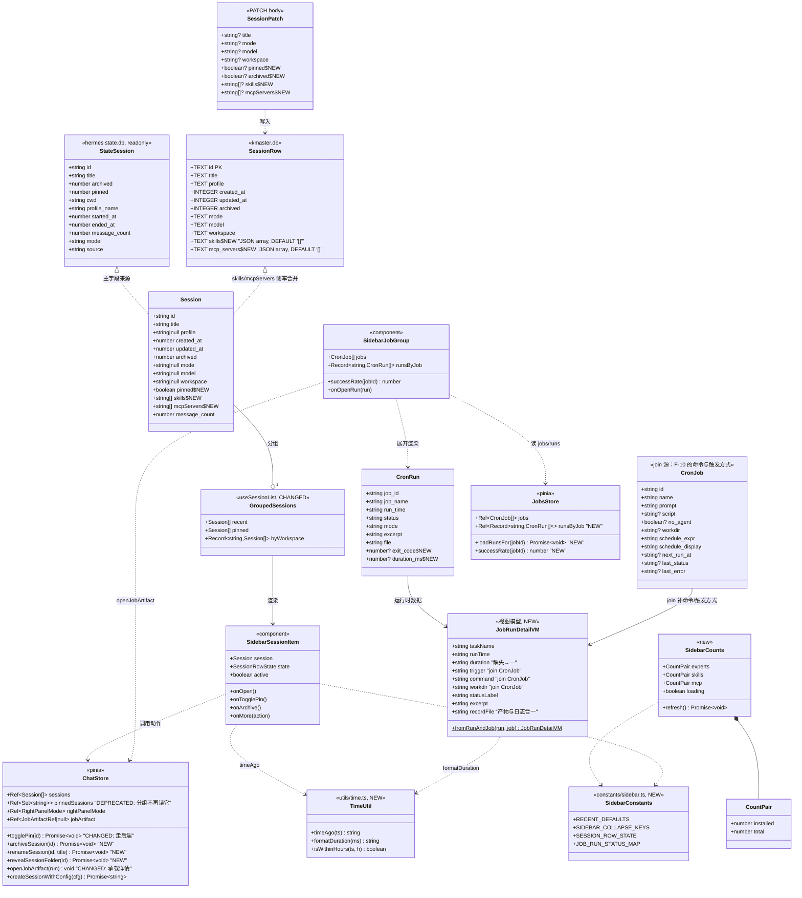
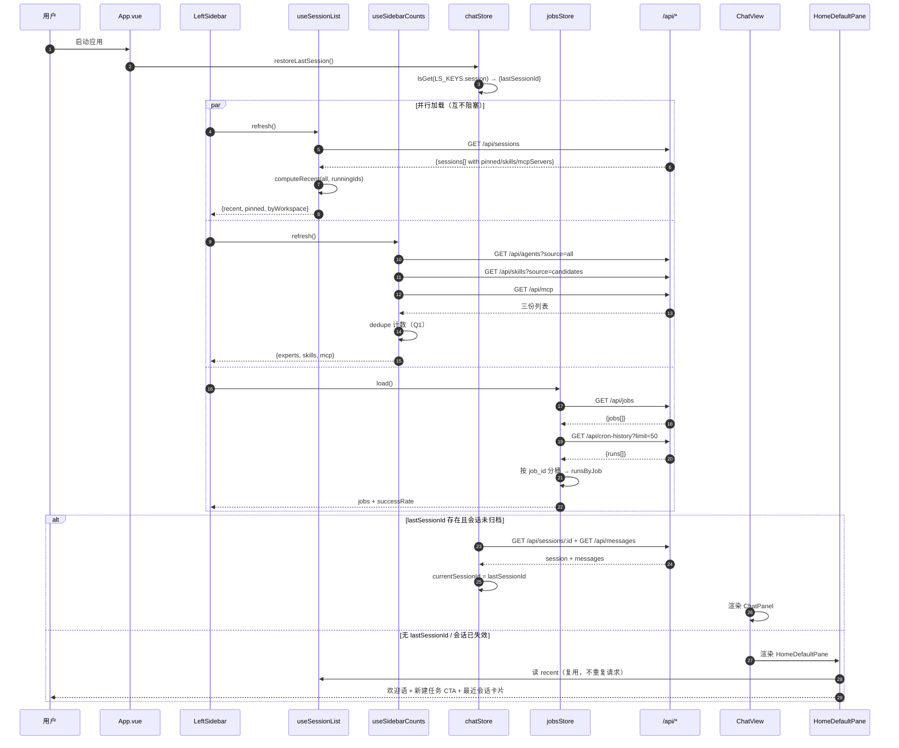
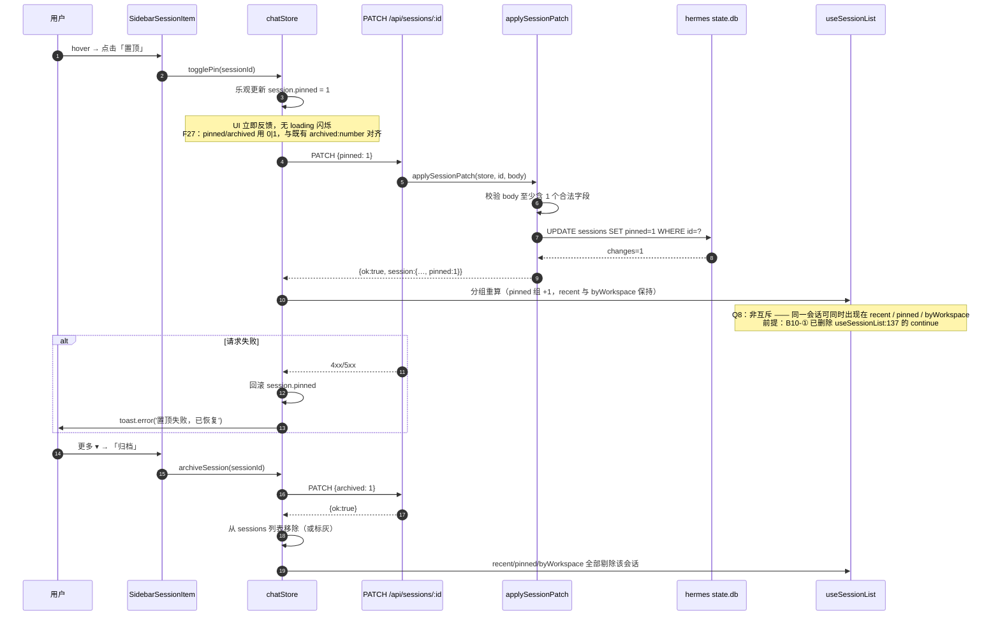
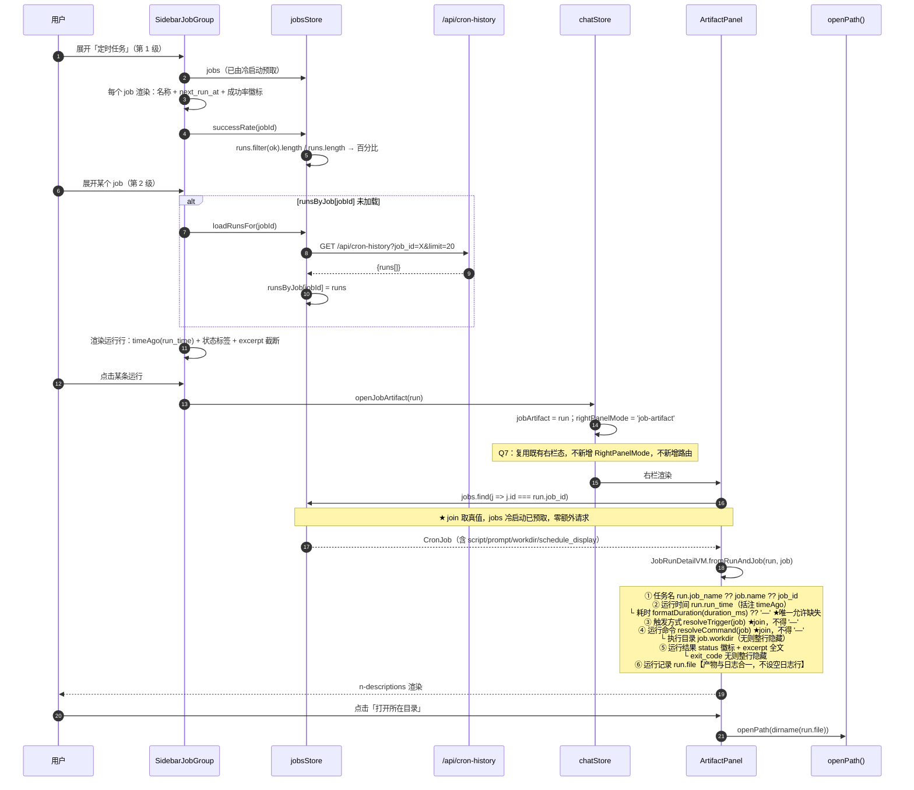
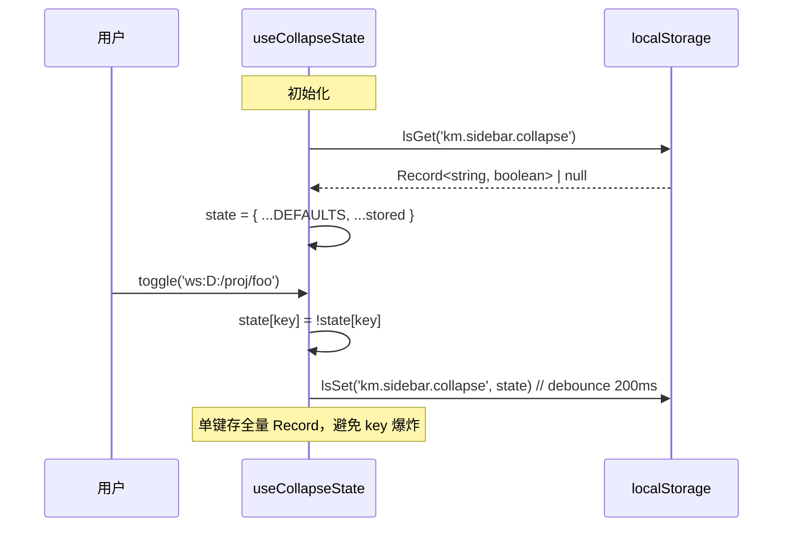
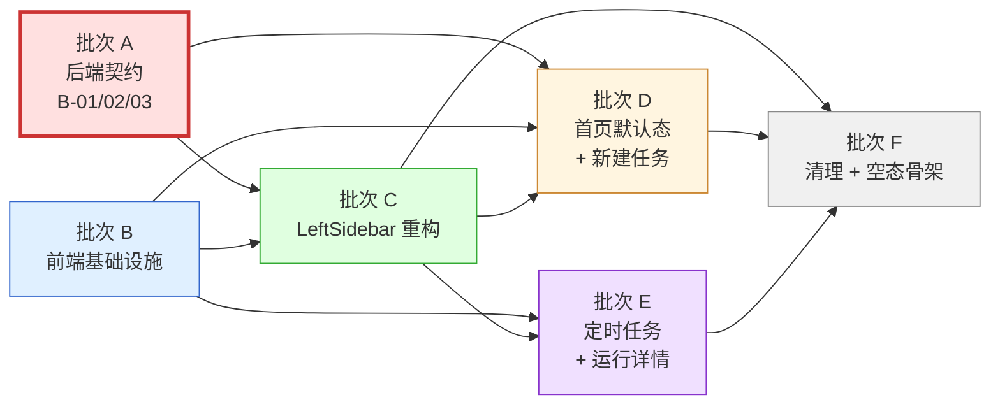
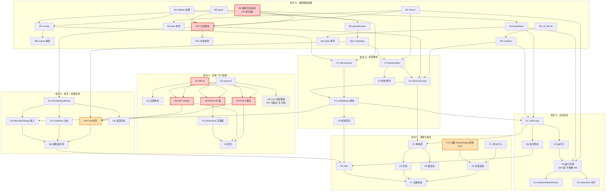

# 增量架构设计 + 任务分解：首页与左栏增强

| 项 | 值 |
|---|---|
| 文档编号 | DESIGN-2026-08-06-homepage-sidebar |
| 上游输入 | `docs/prd/incremental-homepage-sidebar-2026-08-06.md` |
| 架构师 | 高见远（Gao） |
| 日期 | 2026-08-06 |
| 类型 | **增量设计**（只描述相对现状的变更） |
| 版本 | **v1.2.1**（2026-08-06 深夜，主理人裁定 + 静默冲突专项扫描，共 11 条存量冲突入档） |
| 技术栈 | Vue 3 + Vite + Naive UI + Pinia（client）/ Koa + tsx + better-sqlite3（server） |
| 涉及包 | `packages/client`、`packages/server`（`packages/desktop` 本次不涉） |

---

## 修订记录

### v1.2（2026-08-06 深夜，存量代码冲突修订）

> **本版主题：从"要建什么"转向"现在实际是什么"。** v1.0/v1.1 都在设计新行为，但没人系统读过存量实现。本版修掉 6 处「存量默认行为与新需求方向相反」的静默冲突 —— 这类问题不报错、不冲突，只是安静地不满足需求。

| # | 变更 | 严重度 | 来源 |
|---|---|---|---|
| 10 | **新增 B0：删除 `stores/chat.ts` 的 `getGroupedSessions` 死代码副本** | 🔴 高 | PM 复核（C） |
| 11 | **B10 必须删除 `continue`** —— 现有分组是互斥的，直接违背 Q8 非互斥决策 | 🔴 高 | PM 复核（C-1） |
| 12 | **B10 数据源从 `store.pinnedSessions`（本地 Set）切到 `session.pinned`** | 🔴 高 | PM 复核（C-2） |
| 13 | **C3 `defaultExpanded` 重写**（非"保留"而是"新建"，见 F29 修正） | 🟠 中 | PM 复核（D）+ 我修正措辞 |
| 14 | **B10 新增 archived 过滤** —— 现有 `list` 完全不排除归档会话 | 🔴 高 | 我复核（F30） |
| 15 | **C2 补齐拖拽契约** —— 原设计遗漏，重构会静默丢失置顶拖拽排序 | 🔴 高 | **我自己的设计缺口**（F31） |
| 16 | ~~**B1 `timeAgo` 入参改 `number \| string`**；A6 `archived` 用 `0/1` 非布尔~~ → **类型部分作废，见 #18** | 🟠 中 | 我复核（F27/F28） |
| 17 | 新增 §7.7「存量行为对照表」；`SessionList.vue` 记入 P2 backlog | 🟢 低 | 我复核（F32） |

**工期影响**：+0.2 人日（B0 删死代码 0.05 + 拖拽契约 0.1 + archived 过滤 0.05），合计 **≈ 4.5 人日**。

### v1.2.1（2026-08-06 深夜，主理人裁定 + 静默冲突专项扫描）

> **本版主题：以已落地代码为真源回写文档，并补完静默冲突扫描。** 主理人指出 v1.2 存在两处「文档落后于实现」，另派专项扫描批次 B–F 全部存量客户端代码。**本轮新增 5 条静默冲突，其中 1 条（#19）是 P0 级、直接决定头号需求 F-01 能否可见。**

| # | 变更 | 严重度 | 来源 |
|---|---|---|---|
| 18 | **#16 类型部分作废**：实测已落地实现为 `archived: number(0\|1)`、`pinned: boolean` —— **两者不对称**，`readFlag` 接受 `boolean\|number\|null`（`null` = 清除覆盖回落 hermes）。以代码为准，不再要求统一成 `0/1` | 🟠 中 | **主理人裁定** |
| 19 | **新增 §3.10 首页默认态互斥契约**：`restoreLastSession()` + `ChatView` FIX-6 两道自动打开逻辑焊死 F-01；**同时修正 v1.1 C4 验收里「调用位置不变」这句错误措辞** | 🔴 **高（P0）** | 专项扫描（§7.7-7）／**我自己的设计缺口** |
| 20 | **§7.7 增补第 8–11 条**：`next_run_at` 两处绕过 `timeAgo`、菜单计数无消费方、「新建任务」不参与 active、Q8 非互斥后双高亮 | 🟠 中 | 专项扫描 |
| 21 | **U2 状态改「已闭合」**（实现见 `690855e`，A7 不再阻塞）；**U6 口径修正**：`next_run_at` 是本地时间串**不是 ISO** | 🟠 中 | 主理人事实同步 + 我复核 |
| 22 | **B1 降级为"零改动"**：`utils/time.ts` 的 `timeAgo` 已落地且测试覆盖 9 档边界，本期只需接线调用点 | 🟢 低 | 专项扫描 |

**工期影响**：+0.15 人日（§3.10 改造 0.15）－0.1 人日（B1 已完工）＝ **净 +0.05**，合计仍 **≈ 4.5 人日**。

### v1.1（2026-08-06，PM 裁决后修订）

| # | 变更 | 触发 |
|---|---|---|
| 1 | **F-10 缺口从 5 项收窄到 1 项** —— `command`/`trigger` 改为 join `CronJob` 取真值，不再当作缺失字段 | PM 复核指出 F21，我原判断核查半径不足 |
| 2 | **产物与日志合并为「运行记录」单行**，取消右栏双 tab | PM 裁决 + 我复核 F22 确认成立 |
| 3 | **A8 降级 P1→P2 且范围缩小**，只 pick `Duration`/`Exit Code`；E3 不再依赖 A8 | 同 1 |
| 4 | **E4 提级 P2→P1** 并改为 join 实现（原为"推导兜底"） | PM 定为不可缺失字段 |
| 5 | **工作区组间排序改为目录名字典序升序**（原错误方案：按活跃度倒序） | PM 指出违背用户原文「按名称排列」 |
| 6 | **未绑定工作目录组恒置最末**；引入 `UNBOUND_WORKSPACE_KEY` 区分内部 key 与展示文案 | PM 裁决 + 我发现 F24 数据污染风险 |
| 7 | **新增任务 F1b（P1）：消除 ShareDialog 死链** | PM 追加 + 我复核发现自动生成问题（F23） |
| 8 | 新增 §3.7 运行详情字段解析矩阵、§3.5b 工作区排序算法、§7.6b/§7.6c 共享知识 | 落地上述裁决 |
| 9 | 新增基线 F21–F26；`timeAgo` 增加未来时间分支 | 补充核实（含关闭 U6） |

**工期影响**：净变化 ≈ **0**。A8 缩小范围省下的量，被 F1b 新增抵消。批次 E 保持 P1，总计仍 ≈ 4.3 人日。

---

## 0. 现状基线（Fact Check 结论）

本节是设计的事实地基，全部由源码核实，工程师可直接信任。

| # | 事实 | 位置 | 对本次的影响 |
|---|---|---|---|
| F1 | `GET/POST/PATCH /api/sessions` 全链路**无** `skills` / `mcp_servers` 字段 | `packages/server/src/routes/sessions.ts` | B-01 必做 |
| F2 | `applySessionPatch()` 仅处理 `title`/`mode`/`model`/`workspace` | 同上 L~120 | B-02/B-03 扩展点 |
| F3 | `SessionRow` 无 `skills`/`mcp_servers` 列；`SCHEMA_VERSION = 1` | `packages/server/src/db.ts` | 需升到 2 + `ALTER TABLE` |
| F4 | hermes `state.db` 的 `StateSession` 无 skills/mcp（只有 `pinned`/`archived`/`cwd`…） | `packages/server/src/services/hermes/read/state-db.ts` | skills/mcp **落 kmaster.db**，读时 merge |
| F5 | 客户端 `createSessionWithConfig()` **已经**在 POST body 里发 `skills`/`mcp_servers`，后端丢弃 | `packages/client/src/stores/chat.ts` | B-01 落地后前端几乎零改动即生效 |
| F6 | `togglePin()` 只改本地 `pinnedSessions: Set<string>`，刷新即丢 | 同上 | B-02 后改为调 PATCH |
| F7 | `Session` 类型缺 `pinned` / `skills` / `mcpServers` | `packages/client/src/types/chat.ts` | 类型先行 |
| F8 | `getGroupedSessions` 返回 `{pinned, byWorkspace}`，`automations` 单独平铺 | `packages/client/src/composables/useSessionList.ts` | 重构为 `{recent, pinned, byWorkspace}` |
| F9 | 左栏时间显示为 `new Date(s.updated_at).toLocaleString()` | `LeftSidebar.vue` | 换 `timeAgo()` |
| F10 | 全仓**无** `timeAgo` / `dayjs` / `date-fns` | grep 全量无命中 | 需新建 `utils/time.ts`，**零新依赖** |
| F11 | 菜单按钮用 `:secondary="!active"` + `:ghost="active"` | `LeftSidebar.vue` | F-02 统一为 `quaternary` |
| F12 | `LS_KEYS` 现有 7 键，无 sidebar 相关 | `packages/client/src/constants/layout.ts` | 追加 2 键 |
| F13 | `RightPanelMode` 已含 `'job-artifact'`，`openJobArtifact(run)` 已实现 | `constants/layout.ts` / `stores/chat.ts` | Q7：**不新增枚举、不新增路由** |
| F14 | `CronRun` 仅 7 字段：`job_id/job_name/run_time/status/mode/excerpt/file` | `server/src/protocol.ts:203` + `client/src/types/chat.ts` | 缺口**仅「耗时」一项**（见 F21 修正） |
| F15 | `parseCronRunFile()` 用 `**Label:** value` 正则从 md 头抽字段，天然可扩展 | `server/src/hermes-proxy.ts:1021` | 渐进增强方案可行 |
| F16 | 定时任务后端完整：`GET /api/jobs`、`GET /api/cron-history?job_id=&limit=` | `server/src/routes/jobs.ts` + `stores/jobs.ts` | 前端可直接用 |
| F17 | `NewTaskDialog` 已存在，7 项表单，`emit('confirm', NewTaskConfig)` | `components/dialog/NewTaskDialog.vue` | Q6：直接复用，只改调用方 |
| F18 | 三个 counts composable 均**在 setup 时自动 `refresh()`** | `useExpertList/useSkillList/useMcpList` | 直接在左栏调用会打 3 个额外请求 → 需聚合层 |
| F19 | `MOCK_*` 常量早已删除，`no-mock-guard.spec.ts` 守卫在跑 | `src/test/no-mock-guard.spec.ts` | F-17 只剩 `MonitorSection.vue:31` 一处注释 + `stores/logs.ts` 演示回落 |
| F20 | 路由无 `/jobs/:id/runs/:runId` | `router/index.ts` | 印证 Q7：走右栏不走路由 |
| **F21** | **`CronJob` 已含 `script`/`prompt`/`no_agent`/`workdir`/`schedule_expr`/`schedule_display`/`last_status`/`last_error`** | `server/src/protocol.ts:182-201` | **PM 复核修正 F14**：F-10 的「运行命令」「触发方式」是**任务定义**信息，join `CronJob` 即可取真值，无需从 run md 刨。真实缺口只剩「耗时」 |
| **F22** | `CronContext` 只有 `outputDir = <hermesHome>/cron/output`，**无任何 log 目录概念**；`getCronHistory` 只扫 `.md`（`filter(f=>f.endsWith('.md'))`） | `server/src/hermes-proxy.ts:621-679, 1069` | **在 server 认知范围内不存在独立 log 文件**；即便 hermes 真产出 `.log`，现有代码也看不见 → 支持 PM 的「产物+日志合并为单行」裁决 |
| **F23** | `ShareDialog.vue` 生成 `#/share/:sid` 死链（`router` 无该路由），且 `watch(props.show)` **一打开弹窗就自动生成**，四个过期选项无后端支撑；已挂载于 `ChatView.vue:173` | `components/chat/ShareDialog.vue:38-71` | 比 PM 描述更严重：用户**无需点击**即拿到 404 链接 → 并入 F-17 处理 |
| **F24** | `'Default Workspace'` 字面量出现在 **3 处源码**，其中 `types/newTask.ts:49` 是 `defaultNewTaskConfig().workspace` 的**实际数据值**（会落库），另两处是展示回落 | `types/newTask.ts:49`、`stores/chat.ts:257`、`useSessionList.ts:42` | 改中文名**不能直接改字符串**，必须区分「内部 key」与「展示文案」，见 §3.4 与 §8-U7 |
| **F25** | `CronJob.next_run_at?: string \| null` —— **是本地时间串 `'YYYY-MM-DD HH:mm:ss'`，不是 ISO**（v1.2.1 修正，依据 `utils/time.ts:29` 已落地实现与测试） | `server/src/protocol.ts:190`；`client/src/types/chat.ts:247` | 关闭原 U6：`timeAgo` 需支持未来时间**且需解析本地串**，两者 `utils/time.ts` 均已实现（F37）。见 §7.3 |
| **F26** | 全仓 `'Default Workspace'` **无任何测试断言依赖**（grep 无 `.test.ts` 命中） | grep 全量 | 改展示文案安全 |
| **F27** | **`Session.archived: number`（非 boolean），`created_at`/`updated_at: number`（时间戳，非 ISO 串）** | `client/src/types/chat.ts:101-113` | ① A6 验收原写 `PATCH {archived:true}` **与类型冲突**，须改 `0/1`；② `timeAgo` 入参必须兼容 `number`，而 `CronJob.next_run_at` 是 `string`（F25）→ **签名须为 `number \| string`** |
| **F28** | `Session` **已有 `archived` 字段**（F7 只说缺 `pinned`/`skills`/`mcpServers`，此处补明确） | 同上 | B5 不需要新增 `archived`，只需新增 `pinned?` |
| **F29** | **「置顶任务」组不在 `n-collapse` 内**，是 `<div v-if>` 直接渲染；`n-collapse` 只包 workspace 分组；**Recent 组尚不存在** | `LeftSidebar.vue:349-396` vs `:399-408` | **修正 PM 表述**：`defaultExpanded` 不是"只保留 Recent 与置顶"（现在压根没有这两个 key），而是**新建**这两个固定 key 并**排除全部 workspace 组**。详见 §3.8 |
| **F30** | **`list` computed 完全不排除 `archived`** —— `base = store.sessions`（仅经搜索/三维过滤） | `useSessionList.ts:113-125` | 🔴 B-03 归档做完后，**归档会话仍显示在左栏**。与 C-2 同一失效模式：后端存对了、前端看不出效果 |
| **F31** | **拖拽排序仅 pinned 组有**（`draggable` + 4 个 drag 事件），workspace 组无；`dragIdx`/`onDragStart`/`onDragOver`/`onDrop`/`onDragEnd` 定义于 composable | `LeftSidebar.vue:358-366`；`useSessionList.ts:195-223, 289-292` | 🔴 **我 v1.1 的 C2 契约遗漏了拖拽 props/emit**，照原样重构会**静默丢失置顶拖拽排序**。见 §3.9 |
| **F32** | `components/chat/SessionList.vue` 已标 **`@deprecated`**，自带第三份 `dragIdx`/`onDrop` 副本，**全仓无 import 消费** | `SessionList.vue:3, 131-156` | 会话列表逻辑实际有**三份**副本（非 PM 说的两份）。此份已 deprecated 且无引用 → 记 P2 backlog，不塞进本期 |

| **F33** | 🔴 **两道自动打开会话逻辑**：`restoreLastSession()` 在 `onMounted`+watch 内，`if (activeSessionId) return;` 后**无条件**选中上次或**首个**会话；`ChatView.vue` FIX-6 再兜一次 `openSession(sessions[0].id)` | `LeftSidebar.vue:158-175`；`ChatView.vue:77-90` | 🔴🔴 **F-01 首页默认态永远不可见**。且 **v1.1 的 C4 验收「`restoreLastSession()` 调用位置不变」把这条反向行为写进了验收标准** —— 我自己的缺口。见 §3.10 |
| **F34** | `next_run_at` 渲染有**两处各自实现**且都绕过 `timeAgo`：`new Date(v).toLocaleString()`。`JobsView` 的 `fmt()` 有 NaN 兜底，**`LeftSidebar:458` 没有** | `LeftSidebar.vue:457-458`；`JobsView.vue:202-206, 278` | ⚠️ F25 要求相对时间，存量是绝对时间；两处口径还不一致。`:458` 在非 V8 引擎会渲染 `Invalid Date`。见 E1 |
| **F35** | 左栏菜单五个按钮**均无计数徽标**；`useSkillList` 已有 `installedCount`/`candidateCount` computed，**全仓无消费方** | `LeftSidebar.vue:295-344`；`useSkillList.ts:58-60` | 🕳 "计数完整"需求无落点。B7 须显式接线，见 §7.7-9 |
| **F36** | 「新建任务」是**动作按钮**（`showNewTask` 弹窗），恒 `type="default" secondary`，**不参与** `isMenuActive`；其余四个按 `currentPath.startsWith(path)` 判定 | `LeftSidebar.vue:296-299` vs `:104-112` | 🕳 B-02"统一 active 风格"时**易被误改成路由按钮**。契约须写明它是例外，见 §7.7-10 |
| **F37** | `utils/time.ts` **已落地**：`timeAgo(input: number\|string\|null\|undefined, now?)`，含 F25 未来分支与 U6 本地串解析；`time.test.ts` 覆盖 9 档边界+跨年+非法输入 | `utils/time.ts:87`；`time.test.ts` | ✅ **B1 本期零改动**。同时证明 **U6 结论"ISO"是错的** —— 实际是本地时间串 `'YYYY-MM-DD HH:mm:ss'`，已修正 |

> **F27/F29/F30/F31 的共同教训**：这四条都不是"设计得不好"，而是**没读存量代码**。它们在 UI 上不会报错，只会静默地不满足新需求。详见 §7.7。
>
> **F33–F37 是主理人派的第三轮专项扫描结果。** 值得记下的是：**前两轮各捞出 2 条和 4 条，第三轮仍能捞出 5 条，且其中 F33 是全表最严重的一条。** 说明"存量冲突"不是一次复核能扫干净的 —— 每一轮新决策落地，都会让一批原本无害的存量行为变成反向行为。§7.7 那张表应作为**活文档**维护到本期收尾。

---

## 1. 实现方案与框架选型

### 1.1 核心技术难点

| 难点 | 说明 | 解法 |
|---|---|---|
| **D1 双真源合并** | 会话真源在 hermes `state.db`（只读），但 `skills`/`mcpServers` 无处可存 | kmaster.db 建"侧车列"，读时以 `id` 为键 **left-join** 到 state.db 结果上 |
| **D2 Recent 并集去重** | `running ∪ 前5 ∪ 3h内` 三集合有交集，且 running 可能不在前 5 | 用 `Map<id, Session>` 收集，保持"running 优先 → updated_at 倒序"稳定排序，末尾截断 20 |
| **D3 计数请求放大** | 三个 list composable 各自 auto-refresh，左栏常驻会造成 N×请求 | 新建 `useSidebarCounts()` 单例聚合层（module-scope 缓存 + 手动 `refresh()`） |
| **D4 折叠态持久化** | 多层折叠（会话区/工作区/定时任务/单任务），刷新需还原 | 统一 `km.sidebar.collapse` 单键存 `Record<string, boolean>`，key 用命名空间前缀 |
| **D5 运行详情字段来源** | F-10 要 6 字段，`CronRun` 只有 7 个基础字段 | **join 优先 + 渐进增强兜底**：「运行命令」「触发方式」join `CronJob` 取真值（F21）；「产物/日志」合并单行（F22）；只有「耗时」允许长期缺失。详见 §3.7 字段解析矩阵 |
| **D6 迁移不可回滚** | SQLite `ALTER TABLE` 加列，老库需平滑升级 | `SCHEMA_VERSION: 1 → 2`，迁移体用 `try/catch` 包 `ALTER TABLE`（列已存在时吞掉），幂等 |

### 1.2 框架选型

**结论：本次增量不引入任何新的第三方依赖。**

| 需求 | 候选 | 决策 | 理由 |
|---|---|---|---|
| 相对时间 | `dayjs` / `date-fns` / 自研 | **自研 `utils/time.ts`（~40 行）** | 只需 5 档中文文案（刚刚/N分钟前/N小时前/N天前/绝对日期），引 dayjs 要 +7KB & i18n 插件，不划算 |
| 两级折叠 UI | `n-collapse` 嵌套 / `n-tree` / 手写 | **`n-collapse` 嵌套（现有用法）** | 左栏已在用 `n-collapse`，风格一致；`n-tree` 对自定义行内操作支持差 |
| 行内更多操作 | `n-dropdown` | **`n-dropdown`（trigger=click）** | Naive UI 原生，支持 `:options` 动态渲染 + `render-icon` |
| 骨架屏 | `n-skeleton` | **`n-skeleton`** | 已在依赖内 |
| 空态 | `n-empty` | **`n-empty` size=small** | 已在依赖内 |

### 1.3 架构模式

沿用现有分层，**不新增层**：

```
views/*.vue                    ← 页面
  └ components/layout/LeftSidebar.vue
      ├ components/sidebar/*.vue          【新增：把 785 行左栏拆成 4 个子组件】
      ├ composables/useSessionList.ts     【改：分组语义】
      ├ composables/useSidebarCounts.ts   【新增：计数聚合】
      └ stores/chat.ts | stores/jobs.ts   【改：pin/archive 走后端】
            └ api/client.ts               【改：新增 patchSession 等】
                  └ [HTTP] packages/server/src/routes/*.ts
                        ├ db.ts（kmaster.db：skills/mcp_servers 侧车列）
                        └ services/hermes/*（state.db 只读 + cron/jobs.json）
```

**关键架构决策 A1：拆分 `LeftSidebar.vue`。**
当前 785 行，本次要加"三态会话行 / 更多下拉 / 两级折叠定时任务 / 计数徽标 / 空态骨架"，不拆必然膨胀到 1400+ 行且不可测。拆为：

- `SidebarMenuGroup.vue`（5 个菜单按钮 + 计数徽标）
- `SidebarSessionGroup.vue`（Recent / Pinned / byWorkspace 三分组容器）
- `SidebarSessionItem.vue`（单行三态 + hover 操作 + 更多下拉）
- `SidebarJobGroup.vue`（定时任务两级折叠 + 成功率 + 运行行）

`LeftSidebar.vue` 退化为编排器（预计 ~200 行）。

---

## 2. 文件清单

> 路径均相对仓库根。**🆕 = 新增，✏️ = 修改**。

### 2.1 服务端（`packages/server`）

| 状态 | 路径 | 变更摘要 |
|---|---|---|
| ✏️ | `src/db.ts` | `SCHEMA_VERSION 1→2`；`SessionRow` 加 `skills?: string`/`mcp_servers?: string`；迁移体加两列；`getOrCreateSession` 支持写入；新增 `setSessionSkillsMcp()`、`setSessionFlags()` |
| ✏️ | `src/routes/sessions.ts` | `POST` 接收并落库 `skills`/`mcp_servers`；`GET /api/sessions` 与 `GET /api/sessions/:id` 出参 merge 侧车列并 camelCase 化；`applySessionPatch` 扩展 `pinned`/`archived`/`skills`/`mcpServers` |
| ✏️ | `src/protocol.ts` | `SessionSummary`/`SessionDetail` 加 `skills?: string[]`/`mcpServers?: string[]`；`CronRun` 加 4 个**可选**字段 |
| ✏️ | `src/hermes-proxy.ts` | `parseCronRunFile()` 多 pick `Duration`/`Exit Code`/`Command`/`Trigger`/`Log`；`getCronHistory` 透传 |
| ✏️ | `src/services/hermes/write/state-db.ts`（若存在写通道）或 `routes/sessions.ts` 内联 | `pinned`/`archived` 落 hermes state.db（若不可写则退回 kmaster.db 侧车，见 §8-U2） |
| 🆕 | `src/db.migrations.test.ts` | 迁移幂等性单测（v1 库升 v2、v2 库重复启动不报错） |

### 2.2 客户端（`packages/client`）

#### 基础设施层

| 状态 | 路径 | 变更摘要 |
|---|---|---|
| 🆕 | `src/utils/time.ts` | `timeAgo(ts)`、`formatDuration(ms)`、`isWithinHours(ts, h)` |
| 🆕 | `src/utils/time.test.ts` | 边界单测（0s/59s/1min/59min/1h/23h/1d/7d/跨年） |
| 🆕 | `src/constants/sidebar.ts` | `RECENT_DEFAULTS`、`SIDEBAR_COLLAPSE_KEYS`、`SESSION_ROW_STATE`、`JOB_RUN_STATUS_MAP` |
| ✏️ | `src/constants/layout.ts` | `LS_KEYS` 追加 `sidebarCollapse: 'km.sidebar.collapse'`、`sidebarRecent: 'km.sidebar.recent'` |
| ✏️ | `src/types/chat.ts` | `Session` 加 `pinned?: boolean`/`skills?: string[]`/`mcpServers?: string[]`；`CronRun` 加 4 可选字段；新增 `SessionRowState`、`JobRunSummary`、`SidebarCounts` |
| 🆕 | `src/composables/useSidebarCounts.ts` | 单例聚合专家/技能/MCP 的 `{installed, total}`（Q1 去重口径） |
| 🆕 | `src/composables/useSidebarCounts.test.ts` | 去重口径单测 |
| 🆕 | `src/composables/useCollapseState.ts` | 折叠态读写 + localStorage 持久化 |
| ✏️ | `src/api/client.ts` | 新增 `patchSession(id, patch)`、`listSessions(params)` 类型补齐 |

#### 逻辑层

| 状态 | 路径 | 变更摘要 |
|---|---|---|
| ✏️ | `src/composables/useSessionList.ts` | `getGroupedSessions` → `{recent, pinned, byWorkspace}`；剥离 `automations`；新增 `recentSessions` computed（Q2 并集语义） |
| ✏️ | `src/composables/useSessionList.test.ts` | 补 Recent 并集/去重/截断用例 |
| ✏️ | `src/stores/chat.ts` | `togglePin` 改走 PATCH + 乐观更新 + 失败回滚；新增 `archiveSession`、`renameSession`、`revealSessionFolder`；`openJobArtifact` 扩展承载 run 详情 |
| ✏️ | `src/stores/jobs.ts` | 新增 `runsByJob: Ref<Record<string, CronRun[]>>`、`successRate(jobId)`、`loadRunsFor(jobId)` |
| ✏️ | `src/stores/jobs.test.ts` | 成功率计算单测 |

#### 视图层

| 状态 | 路径 | 变更摘要 |
|---|---|---|
| ✏️ | `src/components/layout/LeftSidebar.vue` | **重构为编排器**：引入 4 个子组件，删除内联会话/定时任务渲染 |
| 🆕 | `src/components/sidebar/SidebarMenuGroup.vue` | 5 菜单按钮 + 计数徽标（F-02/F-03） |
| 🆕 | `src/components/sidebar/SidebarSessionGroup.vue` | Recent/Pinned/Workspace 三分组 + 折叠 + 空态/骨架 |
| 🆕 | `src/components/sidebar/SidebarSessionItem.vue` | 单行三态 + timeAgo + hover 操作 + 更多下拉（F-04~F-07） |
| 🆕 | `src/components/sidebar/SidebarJobGroup.vue` | 定时任务两级折叠 + 成功率徽标 + 运行行（F-09） |
| 🆕 | `src/components/sidebar/SidebarSessionItem.test.ts` | 三态渲染快照 |
| ✏️ | `src/views/ChatView.vue` | 首页默认态：`!sid` 时渲染 `HomeDefaultPane`（F-01） |
| 🆕 | `src/components/home/HomeDefaultPane.vue` | 首页默认态（欢迎 + 快捷入口 + 最近会话卡片） |
| ✏️ | `src/components/chat/ArtifactPanel.vue` | `job-artifact` 模式渲染 6 字段运行详情（F-10） |
| ✏️ | `src/components/settings/MonitorSection.vue` | 清理 `// Mock: 刷新数据` 注释与占位逻辑（F-17） |
| ✏️ | `src/views/JobsView.vue` | 与左栏一致的运行详情入口（复用 `openJobArtifact`） |

#### 文案

| 状态 | 路径 | 变更摘要 |
|---|---|---|
| ✏️ | `src/locales/zh-CN.ts` | 新增 sidebar/home/jobRun 三组 key |
| ✏️ | `src/locales/en.ts` | 同上（英文） |

**合计：新增 15 个文件，修改 18 个文件。**

---

## 3. 数据结构与接口契约

### 3.1 类图



### 3.2 数据库迁移契约（B-01）

```sql
-- packages/server/src/db.ts, SCHEMA_VERSION: 1 -> 2
-- 迁移体（幂等，用 try/catch 包裹，列已存在时静默跳过）
ALTER TABLE sessions ADD COLUMN skills       TEXT NOT NULL DEFAULT '[]';
ALTER TABLE sessions ADD COLUMN mcp_servers  TEXT NOT NULL DEFAULT '[]';
PRAGMA user_version = 2;
```

**落库/出参转换规则（硬约定）：**

| 层 | 命名 | 类型 |
|---|---|---|
| SQLite 列 | `skills`、`mcp_servers` | `TEXT`（JSON array 字符串），默认 `'[]'` |
| Server 内部 `SessionRow` | `skills`、`mcp_servers` | `string` |
| HTTP 出参（GET/PATCH 响应） | `skills`、`mcpServers` | `string[]` |
| HTTP 入参（POST/PATCH body） | **同时接受** `skills` + (`mcp_servers` \| `mcpServers`) | `string[]` |

> 入参双写兼容是因为 F5 —— 客户端 `createSessionWithConfig()` 现在发的是 snake_case 的 `mcp_servers`。后端两种都收，前端后续统一为 camelCase，避免破坏性变更。

### 3.3 HTTP 接口契约

#### B-01 `POST /api/sessions`（扩展）

```jsonc
// Request
{
  "id": "sess_xxx",              // 可选，缺省服务端生成
  "profile": "default",
  "workspace": "D:/proj/foo",
  "title": "重构左栏",            // 新增支持
  "mode": "craft",               // 新增支持
  "model": "claude-sonnet-4",    // 新增支持
  "skills": ["pdf", "xlsx"],                    // ★ 新增落库
  "mcp_servers": ["filesystem", "git"]          // ★ 新增落库（亦接受 mcpServers）
}
// Response 200
{
  "ok": true,
  "session": {
    "id": "sess_xxx", "title": "重构左栏",
    "skills": ["pdf", "xlsx"],                  // ★ camelCase 出参
    "mcpServers": ["filesystem", "git"],
    "pinned": false, "archived": 0,
    "workspace": "D:/proj/foo", "profile": "default",
    "mode": "craft", "model": "claude-sonnet-4",
    "created_at": 1770000000000, "updated_at": 1770000000000
  }
}
```

#### B-01 `GET /api/sessions`（出参扩展）

```jsonc
{
  "sessions": [{
    "id": "sess_xxx", "title": "…",
    "archived": 0, "pinned": true,              // ★ pinned 现在是 boolean 且持久化
    "workspace": "D:/proj/foo", "profile": "default",
    "model": "…", "source": "hermes", "mode": "craft",
    "created_at": 0, "updated_at": 0, "message_count": 12,
    "skills": ["pdf"],                          // ★ 来自 kmaster.db 侧车列
    "mcpServers": ["git"]                       // ★ 同上；无记录时返回 []
  }],
  "count": 1,
  "source": "hermes"
}
```

> **合并算法**：以 `querySessions()`（state.db）结果为主表，用 `store.getSessionsByIds(ids)` 一次性取 kmaster.db 侧车行，构 `Map<id, {skills, mcpServers}>` 做 O(n) merge。**禁止在循环里逐条查库。**

#### B-02/B-03 `PATCH /api/sessions/:id`（扩展）

```jsonc
// Request（全部字段可选，至少给 1 个）
{
  "title": "新标题",
  "pinned": true,          // ★ B-02
  "archived": true,        // ★ B-03（boolean，服务端转 0/1）
  "skills": ["pdf"],       // ★ B-01
  "mcpServers": ["git"],   // ★ B-01
  "mode": "plan", "model": "…", "workspace": "…"
}
// Response 200
{ "ok": true, "session": { /* 同 GET /:id 的完整出参 */ } }
// Response 400
{ "ok": false, "error": "no_valid_field", "message": "补丁体不含任何可更新字段" }
// Response 404
{ "ok": false, "error": "session_not_found", "message": "会话 sess_xxx 不存在" }
```

#### F-10 `GET /api/cron-history`（出参渐进增强）

```jsonc
{
  "runs": [{
    "job_id": "daily-report", "job_name": "每日简报",
    "run_time": "2026-08-06 09:00:00",
    "status": "success", "mode": "agent",
    "excerpt": "今日共处理 12 条…", "file": "D:/…/cron/output/daily-report/2026-08-06_09-00-00.md",
    // ★ 以下为可选增强：md 头能 pick 到就带上，pick 不到则省略 key
    "exit_code": 0,
    "duration_ms": 48300
  }]
}
```

> **本次不再新增 `command` / `trigger` / `log_file` 三个字段。**
> - `command` / `trigger` → 由前端 join `CronJob` 取真值（F21），后端不冗余存储。
> - `log_file` → server 认知内不存在独立日志文件（F22），产物与日志合并为「运行记录」单行。
>
> `A8` 的 `parseCronRunFile` 只需多 pick `Duration` 与 `Exit Code` 两个 label。

### 3.4 前端常量契约（`src/constants/sidebar.ts`）

```ts
/** Q2：Recent 分组口径 */
export const RECENT_DEFAULTS = {
  maxCount: 5,        // "倒序前 N 条"
  withinHours: 3,     // "N 小时内活跃"
} as const;

/** Recent 并集结果的硬上限（防止 running 会话过多撑爆左栏） */
export const RECENT_HARD_CAP = 20;

/** 折叠态 localStorage key 命名空间（单键存 Record<string, boolean>） */
export const SIDEBAR_COLLAPSE_KEYS = {
  recent:    'group:recent',
  pinned:    'group:pinned',
  workspace: (name: string) => `ws:${name}`,
  jobsRoot:  'group:jobs',
  job:       (jobId: string) => `job:${jobId}`,
} as const;

/** 会话行三态（Q8：分组非互斥，但行内视觉态互斥，优先级 running > active > idle） */
export const SESSION_ROW_STATE = {
  running: 'running',
  active:  'active',
  idle:    'idle',
} as const;
export type SessionRowState = typeof SESSION_ROW_STATE[keyof typeof SESSION_ROW_STATE];

/**
 * 未绑定工作目录的分组。
 * ⚠️ key 保持英文 'Default Workspace' 不变 —— 它同时是 defaultNewTaskConfig().workspace
 * 的实际落库值（F24），改字符串会污染数据。展示文案单独走 i18n。
 */
export const UNBOUND_WORKSPACE_KEY = 'Default Workspace';

/** 工作区分组排序（用户原文：「以工作目录（按名称排列）为分类会话list」） */
export const WORKSPACE_SORT = {
  /** 组间：目录名字典序升序；未绑定组恒置最末 */
  compareGroup(a: string, b: string): number {
    if (a === UNBOUND_WORKSPACE_KEY) return 1;   // 兜底桶永远最后
    if (b === UNBOUND_WORKSPACE_KEY) return -1;
    return a.localeCompare(b, 'zh-CN');
  },
  /** 组内：updated_at 倒序 */
  compareSession(a: { updated_at: number }, b: { updated_at: number }): number {
    return b.updated_at - a.updated_at;
  },
} as const;

/** 运行状态 → 展示映射 */
export const JOB_RUN_STATUS_MAP: Record<string, { label: string; type: 'success'|'error'|'warning'|'default' }> = {
  success: { label: '成功', type: 'success' },
  ok:      { label: '成功', type: 'success' },
  failed:  { label: '失败', type: 'error' },
  error:   { label: '失败', type: 'error' },
  running: { label: '运行中', type: 'warning' },
  unknown: { label: '未知', type: 'default' },
};
```

### 3.5 Recent 并集算法（Q2 规范实现）

```ts
// composables/useSessionList.ts
function computeRecent(all: Session[], runningIds: Set<string>, now = Date.now()): Session[] {
  const sorted = [...all]
    .filter((s) => !s.archived)
    .sort((a, b) => b.updated_at - a.updated_at);

  const bucket = new Map<string, Session>();          // 保序去重

  // ① running（最高优先级，先入 Map 保证排在最前）
  for (const s of sorted) if (runningIds.has(s.id)) bucket.set(s.id, s);
  // ② 倒序前 maxCount
  for (const s of sorted.slice(0, RECENT_DEFAULTS.maxCount)) bucket.set(s.id, s);
  // ③ withinHours 小时内活跃
  const cutoff = now - RECENT_DEFAULTS.withinHours * 3600_000;
  for (const s of sorted) if (s.updated_at >= cutoff) bucket.set(s.id, s);

  return [...bucket.values()].slice(0, RECENT_HARD_CAP);
}
```

> **注意**：`bucket.set()` 对已存在 key 不改变插入顺序（JS Map 语义），所以 running 会话稳定居首，其余按 `updated_at` 倒序。这是刻意依赖的语义，**写单测锁死**。

### 3.5b 工作区分组排序（PM 裁决修正）

> 🔴 **警告：本文件里有两个 `continue`，一个必须删、一个必须留 —— 别删错。**
>
> | | 位置 | 处置 |
> |---|---|---|
> | ❌ **必须删** | `useSessionList.ts:137` `if (store.pinnedSessions.has(s.id)) { pinned.push(s); continue; }` | 这是**互斥分组**的元凶，违背 Q8（B10-①） |
> | ✅ **必须留** | 下方 `if (s.archived) continue;` | 这是**归档过滤**，是 B10-③ 要新增的（F30），删了归档功能就废了 |
>
> 判据很简单：**跳过 `pinned` 的 continue 要删，跳过 `archived` 的 continue 要留。**

```ts
// composables/useSessionList.ts
function computeByWorkspace(all: Session[]): Array<{ key: string; label: string; items: Session[] }> {
  const map = new Map<string, Session[]>();
  for (const s of all) {
    if (s.archived) continue;          // ✅ 保留：归档过滤（B10-③ / F30）
    // ⚠️ 注意这里【没有】跳过 pinned 的分支 —— 置顶会话必须同时出现在工作区组（Q8 非互斥）
    const key = workspaceKeyOf(s);              // 无 workspace → UNBOUND_WORKSPACE_KEY
    (map.get(key) ?? map.set(key, []).get(key)!).push(s);
  }
  return [...map.entries()]
    .sort(([a], [b]) => WORKSPACE_SORT.compareGroup(a, b))     // ★ 组间：字典序，未绑定置末
    .map(([key, items]) => ({
      key,
      label: key === UNBOUND_WORKSPACE_KEY ? t('sidebar.unboundWorkspace') : key,
      items: items.sort(WORKSPACE_SORT.compareSession),         // ★ 组内：updated_at 倒序
    }));
}
```

**为什么组间必须是字典序而不是活跃度**（PM 的理由，我完全认同，记录在此防止后人"优化"回去）：

1. 用户原始需求逐字写的是「以工作目录（**按名称排列**）为分类会话list」。
2. 更本质的理由 —— **工作目录分组的价值在于位置稳定可预期**。用户记住"kmaster-studio 在第二个"就建立了肌肉记忆。按活跃度排会导致每次打开顺序都变，**功能上退化成第二个 Recent，与已有的 Recent 分组重复**。活跃度维度已由 Recent 承担，工作目录维度就该是稳定的字典序。

**未绑定组置末的理由**：它不是真实目录，是"其他/未分类"兜底桶。混在真实目录中间（`blog-site` / `Default Workspace` / `kmaster-studio`）会让用户误以为存在一个叫 Default Workspace 的实际目录。兜底桶置底是列表设计通例。

### 3.6 计数去重口径（Q1 规范实现）

```ts
// composables/useSidebarCounts.ts
const dedupe = <T>(list: T[], keyOf: (x: T) => string) =>
  new Set(list.map(keyOf).filter(Boolean)).size;

// 专家：唯一键 = name
experts: {
  installed: dedupe(installedExperts, e => e.name),
  total:     dedupe([...installedExperts, ...allCandidates], e => e.name),
}
// 技能：唯一键 = name
skills: {
  installed: dedupe(installedSkills, s => s.name),
  total:     dedupe([...installedSkills, ...allCandidates], s => s.name),
}
// MCP：唯一键 = id ?? name
mcp: {
  installed: dedupe(deployedMcps, m => m.id ?? m.name),
  total:     dedupe([...deployedMcps, ...allCandidates], m => m.id ?? m.name),
}
```

徽标渲染：`{installed} / {total}`；`total === 0` 时不渲染徽标（避免 `0 / 0` 噪声）。

### 3.7 F-10 运行详情字段解析矩阵（PM 裁决后的最终口径）

> **这是 E3 的实现规范，逐行照做。**「来源」列决定了取不到值时的定性：**join 类字段显示 `—` 属实现缺陷，QA 应判 Bug；只有「耗时」允许显示 `—`。**

| # | 展示项 | 来源 | 取值表达式 | 取不到时 |
|---|---|---|---|---|
| 1 | **任务名** | `CronRun` 主 + `CronJob` 回落 | `run.job_name \|\| job?.name \|\| run.job_id` | 显示 `job_id`，**不得空** |
| 2 | **运行时间** | `CronRun` | `run.run_time`（`YYYY-MM-DD HH:mm:ss`）+ 括注 `timeAgo()` | 显示 `—`（极罕见，解析已有文件名兜底） |
| 2b | └ **耗时** | `CronRun` 增强 | `formatDuration(run.duration_ms)` | **`—`（唯一允许长期缺失项，P2 backlog）** |
| 3 | **触发方式** | **join `CronJob`** | 见下方 `resolveTrigger()` | **不允许 `—`（判缺陷）** |
| 4 | **运行命令** | **join `CronJob`** | 见下方 `resolveCommand()` | **不允许 `—`（判缺陷）** |
| 4b | └ 执行目录 | join `CronJob` | `job?.workdir` | 该行整体隐藏（不显示空行） |
| 5 | **运行结果** | `CronRun` | `JOB_RUN_STATUS_MAP[run.status]` 徽标 + `run.excerpt` 全文 | 徽标回落 `unknown`；摘要为空显示「本次运行无输出摘要」 |
| 5b | └ exit_code | `CronRun` 增强 | `run.exit_code` | **整行隐藏**（非语义必需，不留空行） |
| 6 | **运行记录** | `CronRun` | `run.file` + 两个动作按钮 | 无 `file` 则整行隐藏 |

**第 6 项的合并决策（PM 裁决 + F22 证据）**：hermes 的 run md 既是产物也是运行记录，`CronRun` 只有一个 `file`，`CronContext` 无 log 目录概念。因此**不设「运行日志」独立行、不做右栏双 tab**，合并为单行「运行记录」，配两个动作：`[在右栏打开]`（渲染 md 全文）、`[打开所在目录]`（`openPath(dirname(file))`）。

> #### ⚠️ 接入真机后的首个验证项（PM 要求明码标价）
>
> **结论的强度边界**：本机无真实 hermes cron 目录。已证明的是「**现有 server 架构必然拿不到 log**」（`hermes-proxy.ts:1069` 硬编码 `.endsWith('.md')`，且 `CronContext` 无 log 目录）；**未证明**「hermes 本身不产出 `.log`」。这是两个强度完全不同的判断，合并是**当下正确决策，不是永久结论**。
>
> **验证动作**：接入真机后，第一件事是 `ls <hermesHome>/cron/` 看是否存在 `.log` 或独立日志目录。
>
> **若确有独立日志，回退成本 ≈ 0.3 人日**：
> | 改动 | 量 |
> |---|---|
> | `getCronHistory` 放开 `.md` 过滤 + `CronRun` 加 `log_file?` | 0.1 天 |
> | 「运行记录」单行拆回「产物 / 日志」两行 | 0.1 天 |
> | 右栏加 tab 切换（复用 `job-artifact` 模式，仍不新增枚举） | 0.1 天 |
>
> 有明码标价的回退路径，后人才敢按当前方案走。

```ts
/** 触发方式：优先 job 的调度表达式，无调度则判定为手动 */
function resolveTrigger(job?: CronJob): string {
  if (!job) return '未知';
  const expr = job.schedule_display || job.schedule_expr;
  return expr ? `定时（${expr}）` : '手动触发';
}

/** 运行命令：script 模式取脚本，agent 模式取 prompt */
function resolveCommand(job?: CronJob): string {
  if (!job) return '未知';
  if (job.no_agent || job.script) return job.script || '（脚本未配置）';
  return job.prompt || '（提示词未配置）';
}
```

> **join 的实现位置**：`ArtifactPanel` 从 `useJobsStore().jobs` 里 `find(j => j.id === run.job_id)`。`jobs` 在冷启动已预取（§4.1），**不需要额外请求**。若 `jobs` 尚未加载完（罕见竞态），显示骨架而非 `—`。

### 3.8 折叠默认态契约（修正 PM 的 D 条表述）

**存量现状（F29）**——必须先看清，否则会照着不存在的东西改：

```
LeftSidebar.vue:349  <div v-if="...pinned.length">        ← 置顶组：裸 div，无折叠能力
LeftSidebar.vue:399  <n-collapse :default-expanded-names="defaultExpanded">
LeftSidebar.vue:400    <n-collapse-item v-for="... in byWorkspace">  ← 只有 workspace 在 collapse 里
LeftSidebar.vue:98   const defaultExpanded = computed(() => Object.keys(...byWorkspace))  ← 全部展开
```

即：**置顶组根本没有折叠态，Recent 组还不存在，唯一在 collapse 里的 workspace 恰好是全展开** —— 与 F-05「各工作目录默认收缩」正好反向。

**目标契约**：三组统一为 `n-collapse-item`，默认态如下。

| 分组 | collapse name | 默认 | 理由 |
|---|---|---|---|
| Recent | `SIDEBAR_GROUP.RECENT`（`'__recent__'`） | **展开** | 高频入口，收起等于没有 |
| 置顶 | `SIDEBAR_GROUP.PINNED`（`'__pinned__'`） | **展开** | 用户主动置顶 = 声明高优先级 |
| 各工作目录 | workspace key 原值 | **全部收缩** | F-05 / §6.2 硬要求 |

```ts
// constants/sidebar.ts
export const SIDEBAR_GROUP = { RECENT: '__recent__', PINNED: '__pinned__' } as const;

// LeftSidebar.vue —— 注意是「固定两项」，不是从 byWorkspace 里挑
const defaultExpanded = computed<string[]>(() => [SIDEBAR_GROUP.RECENT, SIDEBAR_GROUP.PINNED]);
```

> ⚠️ **两个坑**：
> 1. name 前缀用 `__` 是为了**杜绝与真实目录名撞车** —— 用户完全可能有个目录就叫 `Recent`。
> 2. 这里是**首屏默认值**；用户手动折叠后的状态由 `useCollapseState`（B9）持久化接管，**二者优先级：持久化 > 默认值**。首次进入无持久化记录时才用 `defaultExpanded`。

### 3.9 会话行拖拽契约（补 v1.1 遗漏，F31）

**这是我 v1.1 的设计缺口**：C2 的 `SidebarSessionItem` 契约只写了三态/timeAgo/hover 操作/更多下拉，**没有拖拽**。而存量置顶组是支持拖拽排序的（`LeftSidebar.vue:358-366`）。照 v1.1 重构 → 功能静默消失，且没有任何测试会失败。

```ts
// SidebarSessionItem.vue props（新增部分）
interface Props {
  // ... 原有 props
  /** 是否允许拖拽排序。仅置顶组传 true，Recent/工作目录组传 false */
  draggable?: boolean;
  /** 组内索引，拖拽排序用；draggable=false 时可不传 */
  index?: number;
}
// emits（新增）
emit('drag-start', index: number)
emit('drag-over',  index: number)
emit('drop',       index: number)
emit('drag-end')
```

`SidebarSessionGroup.vue` 负责把这四个 emit 接到 composable 的 `onDragStart`/`onDragOver`/`onDrop`/`onDragEnd`，并把 `dragIdx` 下发用于 `km-dragging` 样式。

**为什么只有置顶组可拖**（保持存量语义，不扩大范围）：
- Recent 组按"running → updated_at 倒序"算法排序，**手工排序无处存储**，拖了刷新就回弹
- 工作目录组按字典序 + updated_at 排序，同理
- 置顶组是用户主动维护的列表，手工顺序有意义

> 若未来要让排序持久化，需后端加 `sort_order` 列 —— 记 P2 backlog，本期**维持现状：拖拽仅置顶组、仅内存态**。

### 3.10 首页默认态 vs 自动打开会话 —— 互斥契约（v1.2 新增，§7.7 第 7 条）

> 🔴 **这是本期头号需求 F-01 的生死线。存量有两道独立的自动打开逻辑，任何一道没拆，`HomeDefaultPane` 都永远不会出现，而且不报错、不失败任何测试。**

**存量两道逻辑（都要改）**：

| 位置 | 存量代码 | 问题 |
|---|---|---|
| `LeftSidebar.vue:158-175` | `restoreLastSession()`：`onMounted` + watch 内，`if (store.activeSessionId) return;` 之后**无条件**选中 `lastSessionId` 或首个会话 | 冷启动必定进会话页 |
| `ChatView.vue:77-90` | FIX-6：`if (!store.activeSessionId && store.sessions.length > 0) store.openSession(store.sessions[0].id);` | 即使上面拆了，这里再兜一次 |

**目标行为（F-01）**：

```
冷启动 → restoring
  ├─ 有明确意图（URL 带 sessionId／用户显式点击会话）→ openSession(该 id)
  ├─ 有 lastSessionId 且该会话仍存在且未归档   → openSession(lastSessionId)   ← 保留"恢复上次"
  └─ 其余全部情况（含"有会话但没有 lastSessionId"）→ activeSessionId 保持 null
                                                    → D2 的 sid 空分支渲染 HomeDefaultPane
```

**关键差异**：存量的兜底是「**没有 lastSessionId 就抓首个会话**」，新契约是「**没有 lastSessionId 就停在首页**」。删掉的只是"抓首个"这一步，**"恢复上次"要保留**（U4 的 `restoring` 三分支依赖它）。

**强制动作**：
1. `restoreLastSession()` 删除 `?? sessions[0]` 一类的兜底回落，改为**仅**处理 `lastSessionId` 命中且会话未归档的情况
2. `ChatView.vue` FIX-6 整段**删除**（它的历史目的是"防止右侧白屏"，而 `HomeDefaultPane` 正是白屏的正解，FIX-6 已被本期需求取代）
3. 归档过滤要一并生效：`lastSessionId` 指向的会话若已 `archived`，视为未命中，回落首页

> ⚠️ **v1.1 的 C4 验收原文写了「`restoreLastSession()` 调用位置不变」，是错的，本版已改。** 调用位置确实不变（仍在 `onMounted`），但**函数内部的兜底分支必须改**，且 `ChatView` 那一处必须删 —— 原措辞会让工程师以为整块不用动。

---

## 4. 程序调用流程

### 4.1 冷启动 → 首页默认态（F-01）



### 4.2 新建任务全链路（F-08 + B-01）

```mermaid
sequenceDiagram
    autonumber
    participant U as 用户
    participant LS as LeftSidebar
    participant ND as NewTaskDialog
    participant CS as chatStore
    participant API as POST /api/sessions
    participant SV as routes/sessions.ts
    participant DB as kmaster.db
    participant HD as hermes state.db
    participant R as vue-router

    U->>LS: 点击「新建任务」
    LS->>ND: show = true（恒非激活态，F-02）
    ND->>ND: resolveDefaultModel() 填充 provider/model
    U->>ND: 填 title / agent / skills / mcpServers / securityMode / workspace
    U->>ND: 点击确认
    ND->>ND: canConfirm 校验 title 非空
    ND-->>LS: emit('confirm', NewTaskConfig)

    LS->>CS: createSessionWithConfig(config)
    CS->>API: POST {title, profile, workspace, mode, model,<br/>skills, mcp_servers}
    API->>SV: 路由处理
    SV->>HD: getOrCreateSession(id, profile, workspace)
    HD-->>SV: StateSession
    SV->>DB: UPSERT sessions SET skills=?, mcp_servers=?<br/>(JSON.stringify)
    DB-->>SV: ok
    SV->>SV: merge state.db 主字段 + 侧车列 → camelCase
    SV-->>CS: {ok:true, session:{…, skills:[], mcpServers:[]}}

    CS->>CS: sessions.unshift(session); currentSessionId = id
    CS->>CS: lsSet(LS_KEYS.session, {lastSessionId: id})
    CS-->>LS: sessionId
    LS->>R: router.push('/')
    LS->>LS: sl.refresh() → recent 立即含新会话
```

### 4.3 会话置顶 / 归档持久化（B-02 / B-03 + F-06）



### 4.4 定时任务两级折叠 → 运行详情（F-09 / F-10，Q7）



### 4.5 折叠态持久化



---

## 5. 任务列表（核心交付）

### 5.1 批次总览



> **A 与 B 无依赖，可并行开工。** A 是 P0 硬阻塞（B-01 卡住 D 的 F-08 验收），建议优先派人。

### 5.2 详细任务表

#### 批次 A — 后端契约（P0，阻塞项）

| ID | 任务 | 文件 | 依赖 | 优先级 | 验收 |
|---|---|---|---|---|---|
| **A1** | **DB Schema 升级到 v2** | `server/src/db.ts` | — | P0 | 老 v1 库启动后自动加两列且 `user_version=2`；重复启动不报错；新库直接建全列 |
| **A2** | **迁移幂等性单测** | 🆕`server/src/db.migrations.test.ts` | A1 | P0 | 覆盖：v1→v2 升级、v2→v2 空转、列已存在时 `ALTER` 异常被吞 |
| **A3** | **protocol.ts 契约扩展** | `server/src/protocol.ts` | — | P0 | `SessionSummary`/`SessionDetail` 加 `skills?`/`mcpServers?`；`CronRun` 加 5 可选字段；`tsc --noEmit` 通过 |
| **A4** | **POST /api/sessions 落库 skills/mcp** | `server/src/routes/sessions.ts` | A1,A3 | P0 | POST 带 `skills:["pdf"]` + `mcp_servers:["git"]` → 库内 `skills='["pdf"]'`；响应含 camelCase 数组 |
| **A5** | **GET 出参 merge 侧车列** | `server/src/routes/sessions.ts` | A1,A3 | P0 | `GET /api/sessions` 与 `GET /:id` 均返回 `skills`/`mcpServers`；无记录返回 `[]`；**单次批量查库，不得 N+1** |
| **A6** | **applySessionPatch 扩展 4 字段** | `server/src/routes/sessions.ts` | A1,A3 | P0 | PATCH `{pinned:0\|1}` / `{archived:0\|1}` / `{skills:[]}` / `{mcpServers:[]}` 各自生效；空 body 返回 400 `no_valid_field`。⚠️ **F27：`archived` 现有类型是 `number` 不是 `boolean`**，`pinned` 新增列须与之保持一致用 `INTEGER 0/1`，**不要引入 boolean 制造两套约定** |
| **A7** | ~~**pinned/archived 写通道**~~ **✅ 已完工（`690855e`）** | `server/src/routes/sessions.ts` | A6 | ~~P0~~ | **U2 已闭合**：hermes `state.db` 实测只读 → 走 **kmaster.db 侧车 + Q1 三态覆盖**，GET 时 `resolveTriStateFlag` merge。<br/>⚠️ **契约以代码为真源（主理人裁定）**：响应里 `archived: number(0\|1)`（`:129`）、`pinned: boolean`（`:131`），**两者不对称**；写入侧 `readFlag` 接受 `boolean \| number \| null`，**`null` = 清除覆盖、回落 hermes 原值**（`:266-271`）。客户端按此写类型，不要"顺手统一" |
| **A8** | **cron run 字段渐进增强（已缩小范围）** | `server/src/hermes-proxy.ts` | A3 | **P2** | `parseCronRunFile` 只多 pick **`Duration` 与 `Exit Code` 两个 label**；解析不到不设该字段（**不得填 `''`/`0`**）。`Command`/`Trigger` 改由前端 join CronJob（F21），**不在此任务范围**；`Log` 不做（F22） |
| **A9** | **接口回归自测** | — | A4-A8 | P0 | curl/vitest 覆盖 POST→GET→PATCH→GET 全链路一致性 |

**批次 A 交付信号**：前端可以在不改一行代码的前提下，让 `createSessionWithConfig()` 的 skills/mcpServers 真正落库并回显（因 F5）。

---

#### 批次 B — 前端基础设施（P0，可与 A 并行）

| ID | 任务 | 文件 | 依赖 | 优先级 | 验收 |
|---|---|---|---|---|---|
| **B1** | ~~**`utils/time.ts`**~~ **✅ 已完工，本期零改动** | `client/src/utils/time.ts` | — | ~~P0~~ | **v1.2.1 降级**：实测已落地 `timeAgo(input: number \| string \| null \| undefined, now = Date.now())`，含 F25 未来分支（"即将"/"N 分钟后"）与 U6 本地串兼容，`time.test.ts` 已覆盖 9 档边界 + 跨年 + 非法输入→`'—'`。**不要重写**，只需让调用点用起来（见 E1 与 §7.7-8） |
| **B2** | **time 单测** | 🆕`client/src/utils/time.test.ts` | B1 | P0 | 9 个边界：0/59s/60s/59min/60min/23h/24h/6d/7d；跨年绝对格式 |
| **B3** | **`constants/sidebar.ts`** | 🆕`client/src/constants/sidebar.ts` | — | P0 | 导出 §3.4 全部常量；`RECENT_DEFAULTS` 值必须为 `{maxCount:5, withinHours:3}` |
| **B4** | **`LS_KEYS` 追加 2 键** | `client/src/constants/layout.ts` | — | P0 | `sidebarCollapse:'km.sidebar.collapse'`、`sidebarRecent:'km.sidebar.recent'`；**不改动既有 7 键** |
| **B5** | **`types/chat.ts` 类型补齐** | `client/src/types/chat.ts` | — | P0 | `Session` 加 `pinned?:boolean`/`skills?:string[]`/`mcpServers?:string[]`；`CronRun` 加 5 可选字段；新增 `SessionRowState`/`SidebarCounts`/`CountPair`；`vue-tsc` 通过 |
| **B6** | **`api/client.ts` 补 patchSession** | `client/src/api/client.ts` | B5 | P0 | `patchSession(id, patch: SessionPatch): Promise<Session>`；错误走既有 `http()` 异常通道 |
| **B7** | **`useSidebarCounts.ts`** | 🆕`client/src/composables/useSidebarCounts.ts` + `LeftSidebar.vue:295-344` | B3,B5 | P0 | module-scope 单例；**手动 refresh，不 auto-refresh**；三源并行 `Promise.allSettled`；单源失败不影响其余；去重口径同 §3.6。<br/>🕳 **§7.7-9**：菜单五个按钮**现在完全没有计数徽标**，且 `useSkillList.ts:58-60` 已有的 `installedCount`/`candidateCount` **全仓无消费方** —— 本任务必须把徽标接到菜单上，否则"计数完整"需求会静默落空。<br/>🕳 **§7.7-10**：「新建任务」是**动作按钮**，**不加计数、不参与 active 判定**，别给它编路由 |
| **B8** | **counts 单测** | 🆕`client/src/composables/useSidebarCounts.test.ts` | B7 | P1 | 重名专家只计 1 次；MCP 用 `id ?? name`；某源 reject 时其余仍出数 |
| **B9** | **`useCollapseState.ts`** | 🆕`client/src/composables/useCollapseState.ts` | B4 | P0 | `isCollapsed(key)`/`toggle(key)`/`setAll(record)`；单键存全量 Record；写入 debounce 200ms；`JSON.parse` 失败静默回落默认值 |
| **B0** | **🔴 删除 `getGroupedSessions` 死代码副本** | `client/src/stores/chat.ts`（删 `:244-262` 定义 + `:842` 导出） | — | **P0** | **必须最先做**。`stores/chat.ts` 那份**无任何组件消费**（全仓 grep 确认，`LeftSidebar` 4 处全走 `sl.getGroupedSessions`），但它挂在 store 上"看起来更正统"，工程师全局搜很可能先改它 → **改完界面没反应，白排一轮**。删完 `vue-tsc` + 全量测试须通过 |
| **B10** | **`useSessionList` 分组重构** | `client/src/composables/useSessionList.ts` | B0,B1,B3,B5 | P0 | `getGroupedSessions` → `{recent, pinned, byWorkspace}`；`automations` 从返回值移除；`computeRecent` 严格按 §3.5；`byWorkspace` 严格按 §3.5b（**组间字典序升序 + 未绑定置末**，组内 `updated_at` 倒序）；**`workspaceKeyOf` 的回落 key 保持 `'Default Workspace'` 字面量不变**（F24），只改展示 label。<br/>🔴 **三处存量冲突必须同时修掉，漏一个都会静默失效**：<br/>**① 删掉 `:137` 的 `continue`** —— 现有实现是**互斥分组**（置顶会话被踢出 byWorkspace），直接违背 Q8 非互斥决策。不删则 §7.6 的 `${groupKey}:${id}` 复合 key 方案**永远用不上**（压根不会有重复）。<br/>**② 数据源 `store.pinnedSessions.has(s.id)` → `s.pinned`** —— 现读本地 Set（F6），B-02 持久化做完后若不切，表现为"后端存对了、刷新后置顶还是没了"，工程师会去查后端白排一轮。<br/>**③ `list` computed 增加 `archived` 过滤**（F30）—— 现有 `base = store.sessions` **完全不排除归档**，B-03 做完后归档会话仍显示。注意 `archived` 是 `number`，判据用 `!s.archived` |
| **B11** | **分组单测** | `client/src/composables/useSessionList.test.ts` | B10 | P0 | ① running 稳定居首 ② 三集合交集只出现 1 次 ③ 超 20 条截断 ④ **archived 被排除**（F30 回归锁） ⑤ Q8：同一会话同时在 recent 和 pinned ⑥ **工作区组间字典序**（`blog` < `kmaster` < `ops`）⑦ **未绑定组恒在最后一位**（即使名称字典序应排前）<br/>🔴 **⑧ 新增（锁死 C-1）**：`pinned:1` 且 `workspace:'kmaster'` 的会话，**必须同时出现在 `pinned` 和 `byWorkspace['kmaster']` 两处** —— 这条直接断言 `continue` 已删除，是 Q8 的回归锁<br/>🔴 **⑨ 新增（锁死 C-2）**：分组只依赖 `session.pinned`，**mock 一个空的 `store.pinnedSessions` Set 时置顶组仍正确** |
| **B12** | **chatStore 动作改造** | `client/src/stores/chat.ts` | B6 | P0 | `togglePin` 乐观更新 + PATCH + 失败回滚；新增 `archiveSession`/`renameSession`/`revealSessionFolder`；`createSessionWithConfig` 的 body 统一带 `skills`+`mcp_servers`（保持兼容） |
| **B13** | **jobsStore 运行数据** | `client/src/stores/jobs.ts` | B5 | P1 | `runsByJob: Record<string, CronRun[]>`；`loadRunsFor(jobId)`（懒加载 + 去重请求）；`successRate(jobId)` 返回 0-100 整数，无运行记录返回 `-1`（前端不渲染徽标） |
| **B14** | **jobsStore 单测** | `client/src/stores/jobs.test.ts` | B13 | P1 | 成功率算法（3 成功/1 失败 = 75）；`status` 大小写与 `ok`/`success` 同义；空数组 → `-1` |

---

#### 批次 C — LeftSidebar 重构（P0）

| ID | 任务 | 文件 | 依赖 | 优先级 | 验收 |
|---|---|---|---|---|---|
| **C1** | **`SidebarMenuGroup.vue`** | 🆕`client/src/components/sidebar/SidebarMenuGroup.vue` | B3,B7 | P0 | **F-02**：未激活一律 `quaternary`，激活用 `tertiary`+主色文字；「新建任务」**恒未激活**（不参与 `isMenuActive`）。**F-03**：专家/技能/MCP 右侧 `{installed}/{total}` 徽标，`total===0` 不渲染 |
| **C2** | **`SidebarSessionItem.vue`** | 🆕`client/src/components/sidebar/SidebarSessionItem.vue` | B1,B3,B12 | P0 | **F-04** 三态：running（脉冲点+主色）/ active（左侧色条+加粗）/ idle。**F-05** 副行 `timeAgo(updated_at)`。**F-06** hover 显 置顶/归档 两个 icon-btn。**F-07** 更多 ▾ `n-dropdown`：打开文件夹 / 重命名 / **分享（`disabled:true` + tooltip「即将上线」，本期不接线 —— PM 已裁决，现有 ShareDialog 是死链见 F23）** / 删除(danger)。<br/>🔴 **补 §3.9 拖拽契约（v1.1 遗漏）**：新增 `draggable?`/`index?` props + `drag-start`/`drag-over`/`drop`/`drag-end` 四个 emit。**存量置顶组支持拖拽排序（F31），照 v1.1 契约重构会静默丢失该功能且无测试报错**。<br/>⚠️ **§7.7-11 双高亮为预期行为**：Q8 改非互斥后，同一会话会在置顶组和工作区组各渲染一份，两份 `active` 判定都是 `s.id === store.activeSessionId` → **两处同时高亮**。这是正确的（同一实体的两个入口），**不要"修"成只高亮一处**；QA 见到双高亮不判缺陷 |
| **C3** | **`SidebarSessionGroup.vue`** | 🆕`client/src/components/sidebar/SidebarSessionGroup.vue` | B9,B10,C2 | P0 | 三分组顺序：**Recent → Pinned → 按工作区**。工作区组**必须消费 B10 已排好序的数组，不得在组件内二次排序**。每组 `n-collapse` 折叠态走 `useCollapseState`。组标题右侧显条目数。Q8：**key 必须是 `${groupKey}:${session.id}`** 防冲突。未绑定组 label 走 i18n `sidebar.unboundWorkspace`（中文「未绑定工作目录」）。<br/>🔴 **折叠默认态按 §3.8 重写**：三组统一为 `n-collapse-item`（**注意存量置顶组是裸 `div` 无折叠能力、Recent 组不存在**，F29 —— 是「新建两个固定 key」而非「保留」）。`defaultExpanded` **只含 `SIDEBAR_GROUP.RECENT` 与 `SIDEBAR_GROUP.PINNED` 两个常量**，**所有 workspace 组默认收缩**（F-05；存量 `LeftSidebar.vue:98` 是全展开，方向相反）。持久化态优先级高于默认值。<br/>🔴 **拖拽转接**：把 C2 的四个 drag emit 接到 composable 的 `onDragStart/onDragOver/onDrop/onDragEnd`，`dragIdx` 下发用于 `km-dragging` 样式；**仅置顶组传 `draggable=true`** |
| **C4** | **`LeftSidebar.vue` 编排化** | `client/src/components/layout/LeftSidebar.vue` | C1,C2,C3 | P0 | 删除内联会话渲染；引入 3 个子组件；文件 ≤ 250 行；既有 resize/宽度逻辑零回归。<br/>🔴 **按 §3.10 改造自动打开链路**：`restoreLastSession()` 调用位置不变但**删除「抓首个会话」兜底**（保留"恢复上次"）；**`ChatView.vue:77-90` FIX-6 整段删除**。验收：清空 `lastSessionId` 后冷启动，右侧必须是 `HomeDefaultPane` 而非任意会话 |
| **C5** | **组件单测** | 🆕`client/src/components/sidebar/SidebarSessionItem.test.ts` | C2 | P1 | 三态 class 断言；更多下拉 options 数量与 disabled 态；点击 emit 正确 action；**分享项必须断言 `disabled===true`**（F1b 回归锁）；**`draggable=true` 时四个 drag emit 正确触发**（F31 回归锁） |
| **C6** | **左栏视觉回归自查** | — | C4 | P0 | 对照 PRD UI 稿逐项核对：默认收缩态、展开态、三态行、hover 操作位置。<br/>🔴 **存量功能不回归清单**（§7.7）：① 置顶组拖拽排序仍可用 ② 右键菜单仍可用 ③ 重命名 inline input 仍可用 ④ 导出仍可用 ⑤ 搜索/三维过滤仍可用 ⑥ `km-session-highlight` 高亮仍生效 |

---

#### 批次 D — 首页默认态 + 新建任务（P0/P1）

| ID | 任务 | 文件 | 依赖 | 优先级 | 验收 |
|---|---|---|---|---|---|
| **D1** | **`HomeDefaultPane.vue`** | 🆕`client/src/components/home/HomeDefaultPane.vue` | B1,B10 | P0 | **F-01**：无当前会话时展示 欢迎语 + 「新建任务」主 CTA + 最近会话卡片（复用 `recent`，最多 6 张，含标题/timeAgo/workspace/状态点）+ 三个快捷入口（专家/技能/MCP） |
| **D2** | **`ChatView.vue` 分支渲染** | `client/src/views/ChatView.vue` | D1 | P0 | `sid` 为空 → `<HomeDefaultPane>`；有 `sid` → 现有 `<ChatPanel>`。**header 区的 mode/model 徽标已有 `v-if="sid"` 守卫，不动** |
| **D3** | **NewTaskDialog 接入左栏** | `client/src/components/layout/LeftSidebar.vue` + `HomeDefaultPane.vue` | C4,D1 | P0 | **Q6 复用**：左栏「新建任务」与首页 CTA 共用同一个 `NewTaskDialog` 实例（提到 `LayoutShell` 或用 `provide/inject` 共享 `show` ref，避免双实例状态分裂） |
| **D4** | **F-08 skills/mcp 续配闭环** | `client/src/stores/chat.ts` | A4,A5,B12 | P0 | 新建任务勾选 skills/mcp → 刷新页面 → `GET /api/sessions/:id` 回读一致；会话设置抽屉可改并 PATCH 生效 |
| **D5** | **首页空态** | `HomeDefaultPane.vue` | D1 | P1 | 零会话时：`n-empty` + "还没有任务，点击上方新建一个吧" |
| **D6** | **端到端手测** | — | D1-D5 | P0 | 冷启动无会话→首页默认态→新建带 skills 的任务→跳转会话→刷新→左栏 recent 含新会话且 skills 回显 |

---

#### 批次 E — 定时任务两级折叠 + 运行详情（P1）

| ID | 任务 | 文件 | 依赖 | 优先级 | 验收 |
|---|---|---|---|---|---|
| **E1** | **`SidebarJobGroup.vue`** | 🆕`client/src/components/sidebar/SidebarJobGroup.vue` | B9,B13,C4 | P1 | **F-09**：第 1 级「定时任务」折叠；第 2 级每个 job 折叠。job 行：名称 + `timeAgo(next_run_at)` + 成功率徽标（`≥90%` success / `60-89%` warning / `<60%` error / `-1` 不渲染）。展开时懒加载 `loadRunsFor`。<br/>⚠️ **§7.7-8 存量绕过**：`LeftSidebar.vue:458` 用 `new Date(job.next_run_at).toLocaleString()`（**无 NaN 兜底**）、`JobsView.vue:202-206` 用本地 `fmt()` 同法 —— **两处都绕过 `timeAgo` 输出绝对时间**。本任务须把两处统一改为 `timeAgo(job.next_run_at)` 并删除 `JobsView` 的本地 `fmt()`，否则同一字段在左栏和列表页显示口径不一致 |
| **E2** | **运行行渲染** | `SidebarJobGroup.vue` | E1 | P1 | 每条运行：`timeAgo(run_time)` + `JOB_RUN_STATUS_MAP` 状态标签 + excerpt 单行省略；点击 → `chatStore.openJobArtifact(run)` |
| **E3** | **`ArtifactPanel` 运行详情（join 版）** | `client/src/components/chat/ArtifactPanel.vue` | B1,B5,B13 | P1 | **F-10 + Q7**：`rightPanelMode==='job-artifact'` 时按 **§3.7 矩阵**用 `n-descriptions` 渲染。**硬约束**：① 触发方式/运行命令必须 join `CronJob` 取真值，**显示 `—` 判缺陷**；② 产物与日志**合并为「运行记录」单行**，不设空日志行、不做双 tab；③ `workdir`/`exit_code` 无值时**整行隐藏**而非显示 `—`；④ 只有「耗时」允许 `—`。**注意本任务不再依赖 A8** |
| **E4** | **`JobRunDetailVM` join 逻辑** | `ArtifactPanel.vue` 或 🆕`utils/jobRunDetail.ts` | E3 | P1 | 实现 §3.7 的 `resolveTrigger()`/`resolveCommand()`/`fromRunAndJob()`；从 `useJobsStore().jobs` find，**不发额外请求**；`jobs` 未加载完时显示骨架而非 `—`。**从 P2 提到 P1**（PM 定为不可缺失字段） |
| **E5** | **JobsView 入口对齐** | `client/src/views/JobsView.vue` | E3 | P2 | 列表页点击运行记录也走 `openJobArtifact`，与左栏行为一致 |
| **E6** | **定时任务空态** | `SidebarJobGroup.vue` | E1 | P1 | 无 job：`n-empty` "暂无定时任务"；job 有但无运行记录："暂无运行记录" |

---

#### 批次 F — 清理 MOCK + 空态/骨架（P1/P2）

| ID | 任务 | 文件 | 依赖 | 优先级 | 验收 |
|---|---|---|---|---|---|
| **F1** | **清理 MonitorSection MOCK** | `client/src/components/settings/MonitorSection.vue` | — | P2 | **F-17**：删除 `// Mock: 刷新数据` 注释与对应占位逻辑，改为真实 refresh 或明确标注"暂未接入" |
| **F1b** | **🔴 消除 ShareDialog 死链** | `client/src/views/ChatView.vue`（+ 可选 `components/chat/ShareDialog.vue`） | — | **P1** | **F-17 追加项（PM 裁决）**。现状 F23：弹窗打开即自动生成 `#/share/:sid` 404 链接 + 四个无后端支撑的过期选项。**二选一**：**(a) 推荐**——`ChatView.vue:173` 的入口置灰/隐藏，组件文件保留不删；**(b)**——改造为导出语义（调 `/api/sessions/:id/export` 导出 Markdown、复制**文件路径**而非假 URL、删除四个过期选项）。**硬底线：本期结束后产品内不得存在能生成 404 链接并谎称有过期时间的入口** |
| **F2** | **MOCK 存量复核** | 全仓 grep | F1,F1b | P2 | 全仓 `grep -rn "MOCK_\|// Mock"` 仅剩 `stores/logs.ts`（桌面无桥回落，**属合法降级，保留**）与 `no-mock-guard.spec.ts` 断言。**额外验证：全仓无任何路径生成 `#/share/` 链接** |
| **F3** | **左栏骨架屏** | `SidebarSessionGroup.vue`/`SidebarJobGroup.vue`/`SidebarMenuGroup.vue` | C3,E1 | P1 | **F-18**：`loading` 时渲染 `n-skeleton`（会话 3 行、job 2 行、计数徽标 pill 形），**不得出现布局跳动（CLS）** |
| **F4** | **左栏空态** | 同上 | F3 | P1 | 分组无数据时 `n-empty size="small"`；Recent 空："最近没有活跃任务"；Pinned 空：**整组隐藏**（不占位） |
| **F5** | **错误态** | 同上 | F3 | P2 | 加载失败显示行内错误条 + 「重试」按钮，调对应 `refresh()` |
| **F6** | **i18n 补全** | `client/src/locales/zh-CN.ts` / `en.ts` | C1-C6,D1-D6,E1-E6 | P2 | 新增 key 全部两语言齐备；**禁止硬编码中文字面量残留在新增组件中** |
| **F7** | **全量验收** | — | 全部 | P0 | 逐条跑 PRD §验收清单 15 项 |

### 5.3 任务依赖图（细粒度）



> **B0 与 B10 为什么标红**：v1.2 的 6 处存量冲突里有 4 处集中在这两个任务（删死代码 / 删 `continue` / 切 `s.pinned` / 加 archived 过滤）。**这四处漏任意一处都不会报错**，只会静默失效，且失效表现全都指向"后端有问题"，极易误导排查方向。

### 5.4 推荐排期（单人串行）

| 顺序 | 内容 | 预估 |
|---|---|---|
| 1 | A1→A3→A4→A5→A6→A7→A2→A9 | 0.5 天 |
| 2 | **B0**→B1→B2→B3→B4→B5→B6 | 0.35 天 |
| 3 | B7→B8→B9→**B10（4 处存量冲突）**→B11→B12→B13→B14 | 0.75 天 |
| 4 | C1→**C2（含拖拽契约）**→**C3（含折叠默认态）**→C4→C5→C6 | 1.1 天 |
| 5 | D1→D2→D3→D4→D5→D6 | 0.6 天 |
| 6 | E1→E2→E3→E4→E6→E5（A8 可延后，E3 已不依赖它） | 0.7 天 |
| 7 | F1→**F1b**→F2→F3→F4→F5→F6→F7→（A8 补做） | 0.5 天 |
| | **合计** | **≈ 4.5 人日**（v1.1 净变化 0；v1.2 +0.2：B0 删死代码 0.05 + 拖拽契约 0.1 + archived 过滤 0.05） |

> 若双人并行：甲做 A（后端），乙做 B（前端基础设施），第 2 天汇合做 C，之后 D/E 可再拆。约 2.5 人日墙钟。

---

## 6. 依赖包列表

### 6.1 新增第三方依赖

**无。本次增量零新依赖。**

### 6.2 依赖现有包（已在 `package.json` 内，仅需 import）

| 包 | 版本约束 | 用途 | 新用到的 API |
|---|---|---|---|
| `vue` | `^3.4` | 框架 | `provide`/`inject`（D3 共享 dialog 状态） |
| `naive-ui` | 现有 | UI | `NCollapse`（嵌套）、`NDropdown`、`NSkeleton`、`NEmpty`、`NDescriptions`、`NBadge`、`NTag` |
| `pinia` | 现有 | 状态 | — |
| `vue-router` | 现有 | 路由 | — |
| `better-sqlite3` | 现有 | server DB | `db.exec('ALTER TABLE …')`、`PRAGMA user_version` |
| `koa` / `@koa/router` | 现有 | server | — |
| `vitest` | 现有 | 测试 | — |
| `@vue/test-utils` | 现有 | 组件测试 | `mount` + `shallow` |

### 6.3 需在 `LeftSidebar.vue` 追加的 Naive UI 组件注册

```ts
import { NCollapse, NCollapseItem, NDropdown, NSkeleton, NEmpty, NBadge, NTag, NDescriptions, NDescriptionsItem } from 'naive-ui';
```

> 若项目使用全局注册（`createNaiveUi()`），确认这些组件已在白名单内；否则改为按需 import。**开工前先 grep `main.ts` 确认注册方式。**

---

## 7. 共享知识（跨文件约定）

工程师实现前必须通读本节，这些是隐性契约，违反会导致跨批次返工。

### 7.1 命名与序列化

| 约定 | 规则 |
|---|---|
| **DB ↔ HTTP** | 落库 `snake_case`，出参 `camelCase`。已有先例：`cwd → workspace`。本次新增：`mcp_servers → mcpServers` |
| **JSON 数组列** | SQLite 用 `TEXT NOT NULL DEFAULT '[]'`。读时 `JSON.parse` 必须 try/catch，解析失败回落 `[]`，**不得抛异常中断整个列表接口** |
| **布尔字段** | SQLite 存 `INTEGER 0/1`；HTTP 出参 `boolean`；`archived` 因历史原因出参保持 `number`（0/1），**不要改**；`pinned` 新增，出参用 `boolean` |
| **可选字段缺失语义** | 后端解析不到的 `CronRun` 扩展字段**一律省略该 key**，不要填 `''`/`0`/`null`。前端用 `?? '—'` 渲染 |

### 7.2 API 响应与错误

```jsonc
// 成功
{ "ok": true, "…": … }
// 失败
{ "ok": false, "error": "<machine_code>", "message": "<中文可读>" }
```

- 客户端 `http()` 已统一抛 `Error(message)`，**新增调用点不要重复 try/catch 后吞掉**，交给上层 toast。
- PATCH 空 body → `400 no_valid_field`；会话不存在 → `404 session_not_found`。

### 7.3 时间

| 字段 | 类型 | 说明 |
|---|---|---|
| `created_at` / `updated_at` | `number` | **毫秒**时间戳（现状确认，勿改为秒） |
| `run_time`（CronRun） | `string` | `YYYY-MM-DD HH:mm:ss` 本地时间字符串，**非 ISO**。`timeAgo` 需先 `new Date(str.replace(' ','T'))` |
| `next_run_at`（CronJob） | 依现状 | 使用前 `grep` 确认类型，不要臆断 |
| `duration_ms` | `number` | 毫秒 |

### 7.4 localStorage 键

```ts
// 全部走 constants/layout.ts 的 LS_KEYS + lsGet/lsSet 封装，禁止裸 localStorage
LS_KEYS.session          = 'km.v3.session'          // { lastSessionId }（现有）
LS_KEYS.sidebarCollapse  = 'km.sidebar.collapse'    // Record<string, boolean>（新增）
LS_KEYS.sidebarRecent    = 'km.sidebar.recent'      // { maxCount, withinHours } 用户覆盖值（新增，P2）
```

### 7.5 状态与乐观更新

所有会话写操作（pin/archive/rename）统一模式：

```ts
async function optimistic<T>(apply: () => T, revert: (snap: T) => void, req: () => Promise<unknown>) {
  const snap = apply();                 // 1. 立即改本地
  try { await req(); }                  // 2. 发请求
  catch (e) { revert(snap); throw e; }  // 3. 失败回滚 + 上抛给 UI toast
}
```

### 7.6 分组渲染（Q8 非互斥的直接后果）

```vue
<!-- ❌ 错误：同一 session 出现在 recent 与 pinned 两组时 key 冲突 -->
<SidebarSessionItem v-for="s in group" :key="s.id" />

<!-- ✅ 正确 -->
<SidebarSessionItem v-for="s in group" :key="`${groupKey}:${s.id}`" />
```

### 7.6b 工作区分组排序（PM 裁决，不可更改）

| 层级 | 规则 | 依据 |
|---|---|---|
| 工作区**组之间** | 目录名 `localeCompare(a, b, 'zh-CN')` **升序** | 用户原文「以工作目录（**按名称排列**）为分类会话list」 |
| **未绑定工作目录组** | **恒置最末**，不参与字典序 | 兜底桶置底通例；混排会让用户误以为存在名为 Default Workspace 的真实目录 |
| 工作区**组内会话** | `updated_at` **倒序** | 用户原文「每类会话list，按照会话最近更新时间排倒序」 |

> ⚠️ **不要"优化"成按活跃度排组间顺序。** 那会让分组每次打开位置都变，功能上退化成第二个 Recent，与既有 Recent 分组重复。工作目录分组的价值就是**位置稳定可预期**。
>
> ⚠️ **`'Default Workspace'` 这个字符串不能改**（F24）。它同时是 `types/newTask.ts:49` 里 `defaultNewTaskConfig().workspace` 的**实际落库值**，改字面量会污染数据。置底判定用 `UNBOUND_WORKSPACE_KEY` 常量比对 key，中文文案只改 i18n 的展示 label。

### 7.7 存量行为对照表（v1.2 新增，最重要的一节）

> **本节的存在理由**：v1.0 和 v1.1 我们全在讨论"要建什么"，没人系统读过"现在实际是什么"。结果 PM 一次代码复核就捞出 2 处冲突，我顺着再查又捞出 4 处，主理人派的第三轮专项扫描又捞出 5 处。**这类问题的共同特征：不报错、不冲突、没有测试会失败，只是静默地不满足新需求。**

| # | 需求 | 存量实际行为 | 方向 | 修法 |
|---|---|---|---|---|
| 1 | Q8 置顶与工作区**非互斥** | `continue` 把置顶踢出 byWorkspace，**互斥** | ⚠️ **反向** | B10-① 删 `continue` |
| 2 | B-02 置顶**持久化** | 读本地 `pinnedSessions` Set，刷新即丢 | ⚠️ **反向** | B10-② 切 `s.pinned` |
| 3 | B-03 归档后**不显示** | `list` 完全不过滤 `archived` | ⚠️ **反向** | B10-③ 加过滤 |
| 4 | F-05 工作目录**默认收缩** | `defaultExpanded` 塞入全部组名 → **全展开** | ⚠️ **反向** | C3 按 §3.8 重写 |
| 5 | C4 重构左栏 | 置顶组有拖拽排序（仅此一组） | 🕳 **易丢失** | C2 补 §3.9 契约 |
| 6 | 分组逻辑单一真源 | **三份副本**：composable（活跃）／store（死代码）／SessionList.vue（deprecated） | 🕳 **改错地方** | B0 删 store 那份 |
| **7** | **F-01 无会话时展示 `HomeDefaultPane`** | `LeftSidebar.vue:158-175` `restoreLastSession()` 在 `onMounted`+watch **无条件**选中上次/首个会话；`ChatView.vue:82` FIX-6 再兜一次 `openSession(sessions[0].id)` | ⚠️ **反向（P0，最严重）** | C4 改**条件触发** + 删 FIX-6，见 §3.10 |
| **8** | **F25 `next_run_at` 显示相对时间** | `LeftSidebar.vue:458` `new Date(...).toLocaleString()`、`JobsView.vue:202-206` `fmt()` 同法，**两处都绕过 `timeAgo`** 出绝对时间；且 `:458` **无 NaN 兜底**，本地串在非 V8 引擎下渲染 `Invalid Date` | ⚠️ **反向 + 🕳** | E1 两处统一改 `timeAgo()`，删本地 `fmt()` |
| **9** | **菜单项显示计数** | 五个按钮纯文字**无徽标**；`useSkillList.ts:58-60` 已有 `installedCount`/`candidateCount`，**全仓无消费方** | 🕳 **易丢失** | B7 聚合层显式点名菜单为消费方 |
| **10** | **B-02 统一菜单 active 风格** | 「新建任务」是**动作按钮**（开弹窗），恒 `secondary`、**不参与** `isMenuActive`；其余四个按 `currentPath.startsWith()` 判定 | 🕳 **易丢失（易误改）** | 契约写明：它**永不**参与 active 判定，别给它编路由 |
| **11** | **Q8 非互斥后的选中态** | `:356` 与 `:414` 两组各自绑 `active: s.id === store.activeSessionId` | ⚠️ **反向（双高亮）** | C2 契约定：置顶副本与工作区副本**同时高亮**为预期 |

**给 QA 的强制动作（对应 PM 的方法论提议）**：凡「默认态」「持久化」「互斥/非互斥」三类需求，**验收时必须同时验"新行为生效"和"旧行为已消失"**。只验前者会漏掉全部 11 条 —— 因为存量代码在这些点上恰好都是反的，而反向行为不会抛错。

> 🔴 **第 7 条是本表最贵的一条**：F-01 是本期头号需求，而存量有**两道**独立的自动打开逻辑把它焊死。更糟的是 **v1.1 的 C4 验收原文写了「`restoreLastSession()` 调用位置不变」—— 等于我亲手把这条反向行为写进了验收标准**。已在本版改掉，见 §3.10 与 C4。

> ✅ **本轮扫描确认零冲突的范围**（QA 可跳过）：右栏 9 态链路（`chat.ts:138-213` `openDetail → detailModeOf`，Experts/Skills/Mcp 三个 View 全部已接线，`LayoutShell.vue:47-48` 联动 `setRightPanelVisible`）；`utils/time.ts` `timeAgo` 签名 `(number|string|null|undefined, now?)` 已含 F25 未来分支与 U6 本地串兼容，且 `time.test.ts` 已覆盖 9 档边界 —— **B1 无需再改，只需让调用点用起来（见第 8 条）**。

**P2 backlog（本期不做，记档）**：
1. `components/chat/SessionList.vue` 已 `@deprecated` + 全仓无 import，可整文件删除（含其自带的第三份 drag 副本）
2. `defaultNewTaskConfig().workspace = 'Default Workspace'` 使「主动选 Default」与「未绑定」落库值不可区分；未来迁移方向按 PM 定调 —— **未绑定应落 `null`/`''` 而非魔法字符串**
3. 拖拽排序仅内存态，刷新回弹；持久化需后端加 `sort_order` 列

### 7.6c 运行详情字段：join 与缺失的区别（PM 裁决）

| 类别 | 字段 | 缺失时 | QA 判定 |
|---|---|---|---|
| **join 类**（有确定数据源） | 触发方式、运行命令 | 显示 `—` | **判缺陷** —— 数据在 `CronJob` 里，显示 `—` 说明 join 没做 |
| **可选增强类** | `workdir`、`exit_code` | **整行隐藏** | 正常 |
| **真实缺失类** | 耗时 | 显示 `—` | 正常（P2 backlog） |
| **合并类** | 产物 + 日志 | 合并为「运行记录」单行 | 出现空的「运行日志」行**判缺陷** |

> 摆两行、其中一行恒为「—」，比少一行更糟 —— 用户会以为日志丢了。

### 7.7 running 态来源

- 真源：`chatStore.agentStates: Record<sessionId, AgentState>`，由 WS 事件驱动。
- 判定：`agentStates[sid] === 'running'`（或既有等价常量，实现时 grep 确认枚举值）。
- **不要**用 `updated_at` 近似判断 running。

### 7.8 右栏复用（Q7 硬约束）

- **禁止**新增 `RightPanelMode` 枚举值。
- **禁止**新增 `/jobs/:id/runs/:runId` 路由。
- 运行详情统一走 `chatStore.openJobArtifact(run)` → `rightPanelMode = 'job-artifact'` → `ArtifactPanel` 内部按 `jobArtifact` 内容分支渲染。

### 7.9 计数徽标（Q1）

- 格式：`{installed} / {total}`。
- `total === 0` → 不渲染徽标（避免 `0 / 0`）。
- 加载中 → 渲染 pill 形 `n-skeleton`，宽度固定 `36px` 防跳动。
- 去重键：专家 `name`、技能 `name`、MCP `id ?? name`。

### 7.10 组件与文件规范

- 新组件放 `src/components/sidebar/` 与 `src/components/home/`（后者本次首建）。
- 单文件 ≤ 300 行；超过则再拆。`LeftSidebar.vue` 重构后 ≤ 250 行是硬指标。
- 每个新组件顶部写块注释：用途 / 数据源 / 对应需求编号（如 `F-04`）。
- 新增用户可见文案一律走 `useI18n()`，同步补 `zh-CN.ts` 与 `en.ts`。

### 7.11 测试基线

- 运行：`pnpm -F @kmaster/client test`、`pnpm -F @kmaster/server test`（实际脚本名以 `package.json` 为准）。
- **`no-mock-guard.spec.ts` 必须持续通过**，批次 F 不得引入新的 `MOCK_` 符号。
- 类型：`vue-tsc --noEmit`（client）、`tsc --noEmit`（server）零错误。

---

## 8. 待明确事项（Open Questions）

> **2026-08-06 更新（v1.2）**：PM 已对 U1/U5/U7 作出裁决，U6 已由源码核实关闭，**U2 已由工程师实测闭合（实现见 `690855e`）**。**当前无开放项，U3/U4 为默认执行方案。**

### 裁决记录汇总

| 编号 | 议题 | 状态 | 结论 |
|---|---|---|---|
| U1 | F-10 数据来源 | ✅ **已裁决** | 走 S1 + join；缺口从 5 项收窄到 1 项（耗时）；否决 S3/S2；批次 E 保持 P1 不加人日 |
| U2 | pinned/archived 写哪个库 | ✅ **已闭合（实现见 `690855e`）** | 工程师实测 hermes `state.db` **只读**（无 session 写能力）→ 走 **kmaster.db 侧车 + Q1 三态覆盖**。服务端已落地，**A7 不再阻塞** |
| U3 | NewTaskDialog 挂载位置 | ▶️ 默认执行 | `LayoutShell` + `provide/inject` |
| U4 | 冷启动闪屏 | ▶️ 默认执行 | `restoring` 三分支 |
| U5 | 分享功能 | ✅ **已裁决** | disabled + tooltip；**追加 ShareDialog 死链并入 F-17（F1b）** |
| U6 | `next_run_at` 类型 | ✅ **已关闭（v1.2 修正口径）** | `chat.ts:247` 为 `string \| null`，但**内容是本地时间串 `'YYYY-MM-DD HH:mm:ss'`，不是 ISO**（`utils/time.ts:29` 已按此实现并有测试覆盖）。v1.1 写"ISO"是错的，以代码为准 |
| U7 | 工作区分组排序 | ✅ **已裁决（我原方案被推翻）** | 组间字典序升序 + 未绑定置末 |

---

### ~~U1~~ — F-10 数据来源 ✅ 已裁决（2026-08-06，PM）

**我原先的判断有误，PM 复核后修正，我接受。**

我原先说缺 `command/exit_code/duration_ms/log_file/trigger` 五个字段「全部无数据源」。这个结论对 `command` 和 `trigger` **不成立** —— `CronJob` 已含 `script`/`prompt`/`no_agent`/`workdir`/`schedule_expr`/`schedule_display`（F21，我已复核 `protocol.ts:182-201` 确认），而「运行命令」「触发方式」本就是**任务定义层面**的信息，`CronRun.job_id` 就是现成外键，前端 join 即可，零后端改动。

**我的失误定性**：我把「run 文件里没有」等同于「系统里没有」，只盯着 `CronRun` 一个类型看，没有横向扫同文件相邻的 `CronJob`。这是核查半径不足，不是事实错误——教训记下。

**最终口径**（已落地到 §3.7 矩阵）：

| F-10 字段 | 来源 | 缺失定性 |
|---|---|---|
| 任务名 / 运行时间 / 运行结果 / 运行产物 | `CronRun` 直取 | 有 |
| 触发方式 / 运行命令 | **join `CronJob`** | **不允许 `—`，判缺陷** |
| 耗时 | 无 | **唯一允许长期 `—`**，P2 backlog |
| exit_code / workdir | 可选增强 | 无值**整行隐藏** |
| 独立日志 | 不存在（F22） | **与产物合并为「运行记录」单行** |

**我对「运行记录合并」的独立复核（PM 要求我确认）**：**合并成立，我确认。** 证据是代码层的，比文件系统更硬：
1. `CronContext` 接口只定义 `outputDir`，**无任何 log 目录概念**（`hermes-proxy.ts:621-626`）。
2. `getCronHistory` 的过滤是 `files.filter(f => f.endsWith('.md'))`（`:1069`）—— **即便 output 目录下真有 `.log` 兄弟文件，现有代码也看不见它**。
3. `CronRun` 只有一个 `file` 字段。

诚实的限定：本机无真实 hermes cron 目录（`~/.hermes/cron` 与 `~/.kmaster/mock/cron` 均不存在），我**无法证伪**「hermes 确实产出 .log」。我能证明的是「**当前 server 架构拿不到它**」。要拿到就得改过滤逻辑 + 加字段 + 可能改 hermes —— 那正是被否决的 S2 范畴。所以在本期约束下，合并是唯一正确解。

> **留给未来的验证动作**（不阻塞本期）：谁先拿到有真实运行记录的环境，跑一次
> `ls "<hermesHome>/cron/output/<job_id>/"`，若发现 `.log` 文件，回来找我重开此议题。

**否决记录**：S3（记账表）+1 人日只覆盖手动触发、漏掉自动触发这一主路径，为单个「耗时」字段引入半残表不划算；S2 跨仓且历史 run 仍缺字段，本期不碰。

---

### U2 — `pinned` / `archived` 究竟写哪个库（阻塞 A7，P0）

**现状**：`StateSession`（hermes state.db）已有 `pinned` 与 `archived` 字段，说明 hermes 自己在管理这两个状态。但 `services/hermes/read/state-db.ts` 是**只读**通道，我尚未确认是否存在对应的 write 通道。

| 情况 | 决策 |
|---|---|
| 存在可写通道（`services/hermes/write/state-db.ts` 或等价） | **写 state.db**（唯一真源，与 hermes CLI 行为一致） |
| 不存在 / 库被 hermes 独占锁 | **退回 kmaster.db 侧车列**：`ALTER TABLE sessions ADD COLUMN pinned INTEGER DEFAULT 0`，GET 时 `kmaster.pinned ?? state.pinned` 优先级合并 |

**行动项**：批次 A 开工第一步先 `ls packages/server/src/services/hermes/write/` 并确认是否有 session 写能力，5 分钟即可定。若走退回方案，A1 的迁移体需再加一列 `pinned`，A5 的 merge 逻辑需再加一层优先级。

**→ 工程师自查即可，无需外部输入，但结果要回报，因为它影响 A1 的 SQL。**

---

### U3 — `NewTaskDialog` 单例的挂载位置（影响 D3，P1）

左栏与首页 CTA 都要唤起同一个弹窗。三种做法：

- (a) 提升到 `LayoutShell.vue`，用 `provide('newTaskDialog', { open })`
- (b) 建一个 `stores/ui.ts` 存 `newTaskDialogVisible`
- (c) 两处各挂一个实例（**不推荐**，状态分裂 + 双份 `resolveDefaultModel` 请求）

**我的建议**：(a)。`LayoutShell` 已是左栏与主视图的共同祖先，`provide/inject` 零新文件、零新 store。若后续还有第三处唤起点（比如命令面板），再升级为 (b)。

**→ 工程师按 (a) 实现，除非发现 `LayoutShell` 不是共同祖先。**

---

### U4 — 首页默认态与 `restoreLastSession` 的时序竞争（影响 D2，P1）

`restoreLastSession()` 是异步的（要 `GET /api/sessions/:id`）。若不加处理，冷启动会先闪一下 `HomeDefaultPane` 再跳进会话，观感很差。

**我的建议**：`chatStore` 加 `restoring: Ref<boolean>`，`ChatView` 渲染三分支：
```
restoring === true          → <n-skeleton> 全屏骨架
!restoring && !sid          → <HomeDefaultPane>
!restoring && sid           → <ChatPanel>
```
`restoreLastSession` 在 `finally` 里置 `restoring = false`。

**→ 已在 D2 验收里隐含，工程师照做；若 PM 认为闪一下可接受，可省略骨架分支。**

---

### ~~U5~~ — 分享功能 ✅ 已裁决 + **升级为 P1 清理项**

**采纳部分**：F-07 下拉里的「分享」渲染为 `disabled: true` + tooltip「即将上线」，本期不接线。

**PM 追加发现（我复核后确认，且实际比 PM 描述的更严重）**：

`ShareDialog.vue` 不是「现成可复用的组件」，是**一个正在线上欺骗用户的 Mock**（F23）：
1. `:46` 生成 `${origin}/#/share/${sid}?expiry=...` —— 我查了 `router/index.ts`，**无任何 `/share/` 路由**，这是必然 404 的死链。
2. 四个过期选项（1h/24h/7d/永久）**无任何后端支撑**，用户会以为自己设置了有效期。
3. **比 PM 说的更糟的一点**：`:66-71` 的 `watch(props.show)` 让弹窗**一打开就自动 `generateUrl()`** —— 用户**无需点击任何按钮**就已经拿到了那条死链。
4. `:173` 已挂载在 `ChatView.vue` 线上。
5. 它只读 `store.activeSessionId`，而 F-07 是**逐行操作**，目标未必是当前活跃会话 —— 真要接还得先重构成接 `sessionId` prop，PM 说的「0.2 人日是低估」我认同。

**落地**：新增任务 **F1b（P1）**，并入 F-17 批次。方案 a（入口置灰，组件保留）或 b（改造为导出语义）由工程师按批次 F 余量定。

> **硬底线（PM 原文）**：本期结束后，产品里不能再存在一个能生成 404 链接并谎称有过期时间的入口。
>
> 我补一条执行层的：若选方案 a，**必须连 `watch(props.show)` 的自动生成一起掐掉**，只隐藏入口而留着自动生成逻辑，等于埋了个一旦有人重新挂载就复活的雷。

---

### ~~U6~~ — `next_run_at` 类型 ✅ 已关闭（源码核实）

`protocol.ts:190` 确认为 `next_run_at?: string | null`，**ISO 字符串**。故 E1 渲染下次运行时间需要「未来时间」语义。

**决策**：`B1` 的 `timeAgo()` 增加负 delta 分支（`N 分钟后` / `N 小时后` / `N 天后`），不另建 `timeUntil()` —— 同一个函数处理双向时间差，调用方无需判断方向。`B2` 单测补 3 个未来时间用例。

---

### ~~U7~~ — 工作区分组排序 ✅ 已裁决（我原方案被推翻，PM 正确）

**我原先的方案是错的，已改。**

我原先写「PRD 未定」并按「该工作区最新 `updated_at` 倒序」实现。PM 指出：**这条 PRD 定了，用户原文也定了** —— 用户原始需求逐字是「以工作目录（**按名称排列**）为分类会话list」，PM 的 PRD §6.2 分组规则表也写了「组间：目录名 `localeCompare` 升序」。

**我的失误定性**：我把「我没在 PRD 里检索到」当成了「PRD 没写」，且没有回溯用户原文。**"PRD 未定"这个判断本身需要举证，不能凭印象下。**

**最终规则**（已落地到 §3.4 常量、§3.5b 算法、§7.6b 共享知识、B10/B11/C3 任务）：

| 层级 | 规则 |
|---|---|
| 工作区组之间 | 目录名 `localeCompare(a,b,'zh-CN')` **升序** |
| 未绑定工作目录组 | **恒置最末**，不参与字典序 |
| 工作区组内会话 | `updated_at` **倒序** |

PM 给的第二层理由我完全认同，且认为它比"用户这么说"更重要，已原文记入 §3.5b：**按活跃度排会让分组每次打开位置都变，功能上退化成第二个 Recent，与既有 Recent 分组重复。活跃度维度已由 Recent 承担，工作目录维度就该是稳定的字典序。**

**关于「未绑定工作目录」改中文名（PM 定为软建议）：我采纳，但实现方式必须变。**

核实发现一个 PM 未提及的坑（F24）：`'Default Workspace'` 出现在 **3 处源码**，其中 `types/newTask.ts:49` 是 `defaultNewTaskConfig().workspace` 的**实际数据值** —— 新建任务不改工作目录时，这个字符串会**真的落库**成 workspace 值。

所以**不能直接改字符串**，必须拆成两层：

```ts
export const UNBOUND_WORKSPACE_KEY = 'Default Workspace';  // 内部 key，不变（防数据污染）
// 展示 label 走 i18n：sidebar.unboundWorkspace = '未绑定工作目录'
```

置底判定比对 `UNBOUND_WORKSPACE_KEY`，展示层单独取 i18n 文案。F26 已确认全仓无测试断言依赖该字符串，改展示安全。

> **附带发现（P2 观察项，本期不改）**：`defaultNewTaskConfig().workspace = 'Default Workspace'` 本身语义可疑 —— 它让「真的选了 Default Workspace」和「压根没绑目录」落库值相同。目前恰好因为 key 一致所以表现正常，属**巧合正确而非设计正确**。建议未来改为 `''` 走回落逻辑，但会影响 NewTaskDialog 的 NSelect 显示，本期不动。已记入 backlog。

---

## 附：验收对照速查

| PRD 需求 | 落地任务 | 关键验收点 |
|---|---|---|
| B-01 sessions 加 skills/mcp | A1,A3,A4,A5,A2 | POST→GET 回读一致，老库平滑升级 |
| B-02 PATCH pinned | A6,A7,B12 | 刷新后置顶态保持 |
| B-03 PATCH archived | A6,A7,B12 | 归档后从所有分组消失 |
| F-01 首页默认态 | D1,D2,D5 | 无会话时不再白屏 |
| F-02 菜单激活态统一 | C1 | 未激活全 quaternary，新建任务恒未激活 |
| F-03 计数徽标 | B7,B8,C1 | `installed/total` 去重口径正确 |
| F-04 会话行三态 | C2,C5 | running 脉冲 / active 色条 / idle 常态 |
| F-05 相对时间 | B1,B2,C2 | "3 分钟前" 而非完整时间戳 |
| F-06 hover 置顶/归档 | C2,B12 | 乐观更新 + 失败回滚 |
| F-07 更多下拉 | C2 | 4 项，分享 disabled + tooltip |
| F-08 skills/mcp 续配 | D4 | 端到端闭环 |
| F-09 定时任务两级折叠 | E1,E2,E6 | 成功率徽标 + 懒加载运行 |
| F-10 运行详情 | E3,E4（A8 仅供耗时增强） | 复用 job-artifact 右栏；**触发方式/运行命令 join 取真值不得 `—`**；产物与日志合并单行 |
| F-17 清理 MOCK | F1,**F1b**,F2 | no-mock-guard 持续通过 + **无 404 分享入口** |
| F-18 空态/骨架 | F3,F4,F5 | 无 CLS 跳动 |
| 用户原文「按名称排列」 | B10,B11,C3 | **工作区组间字典序升序 + 未绑定组置末** |

---

*文档结束。任何实现中发现与 §0 基线不符的事实，请立即回报架构师复核，不要自行绕过。*
