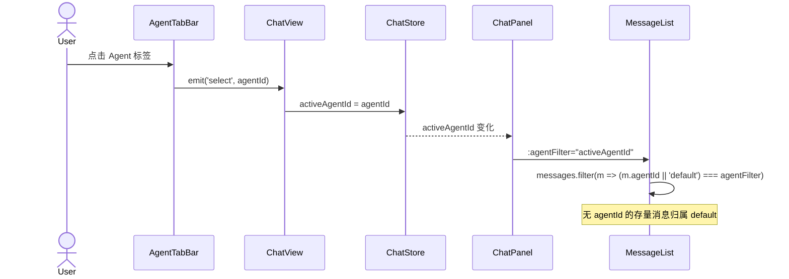
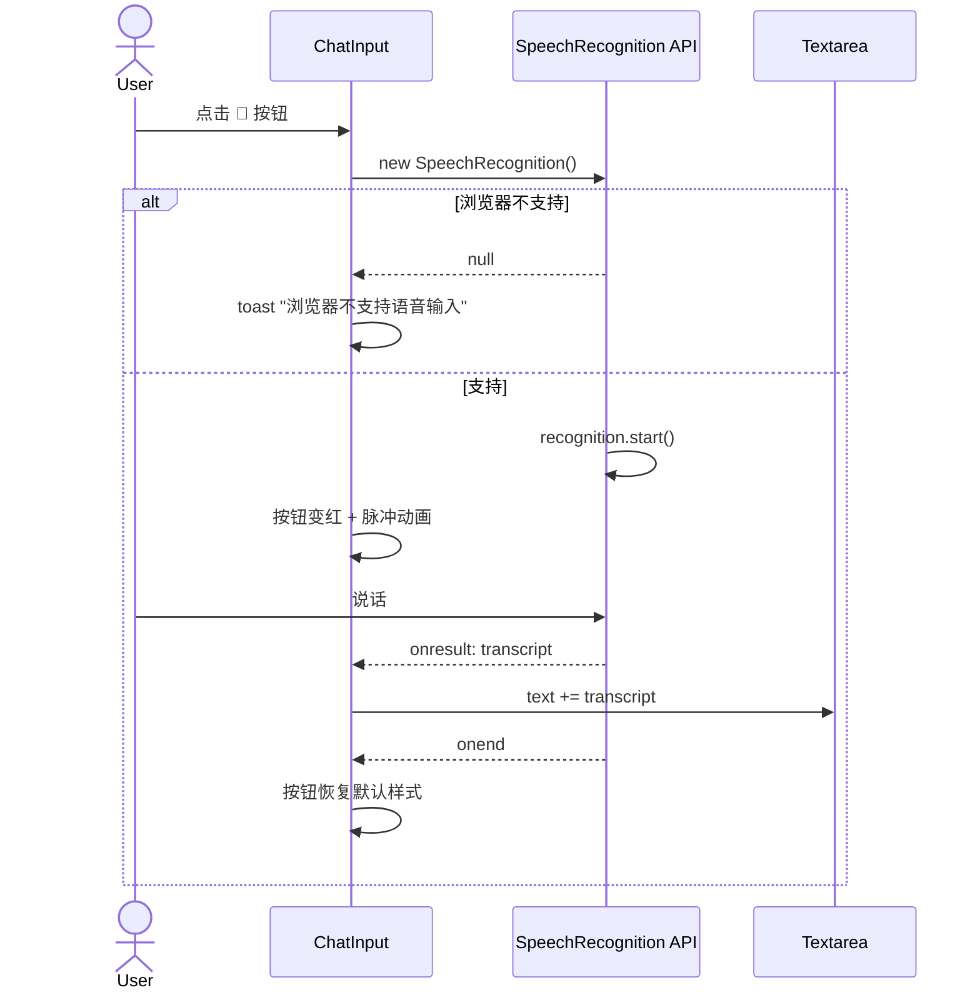
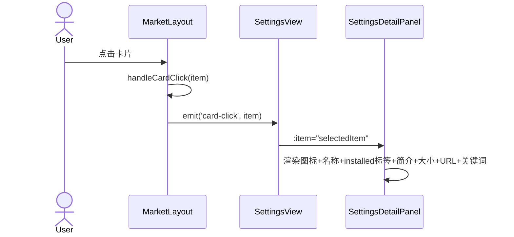
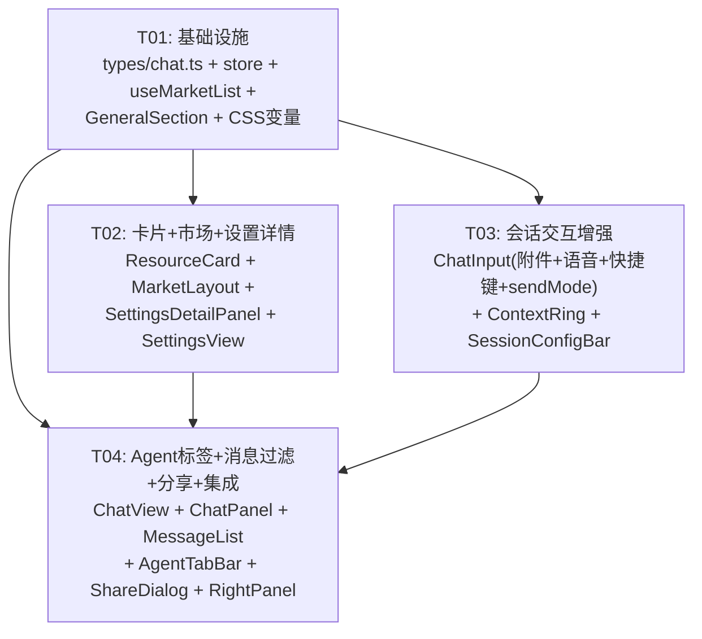

# kmaster-studio 增量架构设计 + 任务分解

> **项目代号**：`kmaster_continue_2026` | 架构师：高见远（Bob） | 日期：2026-08-07
> **基线设计**：`docs/design/kmaster-redesign-2026-08-07.md`（commit `c688e4f`，T01-T05 已实现）
> **增量 PRD**：`docs/prd/incremental-kmaster-continue-2026-08-07.md`

---

## Part A：系统设计

### 1. 实现方案与增量决策

#### 1.1 现状验证结论

> 已 Read 14 个关键文件逐一验证 PRD「当前状态」描述。

| 文件 | PRD 描述 | 验证结果 |
|------|---------|---------|
| `ContextRing.vue` | 已含 tooltip | ✅ `computed tooltip` + SVG `:title`；SessionConfigBar 另有 NTooltip 包裹 |
| `SessionConfigBar.vue` | 已有 model dropdown + sendMode dropdown | ✅ model dropdown 含「添加模型…」emit `add-model`；sendMode 三选一（emoji 图标） |
| `AgentTabBar.vue` | emit select 已定义 | ✅ `emit('select', agentId)` + `emit('close', agentId)` |
| `RightPanel.vue` | share/outline/artifacts 三态 | ✅ mode: `'hidden' \| 'share' \| 'outline' \| 'artifacts'`，share 模式已含 JSON + 复制按钮 |
| `ChatInput.vue` | "+"菜单和 chips 机制 | ✅ "+" 菜单含文件/Skills/MCP；chips 用自定义 `.km-chip`（非 NTag）；`visibleFileChips` slice(0,5)；`extraFileCount` 已计算但未渲染；语音 🎤 非功能性；onKey 硬编码 Enter |
| `ResourceCard.vue` | 当前 icon/name 上下排列 | ✅ 布局：icon（上）→ name → desc → tags → actions（flex-direction: column） |
| `MarketLayout.vue` | 分类+排序分两行 | ✅ `ml-primary-tabs` 和 `ml-sort-bar` 各占一行；primaryTabs.count 未渲染；flex-wrap 卡片 grid |
| `SettingsView.vue` | 无 RightPanel | ✅ 市场类设置走 MarketLayout（settingsMode），其余 section 无右栏 |
| `GeneralSection.vue` | 设置项结构 | ✅ 主题/语言/工作目录/日志；无快捷键/列数设置项 |
| `stores/chat.ts` | agentStates 存在 | ✅ `agentStates: Record<string, string>`（sessionId→agentId）；无 `activeAgentId` |
| `useMarketList.ts` | PAGE_SIZE=10 | ✅ 硬编码 `const PAGE_SIZE = 10` |
| `types/chat.ts` | Message 接口 | ❌ Message 无 `agentId` 字段（需扩展）；Session 已有 `agent?: string \| null` |
| `ShareDialog.vue` | 生成 404 死链 | ✅ 生成 `/share/${sid}?expiry=...`（无对应路由） |
| `ChatView.vue` | onAgentSelect 为桩 | ✅ `onAgentSelect` 空函数体；`onAddModel` 空函数体 |

#### 1.2 增量架构决策

##### 决策 1：Message 过滤机制（Q1）

**现状**：`Message` 接口无 `agentId` 字段。`MessageList.vue` 有 `agentFilter` prop 但过滤函数返回 `true`（桩代码）。

**方案对比**：

| 方案 | 优点 | 缺点 |
|------|------|------|
| A：Message 加 `agentId?: string` | 语义精确，与消息绑定 | 需后端同步字段；存量消息无值 |
| B：store 维护 `agentMessages` 二级索引 | 不改 Message 接口 | 两套状态，不一致风险高 |

**决策：方案 A**。在 `Message` 接口新增 `agentId?: string` 可选字段，前端类型先行。发送消息时标注当前 `activeAgentId`，WS 下行消息继承 session 的 agent 关联。无 `agentId` 的存量消息归属 `default` 标签。

```typescript
// types/chat.ts — Message 增量
export interface Message {
  // ...existing fields...
  /** 增量：消息所属 Agent ID，默认 'default' */
  agentId?: string;
}
```

**Store 新增**：
```typescript
// stores/chat.ts — 新增字段
const activeAgentId = ref<string>('default');
```

##### 决策 2：设置详情面板（Q2）

**现状**：ChatView `RightPanel` 有 `share/outline/artifacts` 三态，绑定会话上下文（`store.activeSessionId`、`store.sessions`、`store.messagesBySession`）。Settings 的资源详情展示完全不同：图标+名称+状态+简介+大小+URL+关键词标签。

**决策：新建 `SettingsDetailPanel.vue`**，不扩展 ChatView RightPanel。

理由：
- ChatView RightPanel 模式互斥且强依赖会话上下文（sessionConfigJson、userMessages），与资源详情语义正交
- 扩展 mode 枚举需要加 `'detail'` → 所有 switch/case 分支需加兜底 → 类型安全稀释
- 新建组件简洁（~80 行）：接收 `ResourceItem` prop，纯展示，无复杂状态

##### 决策 3：sendMode 迁移（Q4）

**决策：SessionConfigBar 移除 sendMode 入口，ChatInput 发送按钮旁新增 sendMode NDropdown。**

布局变更：
```
ChatInput 行（现有）：
  [+] textarea [🎤] [➤]

ChatInput 行（变更后）：
  [+] textarea [Queue ▼] [🎤] [➤]
```

SessionConfigBar 右侧移除 sendMode NDropdown，`sendMode` prop 和 `change-send-mode` emit 保留（由 ChatView 通过 `sendMode` ref 传递给 ChatInput）。

##### 决策 4：列数配置存储（Q5）

**决策：localStorage + 默认值 fallback。**
- Key：`km_grid_cols`，默认值 `5`
- 读取：`Number(localStorage.getItem('km_grid_cols')) || 5`
- 写入：GeneralSection 保存时同步写 localStorage
- 不经过 Pinia（避免跨 session 持久化负担）

##### 决策 5：category 为空处理（Q6）

**决策：category 为空字符串时不渲染分类 NTag。**
```html
<NTag v-if="item.category" size="tiny" :bordered="false" type="default">
  {{ item.category }}
</NTag>
```

---

### 2. 文件清单（精确增量变更）

| 文件 | 变更类型 | 涉及需求 |
|------|---------|---------|
| `packages/client/src/types/chat.ts` | 修改 | K01.2（Message + agentId） |
| `packages/client/src/stores/chat.ts` | 修改 | K01.2（activeAgentId + 消息标注） |
| `packages/client/src/composables/useMarketList.ts` | 修改 | K02.3（动态 PAGE_SIZE） |
| `packages/client/src/components/settings/GeneralSection.vue` | 修改 | K02.2（快捷键设置），K02.3（列数设置） |
| `packages/client/src/components/common/ResourceCard.vue` | **重写** | N1（主题色），N2（布局规范） |
| `packages/client/src/components/common/MarketLayout.vue` | 修改 | K02.3（CSS Grid），K02.4（分类数量），N3（分类+排序同行） |
| `packages/client/src/components/common/SettingsDetailPanel.vue` | **新建** | K01.7（设置右栏详情） |
| `packages/client/src/views/SettingsView.vue` | 修改 | K01.7（点击卡片→右栏详情） |
| `packages/client/src/components/chat/ChatInput.vue` | **修改** | K01.3（文件多选+缩略图+更多{N}），K01.4（NTag 替换 chip），K01.6c（sendMode），K02.1（语音），K02.2（快捷键） |
| `packages/client/src/components/chat/ContextRing.vue` | 修改 | K01.5（tooltip KB 单位） |
| `packages/client/src/components/chat/SessionConfigBar.vue` | 修改 | K01.6a（添加模型→路由跳转），K01.6c（移除 sendMode） |
| `packages/client/src/components/chat/AgentTabBar.vue` | 修改 | K01.2（单 Agent 时不可关闭） |
| `packages/client/src/views/ChatView.vue` | 修改 | K01.2（AgentTabBar select→store.activeAgentId），K01.6（onAddModel 路由跳转） |
| `packages/client/src/components/chat/ChatPanel.vue` | 修改 | K01.2（透传 activeAgentId→MessageList agentFilter） |
| `packages/client/src/components/chat/MessageList.vue` | 修改 | K01.2（按 agentId 过滤消息） |
| `packages/client/src/components/chat/RightPanel.vue` | 修改 | K01.1（share 模式增强：移除死链引用） |
| `packages/client/src/components/chat/ShareDialog.vue` | 修改 | K01.1（废弃死链，改为配置摘要+打开右栏按钮） |

---

### 3. 关键接口变更

```typescript
// ═══════════════ types/chat.ts — Message 扩展 ═══════════════
export interface Message {
  id: string;
  session_id: string;
  role: Role;
  content: string;
  reasoning?: string;
  toolCalls?: ToolCall[];
  guidance?: boolean;
  created_at: number;
  usage_json?: string | null;
  status?: 'sending' | 'sent' | 'error';
  /** K01.2 增量：消息所属 Agent ID，无值视为 'default' */
  agentId?: string;
}

// ═══════════════ stores/chat.ts — 新增状态 ═══════════════
const activeAgentId = ref<string>('default');

// sendMessage 增量：标注 agentId
messagesBySession.value[sid].push({
  id: `u-${Date.now()}`,
  session_id: sid,
  role: 'user',
  content: full,
  created_at: Date.now(),
  agentId: activeAgentId.value,  // ← 新增
});

// dispatch 增量：run.started → 消息标注
// 当 WS 事件无显式 agentId 时，继承 session.agent 或 activeAgentId

// ═══════════════ useMarketList.ts — PAGE_SIZE 动态化 ═══════════════
const GRID_COLS_KEY = 'km_grid_cols';
function getGridCols(): number {
  const stored = Number(localStorage.getItem(GRID_COLS_KEY));
  return stored >= 3 && stored <= 8 ? stored : 5;
}
const ROWS_PER_PAGE = 2;
const PAGE_SIZE = computed(() => getGridCols() * ROWS_PER_PAGE);

// ═══════════════ GeneralSection.vue — 新增设置项 ═══════════════
// 发送快捷键：ref<'Enter' | 'Ctrl+Enter'>('Enter') → localStorage 'km_send_shortcut'
// 卡片列数：ref<number>(getGridCols()) → localStorage 'km_grid_cols'

// ═══════════════ SettingsDetailPanel.vue props ═══════════════
interface SettingsDetailProps {
  item: ResourceItem | null;
  /** 实体类型决定按钮文案 */
  entityType: 'expert' | 'skill' | 'mcp';
}
```

---

### 4. 程序调用流（关键场景 Mermaid）

#### 4.1 Agent 多标签切换



#### 4.2 语音输入（Web Speech API）



#### 4.3 设置右栏详情（K01.7）



---

### 5. 架构决策汇总

| 问题 | 决策 | 理由 |
|------|------|------|
| Q1: Message 过滤 | Message 新增 `agentId?: string`；store 新增 `activeAgentId`；存量消息无值→default 标签 | 类型安全，语义精确，最小侵入 |
| Q2: 设置右栏 | 新建 `SettingsDetailPanel.vue`（~80 行），不复用 ChatView RightPanel | 语义正交，避免污染 mode 枚举 |
| Q3: Web Speech API | 使用浏览器原生 `SpeechRecognition`，不支持时 toast 提示 | 零 npm 包，满足 PRD "零新增包" 约束 |
| Q4: sendMode 位置 | SessionConfigBar 移除 sendMode；ChatInput 发送按钮旁新增 NDropdown | 单一真源，避免两边同步漂移 |
| Q5: 列数配置 | localStorage `km_grid_cols`，默认 5，范围 3-8 | 零依赖，无需服务端存储 |
| Q6: category 空值 | `v-if="item.category"` 隐藏分类 NTag | 不显示"未分类"更干净 |

---

## Part B：任务分解

### 6. 依赖包列表

**零新增 npm 包。** 语音使用 Web Speech API（浏览器原生），其余全在 Naive UI 体系内完成。

```
- vue@^3.4: 前端框架
- naive-ui@^2.39: UI 组件库（NTag / NSelect / NSwitch / NDropdown / NButton）
- pinia@^2: 状态管理
- vite@^5: 构建工具
```

---

### 7. 任务列表（4 批，按依赖排序）

#### T01 — 基础设施：类型扩展 + Store + Settings + 动态 PAGE_SIZE

| 字段 | 内容 |
|------|------|
| **Task ID** | T01 |
| **优先级** | P0 |
| **依赖** | 无 |
| **描述** | 建立本次增量所需的基础设施：Message 接口扩展 agentId、chat store 新增 activeAgentId、消息发送/WS 下行标注 agentId、useMarketList PAGE_SIZE 支持动态列数、GeneralSection 新增快捷键+列数设置项。 |

**文件清单：**

| 文件 | 操作 | 精确改动点 |
|------|------|-----------|
| `packages/client/src/types/chat.ts` | 修改 | `Message` 接口第 22 行后新增 `agentId?: string;` |
| `packages/client/src/stores/chat.ts` | 修改 | ① 第 51 行后新增 `activeAgentId = ref<string>('default')`；② `sendMessage()` 第 661 行消息 push 处加 `agentId: activeAgentId.value`；③ `dispatch()` 中 `run.started`（第 431 行）标注当前 session 的 agent；④ `return` 块导出 `activeAgentId` |
| `packages/client/src/composables/useMarketList.ts` | 修改 | ① 删除第 19 行 `const PAGE_SIZE = 10`；② 新增 `getGridCols()` 从 localStorage 读取（`km_grid_cols`，默认 5）；③ `PAGE_SIZE` 改为 `computed(() => getGridCols() * 2)`；④ `syncDerived()` 和 `goToPage()` 适配动态 PAGE_SIZE |
| `packages/client/src/components/settings/GeneralSection.vue` | 修改 | ① 在 "默认工作目录" row 之前新增"发送快捷键" row（NSelect: Enter / Ctrl+Enter，存 localStorage `km_send_shortcut`）；② 新增"市场卡片列数" row（NInputNumber: 3-8 范围，存 localStorage `km_grid_cols`）；③ 导入 `NInputNumber` |
| `packages/client/src/styles/theme.css` | 修改 | 新增 CSS 变量：`--km-card-bg`、`--km-card-border`（深色/浅色双值），用于 N1 主题适配 |

**Done 标准**：
- `npx vue-tsc --noEmit` 无类型错误
- ChatView 中 `store.activeAgentId` 可访问
- localStorage 读写 `km_grid_cols` / `km_send_shortcut` 正常

---

#### T02 — 卡片布局重写 + 市场布局 + 设置详情

| 字段 | 内容 |
|------|------|
| **Task ID** | T02 |
| **优先级** | P0 |
| **依赖** | T01（需 CSS 变量 + 动态 PAGE_SIZE） |
| **描述** | ResourceCard 按 N2 布局规范重写（icon+name 同行 → 简介 2 行截断 → 底部 category+tags NTag）；深色/浅色主题适配（N1）；MarketLayout 分类+排序合并为一行（N3）+ 分类标签显示数量（K02.4）+ CSS Grid 替代 flex-wrap（K02.3）；新建 SettingsDetailPanel（K01.7）；SettingsView 接入右侧详情面板。 |

**文件清单：**

| 文件 | 操作 | 精确改动点 |
|------|------|-----------|
| `packages/client/src/components/common/ResourceCard.vue` | **重写** | 新布局：① 第一行 `.rc-header`：左侧 `.rc-header-left`（icon 32×32 + name flex-1），右侧 `.rc-header-right`（installed NTag + 卸载按钮 + 安装/召唤按钮）；② 中间 `.rc-body`：简介 `<p>` 两行截断（保持 `-webkit-line-clamp: 2`）；③ 底部 `.rc-footer`：category NTag（`v-if="item.category"` type="default" size="tiny"）+ tags NTag（type="default" size="tiny"）平铺。CSS 变量引用改为 `var(--km-card-bg)` / `var(--km-card-border)`。卡片宽度 `width: 100%`（CSS Grid 接管列宽） |
| `packages/client/src/components/common/MarketLayout.vue` | 修改 | ① 第 245-258 行 `<div class="ml-primary-tabs">` 和 第 260-272 行 `<div class="ml-sort-bar">` 合并为一个 `<div class="ml-tabs-sort-row">`（`display:flex; justify-content:space-between`），左 NButton group 分类标签、右 NDropdown 排序（替代 NButton group）；② 分类标签文案：`{{ tab.label }} ({{ tab.count }})`（第 256 行）；③ `.ml-card-grid`（第 333 行）从 `display:flex; flex-wrap:wrap` 改为 `display:grid; grid-template-columns: repeat(var(--km-grid-cols, 5), 1fr)`；④ `handleCardClick`（第 148 行）emit `card-click` 事件供 SettingsView 监听 |
| `packages/client/src/components/common/SettingsDetailPanel.vue` | **新建** | 接收 `item: ResourceItem \| null` + `entityType` props。渲染：图标（32×32）+ 名称 + installed NTag → 简介 → 大小/URL/目录（可点击）→ 分类 + 关键词 NTag 列表。item 为 null 时显示空态 "点击左侧卡片查看详情" |
| `packages/client/src/views/SettingsView.vue` | 修改 | ① 第 321 行 `.km-settings-body` 改为 `display:flex; flex-direction:row`（左 MarketLayout + 右 SettingsDetailPanel）；② 新增 `selectedItem` ref；③ MarketLayout 监听 `@card-click="(item) => selectedItem = item"`；④ 右侧渲染 `<SettingsDetailPanel :item="selectedItem" :entity-type="..." />` |

**ResourceCard 新布局 HTML 骨架**：
```html
<div class="rc-card" @click="onCardClick">
  <div class="rc-header">
    <div class="rc-header-left">
      <div class="rc-icon-wrap"></div>
      <NText strong class="rc-name">{{ item.name }}</NText>
    </div>
    <div class="rc-header-right">
      <NTag v-if="item.installed" type="success" size="small">installed</NTag>
      <NButton v-if="item.installed" size="tiny" quaternary @click.stop="onUninstall">卸载</NButton>
      <NButton size="small" type="primary" @click.stop="onPrimaryAction">{{ primaryLabel }}</NButton>
    </div>
  </div>
  <p class="rc-desc">{{ item.description }}</p>
  <div class="rc-footer">
    <NTag v-if="item.category" size="tiny" :bordered="false" type="default">{{ item.category }}</NTag>
    <NTag v-for="tag in item.tags.slice(0, 5)" :key="tag" size="tiny" :bordered="false" type="default">{{ tag }}</NTag>
  </div>
</div>
```

**Done 标准**：
- ResourceCard 深色/浅色模式下视觉一致（手动切换验证）
- MarketLayout 分类+排序在同一行，左对齐+右对齐
- 分类标签显示如 "专家 (42)"
- `npx vue-tsc --noEmit` 无错误
- Settings 点击卡片右栏展开详情

---

#### T03 — 会话交互增强：附件行 + 语音 + 快捷键 + 配置优化

| 字段 | 内容 |
|------|------|
| **Task ID** | T03 |
| **优先级** | P0 |
| **依赖** | T01（需 activeAgentId + sendShortcut） |
| **描述** | ChatInput 附件行改造（文件多选+缩略图+更多{N}聚合、Skills/MCP 改用 NTag）、语音输入实现（Web Speech API）、发送快捷键可配置、ContextRing tooltip 改为 KB 单位、SessionConfigBar 模型菜单跳转路由 + 移除 sendMode、ChatInput 新增 sendMode NDropdown。 |

**文件清单：**

| 文件 | 操作 | 精确改动点 |
|------|------|-----------|
| `packages/client/src/components/chat/ChatInput.vue` | **修改** | ① **文件多选**: `fileInput` 已支持 `multiple`（第 315 行 ✅），无需改动；② **缩略图**：`visibleFileChips`（第 165 行）中图片文件 chip 加 `` 40×40 缩略图（判断副档名 `.png/.jpg/.jpeg/.gif/.webp/.svg`）；③ **更多{N}**：`extraFileCount`（第 170 行）在 chips 行末尾渲染 `<NTag>+{{ extraFileCount }} 更多文件</NTag>`；④ **NTag 替换**：chips 行（第 193-203 行）自定义 `.km-chip` 改为 Naive UI `<NTag closable @close="removeChip(i)">`，Skill 前缀 🧩、MCP 前缀 🔌；⑤ **语音**：新增 `SpeechRecognition` 逻辑（`onVoiceClick` → start/stop，`isListening` ref 驱动红色脉冲 CSS 动画，不支持时 toast）；⑥ **快捷键**：`onKey`（第 152 行）改为读取 `localStorage.getItem('km_send_shortcut')` 决定 Enter/Ctrl+Enter；⑦ **sendMode**：发送按钮前新增 `<NDropdown :options="sendModeOptions" @select="..."> <NButton>Queue ▼</NButton></NDropdown>` |
| `packages/client/src/components/chat/ContextRing.vue` | 修改 | `tooltip` computed（第 35-38 行）：改为 `{{ percentage }}%: {{ (used/1024).toFixed(1) }}kb/{{ (max/1024).toFixed(1) }}kb 上下文已使用`。`used`/`max` 为 tokens 值时需换算（1 token ≈ 4 bytes → /256 = KB 近似值） |
| `packages/client/src/components/chat/SessionConfigBar.vue` | 修改 | ① `onModelSelect`（第 116 行）：`__add_model__` 改为 `router.push('/settings/model')`（导入 `useRouter`）；② 移除 sendMode dropdown（第 198-208 行右侧 NDropdown），保留 prop 定义不变（兼容 ChatView 旧接口，实际不再使用） |

**语音实现伪代码**：
```typescript
const SpeechRecognitionAPI = (window as any).SpeechRecognition || (window as any).webkitSpeechRecognition;
const recognition = SpeechRecognitionAPI ? new SpeechRecognitionAPI() : null;
const isListening = ref(false);

function onVoiceClick(): void {
  if (!recognition) { message.warning('浏览器不支持语音输入'); return; }
  if (isListening.value) { recognition.stop(); return; }
  recognition.lang = 'zh-CN';
  recognition.interimResults = false;
  recognition.onresult = (e: any) => { text.value += e.results[0][0].transcript; };
  recognition.onend = () => { isListening.value = false; };
  recognition.start();
  isListening.value = true;
}
```

**Done 标准**：
- 上传 6 个文件 → 前 5 个显示 chip，末尾显示 "+1 更多文件"
- Skills/MCP chips 显示为 NTag，关闭后取消勾选
- 语音按钮点击 → Chrome 弹出麦克风权限 → 识别结果填入 textarea
- Ctrl+Enter 设置后 Enter 不发送（换行）
- ContextRing hover tooltip 显示 KB 单位
- sendMode dropdown 在 ChatInput 发送按钮旁

---

#### T04 — Agent 标签 + 消息过滤 + 分享重写 + 全链路集成

| 字段 | 内容 |
|------|------|
| **Task ID** | T04 |
| **优先级** | P0 |
| **依赖** | T01, T02, T03（需 activeAgentId、卡片稳定、输入改造完成） |
| **描述** | ChatView 响应 AgentTabBar @select → store.activeAgentId → ChatPanel/MessageList 按 agentId 过滤；AgentTabBar 单 Agent 时不可关闭；ShareDialog 废弃死链改为配置摘要+打开右栏；RightPanel share 模式移除死链引用；全链路集成验证。 |

**文件清单：**

| 文件 | 操作 | 精确改动点 |
|------|------|-----------|
| `packages/client/src/views/ChatView.vue` | 修改 | ① `onAgentSelect`（第 164 行）：`store.activeAgentId = agentId`；② `onAddModel`（第 158 行）：`router.push('/settings/model')`（导入 `useRouter`）；③ `onChangeSendMode` 保留（维护 sendMode ref 供 ChatInput 使用） |
| `packages/client/src/components/chat/ChatPanel.vue` | 修改 | 第 42 行 `<ChatInput />` 改为透传 sendMode 和 sendShortcut（或 ChatInput 自行从 localStorage 读取，已在 T03 实现）；MessageList 的 `agentFilter` prop 绑定 `store.activeAgentId` |
| `packages/client/src/components/chat/MessageList.vue` | 修改 | `messages` computed（第 27-33 行）：过滤逻辑从 `return true` 改为 `m => !props.agentFilter || props.agentFilter === 'default' ? !(m as any).agentId || (m as any).agentId === 'default' : (m as any).agentId === props.agentFilter` |
| `packages/client/src/components/chat/AgentTabBar.vue` | 修改 | ① 第 59 行 `closable`：`agents.length === 1` 时 `:closable="false"`（强制不可关闭）；② 第 48-49 行单 Agent 时隐藏关闭按钮 |
| `packages/client/src/components/chat/ShareDialog.vue` | **修改** | 废弃死链逻辑：① 第 45 行 `generateUrl` 删除 URL 生成，改为组装配置摘要文本；② 模版改为：配置摘要（Agent/Model/Mode/Skills/MCP）+ 「复制配置 JSON」按钮 + 「在右栏查看」按钮（emit `open-share-panel` → ChatView 打开 RightPanel share 模式）；③ 删除过期时间 select |
| `packages/client/src/components/chat/RightPanel.vue` | 修改 | share 模式（第 116 行）：删除死链引用文案；增强：标题显示当前会话名 + 配置 JSON 格式化 JSON 展示（已有 ✅，无需改动） |

**Done 标准**：
- `npx vue-tsc --noEmit` 无类型错误
- 多 Agent 会话：点击不同标签 → 消息列表过滤变化
- 单 Agent 会话：标签不可关闭（无 × 按钮）
- ShareDialog → 点击「在右栏查看」→ RightPanel 打开 share 模式显示配置 JSON
- 全局：所有 14 项需求的编译和手动走查通过

---

### 8. 共享知识（跨文件约定）

```
━━━ CSS 变量（N1 主题适配）━━━
--km-card-bg: 深色 rgba(255,255,255,0.04) / 浅色 #fff
--km-card-border: 深色 rgba(255,255,255,0.08) / 浅色 #e8e8e8
--km-grid-cols: 从 localStorage 'km_grid_cols' 注入（默认 5）

━━━ NTag 使用约定 ━━━
- 附件行 Skills 标签：type="info" size="small" closable
- 附件行 MCP 标签：type="info" size="small" closable
- 附件行文件标签：type="default" size="small" closable
- 卡片 category 标签：type="default" size="tiny" :bordered="false"
- 卡片 keywords 标签：type="default" size="tiny" :bordered="false"
- 深色模式下卡片 NTag type 保持 default（弱化）

━━━ localStorage keys ━━━
- km_grid_cols: number (3-8, default 5)
- km_send_shortcut: 'Enter' | 'Ctrl+Enter' (default 'Enter')

━━━ Message.agentId 语义 ━━━
- 不存在或为 undefined/null → 归属 "default" Agent
- 发送消息时标注当前 activeAgentId
- WS 下行消息继承 session.agent 或 activeAgentId

━━━ ResourceCard 布局规范（N2）━━━
- 第一行：flex row (space-between)，左 icon(32×32)+name，右 installed+按钮
- 中间：description -webkit-line-clamp:2
- 底部：flex wrap NTag 列表 (category + tags)
- 卡片宽度 100%（CSS Grid column 控制）

━━━ 路由跳转 ━━━
- "添加模型…" → router.push('/settings/model')
- ShareDialog "在右栏查看" → emit → ChatView → rightPanelMode='share'
```

---

### 9. 任务依赖图



---

## 附录：额外输出文件

| 文件 | 内容 |
|------|------|
| `docs/design/sequence-diagram.mermaid` | 三个关键时序图（Agent 多标签切换、语音输入、设置右栏详情） |
| `docs/design/class-diagram.mermaid` | 增量接口变更类图（Message agentId、Store activeAgentId、SettingsDetailPanel props） |
