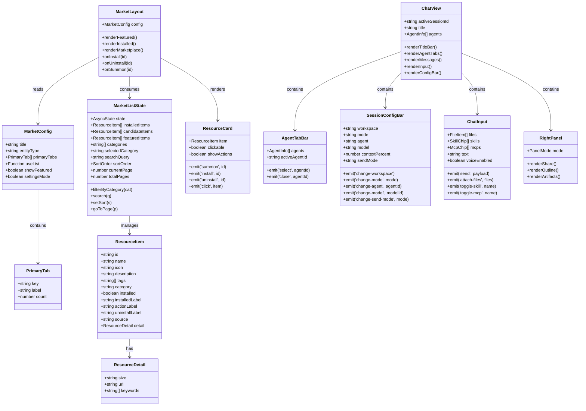
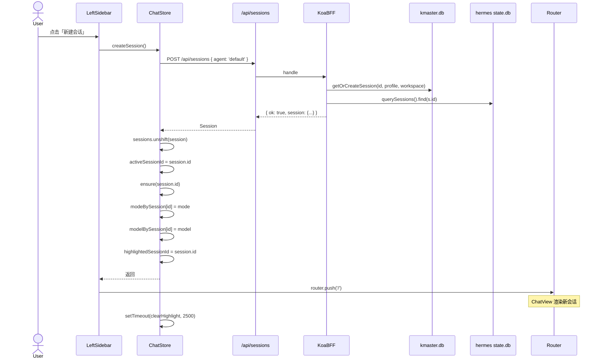
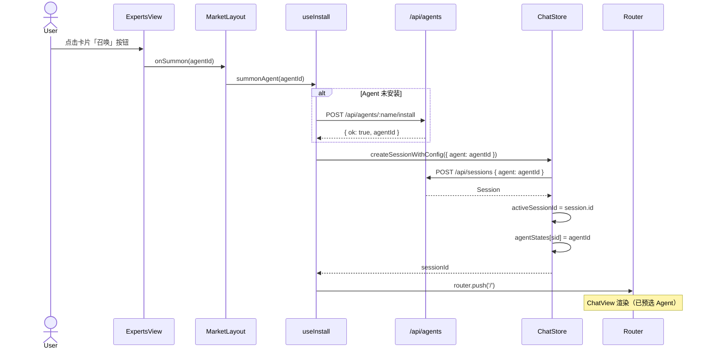
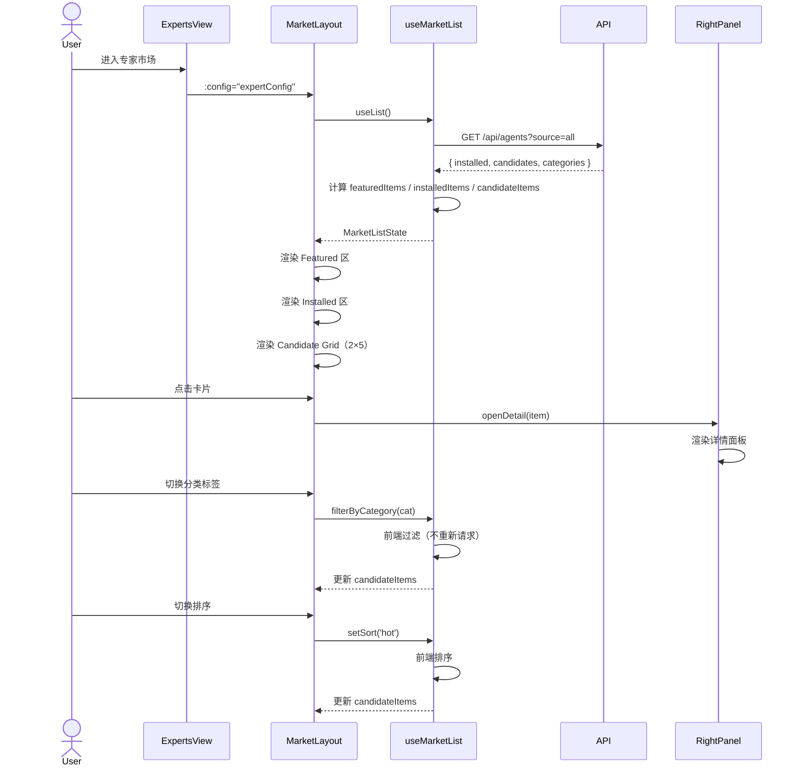
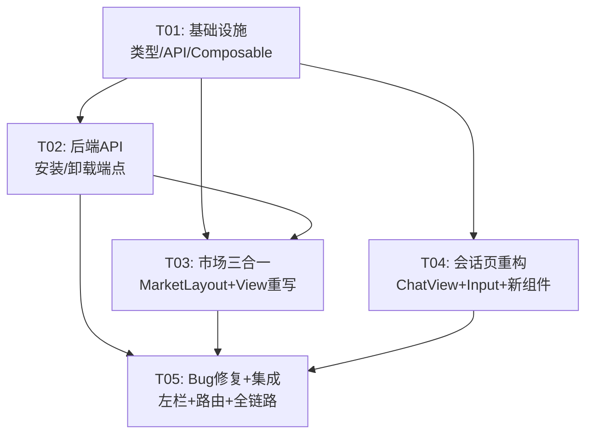

# kmaster-studio 全量 UX 重设计 — 架构设计 + 任务分解

> 项目代号：`kmaster_redesign_2026` | 架构师：高见远（Bob） | 日期：2026-08-07

---

## Part A：系统设计

### 1. 实现方案与框架选型

#### 1.1 技术栈（不变）

| 层 | 技术 | 版本 |
|----|------|------|
| 前端框架 | Vue 3 (Composition API + `<script setup>`) | ^3.4 |
| 构建工具 | Vite | ^5 |
| UI 组件库 | Naive UI | ^2.39 |
| 状态管理 | Pinia | ^2 |
| CSS 方案 | Naive UI + scoped CSS + CSS 变量（km- 前缀） | — |
| 后端 | Koa + @koa/router | — |
| 数据库 | better-sqlite3 (kmaster.db 侧车) + hermes state.db（只读） | — |

#### 1.2 核心架构决策

**决策 1：市场页三合一 — MarketLayout + 透传配置**

当前 ExpertsView / SkillsView / McpView 三个 View 高度相似（PageHeader + 搜索栏 + 已安装区 + 市场候选区 + 卡片 grid），各自维护重复的模板和样式。重构后：

- 抽取 `MarketLayout.vue` 作为统一布局组件，接收 `MarketConfig` 配置对象
- 三个 View 变成轻量 wrapper：`<MarketLayout :config="expertConfig" />`
- 差异化通过 `MarketConfig` 透传：标题、分类标签列表、数据源 composable、卡片操作按钮等

```
ExpertsView.vue  ─┐
SkillsView.vue   ─┼─► MarketLayout.vue ─► ResourceCard.vue
McpView.vue      ─┘
SettingsView.vue ──┘  （设置/管理页亦复用 MarketLayout）
```

**决策 2：会话页渐进重构 — 功能分区组件化**

当前 ChatInput.vue 已包含标题栏、Agent 标签、输入区、底栏四块，但随着 P0-10~13 的引入变得臃肿。重构后：

- ChatView 变为编排层：标题栏 + 标签栏 + 消息区 + 输入区 + 配置状态栏
- ChatInput 拆出：`AgentTabBar.vue`（P0-13）+ `SessionConfigBar.vue`（P0-12）+ 保留输入核心
- ChatPanel 保持消息列表容器角色，移除 header 逻辑

**决策 3：后端优先 P0 阻塞项**

P0-9（召唤/卸载）依赖后端 API 先就绪。新增两个端点：

- `POST /api/agents/:name/install` — 从 hermes 安装 Agent
- `DELETE /api/agents/:name/uninstall` — 卸载 Agent

这两个端点复用现有 `services/hermes/write/agents.ts` 的 `upsertAgent` / `deleteAgent`。

**决策 4：不新增 npm 包（P2 语音除外）**

P0-P1 全部在现有 Naive UI 组件体系内完成。P2-1（语音输入）若采用 Web Speech API 则无需新增包；若采用第三方 STT 则需评估。

**决策 5：左栏改动最小化**

LeftSidebar.vue 已完成 V3 改造（双导航态壳、过滤面板、置顶等），本次仅修复 6 个 Bug + 术语替换。不改架构。

---

### 2. 文件清单

| 相对路径 | 变更类型 | 涉及 PRD |
|----------|---------|---------|
| **前端 — View 层** | | |
| `packages/client/src/views/ChatView.vue` | **重写** | P0-10~13, P1-4~7 |
| `packages/client/src/views/ExpertsView.vue` | **重写** | P0-2, P0-9 |
| `packages/client/src/views/SkillsView.vue` | **重写** | P0-3 |
| `packages/client/src/views/McpView.vue` | **重写** | P0-4 |
| `packages/client/src/views/SettingsView.vue` | 修改（已有框架） | P1-1~3 |
| **前端 — 组件层** | | |
| `packages/client/src/components/chat/ChatInput.vue` | **重写** | P0-11, P2-1 |
| `packages/client/src/components/chat/ChatPanel.vue` | 修改 | P0-10, P1-4 |
| `packages/client/src/components/layout/LeftSidebar.vue` | 修改 | P0-1, P0-5, P0-6, P0-7 |
| `packages/client/src/components/common/MarketLayout.vue` | **新建** | P0-2~4, P1-1~3 |
| `packages/client/src/components/common/ResourceCard.vue` | **新建** | P0-2~4, P1-1~3 |
| `packages/client/src/components/chat/AgentTabBar.vue` | **新建** | P0-13 |
| `packages/client/src/components/chat/SessionConfigBar.vue` | **新建** | P0-12 |
| `packages/client/src/components/chat/RightPanel.vue` | **新建** | P1-5~7 |
| **前端 — 数据/类型层** | | |
| `packages/client/src/types/market.ts` | 修改 | P0-2~4（补充 ResourceCard 用接口） |
| `packages/client/src/types/chat.ts` | 修改 | P0-8（Session 增加 agent 字段） |
| `packages/client/src/api/client.ts` | 修改 | P0-9（安装/卸载 API 封装） |
| `packages/client/src/stores/chat.ts` | 修改 | P0-8, P0-9（安装/卸载 action） |
| `packages/client/src/composables/useMarketList.ts` | **新建** | P0-2~4（统一市场数据 composable） |
| `packages/client/src/composables/useInstall.ts` | **新建** | P0-9（安装/卸载逻辑复用） |
| `packages/client/src/router/index.ts` | 修改 | P0-1（会话路由修复） |
| **后端** | | |
| `packages/server/src/routes/agents.ts` | 修改 | P0-9（安装/卸载端点） |
| `packages/server/src/routes/sessions.ts` | 修改 | P0-6（会话持久化列表） |
| `packages/server/src/services/hermes/write/agents.ts` | 修改 | P0-9（install/uninstall 写操作） |

---

### 3. 数据结构和接口契约

#### 3.1 核心 TypeScript 接口

```typescript
// ═══════════════ MarketConfig — 市场布局配置 ═══════════════
interface MarketConfig {
  /** 页面标题 */
  title: string;
  /** 资源类型（用于按钮文案：召唤/安装/部署） */
  entityType: 'expert' | 'skill' | 'mcp';
  /** 一级分类标签 */
  primaryTabs: Array<{ key: string; label: string; count: number }>;
  /** 数据源 composable */
  useList: () => MarketListState;
  /** 是否显示精选推荐区 */
  showFeatured: boolean;
  /** 是否显示设置/管理模式（已安装区 + 市场区 分开） */
  settingsMode: boolean;
}

// ═══════════════ MarketListState — 统一市场数据状态 ═══════════════
interface MarketListState {
  state: { loading: boolean; error: string };
  installedItems: ResourceItem[];
  candidateItems: ResourceItem[];
  featuredItems: ResourceItem[];
  categories: string[];
  selectedCategory: string;
  searchQuery: string;
  sortOrder: SortOrder;
  // 分页
  currentPage: number;
  totalPages: number;
  // actions
  filterByCategory: (cat: string) => void;
  search: (q: string) => void;
  setSort: (s: SortOrder) => void;
  goToPage: (p: number) => void;
}

// ═══════════════ ResourceItem — 统一资源卡片数据 ═══════════════
interface ResourceItem {
  id: string;
  name: string;
  icon: string;
  description: string;
  tags: string[];
  category: string;
  installed: boolean;
  installedLabel: string;      // "已安装" / "已部署"
  actionLabel: string;          // "召唤" / "安装" / "部署"
  uninstallLabel: string;       // "卸载"
  source: string;
  // 详情扩展
  detail?: {
    size?: string;
    url?: string;
    keywords?: string[];
  };
}

// ═══════════════ Session 扩展（P0-8） ═══════════════
// 在现有 Session 接口上追加：
interface Session {
  // ... 现有字段不变
  agent?: string | null;        // Agent ID（新建默认 "default"）
}

// ═══════════════ 安装/卸载 API 契约 ═══════════════
// POST   /api/agents/:name/install → { ok: boolean, agentId: string, message: string }
// DELETE /api/agents/:name/uninstall → { ok: boolean, message: string }
```

#### 3.2 类图 (Mermaid)



---

### 4. 程序调用流程

#### 4.1 新建会话全流程



#### 4.2 召唤 Agent 全流程



#### 4.3 市场浏览全流程



---

### 5. 待明确事项（架构决策视角）

| PRD Q# | 问题 | 架构决策 / 假设 |
|--------|------|---------------|
| Q1 | hermes 安装/卸载 Agent API 是否就绪？ | **假设**：已有 `services/hermes/write/agents.ts`（upsertAgent/deleteAgent），复用为 install/uninstall。若不满足需新增 CLI 桥接。 |
| Q2 | 技能是否有本地安装和注册机制？ | **假设**：技能沿用现有 `POST /api/skills/install` + `DELETE /api/skills/:name`，安装=勾选启用。 |
| Q3 | MCP 安装/卸载机制？ | **假设**：MCP 沿用现有 `postMcp` / `deleteMcp`，安装=部署连接器。 |
| Q4 | 分享会话粒度？ | **假设**：P1-5 分享「会话配置模板」（Agent/Model/Mode/Skills/MCP），不分享消息内容。前端组装配置 JSON，后端无需新 API。 |
| Q5 | 语音输入 SDK？ | **假设**：P2-1 先用浏览器 Web Speech API（免费、零依赖），桌面端降级提示「浏览器不支持语音输入」。 |
| Q6 | 会话列表持久化策略？ | **假设**：服务端 `GET /api/sessions` 已返回全量列表（state.db），刷新后重新拉取即可。localStorage 仅存 `lastSessionId`（已有实现）。 |
| Q7 | 市场数据来源与分页？ | **假设**：前端分页（数据量 < 200条）。数据已由 `GET /api/agents?source=all` 一次性返回。 |
| Q8 | COS 鉴权方式？ | **假设**：P1-2 的 COS 来源暂时搁置，前端仅展示「本地」和「marketplace」来源的技能/MCP。COS 待后续对接。 |

---

## Part B：任务分解

### 6. 依赖包列表

无新增 npm 包。现有依赖完全覆盖 P0-P1：

```
- vue@^3.4: 前端框架
- vue-router@^4: 路由
- pinia@^2: 状态管理
- naive-ui@^2.39: UI 组件库
- vite@^5: 构建工具
- @koa/router: 后端路由
- better-sqlite3: 数据库
- typescript@^5: 类型系统
```

P2-1 语音输入如果采用 Web Speech API，零依赖。如果后续改用第三方 STT，届时再评估。

---

### 7. 任务列表（5 批，按依赖排序）

#### T01 — 项目基础设施 + 类型/API 扩展

| 字段 | 内容 |
|------|------|
| **Task ID** | T01 |
| **优先级** | P0 |
| **依赖** | 无 |
| **描述** | 建立本次重设计所需的基础设施：类型定义扩展、API 封装补充、统一常量定义、composable 骨架 |

**文件清单：**

| 文件 | 操作 |
|------|------|
| `packages/client/src/types/market.ts` | 修改：新增 `ResourceItem`、`MarketConfig`、`MarketListState` 接口；补充 `SortOrder` 枚举值 |
| `packages/client/src/types/chat.ts` | 修改：`Session` 增加 `agent?: string \| null` 字段 |
| `packages/client/src/api/client.ts` | 修改：新增 `installAgent(name)` / `uninstallAgent(name)` API 封装 |
| `packages/client/src/composables/useMarketList.ts` | **新建**：统一市场数据 composable（聚合 installed + candidates + featured + 分页 + 排序 + 分类过滤） |
| `packages/client/src/composables/useInstall.ts` | **新建**：安装/卸载/召唤逻辑复用（agent/skill/mcp 三合一），返回 `{ install, uninstall, summon, isInstalling }` |
| `packages/client/src/stores/chat.ts` | 修改：新增 `installAgent` / `uninstallAgent` action；`createSession` 支持 `agent` 参数；`createSessionWithConfig` 支持 `agent` 字段 |

**类型定义补充（`types/market.ts` 追加）：**
```typescript
// —— 新增
export type SortOrder = 'default' | 'hot' | 'newest';

export interface ResourceItem {
  id: string;
  name: string;
  icon: string;
  description: string;
  tags: string[];
  category: string;
  installed: boolean;
  source: string;
}

export interface MarketConfig {
  title: string;
  entityType: 'expert' | 'skill' | 'mcp';
  primaryTabs: Array<{ key: string; label: string; count: number }>;
  showFeatured: boolean;
  settingsMode: boolean;
}

export interface MarketListState {
  state: { loading: boolean; error: string };
  installedItems: ResourceItem[];
  candidateItems: ResourceItem[];
  featuredItems: ResourceItem[];
  categories: string[];
  selectedCategory: string;
  searchQuery: string;
  sortOrder: SortOrder;
  currentPage: number;
  totalPages: number;
  filterByCategory: (cat: string) => void;
  search: (q: string) => void;
  setSort: (s: SortOrder) => void;
  goToPage: (p: number) => void;
}
```

---

#### T02 — 后端 API（P0 阻塞项） + 数据层对接

| 字段 | 内容 |
|------|------|
| **Task ID** | T02 |
| **优先级** | P0 |
| **依赖** | T01 |
| **描述** | 实现 Agent 安装/卸载后端端点；确保会话列表持久化 API 正确；对接前端数据层 |

**文件清单：**

| 文件 | 操作 |
|------|------|
| `packages/server/src/routes/agents.ts` | 修改：新增 `POST /api/agents/:name/install` 和 `DELETE /api/agents/:name/uninstall` 端点 |
| `packages/server/src/services/hermes/write/agents.ts` | 修改：新增 `installAgent(name)` / `uninstallAgent(name)` 写操作（复用 upsertAgent/deleteAgent 底层，增加目录创建/清理） |
| `packages/server/src/routes/sessions.ts` | 验证：确认 `GET /api/sessions` 已在会话创建后正确返回（含 agent 字段）；若无则修补 |
| `packages/client/src/stores/chat.ts` | 修改：对接 T01 的 `useInstall` composable；`createSessionWithConfig` 传递 `agent` 至 API |
| `packages/client/src/api/client.ts` | 修改：`installAgent` / `uninstallAgent` 实现体（对接 T02 后端端点） |

**后端 API 契约：**
```
POST /api/agents/:name/install
  → 200 { ok: true, agentId: string, message: "Agent xxx 已安装" }
  → 400 { ok: false, error: "already_installed", message: "Agent xxx 已安装" }

DELETE /api/agents/:name/uninstall
  → 200 { ok: true, message: "Agent xxx 已卸载" }
  → 404 { ok: false, error: "not_found", message: "Agent xxx 不存在" }
```

---

#### T03 — 市场页三合一（MarketLayout + ResourceCard + View 重写）

| 字段 | 内容 |
|------|------|
| **Task ID** | T03 |
| **优先级** | P0 |
| **依赖** | T01, T02 |
| **描述** | 构建统一 MarketLayout + ResourceCard 组件；重写 ExpertsView / SkillsView / McpView 为轻量 wrapper；更新 SettingsView 复用 MarketLayout |

**文件清单：**

| 文件 | 操作 |
|------|------|
| `packages/client/src/components/common/MarketLayout.vue` | **新建**：统一市场布局（Featured 区 + Installed 区 + 分类标签 + 排序栏 + 领域标签 + Card Grid 2×5 + 分页器） |
| `packages/client/src/components/common/ResourceCard.vue` | **新建**：统一资源卡片（图标 + 名称 + installed 标签 + 简介 + [安装/卸载] [召唤] 按钮 + 点击查看详情） |
| `packages/client/src/views/ExpertsView.vue` | **重写**：轻量 wrapper，组装 `expertConfig` 并渲染 `<MarketLayout :config="expertConfig" />` |
| `packages/client/src/views/SkillsView.vue` | **重写**：轻量 wrapper，组装 `skillConfig` 并渲染 `<MarketLayout :config="skillConfig" />` |
| `packages/client/src/views/McpView.vue` | **重写**：轻量 wrapper，组装 `mcpConfig` 并渲染 `<MarketLayout :config="mcpConfig" />` |
| `packages/client/src/views/SettingsView.vue` | 修改：设置/管理页复用 MarketLayout（`settingsMode: true`），包含 Agent 管理 / Skills 管理 / MCP 管理 子页 |

**MarketConfig 示例（ExpertsView 用）：**
```typescript
const expertConfig: MarketConfig = {
  title: '专家市场',
  entityType: 'expert',
  primaryTabs: [
    { key: 'expert', label: '专家', count: 42 },
    { key: 'team', label: '专家团', count: 15 },
  ],
  useList: () => useExpertMarket(),
  showFeatured: true,
  settingsMode: false,
};
```

---

#### T04 — 会话页重构（ChatView + ChatInput + 新组件）

| 字段 | 内容 |
|------|------|
| **Task ID** | T04 |
| **优先级** | P0 |
| **依赖** | T01 |
| **描述** | 重写 ChatView 为编排层；重写 ChatInput 为新三区结构；新增 AgentTabBar / SessionConfigBar / RightPanel；修改 ChatPanel 适配新布局 |

**文件清单：**

| 文件 | 操作 |
|------|------|
| `packages/client/src/views/ChatView.vue` | **重写**：编排层 —— PageHeader（含 Agent badge + 模式 badge + 模型 badge + 搜索 + 分享/大纲/右栏开关）→ AgentTabBar → ChatPanel → ChatInput（仅输入核心）→ SessionConfigBar |
| `packages/client/src/components/chat/ChatInput.vue` | **重写**：精简为输入核心 —— "+" 菜单（文件/图片 + Skills 勾选 + MCP 勾选）+ textarea + 附件 chips + 语音按钮 |
| `packages/client/src/components/chat/ChatPanel.vue` | 修改：移除旧的 `<header>` 引用；消息区 flex:1 撑满；接收 session config 变化通知 |
| `packages/client/src/components/chat/AgentTabBar.vue` | **新建**：Agent 标签平铺栏 —— 接收 `agents: AgentInfo[]`，emit `select(agentId)` / `close(agentId)`，支持滚动 |
| `packages/client/src/components/chat/SessionConfigBar.vue` | **新建**：底栏配置状态栏 —— 工作区按钮 + 模式选择 + Agent 角色选择 + 上下文用量环 + 模型下拉 + 发送模式（interrupt/steer/queue） |
| `packages/client/src/components/chat/RightPanel.vue` | **新建**：右栏容器 —— 三态切换：分享配置页 / 大纲页（用户问题列表）/ 产物标签页（默认打开） |

**ChatView 新布局结构（伪代码）：**
```
<PageHeader :title :search @search>
  <template #title-extra> Agent badge | Mode badge | Model badge </template>
  <template #actions> Search | Share | Outline | RightPanelToggle </template>
</PageHeader>

<AgentTabBar :agents @select @close />

<ChatPanel :search>
  <MessageList />
  <ChatInput @send @attach @toggle-skill @toggle-mcp />
</ChatPanel>

<SessionConfigBar
  :workspace :mode :agent :model :contextPercent :sendMode
  @change-* 
/>

<RightPanel :mode />
```

---

#### T05 — 左栏 Bug 修复 + 路由修复 + 最终集成

| 字段 | 内容 |
|------|------|
| **Task ID** | T05 |
| **优先级** | P0 |
| **依赖** | T02, T03, T04 |
| **描述** | 修复 6 个 Bug + 术语统一 + 路由修复 + 全链路集成验证 |

**文件清单：**

| 文件 | 操作 |
|------|------|
| `packages/client/src/components/layout/LeftSidebar.vue` | 修改：P0-1 路由失效修复（检查 openSession 是否触发 router.push）；P0-5 新增会话下拉菜单入口（NPopover 列表）；P0-6 localStorage 持久化 lastSessionId（已有实现，验证）；P0-7 "新建任务" → "新建会话" |
| `packages/client/src/router/index.ts` | 修改：P0-1 路由守卫/嵌套逻辑验证；确保非会话页点击左栏会话项 router.push('/')并 openSession |
| `packages/client/src/views/ChatView.vue` | 修改：集成验证 —— 确保 T04 重构后会话恢复正常、搜索定位正常 |
| `packages/client/src/stores/chat.ts` | 修改：P0-8 新建会话默认值 —— title 格式 `新会话-YYYYMMDD HH:MM:SS`，agent=`default`，mode=`dont_ask`(Craft) |

**Bug 修复清单（对照 PRD P0-1~6）：**

| Bug | 修复方案 | 位置 |
|-----|---------|------|
| P0-1 左栏点击路由失效 | `openSession` 内若 `router.currentRoute !== '/'` 则 `router.push('/')` | LeftSidebar.vue |
| P0-2 专家卡片图标显示 URL 文本 | 检查 ResourceCard `v-bind:src` vs 纯文本绑定 | ResourceCard.vue |
| P0-3 技能市场页空白 | 由 T03 整体重写解决 | SkillsView.vue |
| P0-4 MCP 模块错误 | 由 T03 整体重写解决 | McpView.vue |
| P0-5 左栏缺会话下拉菜单 | 在 LeftSidebar 顶栏新增 NPopover 列出最近会话 | LeftSidebar.vue |
| P0-6 刷新丢失会话列表 | `loadSessions()` 在 `onMounted` 中已调用，验证 state.db 持久化 | LeftSidebar.vue |

---

### 8. 共享知识（跨文件约定）

```
━━━ 命名规范 ━━━
- 组件文件：PascalCase（AgentTabBar.vue）
- composable：useXxx（useMarketList, useInstall）
- CSS 类名：km- 前缀 + 组件语义（km-market-page, km-card-grid）
- 路由 path：小写连字符（/experts, /settings/agents）

━━━ 数据格式 ━━━
- Session.agent：string | null（Agent ID），默认值为 "default"
- Session.pinned：boolean（真源服务端），不读本地 Set
- Session.archived：number（0/1），判据用 !s.archived
- 时间戳：毫秒（Date.now()），展示统一走 timeAgo() util
- API 响应：统一 { ok, session/message/data, error/message }
- API 错误：HttpError { status, code, body.message }，toast 走 errText(e)

━━━ 组件 Props 契约 ━━━
- MarketLayout：config: MarketConfig（必需）
- ResourceCard：item: ResourceItem（必需），showActions?: boolean（默认 true）
- AgentTabBar：agents: AgentInfo[]，activeAgentId?: string
- SessionConfigBar：全部单项 prop（workspace/mode/agent/model/contextPercent/sendMode）
- RightPanel：mode: 'hidden' | 'share' | 'outline' | 'artifacts'

━━━ 状态管理约定 ━━━
- chat store：所有 action 走乐观更新 + PATCH + 失败回滚 + 上抛异常
- 市场数据 composable：useMarketList 为纯前端聚合（数据从 API 一次性获取）
- 安装状态 composable：useInstall 管理 installing/uninstalling 互斥锁

━━━ 路由约定 ━━━
- / → ChatView（会话交互）
- /experts → ExpertsView（专家市场）
- /skills → SkillsView（技能市场）
- /mcp → McpView（MCP 管理）
- /settings/:category → SettingsView（设置/管理）
- 未知路径 → redirect('/')
```

---

### 9. 任务依赖图



---

## 附录：额外输出文件

| 文件 | 内容 |
|------|------|
| `docs/design/sequence-diagram.mermaid` | 三个关键时序图（新建会话、召唤 Agent、市场浏览） |
| `docs/design/class-diagram.mermaid` | 完整类图（MarketConfig / ResourceItem / 组件关系） |
