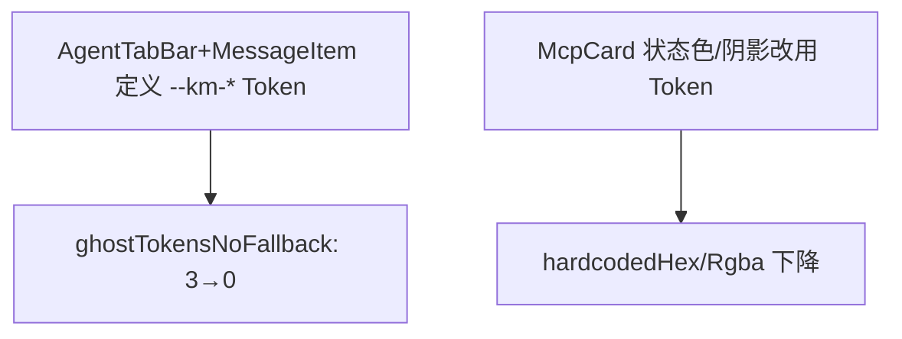
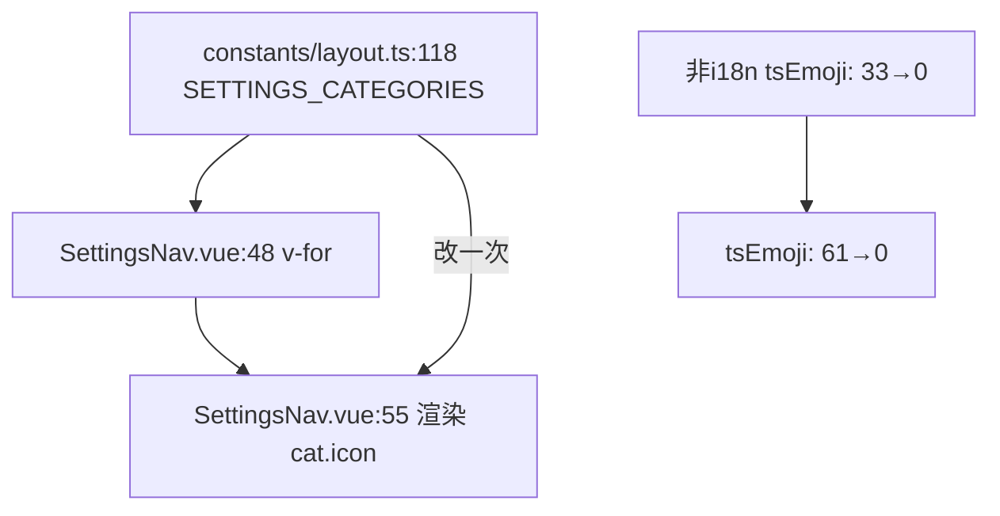
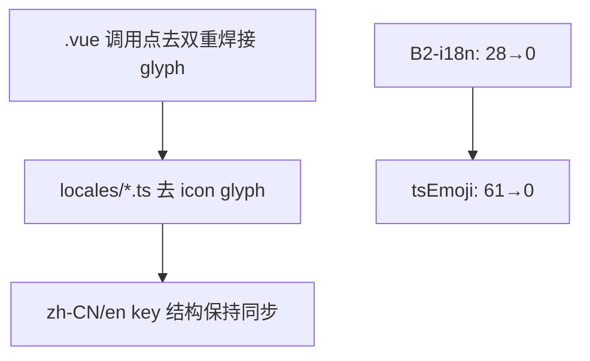
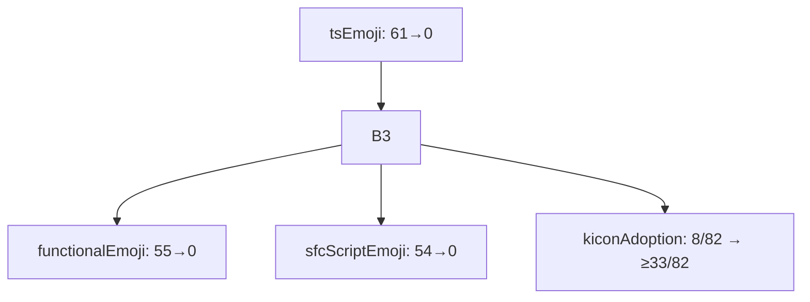
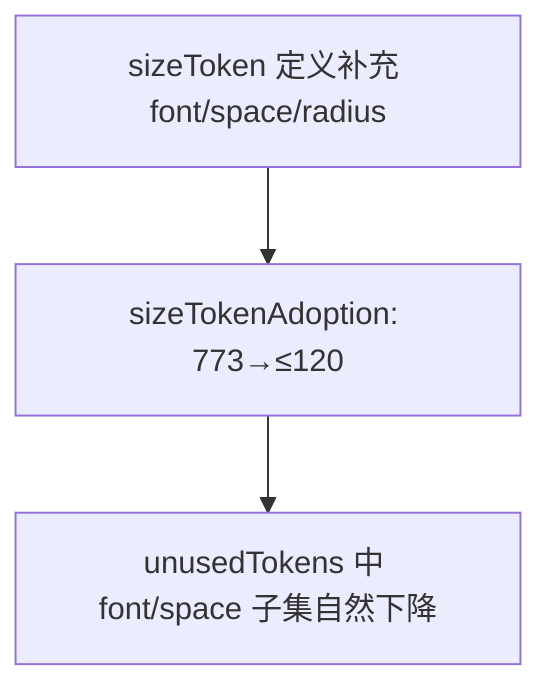
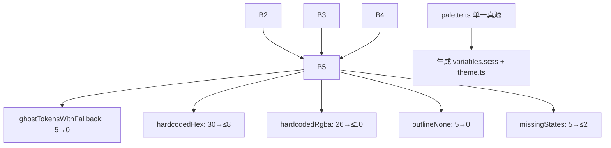
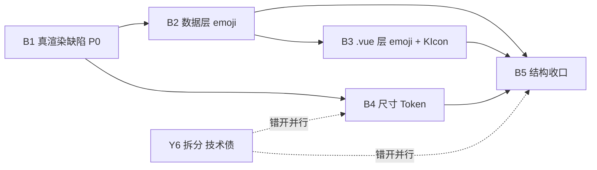

# kmaster-studio UI/UX v2 实施计划（T3 · 高见远）

> **产出人**：高见远（Architect）　**任务**：T3 对比 + 计划（v2 gap 矩阵与分阶段完善计划）
> **依赖**：T1 现状基线 + T2 `kmaster-studio-ui-ux.v2.md` + T2.5 反虚高验收脚本（12 指标，exit 0 复验）
> **本轮范围**：设计 + 计划。**不改任何源码**（代码实现是下一轮的事）。
> **核心闸门**：计划项 ↔ 脚本指标 **1:1 对应**；凡无脚本指标可验证的计划项，一律不进矩阵，移入「关联技术债」。

---

## 〇、权威基线口径（来自 `uiux-metrics-baseline.json`，已复验 exit 0）

- **计数单位 = 位点（file:line）**，非 emoji 字符数；多 emoji 同行记 1 位点（现存 10 处，行号经 T3a-3 修正 off-by-one：`AppNav.vue:78 🌙☀`、`ToolCallCard.vue:13 ⏳✕`、`LeftSidebar.vue:613 🌙☀`、`StatusBar.vue:113 🌙☀`、`FileTreePane.vue:51 ▶▼` / `52 📁📂`、`SubagentCard.vue:75 ▲▼`、`ThoughtBlock.vue:11 ▾▸`、`ToolCallCard.vue:16 ▾▸`、`LeftSidebar.vue:578 ◉○`）。原 `AppNav.vue:79` 行号为 `splitSFC` off-by-one 产物——第 79 行实际是 `☀️` 的下一行（空行或无关行），`🌙☀️` 双 emoji 位点在第 78 行，已修正。
- 匹配集 `EMOJI_RE` = 标准 Unicode 属性 `\p{Extended_Pictographic}`（基础集，禁止手工枚举整段码点区间）+ 显式补充块（抽样实证确属 UI 图标的符号型字符：`●○▾✕☰⛶✍✎▸↪⏹⏳⏸⏯↗◐◉⌨✏↻↺▲▶▼◀◂▴` 等）；比单纯 `Extended_Pictographic` 更宽且可控，**有意为之，请勿收窄**。类 B 文案标点（如 `→` `↔` `·`）刻意不进补充块，确保被豁免（见报告 §七 A/B/C 三类判定）。实心三角族 `▲▶▼◀◂▴` 由 T3a-3 补入（`FileTreePane.vue:51` `▶▼`、`SubagentCard.vue:75` `▲▼` 系具名折叠箭头，类 A 真图标；原仅 ▾▸ 在块内、▲▶▼◀◂▴ 漏网，口径自相矛盾）。
- 权威整改面 = **217 位点**（机械）= 97 template + 57 .vue-script + 63 .ts/.scss；唯一不计入违规的 emoji 仅：注释 emoji（93）/ `*.test.ts` / 仅用于 `console.log` 的日志串。T3a-3 修 `splitSFC` 结构性漏扫（27 位点回补）+ 补三角族后，由 170 升为 195；T3a-4 反向穷举普查（123 码位）发现第六类缺口 +19 位点，升至 214；收尾裁定 `→` 改判 A 后机械计数升至 217。**其中 2 个位点（`NewTaskDialog.vue:211`、`MemoryView.vue:202`）为类 B 句中连接符，经主理人裁定不进入整改——实际可整改面 = 215（95+57+63）。** verify 经 E4 位点级豁免确保闸门不误报。

| # | 指标 | 当前 | 等级 | 释义 |
|---|---|---|---|---|
| 1 | `ghostTokensNoFallback` | 3 | 🔴 | 无 fallback 幽灵 Token = 真渲染 bug（背景直接渲染为空） |
| 2 | `ghostTokensWithFallback` | 5 | 🟡 | 有 fallback 幽灵 Token = 主题切换永久失效 |
| 3 | `hardcodedHex` | 30 | 🟡 | 硬编码十六进制色值 |
| 4 | `hardcodedRgba` | 26 | 🟡 | 硬编码 rgba 色值 |
| 5 | `functionalEmoji` | 97 | 🔴 | template 内真实渲染的 emoji（T3a-2 扩类后 54→55；T3a-3 结构性漏扫修复后 55→78；T3a-4 反向普查后 78→97）。其中 2 个位点为类 B 句中连接符（NewTaskDialog:211、MemoryView:202），不计入整改，实际可清零位点 95 |
| 6 | `outlineNone` | 5 | 🟡 | `outline:none` 抵消 focus 环 |
| 7 | `kiconAdoption` | 8/82 (9.8%) | 🟡 | KIcon 采用率 |
| 8 | `sizeTokenAdoption` | 773 (0.6%) | 🔴 | 字号/间距仍用原始 px（Token 仅 0.6%） |
| 9 | `missingStates` | 5（3 真实） | 🟡 | 缺空/错/载状态的 view（ChatView 属良性误报，不计硬指标） |
| 10 | `unusedTokens` | 16 | 🟢 | 定义却未使用的 Token |
| 11 | `tsEmoji` | 63 | 🔴 | `.ts`/`.scss` 层会渲染到界面的 emoji（含 `AGENT_STATUS_ICONS` 14、`locales/*.ts` i18n 图标；T3a-2 扩类后 46→61；T3a-4 扩类后 61→63） |
| 12 | `sfcScriptEmoji` | 57 | 🔴 | `.vue` `<script>` 块内会渲染到界面的 emoji（含 `||` 兜底、映射表；T3a-2 扩类后 48→54；T3a-3 后 54→56；T3a-4 后 56→57） |

> 参考项（不计违规）：运行时注入 Token 5（合法）、注释 emoji 93（唯一豁免类）。
> 验收命令（本机 Node 22.22.2）：`NODE=C:/Users/towyq/.workbuddy/binaries/node/versions/22.22.2/node.exe`

---

## 一、Gap 矩阵（计划项 ↔ 12 指标 1:1）

> 规则：每一行必须可被脚本指标验证。下方 12 行覆盖全部 12 指标，**无一项脱离脚本**。

| 指标 | 当前 | v2 目标 | 所属批次 | 验收命令（直接引用脚本指标名） |
|---|---|---|---|---|
| `ghostTokensNoFallback` | 3 | **0** | **B1** (P0) | `node scripts/uiux-audit.mjs --fail-on-regression` → `ghostTokensNoFallback: 3 → 0` |
| `hardcodedHex`(McpCard 5 状态点) + `hardcodedRgba`(McpCard 阴影) | 30 / 26 | **≤8 / ≤10** | **B1** + **B5** | `hardcodedHex: 30 → ≤8`、`hardcodedRgba: 26 → ≤10` |
| `tsEmoji` | 63 | **0** | **B2** | `tsEmoji: 63 → 0` |
| `functionalEmoji` | 97 | **2** | **B3** | `functionalEmoji: 97 → 2`（2 个残留为类 B 句中连接符，不进入整改） |
| `sfcScriptEmoji` | 57 | **0** | **B3** | `sfcScriptEmoji: 57 → 0` |
| `kiconAdoption` | 8/82 (9.8%) | **≥33/82 (>40%)** | **B3** | `kiconAdoption: 8/82 → ≥33/82` |
| `sizeTokenAdoption` | 773 (0.6%) | **≤120 (>70%)** | **B4** | `sizeTokenAdoption: 773 → ≤120` |
| `ghostTokensWithFallback` | 5 | **0** | **B5** | `ghostTokensWithFallback: 5 → 0` |
| `outlineNone` | 5 | **0** | **B5** | `outlineNone: 5 → 0` |
| `missingStates`（仅真实缺失） | 5（3 真实） | **≤2** | **B5** | `missingStates: 5 → ≤2`（ChatView 不计） |
| `unusedTokens` | 16 | **≤4** | **B4**→**B5** | `unusedTokens: 16 → ≤4`（font/space 子集随 B4 自然下降） |

> **校验结论**：12 指标全部落位（B1×1、B2×1、B3×3、B4×1、B5×5、B4/B5 共享×1），无「裸计划项」。

---

## 二、分批实施计划（严格按 B1→B2→B3→B4→B5 顺序）

### B1 — 真渲染缺陷（P0，最高优先）

**性质**：用户肉眼可见 bug，非规范债，必须一次清零。

**1. 涉及文件清单**
- `packages/client/src/components/chat/AgentTabBar.vue`（`:134` `--km-accent-bg` 无 fallback → 选中态不可见）
- `packages/client/src/components/chat/MessageItem.vue`（`:422`/`:446` `--km-accent-bg`、`:467` `--km-danger-bg`、`:355` `--km-file-chip-bg`）
- `packages/client/src/components/cards/McpCard.vue`（`:161` 仅亮色 `rgba(0,0,0,0.12)` 阴影；`:62–66` 5 处状态 hex）

**2. 依赖关系**


**3. 预估工时**：1.5 人日

**4. 验收命令与目标**
```
node scripts/uiux-audit.mjs --fail-on-regression
# ghostTokensNoFallback: 3 → 0
# （McpCard 的 5 hex + 1 rgba 计入 hardcodedHex/Rgba，B5 收口时一并归零）
```

**5. 回归风险点**：`--km-accent-bg` 等 Token 必须在 `variables.scss` 或 `cssVars` 中**正式定义**（不能只加 fallback），否则从「无 fallback」变「有 fallback」→ 指标从 🔴 转 🟡 而非归零。定义后需用 `--fail-on-regression` 确认 `ghostTokensNoFallback` 真的降到 0。

---

### B2 — 数据层 emoji 归一（tsEmoji: 63→0，拆 B2-a / B2-i18n 两子项）

**性质**：数据层是单一真源，**必须先于 B3 模板层做**。理由：先改 `constants/layout.ts` 的 `SETTINGS_CATEGORIES`，`SettingsNav.vue` 的 `{{ cat.icon }}` 自动跟随；反过来先改模板，数据层会把 emoji 灌回来，白做。T3a-2 扩类后 `tsEmoji` 由 46 升为 61（其中 `locales/*.ts` i18n 图标 28 位点构成独立新债型，单列为 **B2-i18n**；其余 33 位点为非 i18n 数据层，归 **B2-a**）；T3a-4 扩类后由 61 升至 63。

**整体验收（B2-a + B2-i18n 合并）**
```
node scripts/uiux-audit.mjs --fail-on-regression
# tsEmoji: 63 → 0
```

#### B2-a — 非 i18n 数据层 emoji 归一（33 位点）

**1. 涉及文件清单**（完整集合以 `node scripts/uiux-audit.mjs --details --metric tsEmoji` 为准，剔除 `locales/*.ts` 后）
- `packages/client/src/constants/layout.ts`（`:118` `SETTINGS_CATEGORIES` 12 emoji — 主战场）
- `packages/client/src/types/agent.ts`（`:44-57` `AGENT_STATUS_ICONS` 14 状态图标）
- `packages/client/src/stores/agentRoles.ts`（`:23`）
- `packages/client/src/composables/useExpertList.ts`（`:81/98`）、`useMcpList.ts`（`:57/72`）、`useSkillList.ts`（`:71/110`）（共 6 处）
- 相关 `.scss` 内 emoji（若有）

**2. 依赖关系**

> 渲染链证据：`constants/layout.ts:118` → `SettingsNav.vue:48 v-for` → `:55 {{ cat.icon }}`。

**3. 预估工时**：1 人日

**4. 回归风险点**：`constants/layout.ts` 改 `SETTINGS_CATEGORIES` 后，`SettingsNav.vue` 的 `{{ cat.icon }}` 自动跟随；务必确认 KIcon/默认图标常量已就位，否则 `cat.icon` 变 `undefined` 开天窗。

#### B2-i18n — locales/ i18n 图标剥离（28 位点：zh-CN 14 + en 14）

**性质（新债型，类 A，比普通数据层 emoji 更难）**：i18n 文案把图标 glyph 焊死在字符串里（如 `'chat.send': '发送 ▸'`、`'session.export': '📥 导出 Markdown'`），且 zh-CN / en 各一份、key 结构必须同步。更麻烦的是**双重焊接**——`.vue` 调用点有时把同一 glyph 也硬编码在模板里（如 `SidebarSessionItem.vue:189` `<button :aria-label="t('sidebar.action.archive')">📦</button>`，而 locale `sidebar.action.archive='📦 归档'` 同样含 📦）。因此剥离必须**同时删模板调用点的 glyph 与 locale 字符串里的 glyph**，只改一处仍残留。

**1. 涉及文件清单**
- `packages/client/src/locales/zh-CN.ts`（14 处 icon 焊接）
- `packages/client/src/locales/en.ts`（14 处 icon 焊接）
- 模板双重焊接调用点（必须同步改，以 `node scripts/uiux-audit.mjs --details --metric tsEmoji` 全量定位）：`SidebarSessionItem.vue:189`（📦 archive）等
- 建议改造：把 `locales/*.ts` 的 `{icon, text}` 结构化拆分（PM v2 文档第 12 章已要求），替换时统一走 KIcon，避免 glyph 残留

**2. 依赖关系**


**3. 预估工时**：1 人日（风险高，单独估）

**4. 回归风险点（必读）**：
- 改 `locales` 时**只删 glyph、绝不改文案 key 名**，否则触发 i18n 缺失告警（zh-CN/en 双份，漏改一份即告警）。
- **双重焊接点**是最大陷阱：只改 locale 不改模板（或反之），glyph 仍残留；T3a-2 已确认 `SidebarSessionItem.vue:189` 为典型案例，须逐处 `tsEmoji` 全量核对清零。
- 结构化 `{icon, text}` 改造属于更大重构，若本轮只做「去 glyph」，须在 B5 / i18n 专项里跟进，避免半吊子。

> **B2 两子项合并工时**：2 人日（与 T3a-2 重估一致）。

---

### B3 — .vue 层 emoji 归一（97 template + 57 script = 154 位点；其中 2 个类 B 句中连接符不整改，实际 152）

**性质**：模板 + 脚本块 emoji 清零，KIcon 采用率拉升。依赖 B2 已完成（数据层干净）。

**1. 涉及文件清单**（完整集合以 `node scripts/uiux-audit.mjs --details` 为准；高密度文件示例）
- template（`functionalEmoji`）：`AppNav.vue`、`MessageItem.vue`、`OutputPanel.vue`、`StatusBar.vue`、`SessionConfigBar.vue`、`LeftSidebar.vue`、`SettingsNav.vue`、`MarketLayout.vue`、`MonitorSection.vue`、`SidebarSessionItem.vue`、`ChatView.vue`、`JobsView.vue`、`MemoryView.vue`、`SubagentCard.vue` 等（78 位点 / 约 30 文件）
- script（`sfcScriptEmoji`）：`AppNav.vue`、`ChatInput.vue`、`MarketLayout.vue`、`ResourceCard.vue`、`ResultDialog.vue`、`AgentMarkdown.vue`、`EntityCard.vue`、`AgentRoleDetail.vue`、`ExpertsView.vue`、`McpView.vue`、`SettingsView.vue`、`SkillsView.vue`、`FileTreePane.vue`、`SubagentCard.vue` 等（56 位点 / 约 30 文件）
- 脚本块数据兜底（如 `entity.icon || '🤖'`）一并替换为 KIcon 或默认图标常量

**2. 依赖关系**


**3. 预估工时**：4 人日

**4. 验收命令与目标**
```
node scripts/uiux-audit.mjs --fail-on-regression
# functionalEmoji: 97 → 2   （2 个残留 = NewTaskDialog:211 + MemoryView:202，类 B 句中连接符）
# sfcScriptEmoji: 57 → 0
# kiconAdoption: 8/82 → ≥33/82   （v2 目标 >40%，后续冲刺 >60%）
```

**5. 回归风险点**：
- `entity.icon || '🤖'` 之类兜底改为「默认 KIcon 常量」而非「删除兜底」，否则缺图时界面开天窗。
- KIcon 替换需确认 Tabler 图标名存在；缺失图标会编译/运行报错。建议先建 `icon-map`（emoji→tabler 名）再批量替换。
- 勿为凑数把 emoji 改为图片 base64（会触发新硬编码），统一走 KIcon。

---

### B4 — 尺寸 Token 归位（773 处原始 px，采用率 0.6%）

**性质**：独立成批，**绝不与颜色改造混做**（混做会让 diff 爆炸到无法 review，出问题也无法二分定位）。

**1. 涉及文件清单**
- **TOP5 优先级（主理人预统计，漏任一直接退回重编）**：
  - `packages/client/src/components/layout/LeftSidebar.vue`（主理人统计 84 / 脚本窄口径 43）
  - `packages/client/src/components/chat/ChatInput.vue`（61 / 23）
  - `packages/client/src/views/JobsView.vue`（54 / 27）
  - `packages/client/src/components/chat/MessageItem.vue`（50 / 17）
  - `packages/client/src/components/chat/OutputPanel.vue`（45 / 26）
- 完整 71 文件 / 773 声明以 `node scripts/uiux-audit.mjs --details --metric sizeTokenAdoption` 生成。
- **排除**：`packages/client/src/styles/variables.scss` 的 38 处 px 是 Token **定义本身**，合法，不计入债。

**2. 依赖关系**


**3. 预估工时**：5 人日

**4. 验收命令与目标**
```
node scripts/uiux-audit.mjs --fail-on-regression
# sizeTokenAdoption: 773 → ≤120   （采用率 ≥70%）
# 同时观察 unusedTokens 中 font/space 类下降
```

**5. 回归风险点（必读）**：
- **`LeftSidebar.vue`（84/43 px）同时是 967 行超长文件**——两笔债（尺寸 + 架构）叠在同一处。B4 在此文件只做 px→Token 替换，**不在此做拆分**（拆分归 Y6）。替换后必须 `git diff` 人工核对布局像素级一致，避免间距塌缩。
- 替换顺序：先补 Token 定义（spacing/type scale），再用 IDE 批量 `px→var(--km-*)`；每替换一类（如 padding）跑一次脚本确认 `sizeTokenAdoption` 下降且 `hardcodedHex/Rgba` 不误伤。

---

### B5 — 结构性改造（放最后）

**性质**：架构级收口，依赖 B2/B3/B4 已基本干净。

**1. 涉及文件清单**
- **Y2 调色板单一真源**：新建 `packages/client/src/theme/palette.ts`（JS 常量模块，导出 `PALETTE` 含 light/dark 双值）→ 由它**生成** `styles/variables.scss`（CSS 变量）与 `styles/theme.ts`（Naive `themeOverrides`）。单一真源，杜绝 `theme.ts`/`variables.scss` 双写漂移（采纳主理人对 getComputedStyle 方案的否决，改走 JS 常量）。
- **6 个页面补错误态**：`MemoryView`、`QueueView`、`UsageView`（已确认缺错误态）、`SettingsView`、`JobsView`、`SkillsView`（待最终确认集合）。对应 `missingStates` 真实缺失。
- **`outlineNone` 5 处**：`ChatInput.vue:561`、`ClarifyCard.vue:56`、`DirPickerModal.vue:324`、`LeftSidebar.vue:819`、`SidebarSessionItem.vue:302` → 改 `outline:none` 为 `outline: var(--km-focus-ring)` 或保留可见 focus 环。
- **`ghostTokensWithFallback` 5 处**：`ResourceCard.vue:160,190`、`LeftSidebar.vue:906`、`SidebarSessionItem.vue:312`、`SettingsNav.vue:77`、`--km-mono`（14 处）→ 正式定义 Token，去掉伪 fallback。
- **`hardcodedHex` 30 / `hardcodedRgba` 26 收口**：`McpCard`、`AppNav`、`OutputPanel`、`ResourceCard` 等。

**2. 依赖关系**


**3. 预估工时**：4 人日

**4. 验收命令与目标**
```
node scripts/uiux-audit.mjs --fail-on-regression
# ghostTokensWithFallback: 5 → 0
# hardcodedHex: 30 → ≤8
# hardcodedRgba: 26 → ≤10
# outlineNone: 5 → 0
# missingStates: 5 → ≤2  （ChatView 良性误报不计）
# unusedTokens: 16 → ≤4
```

**5. 回归风险点**：
- Y2 `palette.ts` 生成流程需保证 `variables.scss` 与 `theme.ts` 内容**由同一份常量派生**，CI 加一道「双文件一致性」校验，防止日后再次漂移。
- `missingStates` 补错误态时复用统一 `ErrorState` 组件，避免各 view 各写一套（否则 `missingStates` 指标虽降但代码重复升高）。
- `LeftSidebar.vue` 在 B5 仍可能涉及（`:906` 幽灵 Token、`:819` outline、B4 的 px）——三笔债同文件，B4/B5 两批都要动它，分批间需 rebase 对齐，禁止并行改同一文件。

---

## 三、关联技术债（排除项，不进 B1–B5）

| 项 | 性质 | 为何本轮不做 | 建议时机 | 不做的风险 |
|---|---|---|---|---|
| **Y1** `SessionConfigBar` 模型切换 | 功能缺陷，非 UI/UX | 属交互逻辑 bug，不在 UI/UX 改造范围；强行并入会污染 UI/UX 验收口径 | 独立功能修复迭代 | 模型切换失效持续影响用户；与 emoji/Token 无关，混入会干扰 `反虚高` 计数 |
| **Y6** `LeftSidebar.vue` 967 行拆分 | 架构重构 | 与 UI/UX 样式债正交；拆分本身不改变视觉，且风险高 | 独立重构 PR（与 B4/B5 错开） | 文件过长导致 review/diff 困难；但**不拆分为阻塞**——B4/B5 可先在其上做局部修改，仅要求「分批间 rebase 对齐、禁止并行改同文件」 |

> 交叉引用：Y6 的 `LeftSidebar.vue` 同时是 B4（84/43 px）、B5（`:906` 幽灵 Token、`:819` outline）的重点文件，已在各批风险点中点名。

---

## 四、全局依赖与里程碑



| 里程碑 | 完成判据（脚本指标） | 预估累计工时 |
|---|---|---|
| M1 (B1) | `ghostTokensNoFallback: 3→0` | 1.5 d |
| M2 (B2) | `tsEmoji: 63→0` | +2 d = 3.5 d |
| M3 (B3) | `functionalEmoji:97→2` + `sfcScriptEmoji:57→0` + `kiconAdoption ≥33/82` | +4 d = 7.5 d |
| M4 (B4) | `sizeTokenAdoption: 773→≤120` | +5 d = 12.5 d |
| M5 (B5) | `ghostTokensWithFallback:5→0` + `hardcodedHex≤8` + `hardcodedRgba≤10` + `outlineNone:0` + `missingStates≤2` + `unusedTokens≤4` | +4 d = 16.5 d |

> 每里程碑结束均以 `node scripts/uiux-audit.mjs --fail-on-regression` 门禁（exit 0）为放行条件；任一指标回退则门禁 exit 1，禁止合入。
