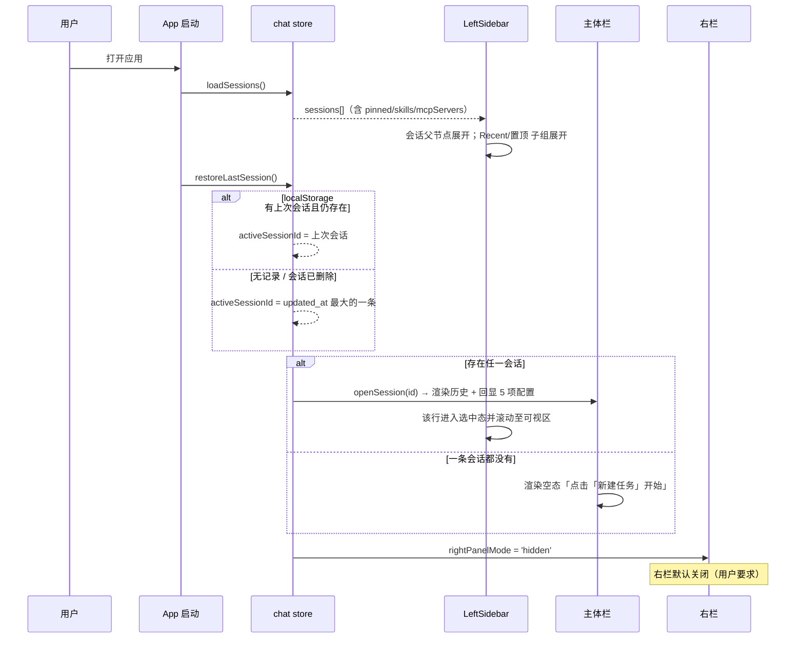

# 增量 PRD — 首页与左栏增强

| 项 | 内容 |
| --- | --- |
| 文档语言 | 简体中文 |
| 项目名 | `kmaster_studio` |
| 技术栈 | Vue 3 + Vite + Naive UI + Pinia（monorepo：`packages/client` / `packages/server` / `packages/desktop`） |
| 文档类型 | **增量 PRD**（只描述相对现状的变更，不重写整系统） |
| 版本 / 日期 | v1.0 / 2026-08-06 |
| 作者 | 许清楚（产品经理） |
| 下游 | 架构师（增量设计 + 任务分解） → 工程师 → QA |

---

## 1. 原始需求复述

用户要求「先完善首页和左栏」，共 4 组诉求：

1. **首页默认态**：左栏默认展开会话 → 选中最近一次会话 → 主体栏打开该会话交互窗口；**右栏默认不打开**。
2. **「新建任务」不常亮**：与「专家 / 技能 / MCP」按钮视觉一致，不做持久高亮。
3. **左栏菜单行为**：专家 / 技能 / MCP 显示「已安装数 / 总数」并在主体栏打开对应卡片 list 页；新建任务弹弹窗。
4. **会话与定时任务两个可折叠区**：
   - 会话（总数）默认收缩；展开后按 **Recent / 置顶 / 工作目录** 三类分组，每类内按 `updated_at` 倒序；会话行显示「名称 + 人类可读相对时间（或 running 图标）」，hover 显示操作图标（更多下拉：打开文件夹 / 重命名 / 分享 / 删除；以及归档、置顶/取消置顶）；点击在主体栏打开会话并**沿用该会话的最新配置**继续交互。
   - 定时任务（总数）默认收缩；展开后每个任务显示「(成功次数/总次数)」，再展开为运行历史实例；点击实例在主体栏展示运行详情（任务名 / 运行时间 / 运行命令 / 运行结果 / 产物 / 日志，产物与日志可在右栏打开或打开所在目录）。

---

## 2. 增量背景（现状 ↔ 差距）

> 结论先行：**约 60% 的能力已有地基，本次是「补齐 + 重组 + 持久化」，不是从零构建。**

| 能力 | 现状 | 差距（本次要做的） |
| --- | --- | --- |
| 左栏骨架 | `LeftSidebar.vue`（784 行）已有 5 个菜单按钮 + 三段会话分组 | 菜单加计数徽标；会话/定时任务改为「可折叠父节点」；新增 Recent 分组 |
| 新建任务弹窗 | ✅ `components/dialog/NewTaskDialog.vue` 已存在并被左栏引用 | **复用**，仅需保证按钮不高亮 + 创建后自动打开主体栏 |
| 菜单高亮 | 5 个按钮均用 `secondary` 填充底色，「新建任务」与未激活项视觉同级、无路由态却带底色 | 统一为「未激活 = 无底色」，「新建任务」永不参与路由高亮 |
| 会话分组 | `useSessionList.getGroupedSessions` = `{pinned, byWorkspace, automations}` | 新增 `recent`；`automations` 从会话分组中剥离，改由 `stores/jobs` 独立渲染 |
| 时间显示 | `new Date(s.updated_at).toLocaleString()` — 非人类可读 | 新增 `utils/time-ago.ts` |
| 置顶 | `chat.togglePin` **仅写本地 Set，刷新即丢** | 接后端持久化（`GET /api/sessions` 已返回 `pinned`，缺 write 端点） |
| 归档 | 后端返回 `archived` 只读，**无写端点** | 扩展 `PATCH /api/sessions/:id` 支持 `archived` |
| 会话配置回读 | `skills` / `mcpServers` **仅创建时下发、不落库、不回读** | kmaster.db `sessions` 表加列 + API 返回（**P0 阻塞项**） |
| 定时任务后端 | ✅ 完整：`/api/jobs`、`/api/cron-history`、`/api/cron-status`、`stores/jobs.ts` 已封装 | 纯前端：左栏两级折叠 + 主体栏运行详情页 |
| 右栏产物态 | ✅ `RightPanelMode = 'job-artifact'` + `chat.openJobArtifact(run)` + `desktop-bridge.openPath()` 全部就绪 | **直接复用**，不新增右栏态 |
| Mock 数据 | `MonitorSection.vue` 有硬编码 MOCK | 清理 |

---

## 3. 产品目标

| # | 目标 | 衡量口径 |
| --- | --- | --- |
| **G1** | **零点击可续作** — 打开应用即回到「上次那件事」，无需任何导航动作 | 冷启动后 ≤1 屏内看到最近会话的历史消息与可输入的输入框；右栏保持关闭；首屏交互可用时间 < 1.5s |
| **G2** | **左栏成为唯一的资产总览与导航中枢** — 专家/技能/MCP/会话/定时任务的规模与状态一眼可见、一键可达 | 5 类资产 100% 展示「已安装/总数」或「总数」徽标；任一资产从左栏到主体栏 ≤2 次点击 |
| **G3** | **会话可长期经营** — 分类、置顶、归档、重命名等组织动作全部跨会话持久化 | 置顶/归档/重命名刷新页面后 100% 保持；会话可按 Recent / 置顶 / 工作目录三视角定位 |

三个目标彼此正交：G1 管**启动路径**，G2 管**信息密度与可达性**，G3 管**状态持久性**。

---

## 4. 用户故事

| # | 用户故事 | 关键验收 |
| --- | --- | --- |
| **US-1** | 作为**日常使用者**，我希望**打开应用就自动回到最近一次会话**，这样我不用每次手动翻找就能接着干活。 | 左栏「会话」区已展开、Recent 分组内最近一条被选中高亮；主体栏渲染该会话历史消息；右栏关闭 |
| **US-2** | 作为**探索新能力的用户**，我希望**在左栏一眼看到专家/技能/MCP 各装了多少、总共有多少**，并点一下就在主体栏看到卡片列表，这样我能快速评估还有多少可用资产。 | 三个菜单项均显示 `已安装/总数`；点击分别跳 `/experts`、`/skills`、`/mcp`；当前路由项高亮，其余不高亮 |
| **US-3** | 作为**多项目并行的用户**，我希望**会话能按 Recent、置顶、工作目录三种方式分类浏览**，且每类内按最近更新倒序，这样我在 40+ 会话里也能 3 秒定位。 | 会话父节点默认收缩；展开后 Recent 与置顶默认展开、各工作目录默认收缩；每组内 `updated_at` 倒序；每组标题带数量 |
| **US-4** | 作为**会话管理者**，我希望**鼠标悬浮在会话行上就能置顶、归档，或从「更多」里打开文件夹、重命名、分享、删除**，这样我不用进设置页就能整理会话。 | hover 显示 3 个图标（更多/归档/置顶）；更多下拉含 4 项；所有操作刷新后仍生效 |
| **US-5** | 作为**回归旧任务的用户**，我希望**点开一个历史会话后，它自动沿用上次的工作目录、权限模式、Agent 角色、模型和技能**，这样我不用重新配置就能继续对话。 | 打开会话后，输入区上方配置条回显该会话 5 项配置；发送消息使用回显的配置而非全局默认 |
| **US-6** | 作为**定时任务的运维者**，我希望**在左栏逐层展开「定时任务 → 某个任务 → 历史运行实例」**，并看到每个任务的成功率，这样我能快速发现哪个任务在失败。 | 定时任务父节点默认收缩；任务项显示 `成功次数/总次数`；任务项默认收缩、点击展开运行历史；实例行显示「时间 + 成功/失败图标」 |
| **US-7** | 作为**排查失败任务的用户**，我希望**点击一次运行实例就在主体栏看到完整的命令、结果、产物和日志**，并能把产物在右栏打开或直接打开所在目录，这样我能定位失败原因。 | 主体栏展示 6 个字段；产物/日志各有「右栏打开」和「打开目录」两个动作；右栏复用 `job-artifact` 态 |

---

## 5. 需求池

优先级定义：**P0 = 必须（缺失则本次目标不成立 / 阻塞其他需求）**；**P1 = 重要（影响体验完整度）**；**P2 = 锦上添花（可延后）**。

### 5.1 P0 — 必须

| ID | 需求 | 说明 | 验收标准 |
| --- | --- | --- | --- |
| **B-01** | 会话 `skills` / `mcpServers` 落库与回读 | kmaster.db `sessions` 表新增 `skills TEXT`、`mcp_servers TEXT`（JSON 数组字符串，默认 `'[]'`）。`POST /api/sessions` 写入；`GET /api/sessions` 与 `GET /api/sessions/:id` 返回驼峰 `skills: string[]`、`mcpServers: string[]`；`PATCH /api/sessions/:id` 支持更新这两个字段。 | 创建带 3 个技能的会话 → 刷新页面 → 重新打开该会话 → 配置条仍显示这 3 个技能；接口响应含两个数组字段 |
| **B-02** | 会话 `pinned` 写端点 | 扩展 `PATCH /api/sessions/:id` 接受 `pinned: boolean`，落 hermes state-db（`pinned` 0/1）。`GET /api/sessions` **已**返回 `pinned`，仅缺 write。 | 置顶一个会话 → 刷新 → 仍在「置顶」分组内 |
| **B-03** | 会话 `archived` 写端点 | 扩展 `PATCH /api/sessions/:id` 接受 `archived: boolean`。归档后的会话**默认不出现在**左栏任何分组中。 | 归档会话 → 该行从列表消失 → 刷新后仍不出现 |
| **F-01** | 首页默认态编排 | 冷启动流程：`loadSessions()` → 会话区展开 → 选中 `restoreLastSession()` 结果；若无历史记录则回退到 `updated_at` 最大的一条 → `openSession(id)` 渲染主体栏 → `rightPanelMode = 'hidden'`。无任何会话时展示空态并提示点击「新建任务」。 | 冷启动截图：左栏会话展开+高亮、主体栏有历史、右栏关闭 |
| **F-02** | 「新建任务」按钮取消持久高亮 | 5 个菜单按钮统一样式规则：未激活 = `quaternary`（无底色）；激活 = 主色调 `ghost`。「新建任务」**不参与** `isMenuActive()` 路由判定，恒为未激活态。 | 任意路由下「新建任务」外观与其他未激活按钮完全一致 |
| **F-03** | 专家/技能/MCP 计数徽标 | 三个菜单项右侧显示 `已安装/总数`。口径见 §7-Q1。数据未就绪时显示 `—/—`（骨架），不显示 `0/0`。 | 与 `/experts` 页实际卡片数一致 |
| **F-04** | 会话父节点可折叠 | 新增「💬 会话 (总数)」父行，点击展开/收缩，**默认收缩**（但首页默认态 F-01 会程序化展开一次）。折叠状态持久化到 localStorage。 | 手动收缩 → 刷新 → 保持收缩 |
| **F-05** | 会话三类分组 | `useSessionList.getGroupedSessions` 返回 `{recent, pinned, byWorkspace}`。① **Recent(n)** 默认展开，成员 = 所有 running 会话 ∪ (按 `updated_at` 倒序前 N 条 或 `updated_at` 在 H 小时内的会话)，N/H 见 §7-Q2；② **置顶(n)** 默认展开；③ **{工作目录}(n)** 按目录名 `localeCompare` 升序排列，各自默认收缩，无工作目录的归入「未绑定工作目录」置于最末。**每组内一律按 `updated_at` 倒序。** | 三组齐全、组内倒序、默认展开/收缩符合上表 |
| **F-06** | 人类可读相对时间 | 新增 `utils/time-ago.ts`，规则见 §6.3。会话行副标题从 `toLocaleString()` 改为 `timeAgo(updated_at)`；running 会话以 `⟳ 运行中` 取代时间文本。 | 1 分钟内→「刚刚」；90 分钟前→「1 小时前」；running 会话显示运行图标 |
| **F-07** | 会话行 hover 操作组 | hover/选中时右侧显示 3 个图标：`⋯ 更多`（下拉：打开文件夹 / 重命名 / 分享任务·会话 / 删除任务·会话）、`📦 归档`、`📌 置顶 ⇄ 取消置顶`。非 hover 时该区域隐藏，仅显示时间。 | hover 出图标、移出即隐藏；4+2 个动作全部可点且有反馈 |
| **F-08** | 会话打开并续用配置 | 点击会话 → 主体栏渲染历史消息 → 输入区配置条回显该会话的 5 项配置（工作目录 / 运行权限模式 / Agent 角色 / 模型 / 技能）→ 后续发送沿用之。依赖 **B-01**。 | 打开旧会话发一条消息，实际使用的模型/技能与该会话配置一致 |
| **F-09** | 定时任务两级折叠 | 「⏰ 定时任务 (总数)」父行默认收缩 → 展开为任务项 `{任务名} (成功次数/总次数)`，各项默认收缩 → 展开为运行历史实例行 `{运行时间} {✅\|❌}`，按时间倒序。数据源：`stores/jobs.listJobs()` + `getCronHistory(job_id, limit)`。 | 三级层次可逐级展开；成功率数字与 `/api/cron-history` 统计一致 |
| **F-10** | 运行实例详情页 | 主体栏新增路由 `/jobs/:jobId/runs/:runId`，展示：任务名、运行时间（含耗时）、具体运行命令、运行结果（退出码 + 摘要）、运行产物、运行日志。产物/日志各带「在右栏打开」（复用 `chat.openJobArtifact(run)`）与「打开所在目录」（`desktop-bridge.openPath()`）。 | 6 个字段齐全；两个动作在桌面端可用，Web 端「打开目录」置灰并 tooltip 说明 |

### 5.2 P1 — 重要

| ID | 需求 | 说明 | 验收标准 |
| --- | --- | --- | --- |
| **F-11** | 菜单点击路由跳转 | 专家/技能/MCP 分别打开 `/experts`、`/skills`、`/mcp` 的**卡片 list 页**（现有路由，确认为卡片布局非表格）。 | 三页均为卡片网格 |
| **F-12** | 新建任务弹窗接管 | 复用 `NewTaskDialog.vue`；确认后调 `createSessionWithConfig()`，成功后**自动选中新会话并在主体栏打开**，Recent 分组即时出现该会话。 | 创建后无需二次点击即可开始对话 |
| **F-13** | 「打开文件夹」动作 | 会话「更多」菜单的「打开文件夹」= `openPath(session.workspace)`。工作目录为空时该项置灰。 | 桌面端弹出系统文件管理器 |
| **F-14** | 分组数量徽标 | Recent / 置顶 / 每个工作目录 / 每个定时任务，标题右侧均带数量徽标，且随增删实时更新。 | 删除一个会话，所属组徽标 -1 |
| **F-15** | running 状态实时同步 | `agentStates`（WS 事件）驱动会话行 running 图标；会话由 running 转 idle 时，Recent 分组重算。 | 任务结束后图标自动变为相对时间 |
| **F-16** | 折叠状态持久化 | 会话父节点、定时任务父节点、各工作目录子组的展开/收缩状态写入 localStorage（key: `km.sidebar.collapse`）。 | 刷新后布局与上次一致 |
| **F-17** | 清理 Mock 数据 | 移除 `MonitorSection.vue` 中硬编码 MOCK，改接真实数据或明确空态。 | 全局搜索无遗留 MOCK 常量 |
| **F-18** | 空态与加载态 | 会话/定时任务加载中显示骨架屏；无数据显示空态文案（会话：「暂无会话，点击「新建任务」开始」；定时任务：「暂无定时任务」）。 | 断网启动不出现空白区域或报错 |

### 5.3 P2 — 锦上添花

| ID | 需求 | 说明 |
| --- | --- | --- |
| **F-19** | 分享（轻量版） | 「分享任务/会话」= 导出该会话 Markdown（复用 `GET /api/sessions/:id/export`）→ 写入临时文件 → 复制路径到剪贴板 → toast 提示。**不接真实分享后端**（见 §7-Q5）。 |
| **F-20** | Recent 阈值可配置 UI | 在设置页暴露 `Recent 条数上限` 与 `Recent 时间窗口(小时)` 两个输入项。 |
| **F-21** | 归档会话入口 | 左栏底部或过滤器中提供「显示已归档」开关，可查看并恢复归档会话。 |
| **F-22** | 键盘导航 | `↑/↓` 在会话列表移动、`Enter` 打开、`Cmd/Ctrl+N` 新建任务。 |
| **F-23** | 会话搜索联动分组 | 现有搜索框在分组视图下高亮命中项并自动展开所在分组。 |
| **F-24** | 运行实例状态筛选 | 定时任务展开后可只看失败实例。 |

### 5.4 原始需求覆盖矩阵

| 用户原始条目 | 对应需求 ID |
| --- | --- |
| ① 先完善首页和左栏 | 全部 |
| ② 默认展开会话 / 选中最近会话 / 主体栏打开 / 右栏不打开 | F-01、F-04、F-05 |
| ③ 新建任务不常亮 | F-02 |
| ④-1 新建任务弹窗 | F-12 |
| ④-2 专家（已装/总）→ 卡片 list | F-03、F-11 |
| ④-3 技能（已装/总）→ 卡片 list | F-03、F-11 |
| ④-4 MCP（已装/总）→ 卡片 list | F-03、F-11 |
| ④-5 会话（总数）折叠 + 三类分组 + 组内倒序 | F-04、F-05、F-14、F-16 |
| ④-5 会话行：名称 + 时间/running 图标 | F-06、F-15 |
| ④-5 会话行 hover：更多（打开文件夹/重命名/分享/删除）+ 归档 + 置顶 | F-07、B-02、B-03、F-13、F-19 |
| ④-5 点击打开会话 + 显示历史 + 续用最新配置 | F-08、**B-01** |
| ④-5 Recent 规则（running 或最近 5 条/3 小时内，可配置） | F-05、§7-Q2、F-20 |
| ④-6 定时任务（数）折叠 + 任务项（成功/总）+ 运行实例 list | F-09、F-14 |
| ④-6 运行实例详情（任务名/时间/命令/结果/产物/日志 + 右栏或打开目录） | F-10 |

**结论：原始需求 100% 覆盖，无遗漏。**

---

## 6. UI 设计稿

### 6.1 左栏整体（默认收缩态）

```
┌─ LeftSidebar (宽 260px，可拖拽) ─────────────┐
│ v3.4.1                        [🔍] [⚙]      │  顶栏：版本 / 搜索 / 过滤
├──────────────────────────────────────────────┤
│  ➕  新建任务                                │  ← 永不高亮（F-02）
│  🤖  专家                          12/86     │  ← 已安装/总数（F-03）
│  🧩  技能                           7/54     │
│  🔌  MCP                            3/29     │
│  💬  会话                            42   ▸  │  ← 默认收缩（F-04）
│  ⏰  定时任务                         5   ▸  │  ← 默认收缩（F-09）
├──────────────────────────────────────────────┤
│                                              │
│              （展开区，见 6.2 / 6.4）         │
│                                              │
├──────────────────────────────────────────────┤
│  ⚙ 设置                              👤      │  底栏（现状不变）
└──────────────────────────────────────────────┘
```

**按钮视觉状态机（F-02）**

| 状态 | 样式 | 适用 |
| --- | --- | --- |
| 未激活 | `quaternary`，透明底、常规字重 | 所有按钮的默认态 |
| hover | 浅灰底 `--km-hover` | 所有按钮 |
| 激活（路由命中） | 主色文字 + 主色 8% 淡底 + 左侧 2px 主色竖条 | 仅 专家/技能/MCP/定时任务 |
| **新建任务** | **恒为「未激活」，仅有 hover 与 active(按下) 反馈** | 新建任务 |

### 6.2 会话区展开态（F-04 / F-05）

```
│  💬  会话                            42   ▾  │
│  ┌────────────────────────────────────────┐ │
│  │ ⏱  Recent (3)                      ▾  │ │  ← 默认展开
│  │     重构登录模块              ⟳ 运行中 │ │  ← running 优先置顶
│  │     数据清洗脚本               12 分钟前│ │
│  │     PRD 评审                    2 小时前│ │
│  ├────────────────────────────────────────┤ │
│  │ 📌  置顶 (2)                       ▾  │ │  ← 默认展开
│  │     竞品长期跟踪                  3 天前│ │
│  │     周报生成                        昨天│ │
│  ├────────────────────────────────────────┤ │
│  │ 📁  blog-site (9)                  ▸  │ │  ← 默认收缩，目录名升序
│  │ 📁  kmaster-studio (18)            ▸  │ │
│  │ 📁  ops-scripts (5)                ▸  │ │
│  │ 📁  未绑定工作目录 (10)             ▸  │ │  ← 恒置最末
│  └────────────────────────────────────────┘ │
```

**分组规则速查**

| 分组 | 默认态 | 成员 | 排序 |
| --- | --- | --- | --- |
| Recent | **展开** | `running 会话` ∪ (`updated_at` 倒序前 N=5 条 ∪ `updated_at` 在 H=3 小时内) | `updated_at` 倒序，running 恒置顶 |
| 置顶 | **展开** | `pinned === true` | `updated_at` 倒序 |
| {工作目录} | **收缩** | 按 `workspace` 归组 | 组间：目录名 `localeCompare` 升序；组内：`updated_at` 倒序 |

> 会话可**同时**出现在 Recent 与置顶/工作目录组（Recent 是「快捷视图」而非互斥分类），避免用户在 Recent 里找不到刚置顶的会话。

### 6.3 会话行三态（F-06 / F-07）

```
【默认态】
   ○  数据清洗脚本                          12 分钟前

【运行中】
   ⟳  重构登录模块                           ⟳ 运行中     ← 图标带旋转动画

【选中态】（主体栏正在展示该会话）
  ▎●  数据清洗脚本                          12 分钟前     ← 左侧 2px 主色竖条 + 淡底

【hover 态】—— 时间被操作图标替换
   ○  数据清洗脚本                    [⋯]  [📦]  [📌]
                                       │     │     └─ 置顶 / 已置顶时变 📌̶ 取消置顶
                                       │     └─ 归档（B-03）
                                       └─ 更多，点击下拉：
                                          ┌──────────────────┐
                                          │ 📂 打开文件夹     │  workspace 为空则置灰
                                          │ ✏️  重命名        │  行内变输入框
                                          │ 🔗 分享任务/会话  │  P2 轻量版
                                          │ 🗑  删除任务/会话  │  二次确认 popconfirm
                                          └──────────────────┘
```

**相对时间规则（`utils/time-ago.ts`）**

| 条件 | 输出 |
| --- | --- |
| 会话 running | `⟳ 运行中`（不显示时间） |
| < 60 秒 | `刚刚` |
| < 60 分钟 | `N 分钟前` |
| < 24 小时 | `N 小时前` |
| < 7 天 | `N 天前`（1 天时输出 `昨天`） |
| < 12 个月 | `N 个月前` |
| ≥ 12 个月 | `N 年前` |

原始时间戳通过 `title` 属性提供 tooltip（`2026-08-06 14:32:10`）。

### 6.4 定时任务区展开态（F-09）

```
│  ⏰  定时任务                          5  ▾  │
│  ┌────────────────────────────────────────┐ │
│  │ 每日晨报                    (28/30) ▸  │ │  ← 默认收缩
│  │ 依赖巡检                    (11/12) ▾  │ │  ← 点击展开运行历史
│  │     ✅  2026-08-06 09:00:12            │ │
│  │     ❌  2026-08-05 09:00:08            │ │
│  │     ✅  2026-08-04 09:00:15            │ │  ← 时间倒序，limit 默认 20
│  │     ✅  2026-08-03 09:00:11            │ │
│  │ 周报汇总                      (4/4) ▸  │ │
│  │ 日志清理                    (60/61) ▸  │ │
│  │ COS 同步                      (0/3) ▸  │ │  ← 成功率 0 时数字标红
│  └────────────────────────────────────────┘ │
```

- `(成功次数/总次数)` 由 `getCronHistory(job_id)` 统计得出；成功率 < 50% 时数字用告警色。
- 运行实例行 hover 显示浅底；点击后该行进入选中态并跳转主体栏（F-10）。

### 6.5 运行实例详情页（主体栏，F-10）

```
┌─ 主体栏  /jobs/:jobId/runs/:runId ──────────────────────────────┐
│  ←  依赖巡检 · 2026-08-05 09:00:08                    ❌ 失败    │
├─────────────────────────────────────────────────────────────────┤
│  任务名      依赖巡检                                            │
│  运行时间    2026-08-05 09:00:08  →  09:00:50   （耗时 42s）     │
│  触发方式    定时（cron: 0 9 * * *）                             │
│  运行命令    ┌──────────────────────────────────────────────┐   │
│              │ $ km run --skill dep-audit \                 │   │
│              │     --model claude-sonnet-4 --cwd ~/proj/xx  │   │
│              └──────────────────────────────────────────────┘   │
├─────────────────────────────────────────────────────────────────┤
│  运行结果    exit=1                                              │
│              发现 3 个依赖存在高危 CVE：lodash / axios / vm2     │
├─────────────────────────────────────────────────────────────────┤
│  运行产物    📄 dep-audit-0805.md      [在右栏打开] [打开所在目录]│
│  运行日志    📄 run-0805.log           [在右栏打开] [打开所在目录]│
└─────────────────────────────────────────────────────────────────┘
```

- **[在右栏打开]** → `chat.openJobArtifact(run)`，右栏切至已存在的 `job-artifact` 态（**零新增右栏态**）。
- **[打开所在目录]** → `desktop-bridge.openPath(dirname(file))`；Web 宿主下按钮置灰 + tooltip「仅桌面端可用」。
- 顶部 `←` 返回上一路由；标题右侧状态徽标 ✅ 成功 / ❌ 失败 / ⟳ 运行中。

### 6.6 新建任务弹窗（复用 `NewTaskDialog.vue`，F-12）

```
┌─ 新建任务 ───────────────────────────────┐
│  任务名称 *   [                        ] │  非空校验
│  工作目录     [ ~/proj/kmaster    ] [ … ] │
│  运行权限     [ 询问后执行          ▾ ]  │  SECURITY_MODE_OPTIONS
│  Agent 角色   [ 通用助手            ▾ ]  │  stores/agentRoles.selectOptions
│  供应商       [ anthropic           ▾ ]  │
│  模型         [ claude-sonnet-4     ▾ ]  │  默认取 modelConfig.defaults.default
│  技能         [ ☑ dep-audit ☑ web   ▾ ]  │  多选
│                                          │
│                    [ 取消 ]  [ 创建并打开 ]│
└──────────────────────────────────────────┘
```

确认后：`createSessionWithConfig(config)` → 成功 → `openSession(newId)` → 新会话出现在 Recent 首位并处于选中态。

### 6.7 首页默认态时序（F-01）



---

## 7. 待确认问题与产品建议

> 下表已给出**建议决策（默认执行方案）**。若主理人/用户无异议，工程师直接按「建议」实现，无需再等回复。

### Q1 — 专家/技能/MCP 的「已安装数/总数」口径

**建议（默认执行）**

| 指标 | 口径 |
| --- | --- |
| 已安装 | 专家 `agents.installed.length`；技能 `skills.installed.length`；MCP `mcp.deployed.length` |
| 总数 | **`installed ∪ candidates` 按唯一键去重后的长度**（唯一键：专家/技能用 `name`，MCP 用 `id ?? name`） |

**理由**：`candidates`（COS 候选池）与 `installed` 存在重叠——已安装的资产往往仍留在候选池里。若简单相加会出现「12/86」实际总数只有 80 的虚高，且可能出现 `已安装 > 总数` 的荒谬展示。**必须去重取并集**。

**边界**：任一数据源加载失败或未就绪 → 显示 `—/—` 骨架，不显示 `0/0`（避免误导用户以为没装任何东西）。

---

### Q2 — Recent 分组的阈值配置

**建议（默认执行）**：**放前端**，不动后端。

```ts
// packages/client/src/constants/sidebar.ts
export const RECENT_DEFAULTS = {
  maxCount: 5,      // 最近 N 条
  withinHours: 3,   // 或 更新时间在 H 小时内
} as const;
```

- **合并语义为「并集」**：`running 会话` ∪ `倒序前 5 条` ∪ `3 小时内更新的会话`。理由：用户写的是「仅展示 running 的会话**或**最近更新 {5 个，**或** 3 小时内}」，两个「或」都是并集语义；取交集会导致刚跑完的任务掉出 Recent。
- **上限保护**：并集结果超过 **20 条**时截断（保留最近 20 条），防止某个工作目录批量更新把 Recent 撑爆。
- **持久化**：用户修改后写 `localStorage['km.sidebar.recent']`；设置页 UI 为 **P2（F-20）**，本期先用常量默认值。
- **不进后端**的理由：这是纯展示偏好、单机语义，进后端会引入 settings 表改动与同步成本，性价比低。

---

### Q3 — 会话 `skills` / `mcpServers` 回读

**这是本期唯一的硬阻塞项，必须 P0 完成（B-01）。**

| 层 | 字段名 | 类型 |
| --- | --- | --- |
| kmaster.db `sessions` 表 | `skills`、`mcp_servers` | `TEXT`，存 JSON 数组字符串，默认 `'[]'` |
| API 出参（`GET /api/sessions`、`GET /api/sessions/:id`） | `skills`、`mcpServers` | `string[]`（已 `JSON.parse`，解析失败降级为 `[]`） |
| API 入参（`POST /api/sessions`、`PATCH /api/sessions/:id`） | `skills`、`mcpServers` | `string[]` |
| 前端 `types/chat.ts` `Session` | `skills?: string[]`、`mcpServers?: string[]` | 可选（兼容旧数据） |

**约束**：
- 采用 **snake_case 落库 / camelCase 出参** 的既有约定（与 `cwd → workspace` 一致）。
- 需要 DB migration：`ALTER TABLE sessions ADD COLUMN skills TEXT DEFAULT '[]'`（`mcp_servers` 同理），并对存量行做默认值填充。
- 「只保存最新配置」——**覆盖写**，不做版本历史。每次用户在会话内改动配置即 PATCH 覆盖。
- `types/chat.ts` 的 `Session` 同时补齐 `pinned?: boolean`（后端已返回但类型缺失）。

---

### Q4 — 归档动作

**建议（默认执行）**：**P0，扩展现有端点而非新增。**

- 在 `PATCH /api/sessions/:id` 的入参白名单中加入 `archived: boolean`（与已有的 `title/mode/model/workspace` 并列），复用同一套鉴权与校验逻辑。同一次 PATCH 也支持 `pinned`（Q4 与 B-02 合并实现）。
- **归档后行为**：该会话从左栏所有分组中移除（`GET /api/sessions` 前端侧过滤 `archived === false`）。若被归档的是当前 active 会话 → 自动切到 Recent 首条；无会话则回空态。
- **可恢复性**：本期归档为「软隐藏」，恢复入口列为 **P2（F-21）**。归档不等于删除，数据完整保留。
- **为什么是 P0**：用户明确在会话行操作图标中列出了「归档图标」。若只做图标不做端点，点击后刷新即失效，是可见的功能缺陷。

---

### Q5 — 「分享任务/会话」范围

**建议（默认执行）**：**本期做轻量版，列 P2（F-19）。**

实现方式：
1. 调用已有的 `GET /api/sessions/:id/export` 拿到 Markdown；
2. 桌面端写入 `~/Downloads/kmaster-share/{title}-{date}.md`，复制**文件路径**到剪贴板；Web 端直接触发浏览器下载并复制**会话标题 + 摘要**到剪贴板；
3. toast 提示「已导出并复制路径到剪贴板」。

**不做**：真实分享后端（公开链接、权限控制、过期策略）。理由：真实分享涉及鉴权模型、公网可访问性、隐私合规（会话含工作目录路径与代码片段），是独立的产品议题，不应挂在「完善左栏」这次增量里。**建议单开需求评审。**

---

### Q6 — 新建任务弹窗

**已核实，无需新增。**

`packages/client/src/components/dialog/NewTaskDialog.vue` **已存在**（NModal + 7 项配置表单，已接 `stores/agentRoles`、`stores/modelConfig`），且 `LeftSidebar.vue` 已 `import type { NewTaskConfig }` 并有 `onNewTaskClick` 与「召唤」预填入口。

**本期只需**：① 按钮样式改为不高亮（F-02）；② 确认回调后自动 `openSession(newId)`（F-12）。**不重写弹窗。**

---

### Q7 — 定时任务运行详情的右栏承载

**建议（默认执行）**：**复用现有 `job-artifact` 右栏态，零新增。**

已核实的现成能力：
- `constants/layout.ts` 已定义 `RightPanelMode` 含 `'job-artifact'`；
- `stores/chat.ts` 已有 `openJobArtifact(run: CronRun)` + `loadJobArtifactContent()`（含竞态保护、`JOB_ARTIFACT_MAX_BYTES` 截断、Web 宿主降级为「无全文」静默处理）；
- `RightPanel.vue` 已 `import { openPath } from '../../utils/desktop-bridge'` 并在 L83 调用。

**因此**：
- 「产物」与「日志」共用 `job-artifact` 态，通过传入不同的 `run.file` 区分；若同一 run 同时有产物与日志，右栏顶部用 **两个 tab** 切换（这是本期唯一的右栏侧改动，属小改）。
- 「打开所在目录」直接复用 `openPath()`。
- **不要新增 RightPanelMode 枚举值** —— 现有 9 态已足够，新增会连带 `RIGHT_PANEL_TITLE`、`RIGHT_PANEL_MODES`、`LayoutShell` watch 等多处改动，收益为零。

---

### Q8 —（补充）会话分组的互斥性

用户描述里 Recent / 置顶 / 工作目录三类并列，未说明是否互斥。

**建议（默认执行）**：**非互斥**。Recent 是横切的「快捷视图」，一个会话可同时出现在 Recent 与其所属工作目录组、以及置顶组。

**理由**：若互斥，用户置顶一个刚用过的会话后它会从 Recent 消失，产生「我的会话丢了」的困惑；且工作目录组会因为 Recent 抽走成员而数量对不上。非互斥下各组数量徽标各自独立统计，语义清晰。

---

## 8. 交付验收清单（供 QA 使用）

| # | 验收项 | 关联 |
| --- | --- | --- |
| 1 | 冷启动：左栏会话区展开、Recent 首条选中高亮、主体栏渲染历史、右栏关闭 | F-01 |
| 2 | 无任何会话时：主体栏空态 + 「新建任务」引导，无报错 | F-01、F-18 |
| 3 | 「新建任务」在任意路由下均无高亮，与其他未激活按钮外观一致 | F-02 |
| 4 | 专家/技能/MCP 计数与对应页面实际卡片数一致，且 `已安装 ≤ 总数` 恒成立 | F-03、Q1 |
| 5 | 会话父节点手动收缩后刷新仍收缩 | F-04、F-16 |
| 6 | Recent/置顶默认展开，各工作目录默认收缩，目录名升序，「未绑定工作目录」置末 | F-05 |
| 7 | 每个分组内会话按 `updated_at` 严格倒序 | F-05 |
| 8 | 相对时间 6 档规则全部正确；running 会话显示运行图标 | F-06、F-15 |
| 9 | hover 出现 3 图标，「更多」下拉 4 项全部可用 | F-07 |
| 10 | **置顶 / 归档 / 重命名 刷新后 100% 保持** | B-02、B-03、F-07 |
| 11 | **打开旧会话后 5 项配置正确回显，发送消息实际使用该配置** | **B-01**、F-08 |
| 12 | 定时任务三级折叠正确；`(成功/总)` 与 `/api/cron-history` 一致 | F-09 |
| 13 | 运行实例详情 6 字段齐全；右栏打开走 `job-artifact` 态；Web 端「打开目录」置灰 | F-10、Q7 |
| 14 | 新建任务确认后自动打开新会话，Recent 首位出现 | F-12 |
| 15 | 全局无遗留 MOCK 数据 | F-17 |

---

## 9. 风险与依赖

| 风险 | 影响 | 缓解 |
| --- | --- | --- |
| **B-01 DB migration 失败** | 阻塞 F-08，会话配置无法续用 | migration 加 `IF NOT EXISTS` 守卫；`JSON.parse` 失败降级 `[]`，不抛异常 |
| Recent 并集在大量会话下频繁重算 | 左栏卡顿 | `computed` 缓存 + 20 条上限截断；WS 事件做 300ms 防抖 |
| 计数 API（agents/skills/mcp）三路并发拉取变慢 | 徽标长时间 `—/—` | 三路并行 + 独立降级，任一失败不影响其余两个显示 |
| 会话数 > 200 时全量渲染 | 首屏掉帧 | 工作目录组默认收缩（天然懒渲染）；若单组 > 100 条，架构师评估虚拟滚动 |
| `openPath` 在 Web 宿主不可用 | 「打开文件夹/目录」失效 | 前置 `isDesktop()` 判断，按钮置灰 + tooltip |

---

---

## 10. 变更记录 — v1.1（2026-08-06，架构评审后）

架构师在设计阶段核出两处数据源问题，以下为裁决结果。**本节优先级高于前文对应条目。**

### 10.1 F-10 运行详情：验收标准降级（批准）

**背景**：`CronRun`（`protocol.ts:203`）仅有 7 字段 —— `job_id / job_name / run_time / status / mode / excerpt / file`。`parseCronRunFile()`（`hermes-proxy.ts:1021`）用通用正则 `pick(label)` 从 run markdown 头部抽 `**Label:** value`，目前 hermes 只写 Job ID / Run Time / Status / Mode。

**核实修正**：架构师原判「缺 5 个字段全部无源」不准确。`CronJob`（`protocol.ts:182`）已有 `script` / `prompt` / `no_agent` / `workdir` / `schedule_expr` / `schedule_display`，且 `stores/jobs.ts` 已加载。**「运行命令」与「触发方式」可通过 `job_id` join CronJob 取得，零后端改动。**

**六字段最终盘点**

| F-10 字段 | 数据源 | 状态 |
| --- | --- | --- |
| 任务名 | `CronRun.job_name`，空则回落 `CronJob.name` | ✅ 有 |
| 运行时间 | `CronRun.run_time` | ✅ 有 |
| └ 耗时 | 无 | ❌ **唯一真缺口**，允许「—」 |
| 触发方式 | `CronJob.schedule_display`（join） | ✅ 有 |
| 运行命令 | `CronJob.script ?? prompt` + `workdir`（join） | ✅ 有 |
| 运行结果 | `CronRun.status` 徽标 + `CronRun.excerpt` | ✅ 有 |
| └ exit_code | 无 | ⚠️ 可选增强 |
| 运行记录（产物） | `CronRun.file` | ✅ 有 |

**裁决**：采用 **S1 渐进增强**（后端多 pick 几个 label，抽不到则前端显示「—」）。**否决 S3**（新建 `cron_runs` 记账表：+1 人日，且只覆盖 KMaster 手动触发，漏掉调度器自动触发这一主路径）。**不追 S2**（跨仓改动且历史 run 仍缺字段）。

**三条约束（覆盖 §5.1 F-10 与 §8 第 13 项验收）**

1. **`运行命令` 与 `触发方式` 不允许显示「—」** —— 二者有确定数据源（join CronJob），显示「—」判为实现缺陷。这是同意降级的前提。
2. **「运行结果」最低标准 = `status` 徽标 + `excerpt` 摘要**，`exit_code` 为可选增强，pick 不到不阻塞。
3. **不留空日志行** —— 若确认 hermes 不单独产出 log 文件，则「运行产物」与「运行日志」**合并为单行「运行记录」**，配 `[在右栏打开] [打开所在目录]`。同时 §7-Q7 提到的右栏双 tab 可省略。（若经核实 hermes 确实分别产出产物与日志两个文件，则本条不适用，回退 §6.5 原设计。）
4. **「耗时」允许长期显示「—」，不视为缺陷**，降级至 P2 backlog。待 hermes 在 md 头部补写 `**Duration:**` 后，`pick()` 通用正则可零成本生效。

**批次归属**：F-10 所在批次保持 P1，不追加人日。

### 10.2 F-07「分享」：本期不接线 + ShareDialog 死链并入 F-17

**核实发现**：`components/chat/ShareDialog.vue:44` 显式注释 `// Mock: 生成分享链接`，生成 `${base}/#/share/${sid}?expiry=...`，但 **`src/router` 中不存在 `/share/` 路由** → 必然 404 的死链；且「1 小时 / 24 小时 / 7 天 / 永久」四个过期选项无任何后端支撑。该组件**已挂在线上**（`ChatView.vue:173`）。另：它只读 `store.activeSessionId`，而 F-07 的分享是逐行操作，需重构为接 `sessionId` prop 才能复用。

**裁决**：
- **F-07 更多下拉中的「分享任务/会话」渲染为 disabled + tooltip「即将上线」，本期不接线**（维持 §7-Q5 的 P2 定位）。
- **`ShareDialog.vue` 的死链问题并入 F-17（清理 MOCK 数据）**，与 `MonitorSection.vue` 同批。二选一由架构师按余量决定：
  - **方案 a（推荐）**：`ChatView.vue` 中一并隐藏/置灰入口，组件文件保留待后续启用；
  - **方案 b**：改造为 F-19 轻量版语义（调 `GET /api/sessions/:id/export` 导出 Markdown、复制**文件路径**而非假 URL、移除过期选项）。若选 b，F-07 的分享可顺势接线启用。
- **硬底线**：本期结束后，产品中不得存在「能生成 404 链接且谎称有过期时间」的入口。

### 10.3 分组排序：修正架构师实现（§6.2 规则不变，此处强调）

架构师原按「工作区最新 `updated_at` 倒序」排列工作区分组，**与用户原文冲突，已要求改回**。

> 用户原文：「以工作目录（**按名称排列**）为分类会话list」

| 层级 | 规则 | 说明 |
| --- | --- | --- |
| 工作区**组之间** | 目录名 `localeCompare` **升序** | 用户明确要求；且位置稳定才能建立肌肉记忆。按活跃度排会退化成第二个 Recent，与 Recent 分组功能重复 |
| 工作区**组内会话** | `updated_at` **倒序** | 用户明确要求「每类会话list，按照会话最近更新时间排倒序」 |
| 未绑定工作目录组 | **恒置最末**（硬要求） | 它是「其他/未分类」兜底桶，按字母混入真实目录中间会让用户误以为存在名为 `Default Workspace` 的实际目录 |
| 该组显示文案 | 「未绑定工作目录」（软建议） | 现为英文 `'Default Workspace'`。若有测试断言依赖该字符串，保留英文 key、仅做置底亦可接受 |

### 10.4 已确认无异议的架构决策

| 项 | 结论 |
| --- | --- |
| Q2 Recent 并集 | `running ∪ 倒序前 5 ∪ 3h 内`，Map 保序去重，running 稳定居首，硬上限 20 截断 —— 与 §7-Q2 一致，通过 |
| Q8 分组非互斥 | 同一会话可同时出现在 Recent 与 Pinned；渲染 key 用 `${groupKey}:${id}` 防冲突 —— 通过（补充了 PRD 未覆盖的实现细节） |

### 10.5 二轮补充（架构师回执 + 产品侧复核新增）

**A. ShareDialog 的严重度高于 §10.2 描述 —— 无需点击即可产出死链**

`ShareDialog.vue:66-71`：

```js
watch(() => props.show, (v) => { if (v) generateUrl(); });
```

**弹窗一打开就自动调 `generateUrl()`**，用户无需点击「生成」按钮，404 链接已预填在输入框中等待复制。

**F1b 硬约束**：若走 §10.2 方案 a（入口置灰/隐藏），**必须连同该 `watch` 一并移除**。仅隐藏入口不足够 —— 任何残留的调用路径（含未来他人复用该组件）都会重新产出死链。

**B. 工作区展示文案改中文存在数据污染风险 —— 内部 key 与展示层必须分离**

`'Default Workspace'` 在源码中出现 4 处（3 处代码 + 1 处注释）：

| 位置 | 性质 | 风险 |
| --- | --- | --- |
| `types/newTask.ts:49` | `defaultNewTaskConfig().workspace` 的**实际落库默认值** | **直接改中文会污染新建任务写入 DB 的数据** |
| `stores/chat.ts:257` | 分组回落 key（展示） | 改动安全 |
| `useSessionList.ts:42` | `workspaceKeyOf` 回落 key（展示） | 改动安全 |
| `useSessionList.ts:139` | 注释 | 无 |

**方案**：引入 `UNBOUND_WORKSPACE_KEY` 常量锁定内部 key，中文文案仅在展示层替换。§10.3 中「改中文名为软建议」据此**收紧为：内部 key 不得改动，仅展示层可改**。

**P2 backlog（本期不改，产品侧存档）**：因落库默认值就是 `'Default Workspace'`，**「用户主动选择 Default」与「用户未绑定任何目录」在 DB 中值完全相同**，二者语义不可区分。当前功能正常属巧合。未来若需区分（如统计真实工作目录使用率、或让未绑定会话走不同默认行为），须先做数据迁移（建议未绑定落 `null`/`''`，而非魔法字符串）。

**C.〔产品侧复核新增〕`getGroupedSessions` 存在重复实现，其一为死代码**

| 位置 | 状态 | 消费方 |
| --- | --- | --- |
| `composables/useSessionList.ts:129` | **活跃** | `LeftSidebar.vue:98 / 349 / 352 / 401` 全部走 `sl.getGroupedSessions` |
| `stores/chat.ts:244`（于 `:842` 导出） | **死代码** | 无任何组件消费 |

两份实现逻辑几乎一致，且**同时存在两个与既有决策冲突的问题**：

1. **均为互斥分组，违背 Q8**：两处都写 `if (pinnedSessions.has(s.id)) { pinned.push(s); continue; }` —— `continue` 使置顶会话**被排除出 byWorkspace**。而 §7-Q8 已裁定分组**非互斥**。
2. **均读本地 Set 而非后端字段**：两处都读 `pinnedSessions`（本地 Set）。**B-02 完成后，若不同步改为读 `session.pinned`，置顶持久化将不生效** —— 后端存了，前端仍按本地 Set 分组。

**要求**：
- **删除 `stores/chat.ts` 中的死代码副本**（含 `:842` 的导出），避免工程师改错文件或未来消费方切换导致静默回归；
- 活跃实现改为**非互斥**（移除 `continue`）且**数据源切至 `session.pinned`**。

**D.〔产品侧复核新增〕工作目录分组当前默认全展开，与 F-05 冲突**

`LeftSidebar.vue:98`：

```js
const defaultExpanded = computed(() => Object.keys(sl.getGroupedSessions.value.byWorkspace));
```

把**所有** workspace 组名塞进 `n-collapse` 的 `default-expanded-names`，即**当前所有工作目录组默认展开**。而 §6.2 与 F-05 要求「各工作目录默认**收缩**」。

**要求**：`defaultExpanded` 改为仅含 `Recent` 与 `置顶` 两组（`SIDEBAR_GROUP = { RECENT: '__recent__', PINNED: '__pinned__' }`，`__` 前缀防与真实目录名碰撞）；工作目录组不进该数组。此项同时是 §8 验收清单第 6 条的实现落点。

- **首次访问（localStorage 为空）必须落到上述默认**：Recent 展开 / 置顶 展开 / 全部工作目录 收缩。持久化读取逻辑不得把「空状态」误判为「全展开」——这是 F-05 的验收点（主理人补充）。

### 10.6 三轮复核 — 标志位类型契约（v1.2）

架构师 F27 指出 `Session.archived` 是 `number` 而非 boolean、`updated_at` 是时间戳 number 而非 ISO 串。**均核实成立**（`types/chat.ts:105-107`）。但后端已完成 B-01/B-02/B-03 实现，实际契约与 F27 的推论有出入，此处以**实现为准**重新定契约。

**A. `archived` 的输入侧不存在类型冲突 —— `readFlag` 已双向兼容**

`routes/sessions.ts:266-271`：

```ts
const readFlag = (raw: unknown): boolean | null | undefined => {
  if (raw === null) return null;              // 显式清除覆盖，回落 hermes
  if (typeof raw === 'boolean') return raw;   // 接受 boolean
  if (typeof raw === 'number') return raw !== 0;  // 也接受 0/1
  return undefined;                            // 不传 → 不动
};
```

**PATCH 入参同时接受 `boolean` 与 `0|1`**，F27 担心的「`PATCH {archived:true}` 与类型冲突」在运行时不存在。设计文档若把 A6 收窄为「仅接受 `0|1`」，会**比实现更窄**，导致文档与代码脱节。**建议 A6 表述为「接受 boolean 或 0/1，`null` 表示清除覆盖」。**

**B. 真正的风险是出参侧的「两套约定」—— 且它已经存在**

| 标志位 | PATCH 入参 | GET 出参 | 对称性 |
| --- | --- | --- | --- |
| `archived` | `boolean` 或 `0\|1` | **`number`（0/1）** | ❌ **不对称**（传 `true`，回 `1`） |
| `pinned` | `boolean` 或 `0\|1` | **`boolean`** | ✅ 对称 |

`protocol.ts:234-237` 明确标注 `archived` 因历史语义保持 number、**不得改 boolean**（避免破坏既有消费方），而 `pinned` 是新增字段用 boolean。**这是刻意的、可接受的决策** —— 但结果是**同一个 JSON 对象里两个语义相同的标志位类型不同**。

> ⚠️ 架构师「新增 `pinned` 列统一 `INTEGER`，不引入两套约定」只解决了 **DB 列**层面。**API 出参层的两套约定已经存在且不打算消除。**

**C. 硬约束（对前端）**

1. **禁止对 `archived` / `pinned` 使用 `===` 比较，一律用真值判断。**

   ```ts
   if (s.archived) { … }        // ✅ 对 1 和 true 都成立
   if (!s.pinned) { … }         // ✅
   if (s.archived === true) { } // ❌ 永远 false（出参是 1）
   if (s.pinned === 1) { }      // ❌ 永远 false（出参是 true）
   ```

   这一条一行规则即可消灭整类 bug，**优先级高于统一类型**。

2. **`types/chat.ts` 的 `Session` 必须与服务端出参逐字对齐**：
   - `archived: number`（**保持现状，不要改**）
   - `pinned: boolean`（**新增，必须是 boolean 不是 number**）

3. **乐观更新必须写服务端形状**：PATCH 成功后若在本地直接改对象，须写 `s.archived = 1` / `s.pinned = true`，**不可写 `s.archived = true`** —— 否则本地对象与接口返回形状不一致，后续任何 `=== 1` 判断静默失效。**更稳妥的做法是 PATCH 成功后重新拉取该会话。**

**D. `timeAgo` 签名 —— 采纳 F27**

`Session.updated_at` 是 `number`（时间戳），而 `CronJob.next_run_at` / `last_run_at` 是 `string | null`（ISO）。两类调用方并存，故：

```ts
export function timeAgo(input: number | string | null | undefined): string
```

非法/空输入回落空串或「—」，**不得抛异常**（会话行是高频渲染路径）。§6.3 的 6 档规则不变。

---

*（PRD 结束。v1.2 已纳入三轮评审裁决与复核补充。下一环节：工程师按设计文档与本 PRD 实现。）*
