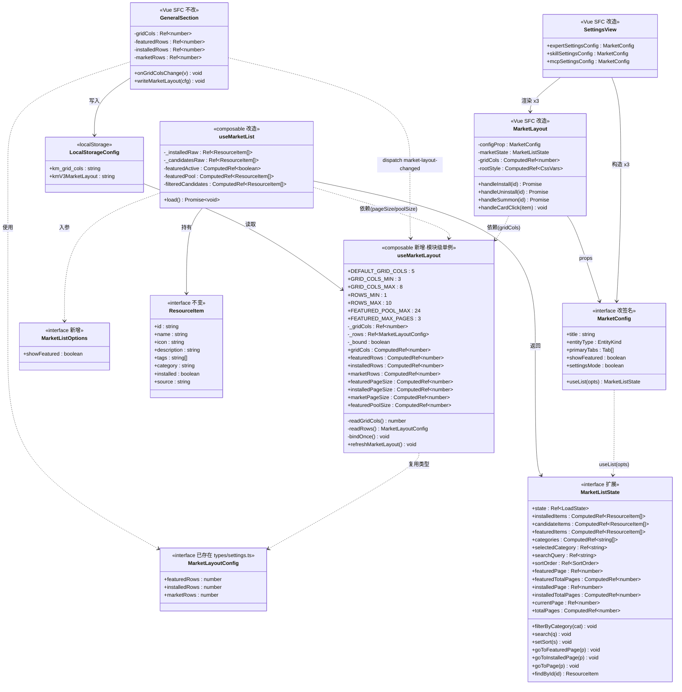
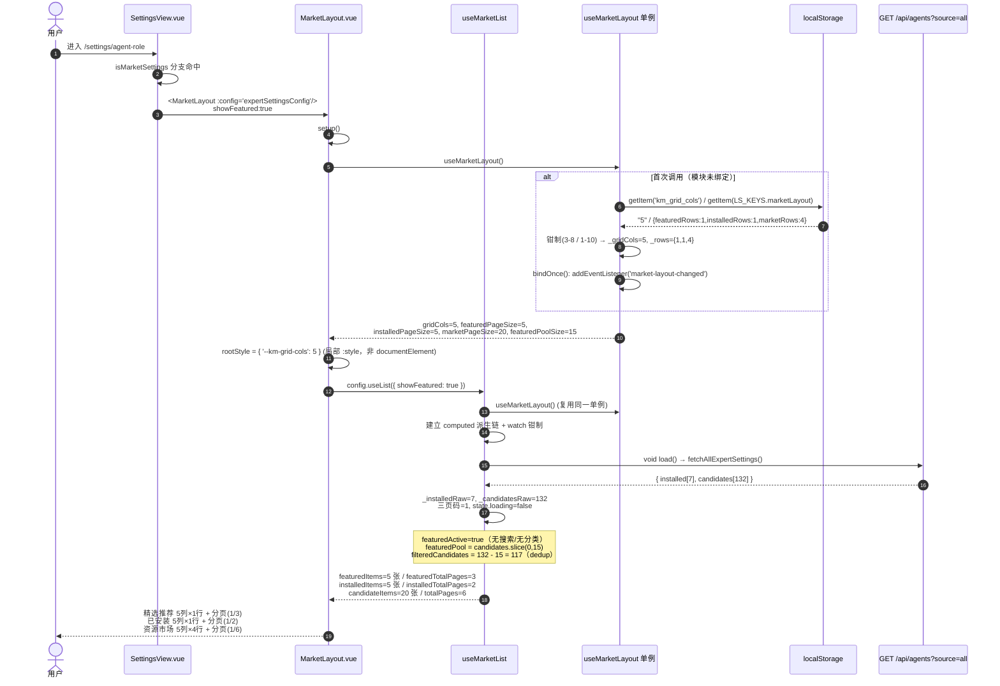
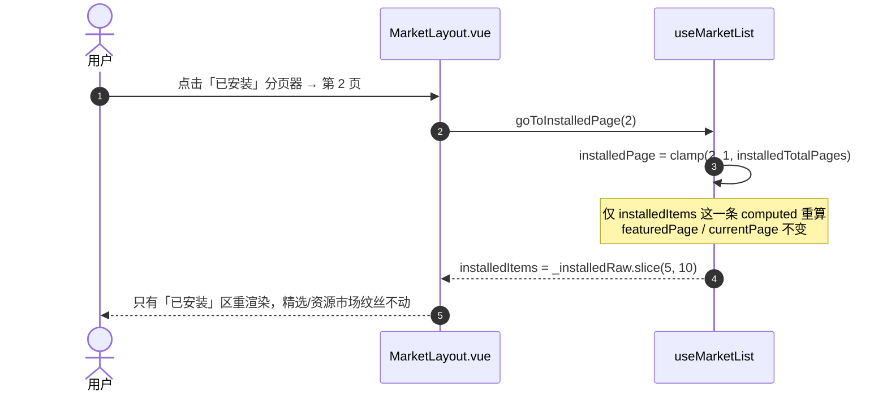
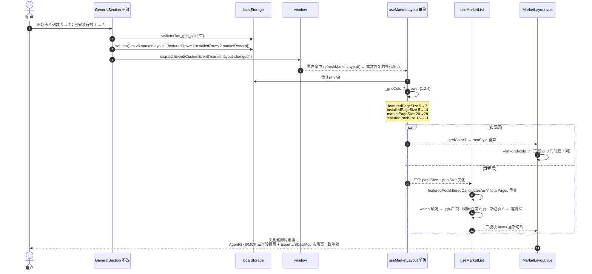
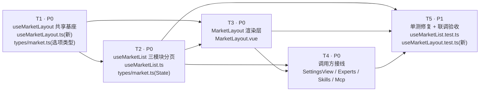

# 设置页三模块卡片布局 —— 系统架构设计与任务分解

> 范围：`packages/client`（Vue 3 + Vite + Naive UI + Pinia + TS）
> 目标：设置页 Agent 角色管理 / Skill 管理 / MCP 管理 三个页面，统一为
> **精选推荐 / 已安装 / 资源市场** 三模块卡片布局，列数由系统设置 `km_grid_cols` 决定，
> 行数由 `km.v3.marketLayout` 分模块配置，**任一模块装不下即独立分页**（不横向滚动、不写死行数）。
> 后端零改动。
>
> 状态：设计稿（不含实现代码）
> 作者：Bob（架构师）

---

## 0. 前置事实核对（已逐行 Read 确认）

| # | 事实 | 位置 | 结论 |
|---|------|------|------|
| F1 | 设置页 agent-role/skills/mcp 真实渲染链路 = `SettingsView.vue` → `MarketLayout.vue` → `config.useList()` → `useMarketList.ts` | `SettingsView.vue:522/525/528` | 本次改造的唯一战场 |
| F2 | `SkillManageSection.vue` / `AgentRoleSection.vue` / `McpManageSection.vue` / `market/CardMarketLayout.vue` 全仓无 import | 全局 grep 仅命中自身 | **死代码，本次不碰、不删** |
| F3 | `MarketLayout.getGridCols()` 用 `window.innerWidth` 断点（1/2/3/4/5），无视 `km_grid_cols` | `MarketLayout.vue:86-93` | 根因① |
| F4 | `PAGE_SIZE = computed(() => getGridCols() * 2)` 为**模块级** computed，行数写死 ×2 | `useMarketList.ts:26` | 根因②（且模块级 → 全实例共享、不响应设置变更） |
| F5 | `featuredItems = _candidateItemsRaw.slice(0, 5)` 写死 top-5 | `useMarketList.ts:97` | 根因③ |
| F6 | `installedItems.value = installed` 整段直出，无分页 | `useMarketList.ts:37/107/117` | 根因④ |
| F7 | 精选 / 已安装模板为 `<NScrollbar x-scrollable>` 横向滚动；仅资源市场是 CSS Grid + `NPagination` | `MarketLayout.vue:239-253 / 265-279 / 363-397` | 根因⑤ |
| F8 | 设置页三份 config 均 `showFeatured: false` | `SettingsView.vue:266/327/372` | 根因⑥ |
| F9 | `market-layout-changed` 事件仅被**死代码**监听（AgentRoleSection/McpManageSection/SkillManageSection），活代码链路无监听者 | `GeneralSection.vue:55/84` dispatch | 根因⑦：改设置无效果 |
| F10 | `GeneralSection.vue` 三个行数输入框 + `writeMarketLayout()` 写完整对象 + 派发事件，**逻辑正确** | `GeneralSection.vue:44-116` | **不动**，仅需下游消费 |
| F11 | `MarketConfig.showFeatured: boolean` 字段已存在 | `types/market.ts:190` | 复用，无需新增 |
| F12 | `MarketLayoutConfig { featuredRows, installedRows, marketRows }` 类型**已存在** | `types/settings.ts:253-260` | **复用，禁止重复定义** |
| F13 | `LS_KEYS.marketLayout = 'km.v3.marketLayout'` 常量**已存在** | `constants/layout.ts:282` | **复用，禁止硬编码字符串** |
| F14 | `--km-grid-cols` CSS 变量的生产者与消费者**全部**在 `MarketLayout.vue` 内 | grep 仅 3 处命中 | 可安全从 `documentElement` 全局写改为组件局部 `:style` |
| F15 | `config.useList()` 全仓仅 1 处调用 | `MarketLayout.vue:47` | 改 `useList` 签名成本极低 |
| F16 | `ExpertsView.showFeatured=true`、`SkillsView.showFeatured=true`、`McpView.showFeatured=false` | 各 View | 非设置页也共用 MarketLayout，连带受益 |
| F17 | `useMarketList.test.ts` 已断言「每页 10 个」「featured 长度 5」 | `useMarketList.test.ts:63-66` | **本次改造必然打破，须同步改测** ⚠️ |

> ⚠️ F17 是主理人任务说明中**未提及**的隐藏工作量，已纳入任务 T5。

---

## 1. 实现方案与框架选型

### 1.1 技术选型

**沿用现有栈，零新增依赖**：Vue 3.x `<script setup>` + Composition API、Naive UI（`NPagination` 已在用）、TypeScript、Vite。纯前端改造，**后端 0 改动**（`GET /api/agents?source=all` 等已返回 `{installed, candidates, categories}`）。

### 1.2 核心技术难点与对策

| 难点 | 对策 |
|------|------|
| **D1 布局配置读取逻辑散落**：`km_grid_cols` 解析规则（纯数字 or JSON 数字、3-8 钳制、回落 5）目前在 `useMarketList` 与 3 个死代码文件各写一遍 | 抽出**唯一真源** composable `useMarketLayout.ts`，`MarketLayout` 与 `useMarketList` 共用 |
| **D2 设置变更不响应**：`PAGE_SIZE` 是模块级 `computed`，其依赖 `localStorage` 非响应式，永不重算 | `useMarketLayout` 内部持有**模块级单例响应式 ref**，由 `market-layout-changed` 事件驱动 `refresh()` 重读 localStorage → 所有下游 computed 自动重算 |
| **D3 事件监听生命周期**：`useMarketList` 由 `config.useList()` 在 MarketLayout setup 内调用，但作为普通函数不保证 `getCurrentInstance()` 可用，`onUnmounted` 不可靠 | `useMarketLayout` 采用**单例 + 一次性绑定（refcount-free）**：监听器在模块首次使用时绑定一次，与组件生命周期解耦，无需 `onUnmounted`，无泄漏（全应用仅 1 个 listener） |
| **D4 三模块独立分页的状态爆炸**：3 组 page/totalPages/pageSize/slice | 用**派生 computed 链**替代现有命令式 `syncDerived()`：raw refs → computed 过滤 → computed 分页切片。页码为唯一可写状态；pageSize 变化时用一个 `watch` 统一钳制页码 |
| **D5 精选数据不存在**：后端无 `featured` 字段 | 精选池 = `candidates` 前 N 项（见 §1.3），并对资源市场做 dedup |
| **D6 dedup 的副作用**：MCP 页 `showFeatured=false`，若无条件 dedup 会导致前 24 个 MCP **凭空消失** | dedup **严格条件化**：仅当精选模块真实生效时才剔除（见 §1.3 `featuredActive`） |
| **D7 三页共用组件的回归风险**：Experts/Skills/Mcp 市场页与设置页共用 MarketLayout | 改动全部收敛在共享层，行为对所有页面一致；MCP 纳入验收范围（§5.5） |

### 1.3 精选推荐（featured）方案 —— 关键决策

**决策 1：精选池取值**

后端无 featured 字段，精选池只能取 `candidates` 的前 N 项（保持后端返回序 = COS 专家池序）。N 需同时满足两个约束：① 有上限，避免几百页；② 尊重「装不下就分页」，不能恒等于一页容量（否则永远 1 页，分页器形同虚设）。

```
featuredPageSize = gridCols × featuredRows
featuredPoolSize = min(FEATURED_POOL_MAX, featuredPageSize × FEATURED_MAX_PAGES)
featuredPool     = _candidatesRaw.slice(0, featuredPoolSize)
```

| 常量 | 值 | 理由 |
|------|----|------|
| `FEATURED_POOL_MAX` | **24** | 绝对上限，防止精选池随列数膨胀 |
| `FEATURED_MAX_PAGES` | **3** | 精选最多 3 页，符合「推荐位」语义，又保留分页能力 |

推演（验证公式合理）：

| gridCols | featuredRows | pageSize | poolSize | 精选页数 |
|---|---|---|---|---|
| 5（默认） | 1（默认） | 5 | min(24, 15)=15 | 3 |
| 3 | 1 | 3 | min(24, 9)=9 | 3 |
| 8 | 2 | 16 | min(24, 48)=**24** | 2 |
| 8 | 3 | 24 | min(24, 72)=**24** | 1 |
| 5 | 4 | 20 | min(24, 60)=**24** | 2 |

**决策 2：dedup（资源市场剔除已进精选的项）**

- **位置**：`useMarketList` 内 `filteredCandidates` computed 的**最前端**（即 category/search/sort 之前）。
  必须在分页之前，否则 `totalPages` 与实际卡片数不符，会出现「某页少几张卡」。
- **条件**（`featuredActive`）——三者同时成立才启用精选模块 **且** 启用 dedup：

```ts
featuredActive = opts.showFeatured
              && searchQuery.trim() === ''
              && selectedCategory === ''
```

  - `showFeatured=false`（如 McpView）→ 不显示精选、**不 dedup**，杜绝 D6「卡片凭空消失」。
  - 用户一旦搜索或选分类 → 精选模块隐藏（`featuredItems` 为空），dedup 同步关闭 → **搜索结果完整**，不会搜不到被精选吸走的项。
  - 「精选是否显示」与「是否 dedup」由**同一个布尔量**驱动，天然自洽，不会出现半边生效的状态。

**决策 3：`showFeatured` 如何传进 `useMarketList`**

`config.useList()` 是零参闭包，拿不到 `config.showFeatured`。方案：把 `useList` 签名改为接收 options，由 `MarketLayout` 从 `props.config.showFeatured` **单一真源**下发：

```ts
// types/market.ts
useList: (opts: MarketListOptions) => MarketListState;
// MarketLayout.vue
const marketState = props.config.useList({ showFeatured: props.config.showFeatured });
```

TS 中「少参函数可赋值给多参函数类型」，因此 6 个 config 站点**不会编译报错**，可渐进适配（不改则退化为 `showFeatured:false` 的安全默认）。需要 dedup 的站点显式改为 `(o) => useMarketList(fetchAllX, o)`。

### 1.4 架构模式

分层 + 单向数据流，共 3 层：

```
[配置层]  localStorage(km_grid_cols / km.v3.marketLayout) + GeneralSection(只写)
              │  window 'market-layout-changed'
              ▼
[布局层]  useMarketLayout.ts（单例响应式，唯一真源，只读消费）
              │  gridCols / featuredPageSize / installedPageSize / marketPageSize
              ├──────────────────────────────┐
              ▼                              ▼
[数据层]  useMarketList.ts              [视图层] MarketLayout.vue
          （三模块分页切片）      ←────       （三段 CSS Grid + 三个 NPagination）
```

---

## 2. 文件列表（相对 `packages/client/`）

| 文件 | 动作 | 说明 |
|------|------|------|
| `src/composables/useMarketLayout.ts` | **新增** | 布局配置唯一真源：读 `km_grid_cols` + `km.v3.marketLayout`，监听 `market-layout-changed`，导出响应式 `gridCols` / 三个 `*PageSize` / `refreshMarketLayout()` |
| `src/composables/useMarketList.ts` | **改** | 三模块独立 pageSize/页码；命令式 `syncDerived` → 派生 computed；精选池 top-N；条件 dedup；`load()` 不再重置为空数组 |
| `src/components/common/MarketLayout.vue` | **改** | 列数改读 `useMarketLayout().gridCols`（删除 `window.innerWidth` 断点与 resize 监听）；精选/已安装由 `NScrollbar` 横滚改为 CSS Grid + `NPagination`；`useList` 传 options；`--km-grid-cols` 由全局 `documentElement` 改为 `.ml-root` 局部 `:style` |
| `src/views/SettingsView.vue` | **改** | 三份 config `showFeatured: false → true`；`useList: (o) => useMarketList(fetchAllX, o)` |
| `src/views/ExpertsView.vue` | **改** | 1 行：`useList: (o) => useMarketList(fetchAllExpert, o)`（已 `showFeatured:true`，需接通 dedup） |
| `src/views/SkillsView.vue` | **改** | 同上 |
| `src/views/McpView.vue` | **改** | 1 行同上（`showFeatured:false` 保持，仅统一签名；是否开精选见 §7-Q2） |
| `src/types/market.ts` | **改** | 新增 `MarketListOptions`；`MarketConfig.useList` 签名加 opts；`MarketListState` 增三模块分页字段 |
| `src/composables/useMarketList.test.ts` | **改** | 既有断言（每页 10、featured=5）必然失败，须重写；`beforeEach` 需 `refreshMarketLayout()` |
| `src/composables/useMarketLayout.test.ts` | **新增（建议）** | 覆盖钳制/回落/事件刷新 |
| `src/components/settings/GeneralSection.vue` | **不动** ✅ | F10 已核实逻辑正确，仅作为写入方 |
| `src/types/settings.ts` | **不动** ✅ | 复用既有 `MarketLayoutConfig`（F12） |
| `src/constants/layout.ts` | **不动** ✅ | 复用既有 `LS_KEYS.marketLayout`（F13） |
| `src/components/settings/{SkillManageSection,AgentRoleSection,McpManageSection}.vue`<br>`src/components/market/CardMarketLayout.vue` | **不动 / 不删** 🚫 | 死代码（F2），留待后续清理专项 |
| `packages/server/**` | **不动** 🚫 | 后端零改动；`cos-cache.ts` / `skillhub.ts` / `aggregate/skills.ts` / `aggregate/mcp.ts` 为 **G4 红线** |

---

## 3. 数据结构与接口

### 3.1 类图



### 3.2 `useMarketLayout.ts` 接口契约（新增）

```ts
/** 单例：全应用共享一份布局状态；listener 仅绑定一次，与组件生命周期解耦 */
export function useMarketLayout(): {
  gridCols:          ComputedRef<number>;   // 3..8，回落 5
  featuredRows:      ComputedRef<number>;   // 1..10，回落 1
  installedRows:     ComputedRef<number>;   // 1..10，回落 1
  marketRows:        ComputedRef<number>;   // 1..10，回落 4
  featuredPageSize:  ComputedRef<number>;   // gridCols × featuredRows
  installedPageSize: ComputedRef<number>;   // gridCols × installedRows
  marketPageSize:    ComputedRef<number>;   // gridCols × marketRows
  featuredPoolSize:  ComputedRef<number>;   // min(24, featuredPageSize × 3)
};

/** 强制重读 localStorage —— 事件回调内部使用；单测 beforeEach 必须调用 */
export function refreshMarketLayout(): void;
```

**解析规则（唯一真源，禁止在别处重写）**

```ts
// km_grid_cols：可能是 "5" 也可能是 JSON 数字 5（历史遗留两种写法，均需兼容）
readGridCols():
  raw = localStorage.getItem('km_grid_cols')            // SSR/单测 localStorage 可能 undefined → 5
  n   = Number(String(raw ?? '').replace(/"/g, ''))
  return Number.isFinite(n) && n >= 3 && n <= 8 ? Math.floor(n) : 5

// km.v3.marketLayout（键名取 LS_KEYS.marketLayout，禁止硬编码）
readRows():
  try { parsed = JSON.parse(localStorage.getItem(LS_KEYS.marketLayout) ?? '') } catch { → 默认值 }
  featuredRows  = clampInt(parsed.featuredRows,  1, 10, 1)
  installedRows = clampInt(parsed.installedRows, 1, 10, 1)
  marketRows    = clampInt(parsed.marketRows,    1, 10, 4)
```

**事件绑定（`bindOnce`，模块级只执行一次）**

```ts
window.addEventListener('market-layout-changed', refreshMarketLayout);
window.addEventListener('storage', e => {                  // 跨标签页同步（增益，非必须）
  if (e.key === 'km_grid_cols' || e.key === LS_KEYS.marketLayout) refreshMarketLayout();
});
```

> 不使用 `onMounted/onUnmounted`：`useMarketList` 可能在非组件上下文（单测）中调用；
> 单例监听器全应用仅 1 份，无泄漏风险。

### 3.3 `MarketListState` 变更清单（`types/market.ts`）

| 字段 | 变更 | 语义 |
|------|------|------|
| `installedItems` | 类型 `Ref` → `ComputedRef`，**改为当前页切片** | 已安装模块当前页 |
| `candidateItems` | 类型 `Ref` → `ComputedRef` | 资源市场当前页（含 dedup） |
| `featuredItems` | 类型 `Ref` → `ComputedRef`，**改为当前页切片** | 精选当前页；`featuredActive=false` 时为 `[]` |
| `categories` | 类型 `Ref` → `ComputedRef` | 同前 |
| `currentPage` / `totalPages` / `goToPage` | **保留原名**（= 资源市场），`totalPages` 转 `ComputedRef` | 减少调用方改动 |
| `featuredPage` / `featuredTotalPages` / `goToFeaturedPage` | **新增** | 精选独立分页 |
| `installedPage` / `installedTotalPages` / `goToInstalledPage` | **新增** | 已安装独立分页 |
| `findById(id)` | **新增（可选，建议）** | 在**全量 raw 数据**中查 id，替代 MarketLayout 现有仅查分页切片的 `findItem`，消除跨页误查风险 |

> `ComputedRef<T>` 结构上兼容 `Ref<T>`，模板 `.value` 读法与自动解包均不受影响。
> 改为 computed 后，`load()` 的 catch 分支只需清空两个 raw ref，**不再需要逐个赋 `[]`**（现 `useMarketList.ts:115-121` 那 7 行可删）。

### 3.4 `MarketConfig` 变更

```ts
export interface MarketListOptions { showFeatured: boolean }

export interface MarketConfig {
  // ...不变
  showFeatured: boolean;
  useList: (opts: MarketListOptions) => MarketListState;   // ← 唯一签名变更
}
```

### 3.5 `useMarketList` 内部派生链（伪代码，供实现参考）

```ts
export function useMarketList(
  fetchAll: () => Promise<{installed: ResourceItem[]; candidates: ResourceItem[]}>,
  opts: MarketListOptions = { showFeatured: false },
): MarketListState {
  const L = useMarketLayout();

  const _installedRaw  = ref<ResourceItem[]>([]);
  const _candidatesRaw = ref<ResourceItem[]>([]);
  const featuredPage = ref(1), installedPage = ref(1), currentPage = ref(1);

  // ① 精选是否生效（同时决定 dedup）
  const featuredActive = computed(() =>
    opts.showFeatured && !searchQuery.value.trim() && !selectedCategory.value);

  // ② 精选池（不受搜索/分类影响，保持"推荐位"稳定语义）
  const featuredPool = computed(() =>
    featuredActive.value ? _candidatesRaw.value.slice(0, L.featuredPoolSize.value) : []);

  // ③ 资源市场：dedup → 分类 → 搜索 → 排序（顺序不可换：dedup 必须最先、在分页前）
  const filteredCandidates = computed(() => {
    const exclude = new Set(featuredPool.value.map(i => i.id));
    let list = _candidatesRaw.value.filter(i => !exclude.has(i.id));
    if (selectedCategory.value) list = list.filter(i => i.tags.includes(selectedCategory.value));
    const q = searchQuery.value.trim().toLowerCase();
    if (q) list = list.filter(i => i.name.toLowerCase().includes(q)
                                || i.description.toLowerCase().includes(q));
    return sortItems(list);                       // 'hot' | 'newest' | 'default'，逻辑不变
  });

  // ④ 三模块各自 totalPages + 当前页切片
  const pageSlice = (src, page, size) => src.slice((page - 1) * size, page * size);
  const featuredTotalPages  = computed(() => Math.max(1, Math.ceil(featuredPool.value.length      / L.featuredPageSize.value)));
  const installedTotalPages = computed(() => Math.max(1, Math.ceil(_installedRaw.value.length     / L.installedPageSize.value)));
  const totalPages          = computed(() => Math.max(1, Math.ceil(filteredCandidates.value.length/ L.marketPageSize.value)));
  const featuredItems  = computed(() => pageSlice(featuredPool.value,       featuredPage.value,  L.featuredPageSize.value));
  const installedItems = computed(() => pageSlice(_installedRaw.value,      installedPage.value, L.installedPageSize.value));
  const candidateItems = computed(() => pageSlice(filteredCandidates.value, currentPage.value,   L.marketPageSize.value));

  // ⑤ pageSize / 数据量变化后钳制页码（防越界白屏）
  watch([featuredTotalPages, installedTotalPages, totalPages], () => {
    featuredPage.value  = Math.min(featuredPage.value,  featuredTotalPages.value);
    installedPage.value = Math.min(installedPage.value, installedTotalPages.value);
    currentPage.value   = Math.min(currentPage.value,   totalPages.value);
  });

  // ⑥ 过滤/搜索/排序时，只重置资源市场页码（精选/已安装不受影响）
  //    filterByCategory / search / setSort → currentPage.value = 1
  //    load() → 三个页码全部回 1
}
```

---

## 4. 程序调用流程

### 4.1 首屏：打开设置页 → 三模块渲染



### 4.2 交互：切换某一模块页码（三模块互不干扰）



### 4.3 响应式：修改系统设置 → 全局重排



### 4.4 边界流程：搜索时精选让位

```mermaid
sequenceDiagram
    autonumber
    actor U as 用户
    participant ML as MarketLayout.vue
    participant UL as useMarketList

    U->>ML: 搜索框输入 "写作"
    ML->>UL: search("写作")
    UL->>UL: searchQuery="写作"; currentPage=1
    Note over UL: featuredActive = showFeatured && !q && !cat → false
    UL->>UL: featuredPool = [] → dedup 关闭
    UL-->>ML: featuredItems=[]（精选区 v-if 自动隐藏）<br/>candidateItems = 全量 132 项中的匹配结果（不漏项）
    ML-->>U: 只剩「已安装」+「资源市场」；搜索结果完整
    U->>ML: 清空搜索
    UL-->>ML: featuredActive 恢复 true → 精选区回归、dedup 恢复
```

---

## 5. 视图层改造细则（MarketLayout.vue）

### 5.1 列数注入方式变更

| 项 | 现状 | 改后 |
|----|------|------|
| 来源 | `window.innerWidth` 断点 → 1/2/3/4/5 | `useMarketLayout().gridCols` → `km_grid_cols`（3-8，回落 5） |
| 注入 | `document.documentElement.style.setProperty(...)`（全局副作用） | `.ml-root` 上 `:style="{ '--km-grid-cols': gridCols }"`（局部、自动响应） |
| 监听 | `onMounted/onUnmounted` + `resize` | **全部删除**（F14 已证实 `--km-grid-cols` 无外部消费者） |

> `:style` 绑定 CSS 自定义属性时，类型用既有 `CssVars`（`types/settings.ts:267`，`[key: \`--${string}\`]: string`）。

### 5.2 三模块模板结构（统一形态）

三段结构完全同构，便于抽公共子模板：

```
<section class="ml-section" v-if="<该模块有数据>">
  <h3 class="ml-section-title">…（已安装保留 ml-count 总数徽标，用 raw 总数而非当页数）</h3>
  <div class="ml-card-grid">   ← 复用既有 grid（repeat(var(--km-grid-cols,5), 1fr)）
    <ResourceCard v-for="item in <模块当前页>" :key="`<前缀>-${item.id}`" …/>
  </div>
  <div class="ml-pagination" v-if="<模块 totalPages> > 1">
    <NPagination :page="<模块 page>" :page-count="<模块 totalPages>" size="small"
                 @update:page="<模块 goTo>"/>
  </div>
</section>
```

- 精选区 `v-if="config.showFeatured && marketState.featuredItems.value.length"`（保持不变即可，`featuredActive=false` 时数组为空自动隐藏）。
- **已安装徽标数量**：必须显示 `raw` 总数，不能显示当页长度 → 需 `installedTotalCount`（可由 `installedTotalPages` 场景补一个 computed，或直接暴露 `installedCount`）。⚠️ 实现时勿踩此坑。
- 删除 `NScrollbar` import（若全文件不再使用）与 `.ml-hscroll-row` 样式。
- 资源市场区的分类标签/排序行（`ml-tabs-sort-row` / `ml-category-row`）**保持原位不动**。

### 5.3 骨架屏

`.km-skel-grid` 已用同一 CSS 变量；建议骨架数量由固定 `v-for="n in 6"` 改为 `gridCols * 2`，使加载态与真实列数一致（低优先级，P2）。

### 5.4 `findItem` 加固

现 `findItem` 只在三个**分页切片**里找。改造后建议切到 `marketState.findById(id)`（在 raw 全量中查），避免未来任何异步/乐观更新场景下的跨页误查。

### 5.5 连带影响（受益且需验收）

| 页面 | showFeatured | 改造后表现 |
|------|-------------|-----------|
| 设置页 Agent 角色管理 | false → **true** | 三模块齐全，列数/行数受控 ✅ |
| 设置页 Skill 管理 | false → **true** | 同上 ✅ |
| 设置页 MCP 管理 | false → **true** | 同上 ✅（纳入验收） |
| ExpertsView（市场页） | true（不变） | 精选由横滚改为 grid+分页；dedup 生效 |
| SkillsView（市场页） | true（不变） | 同上 |
| McpView（市场页） | false（不变） | 已安装改 grid+分页；**无精选、无 dedup**（不丢卡） |

---

## 6. 任务分解

> 说明：本项目为**存量代码外科手术**，无脚手架/基础设施可建，故首任务不是「项目基础设施」而是「共享基础 composable」——它承担同等的"地基"角色（下游 T2/T3 均依赖）。
> 共 **5** 个任务，符合上限；建议严格按 T1→T5 顺序实施，每个任务结束即 `pnpm -F client build` + `vitest run` 自检。

### 依赖总览



### T1 · 布局配置共享基座 【P0，无依赖】

**源文件**
- 新增 `packages/client/src/composables/useMarketLayout.ts`
- 改 `packages/client/src/types/market.ts`（仅新增 `MarketListOptions`）

**内容**
1. 实现 §3.2 全部导出与 §3.2 解析规则；常量 `GRID_COLS_MIN/MAX`、`DEFAULT_GRID_COLS`、`ROWS_MIN/MAX`、`FEATURED_POOL_MAX=24`、`FEATURED_MAX_PAGES=3` 均具名导出。
2. 复用 `types/settings.ts` 的 `MarketLayoutConfig`（**禁止重复定义**）、`constants/layout.ts` 的 `LS_KEYS.marketLayout`（**禁止硬编码字符串**）。
3. 模块级单例 + `bindOnce()`；`localStorage`/`window` 不存在时全部走默认值且不抛错（单测/SSR 安全）。
4. 导出 `refreshMarketLayout()`。

**验收**：`tsc` 通过；node 环境（无 window）import 不抛错；手工在 devtools 改 localStorage + `window.dispatchEvent(new CustomEvent('market-layout-changed'))` 后 ref 值变化。

---

### T2 · useMarketList 三模块独立分页 【P0，依赖 T1】

**源文件**
- 改 `packages/client/src/composables/useMarketList.ts`
- 改 `packages/client/src/types/market.ts`（`MarketListState` 扩展 + `MarketConfig.useList` 签名）

**内容**
1. 删除文件内 `getGridCols()` 与模块级 `PAGE_SIZE`，改用 `useMarketLayout()`。
2. 新增第二参数 `opts: MarketListOptions = { showFeatured: false }`。
3. 按 §3.5 重构：raw refs → `featuredActive` → `featuredPool` → `filteredCandidates`（**dedup 必须在最前、分页之前**）→ 三组 `totalPages`/切片 computed → `watch` 钳制页码。
4. 新增 `featuredPage/featuredTotalPages/goToFeaturedPage`、`installedPage/installedTotalPages/goToInstalledPage`；保留 `currentPage/totalPages/goToPage` 语义为资源市场。
5. 暴露已安装总数（供徽标）与 `findById(id)`（建议）。
6. `load()` 成功后三页码归 1；catch 分支简化为只清 raw refs。
7. 更新文件头注释（现注释写「每页 10 个」「featured top-5」已过期）。

**验收**：`tsc` 通过；`filterByCategory/search/setSort` 仅重置资源市场页码；`showFeatured:false` 时 `candidateItems` 总数 == candidates 总数（**不丢项**，D6 回归点）。

---

### T3 · MarketLayout 渲染层改造 【P0，依赖 T1、T2】

**源文件**
- 改 `packages/client/src/components/common/MarketLayout.vue`

**内容**
1. 删除 `getGridCols()`（`window.innerWidth`）、`updateGridCols()`、`onMounted/onUnmounted` 的 resize 监听、`documentElement.style.setProperty`。
2. 引入 `useMarketLayout()`，在 `.ml-root` 上 `:style` 注入 `--km-grid-cols`（类型用 `CssVars`）。
3. `props.config.useList({ showFeatured: props.config.showFeatured })`。
4. 精选、已安装两段：`NScrollbar + ml-hscroll-row` → `ml-card-grid` + `NPagination`（§5.2 同构结构）。
5. 已安装徽标改用**总数**而非当页长度（§5.2 ⚠️）。
6. `findItem` → `marketState.findById`；清理 `NScrollbar` import 与 `.ml-hscroll-row` 样式。
7.（P2）骨架屏数量改 `gridCols * 2`。

**验收**：三段区域列数一致且等于设置值；任一模块超出即出现自己的分页器；三个分页器互不联动。

---

### T4 · 调用方接线 【P0，依赖 T2、T3】

**源文件**
- 改 `packages/client/src/views/SettingsView.vue`（`:266/:327/:372` → `showFeatured: true`；三处 `useList: (o) => useMarketList(fetchAllX, o)`）
- 改 `packages/client/src/views/ExpertsView.vue`（`:72` 传 opts）
- 改 `packages/client/src/views/SkillsView.vue`（`:79` 传 opts）
- 改 `packages/client/src/views/McpView.vue`（`:63` 传 opts，`showFeatured` 维持 false）

**内容**：仅签名与开关，**不动任何 `fetchAll*` 数据映射逻辑**（`mapCandidate`/`mapCandidateSkill` 的 D1 去重口径保持原样）。

**验收**：设置页三个 Tab 均出现「精选推荐」；MCP 市场页无精选且候选总数不变。

---

### T5 · 单测修复与联调验收 【P1，依赖 T2、T3、T4】

**源文件**
- 改 `packages/client/src/composables/useMarketList.test.ts` ⚠️ **必做**
- 新增 `packages/client/src/composables/useMarketLayout.test.ts`（建议）

**内容**
1. 现有断言 `candidateItems.length === 10`、`totalPages === 2`、`featuredItems.length === 5`（`:63-66`）在新口径下必然失败 → 按 gridCols/rows 显式设定 localStorage 后重算期望值。
2. 每个用例 `beforeEach` 内先写 localStorage 再 **`refreshMarketLayout()`**（单例在 import 时已初始化，不刷新则读不到）。
3. 新增用例：三模块页码互不干扰；`showFeatured:false` 不 dedup（防 D6）；搜索时精选隐藏且结果不漏项；pageSize 变小时页码被钳制；`km_grid_cols` 非法值回落 5。
4. 手工验收清单（6 页面 × 3 模块）：
   - 设置页 Agent / Skill / MCP：列数 = 设置值（试 3 / 5 / 8）；三模块各自行数正确；装不下出现独立分页器。
   - 改设置后**无需刷新**即时重排（含正在打开的其他 Tab）。
   - Experts / Skills / Mcp 市场页无回归；MCP 候选总数与改造前一致。
   - 安装/卸载/召唤/卡片点击详情面板均正常。

**验收**：`vitest run` 全绿；`pnpm -F client build` 无 TS 错误；手工清单全过。

---

## 7. 依赖包

**无新增依赖。** `vue`、`naive-ui`（`NPagination` 已在用）、`typescript`、`vitest` 均为既有。后端 `package.json` 不动。

---

## 8. 共享知识（跨文件约定，实现者必读）

| 约定 | 内容 |
|------|------|
| **列数键** | `localStorage['km_grid_cols']`，字符串数字或 JSON 数字均需兼容；有效区间 **3–8**（整数），非法/缺失 → **5** |
| **行数键** | `localStorage[LS_KEYS.marketLayout]`（`'km.v3.marketLayout'`），值为 JSON 对象 `{ featuredRows, installedRows, marketRows }`；各项有效区间 **1–10**（整数），缺失默认 **featured=1 / installed=1 / market=4** |
| **类型复用** | 行数配置类型 **必须**复用 `types/settings.ts` 的 `MarketLayoutConfig`；键名 **必须**用 `constants/layout.ts` 的 `LS_KEYS.marketLayout`。禁止新建同名类型或硬编码字符串 |
| **唯一真源** | 读取/钳制/回落逻辑 **只允许**存在于 `useMarketLayout.ts`。其他文件一律 `useMarketLayout()`，不得再写 `localStorage.getItem('km_grid_cols')` |
| **每页数量公式** | `<模块>PageSize = gridCols × <模块>Rows`（featured / installed / market 三份独立） |
| **精选池公式** | `featuredPoolSize = Math.min(FEATURED_POOL_MAX, featuredPageSize × FEATURED_MAX_PAGES)`；`FEATURED_POOL_MAX = 24`、`FEATURED_MAX_PAGES = 3`，均在 `useMarketLayout.ts` 具名导出 |
| **精选生效条件** | `featuredActive = opts.showFeatured && 搜索为空 && 未选分类`。它**同时**控制「精选区是否显示」与「资源市场是否 dedup」，二者必须同生同灭 |
| **dedup 位置** | `useMarketList` 的 `filteredCandidates` computed **最前端**，先于 category/search/sort，**必须**在分页切片之前 |
| **变更事件** | `window` CustomEvent `'market-layout-changed'`（无 detail）。写方：`GeneralSection.vue`（不改）；读方：`useMarketLayout.ts` 单例（唯一监听者）。**死代码中的同名监听器不算数** |
| **CSS 变量** | `--km-grid-cols` 由 `MarketLayout.vue` 在 `.ml-root` 局部注入，作用域内所有 `.ml-card-grid` / `.km-skel-grid` 继承；**不再**写 `document.documentElement` |
| **分页命名** | 资源市场沿用 `currentPage/totalPages/goToPage`（历史名，语义 = market）；精选/已安装用 `featured*`/`installed*` 前缀。三组页码完全独立，切换其一不得影响其余 |
| **页码钳制** | 任何 pageSize 或数据量变化后，页码必须 `Math.min(page, totalPages)` 钳制；`totalPages` 恒 `>= 1` |
| **红线** | 🚫 不碰 `cos-cache.ts` / `skillhub.ts` / `aggregate/skills.ts` / `aggregate/mcp.ts`（G4）；🚫 不改不删死代码 4 文件（F2）；🚫 不改 `GeneralSection.vue`；🚫 后端零改动 |
| **git** | 禁 `git stash` / `gc` / `repack` / `prune` / `worktree`；不 push |

---

## 9. 待明确事项 / 风险

| # | 问题 | 现状与建议 | 影响 |
|---|------|-----------|------|
| Q1 | `FEATURED_POOL_MAX=24`、`FEATURED_MAX_PAGES=3` 是否符合产品预期？默认 5 列 1 行时精选为 3 页 15 项 | 建议按本设计落地；两个常量集中在 `useMarketLayout.ts`，调优只需改一行 | 低（可随时调参） |
| Q2 | `McpView`（**非**设置页的 MCP 市场页）`showFeatured` 仍为 `false`，与 Experts/Skills 不一致 | 本次**不改**（超出需求范围）。若产品要求三个市场页一致，追加 1 行改 `true` 即可，属 P2 | 低 |
| Q3 | 「精选池取 candidates 前 N 项」= 依赖后端返回序。若 COS 专家池顺序随机/易变，精选内容会漂移 | 需产品确认后端序是否稳定。若不稳定，后续可让后端补 `featured`/`weight` 字段（本次不做） | 中（数据质量，非功能性缺陷） |
| Q4 | 「已安装」模块的排序：当前 `installedItems` 直接用后端序，未参与 `sortOrder`/搜索 | 保持现状（改造前亦如此）。若需已安装也可搜索/排序，是**新需求**，需另立任务 | 低 |
| Q5 | `sortOrder='newest'` 实现为 `copy.reverse()`（伪逆序，非按时间） | 存量问题，本次**不修**，避免扩大范围 | 低 |
| Q6 | 死代码 4 文件（`SkillManageSection` / `AgentRoleSection` / `McpManageSection` / `CardMarketLayout`）持续存在，后续排查易再次误改 | 建议本次改造后单开「死代码清理」专项 PR | 中（可维护性） |
| Q7 | 行数上限 10 为设计取值，`GeneralSection` 的 `NInputNumber` 是否已有 max 约束未逐行确认 | `useMarketLayout` 侧统一钳制到 1–10，即使 UI 放行更大值也安全 | 低 |

---

## 10. 变更影响面小结

- **改动文件**：9 个（新增 2、修改 7），全部在 `packages/client/src`。
- **后端**：0 改动。
- **新依赖**：0。
- **删除代码**：`window.innerWidth` 断点、resize 监听、全局 `documentElement` 写入、模块级 `PAGE_SIZE`、写死 top-5、两处 `NScrollbar` 横滚、`load()` catch 中 7 行冗余清空。
- **净收益**：一处配置（系统设置）驱动 6 个页面 × 3 个模块的布局，配置读取逻辑从 4 处收敛到 1 处。
